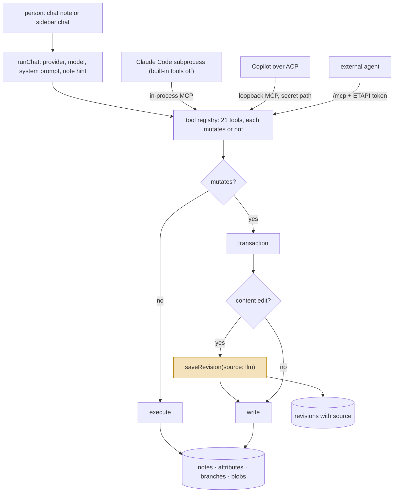
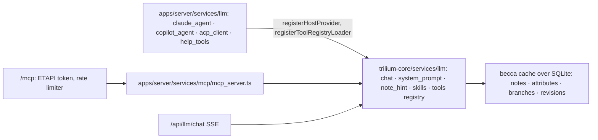

## 1. Executive Summary

Trilium Notes is a hierarchical note application — a tree in which one note
may appear in several places, attributes, scripting, sync — in development
since May 2017 under the AGPL, forked and continued as TriliumNext, at
version 0.105.0 at this commit. Its AI integration is off by default,
ships no model, and documents where a person's notes travel for each
provider type before anything is sent (`docs/User Guide/User Guide/AI/Privacy.md`).
It is in this atlas beside [Joplin](../joplin/), [Logseq](../logseq/) and
[SiYuan](../siyuan/) as a knowledge base with an assistant in it, and it
earns its own report for one design decision and one record.

**The decision: one tool registry.** Twenty-one tools are defined once in
`packages/trilium-core/src/services/llm/tools/` — nine on notes, four on
attributes, four on hierarchy, two on attachments, one on icons, one that
loads a skill sheet — each with a description, a Zod schema, a synchronous
`execute` and a `mutates` flag (`tool_registry.ts:24-45`). The in-app chat
converts the registry to an AI SDK tool set; the MCP server iterates the
same registry and wraps every `mutates` tool in a transaction
(`apps/server/src/services/mcp/mcp_server.ts:24-58`); the Claude Agent
provider points the user's own Claude Code at that MCP server with every
built-in tool disabled (`providers/claude_agent.ts:2-21`); the Copilot
provider exposes it on a loopback endpoint under a random 128-bit path
(`copilot_mcp_endpoint.ts`). An external agent over `/mcp` needs an ETAPI
bearer token, and the route's rate limiter spends its budget only on
requests it would answer 401 to (`apps/server/src/routes/mcp.ts:51-60`).

**The record: a revision before every assistant edit.** `set_note_content`,
`append_to_note` and `edit_note_content` call `note.saveRevision({ source:
"llm" })` before writing (`tools/note_tools.ts:119,162,222`), and the
revisions table has a `source` column that keeps it
(`packages/trilium-core/src/assets/schema.sql:46-52`,
`becca/entities/brevision.ts:34-67`). The store can therefore answer *what
did the assistant change* for content edits, one revision at a time. No
test asserts the source, and create, rename, move and delete leave no
such mark.

Everything else is a note application's memory. There is no fact store,
no embedding, no indexer and no consolidation; `search_notes` is Trilium's
search syntax, and a `load_skill` tool hands the model the syntax sheet
when the question needs it. The chat itself is a note. Every capability
mark is withheld: the revision is a prior-state snapshot the atlas counts
as history, the protected flag is encryption rather than scope, and the
tests assert what a tool refuses rather than what a search must not
return.

## 2. Mental Model

A memory is a **note**. The assistant sees it through a hint about the note
the person is looking at and through tools it may call when *Note access*
is on:

The highlighted step is the one the store keeps. A revision is the note
as it was before the assistant touched it, labelled with who was about to
touch it; the person's own revisions are labelled `auto` or by their
description. Recovery is the app's revision view, and the documentation
says so in one line.

Nothing is a belief. A note is content; a protected note is encrypted and
refused; a deleted note is soft-deleted with the app's own recovery
window. The assistant has no memory but the chat note it is in.

## 3. Architecture

TypeScript monorepo: `apps/server` (Node), `apps/client`, `packages/trilium-core`
(the model and, since the standalone build, the LLM stack), 37,471 commits
by the GitHub count since 2017-05-23. The parts this report reads:

- `packages/trilium-core/src/services/llm/` — 4,147 lines: `chat.ts`
  (one completion, provider-agnostic), `system_prompt.ts`, `note_hint.ts`,
  `skills.ts`, `stream.ts`, `providers/`, and `tools/` with the registry;
  23 spec files, 350 cases.
- `apps/server/src/services/llm/` — the Node-only pieces: the Claude Agent
  and Copilot providers, the ACP client, binary lookup, the loopback MCP
  endpoint, the User Guide help tools; 10 spec files.
- `apps/server/src/services/mcp/mcp_server.ts` and `routes/mcp.ts` — the
  public MCP server and its guard.
- `apps/client/src/widgets/type_widgets/llm_chat/` — the chat note widget:
  messages, tool-call cards, an edit diff view, save-to-note.

### Deployment and ergonomics

- **What has to run:** the server or the desktop app; a provider — cloud
  with a key, Ollama or LM Studio locally, a custom endpoint, or Claude
  Code and Copilot binaries on the machine.
- **Fully local and offline:** the notes, yes; the assistant, with a local
  provider, yes. No model ships with it.
- **Hand-repairable:** yes. SQLite, a revisions table, an app with a
  revision viewer.
- **Install:** a normal application or a Docker image; MCP is a toggle in
  Options plus an ETAPI token.

## 4. Essential Implementation Paths

**The turn.** `runChat` (`chat.ts:30`): resolve the host-registered tool
registries, pick the provider by config id or type, choose the model,
build the system prompt (`system_prompt.ts:24`) — base prompt, the
note-tools guidance when `enableNoteTools` is set, a web-search notice,
Markdown hints — inject the current-note hint into the user turn
(`note_hint.ts:18`), and stream chunks. Never throws; an error is a chunk.

**The registry.** `defineTools({...})` per module; `ToolRegistry`
(`tool_registry.ts:49`) iterates `[name, def]` for MCP and converts to an
AI SDK tool set for chat. `execute` must be synchronous because
better-sqlite3 transactions are.

**Note tools** (`tools/note_tools.ts`): `search_notes` (17) with
`fastSearch`, `includeArchivedNotes`, `ancestorNoteId` and `limit`;
`get_note` (64); `get_note_content` (79) — refuses a protected note (90);
`set_note_content` (100), `append_to_note` (130), `edit_note_content`
(173) — each refuses protected and binary notes and saves a revision;
`create_note` (233) — refuses a protected parent; `rename_note` (301);
`delete_note` (333) — refuses system and protected notes, soft-deletes.

**Edits.** `edit_note_content` takes one or more `{oldText, newText}` pairs,
each of which must match exactly once, applied in order (173-232); the
client renders the result as a diff (`EditNoteContentDiff.tsx`).

**MCP.** `createMcpServer` (`mcp_server.ts:41`) registers every registry
entry; `registerTool` (24) runs `mutates` tools inside `sql.transactional`
under a CLS context tagged `mcp`. `routes/mcp.ts` mounts POST, GET and
DELETE on `/mcp` behind `mcpGuard`; `resolveMcpAccess` (97) denies
everything with 403 while the option is off and 401 without a valid ETAPI
token; the limiter allows ten failures per fifteen minutes per address.

**Claude Agent provider** (`providers/claude_agent.ts`): drives the user's
installed `claude` binary through the Agent SDK, maps chat notes to agent
sessions and resumes when the transcript still matches, and hands the
agent an in-process MCP server as its only tools.

**Copilot provider** (`providers/copilot_agent.ts`, `copilot_mcp_endpoint.ts`):
ACP accepts MCP servers by URL only, so Trilium's MCP server is bound to
127.0.0.1 on a random port under a random path, separate from the public
route and its option.

## 5. Memory Data Model

The application's model, unchanged: a note with a type, a title, content in
a blob, attributes (labels and relations), branches to parents, `isProtected`,
`isDeleted` with a delete id; revisions with `noteId`, `title`, `source`,
`isProtected` and dates. The AI feature adds a chat note type whose content
is the message list (`llm_chat_types.ts`, `useLlmChat.ts:490-510`) and a
`source` value of `llm` on revisions.

**Temporal:** created and modified dates on notes and revisions; no
validity interval. `bitemporal` withheld.

**Trust:** none on content. `trust_state` withheld.

**Scoping:** one database, one login. `isProtected` is a stored flag every
tool refuses (`note_tools.spec.ts:143,350,371,396`), but it is encryption of
a note the same person owns, not a key that partitions reads by principal;
`ancestorNoteId` is a filter the caller chooses. `scope_enforced` withheld.

**Attribution:** the revision's `source`. It is the one place the store
records the assistant as an actor, and it covers content edits only.

## 6. Retrieval Mechanics

1. **The note hint.** For the sidebar chat with note context on, the user
   turn carries a metadata block — id, title, type, dates, parents, up to
   twenty children, up to twenty attributes, a content preview, or a size
   hint above a threshold (`note_hint.ts`, `Privacy.md`) — so a question
   about the open note needs no tool call. The dedicated chat note never
   sends a current note.
2. **`search_notes`.** Trilium's search syntax through `SearchContext`;
   results mapped to summaries with stale ids skipped and truncated to the
   limit (`note_tools.spec.ts:278-314`). No ranking beyond the app's, no
   embedding anywhere (`rg -n -i 'embedding'` over the two LLM directories
   finds only provider option names).
3. **Skill sheets.** `load_skill` returns one of four Markdown sheets —
   search syntax, frontend scripting, backend scripting, dashboards
   (`assets/llm/skills/`) — and the system prompt tells the model to load
   one before writing Trilium-specific code.
4. **User Guide tools** on the server, reading documentation pages off
   disk.

**Failure modes:** search is lexical and the model must know the syntax;
a large note above the threshold costs a tool call; the chat note is the
only memory of earlier conversations and it is not searched by the
assistant unless the person points at it.

## 7. Write Mechanics

**Literal, transactional, revisioned.** A mutating tool runs in one SQLite
transaction; a content edit saves a revision first. There is no
extraction and no consolidation.

**Per-chat switches.** *Note access* is on by default and can be turned
off in the model selector for a conversation (`AI.md:93-97`); web search is
a separate notice. Unlike Joplin there is no per-tool switch: access is
all twenty-one tools or none.

**Delete.** `delete_note` is the app's soft delete with the app's recovery
window; nothing marks the deletion as the assistant's.

**Conflicts:** none detected; `edit_note_content` refuses an edit whose
anchor is not unique, which is the closest thing to a stale-read check.

**Malicious input:** notes are returned as content; the system prompt is
the only defence named.

### Operational cost

- A tool call is a synchronous becca operation.
- A new note is searchable at once; there is no index to lag.
- No background work.
- Context: the conversation, the system prompt, the hint; the client shows
  context-window use and pricing per message.

## 8. Agent Integration

Four consumers of one registry, described in section 1. Two details worth
naming. The Claude Agent provider disables every built-in Claude Code tool
so the subprocess can reach the notes only through Trilium's own tools,
and the MCP route's comment on the rate limiter explains a real failure —
an MCP client drops its event stream on every reconnect — and why the
budget is spent only on 401s. The documentation lists three third-party
MCP servers and says the built-in one arrived in 0.103.0.

## 9. Reliability, Safety, and Trust

**What holds.** One registry, so a tool fixed once is fixed everywhere;
`mutates` decides the transaction; protected notes are refused by every
tool with tests; the public route is token-gated and off by default; the
in-app agents get the app's tools and nothing else; a revision precedes
each content edit and records the source.

**What is withheld, and why.** `audit_log`: the revision is the note before
the edit, labelled with the actor — a prior-state history like Joplin's
and Logseq's, not an append-only record of the mutation itself; it covers
three of the nine note tools; and no test reads the source. `human_review`:
the diff view and the revision list are display of live rows. `tombstone`:
the soft delete is the app's, keyed on the note. `negative_eval`: the
search tests assert dropped stale ids and a limit, not excluded material.

**Attribution gap.** `create_note`, `rename_note`, `move_note`,
`clone_note`, `delete_note`, `set_attribute` and `delete_attribute` leave
no `llm` mark anywhere.

## 10. Tests, Evals, and Benchmarks

350 cases in 23 spec files in core's LLM directory, 10 spec files in the
server's, plus `mcp_server.spec.ts` (3) and `routes/mcp.spec.ts` (7). The
ones that matter here:

- `tools/note_tools.spec.ts` — protected and binary notes rejected per
  tool (143), search mapping and limits (278-314), delete soft-deletes and
  refuses system notes (387-396), edit failures surfaced (195).
- `routes/mcp.spec.ts` — 403 while disabled, 401 without a token, budget
  never spent on an authenticated client, failures capped (10-58).
- `providers/claude_agent.spec.ts` (61 cases), `copilot_agent.spec.ts` (46),
  `acp_client.spec.ts` (27), `copilot_mcp_endpoint.spec.ts` (13).

No test asserts `source: "llm"` on a revision. No memory benchmark exists
and none applies.

## 11. For Your Own Build

### Steal

- **Define tools once with a `mutates` flag and let every surface iterate
  the registry.** The transaction wrapper, the MCP registration and the
  chat tool set all derive from one map.
- **Give the in-app agent the app's tools and nothing else.** Disabling
  the runtime's built-ins and pointing it at your own MCP server is a
  cleaner boundary than a permission list.
- **Record the actor on the revision.** A `source` column costs nothing
  and is the difference between "something changed" and "the assistant
  changed it".
- **Explain the rate limiter in the code.** The comment in `routes/mcp.ts`
  is the reason the limiter will not be "fixed" into a lockout.

### Avoid

- **Marking only content edits.** If the assistant can create, move and
  delete, those need the mark too.
- **Treating a protected flag as a scope.** It refuses the assistant; it
  does not partition anything.

### Fit

Trilium fits a person who keeps notes in it and wants an assistant, an
in-app coding agent or an external agent to work on them through one
audited set of tools. The registry design transfers to any application
adding an assistant and an MCP server at once. It is not an agent memory
system; the assistant's memory is the chat note.

## 12. Open Questions

- **Is the revision's `source` shown anywhere** in the client's revision
  list, so a person can filter for assistant edits?
- **Does the Claude Agent session resume drift** from the chat note when
  the person edits messages, and what does the fallback seeding cost?
- **Will `mutates` grow a confirmation?** It already decides the
  transaction; it is the natural place for a gate.

## Appendix: File Index

**Core LLM stack** (`packages/trilium-core/src/services/llm/`)

- `chat.ts` — `runChat` (30); `system_prompt.ts` — `buildSystemPrompt` (24);
  `note_hint.ts` — `buildNoteHint` (18); `skills.ts` — `SKILLS` (25);
  `stream.ts`; `types.ts`
- `tools/tool_registry.ts` — `ToolDefinition` (24-45), `ToolRegistry` (49);
  `tools/registration.ts`; `tools/index.ts`
- `tools/note_tools.ts` — nine tools (17-370), `saveRevision({ source:
  "llm" })` (119, 162, 222)
- `tools/attribute_tools.ts`, `hierarchy_tools.ts`, `attachment_tools.ts`,
  `icon_tools.ts`, `skill_tools.ts`
- `assets/llm/skills/` — four sheets; `assets/schema.sql` — `revisions`
  with `source` (46-52); `becca/entities/brevision.ts` (34-67),
  `bnote.ts` — `saveRevision` (1550)

**Server**

- `apps/server/src/services/llm/index.ts` — the registration seams
- `apps/server/src/services/llm/providers/claude_agent.ts`,
  `copilot_agent.ts`, `copilot_mcp_endpoint.ts`, `acp_client.ts`
- `apps/server/src/services/mcp/mcp_server.ts` — `registerTool` (24),
  `createMcpServer` (41)
- `apps/server/src/routes/mcp.ts` — `createMcpRateLimiter` (51),
  `readMcpAccess` (62), `resolveMcpAccess` (97)
- `apps/server/src/routes/api/llm_chat.ts` — the SSE endpoint

**Client**

- `apps/client/src/widgets/type_widgets/llm_chat/` — `useLlmChat.ts`,
  `llm_chat_types.ts`, `EditNoteContentDiff.tsx`, `chat_save.ts`

**Docs**

- `docs/User Guide/User Guide/AI.md` (note access, 93-108), `AI/MCP.md`,
  `AI/Privacy.md`, `AI/Providers.md`

**Tests**

- `tools/note_tools.spec.ts`, `routes/mcp.spec.ts`, `mcp_server.spec.ts`,
  the provider specs

**Searches recorded for the negative claims**

- `rg -n -i 'embedding' -l packages/trilium-core/src/services/llm
  apps/server/src/services/llm` — provider option names in `openai.ts`,
  `google.ts` and `base_provider.ts` and their specs; no vector index.
- `rg -n 'saveRevision' tools/note_tools.spec.ts` — stubbed to a no-op at
  lines 39 and 163 and never asserted; the revision source is untested.
- `rg -n 'saveRevision' tools/*.ts` — three hits, all in `note_tools.ts`;
  no other tool records the actor.

## History

**2026-09-07** — [`2d2c2108ed464d241c8b0e9438d8e19a35cf62be`](https://github.com/TriliumNext/Trilium/commit/2d2c2108ed464d241c8b0e9438d8e19a35cf62be) — first reading.
