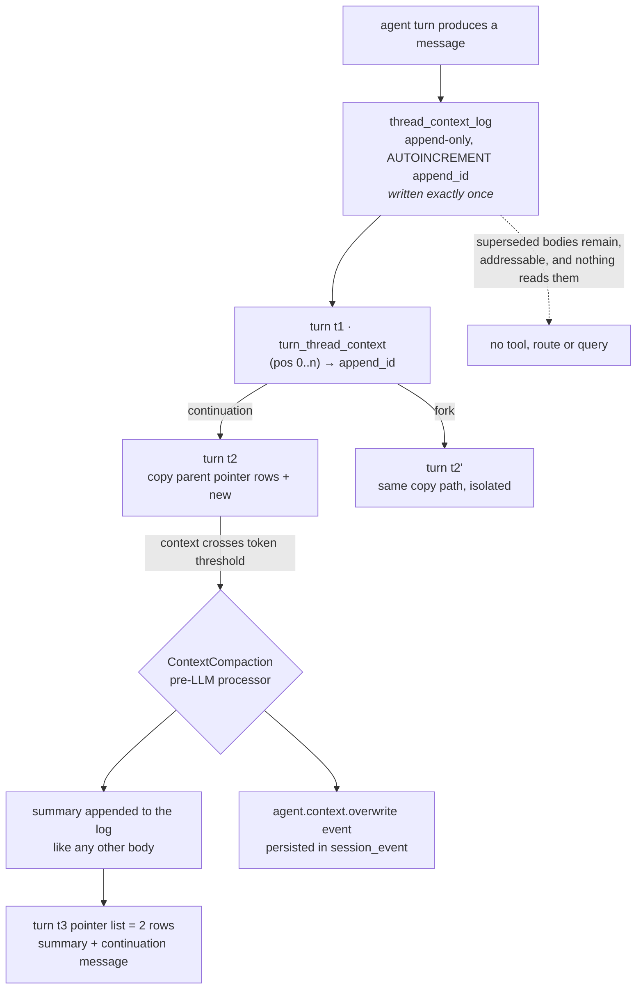

## 1. Executive Summary

TrueForge is an agent harness — MIT, TypeScript, 411 commits and 26
contributors since 23 July 2026 — that runs the execution loop and exposes it as
a chat UI, an HTTP API with an SDK, and an embeddable UI component. Model calls,
MCP tools, sandboxing, approvals, subagents and context management are the
product; there is no memory subsystem in the belief sense, and the vocabulary
confirms it rather than merely suggesting it. Across the package sources
`recall` appears zero times, `forget` zero, and every one of the `memory` hits
is RAM — `InMemorySessionStore`, *"in-memory state"*, *"Redis/in-memory key"*.

What earns the report is the storage design under the session, which is a better
answer to a problem this atlas keeps meeting than most systems that set out to
solve it.

**Message bodies and message positions are different tables.** Every context
message ever produced goes into `thread_context_log`, append-only, under an
`AUTOINCREMENT append_id`, and the store's design comment says it is *"written
exactly once."* What a turn *has* is not an array of messages but ordered rows
in `turn_thread_context (pos, append_id)` — pointers.

Three operations that are usually three mechanisms then collapse into one. A
linear continuation copies the parent's pointer rows and adds new ones. A fork
does exactly the same thing. A compaction deletes the current pointer rows and
writes a fresh short list. In all three cases the bodies are untouched, and the
design states the consequence it buys: *"Turns share no mutable structure …
structural leaks are impossible."*

The atlas has praised compaction that shadows instead of deleting before, in
[`deepseek-harness`](../deepseek-harness/), where an event carries `{ op:
'replace', start, end }` and a `surface` column marks what the model can still
see. TrueForge reaches the same property from underneath, in the schema, without
a status column anywhere: nothing is marked shadowed because nothing needs to be
— the body was never in the turn to begin with, only pointed at. That is the
cheaper construction, and it generalises to forking for free, which the
status-column version does not.

**The gap is on the read side, and it is total.** Every superseded body is
retained and individually addressable, and nothing in the repository ever reads
one back. There is no tool, no route, no query that returns pre-compaction
context to an agent or to a person. The property is a fact about the schema
rather than a capability the product offers, which is worth saying plainly
because the schema is one join away from offering it.

## 2. Mental Model

Think of a session as an append-only tape plus a set of playlists.

The tape is `thread_context_log`: every message body, in the order it was
created, immutable. A playlist is a turn's `turn_thread_context` rows — an
ordered selection of tape positions. Two playlists can name the same body. A
playlist can be rewritten without touching the tape.

Compaction is then not a destructive operation on history; it is writing a
shorter playlist. The summary the model produces is appended to the tape like
any other message, and the new playlist has two entries: that summary, and a
continuation message. Everything the old playlist named is still on the tape,
still addressable by `append_id`, and simply not selected any more.

A fork is a second playlist that shares a prefix. The store's invariants are the
part worth reading:

1. A turn cannot be a `previous_turn_id` while it is still `running` — callers
   must freeze it first.
2. Every turn-scoped write is fenced on `state->>'status' = 'running'`.
3. **Terminal turns are immutable — "a terminal read is a final read."**
4. `BEGIN IMMEDIATE` for write locking.

Invariant 3 is the one that makes the rest safe. Once a turn is finished, what
it saw can never change, so a fork from it is reproducible for as long as the
session exists.

## 3. Architecture

Five packages: `trueforge-core` (the loop, capabilities, the session
abstraction), `trueforge` (the HTTP server and the database layer), plus an SDK,
a UI component library and a frontend.

`ISessionStore` has three implementations — in-process, SQLite and PostgreSQL —
and one shared contract suite (`storeContractSuite.ts`, 2,085 lines) is run
against all three. That is the same discipline [`Gortex`](../gortex/) applies to
its swappable search backends, and it is the right shape whenever a store has
more than one implementation: the semantics are asserted once and every backend
must satisfy them.

## 4. Essential Implementation Paths

`packages/trueforge/src/db/sqlite/session-store/SqliteSessionStore.ts` carries
the design comment quoted throughout this report, and it is the file to read.

`packages/trueforge-core/src/core/capabilities/builtins/ContextCompaction.ts` is
240 lines and mostly prompt. It is a `PreLLMAgentContextProcessor`: before each
model call it compares `prompt_tokens + completion_tokens` against a threshold
(50,000 by default), and above it serialises the whole context into a tagged
transcript, asks the model for a structured eight-section summary, and yields a
single `AGENT_CONTEXT_OVERWRITE` event carrying the replacement context.

Two details in it are worth noting. The prompt's own token cost is a named
constant, `PROMPT_TOKENS = 931`, and is added to the measured usage before the
threshold comparison — so the check accounts for the cost of the check. And the
usage figure reported afterwards carries an inline admission that it is wrong:
*"NOTE(agent): This is not really correct. This is not taking into account that
the original request had tool definition in them. This will get refreshed in the
next LLM call."* An acknowledged-wrong number with the reason and the horizon
stated is better than a silently wrong one.

The event then reaches `TurnHandle.ts`, which routes it to
`store.overwriteThreadContext`, and only there does anything durable change.

## 5. Memory Data Model

Six tables. `session` carries `tenant_id`, `agent_spec`, `title`,
`last_turn_id`. `turn` carries `first_turn_id`, `previous_turn_id`,
`ancestor_ids`, `input`, `state`, `checkpoint` — a turn DAG, not a list.
`turn_thread` holds per-thread checkpoints and context usage.
`turn_thread_context` is the pointer table. `session_event` is the append-only
event record. `thread_context_log` is the append-only body log.

JSON payloads are stored as SQLite JSONB blobs, timestamps as ISO-8601 text, and
the schema is `STRICT`. Ordering is a `pos` column rather than an array column,
which is what makes a pointer list rewritable row by row inside a transaction.

Nothing in any of these tables is a claim. A body is a message that was sent.
There is no confidence, no status, no provenance beyond which turn produced it,
and no notion of a message being wrong — only of its no longer being selected.

## 6. Retrieval Mechanics

There is none, in the sense this atlas usually means. A turn's context is
assembled by reading its pointer rows in `pos` order and joining to the bodies.
Nothing ranks, scores, embeds or searches, so this report's retrieval stack is
empty — which in this atlas is an answer rather than a gap in the record.

The product's context-engineering features are all *reduction* rather than
recall — deferred tool loading, large-result offloading, subagents, Code Mode,
and compaction. They decide what enters the window, not what is fetched back
into it.

This is the seam where the storage design stops short. `thread_context_log`
holds, for every session, the full history of everything the model was ever
shown, keyed and ordered, in a SQL database that also stores the events that
superseded it. A tool that answered *"what was in this thread before the last
compaction"* is a join. Nothing implements it.

## 7. Write Mechanics

Synchronous and transactional. An append writes one body row and one pointer
row. An overwrite deletes the thread's current pointer rows and inserts a fresh
list. Every turn-scoped write is fenced on the turn still being `running`, so a
finished turn cannot be mutated by a late arrival, and a still-running ancestor's
late appends *"touch only its OWN rows."*

The design note that a fork and a linear continuation are *"the same copy path"*
is the load-bearing simplification. Systems that treat branching as a special
case end up with two code paths that drift, and the drift shows up as a fork
seeing something it should not. Here there is one path and a contract test for
the property.

## 8. Agent Integration

An HTTP API with a generated TypeScript SDK, a bundled chat UI, and an
embeddable UI package. MCP servers with header auth or OAuth, including in-chat
authorization. Skills are `SKILL.md` packs sparse-cloned from a git URL into the
sandbox by a downloader that resolves the ref inside the sandbox; they never
preload, and only name, description and path are advertised in the prompt.

Skills are worth naming precisely because they look like procedural memory and
are not: a skill is fetched from a repository at a ref, read-only, and no tool
or route lets an agent write one. It is configuration delivered by git, on the
same footing as a mounted file.

Human checkpoints exist — tool approval, ask-user-questions, generative UI — and
they gate *actions*. `is_approval_required` is a property of a tool call, and a
user message cannot even be sent *"while approvals or questions are pending."*
No approval surface inspects or adjudicates stored content, which is why the
human-review mark is withheld despite the product shipping a real approval flow.

## 9. Reliability, Safety, and Trust

The contract suite is the strongest evidence here, and it asserts failure
directions rather than success ones: mutations after `deleteSession` are
rejected, mutations for a missing session or turn are rejected, a duplicate
`turn_id` conflicts, `createTurn` is rejected while the previous turn is still
running, a second terminal transition loses to the first, and
`update_session_title_if_not_exist` *"sets once and never overwrites."*

**On scope, two things are true and the second qualifies the first.** `tenant_id`
is a real column with a real predicate — `getSession`, `listSessions` and
`deleteSession` all filter on it, and the contract asserts both directions,
including that a delete with a mismatched tenant removes nothing. That is more
than many systems carrying this mark.

But the boundary stops at the session table. `GetTurnInput` and `ListTurnsInput`
are `session_id` and nothing else; `tenant` does not appear anywhere in the turn
queries, and the child tables carry no tenant column — they inherit isolation by
foreign key and cascade. So possession of a `session_id` is sufficient to read
its turns at the store layer. And the shipped server closes the question by not
opening it: `apis/sessions.ts` declares *"The server is single-tenant; every
record lives under one fixed tenant scope"* and passes a `TENANT_ID` constant
everywhere.

That is a defensible arrangement — a column reserved ahead of the feature, with
the single-tenancy documented rather than implied — and a reader should not
mistake the mark for multi-tenant isolation. It certifies that the key reaches
the query, which is what the rubric asks and all it asks.

## 10. Tests, Evals, and Benchmarks

183 test files. The session-store contract suite is the centrepiece and is run
three times over, once per backend.

The `benchmark/` directory is a self-contained cost-and-accuracy harness
comparing TrueForge against Claude Managed Agents and a deepagents (LangGraph)
arm, and its methodology is careful in ways worth enumerating:

- The dataset is **third-party** — DevRev's Enterprise-Bench L1-L2 — and is
  deliberately *not* redistributed; the harness points at DevRev's own release.
- The judge is **blind**: it *"sees only the criteria and the answer, never a
  reference value and never which arm produced it."*
- Grading is all-or-nothing — a task passes only if every required criterion is
  met, with no partial credit.
- Every arm gets the same system prompt and the same task prompts, described as
  *"no hidden scoring, no per-task hints."*

The published table is 14 tasks at n = 3 trials, and its headline is the
restrained one available: on the same model, TrueForge and Claude Managed Agents
solve **the same number of tasks** — 10.7 each — and TrueForge uses 3.7M tokens
per run against 10.0M. The claim made is cost, not accuracy, on a comparison
where claiming accuracy was the temptation. The README closes by telling the
reader the numbers *"move a task or two run to run, so reproduce the shape, not
a single cell."*

What is not committed is the evidence. `results/matrix.jsonl`,
`results/grades.jsonl` and `results/summary.csv` are outputs the harness writes,
and none of them is in the tree — the repository holds the method and the
summary table, not the graded cells. With n = 3 over 14 tasks and an LLM judge,
the per-task grades are exactly what a reader would want to inspect.

## 11. Patterns Worth Stealing

**Separate a message's identity from its position.** One append-only body table
plus one ordered pointer table makes immutability free and turns three
operations into one. Any system that compacts, branches or replays should look
at this before adding a `superseded` column.

**Make forking and continuation the same code path.** Branch-as-special-case is
where isolation bugs live. If both are a pointer copy, there is one thing to get
right and one test to pin it.

**Freeze before you branch.** A turn cannot be a parent while it is running, and
a terminal turn is immutable — so what a fork inherits can never change
underneath it.

**Record the reduction as an event.** Compaction emits
`agent.context.overwrite` with a `reason` before anything durable changes, so
the log says the window was replaced and why, even though the pointer table only
shows the result.

**Charge the check for itself.** The compaction threshold adds the summarisation
prompt's own 931 tokens before comparing, so the mechanism accounts for its own
cost rather than being free in its own accounting.

**Say a number is wrong where it is computed.** The inline `NOTE(agent)`
admitting the usage figure omits tool definitions, and stating when it
self-corrects, is more useful than a number that looks authoritative.

## 12. Open Questions

- Is the retained history reachable at all? Every superseded body survives with
  an `append_id`, and no code path returns one. Whether that is a deliberate
  privacy posture or an unbuilt feature decides whether the design is a memory
  layer or an accident of normalisation, and the repository does not say.
- Does `deleteSession` reach the log? The cascade is declared on `session_id`
  and `thread_context_log` references it, so a session delete should remove the
  bodies — which means the only durable retention boundary is the session, and a
  session is deleted as a unit or not at all.
- What happens to the tenant column when a second tenant exists? The predicate
  is on sessions only, so multi-tenancy would need the turn queries to carry the
  key or a resolve-then-read discipline enforced somewhere. Nothing in the tree
  indicates which was intended.
- Would the benchmark's conclusion survive its own grades being published? The
  method is unusually careful and the sample is small; the per-task grades are
  the artifact that would let a reader check whether 10.7 against 10.7 is a
  tie or a coin flip.

## Appendix: File Index

| Path | What it carries |
| --- | --- |
| `packages/trueforge/src/db/sqlite/session-store/SqliteSessionStore.ts` | The append-only-log design comment and the four hard invariants |
| `packages/trueforge/src/db/sqlite/migrations/20260730_000002_session_store.ts` | All six tables, including `thread_context_log` and `session_event` |
| `packages/trueforge/src/db/sqlite/session-store/queries/sessions.ts` | The tenant predicate on the session read path |
| `packages/trueforge/src/db/sqlite/session-store/queries/turns.ts` | Turn assembly, which carries no tenant |
| `packages/trueforge-core/src/core/capabilities/builtins/ContextCompaction.ts` | The threshold, the summarisation prompt, and the overwrite event |
| `packages/trueforge-core/src/agent-session/TurnHandle.ts` | Event routing, including `overwriteThreadContext` |
| `packages/trueforge-core/src/core/sandbox/skills/SkillMounter.ts` | Git-sourced read-only skill packs |
| `packages/trueforge-core/tests/agent-session/store/storeContractSuite.ts` | 2,085 lines run against all three store backends |
| `packages/trueforge/src/apis/sessions.ts` | The single-tenant declaration and the `TENANT_ID` constant |
| `benchmark/README.md` | The blind-judge method and the 14-task, n=3 result table |

## History

**2026-08-19** — [`bd156190ac0c6ab865a5cc549535a14a805f06e8`](https://github.com/truefoundry/trueforge/commit/bd156190ac0c6ab865a5cc549535a14a805f06e8)
— first reading. Screened before reading: one auto-run surface (a `.cursor/rules/`
directory), nine dependency manifests inside the seven-day cooldown on a
repository under a month old, eight unpinned ranges with a `pnpm-lock.yaml`
beside them, a build-time `benchmark/setup.py` and two `package.json` lifecycle
scripts, and `AGENTS.md` and `CLAUDE.md` carrying instructions addressed to a
reading agent, which this atlas records as data rather than following. Nothing
was installed, nothing was executed, and the benchmark table was read rather
than reproduced.
