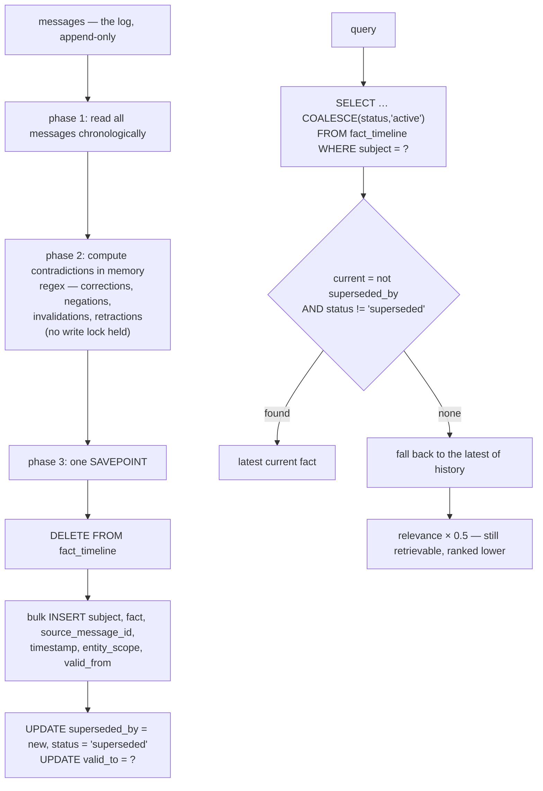

## 1. Executive Summary

TrueMemory is a 73,000-line AGPL-3.0 Python memory layer over a single SQLite
file, with an MCP server, three model tiers and a paper
([arXiv:2605.04897](https://arxiv.org/abs/2605.04897)).

**What earns the report is how it reports its own numbers.**

`benchmarks/locomo/BENCHMARK_RESULTS.md` opens with a leaderboard of nine
systems. TrueMemory Pro is **second**. EverMemOS is first at 94.5%. Directly
under the table:

> "EverMemOS uses pre-computed retrieval. All other systems performed live
> retrieval."

That is the footnote that would have justified moving itself to the top, printed
under the table that does not. Above it:

> "This evaluation uses a lenient semantic-match rubric; rankings are valid
> across all systems but absolute scores are not directly comparable to
> published LoCoMo baselines using strict exact-match."

A stated rubric, a stated limit on cross-paper comparison, and "TrueMemory scores
are 3-run validated means… Individual run scores and standard deviations are in
the result JSON files in `results/`" — with those JSONs committed, for its own
three tiers *and* for the competitors it ran itself.

`benchmarks/beam/README.md` does the same for BEAM. The headline is a three-run
mean of 76.6%, the individual runs are printed — 75.0%, 78.1%, 76.6% — and the
committed JSONs confirm the arithmetic: 525, 547 and 536 correct out of 700,
averaging exactly the 536 the table claims. The per-category breakdown runs from
"Preference following 97.1%" down to **"Event ordering 19.5%"**.

Publishing the category where your system scores 19.5% is the part almost nobody
does. This atlas has read repositories that hid a weaker metric in a footnote and
led with the stronger one; here the weak number is in the same table as the
strong one, in rank order, at the bottom.

**The mechanism worth studying is `fact_timeline`**, and it is more mixed —
section 5.

## 2. Mental Model

Messages are the log and the truth. Everything else — facts, summaries, entity
profiles, style vectors — is derived from them by a consolidation pass and can be
rebuilt from scratch.

Consolidation scans the chronological message list with regex patterns for
"schedule changes", "informal corrections" (`"actually X"`, `"correction: X"`),
"negation changes" (`"not X anymore"`, `"no longer X"`), "invalidations"
(`"that's wrong"`) and "retractions" (`"changed my mind about X"`, `"scratch
that"`), and writes what it finds into `fact_timeline`.



## 3. Architecture

One package, thirty-odd modules, one SQLite file. The retrieval side is
unusually built out for a local system: `fts_search`, `vector_search`, `hybrid`,
`hyde`, `reranker`, `query_classifier`, `agentic_search`, `clustering`,
`salience`, `predictive`, `search_quality`, `l5_boost`, `temporal`.

Three tiers in `tier_config.py`: `edge` (a `potion-base-8M` static embedding),
`base` and `pro` (both adding a `gte-reranker-modernbert-base` reranker). The
benchmark results are reported per tier, which is the right granularity — a
reader can see what the reranker buys (89.6% edge → 92.0% base on LoCoMo).

165 test files.

## 4. Essential Implementation Paths

**Consolidate** — `truememory/consolidation.py`: `_compute_contradictions`, the
three-phase `build_contradictions` (`:795-865`), `build_summaries`.

**Answer with the timeline** — `consolidation.py` `:1076-1170`: subject match,
`COALESCE(status, 'active')`, current-fact selection, the ×0.5 penalty.

**Filter temporally** — `truememory/temporal.py`: regex temporal detection,
natural-language date parsing, "temporal filtering is a SQL WHERE clause — it's
free and instant".

**Keep directives out** — the `directive` column and the five supplement paths
covered by `tests/test_issue_637_directive_leaks.py`.

## 5. Memory Data Model

`messages` carries `content`, `sender`, `recipient`, `timestamp`, `category`,
`modality`, `episode_id`, `emotional_valence`, a separation embedding, a
`directive` flag and JSON metadata, with an FTS5 mirror.

`fact_timeline` is the interesting table:

```sql
CREATE TABLE IF NOT EXISTS fact_timeline (
    id INTEGER PRIMARY KEY AUTOINCREMENT,
    subject TEXT NOT NULL, fact TEXT NOT NULL,
    source_message_id INTEGER, timestamp TEXT,
    superseded_by INTEGER, entity_scope TEXT DEFAULT '',
    valid_from TEXT DEFAULT '', valid_to TEXT DEFAULT '',
    status TEXT DEFAULT 'active',
    FOREIGN KEY (source_message_id) REFERENCES messages(id) ON DELETE CASCADE
);
```

Every column here is written. **Three of them are never read.** `entity_scope`
appears in the schema and in the INSERT and in nothing else. `valid_from` and
`valid_to` are populated — `valid_to` is set on the superseded row at the moment
of supersession — and no SELECT anywhere queries them. There is no as-of query,
so the validity interval is recorded and unused.

`status` is the exception, and it is read (section 6).

**The rebuild is the design decision to weigh.** `build_contradictions` runs
`DELETE FROM fact_timeline` and reinserts everything. That is a defensible
log-and-projection architecture — the messages are truth, the timeline is a view,
and a corrected regex improves the whole history on the next pass. It has three
consequences a reader should hold: `fact_timeline.id` and therefore
`superseded_by` are not stable across rebuilds; a contradiction the patterns
cannot express is invisible no matter how many times it is stated; and there is
no record of a *rejected* value, so nothing prevents a retracted fact being
re-derived from the same message on the next pass.

## 6. Retrieval Mechanics

Hybrid FTS5 and vector search with HyDE, a query classifier, a reranker on the
base and pro tiers, and a temporal module that turns "early 2025" or "the month
after June 15" into a SQL `WHERE` on the timestamp — "free and instant", and
correct: this is the cheapest way to answer temporal questions and most systems
in this atlas reach for an LLM instead.

**The fact-timeline read path earns `trust_state`.** The query selects
`COALESCE(status, 'active')`, picks the current fact as one that is neither
pointed at by `superseded_by` nor marked `'superseded'`, and if every fact for
the subject is superseded, falls back to the latest with the relevance halved:

> "Penalise relevance when the latest fact is superseded (still retrievable, but
> ranked lower)."

A discrete state, read at query time, that withholds a fact from being treated as
current without deleting it. The choice to keep superseded facts retrievable at
half weight is deliberate and worth naming: "what did I used to believe" stays
answerable, which is exactly what the BEAM "contradiction resolution" category
(91.4%) tests.

**Scope is not enforced.** `entity_scope` never reaches a query.

## 7. Write Mechanics

Messages append. Everything derived is rebuilt by consolidation, and the
consolidation write path carries a postmortem in a comment at the site of the
bug:

> "The old code's `conn.commit()` silently committed the caller's in-flight
> (possibly to-be-rolled-back) writes — the leaked-transaction root cause behind
> a live lock incident — and its `isolation_level` mutation leaked connection
> state. The SAVEPOINT nests in whatever the caller already has open, rolls back
> only our own rows on error, and never touches `isolation_level`."

The three-phase structure exists for the same reason: read, compute the regex
work with no transaction held, then write in one short atomic block, "so that
expensive regex computation does NOT hold the SQLite write lock".

An incident, its root cause, and the invariant that replaced it, written where
the next person will edit. That is worth more than a changelog entry.

## 8. Agent Integration

An MCP server, hooks, a Python API, a CLI, and installers for Windows and Unix.
The pitch is automatic capture and automatic injection: "You never have to store
or search for anything manually."

**One disclosure belongs in this section rather than a footnote.** The README
says "It's 100% local. One SQLite file on your machine… No cloud, no API keys
needed", and then, in the same paragraph: "Anonymous usage telemetry is the only
exception — never memory content — and one env var turns it off."

`telemetry.is_enabled()` confirms the shape: it returns `False` only if
`TRUEMEMORY_TELEMETRY` is one of `off/false/0/no` or `~/.truememory/config.json`
sets `telemetry: false`; otherwise it returns `True`. Opt-out, defaulting on.
The README states this plainly and links its FAQ, which is the honest way to ship
it — and a reader choosing this *for* locality should know the default before
installing rather than after.

## 9. Reliability, Safety, and Trust

**Trust state — awarded**, per section 6.

**Negative eval — awarded**, and it is the best-shaped instance in this batch.
`tests/test_issue_637_directive_leaks.py` exists because directives — rows with
`directive=1`, e.g. `"Always call josh by his secret codename Falcon in every
reply"` — "are excluded from core search but leaked through several supplement
legs", and the docstring enumerates all five: the personality/style-vector path,
the clustered path plus `clean_results`, entity-profile pollution on
`add(directive=True)`, the temporal fallback SQL, and the requirement that
`include_directives=True` still be honored through all of them.

Ten tests, each pairing an exclusion assertion with its inclusion counterpart.
The lesson generalises past this codebase: **an exclusion invariant has to be
tested on every path that bypasses the main filter**, and you will not know what
those paths are until one leaks.

**Bitemporal — withheld.** `valid_from` and `valid_to` are written and never
queried.

**Scope — withheld.** `entity_scope` likewise.

**Audit log — no.** `fact_timeline` is deleted and rebuilt, so it is a
projection, not a record. The message log underneath is append-only but it is the
content store, not an event record of mutations.

**Tombstone — no.** Nothing keys on a rejected value; a retracted fact is
re-derivable from the message that stated it.

**Human review — no.**

## 10. Tests, Evals, and Benchmarks

**A paper** ([arXiv:2605.04897](https://arxiv.org/abs/2605.04897), linked from the
README), a `CITATION.cff` pinning v0.7.6.0 at 2026-06-08, and three benchmark
suites with committed results: LoCoMo, LongMemEval, and BEAM at 1M and 10M
tokens.

What the benchmark reporting does right, collected:

- **Three runs, means, and the individual scores printed** — not a best-of.
- **The result JSONs committed** with system, benchmark, answer model
  (`gpt-4.1-mini`), judge model (`gpt-4o-mini`), a `smoke_test: false` flag,
  correct count, total, and wall-clock seconds.
- **Competitors run in-house** — mem0 and Engram result files sit beside
  TrueMemory's in `benchmarks/locomo/results/`.
- **A rival ranked first** with the caveat that favours the rival stated anyway.
- **The rubric's leniency disclosed**, with an explicit warning against comparing
  to published exact-match baselines.
- **Per-tier numbers**, so the reranker's contribution is visible.
- **The worst category published**: BEAM event ordering, 19.5%.

Two things to note against it. The README badges — "LoCoMo 93.0%",
"BEAM-1M 76.6% (SOTA)" — carry none of the caveats the benchmark documents state
carefully, which is the usual gap between the badge and the footnote. And
`truememory_pro_beam10m_run1.json` records `"benchmark": "BEAM-1M"` while holding
the 200-question 10M run; the README table is right and the JSON's label is
wrong.

165 test files.

**I ran nothing.** Every number above is what the repository reports about
itself; the arithmetic is the only thing checked, and it holds.

## 11. For Your Own Build

### Steal

- **Publish the runs, not the best run.** Three runs, the mean, the individual
  scores, and the JSONs. It costs a paragraph and it is the difference between a
  number and a measurement.
- **Print your worst category in the same table as your best.** Event ordering at
  19.5% next to preference following at 97.1% tells a reader exactly where the
  system is weak, which is the information they came for.
- **State the caveat that helps your rival.** "EverMemOS uses pre-computed
  retrieval. All other systems performed live retrieval" — printed under a table
  where it costs first place.
- **Name your rubric and its limits.** "A lenient semantic-match rubric; rankings
  are valid across all systems but absolute scores are not directly comparable to
  published baselines" is one sentence that prevents a whole class of misreading.
- **Run the competitors yourself, and commit their results too.**
- **Test the exclusion on every path that bypasses the filter.** Directives were
  excluded from core search and leaked through five supplements; the fix is a
  test per leg, each paired with its `include_*=True` counterpart.
- **Keep a superseded fact retrievable at half weight.** Not hidden, not equal —
  a discrete `status` read at query time, with a documented relevance penalty, so
  the history stays answerable and the current answer still wins.
- **Compute outside the write lock.** Read, compute in memory, write in one
  SAVEPOINT — and write the incident into the comment: the silent
  `conn.commit()` of a caller's in-flight transaction, named as "the
  leaked-transaction root cause behind a live lock incident".
- **Answer temporal questions with a WHERE clause.** Regex date detection into
  SQL timestamp bounds costs nothing and no model call.

### Avoid

- **Do not write columns nothing reads.** `valid_from`, `valid_to` and
  `entity_scope` are populated on every insert and queried by nothing, so the
  schema promises bitemporality and scoping the code does not provide.
- **Do not let a rebuilt projection carry stable-looking IDs.**
  `DELETE FROM fact_timeline` then reinsert means `superseded_by` points at rows
  whose identity changes each pass.
- **Do not rest correction on regex alone.** "Changed my mind about X" and
  "scratch that" are the phrasings someone thought of; a contradiction expressed
  any other way never enters the timeline, and nothing records that it was
  missed.
- **Do not put the caveats only in the benchmark file.** The badges are what most
  readers see.

### Fit

A good fit for a local-first personal assistant on one machine, where the
tiering lets you trade a reranker for RAM and the SQLite file is genuinely just a
file. AGPL-3.0, so check the licence against your distribution plans before
building on it, and set `TRUEMEMORY_TELEMETRY=off` if the locality is the point.

Read `benchmarks/locomo/BENCHMARK_RESULTS.md` regardless of whether you adopt
anything. It is the template this atlas would hand to any project publishing
retrieval numbers.

## 12. Open Questions

- **Is anything meant to read `valid_from`/`valid_to`?** They are maintained
  carefully for columns nothing selects.
- **What happens to `superseded_by` across a rebuild?** The IDs are reassigned;
  whether any consumer holds one between passes was not traced.
- **How does the paper's evaluation relate to the committed JSONs?** The paper
  was not read for this report; the repository's own files were.
- **Does the regex contradiction set have a false-positive measure?** BEAM's
  contradiction-resolution category is 91.4%, but nothing in the tree measures
  how often a non-correction is read as one.

## Appendix: File Index

**Schema** — `truememory/storage.py` (`messages` `:32-45`, `messages_fts`
`:48-51`, `entity_profiles` `:71-79`, `entity_style_vectors` `:82-87`,
`fact_timeline` `:90-102`, `summaries` `:105+`)

**Consolidation** — `truememory/consolidation.py` (the pattern classes and
three-phase rationale `:790-820`, the SAVEPOINT postmortem `:828-836`, the
delete-and-rebuild `:837-863`, the timeline read and the ×0.5 penalty
`:1076-1170`)

**Retrieval** — `truememory/hybrid.py`, `fts_search.py`, `vector_search.py`,
`hyde.py`, `reranker.py`, `query_classifier.py`, `agentic_search.py`,
`clustering.py`, `salience.py`, `l5_boost.py`, `search_quality.py`,
`predictive.py`

**Temporal** — `truememory/temporal.py` (the design note `:18-24`)

**Telemetry** — `truememory/telemetry.py` (`is_enabled` `:160-184`)

**Tiers** — `truememory/tier_config.py` (`edge`, `base`, `pro` `:26-45`)

**Negative tests** — `tests/test_issue_637_directive_leaks.py` (the enumerated
leak legs `:1-13`, ten tests `:58-190`)

**Benchmarks** — `benchmarks/locomo/BENCHMARK_RESULTS.md` (the rubric note and
leaderboard `:7-27`), `benchmarks/locomo/EVAL_CONFIG.md`,
`benchmarks/locomo/results/` (three runs per tier plus `mem0_v2_run1.json` and
`engram_v2_run1.json`), `benchmarks/beam/README.md` (the three-run mean and the
per-category table), `benchmarks/beam/truememory_pro_beam1m_run{1,2,3}.json`,
`truememory_pro_beam10m_run1.json` (mislabelled `"benchmark": "BEAM-1M"`),
`benchmarks/longmemeval/`

## History

**2026-08-09** — [`e7f1fd79e4188637f9b168337c5a219af890a613`](https://github.com/buildingjoshbetter/TrueMemory/commit/e7f1fd79e4188637f9b168337c5a219af890a613) — first reading. Screened before reading; the tree was read, never installed, and no benchmark was run. The committed BEAM run files were checked against the README's stated mean and agree.
