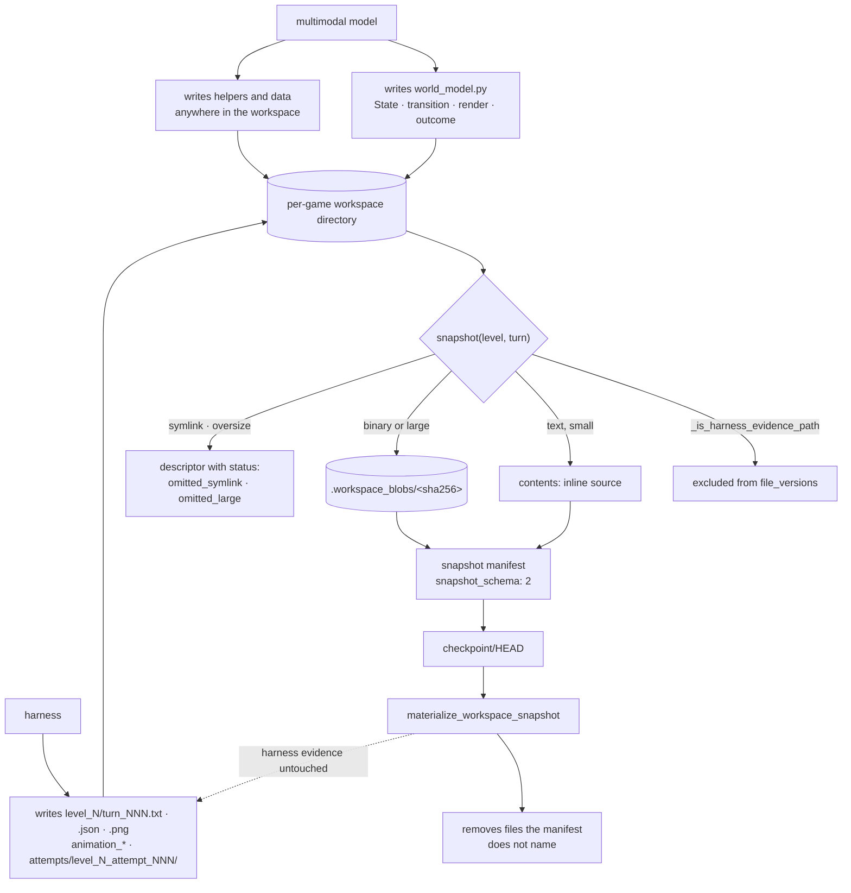

## 1. Executive Summary

Tycho is a self-directed harness for ARC-AGI-3 from NIMI-research — 24,829
lines of Python, Apache-2.0, a single commit dated 29 July 2026 with a
`PUBLIC_RELEASE_MANIFEST.json` beside it, which is the shape of a squashed
public release rather than a development history.

Its framing is the paper's, and it is worth quoting because it explains the
memory design: *"A multimodal model enters an unfamiliar 64x64 world without
rules or an objective. Tycho preserves what it sees, what it does, and what
follows. When useful, the agent turns that evidence into a free-form executable
hypothesis (`State`, `transition`, `render`, and `outcome`), checks the
hypothesis against experience, and plans through it."*

So the durable memory is **code the agent wrote about a world it is still
learning**, sitting in a per-game workspace beside the harness's own record of
what happened. One mark, and it is for the line drawn between those two things.

## 2. Mental Model

Two kinds of file share one directory and they are not the same kind of thing.

The agent authors a `world_model.py` — a `State`, a `transition`, a `render`
and an `outcome` — plus whatever helpers and data it decides it needs. That is
memory in this atlas's sense: a claim about how the world works, carried
forward, revisable.

The harness writes `level_N/turn_NNN.txt`, `turn_NNN.json`, `turn_NNN.png` and
`animation_*` files, and archives prior attempts under
`attempts/level_N_attempt_NNN/`. That is evidence: what was observed, not what
was concluded.

`version_store.py` is 
where the distinction becomes mechanical. `_is_harness_evidence_path` matches
the archive layout and the per-turn filenames, and everything it matches is
kept out of the snapshot. The agent's memory can be rolled back; the record it
was derived from cannot be.

## 3. Architecture



## 4. Essential Implementation Paths

**The exclusion is a path predicate, not a naming convention.**
`_is_harness_evidence_path` matches `attempts/level_N_attempt_NNN/...`, and
within a `level_N/` directory it matches `animation_*` and
`turn_NNN.{txt,json,png}`. Everything else in that directory — including an
agent-authored `agent_helper.json` sitting next to the excluded turn files — is
captured. The boundary is per-file, not per-directory, which is what makes the
paired test in section 10 meaningful.

**Capture has three outcomes, and the third one is honest.** A text file goes
inline into `contents`. A binary or large file goes to `.workspace_blobs` under
its sha256, with a descriptor in `file_versions`. A symlink or an oversize file
gets a descriptor carrying `status: "omitted_symlink"` or `"omitted_large"` and
no body — and `materialize_workspace_snapshot` raises
`SnapshotMaterializationError` naming the status rather than restoring a
partial workspace. `MAX_BLOB_BYTES` is 16 MB.

**Restore is a manifest reconciliation.** Files the manifest names are written;
files present in the destination that the manifest does not name are removed.
Harness evidence is neither in the manifest nor removed, so it survives.

## 5. Memory Data Model

There is no record type. The unit is a file, and the snapshot describes it with
a path, a kind, a sha256 and a status. The agent's beliefs live inside
`world_model.py` as Python, with whatever structure the model chose this turn.

That is the design's cost and it is worth stating plainly. A hypothesis the
agent has tested against the log and one it is still assuming are both just
code. Nothing in the workspace can mark a `transition` as unverified, record
that an earlier `render` was falsified, or prevent a later session from
rebuilding a model the log has already contradicted. The atlas's `trust_state`
mark asks for a discrete status held as a field; here the only status field
describes whether a *file body* was captured.

## 6. Retrieval Mechanics

None to speak of, by design. The agent reads its own workspace with file tools
and reasons over `world_model.py` directly; there is no index, no ranking and
no query over prior snapshots. Snapshots exist for resume and rollback, not for
recall — nothing searches them.

## 7. Write Mechanics

The agent writes through a sandboxed runtime (`sandbox.py`, plus a container
layer) and the harness snapshots at turn boundaries. There is no write gate on
memory content: whatever the model puts in `world_model.py` is the world model.

## 8. Agent Integration

A planner works through the executable hypothesis rather than over raw frames,
which is the harness's central bet — *"checks the hypothesis against experience,
and plans through it"* — with a documented fallback that when formalisation is
not useful *"the agent remains free to reason directly."* `wmlib_template.py`
and `wm_templates.py` seed the world-model shape.

## 9. Reliability, Safety, and Trust

The provenance boundary is the strength and it is unusual. Most systems in this
corpus that snapshot a workspace snapshot all of it; the consequence is that
rolling back a model also rolls back the evidence that showed the model was
wrong, and the agent re-derives into the same error. Tycho's restore preserves
the observational record precisely so a rollback loses the conclusion and keeps
the data.

What is absent is any statement of confidence. The harness records what was
seen and what the agent concluded, and nothing connects the two — there is no
field saying which parts of the world model the log supports. Compare
[Retrodict](../retrodict/), which asks its model to mark each point *"checked
against the log vs. still assumed"* in prose, and gets a better-articulated
version of the same idea with even less machinery behind it.

## 10. Tests, Evals, and Benchmarks

6,549 lines of tests, and the workspace-versioning file is the one that earns
the mark. Nothing was run for this review.

```python
assert snapshot["contents"]["world_model.py"] == long_source
assert "world_map.npy" in snapshot["file_versions"]
assert "world_map.npy" not in snapshot["contents"]
assert "level_0/turn_000.txt" not in snapshot["file_versions"]
assert "attempts/level_0_attempt_000/level_0/turn_000.txt" not in snapshot["file_versions"]
assert snapshot["contents"]["level_0/agent_helper.json"] == '{"known": true}'
```

Six assertions over one fixture, three positive and three negative, and the
last line is what makes it a boundary test rather than an exclusion test: an
agent-authored file inside a directory whose harness files are excluded is
asserted **present**. A snapshot that excluded the whole `level_0/` directory
would pass every other assertion and fail that one.

`test_materializer_restores_manifest_and_preserves_harness_evidence` asserts the
other direction: after a restore, `stale.py` is gone because the manifest does
not name it, and `level_0/turn_000.txt` still reads `"observation"`.

The public claim — 100.00% RHAE on ARC-AGI-3 — is a scorecard on an external
leaderboard and is not recomputable from this tree; `artifacts/` and
`PUBLIC_RELEASE_MANIFEST.json` were not traced for this reading.

## 11. For Your Own Build

**Separate what your agent concluded from what your harness observed, in the
snapshot boundary.** If a rollback takes the evidence with the conclusion, the
next attempt re-derives the same mistake from a shorter record.

**Test the boundary with a file on each side of it in the same directory.** An
exclusion test that only asserts absences passes on an implementation that
excludes too much.

**Give an omitted body a status rather than an empty string.** `omitted_large`
and `omitted_symlink` turn a silent gap into a named one, and the restore path
refuses rather than materialising a partial workspace.

## 12. Open Questions

**Is anything in `artifacts/` a committed run record?** The directory exists
and the release manifest names files; whether either lets the 100.00% figure be
recomputed was not established.

**Does a later session read prior snapshots at all?** They are keyed by level
and turn and used for resume, and nothing found here queries an older snapshot
to compare models across attempts — which is the obvious use of a version store
in a learning loop.

**What is `SNAPSHOT_SCHEMA = 2`?** A version-1 format existed. Whether old
snapshots are readable, and what changed, is not recorded in the tree read here.

## Appendix: File Index

| Path | What it holds |
| --- | --- |
| `tycho/workspace/version_store.py` | Content-addressed capture, the evidence-path predicate, the restore |
| `tycho/workspace/workspace.py` | `snapshot(level, turn_in_level)` and the resume path |
| `tycho/workspace/wm_templates.py`, `wmlib_template.py` | The seeded world-model shape |
| `tycho/workspace/sandbox.py` | The runtime the agent writes through |
| `tycho/harness/resume.py` | `checkpoint/HEAD` and exact resume |
| `tests/workspace/test_workspace_versioning.py` | The boundary test, both directions |

## History

**2026-08-27** — [`f68912a764372ead0a610db2e1c011d41ce5197e`](https://github.com/NIMI-research/Tycho/commit/f68912a764372ead0a610db2e1c011d41ce5197e) — first reading, 24,829 lines of Python, Apache-2.0, a single commit dated 29 July 2026 beside a `PUBLIC_RELEASE_MANIFEST.json`, which reads as a squashed public release rather than a development history. Screened before reading: no auto-run surface, one execution surface — a `Makefile` whose default target is worth checking before a bare `make` — and one unpinned dependency surface. Nothing was installed and nothing was run. One mark. `negative_eval` rests on `test_workspace_versioning.py`, which asserts an agent-authored file inside an evidence directory is captured while the harness files beside it are not, and that a restore removes unmanifested files while preserving the evidence. `trust_state` is absent — the only `status` in the model describes why a file body was omitted from capture. `tombstone`, `bitemporal`, `scope_enforced`, `audit_log` and `human_review` are absent: there is no record type, no validity axis, no scope key inside a workspace, no mutation event record, and no review surface. The reading covers the workspace version store, its tests and the resume path; `artifacts/`, the planner and the serving layer were not traced.
