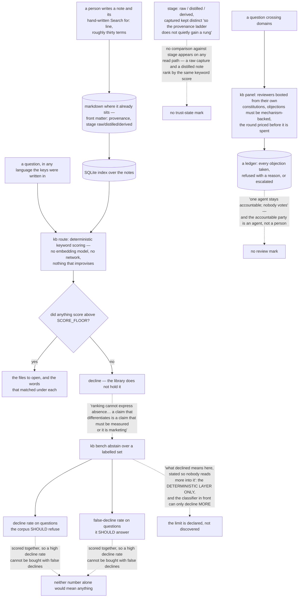

## 1. Executive Summary

Ulpia opens on a failure rather than a feature: "Your coding agent answered out
of the wrong file and sounded certain. It could not tell you which file it used,
could not give the same answer twice, and had no way to know the difference
between remembering and guessing." Apache-2.0, Rust, one binary, an MCP server,
and an index over markdown "where it already sits."

The design is a deliberate retreat from inference:

> "Retrieval is plain software: no embedding model, no network, nothing in the
> path that improvises. Same question, same answer, today and in a year, and
> when the answer is wrong you can read why in words you can act on."

**And the cost is stated in the same breath.** "The price is writing, and it is
paid per note. Each one carries a hand written `Search for:` line, roughly
thirty terms, naming the words a real question would use. Nothing infers it for
you." A system that names its own tax in the third paragraph is unusual, and it
makes the rest of the claims easier to take at face value.

**The mechanism worth carrying is how the abstention is measured.** The
differentiating claim is that the router can decline, and the benchmark module
says why that obliges it:

> "Every retrieval system this one competes with always returns a rank one,
> because ranking cannot express absence. Ulpia's differentiating claim is the
> refusal, and a claim that differentiates is a claim that must be measured or
> it is marketing."

It produces two numbers, not one: "the decline rate on questions the corpus
should refuse, and the false-decline rate on questions it should answer." Those
two cannot both be improved by the same cheat, which is what makes the pair
meaningful where either alone would not be. The scope is then bounded under a
heading written for the reader who would otherwise over-read it — "[w]hat
'declined' means here, stated so nobody reads more into it" — limiting the
result to the deterministic layer, with a decline meaning the keyword scorer
returned nothing or fell under a floor.

**The panel is the third thing.** When a question crosses domains, reviewers are
booted from their own constitutions, objections must be "mechanism-backed"
rather than stylistic, the round is priced before it is spent, and a ledger
records every objection as "taken, refused with a reason, or escalated." The
governance rule is one sentence: "One agent stays accountable; nobody votes."

**The gap is a familiar one.** Every note carries `stage: raw | distilled |
derived` and a provenance field, with a `captured` stage kept distinct from
`distilled` "so the provenance ladder does not quietly gain a rung" — and no
read path consults either. A raw capture and a distilled note compete on the
same keyword score.

## 2. Mental Model

A **note** is reachable exactly as far as its hand-written keys reach.

A **refusal** is an answer, and it is scored like one.

A **stage** is recorded, and the router does not look at it.

An **objection** is taken, refused with a reason, or escalated.

## 3. Architecture

| Area | Role |
| --- | --- |
| `tools/kb/` | The router, the index, promotion and classification |
| `tools/bench/src/abstain.rs` | The refusal, measured in both directions |
| `tools/bench/src/longmem.rs` | The LongMemEval harness |
| `decisions/` | Architecture decision records, each carrying its own `Search for:` line |
| `benchmarks/longmemeval/` | Results, declared hypotheses, and the judging scripts |

## 4. Essential Implementation Paths

`tools/bench/src/abstain.rs:1-16` — why the refusal must be measured, and what
the measurement does not cover.

`decisions/0007-memory-architecture.md:67` — the stage ladder, declared.

`tools/kb/src/promote.rs:73-75` — a stage kept distinct so the ladder does not
gain a rung by accident.

## 5. Memory Data Model

A markdown note with front-matter provenance and stage, and a hand-written
`Search for:` line that is the whole of its addressability. Notes enter, change
or leave through four outcomes — NOOP, ADD, UPDATE, DELETE — behind a write
gate, with the agent holding an explicit right to delete.

## 6. Retrieval Mechanics

Keyword matching against the keys each note declares, in whatever language they
were written, returning the files and the matched words in about a millisecond
with no model in the path. Multiple bases are scored and routed between rather
than merged, so a security question reaches the security specialist.

## 7. Write Mechanics

Promotion and distillation are invoked passes rather than background ones, and
the stage recorded on a promoted note distinguishes what was captured from what
somebody or something later distilled.

## 8. Agent Integration

`kb serve` speaks MCP over stdio so a coding agent queries the library directly
"rather than reading whichever file its own search surfaced", with panel and
answer modes above it.

## 9. Reliability, Safety, and Trust

Determinism is the safety story: the same question gives the same answer, and a
wrong answer is traceable to the keys that matched. The refusal is measured both
ways and scoped honestly. What is not enforced is the provenance ladder, and the
panel's accountability rests on an agent rather than a person.

## 10. Tests, Evals, and Benchmarks

An abstention benchmark, a LongMemEval harness with results, declared hypotheses
per question id committed alongside the run, agreement and judging scripts, and
CI.

## 11. For Your Own Build

If your differentiator is that you can say no, measure the no — and measure the
false no beside it. One number without the other can be gamed in a morning.

Write the paragraph that bounds your own metric. "What 'declined' means here,
stated so nobody reads more into it" is a heading more benchmarks should carry.

State your tax where a reader will see it. A system whose cost appears in the
third paragraph is easier to trust about everything after it.

If you record a provenance ladder, decide what reads it. A stage nobody filters
on is a field that documents the past rather than shaping the answer.

## 12. Open Questions

Whether `stage` is meant to reach retrieval. The ladder is carefully designed —
a rung was deliberately kept from being added — and then no query consults it,
which reads like a mechanism waiting for its consumer.

Whether the panel is meant to include a person. Objections must be
mechanism-backed and the ledger is complete, but the accountable owner is an
agent, so the arrangement records adjudication by the same kind of thing that
produced the work.

## Appendix: File Index

| Path | What to read it for |
| --- | --- |
| `tools/bench/src/abstain.rs:1-16` | Why a differentiating claim obliges a measurement |
| `benchmarks/longmemeval/hypotheses-s-declared.jsonl` | Hypotheses written down beside the run |
| `decisions/0007-memory-architecture.md` | Four write outcomes, and a decision record that indexes itself |
| `tools/kb/src/promote.rs:73-75` | A ladder protected from quietly gaining a rung |

## History

**2026-09-16** — [`1842f3c97513335a5341c47718c6ee15d8f3a473`](https://github.com/richard-wollyce/ulpia/commit/1842f3c97513335a5341c47718c6ee15d8f3a473) — first reading, at a commit dated 16 September 2026. Screened before opening, from a shallow clone: four auto-run surfaces, no build-time execution points, two unpinned dependency surfaces and twelve dependency files inside the seven-day cooldown. `CLAUDE.md` is addressed to a reading agent and was recorded as data. Nothing was installed, built or run, and no benchmark was reproduced — the abstention and LongMemEval figures quoted here are the project's own, read from its committed results.
