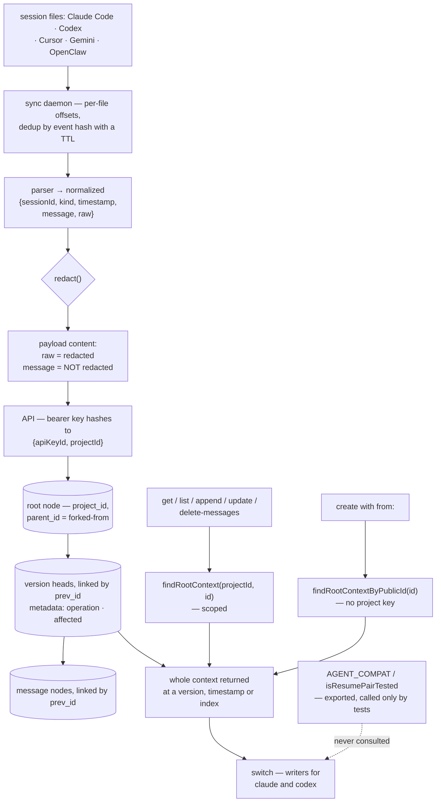

## 1. Executive Summary

UltraContext is the fourth project in this corpus to notice that coding agents
already write their sessions to disk, and the first to try writing them back.
A local daemon tails the session files of Claude Code, Codex, Cursor, Gemini and
OpenClaw, normalises each line, and appends it to a shared store; an MCP server
hands any agent another agent's context; and a pair of *writers* can emit a
session in Claude Code's or Codex's own on-disk format, so the pitch — *"start on
Claude Code, continue on Codex"* — is a file the second agent opens rather than a
summary it reads.

Apache-2.0; 148 commits between 7 January and 1 June 2026, 144 of them from one
author; 7,705 lines of TypeScript and Python across 74 files, with 383 test
cases in 34 files. The screen found no auto-run surface, one build-time
execution path (an npm `postinstall` in the JS SDK), eight unpinned dependency
surfaces, a `pnpm-lock.yaml` 100 days old, and two agent instruction files
treated as data; nothing was installed, built or run.

**The store is git-shaped and that is the good idea.** One `nodes` table, three
link columns, and a context that is a chain of version heads each owning a chain
of messages. An update or a message delete appends a new head carrying
`operation` and the `affected` ids rather than rewriting anything, so history,
time-travel and fork-from-version are the same mechanism rather than three
features. That earns `audit_log`.

**The project key reaches every ordinary read, and one resolver is missing it.**
`getContext` resolves through `findRootContext(projectId, publicId)`, and a
committed test asserts a foreign project gets `not_found`. One line below it in
the same interface sits `findRootContextByPublicId(publicId)`, which takes no
project — and its only caller is the fork source resolution in `createContext`,
where `projectId` is used solely to stamp the new rows. **A caller holding a key
for one project can pass `from:` a context id belonging to another and receive a
copy of it**, walked out by `getVersions`, `findHead` and `getOrderedNodes`,
none of which take the key either. The ids are twelve random bytes, so this is
not brute-forceable; it means the boundary on that path is possession of an id
rather than the key — in a product whose entire purpose is circulating those ids
between agents, teammates and dashboards.

**The redactor covers one of the two copies of the same text.** The sync daemon
builds each payload as `content: { message: normalized.message, …, raw: safeRaw }`
where `safeRaw = redact(normalized.raw)`. The raw transcript entry is masked
against four secret patterns and a sensitive-key-name test; `normalized.message`
— the conversation text extracted from that same raw entry, and the field a
reader actually gets back — is not passed through `redact` at all. A key pasted
into a prompt is `sk-***` in `raw` and intact in `message`. No test in the tree
mentions the redactor.

**One declared gate has no runtime consumer.** `AGENT_COMPAT` records which CLI
versions each parser was verified against and which cross-agent resume pairs
have fixture coverage, and `isResumePairTested(source, target)` is exported from
the package. Its only callers are the tests — one of which asserts
`isResumePairTested("openclaw", "codex") === false`. `switchSession` never asks,
and picks its writer with `target === "codex" ? writeCodexSession :
writeClaudeSession`, so an untested pair proceeds silently and any target that
is not `codex` — `gemini`, `cursor`, a typo — gets the Claude writer.

**What it is not is a memory system.** There is no ranking, no embedding, no
search index, no status, no confidence, no decay and no supersession. It stores
contexts and hands them back whole. That is a coherent product and it is why
four of the seven marks are absent rather than withheld on a technicality.

## 2. Mental Model

Think of a context as a git branch made of messages.

The root node is the context's identity. Hanging off it is a chain of *heads*,
each one a version, linked backwards by `prev_id`. Hanging off each head is a
chain of messages, linked the same way. Appending a message extends the current
head's chain. Updating or deleting messages creates a *new* head whose metadata
records what operation produced it and which node ids it touched, leaving the
previous head and its messages exactly where they were.

That single shape does a lot of work. History is the chain of heads.
Time-travel is picking a head by index or by timestamp. Forking is creating a
new root whose `parent_id` points at the source and copying the source's
messages up to a chosen version, timestamp or index. There is no separate
versions table, no soft-delete flag and no revision counter.

Capture is a second, unrelated path. The daemon watches five agents' session
directories, parses each new line into a normalised event, deduplicates it by
hash, and appends it to a context named for that session. Reading it back is
either the MCP server handing an agent a whole context, or the CLI writing the
session out as a file the target agent will open.

What is deliberately missing is judgement. Nothing here decides that one context
matters more, that a claim went stale, or that two sessions say the same thing.
The word *memory* does not appear in the schema; the word *context* does.



## 3. Architecture

A pnpm workspace of three packages and seven apps. `packages/core` is the
domain: the storage interface, the context-chain algebra, the five operations
and their tests, api-key hashing, and a `Result` type the routes map to HTTP
codes. `packages/storage` implements that interface three times — Drizzle over
Postgres, Supabase, and SQLite — and `packages/parsers` holds the per-agent
parsers, the two writers, the compatibility matrix and the switch path.

`apps/api` is the server, built to run either on Cloudflare Workers through
`wrangler.jsonc` or as a Node process, with a KV-backed API-key cache in front
of the storage lookup. `apps/postgres` ships an `init.sql` and a compose file,
so self-hosting is a real path and not an afterthought. `apps/sync` is the
daemon and its terminal dashboard; `apps/mcp-server` exposes the store over
stdio or HTTP; `apps/js-sdk` and `apps/python-sdk` are the client libraries.

The layering is disciplined for a project this young: the core has no knowledge
of HTTP, the routes contain no SQL, and `packages/core/src/testing/memory-adapter.ts`
is an in-memory implementation of the same interface, which is why every
operation has a fast unit test. `context-chain.ts` is explicit about which of
its functions are pure and which touch storage, with a comment separating the
two halves.

The default deployment, though, is the hosted one. The README's SDK examples
open with `new UltraContext({ apiKey: 'uc_live_...' })`, and the CLI's onboarding
wizard is written around that. Self-hosting is supported; it is not the path of
least resistance.

## 4. Essential Implementation Paths

- **Capture.** `apps/sync/src/daemon.mjs` watches a session directory → a
  per-agent parser normalises the line into `{sessionId, eventType, kind,
  timestamp, message, raw}` → the event hash is checked against a local
  `seen_events` table with an expiry → `safeRaw = redact(normalized.raw)` →
  `uc.append(sessionContextId, { role, content: { message, event_type,
  timestamp, raw: safeRaw }, metadata })`.
- **Authenticate.** `apps/api/src/middleware/auth.ts:46` hashes the bearer token
  once into `{prefix, hash}`, checks a KV cache, falls back to
  `verifyKeyHash(storage, prefix, hash)`, sets `{apiKeyId, projectId}` on the
  request, and records `last_used_at` in a try/catch that logs rather than
  failing the request.
- **Read.** `getContext(storage, projectId, contextId, opts)` →
  `storage.findRootContext(projectId, contextId)` → `findHead` walks the head
  chain → `getOrderedNodes` walks the message chain → `orderNodes` reconstructs
  order from `prev_id`, and on a broken chain logs an error and falls back to
  `created_at` order.
- **Fork.** `createContext(storage, projectId, input)` →
  `storage.findRootContextByPublicId(from)` — **no project key** →
  `getVersions(storage, from)` → a head chosen by `version` index, by `before`
  timestamp, or the latest → `getOrderedNodes` → optionally sliced at `at` → the
  copied nodes inserted under `projectId` with `parent_id = from`.
- **Version.** any update or message delete inserts a new head whose metadata
  carries `operation` and `affected`; `getVersions` reads the chain back,
  indexing by position and splitting the user's own metadata out from the two
  reserved keys.
- **Switch.** `switchSession({source, target, sessionPath, …})` reads the local
  session, then `const writer = target === "codex" ? writeCodexSession :
  writeClaudeSession` and writes the file into the target agent's session
  directory.

## 5. Memory Data Model

One table, and the discipline is in the link columns.

`nodes` carries `public_id` (unique, `ctx_` or `msg_` plus twelve random bytes
in hex), `project_id`, `type`, JSONB `content` and `metadata`, `created_at`, and
`parent_id`, `prev_id`, `context_id`. A root context has `context_id = NULL` and
`parent_id` set when it was forked. A head has `context_id` pointing at its
root. A message has `context_id` pointing at its head. Order within any chain is
`prev_id`, not `created_at` — which matters, because two messages appended in the
same millisecond still have an unambiguous order.

The index set matches the queries rather than the columns:
`(project_id, type, context_id)` composite for the scoped list, `context_id` for
the chain walk, `prev_id` for the ordering, `created_at` for recency, and a GIN
index on `metadata` for the filters the list endpoint exposes.

`api_keys` stores a `key_prefix` (unique) and a `key_hash` per project, with
`last_used_at`. Two reporting views aggregate node counts per project per day
and per week, split by the `metadata->>'source'` that recorded them, both
declared `security_invoker = on`.

**There is no epistemic column anywhere.** No status, no confidence, no validity
interval, no supersession pointer beyond `parent_id`'s fork lineage. The
metadata a captured event carries — source, host, user id, session id, file path
and offset — is provenance for reconstruction, not for belief.

## 6. Retrieval Mechanics

There is no ranking to describe, and that is the honest summary. A caller either
names a context and gets it whole, or lists a project's contexts with metadata
filters and a limit. There is no embedding column, no FTS table, and no scoring
function in the tree.

What the read path does have is precision about *which* whole. `get` accepts a
version index, a `before` timestamp, or an `at` message index, and each resolves
through the same chain walk — so "the context as it stood at version 3" and "the
first six messages of the state it was in on Tuesday" are the same query with
different arguments.

`orderNodes` is worth reading. It builds a map from `prev_id` to node, walks from
the node whose `prev_id` is null, and — if the walk does not consume every node —
logs *"Broken linked list in context"* and falls back to sorting by `created_at`.
That is a reasonable degradation and it is silent to the caller: a context with a
severed chain returns successfully, in a plausible order, with the problem
visible only in the server's stderr.

**The scope predicate reaches five of six resolvers.** `findRootContext`,
`listRootContexts`, `deleteNodesByContextId`, `deleteNodeByPublicId` and
`clearParentReferences` all take `projectId`. `findRootContextByPublicId`,
`findNodesByContextId`, `findContextBranches`, `findVersions` and
`findNonContextNodes` do not — which is defensible for the four chain walkers,
because they are only reached after a scoped resolve, and is the bug for the
fifth, because the fork path reaches it directly with a caller-supplied id.

## 7. Write Mechanics

Appending is the common case and it is cheap: find the tail of the current head's
chain, build the insert records with `prev_id` threaded through them, insert.
Bulk ingest batches those and runs sessions in parallel with a concurrency cap.

Mutation is where the design pays off. `update` and message-`delete` do not touch
existing rows; they create a head, copy forward what survives, and record
`{operation, affected}` in the head's metadata. The previous version is still
there and still readable, which is what makes `create` with `from` and `version`
meaningful.

**Permanent delete is the exception and it is handled carefully at the edge and
carelessly in the record.** The route disambiguates by body shape and refuses to
guess: an empty body or `{permanent: true}` wipes the context; a body containing
`ids` deletes those messages; a body containing both is a 400 with the reason;
and the comment states the case it is defending against — a typo like
`{IDs:[...]}` must not *"silently wipe the context."* Requiring the destructive
reading to be the explicit one, rather than the fallback, is the right way round.
What follows is thinner: the wipe removes the rows, and the only trace is a
`console.info` JSON line emitted **only if** the caller passed optional metadata.
The one operation that destroys history is the one the store keeps no record of.

**Capture-side redaction is applied to the wrong half.** `redact()` masks four
secret shapes — the project's own `uc_live_`/`uc_test_` keys, `sk-` keys, bearer
tokens, Google `AIza` keys — and replaces any value under a key matching
`token|secret|password|api_key|authorization|cookie|session_key`. It is applied
to `normalized.raw`. The sibling field `normalized.message` is produced by the
same parser from the same content — `extractClaudeTextContent` walking the text
and thinking blocks — and goes into the payload untouched. Both fields land in
the same `content` object on the same node.

## 8. Agent Integration

An MCP server, stdio or HTTP, so any agent can read any other agent's contexts;
SDKs on npm and PyPI with five methods each; and a CLI whose default invocation
starts the daemon and a terminal dashboard.

The distinctive surface is `switch`. Because the package has writers as well as
parsers, a session can be materialised as a file in the target agent's own
session directory and resumed there natively — which is a stronger claim than
the search-and-paste continuity the rest of this family offers, and it is tested
by fixtures in both directions for the `codex ↔ claude` pair.

It is also where the compatibility matrix should have been consulted and is not.
`AGENT_COMPAT` names the CLI versions each parser was verified against and the
resume pairs with fixture coverage; `isResumePairTested` is exported from the
package index; nothing in `switch.mjs` calls it, and the writer is selected by a
ternary whose false branch is the Claude writer. The tests know the gap exists —
one asserts `isResumePairTested("openclaw", "codex")` is `false` — and the
runtime does not ask.

The JS SDK's `postinstall` registers skills into the user's environment, which is
worth knowing before a global install.

## 9. Reliability, Safety, and Trust

**Scope enforced — awarded, with the gap named.** The key reaches the query on
every ordinary read, the composite index is built for it, and a committed test
pins it. The fork path is the exception and the report is required to say so: the
mark certifies that the key reaches the query, not that no path bypasses it, and
here one does.

The shape of the exposure is worth stating exactly, because it is neither
nothing nor a trivially exploitable hole. Ids are twelve `crypto.getRandomValues`
bytes, so nobody enumerates them. But an id is not a credential: it appears in
API responses, in the dashboard, in `parent_id` on any fork, in log lines, and —
by design — in messages between the teammates this product exists to connect.
The system's own pitch is *"what is Alex working on in Codex right now?"* Once an
id circulates, the fork path turns it into a read grant that the project key does
not gate. One line — passing `projectId` and calling the resolver that takes it —
closes it.

**Audit log — awarded, with two limits.** The version chain is a genuine
append-only record of what changed and which nodes it touched, and it is the
data model rather than a bolt-on. It covers context mutations only, and the
permanent delete escapes it entirely.

**Negative evaluation — awarded.** The cross-project read case cannot pass on a
leak. Its absence for the fork path is the reason that path is broken, and the
pairing is the lesson: the project wrote the right test for one resolver and not
for the other, and the untested one is the one that is wrong.

**Tombstone, trust state, bitemporal, human review — all absent rather than
withheld.** There is no rejected-value record, no epistemic status, no validity
interval, and no approval surface, and the design does not ask for any of them.
A search of the core, storage and API sources for a status, confidence, verified
or stale vocabulary returns HTTP status codes and key verification.

**Two smaller notes.** The admin key is compared with `token === expected`, a
non-constant-time comparison on a static secret; over HTTP the timing signal is
poor, but the fix is a constant-time compare. And `recordApiKeyUse` swallows its
error to a `console.error`, which is correct — a failed `last_used_at` write
should not fail the request — and means the key-usage view can under-report.

## 10. Tests, Evals, and Benchmarks

383 cases across 34 files on `node:test` with `node:assert/strict`, and the
distribution is sensible: every core operation has a unit test against an
in-memory storage adapter, every parser has a fixture test, the writers have
round-trip tests, and the API has a test for the delete-route disambiguation.

The round-trip suite is the good one. It parses committed fixtures for each
agent, asserts every event carries a session id, event type, kind, timestamp and
message, checks the role distribution includes user, assistant and system, and
then validates the compatibility matrix itself — that each agent declares a
format version and a tested-against list, and that each declared resume pair has
at least one tested combination. A system that reads five other tools' private
formats needs exactly this, and having it is a better signal than the count.

**Two absences matter more than the total.** No test mentions `redact` — the
module has no coverage at all, which is consistent with a defect that lives in
which of two fields it was applied to. And there is no cross-project case for
`create` with `from`, while there is one for `get`; the tested resolver is
correct and the untested one is not.

No benchmark, and none claimed — reasonable, since there is no retrieval quality
to measure. No paper: a search of the README for `arxiv`, `bibtex` and
`CITATION` returns nothing.

Maturity signals: Apache-2.0, five months, 148 commits, 144 from one author,
three long-lived side branches (`feat/v2`, `feat/uc-cli`, `rust-sync`) suggesting
a rewrite in progress, eight unpinned dependency surfaces across seven
manifests, and a lockfile that covers the root workspace only.

## 11. For Your Own Build

### Steal

- **Make versioning the data model, not a side table.** A chain of heads, each
  carrying the operation that created it and the ids it affected, gives you
  history, time-travel, fork-at-version and an audit record from one structure
  with no revision counter to keep in sync.
- **Order a chain by pointer, not by timestamp.** `prev_id` survives two writes
  in the same millisecond, and a clock that moves backwards.
- **Make the destructive reading the explicit one.** A delete route where an
  ambiguous body is a 400 and a wipe requires `{permanent: true}` cannot be
  triggered by a typo in a field name — the inverse of the usual default.
- **Ship writers, not just parsers.** Continuity that hands the next tool a file
  it opens natively is a different product from continuity that hands a model a
  summary.
- **Declare which versions you were tested against, in code.** `AGENT_COMPAT` is
  the right artifact for anything that reads another tool's private format —
  then actually call it, which is the half this one is missing.
- **Give the core an in-memory adapter.** Every operation here has a fast unit
  test because the storage interface has a third implementation that exists only
  for tests.

### Avoid

- **Two resolvers for the same object, one scoped and one not.** They sit one
  line apart in the interface, they read identically at the call site, and the
  compiler cannot tell you which one the fork path should have used. Delete the
  unscoped one, or make the project key a non-optional parameter of every
  resolver.
- **Redacting one copy of the same text.** `raw` and `message` are derived from
  the same bytes; masking the archival one and shipping the readable one is
  worse than not redacting at all, because it reads as protection. Redact at the
  boundary the payload crosses, not per field.
- **A gate nothing calls.** `isResumePairTested` is exported, tested, and never
  consulted by the path it describes; the writer selection is a ternary with no
  default, so an unsupported target silently gets the wrong format.
- **Destroying history with no record of the destruction.** A `console.info`
  emitted only when the caller opted into metadata is not an audit of a
  permanent delete.

### Fit

UltraContext suits somebody who switches between coding agents often and wants
the previous session available in the next one as a file rather than a summary —
that is the part of this that nothing else in the corpus does. Read the
context-chain algebra and the compat matrix whatever you build. Before adopting:
the fork path crosses the project boundary, the capture path ships unredacted
message text to whatever backend you point it at, self-hosting is supported but
the default is the hosted service, and three side branches suggest the shape may
still move. It is a context store, not a memory system — nothing here ranks,
forgets, or knows that something it holds is no longer true.

## 12. Open Questions

- Was the unscoped resolver deliberate — a fork-from-anywhere feature — or a
  slip? Nothing in the tree documents it either way, and the test suite implies
  the scoped behaviour was the intent.
- Should `redact` move to the SDK's append boundary rather than the daemon's
  field assembly? That would cover both copies and every future field.
- Will `switch` consult `isResumePairTested` before writing, or warn? The matrix
  already knows the answer.
- What happens to a fork whose source is later permanently deleted? `parent_id`
  becomes a dangling reference, and `clearParentReferences` exists — but only on
  the project-scoped path.

## Appendix: File Index

| Path | Lines | What it holds |
| --- | --- | --- |
| `packages/core/src/context-chain.ts` | 110 | `orderNodes` and its broken-chain fallback, `buildNodeInsertRecords`, `findTail`, `findHead`, `getOrderedNodes`, `getVersions` with the `{operation, affected}` split |
| `packages/core/src/storage.ts` | 90 | The adapter interface — the scoped resolvers at 61 and 63, the unscoped one at 62 |
| `packages/core/src/ops/create-context.ts` | 181 | The fork path: the unscoped source resolve (82), version/timestamp/index selection, the insert under `projectId` |
| `packages/core/src/ops/get-context.ts` | — | The scoped resolve (51) |
| `apps/api/src/routes/contexts.ts` | 196 | The five routes; the delete disambiguation and its ambiguous-body refusal (156-176) |
| `apps/api/src/middleware/auth.ts` | 100 | Bearer parsing, one-shot token hashing, the KV key cache, `last_used_at` recording, the admin-key comparison (79-83) |
| `apps/sync/src/daemon.mjs` | — | Session watching, dedup, the payload assembly where `raw` is redacted and `message` is not (810, 902) |
| `apps/sync/src/redact.mjs` | 49 | Four secret patterns and the sensitive-key-name test |
| `packages/parsers/src/agents/` | — | Parsers for claude, codex, cursor, gemini, openclaw; the user/assistant branch at `claude.mjs:427-453` |
| `packages/parsers/src/writers/` | 325 | The claude and codex session writers |
| `packages/parsers/src/compat.mjs` | 68 | `AGENT_COMPAT`, `isResumePairTested`, `getTestedVersions` |
| `packages/parsers/src/switch.mjs` | 177 | `readLocalSession` and `switchSession`, with the writer ternary at 147 |
| `apps/postgres/init.sql` | 119 | The four tables, six indexes, and two activity views |
| `packages/core/src/ops/get-context.test.ts` | — | The cross-project refusal case (76-87) |

Searches behind the absence claims above, run from the repository root:

```sh
grep -rn 'findRootContextByPublicId' --include='*.ts' . | grep -v node_modules   # one caller: the fork source resolve in create-context.ts
grep -rn 'redact' --include='*.mjs' --include='*.ts' . | grep -v node_modules    # defined once, called twice, both on normalized.raw
grep -rln 'redact' --include='*.test.*' . | grep -v node_modules                 # nothing: the redactor has no test
grep -rn 'isResumePairTested' --include='*.mjs' . | grep -v node_modules         # exported and asserted in tests; no runtime caller
grep -rn -i 'status|confidence|verified|superseded|stale' packages/core/src packages/storage/src apps/api/src  # HTTP status codes and key verification only
grep -rn -i 'arxiv|bibtex|CITATION' README.md                                    # nothing: no paper
```

## History

**2026-09-10** — [`736b471125b727a9b6473688b18ef5a22727d48c`](https://github.com/ultracontext/ultracontext/commit/736b471125b727a9b6473688b18ef5a22727d48c) — first reading, at the head of `main`, the last commit of 1 June 2026; three side branches (`feat/v2`, `feat/uc-cli`, `rust-sync`) were left unread. Screened before reading: no auto-run surface, no manifest inside the seven-day cooldown, one build-time execution path in the JS SDK's `postinstall`, eight unpinned dependency surfaces across seven manifests, a root lockfile 100 days old, and two agent instruction files treated as data; nothing was installed, built or run, and the read was made from a full clone. Three marks. The reading covered the storage interface and its three implementations, the context-chain algebra, the five operations and their tests, the API routes and auth middleware, the sync daemon's capture and redaction path, the per-agent parsers and the two writers, and the compatibility matrix; the terminal dashboard, the onboarding wizard, the Python SDK and the docs app were read as context rather than as subject.
