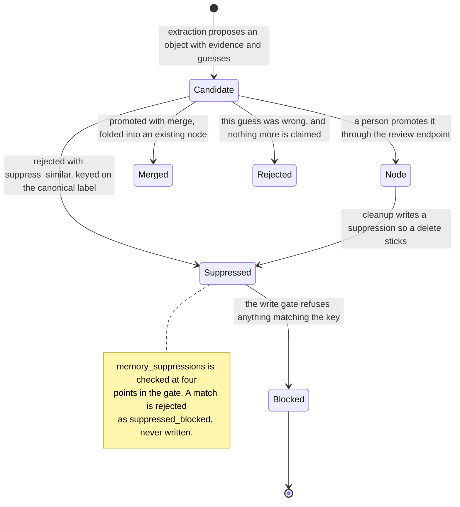

## 1. Executive Summary

Universal Memory Engine — UML in its own README — is a Cloudflare-native memory
service: D1 for storage, Durable Objects, an MCP endpoint, per-tool tokens, and a
dashboard. Roughly 34,000 lines of JavaScript across eleven migrations. It is
Apache-2.0.

The memory model is a small graph. **Nodes** are people, projects, skills, health
facts, tools, interests, preferences and life events, each with a category, a
`state`, aliases and a canonical label. **Slices** hold durable detail about a
node. **Events** record change — started, paused, completed, diagnosed, passed
away. **Edges** join nodes. **Candidates** are things not yet promoted to any of
that.

Two mechanisms put it near the top of this atlas.

**It has a rejected-value tombstone, and the write gate obeys it.** Rejecting a
candidate with `suppress_similar` calls `addSuppression` with the candidate's
`canonical_key`. `memory_suppressions` is a real table with a lookup index on
`(user_id, kind, canonical_key)` and an optional `suppressed_until` for a
time-boxed rejection. Then, in `gates.js`, every write is checked:

```js
const isSuppressed = (kind, label) => suppressionByKindKey.has(`${kind}:${canonicalKey(label)}`);
```

— consulted at four points, and a hit produces `reject(obj, "suppressed_blocked")`
so the object never reaches the plan. That is the shape this atlas has been
asking for in every report: a durable record of a rejected value, keyed on the
value, consulted so later extraction cannot re-assert it. **Three systems carried
it before this one.**

The cleanup pass writes suppressions too, with a comment about guarding against
*"a stray suppression from a half-completed delete-last request"* — so the same
mechanism makes a deletion stick rather than leaving the next extraction free to
recreate what a user just removed.

**And the retrieval eval has forbidden ids.** `eval/fixtures/retrieval_golden.json`
is a 32-query golden set where each query carries `expect_nodes` *and*
`forbid_nodes`, with a spec asserting *"never returns a forbidden identity"*. The
fixture's own description states the discipline: seed the corpus, run recall,
score against expected and forbidden, *"Deterministic: no LLM, USE_VECTORS=false,
so this measures the exact/alias + lexical half that carries the recall hot path
today."* The first case is the one that shows the intent — the query "Universal
Memory Engine" must return `n-uml` and must **not** return `n-uml-college`, a
near-identical label that a careless matcher would confuse.

Most negative evidence in this atlas is one unit test. This is a per-query
forbidden set inside an eval harness, which is the form the
[benchmarks page](../../benchmarks/) argues for and almost never finds.

**The weakness is narrower than usual and worth stating precisely.** `events` has
both `happened_at` and `created_at`, which is the shape of bi-temporal validity.
The manual extraction path populates `happened_at` from the caller when supplied.
The automatic gate does not — `gates.js` sets `happened_at: now` at both of its
event-creation sites. So the column that would distinguish *when something
happened* from *when the system learned it* is collapsed by the writer that
produces most of the memories, and the atlas withholds the mark on that basis.

## 2. Mental Model

A memory is **a node in a small typed graph, or something not yet allowed to be
one**.

The candidate table is the interesting half. Before anything becomes a node it is
a candidate with `label_guess`, `canonical_key`, `role_guess`, `cluster_guess`,
`confidence`, `first_seen_at`, `last_seen_at`, `session_count`, `mention_count`,
`evidence_json`, `possible_parent_id`, `possible_existing_node_id`, `reason` and
`expires_at`. That is a proposal with its evidence, its history and its guesses
about where it belongs, held separately from the store it wants to enter.

### How a thing becomes a belief

Extraction proposes objects. The gate in `gates.js` resolves each against three
things: existing nodes, existing candidates by normalised label, and the active
suppression set. Anything suppressed is rejected outright; anything resolvable is
merged into what exists; anything genuinely new becomes a node or stays a
candidate.

Promotion is a person's decision through `/v1/candidates/{id}/promote`, and the
candidate records `promoted_object_id`, `promoted_object_kind` and `reviewed_at`
when it happens.

### How a belief stops being one

Four ways, and they are unusually well separated.

*Reject* — `status = 'rejected'`. The candidate is out of the queue and nothing
more is claimed.

*Suppress* — `status = 'suppressed'` **plus** a row in `memory_suppressions`
keyed on the canonical label. This is the one that binds the future.

*Merge* — `mergeCandidate` is promotion with `action: "merge_with_existing"`, so
a duplicate becomes part of an existing node rather than a second one.

*Cleanup* — a background pass that deletes and, where deletion must hold, writes
a suppression so the next extraction cannot undo it.

The distinction between *reject* and *suppress* is the design decision worth
copying. "This particular guess was wrong" and "stop proposing this thing" are
different statements, and almost every system in this atlas offers only the
first.



## 3. Architecture

Cloudflare all the way down: Workers for the API, D1 for relational storage,
Durable Objects for coordination, an optional vector index that the eval
deliberately runs without.

**Eleven migrations, each with a dated header and a purpose comment.** The
sequence reads as a design history: receipts, memory pages, auth sessions and
tokens, two auto-mode phases, candidate review, manual memory identity, a forward
repair for it, manual search and communities, and memory rules.

**Receipts are the write audit.** One row per save attempt with
`outcome ∈ {wrote, meaningful_no_write, llm_failed, db_write_failed}` and counts
per object kind. The `meaningful_no_write` value is the one to notice: it
distinguishes *the model decided nothing was worth keeping* from *the write
failed*, which almost nothing in this atlas separates. A user looking at the
Saves page can tell a quiet system from a broken one.

**Memory rules are a user-authored policy.** One row per user with
`custom_instructions`, `includes_json`, `excludes_json`,
`custom_categories_json`, `capture_default`, `auto_collect` and
`retention_days` — what to collect, what to refuse, and whether to collect at all.

### Deployment and ergonomics

A Cloudflare account and `wrangler`. There is no server to run and no database to
provision beyond D1, which is the lightest hosted deployment in this atlas — and
correspondingly the least portable, since D1, Durable Objects and Workers are all
platform-specific.

The store is SQL and the dashboard exposes the candidate queue, so review is a
page rather than a query.

## 4. Essential Implementation Paths

**Schema** — `migrations/0001_init_schema.sql` (nodes, slices, events, edges),
`0002_receipts.sql`, `0003_run_32_memory_pages.sql` (suppressions at `:61`, the
lookup index at `:116`), `0007_candidate_review.sql`, `0011_memory_rules.sql`.

**The gate** — `src/pipeline/gates.js`: suppression load at `:270`,
`isSuppressed` at `:276`, and the four checks at `:328`, `:336`, `:394`, `:485`.

**Candidate lifecycle** — `src/pipeline/candidates.js`: `promoteCandidate`,
`rejectCandidate` (`:243`, with the suppression branch at `:247`),
`mergeCandidate` (`:262`).

**Suppression store** — `src/lib/db.js`: `getActiveSuppressions` (`:90`),
`addSuppression` (`:101`).

**Cleanup** — `src/pipeline/cleanup.js`: `suppressionStatement` (`:64`) and the
delete-last guard at `:206`.

**Routing** — `src/index.js:705` (`/v1/candidates/{id}/{promote|reject|merge}`).

**Eval** — `eval/fixtures/retrieval_golden.json`,
`eval/fixtures/extraction_golden.json`, `test/eval_retrieval.spec.js`,
`test/eval_extraction.spec.js`.

## 5. Memory Data Model

`nodes` carry a label, a `canonical_label`, a category, a role, a `state` from
`active | paused | inactive | completed`, a summary, `mention_count`,
`session_count`, a `heat_score` and a cluster. `slices` hold detail, `events`
hold change with an `action` and an `importance`, `edges` hold typed relations.

**Scope is `user_id` on every table and in every query**, with per-tool API and
MCP tokens layered above so a given assistant's access can be revoked
independently.

**Provenance is `evidence_json` on the candidate** — the material that justified
the proposal, carried until promotion. After promotion the node carries counts
rather than evidence, so the trail thins at exactly the point the claim becomes
durable.

**Temporal modelling is the near-miss.** `events.happened_at` beside
`events.created_at` is the right schema; `manual_extract.js:349` reads a
caller-supplied value and `manual_plan.js` sorts by `happened_at ?? created_at`,
so the read side is ready for it. The automatic path is not.

## 6. Retrieval Mechanics

Exact and alias matching plus lexical recall, with the vector index optional. The
golden set runs with `USE_VECTORS=false` and describes that as measuring *"the
exact/alias + lexical half that carries the recall hot path today"* — an unusually
honest statement about which half of a hybrid retriever is actually load-bearing.

Aliases are first-class on the node, which is what makes the exact/alias lane
work: "UML" and "Universal Memory Layer" resolve to the same node without
embedding either.

The failure mode the eval is built around is **identity confusion**, and the
fixture names it: `n-uml` versus `n-uml-college`. Two nodes whose labels share
most of their tokens are exactly what lexical recall gets wrong, and the forbidden
lists are how the project pins that it does not.

## 7. Write Mechanics

Extraction proposes, the gate disposes. The gate is the whole write path and it
does four things in order: load existing nodes, candidates and suppressions;
resolve each proposed object against them; reject what is suppressed; and emit a
plan of new nodes, updates and candidates.

Emitting a *plan* rather than writing directly is the structural choice that makes
the rest possible — every rejection has a reason (`plan.rejected.push({ kind,
label, reason })`), so the receipt can report what was skipped and why.

Deduplication happens by canonical label against both existing nodes and
in-flight candidates, and within a batch by a `resolved` map so two mentions in
one payload converge on one node.

## 8. Agent Integration

An MCP endpoint with per-user secrets — the server comment notes that Claude
*"rejects static bearer headers and ?query= tokens"*, so the transport is shaped
around a real client constraint — plus an HTTP API and per-tool tokens.

The dashboard is the human half: the candidate queue with promote, reject and
merge, and a Saves page driven by receipts. Together those are the two surfaces
this atlas most often finds missing — a review queue *and* a record of what each
write actually did.

## 9. Reliability, Safety, and Trust

**The suppression list is the strongest correction mechanism in this atlas
outside Verel and RainBox**, and it is stronger than either in one respect: it is
written from two places — an explicit human rejection and the cleanup pass — so
"the user said no" and "the user deleted this" both bind the future through the
same gate.

**Trust states are real.** A candidate is not a node; `pending` genuinely
withholds, because retrieval reads nodes and slices, not the candidate queue.
Promotion is a person's act and is stamped.

**Receipts give the write path an audit** with an outcome vocabulary that
separates a deliberate no-write from a failure.

**What is missing** is provenance after promotion — `evidence_json` lives on the
candidate, and once promoted the node keeps counts rather than the material — and
validity time on the automatic path.

## 10. Tests, Evals, and Benchmarks

The eval is the reason this section is short and positive. Two golden fixtures
with committed corpora, an extraction set and a **32-query retrieval set with
per-query `expect_nodes` and `forbid_nodes`**, run by
`test/eval_retrieval.spec.js` and `test/eval_extraction.spec.js`, deterministic by
construction with the LLM and vectors switched off.

Beside them, unit specs for auth, candidates, cleanup, the dashboard and
extraction.

What would strengthen it: an assertion that a suppressed label stays blocked
across a subsequent extraction run — the tombstone is checked in the gate and the
gate is not covered by the golden set, so the mechanism this report leads with is
the one without a committed test. I inspected these fixtures and specs; I did not
run them.

## 11. For Your Own Build

### Steal

**Separate "this guess was wrong" from "stop proposing this".** Two verbs on the
same review action — `reject` and `reject with suppress_similar` — cost one
boolean and give the user the only correction that binds the future.

**Key the suppression on a canonical form, and check it in the gate.** Not at
query time, not in the UI: at the one place every write passes through, with the
rejection carrying a reason so the receipt can explain it.

**Write a suppression when a delete must stick.** The cleanup pass does this, and
it is the answer to the re-derivation problem that half this atlas has —
deleting a memory that an extractor can rebuild is not deletion.

**Give your eval per-query forbidden ids.** `expect_nodes` alone measures recall;
`forbid_nodes` measures the thing that actually hurts, and the near-identical
label pair in the fixture is the case worth designing around.

**Give a no-write its own outcome value.** `meaningful_no_write` beside
`llm_failed` and `db_write_failed` means a quiet system and a broken one look
different on the dashboard.

### Avoid

**Do not put validity time in the schema and stamp it with `now` on the main
path.** A `happened_at` that equals `created_at` for every automatically
extracted event is worse than no column, because the read side sorts by it and
believes it.

**Do not drop the evidence at promotion.** `evidence_json` justifies the
candidate and does not survive into the node, so the durable object is the one
that cannot say why it exists.

**Do not leave your best mechanism out of the eval.** The suppression gate is the
strongest thing here and the golden set does not exercise it.

### Fit

This suits someone who wants one memory layer shared across several assistants
and is content to live on Cloudflare. The candidate queue assumes a person will
look at it, which is the right assumption for a personal memory and the wrong one
for an unattended pipeline — with `auto_collect` and `capture_default` in
`memory_rules` there to move the balance.

It is not portable. D1, Durable Objects and Workers are the substrate rather than
an implementation detail, so adopting the design elsewhere means keeping the
shapes — candidate table, suppression table, gate — and rewriting everything
under them. Those shapes are the part worth having.

## 12. Open Questions

- **How often does a suppression fire in practice, and does it over-block?** The
  key is a normalised label, so suppressing a common word would silently block a
  legitimate node later; nothing in the fixtures explores that.
- **Is `suppressed_until` used?** The column supports a time-boxed rejection,
  which is a more nuanced answer than permanent suppression, and no call site
  passing it was found.
- **Why does the automatic path stamp `happened_at` with `now`?** The manual path
  reads a supplied value, so the intent exists on one side of the same schema.
- **What happens to a candidate that expires?** `expires_at` is on the table; the
  sweep that acts on it was not located.

## Appendix: File Index

**Schema** — `migrations/0001_init_schema.sql`, `0002_receipts.sql`,
`0003_run_32_memory_pages.sql`, `0007_candidate_review.sql`,
`0011_memory_rules.sql`.

**Write gate** — `src/pipeline/gates.js`.

**Candidates** — `src/pipeline/candidates.js`, `src/index.js:705`.

**Suppressions** — `src/lib/db.js` (`getActiveSuppressions`, `addSuppression`),
`src/pipeline/cleanup.js`.

**Manual path** — `src/pipeline/manual_extract.js`, `manual_plan.js`.

**MCP** — `src/mcp/server.js`.

**Eval** — `eval/fixtures/retrieval_golden.json`,
`eval/fixtures/extraction_golden.json`, `test/eval_retrieval.spec.js`,
`test/eval_extraction.spec.js`.

**Licence** — `LICENSE` (Apache-2.0).

## History

**2026-07-31** — [`db98ef59999beb5c33d9aba190cb2c82bf9401cb`](https://github.com/12ziyad/universal-memory-engine/commit/db98ef59999beb5c33d9aba190cb2c82bf9401cb) — first reading.
