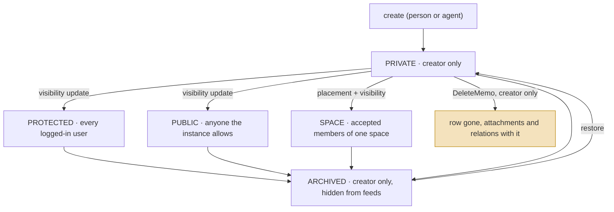

## 1. Executive Summary

Memos is a self-hosted note service — one text box, Markdown, tags, a
timeline — that has been in development since December 2021 under the MIT
licence and, at this commit, exposes its memo API to agents through a
Model Context Protocol server. It is in this atlas as a **store an agent can
be pointed at**, in the family of [Joplin](../joplin/) and
[Logseq](../logseq/), not as a memory system in its own right: nothing here
extracts, consolidates, decays or scores. A memo says what someone typed.

What earns it a report rather than a bullet is the **access predicate**. Every
memo carries a creator, a visibility of `PRIVATE`, `PROTECTED`, `PUBLIC` or
`SPACE`, and an optional space. The service resolves the caller into a
`MemoAccessScope` and the storage driver renders that scope as one SQL `WHERE`
clause, appended before `LIMIT` and `OFFSET`, so a memo the caller may not read
is neither returned nor counted nor paginated over
(`store/db/sqlite/memo_access.go:12-40`). The same predicate guards point
reads, comment listings, attachments and reactions, and the design note that
introduced spaces states the rule in a form a reader can check: an unknown
visibility denies, a missing placement denies, and a filter can only narrow
(`docs/design/multi-spaces.md:160-185`). The store tests seed two users and
assert that the viewer's list holds exactly the public rows
(`store/test/memo_access_test.go:13-68`). That is `scope_enforced` and
`negative_eval` by the atlas's definitions, both earned on the read path.

The MCP surface is deliberately thin. `server/router/mcp/catalog.go:12-36` is
an allowlist of twenty REST operations — fourteen on memos, four on
attachments, memo views, and a read-only *whoami* — each wrapped as a tool from
the embedded OpenAPI document. The server is stateless streamable HTTP,
rejects session methods, and forwards the caller's `Authorization` header to
the REST handler unchanged (`server/router/mcp/service.go:146`,
`adapter.go:89`), so an agent has exactly the rights of the token it holds and
no separate policy to audit.

The limits follow from the unit. A memo has no trust state, no provenance
beyond its creator, no validity interval and no tombstone: `DeleteMemo` is a
row delete by the creator only, and nothing remembers that the memo existed.
Retrieval is a CEL filter compiled to SQL with `content.contains()` as its
only text operator — no full-text index, no embeddings, no ranking beyond pin
and time. An agent that uses Memos as memory gets a scoped, durable, human-
readable log of notes and must bring every other mechanism itself.

## 2. Mental Model

A memory is a **memo**: one Markdown document with an author, an audience, a
lifecycle flag and a bag of derived properties. The audience is the model's
whole vocabulary of trust — not *how sure* but *who may see*:

The state machine is short because it is a permissions model, not an
epistemic one. `PRIVATE`, `PROTECTED`, `PUBLIC` and `SPACE` are set by the
author and say nothing about whether the content is right; `ARCHIVED` hides a
memo from feeds and keeps it readable by its creator. There is no candidate,
no verified, no superseded, no rejected. What the model buys is one guarantee
the atlas rarely sees stated so plainly: *a read never widens*. A CEL filter,
a share link, a comment relation or a space membership can restrict or, in the
share case, admit one memo; none can leak a row the predicate would hide.

## 3. Architecture

Go, MIT, 4,759 commits since 2021-12-08, release v0.30.0 dated 2026-07-26.
86,894 lines of Go with 881 test functions in 153 files, a React client, and
a protobuf API served over gRPC and a REST gateway. The parts this report
reads:

- `store/` — the `Memo` model, the driver interface and three dialect
  implementations under `store/db/{sqlite,mysql,postgres}/`, with the memo
  DDL in `store/migration/sqlite/LATEST.sql:51-64`.
- `server/access/` — the memo-local read decision, `CheckMemoReadContext`,
  and the audience matrix it encodes.
- `server/router/api/v1/` — the gRPC services; `memo_access.go` resolves the
  caller into a scope, `memo_service.go` lists, creates, updates and deletes.
- `internal/filter/` — a CEL parser, an intermediate representation and a
  per-dialect renderer that turns `content.contains("x") && tag in ["a"]`
  into SQL.
- `server/router/mcp/` — 3,107 lines: the catalog allowlist, a service that
  builds tools from the embedded OpenAPI document, an adapter that replays a
  tool call as an HTTP request against the gateway, and an evaluation file.

```mermaid
%% caption: an agent's MCP tool call is replayed as an HTTP request with its own bearer token against the REST gateway, which resolves the caller into an access scope that the storage driver renders as a WHERE predicate before pagination
flowchart LR
    AG["agent over MCP"] -->|"tool call + Authorization"| MCP["mcp/service.go: catalog allowlist, stateless HTTP"]
    MCP -->|"adapter.go replays as HTTP"| GW["gRPC gateway REST"]
    W["web client"] --> GW
    GW --> API["api/v1 MemoService"]
    API -->|"resolveMemoAccessScope"| SC["MemoAccessScope: user, allow public, allow protected"]
    API -->|"CEL filter"| F["internal/filter → SQL"]
    SC --> DRV["store driver"]
    F --> DRV
    DRV -->|"WHERE audience AND filter, then LIMIT"| DB[("memo · memo_relation · attachment · reaction")]
```

### Deployment and ergonomics

- **What has to run:** one Go binary with an embedded client, and a database
  — SQLite by default in a data directory, MySQL or Postgres by flag. No
  model, no API key, no worker.
- **Fully local and offline:** yes. The only model in the codebase is a
  transcription service (`proto/api/v1/ai_service.proto:13`, one RPC), and
  memos never touch it.
- **Hand-repairable:** yes. The store is one table of Markdown with a JSON
  payload; a person can read and edit it with the database's own client.
- **Install:** a Docker image or a binary. The bar is low, which is the point
  of the product.

## 4. Essential Implementation Paths

**Resolve the caller.** `server/router/api/v1/memo_access.go:67-84`.
`newMemoAccessScope` builds `{AllowPublic, AllowProtected: user != nil,
UserID}`; for an anonymous caller the instance setting decides whether
`PUBLIC` is readable at all. The comment above it is the contract: *drivers
apply it as a database predicate before LIMIT/OFFSET so inaccessible rows can
neither leak nor skew counts and pagination.*

**List.** `memo_service.go:77-99`. The scope goes into `memoFind.Access`, the
caller's CEL filter is parsed and rendered, and an explicit `creator` filter
narrows to one user. `store/db/sqlite/memo.go:166-167` appends the rendered
predicate to the `WHERE` list; ordering is pinned first, then created or
updated time, then id.

**The predicate.** `store/db/sqlite/memo_access.go:12-40`. `PUBLIC` when
allowed; for an authenticated caller, `PRIVATE AND creator_id = ?`,
`PROTECTED` when allowed, and `SPACE AND EXISTS (accepted membership)`; the
whole thing wrapped in a check that the creator row exists and that a `SPACE`
memo has a space that exists, and that `row_status = 'NORMAL'` unless the
caller is the creator. When no clause applies the predicate is the literal
`1 = 0`. The Postgres and MySQL renderers are the same function in their own
dialect (`store/db/postgres/memo_access.go:13`).

**Point read.** `server/access/memo.go` — `CheckMemoReadContext` takes the
memo, the viewer, whether anonymous access is allowed, whether the creator
and the space are valid, and an optional share id, and returns a decision
class or a denial. `memo_access.go:51-62` maps the denial to *not found*,
*unauthenticated* or *permission denied*.

**Create.** `memo_service.go` `CreateMemo` — the creator is the caller, the
visibility is validated, the payload properties (`has_link`,
`has_task_list`, `has_code`, `has_incomplete_tasks`, `title` from the first
heading) are derived from the Markdown (`proto/store/memo.proto:15-23`).

**Delete.** `memo_service.go:484-520`. The caller must be the creator (line
508); `store/memo_delete_policy.go:41-47` deletes the memo, its owned
attachments and every relation it is an endpoint of, atomically. No row is
left behind.

**MCP.** `server/router/mcp/catalog.go:12-36` names the operations;
`service.go:133-146` wraps each as a tool handler that reads the request's
`Authorization` header; `adapter.go:89` sets it on the replayed HTTP request.
`validation.go` checks arguments against the OpenAPI schema before the call.

**Filter.** `internal/filter/schema.go:93-100` declares `content` with
`SupportsContains`; `render.go:426-492` handles `tag` and `tags in [...]`
against the JSON payload with string literals only.

## 5. Memory Data Model

The `memo` table (`store/migration/sqlite/LATEST.sql:51-64`):

| Column | Meaning for an agent |
| --- | --- |
| `uid` | the public identifier, `memos/{uid}` in the API |
| `creator_id` | the only provenance; set by the server from the caller |
| `row_status` | `NORMAL` or `ARCHIVED`; archived rows are creator-only |
| `content` | Markdown, whole |
| `visibility` | `PUBLIC`, `PROTECTED`, `PRIVATE` (default) or `SPACE` |
| `pinned` | ordering hint |
| `payload` | JSON: `tags[]`, `location`, derived `property` |
| `space_id` | required when visibility is `SPACE`, otherwise null |

**Relations.** `memo_relation` links two memos as `REFERENCE` or `COMMENT`.
A comment is itself a memo with its own visibility; the access test's
central assertion is that *"COMMENT relations must neither grant nor
restrict memo-local read access"* — a readable comment on an unreadable
context is returned, an unreadable comment on a readable context is not.

**Temporal:** `created_ts` and `updated_ts`, both settable by the author on
create (`store/test/memo_test.go:390-448`). There is no validity interval and
no history; an update overwrites `content`. `bitemporal` is withheld.

**Trust:** none on content. Visibility is an audience, `row_status` is a
lifecycle flag, and both are chosen by the author rather than derived by the
system or applied to withhold a doubtful memory from a reader who is allowed
to see it. `trust_state` is withheld on the same reasoning the atlas applies
to Joplin's trash.

**Scoping:** the creator, the visibility and the space, all stored on the
row and all applied by the predicate. This is the mark the system earns.

## 6. Retrieval Mechanics

There is no retriever in the atlas's sense. A list is a filter:

1. The CEL expression — `content.contains("deploy") && "work" in tags &&
   created_ts > now() - 86400` — is parsed (`internal/filter/parser.go`),
   lowered to an IR and rendered to the dialect's SQL. `content` supports
   `contains` only; `creator` compares for equality against `users/{name}`;
   `tag` and `tags` take string literals.
2. The access predicate is appended.
3. Ordering is `pinned DESC`, then `created_ts` or `updated_ts` in the
   requested direction, then `id DESC`; a page size and a token paginate.

No full-text index exists in any dialect, no embedding is computed, and no
score is returned (`rg -n 'FTS|fts5|embedding|vector' -g '*.go'` finds no
memo code). For an agent this means retrieval is *recall by tag or
substring*, which is exact and cheap and does not degrade with corpus size
until `LIKE` over `content` does.

**Failure modes:** a `contains` on a long memo matches on any substring, so a
query for a short term returns every memo that mentions it anywhere;
without ranking, the newest or pinned memo wins regardless of fit; and
`PROTECTED` is every logged-in user, so an agent listing with a shared token
reads its colleagues' protected notes as readily as its own.

## 7. Write Mechanics

**Literal and synchronous.** `CreateMemo` stores the Markdown as sent, stamps
the caller as creator, defaults the visibility to `PRIVATE`, and derives the
payload properties. Nothing is extracted, merged or deduplicated: two memos
with the same text are two rows.

**Update** is a field-mask update in place — `content`, `visibility`,
`pinned`, `row_status`, `space`, tags through the payload — with no version
kept. The MCP layer lets the gateway infer the mask when the agent omits it
(`service_test.go:182`).

**Delete** is final and creator-only. There is no soft delete other than
`ARCHIVED`, no tombstone and no record of what was removed; `tombstone` and
`audit_log` are withheld.

**Conflicts:** last write wins. There is no `If-Match`, no version field and
no detection that a person edited the memo between an agent's read and its
write.

**Malicious input:** stored and returned as written. The Markdown is rendered
by the client; the server validates the visibility and the space, not the
text.

### Operational cost

- One insert plus the payload derivation; no model call on any path.
- A new memo is listable in the same transaction; there is no index lag
  because there is no index.
- One background runner, `server/runner/memopayload/runner.go:27`, rebuilds
  the derived payload properties of every memo from its Markdown; a webhook
  is dispatched on create (`memo_service.go:65-67`), update and delete.
- Nothing is injected into a prompt by the system. The agent lists, reads and
  decides.

## 8. Agent Integration

The MCP server (`server/router/mcp/README.md`) is an allowlist over the REST
API rather than a second API. Its properties, each with a test:

- **Curated tools only.** `TestMCPProtocolListsCuratedToolsOnly`
  (`service_test.go:114`) asserts the tool list equals the catalog; the
  catalog marks each operation idempotent or destructive
  (`catalog.go:63-101`) so a client can gate the destructive ones.
- **Authorization passthrough.** `TestMCPToolHandlerForwardsArgumentsAndAuthorization`
  (`service_test.go:77`): the bearer token on the MCP request is the bearer
  token on the replayed REST call. An agent's scope is its token's scope.
- **Stateless.** `TestMCPStatelessProtocol2026` and
  `TestMCPStatelessRejectsSessionMethods` (`service_test.go:480-564`): no
  session id, no server-side state per agent.
- **Argument validation** against the OpenAPI schema before the call
  (`TestMCPToolCallRejectsInvalidArguments`, `service_test.go:318`), with the
  memo bound from the path for body-star operations.
- **Loopback and origin checks** for a server behind a reverse proxy
  (`origin.go`, `service_test.go:397`).
- **Whoami.** `AuthService_GetCurrentUser` is the only identity operation
  exposed, so an agent can learn which `users/{id}` its token is before it
  filters by creator.

The design note is explicit that *MCP memo operations reuse the same memo
policy; Space management is not exposed through MCP*
(`docs/design/multi-spaces.md:169`). There is no prompt, no injection and no
session memory: Memos does not know an agent is talking to it, and the
integration is as loosely coupled as an HTTP API can be. `CONTEXT.md` and
`AGENTS.md` at the repository root are a glossary for coding agents working
on the codebase, not runtime configuration.

## 9. Reliability, Safety, and Trust

**The predicate is the safety model, and it is tested where it matters.**
`store/test/memo_access_test.go` seeds two users and asserts the viewer's
list, the comment cases, the archived-rows-remain-author-only case (line
133) and the no-author-bypass case for `SPACE` (line 96): the author of a
space memo who leaves the space loses the read. `server/access/memo_test.go`
covers the decision function's matrix including the fail-closed branch for an
invalid state (line 82). The API-level tests under
`server/router/api/v1/test/` exercise relations, attachments and views
against the same scope.

**What the model does not do.** It does not mark a memo as doubtful,
superseded or agent-written beyond `creator_id`; an agent with a person's
token writes as that person. It does not keep history: an edit replaces, a
delete removes. It does not separate an agent's memos from the person's
except by a tag the agent chooses to add. And the `PROTECTED` audience —
every authenticated user — is the one an agent should treat as public.

**Human review:** a person can read and edit every memo in the web client,
which is display and edit of live rows rather than adjudication of a pending
one. `human_review` is withheld.

**Concurrency:** the delete is one transaction under a policy check; the
update is a plain row update with no version. Two agents editing one memo
interleave silently.

## 10. Tests, Evals, and Benchmarks

881 test functions in 153 files. The ones that bear on this report:

- `store/test/memo_access_test.go` — five tests, two users, lists asserted
  by exact id sets.
- `server/access/memo_test.go` — five tests over the decision matrix.
- `store/test/memo_test.go:184-247` — `TestMemoListByVisibility`, one user
  listing by visibility filter.
- `server/router/mcp/*_test.go` — 59 tests across adapter, catalog,
  OpenAPI, service and validation.
- `server/router/mcp/evals/memos_eval.xml` — ten question-and-answer pairs
  over a seed dump, the file a hosted evaluator reads; no scorer and no
  results are committed.

The `negative_eval` mark rests on `TestMemoAccessScopeUsesEachMemoAudience`:
four memos seeded, a populated result of two for the viewer, four for the
owner, and the private rows named as the material that must not appear.

No memory benchmark exists and none would apply; there is nothing to
extract or rank.

## 11. For Your Own Build

### Steal

- **Render the scope as a predicate, not a post-filter.** Building the
  audience clause once and appending it before `LIMIT` is what makes counts,
  pages and lists agree; the comment in `memo_access.go` says why in one
  sentence, and the two-user test proves it.
- **Fail closed on unknown state.** An unrecognised visibility or a missing
  space denies. The alternative — treating an unknown value as public — is
  how a migration leaks.
- **An MCP server as an allowlist over the API you already authorise.** No
  second policy, no second bug surface, and the agent's rights are exactly
  the token's.
- **Say which tools are destructive** in the catalog so the client can gate
  them; it costs one map.

### Avoid

- **Treating a note service as a fact store.** No dedupe, no state, no
  provenance beyond creator, no history: an agent that writes memories here
  must carry all of that itself or accept a log.
- **A default audience of "everyone logged in."** `PROTECTED` is a
  reasonable default for a team wiki and a leak for a personal agent whose
  token is shared with a colleague's.
- **Hard delete as the only forget.** Once the row is gone nothing prevents
  the same memo being written again, and nothing tells an auditor it was
  there.

### Fit

Memos fits an agent that needs a durable, scoped, human-readable place to
put notes a person will read — a daily log, a running list, a shared
scratchpad — and that brings its own retrieval and its own judgement about
what to keep. The scope predicate is better than most purpose-built memory
stores in this atlas manage, and the MCP surface is the cleanest way to hand
an agent exactly one user's rights.

It does not fit a system that needs trust states, supersession, provenance,
tombstones or semantic recall. For those, keep Memos as the human-facing
surface and put the memory layer in front of it.

## 12. Open Questions

- **Does the Postgres `LIKE` on `content` become the bottleneck**, and at
  what corpus size? No index is declared on `content` in any dialect.
- **Will the evaluation file grow a scorer?** `memos_eval.xml` holds
  questions and answers with nothing that runs them.
- **Is `PROTECTED` the default in any deployment path?** The DDL default is
  `PRIVATE`; the client's default was not traced.
- **Will spaces reach the MCP catalog?** The design note excludes space
  management from the initial version and does not say when that changes.

## Appendix: File Index

**Model and storage**

- `store/migration/sqlite/LATEST.sql` — `memo` DDL (lines 51–64)
- `proto/store/memo.proto` — payload `Property`, `Location`, `tags` (lines
  8–23)
- `store/db/sqlite/memo_access.go` — `sqliteMemoAccessPredicate` (lines
  12–40); `store/db/postgres/memo_access.go:13` and the MySQL twin
- `store/db/sqlite/memo.go` — the predicate appended to the list query (lines
  166–167)
- `store/memo_delete_policy.go` — `DeleteMemoWithPolicy` (lines 9–47)

**Access**

- `server/access/memo.go` — `CheckMemoReadContext`
- `server/router/api/v1/memo_access.go` — `buildMemoReadContext` (line 17),
  `memoAccessDecisionError` (line 51), `newMemoAccessScope` (line 67),
  `resolveMemoAccessScope` (line 79)
- `server/router/api/v1/memo_service.go` — `CreateMemo` (line 23),
  `ListMemos` (lines 77–99),
  `DeleteMemo` (lines 484–520)
- `docs/design/multi-spaces.md` — the policy predicate and the MCP sentence
  (lines 160–185)

**Filter**

- `internal/filter/schema.go` — `content` with `SupportsContains` (lines
  93–100); `render.go` — tags (lines 426–492)

**MCP**

- `server/router/mcp/catalog.go` — the allowlist (lines 12–36), idempotent
  and destructive sets (lines 63–101)
- `server/router/mcp/service.go` — tool handler and `Authorization` (lines
  133–146); `adapter.go:89`; `validation.go`; `origin.go`; `README.md`
- `server/router/mcp/evals/memos_eval.xml` — ten QA pairs

**Tests**

- `store/test/memo_access_test.go` — five tests (lines 13–217)
- `server/access/memo_test.go` — five tests (lines 11–146)
- `store/test/memo_test.go` — `TestMemoListByVisibility` (line 184), custom
  timestamps (line 390)
- `server/router/mcp/service_test.go` — fourteen tests (lines 22–565)

**Searches recorded for the negative claims**

- `rg -n 'FTS|fts5|embedding|vector' -g '*.go' .` — no memo code; the
  only model is `Transcribe` in `proto/api/v1/ai_service.proto:13`.
- `rg -n 'If-Match|version|etag' server/router/api/v1/memo_service.go` — no
  concurrency check on update.
- `rg -n 'tombstone|soft.?delete|deleted_ts' store/` — none; `row_status` is
  `NORMAL` or `ARCHIVED` only.
- `rg -n 'SpaceService' server/router/mcp/catalog.go` — no hit; spaces are
  not in the catalog.

## History

**2026-09-07** — [`3d97b39f2d492e7dd1c887594dd4ec16ff54ee3f`](https://github.com/usememos/memos/commit/3d97b39f2d492e7dd1c887594dd4ec16ff54ee3f) — first reading.
