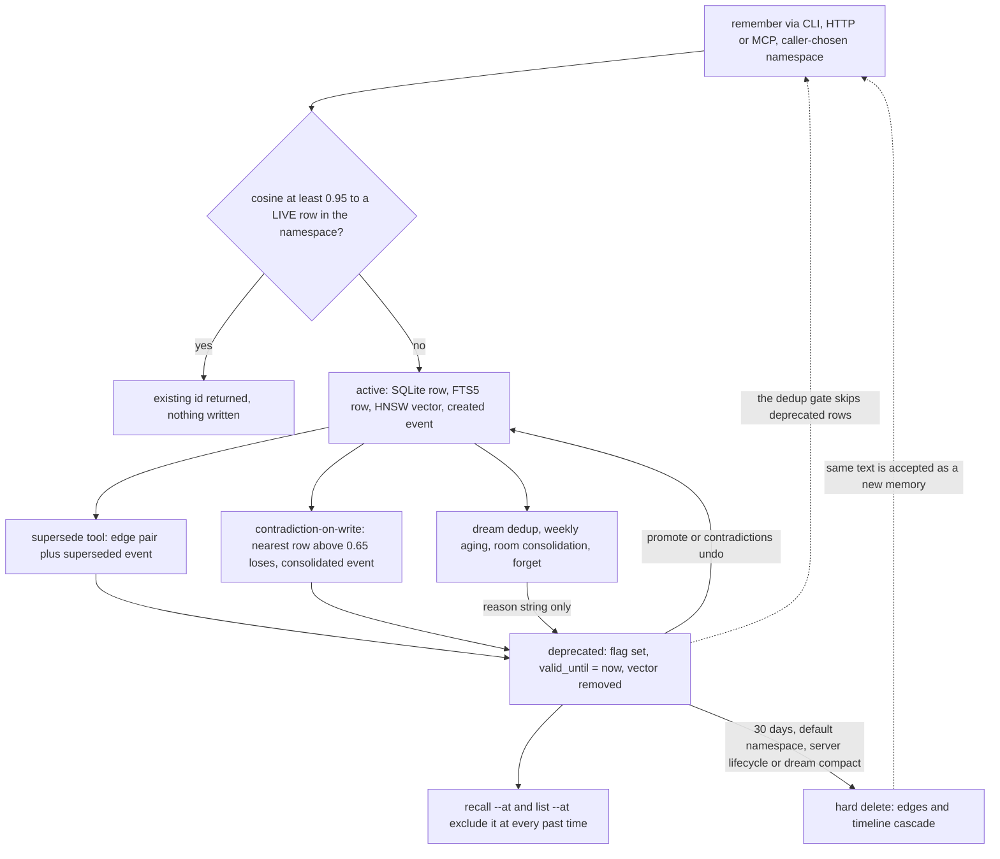

## 1. Executive Summary

Uteke is a local memory engine for AI agents shipped as one Rust binary family: SQLite with FTS5, a usearch HNSW index, and EmbeddingGemma (Q4 ONNX, 768 dimensions) on the CPU, behind a CLI, an HTTP daemon and a stdio MCP server with 46 tools. Apache-2.0, 228 commits on `develop` since 29 May 2026, 57,559 lines of Rust in five crates and 706 test functions, 34 of them ignored because they need the model. CI runs clippy with warnings as errors and the suite, and `cargo mutants` runs on pull requests to `main`.

**Retrieval is where the engineering went.** The default `fusion` strategy is a weighted reciprocal-rank fusion of a vector ranking and a vector-plus-FTS5 ranking, with weights tuned on a LongMemEval subset and a comment saying so. The raw per-question output of the full 500-question LongMemEval-S run is committed, and the README's 98.4% recall_any@5 recomputes from it exactly: 492 correct out of 500.

**Scope is a real predicate.** Every memory carries a `namespace`; the lexical arm filters it in SQL, the vector arm before scoring, and two committed tests that run in CI assert that a same-text row from another namespace, and a deprecated row, stay out of a populated result. Those earn `scope_enforced` and `negative_eval`. The boundary is chosen by the caller, though: no token binds a namespace, an HTTP recall without one reads all of them, documents have no namespace predicate, and the server's background dedup merges near-duplicates across namespaces.

**Correction is a soft delete, and the design stops there.** Every path that retires a memory — forget, the `supersede` tool, contradiction-on-write, dream dedup, weekly aging, room consolidation — sets `deprecated = 1`, stamps `valid_until` with the current time and removes the vector. `supersede` is done carefully: one transaction, an edge pair, provenance events on both memories and an undo that records itself. But point-in-time recall never returns a deprecated row, the timeline records no dedup, aging or room-consolidation deprecation and no content edit, the server prunes deprecated rows after thirty days with their edges and events, and a committed test asserts that writing a retired value again stores it as new. `audit_log`, `bitemporal` and `tombstone` are withheld on those grounds.

**Several declared paths do not work at this commit.** With default configuration neither auto-recall hook injects anything: the pi extension passes a flag the CLI does not accept, and the Hermes plugin either parses a JSON shape the CLI does not emit or drops every hit below a threshold the default strategy's scores cannot reach. The dream cycle's contradiction edges and the MCP `uteke_graph_add_edge` tool insert raw memory ids where a foreign key wants graph-node ids. Room consolidation writes its merged record under a metadata key the linker never reads. Each is a one-line repair.

## 2. Mental Model

A memory is a row of text an agent or a person hands to `remember`; nothing is extracted on the hot path. It is believed while `deprecated = 0`. The only other epistemic signal is attribution — `author_type` of `human` or `agent`, and a `source_type` such as `user`, `url`, `import` or `derived` — which `TrustTier::of` maps to a tier at read time for the provenance report and the room-consolidation gate, and which no recall path reads.

The paths that retire a memory leave very different amounts behind. `supersede` writes a `superseded_by`/`supersedes` edge pair and two provenance events. Contradiction-on-write writes one `consolidated` event on the loser. Dream dedup, aging, room consolidation and forget write a `deprecate_reason` string and nothing else. Every deprecated row can be restored — `promote`, or `contradictions undo` for a supersession — until a prune deletes it. The word *contradiction* means two unrelated things: on write, cosine above 0.65 in the same namespace, so the nearest related memory is retired; in the dream cycle, shared tags with cosine at or below 0.6.



## 3. Architecture

Five crates: `uteke-core` (the library), `uteke-cli`, `uteke-server` on `tiny_http` with one `Arc<Mutex<Uteke>>`, `uteke-mcp` (the shared JSON-RPC handler and a stdio binary) and `docgen`. The store lives in `~/.codecora/uteke` or `UTEKE_HOME`: a SQLite file opened with WAL, a 5-second busy timeout and foreign keys on (`crates/uteke-core/src/memory/store.rs:201-206`), a usearch index file (or the pure-Rust `vecq` backend, chosen at runtime), and an embedding cache. Vectors are stored twice, as a BLOB on the row and in the index, so `uteke repair` can rebuild the index from SQLite. Embeddings default to local ONNX; OpenAI-compatible and Ollama embedders and a cloud fallback are optional.

**One process per store.** `load_or_create_for` takes an exclusive lock on the index file and holds it for the life of the `Uteke` instance (`crates/uteke-core/src/memory/vector.rs:441-467`); a second process retries for 30 seconds (`:866-867`). When the lock times out, `Uteke::open` treats the error as a corrupt index: it deletes the index and `.keys` files and continues with an index that has no path (`crates/uteke-core/src/lib.rs:893-911`). On Unix the unlink succeeds under the other process's lock, so a `uteke` command run while a long-lived `uteke-mcp` holds the store removes that process's index files and then works from an index it never saves. The CLI routes through the HTTP server when the server is enabled and answers, which avoids this for the daemon but not for the stdio MCP binary.

**Deployment.** One binary, no API key, a 200 MB model on first run; a Docker image for the daemon. The server runs three background threads: a weekly lifecycle cycle, a three-day dream cycle, and a daily update check that sends a `HEAD` to `github.com/codecoradev/uteke/releases/latest` (`crates/uteke-core/src/update_check.rs:185`); the stdio MCP binary makes the same check at start. No memory content leaves the machine unless extraction or a cloud embedder is configured. The store is SQLite and can be inspected and repaired by hand.

## 4. Essential Implementation Paths

- **Write.** `remember_embed` (`crates/uteke-core/src/operations.rs:161-219`) embeds, calls `check_duplicate` — a 5-nearest search that returns an existing id at cosine 0.95 or above in the namespace, skipping hits whose row is deprecated or gone (`:231-296`, `:283-291`) — then `remember_precomputed` (`:299-421`) inserts with `valid_from = now`, writes a SHA-256 of the content, appends a `created` event, wires edges from `[[slug]]`, `@tag` and `^uuid` markup, inserts the vector, saves the whole index file, and adds `similar_to` and `possible_duplicate` edges at cosine 0.80 and 0.92.
- **Recall.** `recall_hybrid` (`:612-685`) checks a cache, computes over a boost window of `4 x limit + 16`, applies salience and recency boosts, then `min_score`, then truncates. `compute_recall` (`:695-768`) dispatches: `Vector` is `recall_inner` (`:455-607`), which searches the HNSW index, fetches rows, drops other namespaces, tags and deprecated rows, and adds 0.1 to the cosine of memories accessed in the last seven days; `Fts5` is a phrase match with a token-OR fallback; `Hybrid` is unweighted RRF of vector and FTS5 (`:943-1068`); `Fusion` is `rrf_fuse_weighted` of `Vector` and `Hybrid` at 1.7 and 1.0 (`:2249-2296`).
- **Unified recall.** `recall_unified` (`crates/uteke-core/src/lib.rs:2134-2179`) is the default for the CLI and MCP. For `type = all` it resolves an omitted namespace to `default`, runs memory recall and `doc_search`, and fuses them by RRF (`:2330-2482`); `doc_search` takes no namespace (`:1908-1913`).
- **Supersede and undo.** `supersede` (`crates/uteke-core/src/edges.rs:1977-2108`) clears any prior pair, inserts both edges and deprecates the old row in one transaction (`:2007-2050`), writes `superseded` and `updated` events with an actor and evidence (`:2056-2084`), and removes the vector. `undo_supersession` (`:2139-2226`) reverses it in one transaction and records `supersession_undone`. `contradiction_resolutions` (`:2236-2292`) lists deprecated rows that carry a `superseded_by` edge.
- **Contradiction-on-write.** `remember_with_contradiction` (`crates/uteke-core/src/consolidate.rs:61-154`), reached by `--detect-contradiction` and `detect_contradiction` on HTTP at threshold 0.65 (`crates/uteke-server/src/handlers.rs:194-204`), retires the first live neighbour in the namespace above the threshold (`consolidate.rs:27-31`) with a `consolidated` event and `Store::deprecate`, and bypasses the 0.95 dedup gate.
- **Lifecycle.** `lifecycle_cycle` (`crates/uteke-core/src/maintenance.rs:511-610`) deprecates the oldest unpinned rows older than 90 days with at most three accesses, capped at 1% of active rows between 1 and 50, then hard-deletes rows deprecated more than 30 days (`:570-596`). Both queries resolve an absent namespace to `default` (`crates/uteke-core/src/memory/aging.rs:142`, `crates/uteke-core/src/memory/bulk.rs:287`), so the server's `lifecycle_cycle(None)` touches only that namespace.
- **Dream.** `dream` (`crates/uteke-core/src/dream.rs:127-206`) runs lint, backlinks, dedup — `consolidate` at cosine 0.92, keeping the newer row (`crates/uteke-core/src/consolidate.rs:233-332`) — contradiction scan, orphan count, compact (prune at 30 days) and verify.
- **Time travel.** `recall_at_time` (`crates/uteke-core/src/operations.rs:1801-1853`) asks `recall_inner` for deprecated rows too and filters with `memory_existed_at` (`:2648-2672`); `list_at_time` is SQL with `deprecated = 0` in every branch (`crates/uteke-core/src/memory/crud.rs:785-904`).

## 5. Memory Data Model

| Table | Holds |
| --- | --- |
| `memories` | `id` (UUIDv7), `content`, `embedding` BLOB, `tags`, `metadata`, `namespace`, `memory_type`, `importance`, `pinned`, `access_count`, `last_accessed`, `deprecated`, `deprecate_reason`, `deprecated_at`, `valid_from`, `valid_until`, `slug`, `source`, `source_type`, `author_type`, `source_hash` (`crates/uteke-core/src/memory/store.rs:11-36`) |
| `memory_tags`, `memories_fts` | a tag join table and an FTS5 index over content, tags, namespace and type, kept by triggers |
| `memory_edges` | typed edges between memories — `supersedes`, `superseded_by`, `references`, `similar_to`, `possible_duplicate` and more — cascading on delete (`:69-76`) |
| `graph_nodes`, `graph_edges` | a separate entity graph whose edges reference `graph_nodes(id)` (`:47-63`) |
| `timeline_events` | per-memory events with `actor` and `evidence_json`, `memory_id` cascading on delete (`:82-90`) |
| `documents`, `document_chunks`, `documents_fts` | a hierarchical wiki with a version counter, chunked and embedded; slugs are global with no namespace isolation (`crates/uteke-core/src/memory/documents.rs:181`) |
| `rooms`, `room_memories`, `room_documents` | rooms as a join to memories with a caller-supplied `author` and `role` |

`valid_from` always equals `created_at` — the write time, or the file's `created_at` on JSONL import (`crates/uteke-core/src/import_export.rs:116-123`) — and outside import and restore, every statement that sets `valid_until` is a deprecation stamping the current time, or its undo (`bulk.rs:158`, `:174`, `:211`, `edges.rs:2035`, `tags.rs:512`). An HTTP caller's `valid_from` and `valid_until` are copied into `metadata` (`crates/uteke-server/src/handlers.rs:158-163`), which no time filter reads. The nine memory types select a recency time constant: 365 days for decisions and preferences, 180 for facts, 30 for events.

## 6. Retrieval Mechanics

Fusion is the default everywhere — CLI, server and MCP — and it is a sound design: the vector and hybrid arms fail on different questions, and weighted RRF keeps both. What follows it is not calibrated to it. After `rrf_fuse_weighted` a memory's score is the fused RRF sum, at most `(1.7 + 1.0) / 61 ≈ 0.044`, and `recall_hybrid` then adds `0.1 x salience + 0.1 x recency` (`crates/uteke-core/src/salience_recency.rs:40-47`, `:121-138`), on by default in the library (`lib.rs:958`) and the CLI (`crates/uteke-cli/src/commands/recall.rs:96-110`).

**The boosts outweigh the ranking inside the window.** For a `fact`, a 30-day age gap is worth 0.015 of recency; the fused gap between rank 1 and rank 35 in both arms is 0.016. With the default limit of 5 the window is 36 candidates, so the final top five inside it is ordered about as much by age and importance as by relevance.

**No memory can clear a cosine-scale threshold.** The best possible default score is about 0.244, or 0.344 with both boosts raised to the 0.15 the config offers. `--strict` resolves to 0.5 (`crates/uteke-cli/src/config.rs:267`, `crates/uteke-server/src/types.rs:466`), so a strict recall under fusion returns documents and no memories; the unified path's comment says memories report a real cosine (`lib.rs:2391-2398`), which holds only for the `vector` strategy, and there only before the boosts.

Access tracking counts candidates, not results: every sub-search bumps `access_count` and `last_accessed` on everything it returned (`operations.rs:602-604`, `:1063-1065`, `crates/uteke-core/src/memory/aging.rs:26-45`). One default MCP recall with limit 5 runs a 168-row vector search inside its hybrid arm and touches up to 168 memories. Access feeds the seven-day hot boost, salience, and the aging rule that spares any row accessed more than three times.

Retrieval quality is otherwise careful: FTS5 scores are normalised over surviving rows only, filters widen the vector pool up to three times before giving up, the cache stores pre-boost scores so warm and cold reads agree, and `--explain` replays each stage.

## 7. Write Mechanics

Writes are synchronous and local. A `remember` blocks for one CPU embedding (the code puts it near 50 ms), a 5-nearest dedup search, three SQLite writes, edge wiring, a 20-nearest auto-link search, and a save that serialises and rewrites the whole index file (`operations.rs:387-405`, `vector.rs:575-600`) — about 3 KB per stored vector at 768 `f32` dimensions, so near 30 MB per write at 10,000 memories. A memory is retrievable as soon as the call returns. LLM extraction and room consolidation are opt-in and call an OpenAI-compatible endpoint; nothing in the default path does.

Dedup and contradiction are both nearest-neighbour thresholds on the new text's embedding, scoped to its namespace: at 0.95 the write is dropped in favour of the live row, and with contradiction mode on, the first live row above 0.65 is retired regardless of whether it disagrees. `update_memory` (`operations.rs:1669-1790`) re-embeds and overwrites content in place with no event and without refreshing `source_hash`.

**Background.** In server mode, the weekly cycle deprecates at most 50 rows and prunes rows deprecated for 30 days, both in `default` only; the three-day dream cycle runs `consolidate(None, 0.92)`, which loads every namespace and pairs each memory with its index neighbours without a namespace check (`crates/uteke-core/src/consolidate.rs:158-230`), deprecating the older of each pair, plus an O(n²) tag scan capped at the 200 most recently updated rows. Nothing rewrites memory content in the background.

## 8. Agent Integration

The stdio MCP server exposes 46 tools (`crates/uteke-mcp/src/lib.rs:140-189`) for memories, documents, rooms, tags, namespaces, the graph, provenance and the contradiction ledger; the same handler serves `POST /mcp`. Recall results flag a memory that still carries a `superseded_by` edge (`:1195-1207`), which after the deprecation filter only fires for a row restored by `promote`, since `promote` leaves the edge. `uteke init` writes a `UTEKE.md` rule telling Claude Code to call `uteke_recall` at task start, and wires Cursor, OpenCode, pi and Hermes.

**Neither auto-recall hook works at the defaults.** The pi extension's `before_agent_start` hook runs `uteke recall … --min-score 0.45` (`extensions/pi-memory-provider/index.ts:28-29`, `:122-158`); the CLI flag is `--min` with no alias (`crates/uteke-cli/src/cli.rs:105-107`), so every call exits with a usage error, which the extension swallows into an empty result. Even spelled `--min`, 0.45 is above anything fusion scores. The Hermes `pre_llm_call` plugin shells out to `uteke recall --json` and reads `item["memory"]["content"]` (`crates/uteke-cli/assets/hermes-memory-provider/__init__.py.tmpl:169-209`), but the CLI's default unified output has `content` at the top level; over HTTP the shape matches and the plugin then drops every hit below 0.40. The init tests check that the hook names appear in the templates (`crates/uteke-cli/src/init.rs:700-735`), not that the commands they build parse. The shell hooks export `UTEKE_PROJECT_STORE`, which no binary reads.

## 9. Reliability, Safety, and Trust

**A correction is not remembered.** Deprecation removes a memory from recall, but nothing keyed on its content survives: `check_duplicate` skips deprecated rows by design, and `test_dedup_skips_deprecated_stale_index_entry` (`operations.rs:2561-2593`, ignored in CI because it needs the model) asserts that rewriting a soft-deleted value produces a new live memory. After a prune even the reason string is gone. `tombstone` is withheld.

**Time travel shows today's survivors.** Every deprecation stamps `valid_until` and removes the vector; `recall_at_time` draws candidates from that index, and a rebuild loads only `deprecated = 0` rows (`crud.rs:591-601`), so a memory deprecated after the requested time never reaches `memory_existed_at`, whose deprecated-after-the-point branch is correct and unreachable. `list_at_time` excludes deprecated rows in SQL. The tests for that branch call the predicate on a hand-built struct (`operations.rs:2632-2642`, `crates/uteke-server/src/handlers.rs:2871-2911`). With both columns holding record time, `bitemporal` is withheld.

**The timeline has three producers missing.** `timeline_events` is append-only — nothing in the tree updates or deletes a row — and records creation, supersession, undo and contradiction-on-write. Its own enum declares `forgot`, `tagged`, `recalled` and content `updated` (`crates/uteke-core/src/timeline.rs:25-42`); no production path writes the first three, and `update_memory` does not write the fourth. Dedup, aging and room-consolidation deprecations write nothing, and a prune cascades a memory's events away. Because edits also skip `source_hash`, the provenance report's tamper check flags every content edit made through `uteke_update` as a modification. `audit_log` is withheld: the log answers why a memory was superseded by hand, not why most memories changed.

**Scope holds on the read path, for a well-behaved caller, and that is what the README's "fully isolated memory per agent" amounts to.** The server's two tokens are store-wide (`crates/uteke-server/src/context.rs:34-91`), so any client names any namespace; HTTP `/recall` passes an absent namespace through as "all" (`handlers.rs:502-509`); documents join every unified recall; rooms deliberately span namespaces; and the dream dedup retires one namespace's memory because another holds a newer near-copy.

**Declared and unwired.** The dream contradiction scan calls `GraphStore::add_edge` with memory ids (`crates/uteke-core/src/dream.rs:444-446`), as does MCP `uteke_graph_add_edge` (`crates/uteke-mcp/src/lib.rs:1794`); `graph_edges` references `graph_nodes(id)`, and `INSERT OR IGNORE` does not suppress a foreign-key failure — reproduced offline against the same DDL — so both fail, while the HTTP route maps ids through `ensure_node_for_memory` first (`handlers.rs:1050-1071`), as `graph.rs:324-333` says callers must. Room consolidation stores its record's room under `metadata["room"]` (`crates/uteke-core/src/consolidation_exec.rs:138-141`) and `insert_memory` looks for `room_id` (`crates/uteke-core/src/consolidation_api.rs:28-33`), so the merged record never joins the room while its sources leave it. And the provenance gate there cannot fail on tier: the executor builds every record as `agent`/`derived`, the lowest tier (`consolidation_exec.rs:160-161`, `crates/uteke-core/src/provenance.rs:44`); only the hedging check can reject.

**Withheld marks, stated once.** `trust_state`: `deprecated` is a lifecycle flag and the trust tier is derived at read time and never filters. `human_review`: `promote`, `/lifecycle/deprecated` and `contradictions undo` are API, CLI and MCP operations open to any caller, automatic deprecations take effect at once, and the contradiction ledger lists only manual supersessions; the 30-day window the config calls "the review window" (`lib.rs:303-307`) is the near-miss.

## 10. Tests, Evals, and Benchmarks

706 test functions across 51 files; 34 are `#[ignore]` because they load the ONNX model, which leaves the Uteke-level recall, dedup and room tests out of CI. I did not run any of it.

The marks rest on `test_fts5_namespace_filter` and `test_fts5_deprecated_excluded` (`crates/uteke-core/src/memory/fts5.rs:327-345`, `:364-380`): each asserts an exact result of one row beside a matching row that must be excluded, and each fails without its predicate. The supersession test's vector-index check is weaker — `hits.iter().all(|(id, _)| id != &old)` (`crates/uteke-core/src/edges.rs:2359-2362`) passes on an empty result, and the live `new` memory it would find is never asserted present.

**Benchmarks recompute.** The README's 98.4% recall_any@5 on LongMemEval-S recomputes from `benchmarks/longmemeval/results/default-500q-v017.jsonl` as 492 correct out of 500 (0.9851 on the 470 non-abstention questions, as `REPRODUCING.md` states), using the dataset's `answer_` prefix on evidence sessions because the gold file is not committed. The harness's per-row field named `recall_all@5` is fractional and averages 94.4%, the figure the README calls coverage@5. The benchmark imports each haystack in one batch, so every memory shares a write time and the recency boost is flat; it does not exercise the ordering effect in section 6. LoCoMo raw results are committed with a reported 0.840 recall_any@5, which I did not recompute; an AMB run kit is committed without results. `contradiction-f3-metrics.json` records a 40-topic run where no superseded memory reaches the top five after `supersede` — a measurement, not an asserting test. No paper; `provenance.rs` cites three external papers for its policy.

## 11. For Your Own Build

### Steal

- **Weighted fusion of two complete rankings, tuned and documented in place.** Fuse a vector ranking with a hybrid ranking, state the tuning set and the plateau in the constant's comment, and commit the raw per-question outputs so the headline recomputes without an embedder.
- **Supersession as one transaction with an undo that is itself an event.** Edge pair, deprecation and reason commit together; undo restores, removes the pair and records who did it.
- **A dedup gate that verifies the index hit against the database.** An index can hold vectors for rows that are gone; check the row before treating a neighbour as a duplicate.

### Avoid

- **Adding cosine-scale boosts and thresholds to RRF scores.** Either normalise the fused score or keep boosts and thresholds on the arm that produced them.
- **Treating a lock timeout as corruption.** Distinguish "someone else has it" from "it is broken" before deleting files.
- **Stamping `valid_until` at deprecation and calling the result time travel.** If the index drops retired rows, a point-in-time query cannot see what was believed then; keep retired vectors or query history from SQL.
- **Counting candidates as accesses.** Only what reaches the caller should reinforce a memory or protect it from aging.

### Fit

A strong choice for one developer who wants fast, offline, well-measured recall over a few thousand memories behind MCP, and who reads recall through `uteke_recall` rather than an auto-injection hook. Weigh it carefully if the store must explain its own history — why a fact changed, what was believed last month, whether a retracted value came back — or if namespaces must hold against another client on the same server.

## 12. Open Questions

- How often, on a real store with memories of different ages, the recency and salience boosts reorder the top five against the fused ranking; the committed benchmarks cannot show it.
- Whether the prune scoped to `default` is intended to spare other namespaces or is an artefact of `unwrap_or(DEFAULT_NAMESPACE)` in two queries.

## Appendix: File Index

- Library entry and open path: `crates/uteke-core/src/lib.rs`. Operations: `crates/uteke-core/src/operations.rs`.
- Schema and store: `crates/uteke-core/src/memory/store.rs`, `schema.rs`, `crud.rs`, `bulk.rs`, `aging.rs`, `fts5.rs`, `vector.rs`, `documents.rs`, `rooms.rs`.
- Edges, supersession and graph: `crates/uteke-core/src/edges.rs`, `graph.rs`, `graph_rerank.rs`.
- Consolidation and dream: `crates/uteke-core/src/consolidate.rs`, `dream.rs`, `maintenance.rs`, `consolidation_exec.rs`, `consolidation_api.rs`, `consolidation_plan.rs`.
- Provenance and timeline: `crates/uteke-core/src/provenance.rs`, `timeline.rs`. Scoring: `salience_recency.rs`, `recall_cache.rs`, `recall_explain.rs`.
- Server: `crates/uteke-server/src/main.rs`, `handlers.rs`, `context.rs`, `types.rs`. MCP: `crates/uteke-mcp/src/lib.rs`, `main.rs`. CLI: `crates/uteke-cli/src/cli.rs`, `commands/`, `init.rs`, `config.rs`.
- Integrations: `extensions/pi-memory-provider/index.ts`, `crates/uteke-cli/assets/hermes-memory-provider/__init__.py.tmpl`, `crates/uteke-cli/assets/shell/`.
- Benchmarks: `benchmarks/longmemeval/`, `benchmarks/locomo/`, `benchmarks/amb/`.

**Searches recorded for the negative claims**

```sh
grep -rn --include='*.rs' 'try_timeline_event(\|add_timeline_event(\|add_timeline_event_with_provenance(' crates   # producers: create, supersede, undo, contradiction-on-write only
grep -rn --include='*.rs' 'TimelineEventType::Forgot\|TimelineEventType::Tagged\|TimelineEventType::Recalled' crates # only the enum's own tests
grep -rn --include='*.rs' 'DELETE FROM timeline_events\|UPDATE timeline_events' crates                              # 0: append-only apart from cascade
grep -rn --include='*.rs' 'valid_until' crates | grep -i 'update\|set'                                             # outside import and restore, every writer is a deprecate statement or its undo
grep -rn --include='*.rs' 'min-score' crates/uteke-cli/src                                                          # 0: the CLI has --min only
grep -rn --include='*.rs' '"room_id"\|"room"' crates/uteke-core/src/consolidation_exec.rs crates/uteke-core/src/consolidation_api.rs   # writer uses "room", reader "room_id"
grep -rn --include='*.rs' '\.add_edge(' crates                                                                      # dream.rs:446 and uteke-mcp lib.rs:1794 pass memory ids unmapped
grep -rn --include='*.rs' 'set_salience_recency_config(' crates                                                     # never called by the server: default 0.1/0.1 boosts
grep -rn 'UTEKE_PROJECT_STORE' --include='*.rs' --include='*.ts' --include='*.py' --include='*.tmpl' .              # exported by shell hooks, read by nothing
grep -rln --include='*.rs' 'text/html' crates                                                                       # 0: no review UI
grep -rn --include='*.rs' '#\[ignore' crates | wc -l                                                                # 34
grep -rn -i 'arxiv\|bibtex\|@article\|@misc\|doi\.org' --include='*.md' --include='*.cff' . | grep -v CHANGELOG      # LongMemEval citation only: no paper of its own
python3 scratchpad/uteke-check/fk.py    # INSERT OR IGNORE into graph_edges with memory ids under foreign_keys=ON: IntegrityError
python3 scratchpad/uteke-check/lme.py   # recall_any@5 = 492/500 from default-500q-v017.jsonl via the answer_ prefix
```

## History

**2026-09-11** — [`3b93b34de2ff5a61ae8e9d4ab8847ab1a9e5097e`](https://github.com/codecoradev/uteke/commit/3b93b34de2ff5a61ae8e9d4ab8847ab1a9e5097e) — first reading. Screened with `scripts/screen_repo.py`: no auto-running configuration and no build-time execution path; every manifest reads as inside the seven-day cooldown because the depth-1 clone dates each file to the pinned commit; three unpinned surfaces in benchmark and docs tooling (a Python requirements file with `>=` ranges, a VitePress `package.json` with floating ranges and a GitHub-sourced theme); `AGENT.md` and `AGENTS.md` read as data. Nothing was built or run. The LongMemEval figures were recomputed from the committed raw outputs, and the foreign-key failure reproduced against the tree's DDL in Python's `sqlite3`, not by running Uteke.
