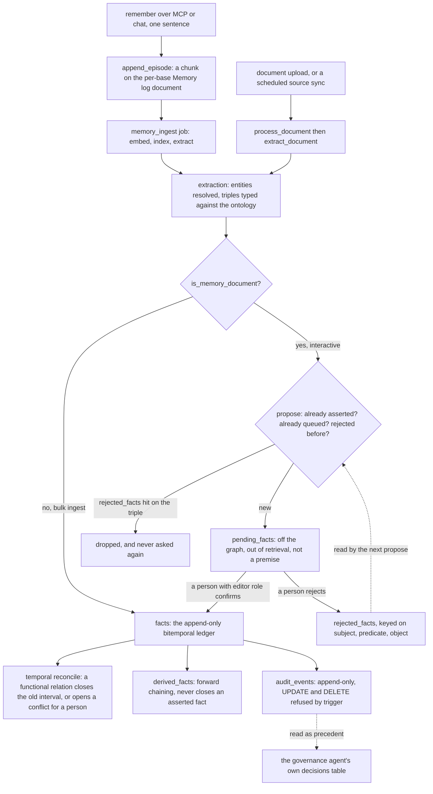

## 1. Executive Summary

Utopia is a knowledge substrate for agents and the people who supervise them: one Rust binary and one Postgres that ingest documents and recorded sentences, extract entities and facts against an editable ontology, keep every fact on two clocks, and serve the result to an agent over MCP. 86,064 lines of Rust across eight crates, 33,475 lines of TypeScript in the console, 49 forward-only migrations and 38 numbered decision records. Apache-2.0. Source comments and decision records are in Chinese; identifiers, API and UI strings are in English.

**It clears the memory bar on a narrow, deliberate path, and the rest is the substrate that path writes into.** `remember` is the one write tool exposed over MCP (`crates/utopia-server/src/api/mcp.rs:63`). It appends the sentence as a chunk on a per-base *Memory log* document (`crates/utopia-store/src/memory.rs:76`), a background job extracts triples from it, and because that document belongs to the implicit `memory` source, the extractor diverts every triple into `pending_facts` instead of the graph (`crates/utopia-server/src/extraction.rs:1027`). The agent is told, in the tool result itself, to say the sentence was recorded and the facts await confirmation. Eleven read tools — chunk search, entity facts, neighbours, timeline, paths, and a `changes` tool that windows the belief axis — are how it reads memory back.

**The three mechanisms worth the read.** First, `rejected_facts` (`migrations/0018_a_fact_awaiting_a_nod.sql:60`): rejecting a queued fact stores the *triple*, not the row, and every subsequent proposal looks it up first, so re-extracting the same sentence does not re-ask. Second, the two clocks are read as well as written — `record_axis.rs` and `world_axis.rs` are the only two places a temporal predicate is assembled, and both take an instant, so "who led this in March" and "what did we believe in March" are different queries with different answers. Third, the execution gate (`crates/utopia-store/src/execution_gate.rs:97`): an automatic merge is held for a person not when confidence is low but when undoing it could not recall what it had already sent outside the graph — a contradiction a consistency check would open, derived facts that would be rewritten, or an answer already given in a conversation.

**Where it is weakest is the boundary of that narrow path.** The nod, and therefore the rejected-triple key, applies only to memory documents. Bulk ingest writes facts optimistically and reviews afterwards, so a triple a person rejected in the queue can be re-asserted by any document that states it. `rejected_facts` has no `object_value` column, so attribute facts — a salary, a title — are never blocked, which the source argues for and which is still a hole a reader should know about. The lexical arm indexes only the current chunk version, so a record-time search finds the right things and misses the ones that have since been replaced; the module says so at the top. And nothing works without an OpenAI-compatible chat and embedding endpoint: with no model configured, retrieval degrades to BM25 and extraction does not run at all.

## 2. Mental Model

A memory here is a **fact**: subject, predicate, object — or a literal value, since attributes are relations whose range is a literal and share the same table. The predicate is a `relation_type` from the base's ontology, and it can be null, which is the system saying *the extractor found an edge the vocabulary has no word for*; the original wording survives on the evidence row as `proposed_predicate` and the display falls back to it through a SQL function so the same fact is never named two different things on two pages.

A fact does not carry a status column. **Status is which table it is in**, and the source argues that choice explicitly: fifty-odd queries select live facts by `invalidated_at IS NULL`, so a status column would fail in the direction of *an unconfirmed fact silently reaching the graph*, while a separate table fails in the direction of *the queue is not displayed*. Four tables, four epistemic positions:

- `pending_facts` — recorded, shown to a person beside the sentence it came from, **not on the graph, not in retrieval, not a premise for inference**.
- `facts` — asserted. Live while `invalidated_at IS NULL`.
- `derived_facts` — concluded by forward chaining from ontology axioms. Deliberately second class: no `supersedes`, never permitted to close an asserted fact, invalidated rather than deleted when a premise disappears, and excluded from the confirm/reject queue because confirming a deduction is meaningless and rejecting one only makes it return.
- `rejected_facts` — a refused triple, keyed on the triple.

Movement between them is a person's act. `confirm` runs the fact down the same path an extraction would — insert, attach evidence pointing back at the sentence, then temporal reconciliation — and deletes the queue row; `reject` writes the triple key and deletes the queue row (`crates/utopia-store/src/pending.rs:227`, `:343`). Confidence is not touched by either, and the comment says why: a person's verdict is not a float, it is in the ledger.

Correction is by supersession, never by overwrite. When a new fact arrives on a relation the ontology marks `functional` or `inverse_functional` and whose temporal kind is `state`, `reconcile_new_fact` finds the open-interval fact on the other side, invalidates it, and writes a replacement whose `valid_to` is the new fact's `valid_from`, linked by `supersedes` (`crates/utopia-store/src/temporal.rs:51`). If the timing is ambiguous or the new fact scores under 0.75, nothing is rewritten and a `fact_conflicts` row opens for a person with three named outcomes: close the old one, keep both, or reject the new one.

Death is graded. A fact is invalidated (record axis remembers it), a document is deleted as an *event* that invalidates only the facts whose every evidence chunk is gone and records the exact list so a restore revives those and nothing else, and a purge is final — content erased, document row kept as a tombstone, facts left invalidated, the deletion ledger row preserved.



## 3. Architecture

Eight crates in one workspace. `utopia-core` holds the models, config and credential sealing; `utopia-store` is the entire SQL surface (21,795 lines) with one module per concern — `graph`, `temporal`, `resolution`, `reasoning`, `ontology`, `governance`, `pending`, `audit`, `jobs`; `utopia-server` (33,681 lines) is the axum API, the extraction pipeline, the chat loop and the tools; `utopia-extract`, `utopia-reason`, `utopia-ingest`, `utopia-search` and `utopia-llm` are the prompt builder, the rule engine, the parsers and RDF importer, the Tantivy wrapper and the OpenAI-compatible client.

**Runtime: one process.** An axum server on `:1516` that runs migrations at startup, serves the built SPA when `UTOPIA_WEB_DIST` exists, and runs the job worker as tokio tasks in the same process. The queue is a Postgres table consumed with `FOR UPDATE SKIP LOCKED`, woken by `LISTEN`/`NOTIFY`, with `30s * attempts²` backoff and a `Terminal` marker a handler can attach to make a failure final (`crates/utopia-store/src/jobs.rs`). Job kinds are registered in one match (`crates/utopia-server/src/main.rs:383`): `process_document`, `memory_ingest`, `extract_document`, `explore_mappings`, `materialize_inferences`, `bootstrap_ontology`, `embed_ontology`, `build_vector_index`, `govern`.

**Persistence: one Postgres with pgvector, plus a data directory.** The graph, the ontology, documents and chunks, all four queues, the audit ledger and the job queue are tables. Embeddings are `vector` columns of unfixed dimension — the dimension follows whichever model the workspace chose, so HNSW indexes are built by a background job once a dimension is first written rather than declared in the schema. Outside Postgres: original files under `data/files/` addressed by SHA-256, and the Tantivy index under `data/index/`.

**Retrieval stack.** Tantivy with the jieba tokenizer for BM25, pgvector for dense recall, reciprocal-rank fusion in `utopia-search`. One Tantivy index for all bases with `kb_id` as a filter field.

**External dependencies.** Any OpenAI-compatible chat and embedding endpoint, named in the README as DeepSeek, Qwen, GLM, Ollama or vLLM; nothing else. Optional mounted analytical databases for the text-to-SQL path — Postgres, MySQL and the wire-compatible engines, Trino, Databricks, Snowflake — which are a query surface, not a memory store, and are not exposed over MCP.

### Deployment and ergonomics

`docker compose --profile app up -d` brings up Postgres and the published image; the first account registered becomes the system administrator and an open base readable by everyone is created with it. Local development runs Postgres in Docker and the server under `cargo run`. There is no API key requirement to *store* anything — a document can be uploaded and chunked without a model — but nothing is extracted into the graph and nothing is embedded until chat and embedding endpoints are configured under Administration → Models, so a keyless deployment is a full-text document store with an empty graph. The whole thing runs air-gapped against a local model server.

Two operational details are better than usual. Credentials — LLM keys, connection strings, source tokens — are sealed with AES-256-GCM under a key kept in the data directory and never in the database, with a backfill pass on every start that seals anything still plaintext (`crates/utopia-store/src/sealing.rs`). And the compose file can provision a restricted `utopia_app` role that has UPDATE, DELETE and TRUNCATE revoked on `audit_events` while migrations run under the owner on a separate connection, so an application-level bug or a leaked connection string cannot rewrite the ledger.

The store is Postgres, so it is inspectable and repairable by hand. Migrations roll forward only — there are no down migrations — and the README says to pin a version and back up both the database and the data directory before upgrading.

## 4. Essential Implementation Paths

**Capture — interactive.** `tools::remember` (`crates/utopia-server/src/api/tools.rs:587`) parses an optional `occurred_at` at year, month, day or RFC3339 precision, calls `memory::append_episode` (`crates/utopia-store/src/memory.rs:76`) which finds-or-creates the base's `memory` source and its `memory-log.md` document and inserts one chunk with the timestamp inlined as the first token of the text, then enqueues `memory_ingest` carrying `proposed_by` and `proposed_token`. It returns immediately; the tool text instructs the model to tell the user the sentence is recorded and the facts await confirmation, and not to claim anything entered the graph.

**Capture — bulk.** `pipeline::process_document` parses (PDF, DOCX, PPTX, XLSX, XLS, ODS, CSV, TSV, Markdown, HTML, text, with legacy encodings detected by `chardetng`), chunks, indexes into Tantivy, embeds in batches of 16 with at most 4 batches in flight, and marks the document ready; extraction is a separate job. Scheduled sources — web pages, RSS, GitHub, Jira, Notion, WebDAV, S3-compatible buckets — land in the same pipeline.

**Extraction and consolidation.** `crates/utopia-server/src/extraction.rs`, 4,120 lines, is the single largest file. Per chunk it builds a prompt from ontology candidates (the full vocabulary when it fits, otherwise a per-chunk vector retrieval over class and relation embeddings, with ancestors added so a generalising base class is always present), resolves each mentioned entity, and writes facts. `await_nod` at `:1027` is the one branch that decides between the two destinations. Every triple the extractor drops — subject type unknown, attribute domain mismatch, value not matching the datatype, confidence too low — is recorded in `extraction_drops` with a reason code, a detail and an example, keyed by document so a re-extraction resets the counts.

**Retrieval.** `crates/utopia-server/src/retrieval.rs:25` runs BM25 on a blocking thread and the vector arm concurrently, fuses by RRF and re-fetches through `documents::chunks_by_ids`. Graph reads go through `graph::entity_detail` (`:1000`) and `graph::graph_changes` (`:1603`).

**Context assembly.** There is no automatic injection of memories into a prompt. The chat loop (`crates/utopia-server/src/api/chat.rs`) carries at most 20 prior turns, exposes the tool schema, runs at most 6 tool rounds, and streams deltas and step frames over SSE with citation numbers stable within a conversation.

**Update, delete, forget.** `temporal::reconcile_new_fact` for supersession; `review_routes::close_fact`, `confirm_fact`, `reject_fact`, `resolve_conflict`, `revert_merge`, `manual_merge`, `decide_violation`, `decide_defect`, `decide_pending` for the human verdicts; `documents::delete` / `restore` / `purge` for the document lifecycle; `pending::confirm` / `reject` for the queue.

**Schema.** 49 migrations, each one named for the property it adds — `a_fact_awaiting_a_nod`, `deleting_is_an_event`, `purge_is_final`, `a_contradiction_points_upstream`, `an_unknown_date_is_not_an_open_one` — and each carrying a long comment arguing the choice, usually against the version that was tried first.

**MCP.** `crates/utopia-server/src/api/mcp.rs`, one route, `POST /api/v1/kbs/{kb_id}/mcp`, JSON-RPC 2.0 over Streamable HTTP, stateless so every call re-authenticates.

**Tests.** 612 test functions; 73 integration files under `crates/utopia-store/tests/` named for the property each one pins.

## 5. Memory Data Model

`facts` (`migrations/0003_graph.sql:219`) is the ledger: `subject_id`, a nullable `predicate_id`, either `object_id` or a JSONB `object_value`, `valid_from`/`valid_to` with **a precision column per endpoint**, `recorded_at`, `invalidated_at`, `confidence`, `derived_by_rule` and `supersedes`. The per-endpoint precision is a correction of a single `valid_precision NOT NULL DEFAULT 'day'` that made a fact with no date at all look measured to the day; the end precision additionally admits `unknown`, so *"former CEO of Weta Digital"* — an ending the source states without a date — is representable as distinct from *still holding*, and two CHECK constraints keep date and precision in step, one of them written to defeat three-valued logic's habit of passing a NULL comparison.

There is a **third time column**, and it is worth naming precisely because the atlas keeps finding claimed ones that are not. `attested_from` and `attested_to` hold the date of the *document* that attested the fact — the evidence's own date, set from `doc_time` at insert and only ever moved earlier when the same assertion is observed again (`crates/utopia-store/src/graph.rs:591-596`). A read path does query it: `world_axis::facts_holds_from` reads a fact's lower bound as `COALESCE(valid_from, attested_from)`, so a fact with no stated start holds from the first evidence rather than from the beginning of time, and a fact that ended on an unknown date holds until the document that said so. But there is no `as_said` parameter anywhere — the third column feeds the world axis as a bound and is not an axis a query can travel. Two clocks, one anchor.

`fact_evidence` is one row per (fact, chunk) with the quote, the document id and version, and the model's original wording. Placing `proposed_predicate` on the evidence rather than the fact is the right call for a reason the comment states: facts deduplicate on (kb, subject, predicate, object), so two chunks saying "runs on" and "optimized for" merge into one fact, and a column on the fact would be first-writer-wins.

`entities` carries `canonical_name`, an alias array, a nullable `type_id` (null is *not yet judged* or *a person judged that no class fits* — the sentinel `concept` row it replaced was silently hijacked by SKOS's `skos:Concept` on import), a profile embedding that is the incremental centroid of its evidence chunks, `merged_into`, and a `type_source` of `extracted` / `inferred` / `human` whose three-way split exists because conflating engine and human decisions once made every engine-typed entity immune to re-resolution.

**Scoping** runs base → workspace → organisation. `kb_members` gives owner/admin/editor/viewer; a base marked `open` is readable by any member of its workspace, a `restricted` base with no membership row returns `NotFound` rather than `Forbidden` so its existence is not leaked (`crates/utopia-store/src/access.rs:12`). Personal tokens carry an optional base list and a read-or-write scope, and the MCP handler intersects them with the holder's role on every call.

The queues are separate tables with their own state machines: `resolution_reviews` (`adjudicating` → `human`, `pending` → `merged`/`kept`), `fact_conflicts` (`open`/`resolved` with a resolution of `closed`/`kept_both`/`rejected_new`), `axiom_violations`, `ontology_defects`, `concept_mappings` (`proposed`/`confirmed`/`rejected`), `pending_facts`, and `agent_decisions`.

Separation of kinds is by role rather than by store: everything is a fact on the same ledger, and the distinction between an episodic sentence and a semantic fact is which document the evidence points at. That is the design's economy and also its blunt edge — a Memory log grows one chunk per `remember` on a single document forever, and nothing prunes it.

## 6. Retrieval Mechanics

**Chunks.** BM25 over Tantivy with jieba, 24 candidates; pgvector cosine over the chunks of the base, 24 candidates; RRF fusion. The vector arm degrades silently to BM25-only when no embedding model is configured or the embedding request fails, while a failure of the vector *query* is a real error so that a broken database is not disguised as an unconfigured model. Channel order in the fusion list is fixed rather than arrival order, on the argument that the RRF at this commit ignores order and a future per-channel weighting would not.

**Both arms take `as_of`** — a record-time instant — and the vector arm and the final fetch apply it through `record_axis::chunk_live_at` and `document_live_at`. The lexical arm cannot: Tantivy holds only the current version of a document's chunks, so a historical search returns correct hits and misses chunks that have since been replaced. The module head states this as a known incompleteness rather than leaving it to be discovered.

**Graph.** `entity_facts` takes both `at` (world) and `as_of` (record) and a predicate filter; `timeline` returns one entity's dated facts in world order; `neighbors` and `paths_between` walk the graph; `changes` windows the record axis and answers *what did we learn or revise between these dates*, classifying each event as asserted, corrected, rejected or merged with the document it came from. The tool descriptions in `chat.rs` go to unusual lengths to keep the two axes apart in the model's head, including an explicit instruction that `entity_facts(at)` asks what was true on a date while `changes` asks what we changed our mind about.

**Ranking and budgeting.** No reranker, no LLM judge, no learned ranking. RRF only, with fixed per-channel recall of 24 and a top-k the caller supplies. There is no token budget on retrieved context: the budget is the six-round tool loop and each tool's own limit.

**Failure modes.** Under-recall on record-time lexical search, as above. Over-recall is bounded by the tool loop rather than by scoring. The sharper risk is entity resolution: same-name entities are allowed to coexist by design (*split rather than merge*), so a query that names an entity may reach the wrong one of two — the temporal benchmark's own notes flag exactly this as a known noise source in its numbers, since the script takes the first entity matching a name.

## 7. Write Mechanics

Facts are created by extraction, by a person in the console, by the confirmation of a queued proposal, or by the rule engine. The extraction prompt lives in `crates/utopia-extract/src/lib.rs` and is built per chunk from the ontology candidates, the document date, the filename and the entities already recognised in this document — handles rather than repeated names, so a later bare mention resolves against a document-local list and an ambiguous one gets its own provisional entity instead of a guess.

**Deduplication** happens at three levels: `insert_fact` deduplicates live facts on (subject, predicate, object) and adds evidence to the existing row; entity resolution runs exact name or alias, then embedding similarity against the profile centroid, then a batched model verdict on the grey pairs, with anything still doubtful going to `resolution_reviews`; and `propose` refuses a proposal that is already asserted, already queued, or already rejected.

**Update is never in place for a fact.** Supersession only, as in section 2. Entities *are* mutable rows, so an undoable retype is recorded in `entity_retypes` with the previous type, and a merge is recorded in `entity_merges` with the facts moved and a profile snapshot so `revert_merge` restores exactly what it changed.

**Malicious and noisy input.** The confused-deputy problem is named in the source and the mitigation is structural rather than filtering: decision 0014 initially withheld `remember` from MCP because an agent reading a poisoned document could be told to record something and would do so with the user's full authority; 0015's queue is what made exposing it acceptable, because a proposal that nobody confirms never enters the graph. Rule-writing tools are deliberately read-only over MCP on the grounds that a tool call cannot distinguish *the person dictated this* from *the model invented it*. `query_data` is withheld from MCP entirely.

### Operational cost

**The interactive write does not block the agent.** `remember` inserts one chunk in a transaction and enqueues; the tool returns before any model call. Extraction of that sentence then runs in the worker: one chat completion plus, on a new base, an embedding call — so the lag from *recorded* to *queued for confirmation* is one model round trip, seconds to tens of seconds, and the lag from *recorded* to *retrievable as a fact* is unbounded, because it is however long the person takes to click confirm. The sentence itself becomes searchable as soon as the ingest job embeds and indexes it, which is the same round trip.

**Bulk writes are heavy and the repository says so.** One chat completion per chunk, batched embeddings 16 at a time. Loading a 965-class ontology embeds about 2,600 rows and takes six to eight minutes, which is why it is a job rather than a request.

**A background pass rewrites derived state, not the store.** `materialize_inferences` recomputes forward-chained facts per base on a schedule; it is off by default because a wrong axiom derives wrong facts. Type resolution and mapping exploration are similar: they re-read the ontology and the entity set rather than the whole corpus. Nothing re-reads every document on a schedule, so the recurring token bill scales with the day's activity, not with the corpus — with the honourable exception of a manual full re-extraction.

**On the read path**, nothing is injected per turn. The model spends tokens on tool calls it chooses, up to six rounds; the system prompt is stable across a conversation, so the prompt prefix is not invalidated by memory.

## 8. Agent Integration

One MCP route per base, JSON-RPC 2.0 over Streamable HTTP, protocol version `2025-06-18`, `application/json` responses rather than SSE because the tools are request-response. Statelessness is the security property: every POST re-authenticates, so revoking a token takes effect on the next call rather than at the next handshake.

Authorisation is two narrowings, and the code comments insist on the distinction: the token says *who this is and which bases this key can reach*, the membership says *what this person may do in this base*, and `can_write` is the conjunction — a write-scoped token in a viewer's hands is still read-only (`crates/utopia-server/src/api/mcp.rs:107`). `tools/list` varies with that computation, so a token that cannot write never sees `remember` advertised. A call to a tool that exists but is not exposed returns two distinguishable messages: *needs a write-scoped token held by an editor* versus *not exposed over MCP in this version*.

The tool schema is generated from the same function the in-app chat uses, deliberately, so the MCP contract cannot drift from the executor; the source notes the cost, which is that `search_chunks`'s description still mentions citation numbers an MCP client has no way to render.

Every MCP tool call writes an audit row naming the tool and the token. A proposal arriving over MCP carries `proposed_token` (`migrations/0026_an_agent_records_over_mcp.sql`) so the review card can distinguish a memory recorded by a code assistant from one recorded by a meeting-notes agent, the argument being that *which agent said it* is the only thing a person can adjudicate on.

Adapting this for another agent is a matter of pointing an MCP client at a base URL with a personal token. There is no SDK, no framework plugin and no session lifecycle to manage: there are no sessions, and compaction boundaries are not a concept here because nothing is injected automatically.

## 9. Reliability, Safety, and Trust

**Provenance is a first-class join, not a metadata field.** Every fact has evidence rows pointing at chunks, each with the quote, the document and the version, and a fact whose every evidence chunk was superseded is counted in the *unconfirmed* review queue by a predicate shared between the counter and the list so the badge and the page cannot disagree.

**The ledger is defended at three levels.** Application code only inserts; two triggers refuse UPDATE, DELETE and TRUNCATE; and the optional restricted role has those privileges revoked, so the DROP-TRIGGER path requires ownership, which requires DDL, which the database's own log records. The comment is candid that this raises the bar from *trivial* to *requires DDL* rather than making tampering impossible, and names the hash chain as the missing piece. **That chain does not exist at this commit** — `prev_hash` and `hash_chain` appear nowhere in the tree.

**The ledger is also an input.** The governance agent reads past human verdicts out of `audit_events` as precedent before adjudicating a duplicate pair, cites the events it relied on in `agent_decisions.precedents`, and a fresh human verdict on a related pair marks its outstanding proposal `superseded` and returns that pair to the queue. The ledger is therefore load-bearing twice over: forensic for a person, and an input to the next automatic decision.

**Withheld marks, and why — none.** All seven are awarded, so the discipline moves to naming the limit of each rather than the absence:

- **`tombstone` covers one path.** The triple key is consulted by `pending::propose` and nowhere else, and only memory documents reach `propose`. A rejected triple restated by an uploaded PDF is asserted. The table has no `object_value` column so attribute facts are never keyed — the comment argues this, correctly, on the grounds that keying on (subject, predicate) would turn *this salary is wrong* into *never mention salary again*, but the consequence is that the only corrections the key protects are entity-to-entity ones.
- **`trust_state` is a table, not a column.** If a reader's definition requires a field, this is a near miss; what it is not is a confidence score doing double duty, and the separation is enforced in the direction that fails safe.
- **`bitemporal`, with one arm missing.** The record axis is complete on the vector arm, the chunk fetch, the graph and the entity-merge view; it is incomplete on the lexical arm, which has no historical index.
- **`scope_enforced` is base-level, not agent-level.** The predicate is `kb_id`. Two agents sharing one base share one memory; the only per-agent record is `proposed_token` on a queued proposal, which nothing filters on.
- **`audit_log` records mutations, not reads,** apart from `mcp.tool_called`, and `record` is called as `let _ =` at every site, so a ledger write failing never fails the operation it was recording.
- **`human_review` is a surface, and this one has a lot of queues** — pending facts, duplicates, conflicts, unconfirmed, low confidence, mappings, violations, defects, merges, agent decisions. Whether anyone drains ten queues is not something code can establish.
- **`negative_eval`'s unit-level case is about chunks, not facts.** The fact-level negative assertions live in the benchmark question set, which needs a running server and a model.

**Uncertainty is representable and the schema fights for it.** Three distinguishable end states (*continuing*, *ended on an unknown date*, *ended then*); a null predicate meaning *no word for this edge*; a null entity type meaning *not judged* or *judged to have no class*; `unknown` verdicts in entity resolution; `unsure` rows in agent decisions, kept so a person can see the agent looked and could not tell. The textbook indeterminate-instant trick — filling `valid_to` with the document's date as an upper bound — is explicitly rejected, on the grounds that it puts a confident-looking timestamp in a column every reader would have to check the precision of first.

**Data loss and recovery.** Deleting a document is revertible from a recorded list; merges revert from a snapshot; type changes revert from the previous type; adoption batches revert. Purge is the one irreversible operation and is only reachable on an already-deleted document. There is no backup or restore command — the README's answer is to back up Postgres and the data directory, and the roadmap lists backup and restore as unbuilt.

**Concurrency.** The queue's `SKIP LOCKED` consumption is standard. Extraction guards against a superseding run with an epoch check before each chunk's model call, so a re-triggered extraction takes over rather than racing. `pending::confirm` deliberately runs without a transaction and argues idempotence instead: `insert_fact` deduplicates and the queue row is deleted last, so a crash mid-confirm leaves a confirmable row.

**What is not defended.** Nothing constrains what an agent may record — `remember` accepts any sentence from any writer with the scope, and the queue is the entire defence. A person clicking through the queue without reading is the failure mode the design cannot see.

## 10. Tests, Evals, and Benchmarks

**612 test functions, one `#[ignore]`.** The integration suite is 72 files under `crates/utopia-store/tests/`, each named for the property it pins, each building its own organisation and tearing it down, each hitting real Postgres.

**The skip-is-not-a-pass problem is solved here, and that is worth reading.** `crates/utopia-store/src/test_db.rs` returns `None` when `UTOPIA_DATABASE_URL` is unset so a local `cargo test` does not need a database — the exact shape that makes a CI run green having asserted nothing. The module head says so, and the fix is `UTOPIA_TEST_REQUIRE_DB`: set it, and a missing database panics. CI sets it on the job that has Postgres (`.github/workflows/ci.yml`), runs the whole `utopia-store` suite there rather than the one test that used to run, pipes the output under `set -o pipefail`, and writes the passed/failed counts into the job summary with the sentence *a missing database fails this job instead of skipping*. The migrations job additionally runs every migration twice on a fresh database and fails on duplicate version numbers, because two pull requests each adding `0025` merge cleanly and then will not boot.

**The bitemporal question set is the substantive eval and it is committed.** `scripts/bench/temporal/` holds a corpus and 37 questions over a fictional company, loaded in three waves so that record-time questions refer to instants the system actually passed through — *"what the product really walked: a real ingest, a real extraction, a real deletion, not a scene produced by UPDATE"*. Each question names an axis (`world` with `at`, or `record` with `as_of`), an expected value or `null`, and a `not` list; scoring requires the expectation present and every `not` value absent (`scripts/bench/temporal.mjs:317-318`). Scenarios include a three-way handover, a salary correction, a hire attested by a later document, a document deletion, a human edit to a fact's start date, and a human merge of two spellings — each asked on both axes. Two questions are flagged `known_gap` and excluded from the headline, with the reasoning that a main score permanently carrying a known defect stops being looked at.

The numbers reported in `scripts/bench/README.md` for a 2026-09-05 run are 35/35 with uniqueness axioms declared, 28/35 when the ontology grows on its own, and 34/35 when axioms are declared afterwards and reconciled — the gap falling precisely on the questions needing automatic closure, because `functional` and `inverse_functional` are never inferred. **These are the project's own reported runs; no result file is committed and the harness needs a running server and a model, so nothing here was re-run.**

**They found and documented their own vacuous test.** The chat-path scorer originally parsed only `data:` lines and got an empty string for every answer; an empty string contains none of the `not` names, so all eight `expect: null` questions were recorded as passing. The comment at `scripts/bench/temporal.mjs:498-501` records it. A residual weakness remains on the ledger path: an `expect: null` question passes whenever the subject's fact list comes back empty for any reason, and only a *missing subject* is separated out as `absent`.

**Three more measurement stands, all with committed ground truth.** A recall stand (`recall.mjs`) against four real SEC filings, scored against 52 items a person read out of the documents by hand — deliberately not against the system's own drop signals, because those see *extracted then blocked* and not *never extracted*, and the latter is the larger share; the README reports a run improving from 33/52 to 49/52 across six changes, including one change that regressed to 29/52 and exposed a separate bug. A governance stand (`govern.mjs`) against 411 hand-labelled name pairs. A mapping and question-answering stand for the text-to-SQL path, whose ground truth is a business definition plus a gold SQL, scored by running the proposal and comparing numbers rather than comparing names.

**The methodology notes are better than the numbers.** The directory's first rule — *a new base for every run* — exists because three consecutive tuning rounds shared a base that carried the previous rounds' retypes, and two code changes were made on incomparable figures. The answer keys are versioned with a rule that a wrong key is fixed only after the results are in and with a written reason, *otherwise this key becomes a record of what the system answered that time and measures nothing*. One answer key is generated from Wikidata P31 through a committed mapping table so that human judgement enters at exactly one place.

**No paper.** No `CITATION.cff`, no arXiv or DOI reference anywhere in the tree. The one external result the README cites belongs to a **different repository**: Ontology2SQL on the BIRD Mini-Dev leaderboard, at 70.20% exact match on SQLite and 65.80% on PostgreSQL, added by a DeepLethe-affiliated submission merged into the leaderboard site on 1 September 2026. The PR is a listing rather than a verified re-run — nothing in it documents a checking step — and no BIRD harness, dataset or result is committed to this tree.

**What is missing before trusting it.** No test asserts that a rejected triple stays out when the same claim arrives through a *document*, which is the boundary most likely to surprise an adopter. Nothing measures the lexical arm's record-time under-recall, which is acknowledged in prose and unquantified. And the temporal benchmark's own note that it takes the first entity matching a name means its figures carry an unmeasured entity-resolution term.

## 11. For Your Own Build

### Steal

**Key the refusal on the value, and consult it on the write path.** `rejected_facts` is four columns and one lookup, and it converts *the user said no* from a UI event into a durable constraint on future extraction. The generalisable form: whatever your extractor produces, hash or key its identity independently of the row it produced, and check that key before proposing.

**Gate autonomy on reversibility, not on confidence.** The execution gate asks what a merge would *irreversibly emit* — a contradiction a checker will raise, derived facts that get rewritten, an answer already handed to a user — and holds for a person when any of those is non-empty, however sure the model is. This is the sharpest idea in the repository and it transfers to any agent that takes consequential automatic actions.

**Assemble temporal predicates in exactly one module per axis.** Fifty read sites hand-writing `invalidated_at IS NULL` is fifty chances to forget one, and forgetting one is silent — no SQL error, no compiler complaint. Two files, one function per table, every read path calling in.

**Choose the failure direction, then pick the schema.** The recurring argument for a separate table over a status column is that a missed `UNION` means *the queue is invisible* while a missed `WHERE` means *an unconfirmed fact is on the graph*, and only one of those is discovered by looking. Decide which mistake you can afford before deciding where the field goes.

**Store what was embedded, not when.** Class rows keep `embedded_text` and `embedded_model` beside the vector, so the backfill job can tell a stale embedding from a current one by comparing, rather than requiring every writer that edits a description to remember to invalidate.

**Make a skipped test fail where it matters.** A `let Some(url) = ... else { return }` guard is right locally and catastrophic in CI. One environment variable turns the skip into a panic on the job that has the database.

### Avoid

**Do not let a default value invent precision.** A `NOT NULL DEFAULT 'day'` on a precision column makes *never measured* and *measured to the day* indistinguishable, and every renderer downstream will state the false one confidently. The same trap catches a CHECK constraint written without an `IS NOT NULL` guard, where three-valued logic passes the row you meant to reject.

**Do not encode "no value" as a named sentinel row.** A placeholder class called `concept` was quietly taken over by an imported `skos:Concept` whose derived key collided, silently reclassifying every unclassified entity. A NULL has no name to collide with, and forgetting to handle it raises rather than passes.

**Do not let a mechanism's guard live on one write path.** A direction check applied at extraction and not at adoption or merge took the violation rate from zero to 12.3%; the fix was one shared judgement function plus a ledger-level backstop that finds violations whichever path produced them.

**Do not conflate who triggered an action with whose judgement it was.** Passing the operator's user id down into an engine-decided retype marked every engine decision as human and permanently exempted those rows from re-resolution.

### Fit

This is a product, not a library, and adopting it means adopting an ontology practice. The design's whole leverage comes from relations declaring `functional`, `inverse_functional`, `temporal` kind, domain and range — and the temporal benchmark measures exactly what happens when they are not declared: the automatic closure that makes *Mira handed over to Devin* work stops firing, and the score drops 7 points out of 35. A team that will not curate a vocabulary gets a document store with a graph-shaped index.

The operational floor is one Postgres, one binary and a model endpoint, which is genuinely low for what is on offer, and it runs air-gapped. The ceiling is unproven: v0.1, no rollback in migrations, no backup command, and the roadmap's own "benchmarks at 100k documents" says the scale question is open.

**Who should walk away.** Anyone wanting a drop-in memory layer for a single coding agent: there is no SDK, no automatic injection, no per-agent scope, and the confirmation queue that makes the write path safe assumes a person who will attend to it. Anyone who needs the correction guarantee to hold across bulk ingest, since the triple key does not reach that path. And anyone who will not be reading Chinese, because every design argument in this repository — which is where its value density actually sits — is in the comments and the decision records, and both are Chinese only.

**Who should read it anyway.** Anyone building a bitemporal store. The read-side predicates, the per-endpoint precision, the three end states and the refusal to fabricate an upper bound are a better specification of the problem than most published treatments, and they are 950 lines of `temporal.rs` plus two small axis modules rather than a framework.

## 12. Open Questions

- **How often is the queue actually drained?** The whole safety argument for exposing `remember` over MCP rests on a person confirming, and nothing in the tree bounds how long a proposal waits or what happens when the queue reaches thousands. Running the product would answer it; code cannot.
- **Does the rejected-triple key survive entity resolution?** The key is on entity ids. If a rejected triple's subject is later merged into another entity, the key still names the merged-away id, and `propose` looks up the resolved id. Whether the key follows a merge is not tested and was not established by reading.
- **What is the Memory log's growth behaviour?** One chunk per `remember` on a single per-base document, with no pruning path and a `chunk_count` that only increments. At what volume does the document panel, the re-extraction path or the seq subquery become a problem?
- **Do the reported benchmark figures reproduce?** They need a server, a database and a model endpoint. The harness and the ground truth are committed, which is most of what reproducibility requires, but no run output is.
- **Is `governance` ever turned on in practice?** It defaults off with the stated reason that the agent's hit rate has not been measured on any real base, and the one comparison in the README is on a synthetic corpus.

## Appendix: File Index

- Schema: `migrations/0001_core.sql` … `0049_a_relation_declares_its_qualifiers.sql`; the memory-relevant ones are `0003_graph.sql` (facts, evidence, conflicts), `0005_resolution.sql` (entity resolution and merges), `0007_audit.sql` (ledger and immutability triggers), `0010_least_privilege_role.sql`, `0013_reasoning.sql` (rules and derived facts), `0018_a_fact_awaiting_a_nod.sql` (pending and rejected facts), `0019_a_signature_holds_on_every_path.sql`, `0022_deleting_is_an_event.sql`, `0023_purge_is_final.sql`, `0026_an_agent_records_over_mcp.sql`, `0035_governance_reads_the_ledger.sql`.
- Store: `crates/utopia-store/src/graph.rs`, `temporal.rs`, `world_axis.rs`, `record_axis.rs`, `pending.rs`, `memory.rs`, `resolution.rs`, `reasoning.rs`, `audit.rs`, `access.rs`, `review.rs`, `review_summary.rs`, `execution_gate.rs`, `jobs.rs`, `documents.rs`, `sealing.rs`, `test_db.rs`.
- Server: `crates/utopia-server/src/extraction.rs`, `pipeline.rs`, `retrieval.rs`, `governance.rs`, `adjudication.rs`, `type_resolution.rs`, `main.rs`.
- Agent surface: `crates/utopia-server/src/api/mcp.rs`, `tools.rs`, `tools_graph.rs`, `chat.rs`, `review_routes.rs`, `mod.rs`.
- Search and extraction: `crates/utopia-search/src/lib.rs`, `crates/utopia-extract/src/lib.rs`, `crates/utopia-reason/src/derive.rs`, `rules.rs`.
- Console: `web/src/pages/Review.tsx`.
- Tests: `crates/utopia-store/tests/a_fact_awaits_a_nod.rs`, `a_search_reads_the_base_as_it_was.rs`, `derived_facts_are_second_class.rs`, `the_second_clock_can_be_rewound.rs`, `a_merge_rewinds_with_the_second_clock.rs`, `a_deletion_is_an_event.rs`, `a_purge_is_final.rs`, `an_automatic_merge_is_gated_by_what_it_can_undo.rs`, `a_relation_points_only_inside_its_own_kb.rs`, `an_agent_can_record.rs`; `crates/utopia-server/src/api/mcp_tests.rs`.
- Benchmarks: `scripts/bench/README.md`, `scripts/bench/temporal.mjs`, `scripts/bench/temporal/{corpus,questions}.json`, `recall.mjs`, `govern.mjs`, `mappings.mjs`, `ask.mjs`, `truth/`.
- Decisions: `docs/decisions/0014-identity-from-the-person-scope-from-the-token.md`, `0015-recording-a-sentence-is-not-asserting-a-fact.md`, `0019-the-second-clock-can-be-rewound.md`, `0020-an-auditor-reads-it-without-us.md`, `0022-an-unknown-date-is-not-an-open-one.md`, `0025-governance-reads-the-ledger-before-it-decides.md`, `0027-an-automatic-merge-is-gated-by-what-it-can-undo.md`.

**Searches recorded for the negative claims**

```sh
grep -rn 'rejected_facts' --include='*.rs' --include='*.sql' --include='*.ts' --include='*.tsx' .   # writer pending.rs:351, sole reader pending.rs:95, no other consumer
grep -n 'pending::propose' crates/utopia-server/src/extraction.rs                                   # four sites, all behind await_nod at :1027
grep -rni 'prev_hash\|hash_chain' --include='*.rs' --include='*.sql' --include='*.md' .             # 2 hits, both prose in migrations/0007_audit.sql: no chain exists
grep -rn 'DELETE FROM audit_events\|UPDATE audit_events' --include='*.rs' --include='*.sql' .       # 0
grep -rn 'CREATE POLICY\|ROW LEVEL SECURITY' migrations/ crates/                                    # 0: the boundary is a kb_id predicate, not RLS
grep -rniE 'arxiv|bibtex|@article|@misc|citation|doi\.org' --include='*.md' --include='*.cff' --include='*.toml' .  # one hit, the README's "inline citations" UI copy
find . -iname 'CITATION*' -not -path './.git/*'                                                     # 0
find . \( -iname 'CLAUDE.md' -o -iname 'AGENTS.md' -o -iname '.cursorrules' \) -not -path './.git/*' # 0: no agent-directed instruction file
grep -rn 'BIRD' --include='*.rs' --include='*.mjs' --include='*.sql' --include='*.ts' .             # 1 comment in temporal.mjs; no harness, dataset or result committed
find . -path ./.git -prune -o -iname '*bird*' -print -o -iname '*mini*dev*' -print                  # 0
grep -rn 'confidence <\|confidence >\|MIN_CONFIDENCE' --include='*.rs' crates                       # auto-close gate and review queues only; no retrieval filter
grep -rn 'attested_from\|attested_to' --include='*.rs' crates                                       # written in graph.rs, read only by world_axis as a bound: no as-said query parameter
grep -rn '#\[ignore' --include='*.rs' crates | wc -l                                                # 1
ls migrations/ | grep -c down                                                                       # 0: forward-only migrations
```

## History

**2026-09-12** — [`cb3235665c51b8a7c2b81604b825bb946239da1d`](https://github.com/deeplethe/utopia/commit/cb3235665c51b8a7c2b81604b825bb946239da1d) — first reading. Screened before reading with `scripts/screen_repo.py`: no auto-running configuration and no build-time execution surface (no `build.rs`, no devcontainer, no `.envrc`, and a `.gitattributes` carrying only line-ending and binary rules, no `filter=`); twelve manifests read as inside the seven-day cooldown because a depth-1 clone dates every file to the pinned commit; one unpinned surface, `web/package.json` with 26 floating ranges, made reproducible by `web/pnpm-lock.yaml` beside it; no `CLAUDE.md`, `AGENTS.md` or `.cursorrules`. Nothing was installed, built or run — no `cargo`, no `pnpm`, no database. Every figure here comes from reading the tree; the benchmark numbers are the project's own reported runs, attributed as such, and the linked BIRD Mini-Dev submission was opened and read.
