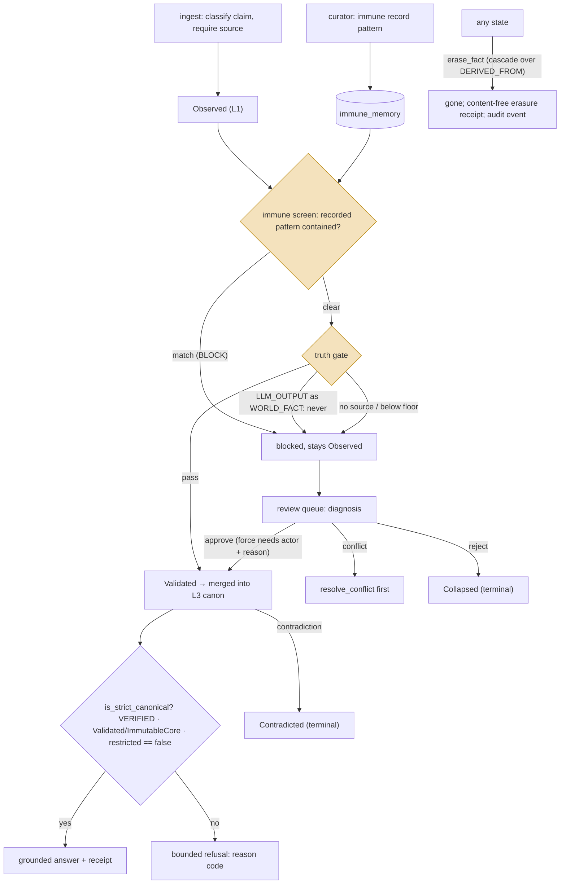
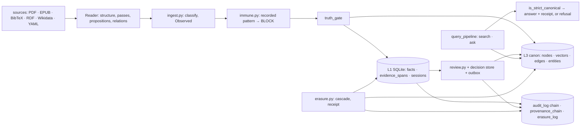

## 1. Executive Summary

Velantrim Crystal is a local-first **evidence and memory kernel** — Python,
AGPL-3.0, 750 commits since April 2026, version 0.3.0, 25,856 lines under
`core/` with 2,041 tests — whose organising rule is written on the front page:
*"Discovery may propose what deserves inspection. Authority is a separate
decision path."* Retrieval finds; a gate decides what enters the trusted
state; a curator decides what the gate would not; a query answers only from
what passed, or refuses with a reason code. The project's own documentation
is unusual in the same direction: an agent-facing router that tells a reader
not to infer implementation from the narrative README, a capability matrix
that lists what is *not* implemented — a dedicated semantic reader, an ANN
index, an NLI filter, a PostgreSQL runtime — and a signed architecture
checkpoint.

Five mechanisms earn five marks. **A fact has a state and a status.** It
enters as `Observed`; the truth gate (`core/truth_gate.py`) requires a source,
refuses a `WORLD_FACT` whose `source_status` is `LLM_OUTPUT` as a fixed
invariant no environment variable can lift, and applies a confidence floor to
world facts and interpretations while letting subjective claims through as
experience; admission moves it to `Validated`. `Contradicted`, `Deprecated`
and `Collapsed` are terminal, and `is_strict_canonical`
(`core/canonical_view.py:160-245`) lets a fact ground an answer only when its
`truth_status` is exactly `VERIFIED`, its state is `Validated` or
`ImmutableCore`, and its `restricted` bit is exactly false — a pure predicate
that fails closed on any missing field. **A curator decides.** The review
queue lists `Observed` facts with a diagnosis, `approve` refuses a `conflict`
until `resolve_conflict` has been called and overrides a blocked gate only
with a named actor and a reason, `reject` collapses, and each decision is
staged under a compare-and-swap on the fact's revision and projected to the
canon through an outbox (`core/review.py`, `core/review_decision_store.py`).
**A rejected value is remembered.** The immune memory (`core/immune.py`) is a
table of claim patterns keyed on their normalized text, each with a type, a
severity and the actor who recorded it; `ingest`, the importer and the review
diagnosis screen every claim against it before the guardian and the truth
gate, and a claim that contains a recorded pattern whole-token is refused with
`Immune:` in the reason and stays `Observed` in L1. A curator records a pattern
from the CLI, and in strict mode with learning on, the ingest path records a
contradicted claim itself. The only way past a recorded pattern is a force
approval with a named actor and a reason, audited as `review_force_approve`.
**Every compliance event is chained.** `audit_log` rows seal
`seq|ts|event|fact_id|detail|prev_hash` in `entry_hash`, a checkpoint row pins
the head so a deleted suffix shows, and an HMAC signs entries when a key is
configured (`core/audit.py`, `core/memory.py:298-360`). **Exclusion is tested
on populated reads**: the queue returns an ordinary pending claim beside a
restricted one reduced to a stub, and a graph walk returns its results while
skipping a stale terminal hit and the neighbour it would have reached.

The boundary of the `tombstone` mark is worth drawing here, because Crystal
has two records that look alike. Erasure (`core/erasure.py`) is physical — L1,
graph, evidence, sessions — cascades over `DERIVED_FROM` edges, refuses Ring
Zero, is idempotent, and writes a content-free `erasure_log` row with a
`content_hash`; nothing on any write path consults that hash, so an erased
claim arriving again from a source is a new fact. That row is a deletion
receipt: it proves that something was removed and cannot say what may not
return. The immune memory is the other record, keyed on the value and read
before admission, and it is the one the mark asks for. The mark does not
require that erasure produce the record; it requires a durable, value-keyed
rejection that a later write consults. The two are not joined: erasing a
claim does not record its pattern, and recording a pattern does not erase the
facts that match it.

Two marks are withheld on definitions. There is no validity interval, and
there is no scope key: a `restricted` bit and a session-wide restriction
implement a processing restriction, not a partition.

## 2. Mental Model

A memory is a **fact with a state**, and the states are the design:

The highlighted nodes are the whole argument: the immune screen refuses what
has been judged wrong before, and the gate does not weigh relevance and cannot
be configured to trust the model. Everything downstream — the
queue, the canon, the refusal — exists so that the answer path never has to
ask whether something merely looked relevant.

Truth status is a second axis: `VERIFIED`, `USER_CLAIMED`, `HYPOTHESIS`,
`SUBJECTIVE`, `UNVERIFIED`, `CURATOR_OVERRIDE`, assigned by modality and
source. A fact can be `Validated` and still not `VERIFIED` (a user's own
claim), and `is_strict_canonical` requires both, independently, rather than
inferring one from the other.

## 3. Architecture

Python 3.11+, standard-library-first by the project's own description, 750
commits between 2026-04-08 and 2026-08-30, 2,041 test functions in 159 files.
`core/` holds 25,856 lines; the parts this report reads:

- `memory.py` — the L1 schema: `facts`, `evidence_spans`, `import_sessions`,
  `review_sessions`, `erasure_log`, `audit_log`, `provenance_chain`,
  `chain_checkpoints`, the L3 outbox; `ESM_STATES` and the transition matrix.
- `truth_gate.py`, `canonical_view.py`, `pipeline.py` (`retrieve`, the
  guardian, `generate_answer`, the outbox drain), `query_pipeline.py` (the
  read-only `search` and `query`).
- `review.py`, `review_decision_store.py`, `review_projection.py`,
  `conflict_decision.py`, `contradiction.py`, `contradiction_report.py`.
- `audit.py`, `provenance_chain.py`, `erasure.py`, `compliance.py`.
- `immune.py` — the rejected-pattern memory, consulted before the gate by
  `ingest.py`, `imports.py` and the review diagnosis.
- `evidence.py` (spans, verification, grounding validity), `provenance.py`.
- `l3_graph.py` — the canon: nodes, vectors, edges, entities, mentions, in
  SQLite by default; `postgresql_migration*.py` written and inactive.
- `reader_*.py` — the Reader: source identity, structure, passes, proposition
  extraction, relations, long context, cross-document links, lexical
  candidate discovery.
- `api.py` (FastAPI), `cli.py`, `curator_runtime.py`, `adapters/`.

### Deployment and ergonomics

- **What has to run:** Python and SQLite; the FastAPI service is optional; a
  Docker image ships. The PostgreSQL path exists as a migration and is marked
  inactive and not authorized.
- **Fully local and offline:** yes; embeddings are optional and the vector
  leg tolerates their absence.
- **Hand-repairable:** the store is SQLite with a documented schema, the
  audit chain is verifiable with a command, and a receipt can be re-verified.
- **Install:** `pip install -e .`; the CI runs a Ring Zero mutation gate and
  a 100 % line-coverage gate by the README's account.

## 4. Essential Implementation Paths

**Ingest.** `core/ingest.py:158-320`: classify the utterance
(`classify_claim`), derive a stable `fact_id` from its normalization, dedupe an
exact repeat of an already-`Validated` fact, store as `Observed` with the
confidence, screen the utterance against the immune memory and return
`accepted: False` with an `Immune:` reason on a match (262-267), build a facts
pack, call `truth_gate`, and on pass transition to `Validated`, set the
`truth_status` by modality and source, and merge into L3 (311-329); on refusal
the fact stays `Observed` with the reason. In strict mode a contradiction of
the canon also blocks, and with learning on the blocked utterance is recorded
as a threat by the ingest path itself (292-302).

**Immune memory.** `core/immune.py:85-122`: `record_threat` normalizes the
pattern (case, punctuation, whitespace), derives `pattern_id` from the
normalized text, upserts the `immune_memory` row with `threat_type`,
`severity` and `actor`, and appends a content-free `immune_threat_recorded`
audit event; re-recording the same pattern refreshes type and severity and
keeps the hit count. `match_threat` (154-173) pads the normalized claim and
every recorded pattern with spaces and tests containment, so `car` never
matches `scary`, and returns the highest-severity match at or above
`VELANTRIM_IMMUNE_BLOCK_SEVERITY`. `screen` (178-235) returns `BLOCK` with
the matched entry and registers the hit; without a match it checks the canon
for contradictions and returns `QUARANTINE`, or `BLOCK` in strict mode. The
CLI exposes `immune record`, `immune forget`, `immune screen` and
`immune report` (`core/cli.py:377-388`).

**The gate.** `core/truth_gate.py:22-110`: no facts is a refusal; a fact
without `source` is a refusal; a `WORLD_FACT` with `source_status ==
"LLM_OUTPUT"` is a refusal the docstring calls a Ring Zero invariant that *"no
environment variable, runtime mode or caller option can disable"*; subjective
claim types pass without an evidentiary bar; world facts and interpretations
need `confidence >= DEFAULT_MIN_CONFIDENCE`, a fixed policy rather than an
adaptive one. `tests/test_truth_gate.py:142-159` sets the environment and
checks nothing changes.

**Read.** `core/pipeline.py:444-700` retrieves by cosine over the demo seed or
admitted memory plus a lexical pass; `_l1_terminal_state_blocks` and
`_l1_restricted_blocks` (346-374) let a terminal or restricted L1 record win
over a stale L3 copy; `_may_propagate_activation` and `_may_seed_vector_hit`
refuse to walk through such a node. `query_pipeline.search_result` keeps only
facts whose `restricted` is exactly `False` (276-280) and answers with a
reason code — `ok` or `no_local_retrieval_results` — rather than an empty
list that looks like a result.

**Review.** `core/review.py:84-660`: `pending` with a diagnosis per item
(`ready`, `blocked`, `conflict`), where `_diagnose` (122-156) runs the immune
screen first and then the guardian and the gate; `approve` with the rules in
section 1, so a recorded pattern is overridden only by `force` with an actor
and a reason (238-282);
`reject` to `Collapsed` through `transition_esm` with a compare-and-swap,
`resolve_conflict`, and sessions (`create_session`, `resume_session`,
`record_session_decision`, `complete_session`).
`review_decision_store.stage_review_decision` (165-345) writes the decision,
its audit event and the projection intent in one SQLite transaction; a graph
backend failure leaves a durable `projection_status` rather than a lost
decision, and `drain_projections` retries.

**Audit.** `core/audit.py:73-160`: `append_event` under `BEGIN IMMEDIATE`, tail
and checkpoint read inside the lock, the entry hash sealed over the previous
hash, an optional HMAC; `verify_audit_log` walks the chain and the checkpoint.

**Erase.** `core/erasure.py:66-215`: refuse `IMMUTABLE_FACT_IDS`; delete
evidence and import-session entries first so an orphan with nothing else left
is still erased; a fact never stored and never erased is a no-op with no
tombstone, because fabricating an erasure record for data that never existed
would be its own Article 30 defect; otherwise remove L1, L3 node and edges,
mentions, outbox entries, the normalized ingest index; cascade over
`DERIVED_FROM` with cycle protection when asked; write the tombstone and the
audit event; repeat calls return `erased_now=False`.

**Restrict.** `core/compliance.py:48-60`: `restrict_processing` sets the bit;
`session-restrict` and `session-erase` (`core/cli.py:212-214`) apply it or
erasure to a whole import session.

## 5. Memory Data Model

The `facts` table (`core/memory.py:154-168`):

| Column | Role |
| --- | --- |
| `fact_id` | stable id from the normalized claim |
| `claim`, `source` | the text and where it came from; both required to ground |
| `confidence` | 0–1, gated for world facts and interpretations |
| `epistemic_state` | `Observed`, `Hypothesized`, `Supported`, `Validated`, `Contradicted`, `Deprecated`, `Collapsed`, `ImmutableCore` |
| `claim_type` | `WORLD_FACT`, interpretation, or a subjective type |
| `source_status` | `UNKNOWN`, `LLM_OUTPUT`, or an independent source |
| `significance` | a second 0–1 |
| `restricted` | the processing-restriction bit, deny-dominant when unknown |

The `immune_memory` table (`core/memory.py:188`): `pattern_id` (a hash of the
normalized pattern, the primary key), `pattern`, `threat_type`, `severity`,
`recorded_at`, `actor`, `hits`.

Beside it: `evidence_spans` binding a `fact_id` to a byte range and a hash of
a source, verified by `verify_evidence`; `erasure_log` keyed on `fact_id` with
`erased_at`, `reason`, `actor`, `content_hash`; `audit_log`; `provenance_chain`,
a per-fact hash chain of state transitions; `chain_checkpoints`; `review_sessions`;
`import_sessions`.

**Temporal:** `created_at` and `updated_at`; no validity interval.
`bitemporal` withheld.

**Trust:** the state and the status, both read. `trust_state` earned.

**Scoping:** none by principal. `scope_enforced` withheld.

**Tombstone:** the `immune_memory` row, keyed on the normalized value and
read by `ingest`, `imports` and the review diagnosis before the gate. The
erasure record is not it: `rg -n 'get_tombstone|get_tombstones|content_hash'
core/ingest.py core/pipeline.py core/imports.py` finds nothing, and the readers
of `erasure_log` are evidence, provenance, the projection and the compliance
report. `tombstone` earned on the immune memory, with its limits in section 9.

## 6. Retrieval Mechanics

Two surfaces. `pipeline.retrieve` is the working recall: a cosine leg over
embeddings when present, a lexical leg, a graph walk that propagates
activation through neighbours but never through a terminal or restricted node
(`_may_propagate_activation`), and a reconciliation that lets L1 win over a
stale L3 copy. `query_pipeline.search` and `query` are the read-only public
surface: they resolve hits to canonical facts, drop anything not `restricted
== False`, and never write — a `LegacyRetrievalUnavailable` returns a reason
code and `reindex_required` rather than a guess.

Grounding is stricter than retrieval. An answer may cite a fact only when
`is_strict_canonical` holds and `has_valid_evidence_for_grounding` finds a
replayable span; the documentation's own line is `same fact_id != same claim`,
and a `VERIFIED` fact whose evidence has gone stale loses current standing
without losing its history.

**Failure modes:** the lexical candidate pass is deterministic and bounded by
design, and the semantic reader is explicitly not implemented, so recall on
paraphrase depends on the optional embeddings; a store with many terminal
facts pays the L1 lookup per hit.

## 7. Write Mechanics

**Gated, not extracted.** A claim is classified by regex and stored as typed
by the caller; nothing summarises or consolidates. The immune screen and the
gate are the write mechanic. Two things it does that this atlas rarely sees: it lets a feeling
in as a feeling without letting it become a world fact, and it refuses to let
its own output be promoted by any switch.

**Conflicts.** `core/contradiction.py` classifies a pair of claims by polarity,
numbers and content overlap; a `conflict` diagnosis blocks `approve` until
`resolve_conflict` records a decision with metadata on the losing candidate
(`conflict_decision.py`).

**Concurrency.** Every decision is a compare-and-swap on the fact's
`revision`; a CAS miss aborts without touching L3
(`test_approve_aborts_on_cas_miss_without_l3_merge`).

**Malicious input:** a claim is text; the gate checks provenance and
confidence, not content. Ring Zero facts cannot be erased or overwritten.

### Operational cost

- A write is one SQLite transaction plus a graph merge; the outbox absorbs a
  graph failure.
- A fact is retrievable immediately by the lexical leg; the vector leg after
  `reindex_embeddings`.
- No background pass rewrites the store.
- The answer path returns a receipt with the grounding facts and a
  verification route (`/receipt`, `/verify-receipt`).

## 8. Agent Integration

The agent surfaces are the API and a deliberately read-only MCP server.
`core/mcp_server.py` (279 lines, stdio JSON-RPC) exposes `search`,
`memory_report`, `get_fact`, `fact_history`, `find_conflicts` and
`verify_receipt`, each documented as never writing, so an agent over MCP can
read canon, inspect a fact's lifecycle, classify a claim against the store and
verify a receipt, and cannot ingest or approve (`tests/test_mcp_server.py`, 20
cases). Over HTTP an agent calls `/ingest` and `/ask`, receives a receipt it
can re-verify, and reads `/evidence/{fact_id}`; a curator works `/review/queue`,
`/review/approve`, `/review/reject`, the `immune` commands and the UI.
`core/curator_runtime.py` is not a machine curator: it is the one bundled
write bridge from an authenticated principal to `core.review`, deriving the
audit actor from the principal and checking its role, capabilities and
candidate and target scopes before any mutation, with an explicit synthetic
local-admin principal for the unauthenticated local mode; it decides nothing
about a fact. The agent-facing documentation (`docs/ai/README.md`) is a router
with a source-of-truth order that ranks live GitHub, tests and CI above the
prose, and a lifecycle overlay it tells a reader not to trust past its date.

## 9. Reliability, Safety, and Trust

**What holds.** The gate's one invariant is not configurable; canonical
grounding fails closed on a missing or malformed field; a restricted bit is
deny-dominant and wins over a stale graph; decisions are atomic with their
audit event; the audit chain has a checkpoint; erasure is idempotent, cascades
over derived facts and refuses Ring Zero; a recorded pattern blocks on sight
across ingest, import and review, and recording or forgetting one is audited
(`tests/test_immune.py`); a force approval demands an actor and a reason and
is audited (`tests/test_force_override_audit.py`).

**Where the tombstone stops.** The immune memory is empty until someone
writes to it, and erasure does not: an erased claim is remembered as a hash in
`erasure_log` and as nothing in `immune_memory`, so a claim erased for being
wrong returns as a new fact unless a curator also recorded its pattern. A
force approval overrides a block, with an actor and a reason on the audit
row. Containment is whole-token, so a paraphrase of a recorded pattern is not
caught. And a blocked claim is kept, as an `Observed` row in L1, rather than
refused at the store.

**What is withheld, and why.** `bitemporal`: no validity interval.
`scope_enforced`: restriction is per fact and per session, not per principal.

**What is convention.** The audit `detail` is content-free by contract, not
by schema; a caller that puts a claim in it has written personal data into an
append-only table. The Reader's authorization flags in the manifest are
documentation, enforced by the project's own review process.

## 10. Tests, Evals, and Benchmarks

2,041 test functions in 159 files. The suites that carry the marks:
`test_canonical_view.py` (39), `test_review.py` (40),
`test_review_decision_hardening.py`, `test_review_decision_outbox.py`,
`test_review_resumable.py`, `test_audit.py` (21), `test_erasure.py` (22),
`test_truth_gate.py` (17), `test_immune.py` (18), `test_evidence.py` (30),
`test_bounded_legacy_retrieval.py` (17), `test_pipeline.py`,
`test_query_pipeline.py`, `test_contradiction.py` (15). `TEST_REPORT.md`
records nine CI jobs including a Ring Zero mutation gate and 2,244 collected
tests at an earlier checkpoint.

Evaluation artifacts are committed under `eval/` with preregistrations and
results for the Reader's retrieval comparators and an NLI neutral filter, and
`IMPLEMENTATION_STATUS.md` says which of those milestones authorize nothing.
No agent-memory benchmark applies; the claims are about admission, not recall
quality.

## 11. For Your Own Build

### Steal

- **Make the model-output rule an invariant, not a setting.** One `if` that
  no configuration reaches is worth more than a policy file.
- **Ground on a pure predicate that fails closed.** `is_strict_canonical`
  never infers verification from confidence or state and rejects any missing
  field; it is testable in isolation and it was tested thirty-nine ways.
- **Stage the decision with its audit event and its projection intent in one
  transaction,** and let the graph fail separately with a durable status.
- **Checkpoint the audit chain head.** A hash chain alone cannot see a
  truncated tail.
- **Cascade erasure over derivation edges.** Derived personal data should not
  outlive its source.
- **Screen against the rejected patterns before the gate, on every write
  path.** Crystal calls the same `screen` from ingest, import and review, so
  a rejected value has no side door.

### Avoid

- **An erasure that does not tell the rejection memory.** Crystal keeps both
  records and joins neither to the other; if a claim is erased because it was
  wrong, record its pattern too, or say that it may return.
- **Treating a restriction bit as a scope.** It withholds one fact from
  everyone; it partitions nothing.

### Fit

Crystal fits a team whose memory must answer *where did this come from and
may we say it* before *what is relevant* — compliance-shaped assistants,
research memory with sources, anything where a wrong confident answer costs
more than a refusal. It is not a conversational memory and does not claim to
be: there is no conversational extractor and no scope key; the Reader has
source and session foundations and a proposition extractor, and a dedicated
autonomous or semantic reader is declared not implemented.

## 12. Open Questions

- **Will erasure feed the immune memory?** An erasure with a reason of
  *wrong* carries the normalized claim that `record_threat` would need, and
  the two tables have no edge between them.
- **Does a force approval of an immune-blocked claim reach the pattern's
  hit count or its actor?** The override is audited on the fact; whether the
  pattern learns that it was overridden is not visible in the tests.
- **When the PostgreSQL runtime is authorized,** does row-level restriction
  follow the `restricted` bit or stay in application code?

## Appendix: File Index

- `core/memory.py` — `facts` (154-168), `erasure_log` (281-290), `audit_log`
  (298-310), `provenance_chain` (319-352), `chain_checkpoints` (353-362),
  `ESM_STATES` and transitions (26-60), `get_tombstone` (1173)
- `core/truth_gate.py` — `truth_gate` (22-110)
- `core/canonical_view.py` — `is_strict_canonical` (160-245),
  `project_canonical` (245)
- `core/pipeline.py` — `_l1_terminal_state_blocks` (346), `_l1_restricted_blocks`
  (361), `retrieve` (444), `guardian` (849), `_truth_status_for` (871),
  `drain_l3_outbox` (1143)
- `core/query_pipeline.py` — `search_result` (255-300), `query`
- `core/ingest.py` — `classify_claim` (65), `ingest` (158)
- `core/review.py` — `pending` (84), `approve` (196), `resolve_conflict` (389),
  `reject` (461), sessions (535-660)
- `core/review_decision_store.py` — `stage_review_decision` (165),
  `mark_projection_result` (369)
- `core/audit.py` — `append_event` (73), `audit_log` (140), `verify_audit_log` (152)
- `core/erasure.py` — `record_derivation` (57), `erase_fact` (66), `is_erased`
  (204), `erasure_log` (209)
- `core/immune.py` — `record_threat` (85), `forget_threat` (124),
  `match_threat` (154), `screen` (178), `immunity_report` (236);
  `core/memory.py` — `immune_memory` (188); `core/cli.py` — the `immune`
  commands (377-388)
- `core/compliance.py` — `restrict_processing` (48); `core/cli.py` —
  `session-restrict`, `session-erase` (212-214)
- `core/evidence.py` — `attach_evidence` (65), `verify_evidence` (163),
  `valid_evidence_for_grounding` (254)
- `core/contradiction.py` — `classify` (125); `core/conflict_decision.py`
- `core/l3_graph.py` — the canon schema (363-395)
- `core/api.py` — routes; `core/mcp_server.py` — the six read-only tools (19-90);
  `core/refusal_reasons.py` — the reason codes (195-206)
- `core/curator_runtime.py` — the authenticated write bridge to `core.review`
- `docs/IMPLEMENTATION_STATUS.md`, `docs/ai/README.md`, `TEST_REPORT.md`
- `tests/` — 159 files; `tests/test_immune.py` — 18 cases

**Searches recorded for the negative claims**

- `rg -n 'get_tombstone|get_tombstones|content_hash' core/ingest.py core/pipeline.py core/imports.py`
  — no hit; the erasure hash is not consulted on write.
- `rg -n 'immune\.' core/ingest.py core/imports.py core/review.py core/cli.py`
  — the screen at `ingest.py:262`, `imports.py:78` and `review.py:127`; the
  writers at `cli.py:380` and `ingest.py:296`.
- `rg -n 'record_threat|immune' core/erasure.py` — no hit; erasure does not
  write to the immune memory.
- `rg -n 'valid_from|valid_until|valid_at' core/*.py` — no hit.
- `rg -n 'def _tool_' core/mcp_server.py` — six tools, none of which calls
  `ingest`, `approve`, `reject` or `erase_fact`.
- `rg -n 'tenant|principal|user_id' core/memory.py` — no scope column on `facts`.

## History

**2026-09-08** — [`df4a651a2b4dd06df486e65cdbdcfe1090743135`](https://github.com/velantrian/velantrim-exocortex-crystal/commit/df4a651a2b4dd06df486e65cdbdcfe1090743135) — re-read after the author's comments on [issue #473](https://github.com/velantrian/velantrim-exocortex-crystal/issues/473), which named `core/immune.py` as a persistent value-keyed rejection mechanism and asked where the atlas draws the tombstone boundary. One commit since the first pin, documentation only; every finding verified at both. `tombstone` awarded on the immune memory: a durable table keyed on the normalized claim, written by a curator or by the strict ingest path, and consulted before the gate by ingest, import and the review diagnosis, with its limits stated in section 9. The erasure receipt is unchanged and is not the tombstone. The `curator_runtime` open question is answered by its docstring and removed; the Fit paragraph names the Reader foundations that exist.

**2026-09-07** — [`7509be14c274cdc83e8e00287f46a78f8ee33696`](https://github.com/velantrian/velantrim-exocortex-crystal/commit/7509be14c274cdc83e8e00287f46a78f8ee33696) — first reading. Screened before reading: no auto-run surface, one build-time execution point, two unpinned surfaces, nothing installed or run.
