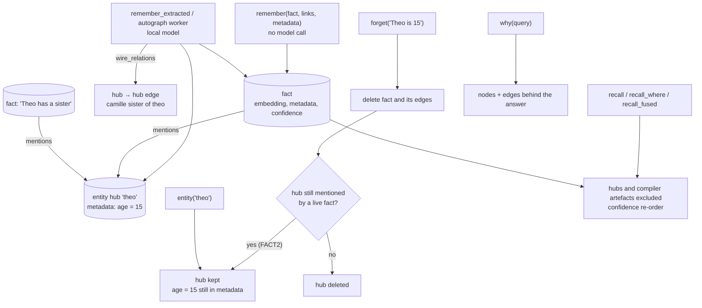

## 1. Executive Summary

VelesDB is a Rust database that fuses vectors, a graph and a column store behind
one query language. It is published under the VelesDB Core License 1.0, a
source-available licence adapted from the Elastic License 2.0, with 4,620 commits
since 17 December 2025 across more than 400,000 lines of Rust. This report reads
its agent memory: the `velesdb-memory` crate, version 0.14.2, about 35,800 lines
of non-test Rust with 1,296 tests. It ships as an MCP server with 27 tools in
the default build, plus Node, Python and WASM bindings.

The design argument is that a vector store returns text that looks like the
question, while the answer to "why did we do this?" is usually a fact that shares
no words with it. So:

- **Facts connect.** `remember` stores one atomic fact with typed links and
  metadata, calling no model. `why` walks the links and returns the nodes and
  edges behind an answer, and `recall_fused` blends vector and graph reach.
- **Entities are extracted optionally.** A local model can read facts into
  entity hubs with attributes (`Theo is 15`) and relations
  (`Camille sister of Theo`), and `entity` returns everything known about a
  name from both directions.
- **Context is compiled.** A deterministic compiler shrinks an agent's prompt
  under a hard token budget with no model call; the README reports 82.5% smaller
  context on a committed coding session.

The engineering is careful and documents its own limits. The loopback HTTP
daemon refuses a non-loopback bind without an explicit override. A `forget`
racing the asynchronous graph wiring wins. Scaffolding never leaks into recall,
through any predicate.

The gap is in retraction through the entity layer. `forget` deletes the fact and
its edges, and deletes an entity hub only when no surviving fact still mentions
it. The attributes and hub-to-hub relations an extraction wrote carry no record
of the fact that stated them. `wire_attributes` merges them into the hub's
metadata (`service.rs:490-514`), and `wire_relations` adds hub-to-hub edges
(`service_graph_wiring.rs:599-620`). Forget "Theo is 15" while "Theo has a
sister" is stored, and `entity("theo")` still reports age 15. The `forget` tool
tells the agent to use deletion "to retract or correct stored knowledge".

One mark: `negative_eval`.

## 2. Mental Model

A **store** is one directory held by one process. Several clients share it
through the HTTP daemon.

A **fact** is a short sentence with an embedding. It may carry:

- **links** to other facts, with a relation name;
- **metadata** in the column store, which `recall_where` filters with typed
  comparisons — the caller decides the fields, such as `project`, `status` or a
  numeric `ts` date;
- a **confidence** that `feedback` moves up or down and that recall blends into
  ranking;
- a **TTL**.

An **entity hub** is a reserved record for a name, created by extraction. Facts
point at it with `mentions`. Its attributes live in its own metadata, and
relations between entities are edges between hubs.

**Working contexts** and **compiled sources** are the context compiler's
artefacts, kept out of recall.

## 3. Architecture

| Crate or area | Role |
| --- | --- |
| `crates/velesdb-core` | The database: HNSW index, graph, column store, VelesQL, persistence, and an `agent` module with episodic, semantic and procedural memory types |
| `crates/velesdb-memory` | The agent memory service and MCP server: `service.rs`, `service_graph.rs`, `service_graph_wiring.rs`, `reinforce.rs`, `fused_recall.rs`, `extract.rs`, `context/`, `mcp/`, `http.rs`, `daemon_*`, `migration/` |
| `crates/velesdb-server`, `velesdb-cli`, `velesdb-node`, `velesdb-python`, `velesdb-wasm`, `velesdb-mobile`, `tauri-plugin-velesdb` | The general database surfaces |
| `integrations/agent-hooks`, `skills` | Hooks for Claude Code, Codex and Windsurf, and agent skills |
| `benchmarks`, `conformance`, `crates/velesdb-memory/examples` | Harnesses, including `bench_multihop`, `locomo`, `timeqa` and `context_savings` |

### Deployment and ergonomics

- **Install:** `cargo install velesdb-memory` or the Node package, then
  `claude mcp add velesdb-memory`; installers wire the HTTP daemon and hooks per
  client.
- **Embeddings:** a deterministic offline embedder by default, which the README
  says matches surface form rather than meaning; a real model is one environment
  variable (Ollama, OpenAI-compatible HTTP).
- **Extraction:** off unless built with `extractor-http` and pointed at a local
  model.
- **Hand-repairable:** no. The store is binary; `list_memories`, export and the
  migration tools are the inspection surfaces.

The screen of this checkout found three auto-run surfaces (`.githooks/`,
`server.json`, `smithery.yaml`), eight build-time execution points, seventeen
unpinned surfaces and fifty dependency files inside the seven-day cooldown, and
read `AGENTS.md` and `CLAUDE.md` as data. Nothing was installed, built or run.

## 4. Essential Implementation Paths

- **Remember** — `mcp.rs:301-327` → `MemoryService::remember_with_ttl`: size
  cap, embed, store with links, metadata and TTL.
- **Recall** — `service.rs:622-728`: vector search, exclusion of hubs and
  compiler artefacts, re-order by learned confidence (`:656`); `recall_where`
  (`:729`) applies typed column predicates with the same exclusions.
- **Feedback** — `reinforce.rs:73-110`: success and failure counts, a
  fixed-rate confidence update stored under reserved keys.
- **Extraction wiring** — `service_graph_wiring.rs:302-420` (asynchronous,
  with the forget race handled at `:330-360`), `wire_relations` (`:599-620`),
  `service.rs:490-514` `wire_attributes`.
- **Forget** — `service_graph.rs:144-156`: read the fact's hubs, delete the
  fact, collect hubs no live fact mentions (`:180-230`).
- **Entity profile** — `service_graph_wiring.rs:497-540`: the hub's metadata as
  attributes, and relations in both directions.

## 5. Memory Data Model

**Facts** are points in the core store with content, embedding and metadata.
Reserved `_veles_` keys hold TTL, confidence counters, hub markers and compiler
provenance, and are stripped from caller-facing metadata.

**Confidence** is a float updated by feedback and blended into recall order.
It is a weight, not a discrete status, so `trust_state` is withheld.

**Time** is whatever the caller stores in metadata. `recall_where` compares it
and `dated_context` renders a timeline from it. Nothing models when a fact held
apart from when it was stored, so `bitemporal` is withheld.

**Deletion is final.** `forget` removes the row with no record kept, and nothing
consults deleted values on a later write, so `tombstone` and `audit_log` are
withheld. The migration journal captures dirty keys only while an online
embedding migration runs.

**Scope.** A store is a directory, and metadata predicates are optional, so
`scope_enforced` is withheld.

**Entity attributes have no provenance.** `wire_attributes` groups extracted
`entity.key = value` pairs and calls `update_metadata` on the hub. The key is
overwritten by a later value, but nothing records which fact supplied it.
Hub-to-hub relation edges likewise carry only the predicate. The `mentions`
edges from facts to hubs are the only provenance, and they decide only whether
the hub itself survives.

## 6. Retrieval Mechanics

**Vector recall** returns the raw similarity as `score` while ordering by a blend
with learned confidence, and says so in the tool description.

**Column-filtered recall** uses typed comparisons with no coercion, so a date
stored as a string never matches a numeric filter. The tool description warns
about exactly that.

**Fused recall and `why`.** `recall_fused` walks the graph from vector hits for a
number of hops, with a boost and a candidate pool, and fuses the rankings.
`why` returns the evidence graph behind a query with truncation flags.

**Entity lookup** answers questions about a thing rather than a sentence,
reading both outgoing and incoming relations, because "who is Theo's sister" is
answerable only from Camille's side.

**What `entity` returns after a forget.** The profile is the hub's metadata plus
its edges. When the fact that stated an attribute or relation is forgotten and
the hub survives because another fact mentions it, the profile still carries
that attribute and relation. `tests/forget_orphan_hubs_bdd.rs:46` asserts the
hub survives. No test checks what the surviving hub still says.

## 7. Write Mechanics

**No model on the write path.** `remember` embeds and stores. The README makes
this a promise, and extraction is a separate, opt-in call or worker.

**Asynchronous autograph.** With the worker active, a remember returns
immediately and edges land later. A `forget` issued in between must win, and the
wiring re-checks the fact before writing and handles the remaining window
explicitly.

**Size limits are refusals.** A fact over the embedder's context is rejected with
its size, and metadata is capped at 64 KiB.

**Context compiler.** `compile_context` and `compile_transcript` chunk,
classify, deduplicate and budget content without a model, store sources for
retrieval, and record compilation events. The README reports savings of 10.9% to
21.9% on a real billed session.

## 8. Agent Integration

- **MCP tools:** `remember`, `recall`, `recall_where`, `recall_fused`,
  `relate`, `unrelate`, `forget`, `entity`, `why`, `feedback`,
  `remember_extracted`, `extraction_status`, `memory_status`, `list_memories`,
  migration tools, the compiler tools and working contexts.
- **Hooks** for Claude Code (including tool-result replacement), Codex (session
  resume, recall before opted-in patches, save at stop) and Windsurf.
- **Transport:** stdio, or a loopback HTTPS daemon with locally generated
  certificates for several clients sharing one store.

## 9. Reliability, Safety, and Trust

**Exposure is refused by default.** The HTTP transport has no authentication,
binds loopback, and refuses a non-loopback bind unless explicitly allowed.

**Claims are gated.** A promise contract pins README figures to committed
harnesses and fails CI when they drift.

**Retraction is incomplete at the entity layer,** as above. An agent that
forgets a mistaken fact to correct it keeps seeing the mistake through `entity`.

**Ingestion is allowlisted.** Path ingestion is off unless
`VELESDB_MEMORY_INGEST_ROOTS` names the roots.

## 10. Tests, Evals, and Benchmarks

The memory crate has 1,296 tests, many written as behaviour specifications, across
recall and filters, scaffolding exclusion, forget and orphan collection, the
asynchronous extraction race, entity profiles, the context compiler, the HTTP
transport and binding parity. None was run for this report.

**Negative retrieval.** `tests/extract_bdd.rs:105` asserts that recall for a word
that is also an entity hub returns facts and never the hub, and the scaffolding
suites assert compiler artefacts never return through any predicate. That earns
`negative_eval`.

**Benchmarks.** `examples/bench_multihop` reports on controlled data that a real
embedder recovers a third of multi-hop answers and the graph all of them.
`examples/locomo` runs vector against vector-plus-graph on LoCoMo with a local
model as extractor, answerer and judge. `examples/context_savings` measures the
compiler on a committed corpus. The README ties each figure to its harness; the
LoCoMo run's outputs are regenerated by the harness rather than committed.

## 11. For Your Own Build

### Steal

- **Keep the model off the write path,** and make extraction a separate,
  opt-in step.
- **Return the evidence trail,** not only the hits.
- **Refuse oversize input with its size** rather than truncating it.
- **Pin published figures to harnesses in CI.**
- **Make a forget win the race** against asynchronous derivation.

### Avoid

- **Derived attributes without provenance.** Record which fact set each
  attribute and relation, and retract them with it.
- **A default embedder that looks like semantic recall and is not,** unless
  every entry point says so.

### Fit

velesdb-memory suits an agent builder who wants a local, explainable memory with a
graph that answers "why", a context compiler that saves tokens, and no model
calls unless extraction is switched on. Where corrections must propagate to
everything derived from a fact, the entity layer needs provenance first.

## 12. Open Questions

- **Should `forget` remove the attributes and relations a fact's extraction
  wrote,** by storing the source fact beside each?
- **Will stores gain a scope key** for several users or projects behind one
  daemon?
- **Will the LoCoMo outputs be committed** beside the harness?

## Appendix: File Index

- `crates/velesdb-memory/src/service.rs`, `service_graph.rs`, `service_graph_wiring.rs`, `reinforce.rs`, `fused_recall.rs`, `extract.rs`, `dated_context.rs`, `mcp.rs`, `mcp/dto.rs`, `daemon_serve.rs`, `http.rs`
- `crates/velesdb-memory/tests/extract_bdd.rs`, `memory_service_bdd.rs`, `forget_orphan_hubs_bdd.rs`, `recall_where_scaffolding_bdd.rs`
- `crates/velesdb-memory/README.md`, `crates/velesdb-memory/examples/`

**Searches behind the absence claims**

- `grep -n "fn wire_attributes" -A25 crates/velesdb-memory/src/service.rs` — `update_metadata` on the hub, no source id
- `grep -n "attribute\|relations" crates/velesdb-memory/tests/forget_orphan_hubs_bdd.rs` — no match
- `grep -rn "tenant\|namespace" crates/velesdb-memory/src/service.rs` — no match

## History

**2026-09-15** — [`614722aa72f1740b2d5079eb4d3567ed1e709f6a`](https://github.com/cyberlife-coder/VelesDB/commit/614722aa72f1740b2d5079eb4d3567ed1e709f6a) — first reading, at a commit dated 14 September 2026, scoped to the `velesdb-memory` crate and the core it calls. Screened before opening: three auto-run surfaces, eight build-time execution points, seventeen unpinned surfaces, fifty dependency files inside the cooldown, and two agent-instruction files read as data. Nothing was installed, built or run.
