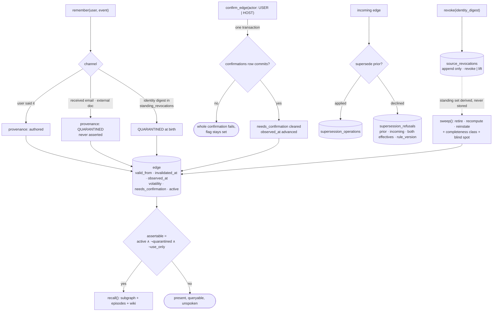

## 1. Executive Summary

Veracium is the library released alongside *Ground Truth First: A Longitudinal
Evaluation Instrument for Agent Memory, and the Tenure Crossover in
Memory-Architecture Rankings*
([arXiv:2607.21962](https://arxiv.org/abs/2607.21962), Quentin Spencer, 24 July
2026). MIT, 17,707 lines under `src/` against **39,168 lines of tests across 104
files**, 1,067 commits since 11 July 2026.

**All seven capability marks**, which eight systems here carry. The reasons
are what make it worth a report rather than a row: three of the seven are the
strongest instance of their mark the atlas has read.

- **The audit record is a precondition, not a consequence.** `confirm_edge` is
  the only path that clears `needs_confirmation`, and it writes the
  `confirmations` row inside the same transaction under a stated rule: *"if the
  record cannot commit, the whole confirmation fails and the flag stays set."*
  Most audit logs in this corpus are written after the fact and best-effort.
- **Third-party claims are quarantined by construction.** A claim from received
  email or an external document is born `QUARANTINED` — *"unverified third-party
  claim; never asserted"* — because of the channel it arrived on, not because a
  classifier judged it. The read path gates on `assertable`, and quarantine is
  one of its three conditions.
- **Refusals are durable.** `supersession_refusals` records the corrections the
  system *declined* to make: the prior edge, the incoming edge, both effective
  authorities, and the `rule_version` that refused. Every system here records
  what it superseded; this is the only one that records what it would not.

The cost is stated plainly in section 9: the specification apparatus around all
of this is larger than the mechanism, and adopting it means adopting a
governance model.

## 2. Mental Model

A memory is an edge with a position on four independent axes, and the read path
asks about all four before it will state anything as fact.

*Where did it come from* is `provenance`, and one of its values is
`QUARANTINED`. *When was it true* is `valid_from` to `invalidated_at`. *When did
we last see it* is `observed_at`. *Is it still worth asserting* is
`needs_confirmation` and `active`. The derived gate is one line —
`active and not quarantined and not use_only` — and everything the agent is
allowed to state passes it.

The interesting consequence is that a third-party claim is never *wrong* here,
it is *unasserted*. It stays in the graph, is queryable, can be confirmed by a
person, and until then cannot be spoken.



## 3. Architecture

One SQLite file, a Python library, and an amount of specification machinery that
is itself the story. The schema is not a string of `CREATE TABLE` calls but a
**declared registry**: fifteen versions, each object a `SchemaObject` with a
kind, a name, DDL held *byte-identical to what SQLite stores in
`sqlite_master.sql`*, and a policy of `REQUIRED` or `REBUILDABLE`. A validator
refuses to let a table be marked rebuildable — *"repairing a table would destroy
data or silently change behaviour"* — and refuses duplicate typed keys and
non-contiguous versions.

The reason for the byte-identity is recorded as a measurement rather than a
principle: a `sources` table declared one way and migrated another produced two
different stored schemas for what was nominally one version.

## 4. Essential Implementation Paths

**Quarantine is a property of the channel.** `ingest` stamps disclosure from who
authored the event and where it arrived, so an external document's claims are
`QUARANTINED` before anything reads them. Contrast the common arrangement in
this corpus, where everything is ingested equal and a later pass tries to work
out what was trustworthy.

**Revocation is keyed on content and consulted at birth.** `source_revocations`
is append-only per user with `action IN ('revoke','lift')` over an
`identity_digest`; the standing set is *derived, never stored*, so a lift is a
new row rather than a mutation. `ingest.py` then does the thing that turns this
from a delete into a tombstone:

```python
revoked_at_birth = (_birth_digest is not None
                    and _birth_digest in store.standing_revocations(user_id))
```

and the record is admitted with `Disclosure.QUARANTINED`. Re-ingesting revoked
material does not silently restore it and does not fail loudly either — it
arrives unasserted. `tests/test_0023_non_revival.py` pins six paths by which it
must not come back: it cannot reinforce, renew, supersede, be absorbed as a
duplicate, or enter consolidation.

**The sweep states its own blind spot.** `revocation_sweep.py` is 822 lines of
pure, I/O-free, clock-free reference implementation computing the standing set,
each survivor's completeness class and basis, the effect list
(`retire`/`recompute`/`reinstate`) and *"the COMPLETENESS STATEMENT — the blast
radius AND the blind spot."* Its pinned vectors live beside it with a
self-executing harness, on a stated rationale: *"a disagreement between two
implementations is a failing vector rather than an argument."* The recompute is
restrict-only, because a non-monotone recompute would be *"a promotion wearing a
recompute's clothes."*

**Confirmation is atomic or it did not happen.** The `confirm_edge` contract, in
the store base class, is the strongest audit statement in this corpus and worth
quoting whole: one transaction verifies ownership and assertability, clears the
flag, advances `observed_at`/`confidence`, writes the confirmation episode and
persists the mandatory record; if the record cannot commit the confirmation
fails; it is idempotent on `(user_id, correlation_id)` against a request digest
built from *the caller's* inputs so two date-less retries are one request; a
different request under the same id is an integrity conflict; and *"a backend
that cannot do this atomically MUST raise, not degrade."*

## 5. Memory Data Model

An `Edge` carries `subject`/`relation`/`object`, a `note`, a `Volatility` class,
a `Provenance`, `valid_from`, `invalidated_at`, an `invalidation_reason` from a
closed vocabulary — `superseded`, `lapsed`, `decayed`, `disputed`, `corrected`,
`absorbed_duplicate` — a `supersedes` pointer, an `original_relation` for
structural re-disposition, and `needs_confirmation`.

Two things about that list are unusual.

**Why a memory stopped counting is a field.** Six named reasons, so *lapsed*
(its lifetime ran out) is distinguishable from *disputed* (someone objected)
and from *absorbed_duplicate* (it merged into another). Most stores here record
that a memory is inactive and leave the reason to be inferred from adjacent
rows.

**Serialization is a contract.** `original_relation` is omitted from
`model_dump` when `None` so an unaffected edge's JSON stays byte-identical to
its pre-feature shape — an optional field that serialized its own `None` *"breaks
every byte contract."* That level of care about the wire format is what makes
the portability layer and the schema manifests checkable.

## 6. Retrieval Mechanics

`recall` assembles an entity-matched subgraph for the query, adds dated episodes
and, when enabled, the LLM-curated wiki. Retrieval is graph traversal rather
than vector search; the atlas's storage census records the arm as `graph`.

The gate is where the trust model earns its keep: `assertable` decides what may
be stated, quarantined material *"never surfaces unprompted"*, and `use_only`
material is available for reasoning without being assertable. A claim from a
stranger's email is therefore in the store, findable, and unable to become
something the agent says.

## 7. Write Mechanics

Ingest types the event, stamps provenance, and applies supersession under an
effective-authority rule. When the rule declines, the decision is written to
`supersession_refusals` with both edges, both effective authorities and the
`rule_version` — so a later rule change can be reasoned about against the
decisions the old rule made, instead of being invisible.

Consolidation is fenced: `consolidation_ops` is a durable state machine with an
operation id, a fence, a state, an owner, a lease and its expiry, so a crashed
consolidation is recoverable by takeover rather than by a lock nobody holds.

## 8. Agent Integration

A library first — `Memory(llm=...)`, `remember`, `recall` — over any `Complete`
callable, with an MCP server manifest, a CLI and a portability layer. The
package docstring states the isolation invariant as part of the interface:
*"Memory is per-user; one user's memory never reaches another's."*

## 9. Reliability, Safety, and Trust

The three strongest properties are the ones listed in section 1, and the honest
counterweight is the size of what surrounds them.

**The apparatus is larger than the mechanism.** Comments cite spec sections
inline — `specs/0008 §6d`, `specs/0013 §4e`, `0022 R11`, `0025 §2` — a v6
migration is described as *"the repo's FIRST ALTER of an existing table"* with
its ALTER-path DDL held as a reviewed constant the migration must byte-match,
and a scope surface is said to have *"survived fourteen review rounds"*. For a
reader evaluating this against a two-file memory library, the thing being adopted
is a governance model with a store attached. That is a real cost and it is not
hidden; whether it is the right trade depends entirely on whether the adopter's
memory is one whose corrections have to be defensible.

**The benchmark that ranks it first is the same author's.** The paper introduces
the evaluation instrument and Veracium in one document, and reports Veracium's
layered architecture best among the memory systems at 96.8% short-horizon. What
makes that readable rather than circular is in section 10.

## 10. Tests, Evals, and Benchmarks

104 test files and 39,168 lines against 17,707 of source — more than two to one,
and the highest ratio at this size in the corpus. Nothing was run for this
review. Test files are named for the specs they discharge
(`test_0023_non_revival.py`, `test_0020_read_surfaces.py`,
`test_0003_supersession_contested.py`), which makes the suite readable as a
conformance record rather than as coverage.

`negative_eval` rests on assertions about what recall must *not* contain —
`assert "unemployed" not in r.context` after a supersession, and a cross-scope
pair asserting two other users' entities are absent — plus the six non-revival
cases.

### The paper, and why the self-benchmark is readable

*Ground Truth First* inverts the usual pipeline. Benchmarks *"generate
conversations first and extract answer keys afterwards — with documented
label-error and contamination problems"*; this one emits facts with validity
intervals, volatility classes and source channels **before any text exists**,
renders chat and email from per-event fact manifests, verifies every planted
fact, and instantiates questions mechanically, so gold answers are
*"script-valid by construction."* About 380 questions, 15 types, fictionalised.

Four features of the setup matter to this atlas more than the ranking.

**It measures two horizons, and the ranking inverts between them.** The headline
finding — the *tenure crossover* — is that a budgeted curated-map memory leading
at three weeks (96%) falls to 72% by nine weeks as evicted content is lost,
while a provenance-typed graph rises to 90%, with the inversion positive for all
six users under cross-family re-judging (exact p=0.031). **Short-horizon
benchmarks systematically favour designs that discard**, and almost every
evaluation this atlas has read is short-horizon.

**It runs a no-memory control and a full-history baseline.** The
full-rendered-history baseline *"ties or exceeds the best memory system at the
short horizon but shows no judge-independent advantage at nine weeks, at about
twice the read cost."* An author reporting that their own memory system is
matched by simply pasting the transcript — at the horizon most benchmarks use —
is the same finding this page records from
[FP-AMB](../../benchmarks/#a-benchmark-whose-baseline-wins-and-the-category-that-cannot-fail)'s
TF-IDF baseline, and it is why the self-benchmark reads as evidence rather than
marketing.

**Write quality predicts read quality, and it is measured.** *"Weakly-written
facts fail 24% vs 2%."* This atlas repeatedly finds capture treated as the cheap
half of a memory system; here is the number.

**Injection resistance is tested as a structural property.** It *"tracked
whether provenance boundaries survive representation"* — which is the same claim
the quarantine design makes, evaluated rather than asserted.

Three replicates, a versioned LLM judge and a fixed answerer are stated. The
corpus generator and harness are released with the library. What no artifact
here recomputes is the published means — the numbers live in the paper, and this
repository is the library rather than the run record.

## 11. For Your Own Build

**Make the audit record a precondition.** *"If the record cannot commit, the
whole confirmation fails and the flag stays set"* is one sentence and it is the
difference between an audit trail and an audit trail with gaps exactly where the
system was under stress.

**Quarantine by channel, not by classifier.** Deciding that received email is
unasserted because it is received email needs no model, cannot drift, and is the
property an injection probe actually tests.

**Record the corrections you refuse.** A supersession that was declined, stamped
with the rule version that declined it, is what lets a later rule change be
evaluated against the decisions the old one made.

**Key a revocation on the content, and quarantine on re-ingest.** Deleting rows
lets the next sync restore them; a digest in a standing set makes the re-ingested
copy arrive unasserted instead.

**Give "no longer valid" a vocabulary.** Six reasons cost nothing and turn a
dead row into a diagnosis.

## 12. Open Questions

**What does the apparatus cost a second implementer?** The reference modules and
pinned vectors exist so a second backend can be checked, and no second backend
exists in the tree to check them against.

**Does the tenure crossover reproduce off this corpus?** It is the paper's most
consequential claim for everyone else's benchmark design, measured once, on a
synthetic corpus by the author of the system that wins at the long horizon.

**How much of the seven marks survives a smaller adoption?** Quarantine,
revocation and confirmation are separable ideas; whether they work outside the
spec apparatus that produced them is not something the tree answers.

## Appendix: File Index

| Path | What it holds |
| --- | --- |
| `src/veracium/schema.py` | `Edge`, `Provenance`, `ConfirmationActor`, the invalidation vocabulary, `assertable` |
| `src/veracium/store/schema_version.py` | The declared registry, fifteen versions, REQUIRED vs REBUILDABLE |
| `src/veracium/store/base.py` | The `confirm_edge` contract, including the must-raise-not-degrade rule |
| `src/veracium/store/revocation_sweep.py` | The pure sweep, the completeness statement, the pinned vectors |
| `src/veracium/ingest.py` | Channel-derived disclosure and the revoked-at-birth check |
| `src/veracium/scope.py`, `scope_linkage.py`, `scope_read.py` | The per-user read surface |
| `src/veracium/graph.py` | `subgraph_for_query`, `render_edges` |
| `tests/test_0023_non_revival.py` | Six paths a revoked source must not return by |
| `tests/test_0020_read_surfaces.py`, `test_0003_supersession_contested.py` | Cross-scope and post-supersession absence |

## History

**2026-08-30** — [`b4da91e3fca1b4507926bb83c592ee3b2989ce8f`](https://github.com/veracium-ai/Veracium/commit/b4da91e3fca1b4507926bb83c592ee3b2989ce8f) — first reading, MIT, 17,707 lines under `src/` and 39,168 across 104 test files, 1,067 commits since 11 July 2026, released alongside [arXiv:2607.21962](https://arxiv.org/abs/2607.21962). Screened before reading: one auto-run surface (`server.json`, a registry manifest), one build-time execution surface (`tests/conftest.py`), one unpinned surface and one manifest inside the seven-day cooldown. Nothing was installed and nothing was run. **All seven marks.** `tombstone` rests on `source_revocations` being keyed on a content `identity_digest`, appended rather than mutated, and consulted by `ingest` so a re-ingested revoked source is born quarantined; `audit_log` on `confirmations` being a precondition for the transition rather than a record of it; `human_review` on `confirm_edge` with a closed `ConfirmationActor`; `trust_state` on the quarantine/needs-confirmation/use-only trio behind a derived `assertable`; `bitemporal` on `valid_from`/`invalidated_at` beside `observed_at`; `scope_enforced` on `user_id` NOT NULL everywhere with a pure reference implementation of the read surface; `negative_eval` on the recall-context absences and the six non-revival paths. The reading covers the schema, the store contracts, ingest, the revocation sweep and the tests; the wiki curation, the portability layer, the MCP surface and the benchmark harness under `bench/` were not traced, and no published number was recomputed.
