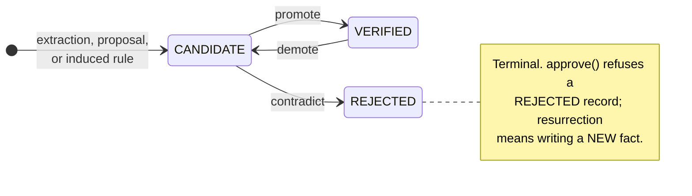
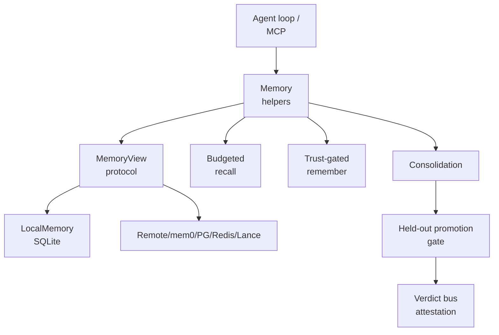

## 1. Executive Summary

`verel` is not primarily a memory product; it is a verification-first agent framework. Its memory package is nevertheless one of the most technically interesting in the workspace because it treats memory as an epistemic/trust problem, not just retrieval.

Core idea: extracted facts and learned rules should not automatically become trusted memory. Verel separates:

- `epistemic_confidence`: belief that the memory is true.
- `retrieval_strength`: reachability/usefulness for recall.
- `trust`: candidate, verified, rejected.

It also has correction chains, rejected-value tombstones, volatile/TTL/pinned lifecycle flags, token-budgeted recall, held-out promotion gates, scope lattices, hosted/replicated memory, and pluggable backends.

The code is unusually explicit about adversarial cases. Many comments refer to audit rounds and attack fixes. It is more of a research/verification design than a minimal production memory service.

> **Provenance of the tombstone.** Verel's git history dates `rejected_values`
> to 28 June 2026, as the fix for a red-team finding — "rejection wasn't durable
> across supersede-then-restate" — and shows it hardened across three further
> rounds that each defeated the previous fix: TTL pruning erased it, NFKC
> look-alikes evaded its key, and the ledger needed bounding. The atlas's most
> quoted negative result rests on a mechanism that adversarial testing forced
> into existence in a single evening. See the
> [rejected-value tombstone](../../patterns/rejected-value-tombstone/) pattern.

## 2. Mental Model

Primary memory unit:

```python
MemoryRecord(
    kind=FACT | DESIGN_RULE | SCHEMA | FAILURE | SKILL,
    subject=...,
    predicate=...,
    text=...,
    scope=...,
    subj_pred_key=...,
    provenance=[...],
    trust=CANDIDATE | VERIFIED | REJECTED,
    epistemic_confidence=...,
    retrieval_strength=...,
    support_count=...,
    detail_json=...
)
```

Lifecycle:



Three states, and three ways into `VERIFIED`: multi-principal corroboration, the
held-out attestation gate, and a human `approve()` that is CLI-only so an agent
cannot promote its own candidate.

**What the diagram leaves out is the design principle: retrieval and truth are
orthogonal.** `epistemic_confidence` moves on every contradiction and
`retrieval_strength` moves on every recall, and neither is a transition above —
they are fields, not states. That separation is enforced rather than asserted.
The mutation audit logs `write`, `corroborate`, `contradict`, `promote`,
`demote`, `decay` and more, and **excludes recall on purpose**, on the reasoning
that reinforcement is *"reachability bookkeeping (the testing effect), not a
belief mutation"*. Decay and prune change what is reachable and never what is
true.

## 3. Architecture

Core files:

- `src/verel/memory/view.py`: protocol, record model, trust/ranking/decay.
- `src/verel/memory/local.py`: SQLite `LocalMemory`.
- `src/verel/memory/remember.py`: conversation extraction trust gate.
- `src/verel/memory/recall.py`: token-budgeted, untrusted-data-fenced recall.
- `src/verel/memory/consolidate.py`: failures -> design rules -> schemas.
- `src/verel/memory/promotion.py`: held-out eval promotion gate.
- `src/verel/memory/lattice.py`: scope hierarchy recall and graduation.
- `src/verel/memory/hosted.py`: hosted memory server/client.
- `src/verel/memory/replicated.py`: leader/follower replicated memory.
- `src/verel/memory/mem0_backend.py`, `pg_backend.py`, `redis_backend.py`, `lance_backend.py`: backend adapters.
- `src/verel/mcp_server.py`: MCP integration.

Architecture:



## 4. Essential Implementation Paths

Record/trust model:

- `MemoryRecord`, `Trust`, `MemoryKind`, `rank()`, `apply_decay()` in `view.py`.
- `make_key()` and `make_id()` define content-addressed identity from `(subject, predicate, scope)`.
- `canonical_text()` is shared by recall rendering and rejection comparison.

Local persistence:

- `LocalMemory` in `local.py`.
- SQLite table `memory` stores all fields plus optional vector JSON.
- WAL + `synchronous=FULL` when durable file-backed mode is enabled.

Write path:

- `LocalMemory.write()`.
- Same `(subject, predicate, scope)` and same text corroborates: support and confidence rise.
- Same key with different value supersedes: correction chain is stored.
- Rejected values are carried forward in a bounded ledger to prevent laundering.
- `apply_replica()` bypasses inference behavior for replication idempotence.

Recall:

- `LocalMemory.recall()` has three relevance paths, and the default is the one worth knowing:
  SQLite **FTS5 with BM25** scoring when no embedder is configured and the SQLite build has FTS5.
  That path filters scope, kind, and rejected records in SQL, over-fetches, and re-ranks the
  candidates through the trust-aware `rank()`. A configured embedder switches to cosine over a full
  scan; token overlap is the last resort, used only when FTS5 is unavailable
  ([`local.py`](https://github.com/amitpatole/verel/blob/df44e76c6c6a919977806feed9549bc6a892932d/src/verel/memory/local.py#L249)).
- Excludes rejected records.
- Recall reinforces only `retrieval_strength`, never confidence.
- `recall_budgeted()` in `recall.py` greedily packs ranked memories under a token budget.
- **The fence is on one accessor, not on recall generally.** Neutralization and the
  `<recalled_memory>` fence happen in `BudgetedRecall.text`, the rendered prompt block. Raw
  `recall()` and `recall_as_of()` return `MemoryRecord` objects with unfenced `text`, and so does
  `recall_budgeted(...).records`. `recall_as_of` says so in its own docstring: a caller that drops
  as-of results into a prompt "must fence them as untrusted DATA exactly as it would `recall`"
  ([`recall.py`](https://github.com/amitpatole/verel/blob/df44e76c6c6a919977806feed9549bc6a892932d/src/verel/memory/recall.py)).

Remember/extraction gate:

- `remember_conversation()` in `remember.py`.
- Calls `extract_facts(...)`.
- Refuses reserved keys and non-FACT clobbering.
- Promotes only with attestation or distinct authenticated principals.
- Repeated self-asserted source labels do not count without an authenticator.

Consolidation:

- `consolidate_failures()` clusters `FAILURE` records and asks an LLM to induce `DESIGN_RULE` candidates.
- `induce_schemas()` and `induce_hierarchy()` create higher-order `SCHEMA` candidates.
- These are never auto-verified.
- `ConsolidationStats` counts why a pass produced what it did, which is rarer than it sounds. The
  module names the problem it solves: consolidation "SILENTLY drops clusters that are too small or
  whose LLM reply won't parse — so an operator otherwise can't tell '5 failures, 0 rules' from 'the
  LLM returned junk 5 times'." The counters carry a stated invariant,
  `written = clusters_found − too_small − parse_failures`, so a run reconciles rather than merely
  reporting. Elsewhere in the atlas an LLM induction pass that yields nothing is indistinguishable
  from one that was never given enough to work with.

Promotion:

- `PromotionGate.consider()` in `promotion.py`.
- Evaluates rule over held-out corpus.
- Checks leakage canary.
- Creates signed run receipt.
- Gates through verdict bus.
- Promotes only on attested pass and F1 threshold.

Scope lattice:

- `lattice_recall()` searches scope plus ancestors with specificity bonus.
- `graduate()` promotes verified sibling beliefs to a parent scope as candidates.

Tests:

- `tests/test_memory.py`
- `tests/test_memory_remember.py`
- `tests/test_memory_recall_budget.py`
- `tests/test_memory_lifecycle.py`
- `tests/test_consolidation.py`
- `tests/test_promotion.py`
- `tests/test_lattice.py`
- `tests/test_replicated.py`
- `tests/test_hosted_memory.py`

### A hash-chained mutation audit

[`memory/audit.py`](https://github.com/amitpatole/verel/blob/df44e76c6c6a919977806feed9549bc6a892932d/src/verel/memory/audit.py)
names the gap it closes: "correction chains preserve WHAT a record used to say,
but not WHO/WHAT changed it." `MemoryAudit` records mutations as
`{seq, ts, actor, action, record_id, before, after}`, hash-chained so each entry
commits to its predecessor by SHA-256 and in-place tampering is detectable.

Three details are worth stating precisely, because each one is a boundary the
module draws deliberately.

It is **opt-in**. `AuditedMemory` is a wrapper you construct around a backend,
not behaviour a backend has by default; an unwrapped `LocalMemory` writes no
audit trail. What it buys for that is reach: it wraps *any* backend "at the
Protocol seam, so no backend needs changes and every backend gets the same
audit", a decorator over the interface rather than a feature each backend
reimplements.

It logs **belief mutations, not access**. The audited set is `write`,
`apply_replica`, `corroborate`, `contradict`, `promote`, `demote`, `annotate`,
`set_flags`, `pin`, `unpin`, `decay` — "everything that moves belief, trust, or
lifecycle". Recall's retrieval-strength reinforcement is excluded on purpose:
"that is reachability bookkeeping (the testing effect), not a belief mutation —
logging every recall would flood the log and let a hostile query stream inflate
it." So the log answers *who changed this belief*, not *who read it*.

And it bounds its own tamper-evidence rather than claiming integrity in general.
This "is NOT a signed log", unlike the receipt store elsewhere in the project.
`verify()` catches in-place edits and middle deletions; it does *not* catch tail
truncation or a full re-forge, because there is no external signed head to anchor
against. The module's own framing is that an attacker who can write to the log
already has write access to the store, so this is defence in depth rather than a
trust boundary.

### Review that cannot launder

`memory/review.py` adds the third path into VERIFIED — a human adjudicating
CANDIDATE facts, alongside the attested promotion gate and multi-principal
corroboration. Its two security positions are the interesting part.

It is "**CLI-only by design** — an agent must never be able to approve its own
candidate facts", so the MCP surface stays read/write of candidates only. And
"**approve never launders**": `approve()` refuses a REJECTED record, because "the
rejected-value ledger exists precisely so a once-rejected value can't come back;
a human wanting to resurrect one must write it as a NEW fact and let the gate see
the ledger."

That second rule is the one most systems carrying both a review surface and a
tombstone would get wrong. A review workflow is an authority; without this, it is
an authority that can be pointed at the tombstone.

### Consolidation that can be wrong

`memory/revise.py` is contradiction-driven schema revision, on a premise worth
quoting: "Consolidation only ever GREW… But a generalization can be falsified…
**a memory that only grows is a memory that lies.** This is the contraction
half." A counterexample landing in a rule's domain is recorded against the rule
and contradicts it.

Every other consolidation pass in this atlas adds. This one can retract a
generalization when the evidence turns, which is belief *contraction* rather than
supersession of a single value.

### Capability claims as live probes

`memory/rubric.py` is the newest module and the one that needs the most careful
handling here, because it assesses Verel against *this atlas's* seven
capabilities. **The marks in the strip at the top of this page are the atlas's
own reading of the code and owe nothing to it.** What follows is a description of
a mechanism Verel ships, judged the same way any other mechanism would be.

The technically interesting part is that each of the seven is a **live
behavioural probe**, not a claim and not a has-this-function check. The tombstone
probe writes a fact, contradicts it six times, supersedes it with a different
value, re-asserts the original, and then checks `is_launder_blocked` — it walks
the laundering attack and reports what happened. The scope probe writes to two
scopes and asserts the read path returns one. Each result carries the criterion,
the file implementing it, and a `proof` string stating what the probe actually
demonstrated. A regression flips a mark to a dash.

That is the right shape for a capability claim, and it is worth separating from
whether the claim is *true*: a system can ship an honest probe and still be wrong
about itself, and a probe is only as good as the behaviour it exercises.

**Run from an installed wheel it scores 6/7, not the 7/7 the release claims.**
Verel v1.9.2 is titled "fix verel memory rubric to be install-independent (7/7
from a wheel)", but `rubric.py` is byte-identical to v1.9.1 and the wheel ships
no `tests/`. I installed the package at this pin and ran it:

```text
score: 6/7 (binary marks; NOT a maturity score)
...
[ -- ] Negative Retrieval Assertion
        proof: rejected value absent from budgeted recall=True; committed cases:
               (negative-eval suite not found next to the package — running from a wheel?)
```

From a source checkout at the same commit it does score 7/7. The gap is not a
capability gap and the probe is not lying — the behavioural half passes either
way, and the atlas's criterion asks for *committed* cases, which genuinely cannot
be seen from a wheel that excludes them. It is a release note that overstates a
packaging change that did not land. Worth recording precisely because the module
is an argument for demonstrated over asserted behaviour, and the assertion that
slipped was the one about the tool itself.

## 5. Memory Data Model

The data model is explicit and compact:

- `kind`: fact, design rule, schema, failure, skill.
- `subject`, `predicate`, `text`: structured claim.
- `scope`: repo/component/global/etc.
- `subj_pred_key`: interference key.
- `source`, `provenance`: evidence.
- `trust`: candidate/verified/rejected.
- `epistemic_confidence`: truth confidence.
- `retrieval_strength`: recall strength.
- `support_count`: corroboration count.
- `detail_json`: lifecycle flags, corrections, rejected values, schema metadata, etc.

SQLite is one table. The abstraction is in `MemoryView`, not schema complexity.

## 6. Retrieval Mechanics

Retrieval ranking:

```text
rank = W_REL * relevance
     + W_REC * retrieval_strength
     + W_CONF * epistemic_confidence
     + W_TRUST * trust_tier
```

The `relevance` term is BM25 over SQLite FTS5 by default, cosine when an embedder is configured, and
token overlap only where FTS5 is missing from the SQLite build. Everything after it is Verel's own:
verified memories get a retrieval-strength floor so a trusted fact does not decay below a fresh
candidate at equal relevance, and rejected memories are excluded from normal recall.

`recall_budgeted()` adds:

- Token budget.
- Highest-ranked memory always included if any relevant memory exists.
- Dropped count.
- An untrusted-data fence and canonical-text neutralization, so recalled content cannot forge prompt
  structure — **on the `.text` accessor**. The `.records` on the same result, and everything returned
  by `recall()` and `recall_as_of()`, are raw records whose text the caller must fence itself.

This is one of the cleanest retrieval safety designs in the workspace, with the caveat that it is
safe *by construction* only through one accessor. A caller that iterates records and formats its own
context block gets the ranking and the trust filtering but none of the neutralization — which is the
common way a design like this is lost in integration.

## 7. Write Mechanics

`LocalMemory.write()` is the critical method:

- Stable key from subject/predicate/scope.
- Same value -> corroboration.
- Rejected same value -> remains rejected.
- Different value -> supersede, preserve correction chain.
- Rejected value ledger is durable across supersessions.
- Embeddings are optional.

This solves a common memory bug: silently overwriting old values loses history; blindly appending creates contradictions. Verel keeps the current value plus bounded correction history.

**The ledger's reach is one identity, and that is the thing to understand before
copying it.** `make_key(subject, predicate, scope)` decides which record a
rejection attaches to, and the `rejected_values` list lives in that record's
detail. So a value rejected for `(deploy-target, region, repo:acme)` is durably
blocked for that triple across every later supersession — but the same string
written under a different subject, a different predicate, or a different scope
lands on a different record with its own, empty ledger. That is a deliberate
consequence of scoping rejections rather than globally banning strings: a fact
judged wrong for one project should not be unwritable for another. It does mean
the guarantee is "un-launderable *for this key*", not "un-writable anywhere", and
that a normalization or scoping mistake at the boundary is where the mechanism
leaks rather than in the ledger itself.

## 8. Agent Integration

Surfaces:

- Python API through `verel.memory`.
- MCP through `src/verel/mcp_server.py`.
- CLI/framework integration through the broader Verel runtime.
- Backends selected through the registry, by name, from `VEREL_MEMORY_BACKEND`.

The registry's `_BUILTINS` map holds **five** selectable names — `local`, `remote`, `postgres`,
`lancedb`, `redis` — each resolved to a class exposing `from_env()`, with a `verel.memory_backends`
entry-point group consulted only for names that are *not* built in, "so a malicious installed package
CANNOT shadow a built-in backend name". **mem0 is the exception and is not in that map**: `Mem0Memory`
and `make_ollama_mem0` are exported for code to construct directly, so mem0 cannot be reached by
setting `VEREL_MEMORY_BACKEND`. Six backends exist; five are operator-selectable.

### Operational shape

Nothing here is queued, which matters for anyone sizing this:

- **Local writes are synchronous and immediately retrievable.** `write()` returns after the row is
  upserted; there is no ingestion queue between writing a fact and recalling it.
- **Durable mode fsyncs before returning.** A file-backed `LocalMemory` defaults to `durable=True`,
  which sets `journal_mode=WAL` and `synchronous=FULL`, so "a write that returned is durable BEFORE
  its replica is acked — it survives a leader crash". `durable=False` trades that fsync for speed,
  and `:memory:` skips both.
- **Replicated writes contact peers in-line.** `ReplicatedMemory.write()` applies locally, then
  replicates to each peer and counts acks before returning, raising `ReplicationError` below
  `write_quorum` (default 1, leader-durable). An unreachable follower does not fail the write; it
  falls behind and catches up.
- **The background passes are full scans.** `decay()` and `prune()` both `SELECT` the whole `memory`
  table, and a follower's `sync_from()` pulls every record from the leader. Fine at the scale this
  design targets, and the first thing to measure if a store gets large.

The memory system is designed to sit behind agent-run CI and verdict loops: only verified work compounds. That is a different use case from personal preference memory, though it can represent facts too.

## 9. Reliability, Safety, and Trust

Strengths:

- Explicit candidate/verified/rejected trust state.
- Confidence separate from retrieval strength.
- Rejected-value anti-laundering, with a review path that cannot bypass it.
- An opt-in hash-chained mutation audit that works over every backend, honest
  about being tamper-evident rather than signed.
- Bi-temporal validity with `recall_as_of` and `value_as_of`.
- Consolidation that can retract a falsified generalization, and counts why a
  pass produced what it did instead of dropping clusters silently.
- Authenticated principals, because a free-string author is forgeable.
- Canonicalization shared by renderer and trust gate.
- Prompt-injection neutralization in the rendered recall block.
- Held-out promotion gate with attestation.
- Scope lattice for shared memory without direct trust inheritance.
- SQLite crash-safety options.
- Replication/hosted tests exist.

Risks:

- Considerably more complex than most teams need initially.
- Some LLM consolidation paths are ambitious and may be brittle. `ConsolidationStats`
  makes a weak pass visible rather than reliable — you now learn that four clusters
  went unparsed, which is the necessary first step and not a fix.
- Release notes have run ahead of the code at least once: v1.9.2 claims a rubric
  fix that is not in that commit. The mechanisms hold up under checking; the
  announcements need the same checking.
- Recall is lexical by default. BM25 is a real ranking function rather than the token-overlap
  fallback, but it is still keyword matching: a paraphrased query needs the optional embedder.
- Correctness of attestation/authenticator depends on external integration.
- The many security-oriented mechanisms require discipline to preserve when extending.

## 10. Tests, Evals, and Benchmarks

Verel has strong memory-specific tests:

- Memory contract.
- Remember/extraction gate.
- Lifecycle/decay.
- Budgeted recall.
- Consolidation.
- Promotion.
- Lattice.
- Hosted and replicated backends.
- MCP memory.

I did not run the test suite. The test file coverage is unusually aligned with the
design claims. I did run `verel.memory.rubric`, from a wheel and from a source
checkout at this pin — see [capability claims as live probes](#capability-claims-as-live-probes)
— which is the only Verel code the atlas has executed rather than read.

### Negative evals

`tests/test_memory_negative_eval.py` is "a regression suite asserting what memory
must NOT surface or allow… a REJECTED fact is invisible to EVERY recall path,
un-resurrectable by re-assertion, un-launderable". It asserts rejected content is
absent from budgeted recall's *rendered text*, invisible to an exact verbatim
query at `k=100`, and excluded even without a scope filter.

The fixture is "paris office" — the same example as the round-7 red-team finding
that produced the tombstone. **The attack became a permanent regression test**,
which is the strongest form the
[rejected-value tombstone](../../patterns/rejected-value-tombstone/) pattern's
tests-to-require can take, and one of two instances of negative retrieval
assertions in this atlas.

## 11. For Your Own Build

### Steal

- **Make review incapable of laundering.** If a human can approve, they can
  approve something the tombstone already rejected — unless approval refuses
  rejected records and forces a new fact through the gate.
- **Wrap the audit around the interface, not inside each backend.** One decorator
  at the Protocol seam gives six backends the same guarantee.
- **Say what your audit is not.** "Tamper-evident, not signed" is more useful
  than an unqualified claim.
- **Let consolidation contract.** A pass that only generalizes will eventually
  generalize something false and never take it back.
- **Turn the attack into the regression test.** The red-team finding that forced
  the mechanism is the best fixture you will ever have for it.
- **Count why a background pass produced nothing.** "Zero rules" and "the model
  returned junk five times" look identical from the outside, and an induction
  pass that silently drops its inputs will be trusted long past the point it
  stopped working. Counters with an invariant that reconciles beat a log line.
- **Make a capability claim executable.** A probe that writes, corrupts, and reads
  back is worth more than a checklist, because it fails when the behaviour
  regresses rather than when someone remembers to update a document.
- Separate truth confidence from retrieval strength.
- Candidate/verified/rejected trust state.
- Correction chains instead of silent overwrites.
- Rejected-value tombstones to prevent laundering.
- Recall fenced as untrusted data — and, borrowing the caveat with the pattern, be explicit about
  which accessor carries the fence, since the raw-record path bypasses it.
- Token-budgeted recall that reports dropped memories.
- Scope lattice with graduate-up as candidate, not verified.
- Held-out promotion gates for learned rules.

### Avoid

- The design may be overbuilt for simple personalization.
- Too much security logic in comments can become stale if tests do not enforce every invariant.
- LLM-induced design rules require careful held-out evals to avoid false generalization.
- Single-table local model is elegant but may need indexing work for large memory corpora.

### Fit

Borrow aggressively for correctness-sensitive agent memory:

- Trust model.
- Recall neutralization.
- Correction/rejected-value handling.
- Promotion gate concept.
- Scope lattice semantics.

Do not start here if you need a quick MVP. The minimal viable subset would be:

- `MemoryRecord` with trust/confidence/retrieval fields.
- `write()` interference behavior.
- `recall_budgeted()` fence.
- simple local SQLite backend.

Add consolidation/promotion/replication later.

## 12. Open Questions

- How well does the trust machinery perform with real noisy agent transcripts?
- What is the operational UX for resolving candidates/rejections?
- Which backend is used in serious deployments?
- How often do induced schemas help versus overgeneralize?
- How mature is the replicated store under network partitions?

## Appendix: File Index

- Protocol/model/ranking: `src/verel/memory/view.py`.
- Local store: `src/verel/memory/local.py`.
- Conversation memory gate: `src/verel/memory/remember.py`.
- Recall: `src/verel/memory/recall.py`.
- Consolidation: `src/verel/memory/consolidate.py`.
- Promotion: `src/verel/memory/promotion.py`.
- Scope lattice: `src/verel/memory/lattice.py`.
- Backends: `src/verel/memory/*_backend.py`, `hosted.py`, `replicated.py`.
- Tests: `tests/test_memory*.py`, `tests/test_consolidation.py`, `tests/test_promotion.py`, `tests/test_lattice.py`.

## History

**2026-07-28** — [`df44e76c6c6a919977806feed9549bc6a892932d`](https://github.com/amitpatole/verel/commit/df44e76c6c6a919977806feed9549bc6a892932d) — Re-pinned. The project ships `memory/rubric.py`, which grades itself against this atlas's capabilities by running a live behavioural probe per criterion.

**2026-07-28** — [`5aa050fea33ce07138ddf644a58df1f0a60b7aa7`](https://github.com/amitpatole/verel/commit/5aa050fea33ce07138ddf644a58df1f0a60b7aa7) — v1.9.0, re-reviewed after the author reported the entry was out of date. The previous pin was not merely old but **unreachable from any branch** — GitHub served it by SHA while a full clone did not contain it — so that reading described a state absent from the project's history. Marks moved from three of seven to all seven, and four atlas-wide counts changed with them.

**2026-07-26** — [`df80efe8207a99585a2ebce36fc6e32ba5077e2e`](https://github.com/amitpatole/verel/commit/df80efe8207a99585a2ebce36fc6e32ba5077e2e) — First reading.
