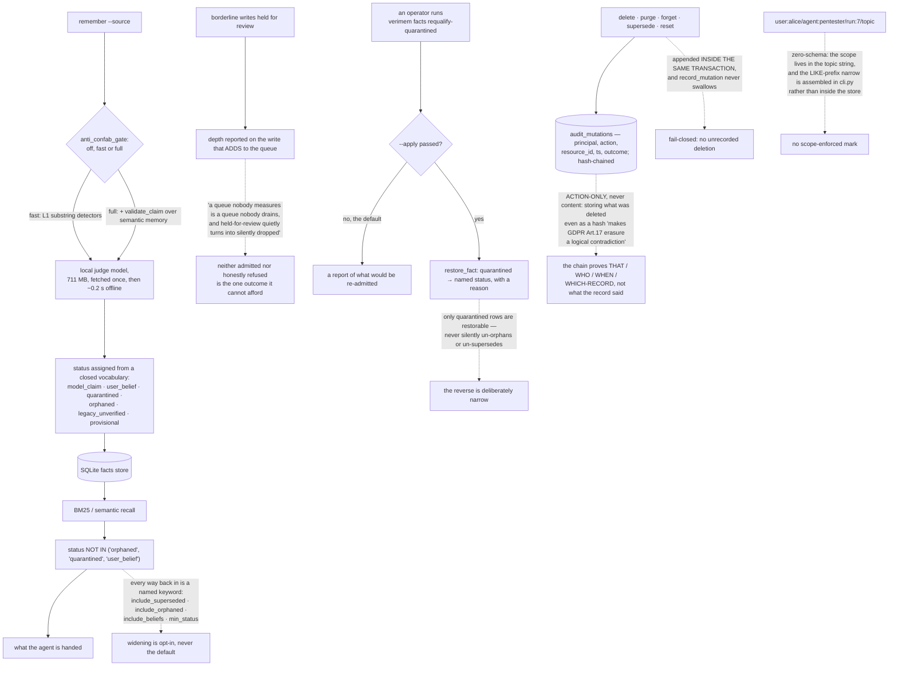

## 1. Executive Summary

Verimem is "**[v]erified memory for AI agents**" — AGPL-3.0 with a commercial
option, Python, version 0.7.7, 130,388 lines in the core package with 1,694 test
files, on SQLite. Its promise is a conjunction:

> "Every write passes an admission gate, every read carries provenance, and a
> claim the source **openly contradicts** does not come back as truth."

**The mechanism worth carrying away is what the audit log refuses to store.**
Most projects that reach for a tamper-evident chain put the content in it, and
then discover that an immutable record of what was deleted is itself a copy of
what was deleted. `mutation_audit.py` argues the other way:

> "ACTION-ONLY, never content (F1/F8): storing WHAT was deleted — even as a
> hash, brute-forceable on short text — inside an immutable chain makes GDPR
> Art.17 erasure a logical contradiction. The chain proves THAT/WHO/WHEN/
> WHICH-RECORD, not what the record said."

Every destructive operation — delete, purge, forget, supersede, reset — appends
one row "INSIDE THE SAME TRANSACTION as the mutation itself", and
`record_mutation` "never swallows", so a failure to record propagates instead of
leaving an unrecorded deletion. Both decisions are attributed to "two
independent adversarial reviews (GLM-5.2 + deepseek, convergent findings)", with
the finding ids each one answers.

**The status vocabulary withholds rather than ranks.** The gate classifies a
write into a closed set — `user_belief`, `quarantined`, `orphaned`,
`legacy_unverified`, `provisional`, `model_claim` — and the ranking SQL carries
`status NOT IN ('orphaned', 'quarantined', 'user_belief')`. Every route back to
the withheld material is an explicitly named opt-in on `recall`:
`include_superseded`, `include_orphaned`, `include_beliefs`, `min_status`. The
atlas has read two systems this week whose epistemic vocabulary only sorted the
results; this one drops them.

**The project corrects its own documentation in public.** The README's first
box used to say the gate was off until a warmup command was run. It now carries
the correction, the version the old claim was true of, the function that was
reachable only from `warmup`, the test that "records the measurement and the
fix", and the admission that matters: "*The fix shipped; the text did not follow
it. Corrected here.*"

**The gap is scope.** Multi-tenancy is "a ZERO-SCHEMA topic prefix" —
`user:<u>/agent:<a>/run:<r>/<base-topic>` — and the functions that turn it into
a `topic LIKE '<prefix>%'` narrow are imported by `verimem/cli.py`, not applied
inside the store. The isolation is real on the command-line path and is the
caller's responsibility elsewhere, which is why the mark is withheld.

## 2. Mental Model

A **status** is a stored verdict, and three of them keep a fact out of recall.

A **widening** is a named keyword you had to type.

An **audit row** proves that a deletion happened and cannot tell you what was deleted.

A **quarantine** is reversible, and only quarantine is.

A **declared limit** is a gap the module publishes about itself.

## 3. Architecture

| Area | Role |
| --- | --- |
| `verimem/admission_gate.py` | The status vocabulary and what earns each one |
| `verimem/anti_confab_gate.py` | Three validation tiers, run before a fact is persisted |
| `verimem/bm25_rank.py` | The clause that keeps three statuses out of ranked recall |
| `verimem/semantic.py` | Recall, its opt-in widenings, and the reversible restore |
| `verimem/mutation_audit.py` | A hash-chained, action-only, fail-closed mutation record |
| `verimem/review_queue.py` | Queue depth, and a declared limit about measuring it |
| `verimem/scope.py`, `agent_scope.py` | Topic-prefix multi-tenancy, and its accepted caveat |

## 4. Essential Implementation Paths

`verimem/mutation_audit.py:1-25` — the whole argument for what an audit chain
must not contain.

`verimem/bm25_rank.py:26`, `:42` — five words of SQL doing the withholding.

`verimem/semantic.py:4016-4026` — a recall signature where every widening is
named.

`verimem/semantic.py:5695-5701` — an un-quarantine that refuses to un-orphan.

`verimem/review_queue.py:1-16` — why an unmeasured queue is a dishonest
abstention.

`verimem/scope.py:1-14` — the scope convention, and the collision it accepts.

## 5. Memory Data Model

A fact carries a proposition, a status from the gate's vocabulary, a writer
role, grounding evidence and trust signals; episodes carry task traces, skills
and outcomes beside them. Statuses are the load-bearing field: they decide
whether the fact is in the live view, and the transitions between them are what
the mutation chain records.

## 6. Retrieval Mechanics

BM25 and semantic recall over the guarded view, with the status filter compiled
into both the appended predicate and a standalone filter string so the two
cannot drift. `search_facts` accepts a single `as_of` over record time and
counts how many rows that constraint excluded, which is a real point-in-time
read over one axis rather than two.

## 7. Write Mechanics

`validate="fast"` is the default tier: pure substring detectors, "cold execution
<< 1 ms". `full` adds claim validation against the agent's semantic memory at a
measured mean of about 13 ms. `off` exists and is labelled what it is — "[p]ure
escape hatch for migrations, replays, deliberate writes." The first gated write
on a fresh install fetches the judge model itself, which the README measures at
85.7 seconds and explains how to move rather than avoid.

## 8. Agent Integration

A CLI, an MCP server registered as `io.github.aureliocpr-ctrl/verimem`, an SDK
client exposing `search(query, as_of="auto")`, a gateway, Docker compose files
and hook and slash-command bundles.

## 9. Reliability, Safety, and Trust

The strong parts are the fail-closed audit, the withholding statuses, the
reversible-but-narrow restore, and a documentation habit that publishes
corrections and limits rather than quietly fixing them. The weak parts are scope
living in a string and assembled outside the store, a single time axis, and no
value-keyed record of a rejected claim.

## 10. Tests, Evals, and Benchmarks

1,694 test files, of which 284 touch the quarantine path, plus benchmark
directories and a `docs/stato-reale/banchi/` tree the README cites figure by
figure. The negative-bundle suites are about skill pairs that predict failure
rather than about material that must not be retrieved, so the committed
must-not-retrieve case this design would support does not appear to exist yet.

## 11. For Your Own Build

Decide what your audit chain is allowed to contain before you build it. An
immutable record of content is a second copy you cannot delete, and the argument
in `mutation_audit.py` is the clearest statement of that trade in this corpus.

Write the audit row inside the mutation's transaction and let a failure
propagate. An audit that can fail silently is an audit that is wrong exactly
when it matters.

Name every widening. A recall signature where `include_orphaned` has to be typed
is one where the default is defensible and the exception is visible in the
caller's code.

Publish the limit. `DECLARED LIMIT` as a heading, with the reason the coarse
measure was chosen, is better than a precise number nobody computes.

## 12. Open Questions

Whether scope should move into the store. Everything else here is enforced where
it cannot be forgotten; the topic prefix is assembled by the CLI, and a library
consumer that skips it gets every tenant's facts.

Whether the gate's status vocabulary wants a second time axis behind it. A fact
that was true and stopped being true is currently handled by supersession over
record time, which cannot answer what was true last quarter.

## Appendix: File Index

| Path | What to read it for |
| --- | --- |
| `verimem/mutation_audit.py:1-25` | What an immutable chain must not be allowed to remember |
| `verimem/bm25_rank.py:26`, `:42` | A status filter written twice so it cannot drift |
| `verimem/semantic.py:4016-4026` | Widening as a named keyword rather than a default |
| `verimem/review_queue.py:1-16` | Why "held for review" becomes "silently dropped" |
| `verimem/scope.py:1-14` | Multi-tenancy as a string convention, with its collision declared |

## History

**2026-09-16** — [`ef7de72459c9d12a1f4a22af4362a1b4a47c8fa8`](https://github.com/aureliocpr-ctrl/verimem/commit/ef7de72459c9d12a1f4a22af4362a1b4a47c8fa8) — first reading, at a commit dated 13 September 2026. Screened before opening, from a shallow clone: five auto-run surfaces, two build-time execution points, two unpinned dependency surfaces and two dependency files inside the seven-day cooldown. `CLAUDE.md` is addressed to a reading agent and was recorded as data. Dual-licensed AGPL-3.0 with a paid commercial option; the licensing file carries no rider restricting who may read or analyse the code. Nothing was installed, built or run, no judge model was fetched, and none of the benchmark figures quoted here were reproduced — they are the project's own measurements, read from its documentation.
