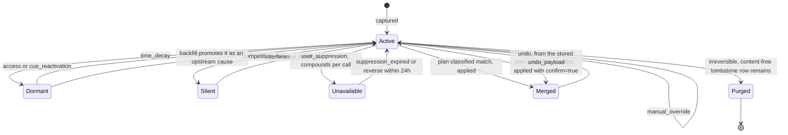

## 1. Executive Summary

Vestige is a local-first memory layer for MCP agents: one 25MB Rust binary, one
SQLite file, AGPL-3.0, about 97,000 lines across two crates with 1,088 test
functions. It models memory on cognitive science — FSRS-6 spaced repetition, the
Bjork dual-strength model, ACT-R activation, top-down inhibitory suppression —
and cites the papers in the code.

Three things earn the report.

**Merge decisions use record-linkage theory instead of a similarity threshold.**
`crates/vestige-core/src/advanced/merge_supersede.rs` applies Fellegi-Sunter
with two thresholds, classifying every candidate pair as `match`, `possible` or
`non_match`. The header says why: a single cosine threshold "over-merges and
destroys the audit trail". The consequence reaches the tool surface — the
`dedup` tool's `apply` action accepts a `match` plan directly, and
`'possible'/'non_match' need confirm=true`. Uncertainty is routed to a person
rather than resolved by rounding.

**Every applied operation carries the payload that reverses it.**
`merge_operations` is described in the migration as "the 'git reflog for your
agent's memory'": one row per applied merge or supersede, with `undo_payload`
holding "everything needed to reverse it", `signals` recording "why the memories
combined", and an `undo` op type that points back at what it reverted. The tool
description states the invariant plainly — "Old memories are invalidated, never
deleted."

**And there is a `protect` action** that pins a memory against auto-merge,
supersede and forget — an explicit opt-out from every automatic lifecycle
mechanism, which is a thing this atlas asks for and rarely finds.

The caveat a reader needs first: the benchmark the README leads with, **Silent
Rotation**, is not in this tree. It lives on a separate branch
(`benchmark/silent-rotation`), and the reported result — 20/23 converged correct
for Vestige against 0/25 for no memory and 4/23 for dense cosine RAG, across 6
models, 25 trials and 246 published transcripts — **cannot be verified from the
pinned commit**. What can be said from here is that the README publishes its own
losses ("the trials where a plain cosine baseline ties Vestige and the trial
Vestige loses") and separates the theoretical claim it borrows from the
measurement it made, which is better practice than most benchmark sections in
this corpus.

## 2. Mental Model

A memory is a `knowledge_node` carrying an unusual amount of cognitive state:
FSRS-6 stability, difficulty, reps and lapses; the Bjork dual-strength triple of
storage, retrieval and retention strength; sentiment score and magnitude for
emotional weighting; and an ACT-R activation value computed during
consolidation.

Beside it, `memory_states` holds a four-value **availability** state — `active`,
`dormant`, `silent`, `unavailable` — with `suppression_until` and a
`suppressed_by` JSON array naming which other memories are inhibiting this one.
That last field is the design's core idea: memories compete, and losing
competition is a recorded event rather than a lower score.

The flagship retrieval primitive is `backfill`, and it inverts the usual
direction. When a failure is recorded, it reaches **backward** in time to
promote the earlier memory that caused it — selected by shared entity (the same
file, environment variable or service) rather than by similarity, because, in
the tool's own words, the root cause is one "a vector search structurally cannot
surface because it isn't similar to the failure, only causally upstream". It is
described as a faithful port of Cai 2024 and is backward-only by construction.

Every transition on that diagram writes a `state_transitions` row with a
`reason_type` from a nine-value vocabulary — the labels on the arrows are the
literal values in the schema.

## 3. Architecture

Two crates: `vestige-core` (62,000 lines) holds storage, the neuroscience
modules, search, merge/supersede and the dream cycle; `vestige-mcp` (35,000
lines) is the tool surface. The result is a single binary with an `npx`
installer, an offline embedding model downloaded once, no API key and no
telemetry.

The schema is fifteen-plus numbered migrations with a `schema_version` table and
assertions in the migration code itself — migration V13's test block checks that
`deletion_tombstones` exists after it runs.

One migration comment deserves quoting in full, because it is the correct
handling of a defect this atlas keeps finding in other systems:

> DEPRECATED (v2.0.5): `knowledge_edges` is unused. All graph edges use
> `memory_connections` (migration V3). This table was designed for bi-temporal
> edge support but was never wired. Retained for schema compatibility with
> existing databases. Do NOT add queries against this table.

An unwired table, labelled as unwired, with the reason, the replacement and an
instruction. Four systems in this atlas ship the same situation without the
comment; a reader auditing this schema cannot be misled.

## 4. Essential Implementation Paths

**Capture** — the `memory` tool → `SqliteStorage` insert
(`crates/vestige-core/src/storage/sqlite.rs:874-935`), which writes
`valid_from`/`valid_until` from the caller when supplied.

**Recall** — hybrid search with a validity boost
(`crates/vestige-core/src/search/temporal.rs:121`) and spreading activation via
the `graph` tool's `associations` action.

**Point in time** — `sqlite.rs:3686`: `SELECT * FROM knowledge_nodes WHERE
(valid_from IS NULL OR valid_from <= ?1) AND (valid_until IS NULL OR valid_until
>= ?1)`, with `KnowledgeNode::is_valid_at` as the in-memory equivalent and unit
tests for the future-dated and past-dated cases.

**Merge** — `dedup` `scan` (read-only, cosine clusters plus Fellegi-Sunter) →
`plan_merge`/`plan_supersede` (a `merge_plans` row, status `pending`) → `apply`
(guarded by `confirm=true` for `possible` and `non_match`) → `merge_operations`
with the undo payload → `undo`.

**Suppress** — the `suppress` tool applies top-down inhibition; a background
Rac1 worker cascades decay to co-activated neighbours; reversible within 24
hours.

**Backfill** — from a recorded failure, reach backward by shared entity and
promote the causal antecedent.

## 5. Memory Data Model

Twenty-five-plus tables. The ones that carry the design:

| Table | Role |
| --- | --- |
| `knowledge_nodes` | Content plus FSRS-6, dual-strength, sentiment, activation, `valid_from`/`valid_until` |
| `memory_states` | `active \| dormant \| silent \| unavailable`, with `suppression_until` and `suppressed_by` |
| `state_transitions` | Append-only, `from_state`, `to_state`, a nine-value `reason_type`, `reason_data` |
| `merge_plans` | `pending \| applied \| cancelled`, with the Fellegi-Sunter `confidence` and `classification` |
| `merge_operations` | The reflog: `undo_payload`, `signals`, `reason`, `reverts_op_id` |
| `deletion_tombstones` | Content-free: id, time, reason, node type, tags, and counts of what the purge touched |
| `memory_access_log` | `search_hit \| promote \| demote`, timestamped |
| `fsrs_cards`, `fsrs_config` | Scheduling state and per-user parameters |
| `composition_events`, `composition_members`, `composition_outcomes` | Which memories were used together, and what happened next |

`deletion_tombstones` is worth reading carefully because of what it deliberately
does not keep. The migration comment: purge "permanently removes memory content
and embeddings, but keeps a content-free audit/sync record so users can verify
that a memory was removed without Vestige retaining the text it was told to
forget." The row keeps the counts of what the purge affected — edges pruned,
insights rewritten, insights deleted, children orphaned — so the blast radius is
auditable without the content being retained. That is a genuinely thoughtful
resolution of the tension between an audit trail and a right to erasure.

The composition tables are the other unusual idea: recording which memories were
retrieved *together*, what produced the composition, and what happened
afterwards, with the comment noting that `memory_id` values are "intentionally
historical references instead of foreign keys" so the record survives the
memories it describes.

## 6. Retrieval Mechanics

Hybrid search over embeddings and FTS, with three things layered on top that are
not common here.

A **validity boost** (`search/temporal.rs`) modulates the score by whether the
node's interval contains the query time, rather than filtering hard — so a
memory that has stopped being valid ranks lower rather than vanishing, while the
dedicated point-in-time query filters hard when a caller asks for an instant.

**Spreading activation** through `memory_connections` gives the `graph` tool its
`associations`, `chain` and `bridges` actions — a reasoning path from one memory
to another rather than a ranked list.

**Backward reach.** `backfill` is the flagship and the honest description of its
own necessity is the interesting part: the causal memory "ranks 7th of 8 under
both dense cosine *and* BM25, while the decoy ranks 1st" on the verbatim queries
agents typed. The mechanism exists because the ranking demonstrably fails, and
the project measured its own ranking failing before building around it.

There is no tenant or namespace scope. Tags are the only partition, and the
error message at `sqlite.rs:8445` — "Filter by tags to reduce scope" — is about
scan cost rather than isolation. `scope_enforced` is withheld: this is a
single-user store by design.

## 7. Write Mechanics

Writes are local and synchronous; there is no cloud call and no model call on
the write path beyond embedding.

Correction is a three-step pipeline and the steps are separated on purpose.
`scan` is read-only. `plan_merge` and `plan_supersede` produce a preview — a
`merge_plans` row with the diff in `payload` and no mutation. `apply` executes
one, and refuses without `confirm=true` when the classification is anything
weaker than `match`.

**Purge is the one irreversible operation and it is gated behind
`confirm=true`** as well. It removes content and embeddings, scrubs
`insights.source_memories`, detaches temporal-summary children, prunes graph
edges, and writes the content-free tombstone.

What the tombstone does not do is prevent re-assertion. It is keyed on the
memory id, and its consultation point is portable sync — "Hard purge tombstones
win over newer local edits during portable sync" — so importing a database that
still has the memory will not resurrect it. Writing the same content again
through the normal capture path will.

## 8. Agent Integration

Thirteen MCP tools, consolidated from a larger set with the folding documented in
comments: `recall`, `memory`, `codebase`, `intention`, `smart_ingest`,
`source_sync`, `memory_status`, `maintain`, `dedup`, `graph`, `session_start`,
`suppress`, `backfill`. `session_start` combines search, intentions, status,
predictions and codebase context into one token-budgeted call, "instead of 5
separate calls".

A dashboard, connectors with cursor checkpoints and upstream reconciliation, and
a portable export/import that merges into a non-empty database while applying
tombstones and keeping newer local rows on timestamp conflicts.

## 9. Reliability, Safety, and Trust

**Bitemporal — awarded.** `valid_from` and `valid_until` are separate columns
from `created_at`/`updated_at`, written from caller-supplied values on insert,
read by a dedicated point-in-time query, used as a ranking boost, and unit-tested
with future-dated and past-dated cases.

**Audit log — awarded, and it is well-motivated.** `state_transitions` is
append-only, indexed on memory and time, and every row names *why* the state
moved from a fixed vocabulary — `access`, `time_decay`, `cue_reactivation`,
`competition_loss`, `interference_resolved`, `user_suppression`,
`suppression_expired`, `manual_override`, `system_init`. `merge_operations` is a
second append-only record with the reversal payload, and `memory_access_log` a
third for reads. A reader can reconstruct why a memory is where it is.

**Human review — awarded.** The confirmation gate is real and it is graded by
uncertainty rather than applied uniformly: a `match` applies, a `possible` or
`non_match` requires an explicit `confirm=true` from the caller. `protect` lets a
person exempt a memory from every automatic lifecycle mechanism, and `undo`
reverses an applied operation from its stored payload.

**Trust state — withheld, and the distinction is worth naming.**
`memory_states` is a four-value field consulted on the read path, which is the
shape of the mark. It fails the definition because the axis is *availability*,
not credence: `silent` means another memory outcompeted this one, `unavailable`
means someone suppressed it. Nothing says whether a memory is true. `merge_plans`
has an epistemic-looking `classification` — `match | possible | non_match` — but
that is a judgement about whether two memories are the same thing, not about
whether either is correct.

**Tombstone — withheld.** `deletion_tombstones` is content-free by design and
keyed on the memory id, and it is consulted during portable sync rather than on
capture. It is a deletion receipt for replication, and it is a good one.

**Negative eval — no.** 1,088 test functions, and none found asserting that
particular material must not be retrieved. The Silent Rotation benchmark's
"converged **wrong**" column is the nearest thing in spirit — it measures the
fleet adopting a planted decoy — and it is not in this tree.

## 10. Tests, Evals, and Benchmarks

**No paper of its own**, and an unusually dense set of citations to other
people's: DeepMind on the limits of single-vector retrieval
([arXiv:2508.21038](https://arxiv.org/abs/2508.21038)), Cai 2024 for backward
salience, Anderson et al. 2025 and Davis on Rac1 for suppression, Bjork & Bjork
1992 for dual strength, FSRS-6 for scheduling, Fellegi-Sunter for record
linkage. The mechanisms are named after the papers in the code, which makes them
checkable in a way "cognitive-science-inspired" usually is not.

1,088 test functions across the two crates, plus `tests/e2e`, `tests/hooks` and
`tests/phase_1`. **I did not run them.** The screen flagged `server.json` as an
auto-run manifest and twelve dependency manifests inside the seven-day cooldown
including `Cargo.lock` and `pnpm-lock.yaml`.

**The benchmark is not at this commit.** Silent Rotation lives on the
`benchmark/silent-rotation` branch. Nothing about its numbers can be confirmed
from the pinned tree, and this report does not confirm them. What the README's
description shows is a well-designed *shape* of benchmark: a fact that exists
only in the memory layer, a planted decoy, and three outcome classes where
"converged wrong" — tests pass, merge is clean, production breaks — is named as
the dangerous one rather than folded into a failure rate.

## 11. For Your Own Build

### Steal

- **Use two thresholds, not one, and route the middle to a person.**
  Fellegi-Sunter's `match | possible | non_match` with `confirm=true` on the
  uncertain classes is the cheapest correct answer to "when is a merge safe" —
  and the header's argument, that a single threshold "over-merges and destroys
  the audit trail", generalises to every dedup gate in this atlas.
- **Store the undo payload with the operation.** One JSON column turns every
  merge into a reversible one and gives you a reflog for free.
- **Record why memories combined, not just that they did.** `signals` alongside
  `undo_payload` is what makes a later "why is this one memory now" answerable.
- **Give the user a `protect` flag.** One boolean exempting a memory from
  auto-merge, supersede and forgetting is the escape hatch every automatic
  lifecycle needs and almost none has.
- **Keep a content-free deletion receipt.** Id, time, reason, and the counts of
  what the purge touched — enough to prove the deletion and audit its blast
  radius, without retaining the text you were told to forget.
- **Name the reason for every state transition from a fixed vocabulary.** Nine
  values covering decay, competition, user action and system init means the log
  answers "why" and not only "when".
- **Label your unwired tables in the schema.** "Designed for bi-temporal edge
  support but was never wired… Do NOT add queries against this table" is the
  single most useful comment in this report, and four other systems in this atlas
  would have avoided a finding by writing it.
- **Measure your ranking failing before you build around it.** The backfill
  feature exists because the causal memory measurably ranks 7th of 8 under both
  dense and lexical retrieval.

### Avoid

- **Do not put your headline benchmark on another branch.** A reader pinning the
  main line cannot check any of it, and a claim that cannot be checked at the
  commit is a claim about a different artifact.
- **Do not mistake availability states for trust states.** `silent` and
  `unavailable` say a memory lost a competition or was suppressed; neither says
  it is wrong, and a system with four states and no notion of correctness can
  look more epistemically equipped than it is.
- **Do not expect a deletion receipt to stop a re-write.** The tombstone here
  wins during sync and is silent during capture.
- **Do not ship this shape without a scope story if more than one person will
  use it.** Tags are a convention; there is no boundary.

### Fit

This is for one developer on one machine who wants their agent to stop
re-learning the same lesson, and who is willing to run a 25MB binary and trust a
lot of cognitive-science machinery they will not read. AGPL-3.0 matters for
anyone considering embedding it in a service.

The parts worth lifting even if you never run it are small and separable: the
two-threshold merge classification, the undo payload, and the content-free
deletion receipt. Each is a table and a policy.

## 12. Open Questions

- **Does any tool expose `valid_from`?** The storage layer writes it from the
  caller and the query reads it; whether an agent can set a fact's validity
  through MCP was not traced, and it decides whether the bi-temporal axis is used
  or merely available.
- **How often does `possible` actually occur?** The whole confirmation design
  rests on the middle class being non-empty and rare; no distribution is
  published.
- **What clears `suppressed_by`?** Suppression compounds per call and reverses
  within 24 hours; the longer-term behaviour of the array was not traced.
- **What do the composition outcome tables drive?** They record which memories
  were used together and what happened; whether anything reads them back into
  ranking is unclear from the tool surface.

## Appendix: File Index

**Merge and supersede** — `crates/vestige-core/src/advanced/merge_supersede.rs`
(the Fellegi-Sunter rationale at `:19-41`, the three-way classification `:62`),
`crates/vestige-mcp/src/tools/dedup.rs`,
`crates/vestige-core/src/storage/migrations.rs:804-853` (`merge_plans`,
`merge_operations`)

**Deletion** — `migrations.rs:750-770` (`deletion_tombstones` and its
rationale), `sync_tombstones` `:735`

**States and transitions** — `migrations.rs:292-311` (`memory_states`),
`:349-362` (`state_transitions` and the reason vocabulary), `:483-495`
(`memory_access_log`)

**Bi-temporality** — `migrations.rs:211-215`,
`crates/vestige-core/src/storage/sqlite.rs:3686` (the point-in-time query),
`:874-935` (the insert), `crates/vestige-core/src/memory/node.rs:336`
(`is_valid_at`) and `:494-506` (its tests),
`crates/vestige-core/src/memory/temporal.rs`,
`crates/vestige-core/src/search/temporal.rs`

**The labelled dead table** — `migrations.rs:377-400` (`knowledge_edges`)

**Neuroscience modules** — `crates/vestige-core/src/neuroscience/`
(`hippocampal_index.rs`), the FSRS tables `migrations.rs:313`, `:507`, the dream
cycle `:532`, `consolidation_history` `:332`

**Composition** — `migrations.rs:854-900`
(`composition_events`, `composition_members`, `composition_outcomes`)

**Tool surface** — `crates/vestige-mcp/src/server.rs:247-420` (the thirteen
tools, with the folding history in comments), `crates/vestige-mcp/src/tools/`

**Tests** — 1,088 test functions in `crates/`, plus `tests/e2e`, `tests/hooks`,
`tests/phase_1`

**Not in this tree** — `benchmarks/silent-rotation/` lives on the
`benchmark/silent-rotation` branch

## History

**2026-08-09** — [`a8b0a75661faaa396fa4519c82fcc369f0ddef8e`](https://github.com/samvallad33/vestige/commit/a8b0a75661faaa396fa4519c82fcc369f0ddef8e) — first reading. Screened before reading: one auto-run surface (`server.json`), build-time execution in an npm manifest, and twelve dependency manifests inside the seven-day cooldown including `Cargo.lock` and `pnpm-lock.yaml`. The tree was read, never built, and no test or benchmark was run. The Silent Rotation benchmark is on a different branch and was not obtained.
