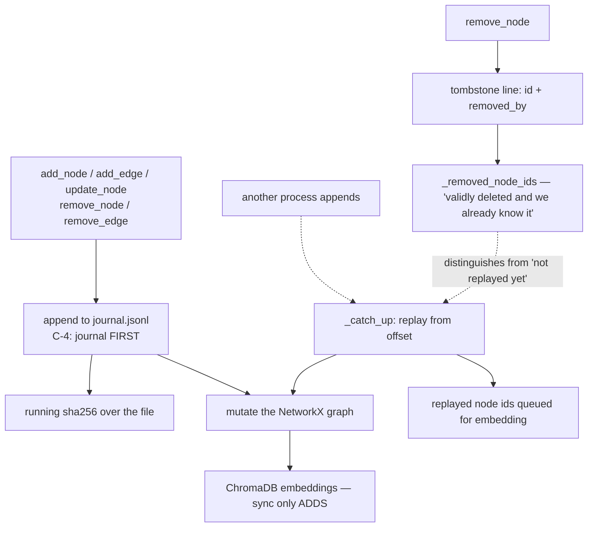

## 1. Executive Summary

Vibe Cognition is a fully local MCP server for Claude Code that captures why a
codebase is the way it is — decisions, failures, discoveries, patterns,
incidents. MIT, about 56,000 lines of Python, no API keys after a one-time model
download.

**The architecture is the finding, and it is the one the atlas's
[log-and-projection](../../patterns/) framing asks for.** Every mutation appends
a line to `journal.jsonl` *before* touching the in-memory graph, with the comment
naming the discipline: "C-4 journal-FIRST (see add_node): record before mutating
the graph." Five operations do it — `add_node`, `add_edge`, `update_node`,
`remove_node`, `remove_edge` — and a running SHA-256 hasher covers the file. The
NetworkX graph and the ChromaDB embeddings are both projections; the journal is
the store.

A deletion is therefore not an absence but a line: `remove_node` writes a
tombstone `{"id": ..., "removed_by": ...}`, where `removed_by` is "a resolved git
identity dict or a surface tag like `dashboard`". The dashboard's own docstring
explains why it passes a tag rather than a person: the dashboard "has no per-user
identity (deliberately: token-gated, single local user), so the surface tag is
the honest attribution."

Being explicit that an attribution is a *surface* rather than a *person*, because
the surface cannot know the person, is the kind of precision this atlas rarely
finds in a provenance field.

**The second thing worth reading is the comments.** This codebase documents its
own concurrency bugs at the point of the fix, at length, with the work-package
and commit id attached. The `_removed_node_ids` set exists because "a process's
own `remove_node` tombstone read back on its NEXT catch-up (C-6: appends don't
advance the offset, so a process re-reads its own just-appended lines) always
found the target already gone and defer-then-warned on every ordinary deletion."
That is a real multi-process journal-replay bug, explained well enough that a
reader building the same thing would avoid it.

## 2. Mental Model

Twelve node types, and the vocabulary is a design document in itself:
`decision`, `fail`, `discovery`, `assumption`, `constraint`, `incident`,
`pattern`, `episode`, `document`, `workflow`, `task`, `person`.

Each type declares its own update semantics in the enum comments, which is where
the model's real thinking lives:

- **`workflow`** is "versioned by supersession: an update is a NEW workflow node
  linked via SUPERSEDES" — procedures get history.
- **`task`** has "a mutable lifecycle (status/owner/parent) carried in metadata
  and edited in place" — open work is not a claim, so versioning it is noise.
- **`person`** is "UPDATED IN PLACE (not supersession-versioned) with an
  append-only `metadata.profile_history` audit trail" — and is explicitly "a
  HUMAN identity (never an agent — agent identity lives in teammate-comms, not
  here)".

Three different correction strategies chosen per type, each with a stated reason.
Most systems in this atlas apply one strategy to everything.

The dotted edges are the multi-process path, and they are why the two
bookkeeping sets exist.

## 3. Architecture

One `.cognition` directory per project holding `journal.jsonl`, a ChromaDB store
and a text sidecar for documents. An MCP server, a token-gated local dashboard,
and a `git_hygiene` module that runs on startup to keep the directory out of
version control (or in it, deliberately).

Multi-process correctness is handled by offset-tracked replay rather than by a
lock: every synced operation catches up from the last read offset first, so a
second Claude Code session sees the first one's writes on its next call. The
`graph` property is exposed as "an UNSYNCED view — it does not trigger journal
catch-up", with the docstring recommending the synced methods instead — an
honest hazard label on a convenience accessor.

`git_identity.py` resolves the acting author from git config, which is what makes
`removed_by` meaningful without an auth system.

## 4. Essential Implementation Paths

**Write** — `CognitionStorage.add_node` (`storage.py:251`) → `_append_journal`
(`:883`) → graph mutation, under `_synced()`.

**Delete** — `remove_node` (`storage.py:322-350`) → tombstone with optional
`removed_by` → graph removal → `_removed_node_ids` bookkeeping.

**Replay** — `_catch_up` → `_replay_entry`, whose `remove_node` branch consults
`_removed_node_ids` to tell "validly deleted and we already know it" from "not
replayed yet".

**Embedding handoff** — `storage.py` has "no embeddings dependency (by design)",
so replayed node ids queue in `_replayed_node_ids` and the tools layer, which has
both, drains and embeds them.

## 5. Memory Data Model

A `CognitionNode` is a Pydantic model with a type, a summary, a body, metadata
and a generated id derived from `f"{node_type}:{summary}:{timestamp}"` — so
identity is content-and-time addressed rather than random.

The edge vocabulary carries a retirement note worth quoting as an example of how
to remove a feature: `duplicate_of` is "RETIRED (WP-14, decision 7b9db5a8d675):
it was tool-rejected since inception (a modeled-then-shelved merge feature, never
reachable…)". The enum records that the value existed, was never usable, and why
it is gone — rather than deleting the line and leaving old journals unreadable.

`SENIORITY_LEVELS` is a closed four-value tuple with an unusual comment —
"pinned by Colton — not up for relitigation" — and the reason it is a constant
rather than a literal: downstream retrieval weighting "imports this constant
rather than re-declaring the vocabulary". A single source for a vocabulary that
two subsystems must agree on.

## 6. Retrieval Mechanics

Local embeddings over node summaries in ChromaDB, plus graph traversal along the
typed edges, with a matcher that treats `episode` and `document` as hubs for
`part_of` links and `task`/`person` as "graph-inert".

The synchronisation rule between the two stores is stated as an invariant in
`server.py:342`: a node is removed by "`remove_node` tombstone (graph-only) and
is NEVER un-embedded (the sync only ADDS)". So a deleted node's vector remains in
ChromaDB and the graph is what excludes it from results.

That is worth flagging both ways. It is a deliberate, documented simplification
that keeps the sync path monotonic and therefore crash-safe. It also means the
embedding store accumulates vectors for nodes that no longer exist, and anything
querying ChromaDB directly rather than through the graph would surface them.

There is no scope key. One directory per project is the boundary, and the read
path has no tenant or namespace predicate — consistent with a single-user local
tool.

## 7. Write Mechanics

Writes are synchronous and local. The journal-first ordering means a crash
between the append and the graph mutation loses nothing: the next catch-up
replays the line.

Correction is per type, as described in section 2. `workflow` supersession keeps
the old node and links forward. `person` edits in place but appends to
`profile_history`, so the identity record has a history even though the node does
not version. `task` edits in place with no history, because a task's status is
not a claim about the world.

Nothing is keyed on a rejected value: a node removed today can be recorded again
tomorrow, and the journal will show both the tombstone and the new node with no
relation between them.

## 8. Agent Integration

An MCP server with a `cognition_record` tool for general capture and dedicated
tools for the types that need different handling — `cognition_register_person`,
`cognition_update_person`, `cognition_update_task` — with the enum noting that
`person` nodes are "created/edited only via the dedicated … tools, never
`cognition_record`". Routing the types that must not be reference-matched away
from the general capture tool is a small, effective guard.

A local dashboard sits over the same storage, token-gated, and passes
`removed_by="dashboard"`.

The optional update check "reaches GitHub once a day by default" and the README
says so in the first paragraph, which is the right place for a network call in a
tool that advertises being fully local.

## 9. Reliability, Safety, and Trust

**Audit log — awarded, and it is the strong form.** The journal is not a record
*beside* the store, it is the store: append-only, written before the projection
mutates, hashed, replayed by every reader, and carrying attribution on
deletions. Rebuilding the graph from it is the normal startup path rather than a
recovery tool.

**Trust state, bitemporal, tombstone, human review, negative eval, scope — no.**
This is a capture tool for one developer's project knowledge, and it does not
claim otherwise.

**Two documented hazards a reader should weigh.** `_replayed_node_ids` and
`_removed_node_ids` are both described as unbounded sets that are "never drained"
— the argument being that legitimate deletions are rare relative to adds so it
"stays small in practice", explicitly "the same trade" for both. That is a
reasoned choice with the reasoning attached, and it is still unbounded state in a
long-lived process. And the never-un-embed rule leaves orphan vectors, as
section 6 describes.

## 10. Tests, Evals, and Benchmarks

**No paper**, and no benchmark of any kind — no LoCoMo, no retrieval metric, no
committed evaluation. For a project whose claim is "future sessions have context
on *why*", that is a gap the project does not attempt to fill, and it is honest
about not claiming a number.

58 test files. **I did not run them** — the screen flagged the tree as read-only
safe apart from ordinary Python test collection, and this report did not install
it.

What substitutes for evaluation here is the density of documented invariants:
work-package identifiers (`WP-3`, `WP-5`, `WP-TC5`), commit ids
(`8606d59905a5`, `d6cd1495b23a`, `7b9db5a8d675`) and decision references appear
throughout the comments, so a claim in the code can be traced to the change that
made it true. That is not a substitute for a measurement and it is a real form of
accountability.

## 11. For Your Own Build

### Steal

- **Append to the journal before mutating the projection.** "Journal-FIRST" in
  five operations, with a running hash, is what makes the graph rebuildable and a
  crash harmless.
- **Put attribution on the tombstone, and be honest about what you know.** A
  resolved git identity when there is one, a surface tag when there is not, and a
  docstring explaining that the dashboard cannot know the person.
- **Choose the correction strategy per type, and write the reason in the enum.**
  Supersession for procedures, in-place with an append-only history for people,
  plain in-place for tasks — three strategies, three stated justifications.
- **Retire an enum value in place rather than deleting it.** `duplicate_of` is
  marked RETIRED with the decision id, so old journal lines still replay.
- **Export the vocabulary as a constant the other subsystem imports.** Two
  modules re-declaring the same closed set is a bug waiting for one of them to
  change.
- **Label an unsynced accessor as unsynced.** The `graph` property returns a
  stale view and says so, pointing at the synced methods.
- **Explain the concurrency bug at the fix.** The `_removed_node_ids` comment is
  a paragraph and it would save the next implementer a day.

### Avoid

- **Do not let the vector store diverge from the graph forever.** "The sync only
  ADDS" is crash-safe and monotonic, and it means ChromaDB accumulates vectors
  for nodes that no longer exist.
- **Do not leave a growing set undrained on a "stays small in practice"
  argument.** It is reasoned and it is still unbounded; a store with many
  deletions breaks the assumption silently.
- **Do not ship a memory whose claim is context quality with no measurement of
  it.** The invariant discipline here is excellent and it does not tell a user
  whether recall works.

### Fit

This suits one developer wanting Claude Code to know why their codebase is the
way it is, on a machine with no cloud dependency. The twelve-type vocabulary is
opinionated and good, and the journal design means the data outlives the tool —
`journal.jsonl` is readable with `jq`.

It is not multi-user, not scoped, and not measured. `storage.py` is the file to
read: about 900 lines, and the clearest small implementation of log-and-projection
memory in this atlas.

## 12. Open Questions

- **What happens to a journal that grows for a year?** Replay is from offset on
  each catch-up, but a cold start replays everything; no compaction or snapshot
  rotation was found beyond `snapshot_cli.py`.
- **Does anything reconcile ChromaDB against the graph?** The never-un-embed
  rule is deliberate; a periodic reconciliation would close the orphan-vector
  gap and none was found.
- **Is the journal hash verified on read?** A SHA-256 is maintained over the
  file; whether a mismatch is detected and what happens then was not traced.
- **How does `part_of` interact with removal?** Removing an `episode` hub with
  children was not traced, and the graph-inert types make the answer non-obvious.

## Appendix: File Index

**Storage and journal** — `src/vibe_cognition/cognition/storage.py`
(`_append_journal` `:883`, `add_node` `:251`, `update_node` `:317`,
`remove_node` `:322-350`, the bookkeeping-set comments `:100-124`, the unsynced
`graph` property `:136`), `cognition/journal_io.py`

**Model** — `src/vibe_cognition/cognition/models.py` (`CognitionNodeType`
`:14-42`, `SENIORITY_LEVELS` `:45`, `CognitionEdgeType` and the retired
`duplicate_of` `:51`, `generate_node_id` `:105`)

**Provenance** — `src/vibe_cognition/cognition/git_identity.py`,
`git_hygiene.py`, `src/vibe_cognition/dashboard/api.py:231-246`

**Tools** — `src/vibe_cognition/tools/cognition_tools.py`,
`src/vibe_cognition/server.py:342` (the never-un-embed invariant)

**Retrieval and projection** — `src/vibe_cognition/cognition/queries.py`,
`prime.py`, `chunking.py`, `documents.py`, `backfill.py`

**Dashboard** — `src/vibe_cognition/dashboard/`

## History

**2026-08-09** — [`7cee90c57ad934a76ed852132b4a8ef055f64f5b`](https://github.com/haagndaazer/vibe-cognition/commit/7cee90c57ad934a76ed852132b4a8ef055f64f5b) — first reading. Screened before reading; the tree was read, never installed, and no test was run.
