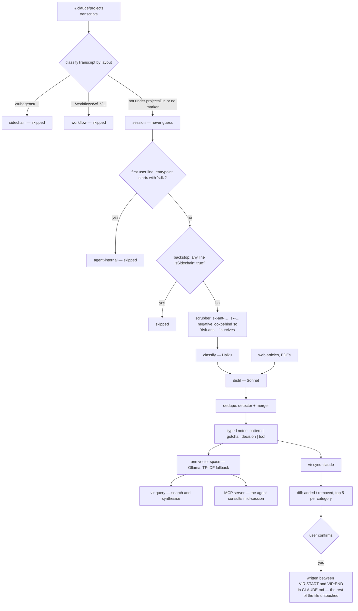

## 1. Executive Summary

vir reads Claude Code transcripts, filters them, and writes typed markdown notes
— patterns, gotchas, decisions, tools — into an Obsidian vault beside your own
notes. "There is no server, no account, no export step. Uninstall vir tomorrow
and the vault stays yours."

**The observation worth the report is in the README's second section:**

> "**243 transcripts, about 20 mine.** Of the 243 transcripts on my machine,
> about 20 were sessions I actually drove. The rest were subagent runs, workflow
> phases, and headless SDK agents. Vir detects all three kinds and skips them by
> default. The vault holds your work, not your tooling's."

Roughly 8%. Every system in this atlas that mines an agent's own transcripts is
ingesting the other 92% unless it does something about it — and the memory that
results is largely the tooling describing its own scaffolding back to itself.

**And the detection is three independent mechanisms, each with its reasoning
written down.**

**Layout.** `classifyTranscript` reads the on-disk shape — a bare
`<session-id>.jsonl` is a session, `<sid>/subagents/agent-*.jsonl` is a
sidechain, `<sid>/subagents/workflows/wf_*/agent-*.jsonl` is a workflow — with
two guards:

> "The `subagents` marker must sit BELOW the encoded project dir — a project
> literally named 'subagents' stays a session. Anything not under projectsDir is
> a session: **never guess**."

**Entrypoint**, with a named trap and two rejected alternatives:

> "The first `type:"user"` line's `entrypoint` starting with 'sdk' marks an
> agent-internal transcript… Keyed on entrypoint ONLY — `promptSource` reads
> 'sdk' even on desktop-launched human sessions (**the C23 serbeval trap**), and
> turn count would kill single-prompt autonomous runs."

**Content**, as an explicit backstop — lines carrying `isSidechain: true` — with
a test file whose describe block names it "sidechain detection (backstop for the
transcript filter)".

Three detectors, a false-positive guard on each, a documented incident, two
alternative signals rejected with the reason, and a fail-safe default that
classifies as *session* when uncertain — because the cost of wrongly skipping
your own work is higher than the cost of ingesting one extra agent run.

**The second contribution is a reason to do any of this at all:**

> "**354 sessions.** Claude Code prunes transcripts after about 30 days. 354 of
> my sessions now exist nowhere except this vault."

## 2. Mental Model

Transcripts on disk are filtered for provenance, scrubbed for secrets, classified
cheaply, distilled expensively, deduplicated, and written as typed notes into a
vault the user owns. A separate command offers the best of them back to
`CLAUDE.md`.

## 3. Architecture

`src/pipeline/` is the engine and it is unusually well factored — `scanner`,
`projects`, `parser`, `filter`, `toolCallFilter`, `scrubber`, `summarizer`,
`distiller`, `articleReader`, `articleDistiller`, `pdfReader`, `pdfDistiller`,
`composer`, `writer`, `relatedLinks`, `periodSummary`, `embeddingSweep`, `lock`,
`slug`, `run`. Nearly every module has a sibling `.test.ts`.

Beside it: `src/dedupe/` (detector and merger), `src/search/`, `src/state/`,
`src/mcp/`, `src/daemon/`, `src/cost/`, `src/lint/`, `src/diagnostics/`,
`src/claude/updater.ts`, `src/ui/`.

A `cost/` module for a two-model pipeline (Haiku to classify, Sonnet to distil)
is the right instinct: the cheap model triages, the expensive one only sees what
survived, and the bill is tracked.

46 test files, including four named for specific `run` behaviours —
`run.preflightProbe`, `run.projectFilter`, `run.retryBound`,
`run.rewriteDryRun`, `run.transcriptFilter`.

## 4. Essential Implementation Paths

**Categorise** — `src/pipeline/projects.ts` (the layout comment `:78-86`,
`classifyTranscript` `:88-103`, the SDK-entrypoint rule and the C23 trap
`:105-`).

**Backstop** — `src/pipeline/parser.ts`, `src/pipeline/parser.test.ts`
(`:123-150`).

**Scrub** — `src/pipeline/scrubber.ts` (the lookbehind rationale `:6-17`).

**Distil** — `src/pipeline/summarizer.ts`, `distiller.ts`, `composer.ts`,
`writer.ts`.

**Offer back** — `src/claude/updater.ts` (`VIR_START` / `VIR_END` `:8-9`,
`TOP_N_PER_CATEGORY` `:10`, `DiffResult` `:20-`).

## 5. Memory Data Model

A note is a markdown file with a category (`pattern`, `gotcha`, `decision`,
`tool`), a topic, a slug, a `confidence` float and a `startedAt`. The vault is
the store; a state database tracks what has been processed.

There is no status field, no supersession pointer and no tombstone. Correction is
editing or deleting a file, and the dedupe module merges rather than supersedes.
`confidence` is used for selection — the top five per category are what
`sync-claude` offers — not for withholding.

## 6. Retrieval Mechanics

One vector space over sessions, clipped web articles and PDFs, with Ollama
embeddings and a TF-IDF fallback so the system works with no model server. `vir
query` searches and synthesises; an MCP server exposes the same vault to Claude
Code mid-session "so the agent consults past decisions instead of rediscovering
them".

Three things happen between the raw score and the page. A note carrying
`verified: true` takes a `VERIFIED_BOOST` of 0.2 — applied before the top-K slice
in both the embedding and TF-IDF paths, which is the ordering that lets the boost
actually change what is returned. The pool is then MMR-reranked so the page
covers different facets of the query rather than five near-duplicates, with the
user-facing `retrievalDiversity` config inverted at the call site because the
knob reads as "how much diversity" and MMR's lambda is the relevance weight. And
three directories never enter the walk at all: `summaries`, `archived`, and
`.rejected`.

Two refusals are reported rather than swallowed, which is the habit worth
copying. `degraded` distinguishes *the embedder failed* from *every cosine fell
below the floor* — a clean miss and a broken model server look identical in a
result set and mean opposite things. And `excludedMismatched` counts rows refused
because their stored vector came from a different embedding model than the active
one, so an unfinished re-embed is visible instead of quietly shrinking the
corpus.

Retrieval is logged. `~/.vir/queries.jsonl` records the query, the type filter,
the hits with their ranks and per-hit verified status, the search method and the
latency, for both the CLI and the MCP path, and `vir queries` reads it back. It
rotates at five megabytes into a single `.1` generation, and when an append fails
it writes a `queries.failed` marker — because *"a silent best-effort is a blind
spot"* and a stderr line scrolls away. It is a record of what was asked, not of
what changed, so it is the retrieval half of the audit pattern and earns no mark.

Scope is the vault. Transcript *categorisation* is not scoping — it decides what
enters the store, not who may read it — so `scope_enforced` is not earned.

## 7. Write Mechanics

Filter, scrub, classify, distil, dedupe, write.

**The scrubber is designed against its own false positives**, with the
counterexamples in the comments: the Anthropic-key pattern carries a negative
lookbehind because "a real key is preceded by whitespace/quote/=/start, never by
`[A-Za-z0-9-]`" so `"risk-ant-…"` is not redacted, and the OpenAI pattern has the
same guard so `"risk-management-strategy-2026-plan"` survives. A redaction rule
that names the innocent string it must not eat is a rule someone tested against
real notes.

**`sync-claude` writes into a file it does not own, correctly.** vir's content
goes between `<!-- VIR:START -->` and `<!-- VIR:END -->`, only the top five per
category, and only after showing a diff of what would be added and removed and
getting confirmation. Everything outside the markers is untouched.

## 8. Agent Integration

`npm install -g @djolex999/vir-cli`, `vir init` (a wizard for provider, models
and vault path), `vir run` for one pass, `vir schedule install` for a daemon.
Plus `vir query`, `vir sync-claude`, an MCP server, and lint and diagnostics
subcommands.

The retroactive framing is the selling point and it is honest about its window:
existing history becomes notes in one run, and the transcripts it reads are the
ones not yet pruned.

## 9. Reliability, Safety, and Trust

**Two marks, and they are the same mechanism seen from either end.** `vir review`
walks the new notes and takes approve, edit or reject; `sync-claude` shows a diff
of the additions and removals and waits before anything enters the agent's
standing instructions. Combined with the marker delimiters, the second is the
most careful implementation in this atlas of writing into a file the user owns.

**Trust state is earned on the rejection, not on the approval.** A rejected note
is stamped `rejected_at` and moved into `.rejected/`, which the retriever's
`SKIP_DIRS` excludes — so a person's *no* removes the note from every search
while leaving the file on disk to be recovered by hand. Approval is the softer
half: `verified: true` buys a 0.2 score boost by default and becomes a hard
filter only when a caller passes `verified_only`. The durable record is the
frontmatter field and the exclusion is carried by where the file sits; one
function writes both.

**Tombstone — withheld, and the gap is one lookup wide.** The rejection is
durable, dated and keyed to the note, and nothing on the write path consults
`.rejected/`. Re-run the pipeline over the same transcript and the same note is
distilled again and written back into its category directory, with the earlier
`rejected_at` sitting in a file the writer never reads. The state the mechanism
would need is already on disk.

**Bitemporal, audit log, scope, negative eval — no.** `confidence` selects at
write time and is consulted by no read.

**The transcript filter is the safety mechanism**, and its default direction is
right: anything not clearly agent-internal is treated as a session, because a
missed sidechain costs one noisy note and a wrongly-skipped session costs work
that may exist nowhere else.

**The unaddressed risk is what distillation does.** Two LLM passes stand between
a transcript and a note, and nothing committed measures whether the note is
faithful to the session. A gotcha the model paraphrases into a general rule, or a
decision it records without its rationale, becomes a permanent vault entry that
outlives the transcript it came from — which is precisely the situation the
project exists to create.

## 10. Tests, Evals, and Benchmarks

**No paper, no benchmark, no committed results.** 46 test files, nearly one per
pipeline module, and the ones named for `run` behaviours are the interesting set:
`run.preflightProbe`, `run.projectFilter`, `run.retryBound`,
`run.rewriteDryRun`, `run.transcriptFilter`.

`run.rewriteDryRun` and `run.retryBound` are the two most systems lack — a dry
run for a destructive rewrite, and a bounded retry, each with a test named after
it.

The parser test describes itself as a "backstop for the transcript filter",
which is the right way to label a defence-in-depth check: it says what the test
is *for* relative to the other mechanism, so a reader knows removing one leaves
the other.

Nothing evaluates distillation quality, which is the pipeline's central
transformation.

**I ran nothing.**

## 11. For Your Own Build

### Steal

- **Work out how much of your transcript history is actually the user's.** If
  you mine an agent's own logs, subagent runs, workflow phases and headless SDK
  sessions are in there, and on one real machine they were 92% of the files.
  Ingesting them fills memory with your tooling describing itself.
- **Detect provenance three ways and let them back each other up.** Directory
  layout, a launch-signature field, and a per-line flag as a backstop — with the
  test that covers the backstop saying so in its name.
- **Guard each detector against its obvious false positive.** "A project
  literally named `subagents` stays a session." "Anything not under projectsDir
  is a session: never guess."
- **Write down the signals you rejected and why.** `promptSource` reads "sdk"
  even for desktop-launched human sessions; turn count would kill single-prompt
  autonomous runs. Both are the signals a reader would reach for first.
- **Default to keeping when uncertain**, when the asymmetry runs that way: a
  missed skip costs a noisy note, a missed session costs work that exists
  nowhere else.
- **Put the innocent string in the redaction comment.** `"risk-ant-…"` must not
  redact, `"risk-management-strategy-2026-plan"` must survive — a negative
  lookbehind with its counterexample named.
- **Delimit your content in a file you do not own.** `VIR:START` / `VIR:END`, a
  diff of additions *and* removals, and confirmation before writing.
- **Triage with the cheap model and distil with the expensive one**, and track
  the cost of both.
- **Name a test after the behaviour it protects.** `run.rewriteDryRun`,
  `run.retryBound`, `run.transcriptFilter`.
- **Ship a fallback embedder.** TF-IDF when Ollama is absent means the tool works
  before the user has set anything up.

### Avoid

- **Do not leave the distillation unmeasured.** Two LLM passes produce every note
  in the vault, and the vault outlives the transcripts, so an unfaithful
  distillation is permanent and unfalsifiable once the source is pruned.
- **Do not let `confidence` only select.** It picks the top five for
  `sync-claude` and does nothing at query time, so a low-confidence note is
  retrieved like any other.

### Fit

The right choice if you use Claude Code daily, keep an Obsidian vault, and want
the last month of sessions to survive their pruning window as searchable notes.
The retroactive first run is the moment of value and the daemon keeps it current.

Read `src/pipeline/projects.ts` even if you build something else. Deciding which
of your own logs are actually yours is a problem every transcript-mining memory
system has, and this is the only careful treatment of it in the atlas.

## 12. Open Questions

- **How faithful are the distilled notes?** No evaluation is committed.
- **What was the C23 serbeval trap?** Named in a comment as the reason for
  keying on `entrypoint` alone; the incident is not written up.
- **Does `confidence` reach the query path?** It selects for `sync-claude`; no
  retrieval use was found.
- **What happens to a note whose source transcript is later pruned?** The note
  outlives it by design; nothing records that the source is gone.

## Appendix: File Index

**Provenance** — `src/pipeline/projects.ts` (the on-disk shapes and the
never-guess rule `:78-86`, `classifyTranscript` `:88-103`, the SDK-entrypoint
signature and the C23 trap `:105-`), `src/pipeline/parser.ts`,
`src/pipeline/parser.test.ts` (the backstop describe block `:123-150`),
`src/pipeline/filter.ts`, `src/pipeline/toolCallFilter.ts`

**Redaction** — `src/pipeline/scrubber.ts` (the Anthropic-key lookbehind and its
counterexample `:6-13`, the OpenAI pattern `:14-17`), `scrubber.test.ts`

**Distillation** — `src/pipeline/summarizer.ts`, `distiller.ts`,
`articleDistiller.ts`, `pdfDistiller.ts`, `composer.ts`, `writer.ts`,
`relatedLinks.ts`, `periodSummary.ts`, `src/dedupe/{detector,merger}.ts`

**Instruction sync** — `src/claude/updater.ts` (`VIR_START`/`VIR_END` `:8-9`,
`TOP_N_PER_CATEGORY` `:10`, `Entry` `:12-18`, `DiffResult` `:20-`)

**Run behaviours** — `src/pipeline/run.ts`, `run.preflightProbe.test.ts`,
`run.projectFilter.test.ts`, `run.retryBound.test.ts`,
`run.rewriteDryRun.test.ts`, `run.transcriptFilter.test.ts`,
`src/pipeline/lock.ts`

**Surfaces** — `src/cli.ts`, `src/mcp/`, `src/daemon/`, `src/cost/`,
`src/search/`, `src/state/`, `src/lint/`, `src/diagnostics/`

## History

**2026-09-10** — [`ab867c022d90fa73d19dbf999ce22089653b9c2e`](https://github.com/djolex999/vir/commit/ab867c022d90fa73d19dbf999ce22089653b9c2e) — read again, 75 commits past the previous pin. `trust_state` is earned where it was not: `vir review` takes approve, edit or reject per note, a rejection stamps `rejected_at` and moves the file into `.rejected/`, and the retriever's `SKIP_DIRS` excludes that directory — so a person's refusal removes a note from every search while leaving it recoverable on disk. Approval stamps `verified: true`, which buys a 0.2 score boost applied before the top-K slice and becomes a hard filter under the MCP tool's `verified_only`. `tombstone` is withheld on a single missing lookup: nothing on the write path reads `.rejected/`, so re-running the pipeline over the same transcript re-derives the note. Retrieval gained MMR reranking, an `excludedMismatched` count for rows whose stored vector came from a superseded embedding model, a `degraded` flag separating an embedder failure from a clean miss, and a rotating query log with a failure marker. The absence claims were re-run and hold: no paper, no benchmark — the project has made that a stated position rather than an omission — no committed evaluation of distillation faithfulness, and `confidence` is still consulted by no read path. Test files went from 46 to 50. Screened before reading: no auto-run surface, three dependency manifests inside the seven-day cooldown, one build-time execution path and two unpinned surfaces; nothing was installed or run.

**2026-08-09** — [`49451ee8edf3747f81df6548411f0439c4378c6c`](https://github.com/djolex999/vir/commit/49451ee8edf3747f81df6548411f0439c4378c6c) — first reading. Screened before reading; the tree was read, never installed, and no pass was run. The 243-and-20 figures are the author's, reported from one machine.
