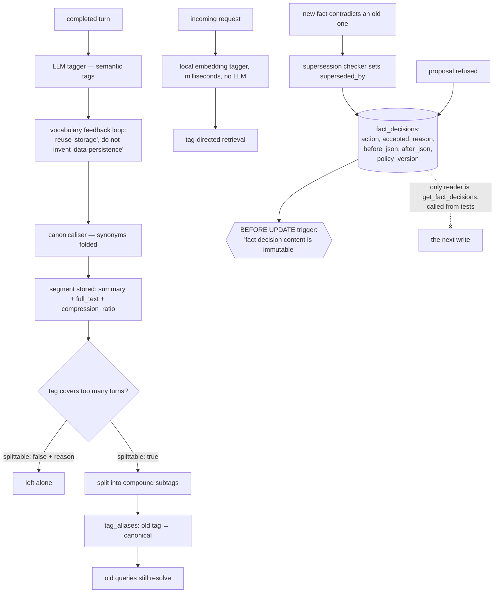

## 1. Executive Summary

virtual-context frames itself as operating-system virtual memory for an LLM:
"Your agent addresses a 20M-token window; the model sees 60K of curated
signal." AGPL-3.0-or-later at version 0.3.7, deployed as a proxy in front of the
provider API so no client changes are needed. It is 306,547 lines of Python, of
which 137,619 are the package and **151,627 are the test tree** — 406 test files,
a suite larger than the package it covers, which is the reason several of the
mechanisms below can be described exactly.

**It is in scope for this atlas, and the check is worth stating** because the
framing invites the opposite conclusion. A system that only decides which
messages stay in the current window is context management, not memory. Here
segments are rows in SQLite keyed on `conversation_id`, tag summaries persist,
and the README's claim is explicit: facts "persist across the whole conversation
and across sessions, platforms, and models". Something survives the session with
an identity, so it qualifies.

**Two mechanisms are worth the report. The first is the tag vocabulary, and
specifically what happens when it goes wrong.**

Tags are not a fixed taxonomy. An LLM tagger reads each completed turn and
generates semantic tags, with a vocabulary feedback loop that "makes it reuse
`storage` instead of inventing `data-persistence`", a canonicaliser that catches
synonyms, and — the part nothing else here has — **a splitter**.

`core/tag_splitter.py` sends an overly-broad tag to the model with the count of
turns it covers and asks a structured question: do these turns cover two or more
distinct sub-topics? If no, `{"splittable": false, "reason": "..."}`. If yes,
group them and mint compound subtags.

And then the reorganisation does not break existing retrieval, because
`tag_aliases` maps `(alias, conversation_id) → canonical`. A query that used the
old broad tag still resolves after the split.

That is a real and rare property: **a vocabulary that can reorganise itself
without invalidating what was written against the old shape.** Every system in
this atlas that lets a model invent tags eventually accumulates
`data-persistence`, `persistence`, `storage` and `db` as four names for one
thing. This one converges them, and when convergence produces a tag that is too
coarse, it splits it and keeps the old name working.

The local embedding tagger running on the request path "so retrieval never waits
on a model" is the companion detail. The expensive tagger runs after the
response; the cheap one runs before it.

**The second mechanism is a ledger of decisions, and it is the strongest thing
here.** Facts are their own tier rather than an implication of segments: a `facts` table with
subject, verb, object, a temporal status, typed `fact_links`, per-conversation
`fact_embeddings` and an author actor. Every mutation of one goes through
`fact_mutations.py`, and every mutation writes a `fact_decisions` row in the same
transaction: the action, an `accepted` flag, a `reason`, `observed_at`,
`event_date`, a `policy_version`, and `proposal_json`, `before_json` and
`after_json`. A **rejected** proposal is written with the same fidelity as an
accepted one.

The row is then made immutable in the database rather than by convention.
`_ensure_fact_decision_schema` installs a `BEFORE UPDATE` trigger — a plpgsql
function on Postgres, a `RAISE(ABORT, 'fact decision content is immutable')` on
SQLite — that fires on any column but `conversation_id`, and the SQLite version
regenerates itself when the column set changes, under a comment naming the bug it
prevents: a guard created before an additive migration enumerates only the columns
that existed then. An append-only log whose append-onlyness is a schema object,
not a code path, is rare here.

Its limit is on the read side, and it is one query wide. `get_fact_decisions` is
the only reader, and outside the composite-store delegation every caller of it is
a test. So the rejects are kept perfectly and consulted never: a fact the pipeline
refused once can be proposed again, refused again, and logged again, with the
record of the first refusal sitting in the same table the second refusal is
written to. That is why this earns `audit_log` and not `tombstone` — the
distinction the atlas draws between the two is exactly this query.

## 2. Mental Model

A **segment** is a compacted span of turns carrying both a `summary` and the
`full_text`, with a `compression_ratio` and the `compaction_model` that produced
it recorded on the row. Keeping both representations plus the ratio means the
compaction is auditable — a reader can see what was thrown away and by which
model.

Segments carry a `primary_tag` and a set in `segment_tags`. Each tag accumulates
a `tag_summaries` row with `covers_through_turn`, `source_segment_refs` and
`source_turn_numbers` — so a per-tag summary knows exactly which material it
covers and where it stops.

The two paths into retrieval are the design: the expensive tagger runs after the
response, the cheap one before it, and the vocabulary they share is the same.

## 3. Architecture

A proxy (`virtual_context/proxy/`) sitting between the client and the provider,
so an existing agent gains the behaviour without code changes. Beside it an MCP
server, a CLI, a TUI, an OpenClaw integration and import adapters.

Storage is a relational backend — SQLite or Postgres, the latter with pgvector —
holding `segments`, `segment_tags`, `tag_aliases`, `tag_summaries`,
`engine_state`, `conversation_lifecycle`, `cost_log`, and the fact and identity
tiers:
`facts` with `fact_tags`, `fact_links` and `fact_embeddings`; `canonical_turns`
with `canonical_message_sources` and `speaker_handles`; and the actor-card tables
below. Neo4j and FalkorDB back the fact-link graph, a filesystem backend exists,
and Redis holds session state and conversation tombstones.

**There are three scope axes, and they are predicates rather than
partitions.** `tenant_id` sits above `conversation_id`, and
`audience_conversation_id` sits beside it to record who a turn was addressed to —
a public channel or a private DM. The SQLite backend alone carries 354
`conversation_id` predicates and 85 `tenant_id` predicates. `audience_proof.py`
goes further than a predicate: an audience can be *reassigned*, and doing so
writes a receipt carrying an `operation_id`, a `manifest_digest`, a
`source_fingerprint`, the `turn_hash` and an attribution version, after which
`effective_attested_audience` refuses to serve the row unless the user and
assistant halves of the pair both produce matching receipts and the live
`canonical_turns` row agrees with them. A scope change that cannot be proved is a
`CanonicalSourceConflict`, not a silent widening.

**An actor card is the third memory unit.** `actor_profiles` and
`actor_card_entries` hold kind-checked claims about a person — the `kind`,
`sensitivity` and `audience_scope` columns each carry a `CHECK` against an
enumerated list — with `superseded_by`, a `confidence` float, and
`actor_card_entry_sources` naming the exact `fact_id`s a claim rests on plus the
owner and audience conversations those facts came from. A card is rebuilt rather
than edited: `card_dirty` is set by database triggers when a cited canonical turn
changes, and `compaction_pipeline` pulls due rebuilds into its candidate set.

The Redis tombstone deserves a note because it is not a memory mechanism and a
grepping reader will find it first. `proxy/handlers.py:2546` describes "eviction
+ tombstone clearance, never row deletion": a deleted conversation gets a Redis
tombstone with a 24-hour TTL and a version of `2**53` so a stale write cannot
resurrect it, and `undelete` clears it. That is a distributed-systems fencing
token, not a rejected-value record, and this report does not count it.

`engine_state` persisting `compacted_prefix_messages`, `turn_count` and
`turn_tag_entries` per conversation is what lets the proxy be restarted without
losing where it was in a long conversation.

## 4. Essential Implementation Paths

**Ingest** — `ingest/` → `core/tagging_pipeline.py` → `core/tag_generator.py`
(LLM) with the vocabulary feedback loop → `core/llm_utils.normalize_tag` →
storage.

**Split** — `core/tag_splitter.py`, prompting with the tag, its turn count out
of the total, and the turn list, and requiring a structured verdict with a
reason on the negative case.

**Retrieve** — the local embedding tagger on the request path →
`core/semantic_search.py` → tag-directed segment selection under a token budget.

**Supersede** — `ingest/supersession.py`, a "fact supersession checker: detect
and mark contradicted facts", with a stopword list tuned to the domain and a
`RelationType`/`FactLink` model.

**Compact** — segments compacted under budget pressure, with the ratio and the
model recorded.

## 5. Memory Data Model

`segments` keeps `summary` *and* `full_text` — a design choice with a real cost
in storage and a real benefit: compaction is reversible and inspectable, and
`compression_ratio` plus `compaction_model` on the row means a bad compaction
model is identifiable after the fact.

`tag_summaries` is the more unusual table. It holds a rolling per-tag summary
with `covers_through_turn`, `source_segment_refs`, `source_turn_numbers` and
`generated_by_turn_id` — so a summary is not an opaque blob but a claim about a
specific, enumerated set of turns, with a watermark. Incremental summarisation
that records its own coverage boundary is how you avoid re-summarising or
double-counting, and very few systems here do it.

`cost_log` records input and output tokens per event with the provider and
model. A memory layer that meters its own spend is well placed to answer whether
it is worth running, and the README's benchmark uses exactly this to report cost
per question.

Every table carries `conversation_id`, including `tag_aliases` — so the
vocabulary is per-conversation, and two conversations can canonicalise the same
synonym differently. That is the right scope for a vocabulary learned from
context.

**`actor_card_entries` is the only table here with a validity window, and it is a
real one.** `valid_from` and `expires_at` sit beside `created_at` and
`updated_at`, and the read path filters on them:
`sqlite.py:14179` drops every row that fails
`actor_card_is_active(valid_from, expires_at, now=now)`, whose clock is injected
rather than read from the wall. Start is inclusive and end exclusive; a malformed
window hides the row rather than serving it; and a second predicate,
`actor_card_is_unexpired`, exists to *retain* a future-dated entry that must not
be served yet — its docstring says so: *"Keep valid future entries available for
carryover without serving them."* Two axes, stored apart, and the validity one
decides retrieval. That earns `bitemporal`.

Its limit is scope: `actor_card_policy` permits the window on one card kind only,
`communication_pref`, and requires an `expires_at` whenever `valid_from` is set.
Every other kind of claim about a person is timeless.

**The `facts` table has the columns for the same thing and does not keep them
apart.** A fact carries `when_date` — when the thing happened — beside
`mentioned_at` and `session_date`, which are when it was said. But the writer
coalesces at the point of the write: `compactor.py:2242` stores
`when_date = _str(f.get("when", "")) or (segment.session_date or "")`, so a fact
whose extraction produced no date gets the record time written into the validity
column. The separation is lost in the store rather than in the query, and no
later reader can tell a fact that happened on the session date from one whose
date was never known. The temporal window filter reproduces the same coalesce —
`self._parse_fact_date(fact.when_date or fact.session_date)` — which is the
correct thing to do given what is stored, and is why the fact tier does not carry
the mark the card tier does.

## 6. Retrieval Mechanics

Tag-directed rather than similarity-first. The local embedding tagger assigns
tags to the incoming request in milliseconds, those tags select segments and tag
summaries, and the working set is assembled under a token budget with cold
topics collapsing to their summaries under pressure and the model able to expand
them through tools when it needs detail.

**`scope_enforced` is earned three times over and none of it is partitioning.**
`tenant_id`, `conversation_id` and `audience_conversation_id` are columns on
shared tables and appear as `WHERE` predicates on the read paths; the audience
axis additionally has to be *proved* against a receipt before a reassigned row is
served. 
**A temporal mode sits beside the tag-directed one.** `remember_when` resolves a
date range from a natural-language time expression, filters both segments and
facts into it, and — in its state modes — anchors on a target date, emitting
`date_distance_days`, `as_of_target` and `state_anchor` on each result. The
anchoring is a ranking rather than a cut-off: a candidate after the target date
still competes, it just scores worse. The window itself is a hard filter.

## 7. Write Mechanics

Tagging happens after the response, so the agent does not wait for it. Compaction
happens under budget pressure. Supersession runs at ingest.

Correction is `ingest/supersession.py` marking a contradicted fact, with typed
links between facts, and `_set_fact_superseded` writing `superseded_by` under the
fact-owner locks. Every read path appends `superseded_by IS NULL`.

**The rejected-value record exists and is not consulted.** `fact_decisions`
keeps the refusal — the proposal, the reason, the policy version, the before and
after — and nothing queries it before the next write. `reason` values in the
tests include `stale_proposal`, which names what the flag is for: the ledger
records *why the pipeline declined*, for a reader, not for the pipeline. So the
same claim can still arrive again and be refused again, and the atlas's
`tombstone` test — a rejected value, keyed on the value, consulted on a later
write — fails on the third clause only.

**There is no trust state.** `facts.status` looks like one and is not:
`TemporalStatus` is `active | completed | ceased | planned | abandoned |
recurring`, and its own docstring says what it is measuring — *"A concluded
action and a stopped state are opposite answers to 'is this still happening'"*.
That is the validity of the thing described, not the credibility of the claim,
and the atlas does not count it. `actor_card_entries.confidence` is a float that
nothing filters on. The one discrete verdict in the system is `accepted` on a
decision, which is a verdict about the write rather than about the fact.

**And there is no human review surface for memory.** The staging-and-approval
flow in `core/engagement/` gates outbound Discord posts, not what is remembered.

The interesting failure surface is the vocabulary itself. Splitting a tag is an
LLM judgement; canonicalising a synonym is an LLM judgement; whether two turns
are "distinct sub-topics" is an LLM judgement. The aliases mean a wrong split
does not break retrieval — the old tag still resolves — which is a real safety
property, and it means a wrong split is also *invisible*, because nothing
degrades loudly.

## 8. Agent Integration

The proxy is the integration, and it is the strongest argument for the design:
an existing agent gets a 20M-token virtual window by changing a base URL. An MCP
server, a CLI, a TUI, presets (including a coding preset with its own patterns)
and import adapters sit alongside.

## 9. Reliability, Safety, and Trust

**Scope — awarded on three axes**, per section 6.

**Audit log — awarded, on a mutation log.** `fact_decisions` records
every accept and every reject of a fact mutation with the before, the after, the
proposal and the reason, in the same transaction as the mutation, in a table a
`BEFORE UPDATE` trigger refuses to let anything edit. `merge_audit` covers
conversation merges and `audience_reassignments` covers scope changes, each with
an `operation_id`. Beside them `cost_log` remains an append-only per-event spend
record and `tag_summaries` carries the provenance of every derived summary
(`source_segment_refs`, `source_turn_numbers`, `generated_by_turn_id`,
`covers_through_turn`). This is among the more complete audit surfaces in the
corpus, and the one thing it lacks is a reader.

**Bitemporal — awarded on actor cards only**, per section 5, with the fact tier's
coalesced `when_date` explaining why it stops there.

**Negative eval — awarded.**
`test_remember_when_requires_exact_audience_bound_summary_provenance` seeds two
segments, both matching the query and both inside the date window, one of them
carrying a private-DM audience, and asserts the result list is exactly
`["public"]`. The excluded material is present, retrievable and in range, so the
assertion cannot pass on an empty result.

**Trust state, tombstone, human review — no**, for the reasons in section 7. The
Redis conversation tombstone is a fencing token, as section 3 describes.

**The concentration of judgement is the risk.** Tag assignment, vocabulary
convergence, splitting, summarisation, supersession and actor-card curation are
all model calls, and the only committed *measurement* is end-to-end answer
accuracy. A vocabulary that converges wrongly, or a split that groups badly,
would show up as a small accuracy loss and nothing else — there is no
per-mechanism evaluation. The decision ledger closes part of this by
construction: for facts specifically, every judgement is recoverable afterwards
with its proposal and its reason, which is a different thing from being
measured but is the input a measurement would need.

## 10. Tests, Evals, and Benchmarks

**No paper**, and the most thoroughly reported benchmark section in this batch.

`benchmarks/` holds harnesses for LongMemEval, LoCoMo, BEAM, AMB, MRCR and a
`context_contracts` suite — in the tree, not in another repository — with a
judge, a baseline, a dataset loader, a cost module and an `autopsy_report.py`.

Beside them, 406 test files totalling 151,627 lines, which is where the
correctness argument actually lives. The shape worth naming is that the contract
tests assert on *storage invariants* rather than on outputs:
`test_storage_domain_contracts.py` asserts a decision written for one
conversation is invisible to another, `test_fact_lifecycle_contracts.py` asserts
the recorded `reason` on a refused proposal, and `test_fact_audit_upgrade.py`
asserts the ledger follows a conversation through a merge.

The published run is 100 questions from LongMemEval-500, and the reporting is
careful in the ways that matter: it names the sampling ("5 batches of 20, seeds
42/99/777/1234/2025"), names all three models by role (MiMo-V2-Flash for
ingestion, Claude Sonnet 4.5 as reader, Gemini 3 Pro Preview as judge), states
the baseline as the *same reader* with full history, and breaks accuracy down by
question type — 95/100 against 33/100, at 52,347 versus 117,582 tokens per
question and $0.16 versus $0.36.

Two caveats belong beside it, and one of them the project states itself. It
states that "a full LoCoMo run is not yet published; the figures above are
LongMemEval results" — an explicit note about which suite the numbers come from.
The one it does not state is that the run samples a fifth of the suite, and the
per-category counts (17 knowledge-update, 26 multi-session, 28
temporal-reasoning) are small enough that a category figure moves several points
per question.

**I ran nothing.**

## 11. For Your Own Build

### Steal

- **Give your tag vocabulary a feedback loop.** Showing the tagger what already
  exists, so it reuses `storage` rather than inventing `data-persistence`, is
  the difference between a vocabulary and a pile of near-synonyms.
- **Split a tag that grows too broad, and keep an alias.** The split is the
  obvious half; `tag_aliases` mapping the old name to the canonical one is what
  makes the reorganisation safe for everything already written.
- **Make the splitter answer a structured question with a reason on the
  negative.** `{"splittable": false, "reason": "..."}` means a no is
  inspectable, not just an absence.
- **Run a cheap tagger on the request path and the expensive one after the
  response.** Retrieval never waits on a model, and the two share a vocabulary.
- **Record the coverage boundary on a rolling summary.**
  `covers_through_turn` plus the enumerated source refs is how an incremental
  summary avoids re-summarising and double-counting.
- **Keep the summary and the full text, with the ratio and the model.** A bad
  compaction model is identifiable afterwards only if you wrote down which one
  ran.
- **Meter your own cost.** `cost_log` per event with provider and model is what
  turns "is this worth running" into a query.
- **Scope the vocabulary to the conversation.** Two conversations can reasonably
  canonicalise the same word differently.
- **Put the append-only in the schema, not the code.** A `BEFORE UPDATE` trigger
  that raises on any column but the one you expect to move makes the ledger
  append-only for every writer, including the one written next year, and it costs
  a few lines of DDL. Regenerate the trigger when the column set changes — the
  comment above the SQLite branch names the bug that a stale enumeration causes.
- **Log the reject with the same fields as the accept.** `proposal_json`,
  `before_json`, `after_json`, `reason` and `policy_version` on a refusal is what
  turns "the pipeline dropped it" into a question with an answer.
- **Make a scope change prove itself.** Reassigning an audience writes a receipt
  with an operation id and a source fingerprint, and the read refuses to serve a
  reassigned row whose receipt, pair and live row do not all agree.
- **Give a preference an expiry rather than a deletion.** `valid_from` and
  `expires_at` on a card entry, filtered at an injectable `now`, let a future
  preference exist without being served and a lapsed one stop being served
  without being lost.

### Avoid

- **Do not let every judgement be a model call with only end-to-end
  measurement.** Tagging, convergence, splitting, summarising and supersession
  are five model-driven mechanisms and one accuracy number; a regression in any
  of them looks the same.
- **Do not mistake the Redis conversation tombstone for a memory mechanism.**
  It is a fencing token with a TTL and a version, doing exactly the job it
  should.
- **Do not read a 100-question sample's per-category rates as stable.** Some
  categories carry seventeen questions.
- **Do not build a rejection ledger and then never query it.** Every refusal
  here is recorded with the reason and the proposal, and the only reader is a
  test helper — so a claim the pipeline has already declined is re-proposed,
  re-evaluated and re-declined, at the cost of the evaluation each time. One
  `SELECT` keyed on the proposed value would turn the log into a gate.
- **Do not coalesce validity time into record time at the write.** Storing
  `when_date = extracted_when or session_date` loses the distinction that made
  the column worth having; store the null, and coalesce in the query if you must.

### Fit

This suits someone who wants a long virtual context without changing their agent
— the proxy is the product, and the benchmark, sampling caveats aside, is the
most completely reported in this batch.

It is a governed memory in one direction and not the other. What was
done to a fact is recorded completely and immutably, with the tenant, the
conversation and the audience it belonged to and the receipt for any change to
that audience; what will be done to the next fact is decided without reference to
any of it. So this is a good shape for someone who has to answer *why is this in
the memory* after the fact, and still the wrong shape for someone who needs the
memory to refuse a claim it has already refused. There is no trust state and no
review surface. If what you need is a 20M-token window that costs less and
answers better, the evidence for that is in the tree.

## 12. Open Questions

- **How often does a split fire, and how often is it wrong?** The aliases make a
  bad split harmless to queries and invisible to everyone.
- **Does the vocabulary converge or oscillate?** A feedback loop that reuses
  existing tags and a splitter that mints new ones are opposing forces, and
  nothing reports the equilibrium.
- **Why is the decision ledger never read?** Every mechanism for consulting it
  exists — the rows, the reason, the index on `(conversation_id, observed_at,
  decision_id)` and a `get_fact_decisions` accessor on the store protocol — and
  no production caller uses it. Is a UI intended, or a gate?
- **Will the validity window spread beyond `communication_pref`?** The
  machinery is general and the policy admits one card kind.
- **What is the LoCoMo result?** The project says it is not yet published and the
  harness is committed.

## Appendix: File Index

**The vocabulary** — `virtual_context/core/tag_generator.py`,
`tag_splitter.py` (the prompt and the structured verdict `:12-30`),
`tagging_pipeline.py`, `llm_utils.py` (`normalize_tag`)

**Schema** — `virtual_context/storage/sqlite.py:116` (`segments`), `:133`
(`segment_tags`), `:140` (`tag_aliases`), `:147` (`cost_log`), `:157`
(`tag_summaries` with `covers_through_turn`), `:174` (`engine_state`), `:182`
(`conversation_lifecycle`), `:198` (`canonical_turns`), `:1824` (`facts`),
`:1867` (`fact_links`), `:1884` (`fact_embeddings`), `:2450`
(`actor_card_entries` with the three CHECKs and the validity window), `:2476`
(`actor_card_entry_sources`), `:2763` (`canonical_message_sources`)

**The decision ledger** — `virtual_context/storage/fact_mutations.py:112`
(`fact_decisions`), `:122-157` (the immutability trigger on both dialects),
`:256` (`_record_fact_decision`), `:293` (`_set_fact_superseded`), `:472`
(`get_fact_decisions`, the only reader)

**Scope and audience** — `virtual_context/storage/audience_reassignment.py`,
`audience_proof.py:14-64` (`effective_attested_audience`), `:67-88`
(`verify_source_replay_audience`)

**Actor cards** — `virtual_context/actor_card_validity.py`,
`virtual_context/core/community/actor_card_policy.py:120-121` (the one card kind
that may carry a window), `actor_card_curation.py`, `actor_card_rebuild.py`,
`virtual_context/storage/actor_card_transition_guards.py`

**Temporal retrieval** — `virtual_context/core/temporal_resolver.py:178`
(`remember_when`), `:1155-1157` (the window filter on `when_date or
session_date`), `:2321` (`_select_state_candidates`), `:905` (`as_of_target`)

**Retrieval** — `virtual_context/core/semantic_search.py`,
`temporal_resolver.py`, `virtual_context/engine.py`,
`virtual_context/token_counter.py`

**Correction** — `virtual_context/ingest/supersession.py`

**Proxy and session state** — `virtual_context/proxy/handlers.py:2540-2660`
(eviction, the Redis tombstone and `undelete`),
`virtual_context/conversation_identity.py`

**Integration** — `virtual_context/mcp/`, `virtual_context/cli/`,
`virtual_context/tui/`, `virtual_context/openclaw/`,
`virtual_context/import_adapters/`, `virtual_context/presets/`

**Benchmarks** — `benchmarks/longmemeval/` (`judge.py`, `baseline.py`,
`dataset.py`, `cost.py`, `autopsy_report.py`), `benchmarks/locomo/`,
`benchmarks/beam/`, `benchmarks/amb/`, `benchmarks/mrcr/`,
`docs/benchmarks.md`

## Appendix: Recorded Searches

Run from the root of the checkout at the pinned commit.

| Claim | Command | Result at this pin |
| --- | --- | --- |
| Scope is predicates, not partitions | `grep -c "conversation_id = ?\|conversation_id={p}" virtual_context/storage/sqlite.py` and the same for `tenant_id` | 354 and 85 |
| Nothing consults the decision ledger before a write | `grep -rn "FROM fact_decisions" virtual_context` then `grep -rn "get_fact_decisions" . \| grep -v tests/` | One SELECT, in `get_fact_decisions`; outside `tests/` the only callers are the protocol declaration and the composite-store delegation |
| No epistemic status on a fact | `sed -n '/class TemporalStatus/,/RECURRING/p' virtual_context/types.py` | Six values, all answering *is this still happening* |
| Validity time is queried on cards | `grep -rn "actor_card_is_active\|actor_card_is_unexpired" virtual_context/storage` | Read-path filters in both the SQLite and Postgres backends |
| Validity time is collapsed on facts | `grep -n "when_date=" virtual_context/core/compactor.py` | `:2242` writes `_str(f.get("when","")) or (segment.session_date or "")` |
| Only one card kind may carry a window | `grep -n "valid_from" virtual_context/core/community/actor_card_policy.py` | `:120-121`, `communication_pref` only |
| No human review of memory | `grep -rniE "needs_review\|pending_review\|awaiting" --include="*.py" virtual_context` | Hits only in `core/engagement/`, which stages outbound Discord posts |
| Tree size | `find . -name "*.py" -not -path "./.git/*" \| xargs wc -l \| tail -1` | 306,547 total; 137,619 under `virtual_context/`, 151,627 under `tests/` across 406 files |

## History

**2026-09-10** — [`65d2640e15547519f54bec0ddcfab4210c1dd06f`](https://github.com/virtual-context/virtual-context/commit/65d2640e15547519f54bec0ddcfab4210c1dd06f) — re-read. 291 files and 60,668 insertions past the previous pin, 21,357 of them inside the memory paths, and the report's central negative claims are the casualties. **Two marks added.** `audit_log` was awarded at the first reading on `cost_log` and summary provenance with the explicit caveat *"it is not a mutation log of the memory itself"* — it is one now: `fact_decisions` records every accept and reject of a fact mutation with the proposal, the before, the after, the reason and a policy version, in the same transaction as the mutation, under a `BEFORE UPDATE` trigger that raises `fact decision content is immutable`. `negative_eval` is added on `test_remember_when_requires_exact_audience_bound_summary_provenance`, which seeds a public and a private-DM segment as matching hits inside the same window and asserts the result is exactly `["public"]`. `bitemporal` is added on actor-card entries, whose `valid_from`/`expires_at` are filtered at an injectable `now` beside `created_at`/`updated_at` — and withheld from the fact tier, because `compactor.py:2242` writes the record time into the validity column when extraction produced no date, collapsing the two axes at the write rather than in the query. `scope_enforced` holds and the sentence limiting it — *"the boundary here is a conversation rather than a tenant"* — is stale: there is a `tenant_id` axis and an `audience_conversation_id` axis, the latter with reassignment receipts a read refuses to serve without. `tombstone` is still withheld and now for a sharper reason: the rejected value **is** recorded, and nothing reads it back. Two memory units were added since the first reading — a `facts` table with typed links and embeddings, and kind-checked actor cards citing the fact ids they rest on — and the tree grew from roughly 257,000 lines of Python to 306,547, of which the test tree is now larger than the package. Schema line numbers in the appendix were all stale and are re-pinned; recorded searches added, which the report shipped without. Screened before reading: two dependency manifests changed inside the seven-day cooldown, three pytest `conftest.py` files execute on collection; nothing was installed, built or run.

**2026-08-09** — [`6566ec7d6c43d95688b5bc870eb2ba78fbb6fb1d`](https://github.com/virtual-context/virtual-context/commit/6566ec7d6c43d95688b5bc870eb2ba78fbb6fb1d) — first reading. Screened before reading; the tree was read, never installed, and no benchmark was run.
