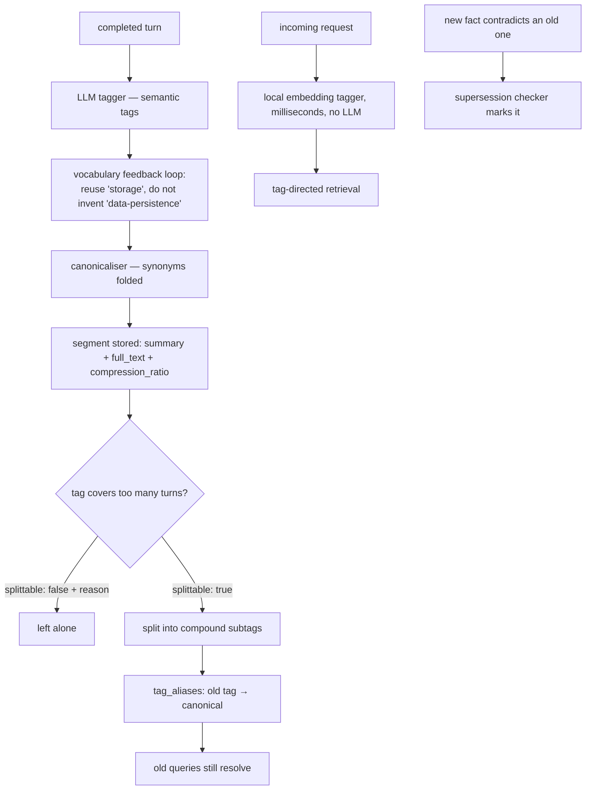

## 1. Executive Summary

virtual-context frames itself as operating-system virtual memory for an LLM:
"Your agent addresses a 20M-token window; the model sees 60K of curated
signal." AGPL-3.0 with a commercial-licence contact, roughly 257,000 lines of
Python, deployed as a proxy in front of the provider API so no client changes
are needed.

**It is in scope for this atlas, and the check is worth stating** because the
framing invites the opposite conclusion. A system that only decides which
messages stay in the current window is context management, not memory. Here
segments are rows in SQLite keyed on `conversation_id`, tag summaries persist,
and the README's claim is explicit: facts "persist across the whole conversation
and across sessions, platforms, and models". Something survives the session with
an identity, so it qualifies.

**The mechanism worth the report is the tag vocabulary, and specifically what
happens when it goes wrong.**

Tags are not a fixed taxonomy. An LLM tagger reads each completed turn and
generates semantic tags, with a vocabulary feedback loop that "makes it reuse
`storage` instead of inventing `data-persistence`", a canonicaliser that catches
synonyms, and — the part nothing else here has — **a splitter**.

`core/tag_splitter.py` sends an overly-broad tag to the model with the count of
turns it covers and asks a structured question: do these turns cover two or more
distinct sub-topics? If no, `{"splittable": false, "reason": "..."}`. If yes,
group them and mint compound subtags.

And then the reorganisation does not break existing retrieval, because
`tag_aliases` maps `(alias, conversation_id) → canonical`. A query that used the
old broad tag still resolves after the split.

That is a real and rare property: **a vocabulary that can reorganise itself
without invalidating what was written against the old shape.** Every system in
this atlas that lets a model invent tags eventually accumulates
`data-persistence`, `persistence`, `storage` and `db` as four names for one
thing. This one converges them, and when convergence produces a tag that is too
coarse, it splits it and keeps the old name working.

The second thing worth crediting is that the local embedding tagger runs on the
request path "so retrieval never waits on a model". The expensive tagger runs
after the response; the cheap one runs before it.

## 2. Mental Model

A **segment** is a compacted span of turns carrying both a `summary` and the
`full_text`, with a `compression_ratio` and the `compaction_model` that produced
it recorded on the row. Keeping both representations plus the ratio means the
compaction is auditable — a reader can see what was thrown away and by which
model.

Segments carry a `primary_tag` and a set in `segment_tags`. Each tag accumulates
a `tag_summaries` row with `covers_through_turn`, `source_segment_refs` and
`source_turn_numbers` — so a per-tag summary knows exactly which material it
covers and where it stops.

The two paths into retrieval are the design: the expensive tagger runs after the
response, the cheap one before it, and the vocabulary they share is the same.

## 3. Architecture

A proxy (`virtual_context/proxy/`) sitting between the client and the provider,
so an existing agent gains the behaviour without code changes. Beside it an MCP
server, a CLI, a TUI, an OpenClaw integration and import adapters.

Storage is SQLite — `segments`, `segment_tags`, `tag_aliases`, `tag_summaries`,
`engine_state`, `conversation_lifecycle` and a `cost_log` — with Redis holding
session state and conversation tombstones.

The Redis tombstone deserves a note because it is not a memory mechanism and a
grepping reader will find it first. `proxy/handlers.py:2546` describes "eviction
+ tombstone clearance, never row deletion": a deleted conversation gets a Redis
tombstone with a 24-hour TTL and a version of `2**53` so a stale write cannot
resurrect it, and `undelete` clears it. That is a distributed-systems fencing
token, not a rejected-value record, and this report does not count it.

`engine_state` persisting `compacted_prefix_messages`, `turn_count` and
`turn_tag_entries` per conversation is what lets the proxy be restarted without
losing where it was in a long conversation.

## 4. Essential Implementation Paths

**Ingest** — `ingest/` → `core/tagging_pipeline.py` → `core/tag_generator.py`
(LLM) with the vocabulary feedback loop → `core/llm_utils.normalize_tag` →
storage.

**Split** — `core/tag_splitter.py`, prompting with the tag, its turn count out
of the total, and the turn list, and requiring a structured verdict with a
reason on the negative case.

**Retrieve** — the local embedding tagger on the request path →
`core/semantic_search.py` → tag-directed segment selection under a token budget.

**Supersede** — `ingest/supersession.py`, a "fact supersession checker: detect
and mark contradicted facts", with a stopword list tuned to the domain and a
`RelationType`/`FactLink` model.

**Compact** — segments compacted under budget pressure, with the ratio and the
model recorded.

## 5. Memory Data Model

`segments` keeps `summary` *and* `full_text` — a design choice with a real cost
in storage and a real benefit: compaction is reversible and inspectable, and
`compression_ratio` plus `compaction_model` on the row means a bad compaction
model is identifiable after the fact.

`tag_summaries` is the more unusual table. It holds a rolling per-tag summary
with `covers_through_turn`, `source_segment_refs`, `source_turn_numbers` and
`generated_by_turn_id` — so a summary is not an opaque blob but a claim about a
specific, enumerated set of turns, with a watermark. Incremental summarisation
that records its own coverage boundary is how you avoid re-summarising or
double-counting, and very few systems here do it.

`cost_log` records input and output tokens per event with the provider and
model. A memory layer that meters its own spend is well placed to answer whether
it is worth running, and the README's benchmark uses exactly this to report cost
per question.

Every table carries `conversation_id`, including `tag_aliases` — so the
vocabulary is per-conversation, and two conversations can canonicalise the same
synonym differently. That is the right scope for a vocabulary learned from
context.

## 6. Retrieval Mechanics

Tag-directed rather than similarity-first. The local embedding tagger assigns
tags to the incoming request in milliseconds, those tags select segments and tag
summaries, and the working set is assembled under a token budget with cold
topics collapsing to their summaries under pressure and the model able to expand
them through tools when it needs detail.

`conversation_id` is on every table and in every query path, which earns
`scope_enforced`; the boundary here is a conversation rather than a tenant, and
the design does not claim otherwise.

## 7. Write Mechanics

Tagging happens after the response, so the agent does not wait for it. Compaction
happens under budget pressure. Supersession runs at ingest.

Correction is `ingest/supersession.py` marking a contradicted fact, with typed
links between facts. There is no rejected-value record, no trust state and no
review surface — a superseded fact is marked, and the same claim can arrive
again.

The interesting failure surface is the vocabulary itself. Splitting a tag is an
LLM judgement; canonicalising a synonym is an LLM judgement; whether two turns
are "distinct sub-topics" is an LLM judgement. The aliases mean a wrong split
does not break retrieval — the old tag still resolves — which is a real safety
property, and it means a wrong split is also *invisible*, because nothing
degrades loudly.

## 8. Agent Integration

The proxy is the integration, and it is the strongest argument for the design:
an existing agent gets a 20M-token virtual window by changing a base URL. An MCP
server, a CLI, a TUI, presets (including a coding preset with its own patterns)
and import adapters sit alongside.

## 9. Reliability, Safety, and Trust

**Scope — awarded**, per section 6.

**Audit log — awarded, with its shape stated.** `cost_log` is an append-only
per-event record of what was spent, and `tag_summaries` carries the provenance
of every derived summary (`source_segment_refs`, `source_turn_numbers`,
`generated_by_turn_id`, `covers_through_turn`). Between them a reader can
reconstruct what was derived from what and what it cost. It is not a mutation
log of the memory itself, and it is more than most systems here keep about their
own derivations.

**Trust state, tombstone, bitemporal, human review, negative eval — no.** The
Redis conversation tombstone is a fencing token, as section 3 describes.

**The concentration of judgement is the risk.** Tag assignment, vocabulary
convergence, splitting, summarisation and supersession are all model calls, and
the only committed measurement is end-to-end answer accuracy. A vocabulary that
converges wrongly, or a split that groups badly, would show up as a small
accuracy loss and nothing else — there is no per-mechanism evaluation.

## 10. Tests, Evals, and Benchmarks

**No paper**, and the most thoroughly reported benchmark section in this batch.

`benchmarks/` holds harnesses for LongMemEval, LoCoMo, BEAM, AMB and MRCR — in
the tree, not in another repository — with a judge, a baseline, a dataset
loader, a cost module and an `autopsy_report.py`.

The published run is 100 questions from LongMemEval-500, and the reporting is
careful in the ways that matter: it names the sampling ("5 batches of 20, seeds
42/99/777/1234/2025"), names all three models by role (MiMo-V2-Flash for
ingestion, Claude Sonnet 4.5 as reader, Gemini 3 Pro Preview as judge), states
the baseline as the *same reader* with full history, and breaks accuracy down by
question type — 95/100 against 33/100, at 52,347 versus 117,582 tokens per
question and $0.16 versus $0.36.

Two caveats belong beside it, and one of them the project states itself. It
states that "a full LoCoMo run is not yet published; the figures above are
LongMemEval results" — an explicit note about which suite the numbers come from.
The one it does not state is that the run samples a fifth of the suite, and the
per-category counts (17 knowledge-update, 26 multi-session, 28
temporal-reasoning) are small enough that a category figure moves several points
per question.

**I ran nothing.**

## 11. For Your Own Build

### Steal

- **Give your tag vocabulary a feedback loop.** Showing the tagger what already
  exists, so it reuses `storage` rather than inventing `data-persistence`, is
  the difference between a vocabulary and a pile of near-synonyms.
- **Split a tag that grows too broad, and keep an alias.** The split is the
  obvious half; `tag_aliases` mapping the old name to the canonical one is what
  makes the reorganisation safe for everything already written.
- **Make the splitter answer a structured question with a reason on the
  negative.** `{"splittable": false, "reason": "..."}` means a no is
  inspectable, not just an absence.
- **Run a cheap tagger on the request path and the expensive one after the
  response.** Retrieval never waits on a model, and the two share a vocabulary.
- **Record the coverage boundary on a rolling summary.**
  `covers_through_turn` plus the enumerated source refs is how an incremental
  summary avoids re-summarising and double-counting.
- **Keep the summary and the full text, with the ratio and the model.** A bad
  compaction model is identifiable afterwards only if you wrote down which one
  ran.
- **Meter your own cost.** `cost_log` per event with provider and model is what
  turns "is this worth running" into a query.
- **Scope the vocabulary to the conversation.** Two conversations can reasonably
  canonicalise the same word differently.

### Avoid

- **Do not let every judgement be a model call with only end-to-end
  measurement.** Tagging, convergence, splitting, summarising and supersession
  are five model-driven mechanisms and one accuracy number; a regression in any
  of them looks the same.
- **Do not mistake the Redis conversation tombstone for a memory mechanism.**
  It is a fencing token with a TTL and a version, doing exactly the job it
  should.
- **Do not read a 100-question sample's per-category rates as stable.** Some
  categories carry seventeen questions.

### Fit

This suits someone who wants a long virtual context without changing their agent
— the proxy is the product, and the benchmark, sampling caveats aside, is the
most completely reported in this batch.

It is not a governed memory. There is no trust state, no review, no
rejected-value record, and correction is a mark on a contradicted fact. If what
you need is a memory you can defend, this is the wrong shape; if what you need is
a 20M-token window that costs less and answers better, the evidence for that is
in the tree.

## 12. Open Questions

- **How often does a split fire, and how often is it wrong?** The aliases make a
  bad split harmless to queries and invisible to everyone.
- **Does the vocabulary converge or oscillate?** A feedback loop that reuses
  existing tags and a splitter that mints new ones are opposing forces, and
  nothing reports the equilibrium.
- **What does supersession do to retrieval?** Facts are marked contradicted;
  whether a marked fact is excluded, demoted, or merely annotated was not traced.
- **What is the LoCoMo result?** The project says it is not yet published and the
  harness is committed.

## Appendix: File Index

**The vocabulary** — `virtual_context/core/tag_generator.py`,
`tag_splitter.py` (the prompt and the structured verdict `:12-30`),
`tagging_pipeline.py`, `llm_utils.py` (`normalize_tag`)

**Schema** — `virtual_context/storage/sqlite.py:85` (`segments`), `:102`
(`segment_tags`), `:109` (`tag_aliases`), `:116` (`cost_log`), `:126`
(`tag_summaries` with `covers_through_turn`), `:142` (`engine_state`),
`conversation_lifecycle`

**Retrieval** — `virtual_context/core/semantic_search.py`,
`temporal_resolver.py`, `virtual_context/engine.py`,
`virtual_context/token_counter.py`

**Correction** — `virtual_context/ingest/supersession.py`

**Proxy and session state** — `virtual_context/proxy/handlers.py:2540-2660`
(eviction, the Redis tombstone and `undelete`),
`virtual_context/conversation_identity.py`

**Integration** — `virtual_context/mcp/`, `virtual_context/cli/`,
`virtual_context/tui/`, `virtual_context/openclaw/`,
`virtual_context/import_adapters/`, `virtual_context/presets/`

**Benchmarks** — `benchmarks/longmemeval/` (`judge.py`, `baseline.py`,
`dataset.py`, `cost.py`, `autopsy_report.py`), `benchmarks/locomo/`,
`benchmarks/beam/`, `benchmarks/amb/`, `benchmarks/mrcr/`,
`docs/benchmarks.md`

## History

**2026-08-09** — [`6566ec7d6c43d95688b5bc870eb2ba78fbb6fb1d`](https://github.com/virtual-context/virtual-context/commit/6566ec7d6c43d95688b5bc870eb2ba78fbb6fb1d) — first reading. Screened before reading; the tree was read, never installed, and no benchmark was run.
