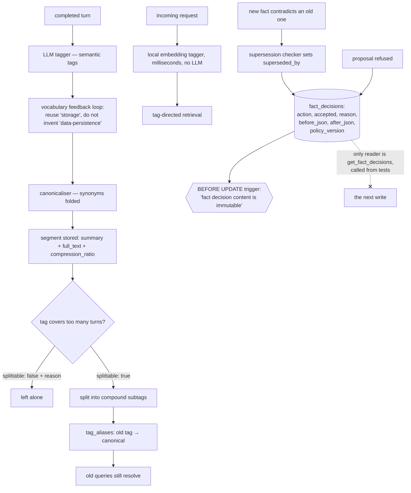

## 1. Executive Summary

virtual-context is a proxy between an agent and its model provider. It keeps
every turn verbatim, groups older turns by topic into summaries and extracted
facts, and forwards a bounded window plus eight paging tools the model calls to
reach the rest. Its strongest mechanism is a fact-decision ledger made immutable
by a database trigger. Its weak points are that nothing reads that ledger back,
and that the bundled MCP server's tag listing and topic resource read every
conversation in the store.

It is AGPL-3.0-or-later at version 0.3.7, and LICENSE adds a
commercial-licensing contact, so a second licence is on offer. The README frames
it as operating-system virtual memory: *"Give your agent a context window of tens
or hundreds of millions of tokens; the model only ever sees the part that
matters."* Integration is a base-URL change.

**It is in scope for this atlas**, although the framing invites the opposite
conclusion. A system that only decides which messages stay in the current window
is context management, not memory. Here segments, facts and per-tag summaries are
rows keyed on `conversation_id`, and the README names the store: *"The
conversation is the backing store: every turn is kept verbatim, with who said it,
where, when and to whom."* Something survives the session with an identity, so it
qualifies.

**Two mechanisms carry the report. The first is the tag vocabulary, and
specifically what happens when it goes wrong.**

Tags are not a fixed taxonomy. An LLM tagger reads each completed turn and
generates semantic tags. It is handed the existing vocabulary, a `tag_reuse`
judgment maps a minted tag onto an existing one (`core/tag_generator.py:411`), a
canonicaliser folds synonyms, and a splitter breaks up a tag that has grown too
broad.

`core/tag_splitter.py:13-36` sends an overly-broad tag to the model with the
count of turns it covers and asks a structured question: do these turns cover two
or more distinct sub-topics? If no, `{"splittable": false, "reason": "..."}`. If
yes, group them and mint compound subtags.

And then the reorganisation does not break existing retrieval, because
`tag_aliases` maps `(alias, conversation_id) → canonical`. A query that used the
old broad tag still resolves after the split.

The property this buys is **a vocabulary that can reorganise itself without
invalidating what was written against the old shape.** A model left to invent
tags accumulates `data-persistence`, `persistence`, `storage` and `db` as four
names for one thing. This one converges them, and when convergence produces a tag
that is too coarse, it splits it and keeps the old name working.

How often the split is right is measured on a small set. In
`benchmarks/jev/RESULTS.md` the production model called all 12 hand-labelled
tags splittable, six single-topic ones included, for 50% accuracy. The external
judge reached 91.7% only with its cut moved from the 0.5 default to 0.8.

The cheap tagger is the companion detail. The inbound path tags the request with
a local embedding model, *"precisely to keep this path off the LLM"*
(`docs/design.md:29`), and the LLM tagger runs after the response.

**The second mechanism is a ledger of decisions, and it is the strongest thing
here.** Facts are their own tier rather than an implication of segments: a `facts` table with
subject, verb, object, a temporal status, typed `fact_links`, per-conversation
`fact_embeddings` and an author actor. Every mutation of one goes through
`fact_mutations.py`, and every mutation writes a `fact_decisions` row in the same
transaction: the action, an `accepted` flag, a `reason`, `observed_at`,
`event_date`, a `policy_version`, and `proposal_json`, `before_json` and
`after_json`. A **rejected** proposal is written with the same fidelity as an
accepted one.

The row is then made immutable in the database rather than by convention.
`_ensure_fact_decision_schema` installs a `BEFORE UPDATE` trigger — a plpgsql
function on Postgres, a `RAISE(ABORT, 'fact decision content is immutable')` on
SQLite — that fires on any column but `conversation_id`, and the SQLite version
regenerates itself when the column set changes, under a comment naming the bug it
prevents: a guard created before an additive migration enumerates only the columns
that existed then. An append-only log whose append-onlyness is a schema object,
not a code path, is rare here.

Its limit is on the read side, and it is one query wide. `get_fact_decisions` is
the only reader, and outside the composite-store delegation every caller of it is
a test. So the rejects are kept perfectly and consulted never: a fact the pipeline
refused once can be proposed again, refused again, and logged again, with the
record of the first refusal sitting in the same table the second refusal is
written to. That is why this earns `audit_log` and not `tombstone` — the
distinction the atlas draws between the two is exactly this query.

## 2. Mental Model

A **segment** is a compacted span of turns carrying both a `summary` and the
`full_text`, with a `compression_ratio` and the `compaction_model` that produced
it recorded on the row. Keeping both representations plus the ratio means the
compaction is auditable — a reader can see what was thrown away and by which
model.

Segments carry a `primary_tag` and a set in `segment_tags`. Each tag accumulates
a `tag_summaries` row with `covers_through_turn`, `source_segment_refs` and
`source_turn_numbers` — so a per-tag summary knows exactly which material it
covers and where it stops.

```mermaid
%% caption: the tagger is fed the existing vocabulary so it reuses tags rather than inventing synonyms, a split writes aliases so old queries still resolve, and every accept or reject of a fact lands in a decision ledger a database trigger will not let anyone edit — and nothing reads back before the next write
flowchart TD
    T["completed turn"] --> LT["LLM tagger — semantic tags"]
    LT --> VF["vocabulary feedback loop:<br/>reuse 'storage', do not invent 'data-persistence'"]
    VF --> CAN["canonicaliser — synonyms folded"]
    CAN --> SEG["segment stored: summary + full_text + compression_ratio"]
    SEG --> BROAD{"tag covers too many turns?"}
    BROAD -->|"splittable: false + reason"| KEEP["left alone"]
    BROAD -->|"splittable: true"| SPL["split into compound subtags"]
    SPL --> AL["tag_aliases: old tag → canonical"]
    AL --> CONT["old queries still resolve"]
    Q["incoming request"] --> ET["local embedding tagger, milliseconds, no LLM"]
    ET --> R["tag-directed retrieval"]
    F["new fact contradicts an old one"] --> SS["supersession checker sets superseded_by"]
    SS --> DEC[("fact_decisions:<br/>action, accepted, reason,<br/>before_json, after_json,<br/>policy_version")]
    REJ["proposal refused"] --> DEC
    DEC --> TRG{{"BEFORE UPDATE trigger:<br/>'fact decision content is immutable'"}}
    DEC -. "only reader is get_fact_decisions,<br/>called from tests" .-x NEXT["the next write"]
```

The two paths into retrieval are the design: the expensive tagger runs after the
response, the cheap one before it, and the vocabulary they share is the same.

## 3. Architecture

A proxy (`virtual_context/proxy/`) sitting between the client and the provider,
so an existing agent gains the behaviour without code changes. Beside it an MCP
server, a CLI, a TUI, an OpenClaw integration and import adapters.

Storage is a relational backend — SQLite or Postgres, the latter with pgvector —
holding `segments`, `segment_tags`, `tag_aliases`, `tag_summaries`,
`engine_state`, `conversation_lifecycle`, `cost_log`, and the fact and identity
tiers:
`facts` with `fact_tags`, `fact_links` and `fact_embeddings`; `canonical_turns`
with `canonical_message_sources` and `speaker_handles`; and the actor-card tables
below. Neo4j and FalkorDB back the fact-link graph, a filesystem backend exists,
and Redis holds session state and conversation tombstones. The default SQLite
path is one file, `.virtualcontext/store.db`, holding every conversation
(`types.py:3083`).

**Scope is a column on shared tables, with three keys at three levels.**
`conversation_id` sits on every memory row — segments, facts, tag summaries,
tool outputs — and the SQLite backend carries 356 `conversation_id = ?`
placeholders. `tenant_id` sits above it on `conversations`, unique with the
conversation id, and on the merge and actor tables, with 64 `tenant_id = ?`
placeholders. `audience_conversation_id` sits on canonical turns and records who
a turn was addressed to, a public channel or a private DM.

An audience can be *reassigned*, and doing so writes a receipt carrying an
`operation_id`, a `manifest_digest`, a `source_fingerprint`, the `turn_hash` and
an attribution version. `effective_attested_audience` then refuses a source
replay or attestation unless both halves of the pair carry matching receipts and
the live row agrees, raising `CanonicalSourceConflict`
(`storage/audience_proof.py:14-64`). The guard is on the write and replay side,
and the module says so: *"They do not resolve request audiences or widen any
retrieval predicate."*

**An actor card is the third memory unit.** `actor_profiles` and
`actor_card_entries` hold kind-checked claims about a person — the `kind`,
`sensitivity` and `audience_scope` columns each carry a `CHECK` against an
enumerated list — with `superseded_by`, a `confidence` float, and
`actor_card_entry_sources` naming the exact `fact_id`s a claim rests on plus the
owner and audience conversations those facts came from. A card is rebuilt rather
than edited: `card_dirty` is set by database triggers when a cited canonical turn
changes, and `compaction_pipeline` pulls due rebuilds into its candidate set.

The Redis tombstone is not a memory mechanism, and a grepping reader will find it
first. `proxy/handlers.py:1910` describes "eviction + tombstone clearance, never
row deletion": a deleted conversation gets a Redis tombstone with a 24-hour TTL
and a version of `2**53` so a stale write cannot resurrect it
(`proxy/session_state.py:28`, `:1505`), and `undelete` clears it. Lifecycle checks
read the deleted flag from the tail of the stored value with `GETRANGE` rather
than parsing the whole value (`session_state.py:653`). That is a
distributed-systems fencing token, not a rejected-value record, and this report
does not count it.

`engine_state` persisting `compacted_prefix_messages`, `turn_count` and
`turn_tag_entries` per conversation is what lets the proxy be restarted without
losing where it was in a long conversation. An engine that starts with no saved
state rebuilds the turn-tag index from the tagged rows instead of re-tagging the
history (`engine.py:416`).

## 4. Essential Implementation Paths

**Ingest** — `ingest/` → `core/tagging_pipeline.py` → `core/tag_generator.py`
(LLM) with the existing vocabulary in the prompt and the `tag_reuse` and
`tag_select` seams → `core/llm_utils.normalize_tag` → storage.

**Split** — `core/tag_splitter.py`, prompting with the tag, its turn count out
of the total, and the turn list, requiring a structured verdict with a reason on
the negative case, and passing it through `judge_tag_split`.

**Retrieve** — the local embedding tagger on the request path →
`core/retriever.py`, whose store reads carry the engine's `conversation_id` →
tag-directed segment selection under a token budget. Dense fact candidates are
ranked inside the store, and a curation memo reuses the fact-curation decision
for an unchanged question and fact set.

**Page** — `core/tool_loop.py:97` defines the eight `vc_` tools and `:1595-1960`
dispatches them. From 2026-10-01 they are injected into Chat Completions requests
as well as Anthropic and Responses ones (`proxy/formats.py:2709`).
`vc_restore_tool` reads `tool_outputs`, `media_outputs` or `chain_snapshots` by
`(conversation_id, ref)` (`proxy/handlers.py:321`, `storage/sqlite.py:15372`).

**Supersede** — `ingest/supersession.py`, a "fact supersession checker: detect
and mark contradicted facts", with a stopword list tuned to the domain and a
`RelationType`/`FactLink` model.

**Compact** — segments compacted under budget pressure, with the ratio and the
model recorded.

## 5. Memory Data Model

`segments` keeps `summary` *and* `full_text` — a design choice with a real cost
in storage and a real benefit: compaction is reversible and inspectable, and
`compression_ratio` plus `compaction_model` on the row means a bad compaction
model is identifiable after the fact.

`tag_summaries` is the more unusual table. It holds a rolling per-tag summary
with `covers_through_turn`, `source_segment_refs`, `source_turn_numbers` and
`generated_by_turn_id` — so a summary is not an opaque blob but a claim about a
specific, enumerated set of turns, with a watermark. Incremental summarisation
that records its own coverage boundary is how you avoid re-summarising or
double-counting, and very few systems here do it.

`cost_log` records input and output tokens per event with the provider and
model. A memory layer that meters its own spend is well placed to answer whether
it is worth running, and the README's benchmark uses exactly this to report cost
per question.

Every memory table carries `conversation_id`, including `tag_aliases` — so the
vocabulary is per-conversation, and two conversations can canonicalise the same
synonym differently. That is the right scope for a vocabulary learned from
context.

A fact names its segment and conversation and no source turns. `Fact` has
`segment_ref`, `conversation_id` and a `turn_numbers` list that only the row
loaders assign (`types.py:107`). A commit on 30 September 2026 stamped each fact
with its segment's turns, and another an hour later removed the copy, on the
ground that the turns are reached by joining through the segment.

**`actor_card_entries` is the only table here with a validity window, and it is a
real one.** `valid_from` and `expires_at` sit beside `created_at` and
`updated_at`, and the read path filters on them:
`sqlite.py:14337` drops every row that fails
`actor_card_is_active(valid_from, expires_at, now=now)`, whose clock is injected
rather than read from the wall. Start is inclusive and end exclusive; a malformed
window hides the row rather than serving it; and a second predicate,
`actor_card_is_unexpired`, exists to *retain* a future-dated entry that must not
be served yet — its docstring says so: *"Keep valid future entries available for
carryover without serving them."* Two axes, stored apart, and the validity one
decides retrieval. That earns `bitemporal`.

Its limit is scope: `actor_card_policy` permits the window on one card kind only,
`communication_pref`, and requires an `expires_at` whenever `valid_from` is set.
Every other kind of claim about a person is timeless.

**The `facts` table has the columns for the same thing and does not keep them
apart.** A fact carries `when_date` — when the thing happened — beside
`mentioned_at` and `session_date`, which are when it was said. But the writer
coalesces at the point of the write: `compactor.py:2164` stores
`when_date = _str(f.get("when", "")) or (segment.session_date or "")`, so a fact
whose extraction produced no date gets the record time written into the validity
column. The separation is lost in the store rather than in the query, and no
later reader can tell a fact that happened on the session date from one whose
date was never known. The temporal window filter reproduces the same coalesce —
`self._parse_fact_date(fact.when_date or fact.session_date)` — which is the
correct thing to do given what is stored, and is why the fact tier does not carry
the mark the card tier does.

## 6. Retrieval Mechanics

Tag-directed rather than similarity-first. The local embedding tagger assigns
tags to the incoming request in milliseconds, those tags select segments and tag
summaries, and the working set is assembled under a token budget with cold
topics collapsing to their summaries under pressure and the model able to expand
them through tools when it needs detail.

Underneath the tag layer the store is lexical as well as dense. `quote_search`
describes itself as orchestrating *"FTS, semantic embedding search, and
description scanning"*, and the SQLite backend declares `segments_fts`,
`segments_fts_full`, `facts_fts` and a `tool_outputs_fts` contentless index as
FTS5 virtual tables with live `MATCH` queries against them. The dense path is one
of three, not the retrieval.

**The proxy scopes its reads to the conversation, and the MCP server's listing
reads do not.** The retriever, `query_facts` (`core/fact_query.py:73` sets the
conversation as a default filter), `recall_all`
(`core/retrieval_assembler.py:1324`), the quote and summary search and every
`vc_` tool pass the engine's `conversation_id`. The MCP server's `domain_status`
tool calls `get_all_tags()` with no argument and lists every tag in the store
with its counts and dates (`mcp/server.py:320`, `:329`). The
`virtualcontext://domains/{tag}` resource calls `get_summaries_by_tags` without a
conversation and returns up to 50 segment summaries from any conversation
carrying the tag (`mcp/server.py:359-379`). Both store methods take the
predicate; the callers omit it.

The resource returned the withheld marker in place of each summary until
2026-09-22, when commit `27b0202` changed the line to `f"{s.summary}"`. The same
file strips summary prose from `recall_all` because *"Stateless MCP never has
audience proof for layer-2 prose"* (`mcp/server.py:234`). This is why
`scope_enforced` is withheld: an agent-reachable read over the same store cannot
carry the conversation predicate.

**The audience check withholds summaries and passes facts.** A summary, segment
or tag rollup is shown as stored unless one of its source turns carries a proved
audience other than the request's. A request with no proved route reads as the
owner, and a failed source lookup withholds anything sourced
(`core/summary_identity.py:260-338`). The check reads source turn ids from the
item, and a fact carries none, so every fact passes it. `vc_query_facts` returns
subject, verb, object, `what`, `who` and `when` for the conversation's facts with
no audience step (`core/tool_loop.py:1844`). A fact distilled from a DM inside an
owner conversation reaches a guild request in that conversation.

**A temporal mode sits beside the tag-directed one.** `remember_when` resolves a
date range from a natural-language time expression, filters both segments and
facts into it, and — in its state modes — anchors on a target date, emitting
`date_distance_days`, `as_of_target` and `state_anchor` on each result. The
anchoring is a ranking rather than a cut-off: a candidate after the target date
still competes, it just scores worse. The window itself is a hard filter.

## 7. Write Mechanics

Tagging happens after the response, so the agent does not wait for it. Compaction
happens under budget pressure. Supersession runs at ingest.

Correction is `ingest/supersession.py` marking a contradicted fact, with typed
links between facts, and `_set_fact_superseded` writing `superseded_by` under the
fact-owner locks. `query_facts` and `search_facts` append
`superseded_by IS NULL` (`storage/sqlite.py:12846`, `:14734`), and
`_matches_constraints` drops a superseded fact on every discovery path in
`fact_query.py:231`.

**The rejected-value record exists and is not consulted.** `fact_decisions`
keeps the refusal — the proposal, the reason, the policy version, the before and
after — and nothing queries it before the next write. `reason` values in the
tests include `stale_proposal`, which names what the flag is for: the ledger
records *why the pipeline declined*, for a reader, not for the pipeline. So the
same claim can still arrive again and be refused again, and the atlas's
`tombstone` test — a rejected value, keyed on the value, consulted on a later
write — fails on the third clause only.

**There is no trust state.** `facts.status` looks like one and is not:
`TemporalStatus` is `active | completed | ceased | planned | abandoned |
recurring`, and its own docstring says what it is measuring — *"A concluded
action and a stopped state are opposite answers to 'is this still happening'"*.
That is the validity of the thing described, not the credibility of the claim,
and the atlas does not count it. `actor_card_entries.confidence` is a float that
nothing filters on. The one discrete verdict in the system is `accepted` on a
decision, which is a verdict about the write rather than about the fact.

**And there is no human review surface for memory.** The staging-and-approval
flow in `core/engagement/` gates outbound Discord posts, not what is remembered.
`admin consolidate-tags` writes a dry-run plan an operator can review and then
apply with `--apply --plan`. But `--apply` without a plan judges and writes in
one run, and the canonicaliser folds synonyms on the write path with no plan at
all (`cli/main.py:2054`, `:3001-3018`). Nothing waits.

The interesting failure surface is the vocabulary itself. Splitting a tag is an
LLM judgement; canonicalising a synonym is an LLM judgement; whether two turns
are "distinct sub-topics" is an LLM judgement. The aliases mean a wrong split
does not break retrieval — the old tag still resolves — which is a real safety
property, and it means a wrong split is also *invisible*, because nothing
degrades loudly. The one measurement, in section 1, says the production splitter
answers yes to single-topic tags.

## 8. Agent Integration

The proxy is the integration, and it is the strongest argument for the design:
an existing agent gets a virtual window by changing a base URL. Before each call
the proxy pages in recent turns, relevant topic summaries and facts, and an index
of the other topics. The model pages deeper with `vc_expand_topic`,
`vc_find_quote`, `vc_search_summaries`, `vc_find_session`, `vc_query_facts`,
`vc_recall_all`, `vc_remember_when` and `vc_restore_tool`. Inside a tool loop
the proxy stubs superseded and unrelated tool outputs first, and offers
`vc_restore_tool` for any output it stubbed.

An MCP server with eight tools and two topic resources, a CLI, a TUI, presets
(including a coding preset and a recommended local one) and import adapters sit
alongside. The MCP server builds one engine from `VIRTUAL_CONTEXT_CONFIG`, so it
reads whatever store that config names (`mcp/server.py:48-54`).

## 9. Reliability, Safety, and Trust

**Scope — withheld**, per section 6. `conversation_id` is on every memory row,
and the proxy applies it on every read it serves the model, `vc_restore_tool`
included. The MCP server's `domain_status` tool and both topic resources read the
whole store, and the tag resource serves other conversations' summary text.
Inside a conversation, the audience axis withholds DM-sourced summaries from a
guild request and lets the same conversation's facts through.

**Audit log — awarded, on a mutation log.** `fact_decisions` records
every accept and every reject of a fact mutation with the before, the after, the
proposal and the reason, in the same transaction as the mutation, in a table a
`BEFORE UPDATE` trigger refuses to let anything edit. `merge_audit` covers
conversation merges and `audience_reassignments` covers scope changes, each with
an `operation_id`. Beside them `cost_log` remains an append-only per-event spend
record and `tag_summaries` carries the provenance of every derived summary
(`source_segment_refs`, `source_turn_numbers`, `generated_by_turn_id`,
`covers_through_turn`). This is among the more complete audit surfaces in the
corpus, and two things qualify it. The first is that it lacks a reader:
`get_fact_decisions` is declared on the store protocol, implemented on the
composite store and the relational backend, and called from tests and nowhere
else — no CLI verb, no MCP tool and no engine path reads a decision back.

The second qualification is narrower. The immutability guard is `BEFORE UPDATE`,
and there is no `BEFORE DELETE` on `fact_decisions` in either dialect, while
`canonical_turns`, `source_event_times`, `assistant_channel_enrichment` and the
two audience-reassignment tables each carry a delete trigger. A ledger row
cannot be rewritten; it can be removed, and `delete_conversation` removes a
conversation's ledger rows with its segments and facts
(`storage/sqlite.py:7989`, `:8058`).

**Bitemporal — awarded on actor cards only**, per section 5, with the fact tier's
coalesced `when_date` explaining why it stops there.

**Negative eval — awarded.**
`test_turn_sourced_relevant_history_never_leaks_from_dm_to_guild`
(`tests/test_actor_cards.py:3111`) writes a `relevant_history` card entry whose
source is a DM turn. It asserts that `get_actor_card` returns it for the DM
audience and returns `None` for the guild audience, same tenant and actor. The
excluded entry is present and retrievable through the same call, so the assertion
cannot pass on an empty store. `tests/test_summary_identity.py:88` renders an
owner summary and a DM summary together and asserts exactly
`["owner content", SUMMARY_ATTRIBUTION_QUARANTINE]`.

**Trust state, tombstone, human review — no**, for the reasons in section 7. The
Redis conversation tombstone is a fencing token, as section 3 describes.

**A typed-judgment layer sits between the engine and thirteen of its
decisions**, and the shape of the switch is the interesting part.
`JUDGMENT_SEAMS` names them (`types.py:3238-3242`), and `JudgmentConfig.mode`
selects one of three behaviours, overridable per seam. In `legacy`, the default,
the external service is never called; in `shadow` the existing answer is used and
the external one is logged beside it; in `jev` the external answer is used and
any failure falls back to legacy with a logged reason. A shadow mode that logs
both answers is how you would find out whether a judgement swap is safe before
making it. Each engine owns its own runtime, so two engines in one process cannot
share a mode.

**The concentration of judgement is the risk, and part of it is measured.** Tag
assignment, vocabulary convergence, splitting, summarisation, supersession and
actor-card curation are all model calls. `benchmarks/jev/data/` holds labelled
files of 8 to 30 records per seam, and `RESULTS.md` records legacy against
external accuracy for eleven seams. Rerank, intent, temporal, safety and
admission were run on 16 September 2026; tag reuse, supersession, consolidation,
curation, tag split and grounding on 20 September. The labels are the harness
author's, the sets are small, and the per-row result files are gitignored, so
only the tables are committed. The decision ledger is the other half: for facts,
every judgement is recoverable afterwards with its proposal and its reason.

## 10. Tests, Evals, and Benchmarks

**No paper.**

`benchmarks/` holds harnesses for LongMemEval, LoCoMo, BEAM, AMB, MRCR and a
`context_contracts` suite — in the tree, not in another repository — with a
judge, a baseline, a dataset loader, a cost module and an `autopsy_report.py`,
and the per-seam judgment harness in `benchmarks/jev/` described in section 9.

The test tree, 154,161 lines, is larger than the package it covers, and the
contract tests assert on *storage invariants* rather than on outputs.
`test_storage_domain_contracts.py` asserts a decision written for one
conversation is invisible to another, `test_fact_lifecycle_contracts.py` asserts
the recorded `reason` on a refused proposal, and `test_fact_audit_upgrade.py`
asserts the ledger follows a conversation through a merge.
`tests/REGRESSION_MAP.md` pairs fix commits with the tests that pin them.

The published run is 100 questions from LongMemEval-500. It names the sampling
("5 batches of 20, seeds 42/99/777/1234/2025"), all three models by role
(MiMo-V2-Flash for ingestion, Claude Sonnet 4.5 as reader, Gemini 3 Pro Preview
as judge), and the baseline as the *same reader* with full history. It reports
95/100 against 33/100, at 52,347 versus 117,582 tokens per question and $0.16
versus $0.36. The per-question table in `docs/benchmarks.md` recomputes to those
totals: 100 rows, 95 and 33 passes, and the category counts of its summary
table.

**The claim record's wording changed on 1 October 2026.** Until then the README
called these *"historical results"*: *"the original run's provenance is
incomplete and they are not a measurement of the current pipeline"*. The record,
`benchmarks/longmemeval/historical-claims.yaml`, said it *"does not attest
current accuracy, reproduce the run, or convert historical caches into valid
cache hits"*. Commits `7dca0e0`, `bd61dce` and `2325c71` removed the label,
renamed the record `claims.yaml` with status
`claims_without_original_run_manifest`, and cut its interpretation to *"Record of
the published claim. Original run artifacts were not available in the tracked
repository."*

The provenance underneath did not move. `run_provenance` keeps `engine_revision`,
`dataset_sha256`, `memory_cache_manifest` and
`original_machine_readable_results` at `null`, and `claim_source` is the README's
bytes at `5f293764fda5bb79e43fec2675a2ba67eeac0e98`, captured 2026-09-05. The
first commit's reason is that *"any benchmark run describes the pipeline at the
commit it ran against"*, and the record names no such commit. So the 95/100 is a
published claim with its sampling and models stated and its engine revision
unrecorded.

The project states one caveat itself: *"A full LoCoMo run is not yet published"*
(`docs/benchmarks.md:142`). The per-category counts (17 knowledge-update, 26
multi-session, 28 temporal-reasoning) are small enough that a category figure
moves several points per question.

**I ran nothing.**

## 11. For Your Own Build

### Steal

- **Give your tag vocabulary a feedback loop.** Showing the tagger what already
  exists, so it reuses `storage` rather than inventing `data-persistence`, is
  the difference between a vocabulary and a pile of near-synonyms.
- **Split a tag that grows too broad, and keep an alias.** The split is the
  obvious half; `tag_aliases` mapping the old name to the canonical one is what
  makes the reorganisation safe for everything already written.
- **Make the splitter answer a structured question with a reason on the
  negative.** `{"splittable": false, "reason": "..."}` means a no is
  inspectable, not just an absence.
- **Run a cheap tagger on the request path and the expensive one after the
  response.** Retrieval never waits on a model, and the two share a vocabulary.
- **Record the coverage boundary on a rolling summary.**
  `covers_through_turn` plus the enumerated source refs is how an incremental
  summary avoids re-summarising and double-counting.
- **Keep the summary and the full text, with the ratio and the model.** A bad
  compaction model is identifiable afterwards only if you wrote down which one
  ran.
- **Meter your own cost.** `cost_log` per event with provider and model is what
  turns "is this worth running" into a query.
- **Scope the vocabulary to the conversation.** Two conversations can reasonably
  canonicalise the same word differently.
- **Put the append-only in the schema, not the code.** A `BEFORE UPDATE` trigger
  that raises on any column but the one you expect to move makes the ledger
  append-only for every writer, including the one written next year, and it costs
  a few lines of DDL. Regenerate the trigger when the column set changes — the
  comment above the SQLite branch names the bug that a stale enumeration causes.
- **Log the reject with the same fields as the accept.** `proposal_json`,
  `before_json`, `after_json`, `reason` and `policy_version` on a refusal is what
  turns "the pipeline dropped it" into a question with an answer.
- **Give each model judgement a labelled set and score the incumbent beside the
  replacement.** `benchmarks/jev/` does it per seam, small and hand-labelled, and
  the tag-split row shows what that buys: a decision that answers yes to
  everything.
- **Give a preference an expiry rather than a deletion.** `valid_from` and
  `expires_at` on a card entry, filtered at an injectable `now`, let a future
  preference exist without being served and a lapsed one stop being served
  without being lost.

### Avoid

- **Do not ship a second surface over the same store without the scope
  predicate.** The proxy passes `conversation_id` on its reads; the MCP server's
  topic resource omits it and returns every conversation's summaries for a tag.
- **Do not decide visibility from a field one memory unit lacks.** The audience
  check reads source turn ids, summaries carry them and facts do not, so the
  boundary that holds for summaries passes every fact.
- **Do not mistake the Redis conversation tombstone for a memory mechanism.**
  It is a fencing token with a TTL and a version, doing exactly the job it
  should.
- **Do not read a 100-question sample's per-category rates as stable.** Some
  categories carry seventeen questions.
- **Do not build a rejection ledger and then never query it.** Every refusal
  here is recorded with the reason and the proposal, and the only reader is a
  test helper — so a claim the pipeline has already declined is re-proposed,
  re-evaluated and re-declined, at the cost of the evaluation each time. One
  `SELECT` keyed on the proposed value would turn the log into a gate.
- **Do not coalesce validity time into record time at the write.** Storing
  `when_date = extracted_when or session_date` loses the distinction that made
  the column worth having; store the null, and coalesce in the query if you must.

### Fit

This suits someone who wants a long virtual context without changing their agent
— the proxy is the product, and the benchmark states its sampling, its models and
its per-question results, though not the engine revision it ran.

It is a governed memory in one direction and not the other. What was
done to a fact is recorded completely and immutably, with the tenant, the
conversation and the audience it belonged to and the receipt for any change to
that audience; what will be done to the next fact is decided without reference to
any of it. So this is a good shape for someone who has to answer *why is this in
the memory* after the fact, and still the wrong shape for someone who needs the
memory to refuse a claim it has already refused. There is no trust state and no
review surface. Run the proxy rather than the MCP server where one store holds
conversations that must not see each other, and keep a DM and a guild in separate
conversations if their facts must stay apart.

## 12. Open Questions

- **How often does a split fire in production, and how often is it wrong?** The
  labelled set says the production splitter answers yes to single-topic tags,
  `RESULTS.md` says shadow mode is enabled in no deployment, and the aliases make
  a bad split harmless to queries and invisible to everyone.
- **Does the vocabulary converge or oscillate?** A feedback loop that reuses
  existing tags and a splitter that mints new ones are opposing forces, and
  nothing reports the equilibrium.
- **Why is the decision ledger never read?** Every mechanism for consulting it
  exists — the rows, the reason, the index on `(conversation_id, observed_at,
  decision_id)` and a `get_fact_decisions` accessor on the store protocol — and
  no production caller uses it. Is a UI intended, or a gate?
- **Is the MCP topic resource meant to span conversations?** It did so with the
  prose withheld until 2026-09-22 and returns the text from then on.
- **Will the validity window spread beyond `communication_pref`?** The
  machinery is general and the policy admits one card kind.
- **What is the LoCoMo result?** The project says it is not yet published and the
  harness is committed.

## Appendix: File Index

**The vocabulary** — `virtual_context/core/tag_generator.py` (`:411`, the
`tag_reuse` and `tag_select` steps), `tag_splitter.py` (the prompt and the
structured verdict `:13-36`), `tagging_pipeline.py`, `llm_utils.py`
(`normalize_tag`), `tag_consolidator.py` and `cli/main.py:2054`
(`admin consolidate-tags`)

**Schema** — `virtual_context/storage/sqlite.py:116` (`segments`), `:133`
(`segment_tags`), `:140` (`tag_aliases`), `:147` (`cost_log`), `:157`
(`tag_summaries` with `covers_through_turn`), `:174` (`engine_state`), `:182`
(`conversation_lifecycle`), `:198` (`canonical_turns`), `:1368`
(`conversations` with `tenant_id`), `:1824` (`facts`), `:1867` (`fact_links`),
`:1884` (`fact_embeddings`), `:2450` (`actor_card_entries` with the three CHECKs
and the validity window), `:2476` (`actor_card_entry_sources`), `:2763`
(`canonical_message_sources`); `virtual_context/types.py:107` (`Fact`), `:3083`
(the default SQLite path)

**The decision ledger** — `virtual_context/storage/fact_mutations.py:112`
(`fact_decisions`), `:122-157` (the immutability trigger on both dialects),
`:256` (`_record_fact_decision`), `:293` (`_set_fact_superseded`), `:472`
(`get_fact_decisions`, the only reader); `storage/sqlite.py:7989`
(`delete_conversation`, ledger rows in the table list at `:8058`)

**Scope and audience** — `virtual_context/storage/audience_reassignment.py`,
`audience_proof.py:14-64` (`effective_attested_audience`), `:67-88`
(`verify_source_replay_audience`);
`virtual_context/core/summary_identity.py:260-338` (the read-side audience check)

**Actor cards** — `virtual_context/actor_card_validity.py`,
`virtual_context/core/community/actor_card_policy.py:120-121` (the one card kind
that may carry a window), `actor_card_curation.py`, `actor_card_rebuild.py`,
`virtual_context/storage/actor_card_transition_guards.py`

**Temporal retrieval** — `virtual_context/core/temporal_resolver.py:177`
(`remember_when`), `:1051` and `:1083` (the window filter on `when_date or
session_date`), `:2249` (`_select_state_candidates`), `:833` (`as_of_target`)

**Retrieval** — `virtual_context/core/retriever.py`,
`core/semantic_search.py`, `core/quote_search.py`, `core/fact_query.py:73`,
`core/retrieval_assembler.py:1324` (`recall_all`), `virtual_context/engine.py`,
`virtual_context/token_counter.py`

**Paging tools** — `virtual_context/core/tool_loop.py:97`
(`vc_tool_definitions`), `:1595-1960` (dispatch), `:1844` (the fact payload);
`virtual_context/proxy/handlers.py:295-420` (`_ProxyToolRuntime`, restore);
`virtual_context/proxy/formats.py:2709` (Chat Completions tool injection)

**Correction** — `virtual_context/ingest/supersession.py`

**Proxy and session state** — `virtual_context/proxy/handlers.py:1900-2030`
(eviction, the Redis tombstone and `undelete`),
`virtual_context/proxy/session_state.py:28`, `:653`, `:1505`,
`virtual_context/conversation_identity.py`

**Integration** — `virtual_context/mcp/server.py` (`:320` `domain_status`,
`:347` and `:359` the topic resources), `virtual_context/cli/`,
`virtual_context/tui/`, `virtual_context/openclaw/`,
`virtual_context/import_adapters/`, `virtual_context/presets/`

**Benchmarks** — `benchmarks/longmemeval/` (`judge.py`, `baseline.py`,
`dataset.py`, `cost.py`, `autopsy_report.py`, `claims.yaml`),
`benchmarks/locomo/`, `benchmarks/beam/`, `benchmarks/amb/`, `benchmarks/mrcr/`,
`benchmarks/jev/` (`RESULTS.md`, `data/*.jsonl`), `docs/benchmarks.md`

## Appendix: Recorded Searches

Run from the root of the checkout at the pinned commit.

| Claim | Command | Result at this pin |
| --- | --- | --- |
| Scope is predicates, not partitions | `rg -c 'conversation_id = \?' virtual_context/storage/sqlite.py` and `rg -c 'tenant_id = \?' virtual_context/storage/sqlite.py` | 356 and 64 |
| The MCP server reads across conversations | `rg -n 'get_all_tags\(\)\|get_summaries_by_tags\(tags=\[tag\]' virtual_context/mcp/server.py` | `:329` and `:352` (`get_all_tags()`), `:364` (`get_summaries_by_tags` with no `conversation_id`) |
| Facts carry no source turn ids for the audience check | `rg -n 'canonical_turn_ids\|source_canonical_turn_ids' virtual_context/core/summary_identity.py`, then `rg -n '[^_]turn_numbers=' virtual_context` | `_source_ids` reads only those two fields, which `Fact` lacks; `turn_numbers` is assigned only by the two row loaders and `Fact.from_dict` |
| Nothing consults the decision ledger before a write | `rg -n 'FROM fact_decisions' virtual_context` then `rg -n 'get_fact_decisions' virtual_context benchmarks scripts` | One SELECT, in `get_fact_decisions`; outside `tests/` the only references are the protocol declaration, the base store raising `NotImplementedError` and the composite-store delegation |
| No delete trigger on the ledger | `rg -n 'BEFORE DELETE' virtual_context/storage` | Hits on `canonical_turns`, `source_event_times`, `assistant_channel_enrichment` and the two audience-reassignment tables; none on `fact_decisions` |
| No epistemic status on a fact | `sed -n '/class TemporalStatus/,/RECURRING/p' virtual_context/types.py` | Six values, all answering *is this still happening* |
| Validity time is queried on cards | `rg -n 'actor_card_is_active\|actor_card_is_unexpired' virtual_context/storage` | Read-path filters in both the SQLite and Postgres backends |
| Validity time is collapsed on facts | `rg -n 'when_date=' virtual_context/core/compactor.py` | `:2164` writes `_str(f.get("when","")) or (segment.session_date or "")` |
| Only one card kind may carry a window | `rg -n 'valid_from' virtual_context/core/community/actor_card_policy.py` | `:20` and `:120-121`, `communication_pref` only |
| No human review of memory | `rg -n -i 'needs_review\|pending_review\|awaiting' -g '*.py' virtual_context` | `core/engagement/` (outbound Discord posts), plus two docstrings using the ordinary word |
| Per-seam results are tables only | `git ls-tree -r --name-only HEAD benchmarks/jev/results` and `rg -n 'jev' .gitignore` | Only `.gitkeep`; `.gitignore` excludes `benchmarks/jev/results/*.json` |
| Tree size | `find . -name '*.py' -not -path './.git/*' -print0 \| xargs -0 cat \| wc -l`, the same under `virtual_context` and `tests`, and `find tests -name 'test_*.py' \| wc -l` | 313,727; 141,128; 154,161; 474 |

## History

**2026-10-01** — [`f831928270bab792edac25f5adc6b113e49d8f19`](https://github.com/virtual-context/virtual-context/commit/f831928270bab792edac25f5adc6b113e49d8f19) — 135 commits on. **`scope_enforced` withdrawn** ([section 6](#6-retrieval-mechanics)): the MCP `domain_status` tool and topic resources read every conversation at both pins, and from `27b0202` the tag resource serves summary text; that commit also left facts outside the audience check. `negative_eval` re-anchored: its test was deleted, and a DM-to-guild actor-card test holds the mark. Three published errors: the audience receipt was called a read guard; per-seam results committed on 16 September were called absent; the project's own provenance caveat was omitted. On 1 October the project dropped that caveat, and `run_provenance` still records no engine revision ([section 10](#10-tests-evals-and-benchmarks)). Screened: `uv.lock` inside the cooldown, three executing `conftest.py` files; nothing installed, built or run.

**2026-09-18** — [`f5adda099e3d3d9e63878bba938fa5b12a928519`](https://github.com/virtual-context/virtual-context/commit/f5adda099e3d3d9e63878bba938fa5b12a928519) — re-pinned from `65d2640`; 20 files and 1,112 insertions under the package, none of them in `storage/`, so the four marks' subject code is unchanged and all four were re-verified against it rather than re-derived. Two corrections to this report, both ours rather than upstream's: the stack row said the retrieval was vector, where `quote_search` orchestrates FTS, embedding search and description scanning over four FTS5 virtual tables with live `MATCH` queries — the row is now `lexical, vector` and marked reviewed rather than seeded; and the audit-log record described an append-only ledger without saying that the immutability guard is `BEFORE UPDATE` only, with no delete trigger on `fact_decisions` in either dialect while five neighbouring tables in the same storage layer carry one. The unread-ledger finding is sharpened rather than changed: `get_fact_decisions` exists on the protocol, the composite store and the backend, and every caller outside `storage/` is a test. New at this pin: a 626-line typed-judgment layer routing five named seams — rerank, query intent, temporal intent, safety-critical and actor-card admission — to an external service in `legacy` / `shadow` / `jev` modes, defaulting to legacy, per engine rather than per process; the head commit keeps stored-claim validation off it, on the deterministic safety predicate.

**2026-09-10** — [`65d2640e15547519f54bec0ddcfab4210c1dd06f`](https://github.com/virtual-context/virtual-context/commit/65d2640e15547519f54bec0ddcfab4210c1dd06f) — re-read. 291 files and 60,668 insertions past the previous pin, 21,357 of them inside the memory paths, and the report's central negative claims are the casualties. **Two marks added.** `audit_log` was awarded at the first reading on `cost_log` and summary provenance with the explicit caveat *"it is not a mutation log of the memory itself"* — it is one now: `fact_decisions` records every accept and reject of a fact mutation with the proposal, the before, the after, the reason and a policy version, in the same transaction as the mutation, under a `BEFORE UPDATE` trigger that raises `fact decision content is immutable`. `negative_eval` is added on `test_remember_when_requires_exact_audience_bound_summary_provenance`, which seeds a public and a private-DM segment as matching hits inside the same window and asserts the result is exactly `["public"]`. `bitemporal` is added on actor-card entries, whose `valid_from`/`expires_at` are filtered at an injectable `now` beside `created_at`/`updated_at` — and withheld from the fact tier, because `compactor.py:2242` writes the record time into the validity column when extraction produced no date, collapsing the two axes at the write rather than in the query. `scope_enforced` holds and the sentence limiting it — *"the boundary here is a conversation rather than a tenant"* — is stale: there is a `tenant_id` axis and an `audience_conversation_id` axis, the latter with reassignment receipts a read refuses to serve without. `tombstone` is still withheld and now for a sharper reason: the rejected value **is** recorded, and nothing reads it back. Two memory units were added since the first reading — a `facts` table with typed links and embeddings, and kind-checked actor cards citing the fact ids they rest on — and the tree grew from roughly 257,000 lines of Python to 306,547, of which the test tree is now larger than the package. Schema line numbers in the appendix were all stale and are re-pinned; recorded searches added, which the report shipped without. Screened before reading: two dependency manifests changed inside the seven-day cooldown, three pytest `conftest.py` files execute on collection; nothing was installed, built or run.

**2026-08-09** — [`6566ec7d6c43d95688b5bc870eb2ba78fbb6fb1d`](https://github.com/virtual-context/virtual-context/commit/6566ec7d6c43d95688b5bc870eb2ba78fbb6fb1d) — first reading. Screened before reading; the tree was read, never installed, and no benchmark was run.
