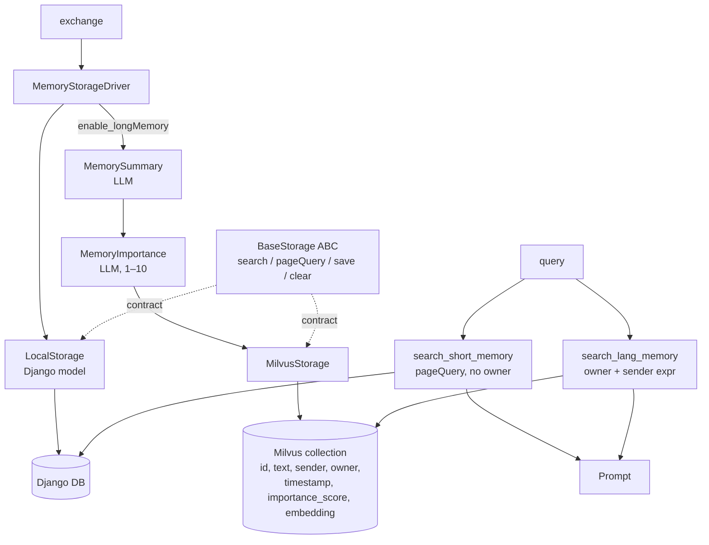

## 1. Executive Summary

VirtualWife is a Chinese-language VRM avatar companion — Django backend, web
front-end — and its memory layer is a **faithful port of the Generative Agents
retrieval function** from Park et al., down to the importance prompt's worked
examples. Three components are computed per candidate and summed:

```python
def compute_recency(self, memories):
    current_time = time.time()
    for memory in memories:
        time_diff = current_time - memory["timestamp"]
        memory["recency"] = 0.99 ** (time_diff / 3600)   # exponential decay

def normalize_scores(self, memories):
    for memory in memories:
        memory["total_score"] = memory["relevance"] + \
            memory["importance_score"] + memory["recency"]
```

The recency decay is exactly right. The importance prompt is essentially the
paper's. And `normalize_scores` **normalises nothing** — it adds `relevance`,
which is `1 - hit.distance` and lives in roughly [0, 1]; `recency`, which lives
in (0, 1]; and `importance_score`, which the LLM is asked to produce **on a scale
of 10**.

The consequence is arithmetic. A memory the model called mundane scores at most
`1 + 1 + 1 = 3` even when it is perfectly relevant and seconds old. A memory the
model called important scores at least `10` when it is irrelevant and months
old. **Importance alone orders the results**; relevance and recency function as
tie-breakers within an importance band. The original applies its weights to
normalised components, which is what makes equal weights a design choice rather
than an accident — that step is named here and not performed.

Two further findings, both checkable:

- **The short-term read path drops its scope key.** `BaseStorage.pageQuery` is
  declared with an `owner` parameter; `LocalStorage.pageQuery` implements it
  without one, and that is the overload the driver calls
  (`memory_storage.py:27-28`). A `pageQueryByOwner` exists directly above it and
  **has no callers anywhere**. Short-term memory is retrieved across every
  character in the installation.
- **The long-term scope filter is built by string interpolation** —
  `expr = f"owner == '{owner}' and sender == '{sender}'"` — from the character
  name and the user's display name.

Set against those, the storage contract itself is the best thing here and better
than several in this atlas: four methods, `owner` on **every one of them**,
including `clear`.

**Why a dormant, partly-broken system keeps a slot.** The last commit is dated
2024-10-27 and the scoring function does not do what its own method name says, so
the fair question is what a 2026 atlas wants with it. Two things. `BaseStorage` is
a better answer to "what must a memory backend implement" than the contracts this
atlas has read in much larger frameworks, which routinely omit deletion entirely —
it is worth copying with the implementations discarded. And the `normalize_scores`
defect is *instructive precisely because the port is otherwise faithful*: someone
carried across three components, equal weighting and an exponential recency decay,
and dropped the one step that makes equal weights mean anything. That is a
mistake a working system can make silently, and it is easier to see here, frozen,
than in something still moving. Neither claim depends on the project being alive.

## 2. Mental Model

Two kinds of memory with different units, different stores and different
lifecycles:

| | Short term | Long term |
| --- | --- | --- |
| Unit | the raw exchange, as JSON | an LLM summary of the exchange |
| Store | Django model | Milvus |
| Selection | last N by timestamp | relevance + importance + recency |
| Importance | hardcoded `1` | LLM-assigned, 1–10 |
| Enabled | always | `enable_longMemory` |

```text
   exchange (you_name, query, role_name, answer)
        │
        ├──► short term: save raw JSON, importance_score = 1
        │
        └──► if enable_longMemory:
                 │
                 ├─ if enable_summary: LLM summarises the exchange
                 ├─ LLM scores its importance 1–10
                 └─ insert into Milvus with an embedding
                            │
   retrieval:               ▼
     short: pageQuery(1, N) ─────────► no owner filter
     long:  search(query, 3, sender, owner)
                 relevance  = 1 − distance
                 recency    = 0.99 ^ (hours elapsed)
                 total      = relevance + importance + recency
                 sort, take the top
```

There is one state transition and it is a **one-way promotion**: an exchange is
stored raw, and — if long memory is on — a *separate* summarised copy is written
to a *different* store. The original is never marked, never superseded and never
removed. The two copies then age independently, which means the same exchange can
be returned twice in one prompt, once verbatim and once as a summary.

Nothing decays out of the store; `recency` is computed at read time and affects
only ranking. Nothing is corrected. Nothing is deleted except by wiping an
owner entirely.

## 3. Architecture

Python 3, Django, MIT-licensed. **No commit since 2024-10-27.**



**Zep is present in the tree and is not a memory backend.**
`apps/chatbot/memory/zep/zep_memory.py` (168 lines) exports a `ChatHistroy`
class — the spelling is the code's — imported by the LLM drivers
(`llms/llm_model_strategy.py:10`, `llms/ollama/ollama_chat_robot.py:9`,
`llms/zhipuai/zhipuai_chat_robot.py:8`) to carry conversation history. There is
no `ZepStorage(BaseStorage)`, and `MemoryStorageDriver` imports only
`LocalStorage` and `MilvusStorage`. A commented-out block in
`chat/chat_history_queue.py:71-83` shows a `zep_service` that once fetched and
updated users and is now dead. Worth stating plainly because the directory layout
suggests otherwise: **this system does not use Zep as a memory store.**

### Deployment and ergonomics

- **What has to be running:** Django, a database, and — for long memory —
  **Milvus**, which is the heaviest deployment requirement in this atlas's
  companion group by a wide margin.
- **Long memory is off by default** (`enable_longMemory`), and with it off the
  system degrades to "the last N exchanges", which is conversation-window
  management rather than memory.
- **An LLM is required to store anything long-term**: two extra model calls per
  exchange, inline.
- **Hand-repairable:** the short-term store is a Django model a person can query;
  the long-term store is a Milvus collection, which is not.

## 4. Essential Implementation Paths

Paths are relative to `domain-chatbot/apps/chatbot/`.

**The contract.** `memory/base_storage.py` — `BaseStorage(ABC)` with four
abstract methods: `search(query_text, limit, owner)`,
`pageQuery(page_num, page_size, owner)`,
`save(pk, query_text, sender, owner, importance_score)`, and `clear(owner)`.
Every method carries `owner`.

**The driver.** `memory/memory_storage.py` — `MemoryStorageDriver` (`:14`)
constructs `LocalStorage` always and `MilvusStorage` only under
`enable_longMemory` (`:22-24`). `search_short_memory` (`:26`) calls
`pageQuery(page_num=1, page_size=…)` — **no owner**. `search_lang_memory` (`:34`)
calls `search(query_text, 3, sender=you_name, owner=role_name)` — a `sender`
keyword the abstract method does not declare. `save` (`:56`) writes the raw
exchange with `importance_score=1`, then optionally summarises and scores it
before the Milvus insert.

**Local implementation.** `memory/local/local_storage_impl.py` —
`search` filters on `owner` and orders by `-timestamp` (it is a recency query, not
a search); `pageQueryByOwner` (`:31`) filters on owner and **is never called**;
`pageQuery` (`:41`) omits `owner` and is the one the driver uses; `save` (`:52`)
runs `jieba` segmentation and `jieba.analyse.extract_tags(topK=20)` to store
keyword tags — **which nothing reads**; `clear` (`:68`) deletes by owner. The
file opens with a `TODO` saying the search method needs rework.

**Milvus implementation.** `memory/milvus/milvus_storage_impl.py:18` — builds
`expr = f"owner == '{owner}' and sender == '{sender}'"` (`:21`), then
`compute_relevance` → `compute_recency` → `normalize_scores` → sort.

**Scoring.** `memory/milvus/milvus_memory.py` — schema with
`importance_score` as `INT64` (`:39`); `compute_relevance` (`:67`) setting
`relevance = 1 - hit.distance` (`:83`); `compute_recency` (`:118`) with
`0.99 ** (time_diff / 3600)`; `normalize_scores` (`:125`) summing the three.

**Importance.** `memory/memory_storage.py:145` — `MemoryImportance`, whose prompt
asks for a score *"on a scale of 10"* with 1 a mundane task and 10 an extremely
important one, and demands JSON. `importance` (`:160`) locates the outermost
braces, parses, and **defaults to 3** when no JSON is found.

**Tests.** `tests/bilibili_api_test.py` — a livestream API test. Nothing touches
memory.

## 5. Memory Data Model

The Milvus schema is the real one: `id`, `text`, `sender`, `owner`, `timestamp`,
`importance_score`, `embedding`. The Django model adds `tags` (jieba keywords)
which no read path consults.

**Provenance is two identity fields and nothing else** — who said it (`sender`)
and which character owns it (`owner`). No source, no model name, no version, no
link from a long-term summary back to the short-term row it came from. That last
absence is the one with consequences: the summary and the original are separate
rows in separate stores with no relationship recorded, so nothing can keep them
consistent or delete them together. Compare [RisuAI](../risuai/), which stores the
source message ids on every summary for exactly this reason.

`importance_score` is **salience, not confidence** — how much a model thinks the
event mattered, not how likely it is to be true. `trust_state` is withheld.

`timestamp` is a single write time. There is no validity time, so a fact that was
true last month and is false now ranks by when it was recorded.
`bitemporal` is withheld.

**Scoping is declared everywhere and enforced on one path of two.** `owner` is on
all four interface methods, which is more discipline than most contracts in this
atlas show — and then `search_short_memory` calls the overload without it.
`scope_enforced` is withheld: a scope key that half the read paths ignore is not
enforced, and the mechanism that would fix it, `pageQueryByOwner`, is sitting ten
lines above the one being called.

## 6. Retrieval Mechanics

**The long-term path is the Generative Agents function**, and it is worth being
precise about what was and was not carried across.

Carried across: three components, equal treatment, exponential recency decay at
`0.99` per hour, an LLM importance score elicited by essentially the paper's
prompt, and retrieval by summed score rather than by similarity alone. That is
more of the design than most reimplementations manage.

Not carried across: **the normalisation**. The original scales each component to a
comparable range before summing, which is what allows equal weights to express
"these three matter equally". Here the components enter the sum at their native
scales — `[0, 1]`, `(0, 1]`, and `1–10`. The method that would fix it is called
`normalize_scores` and its body is a sum.

The practical effect is that this is an **importance-ranked store with similarity
as a tie-break**, not a balanced retrieval function. Whether that is worse depends
on the corpus — for a companion app, "return the things that mattered" is a
defensible policy — but it is not the policy the code says it implements, and a
`limit` of 3 candidates means the vector search has already narrowed the field
before the score is applied. The scoring reorders three results.

**The short-term path is not retrieval.** `pageQuery(1, N)` returns the newest N
rows across all owners, reversed into chronological order. There is no query
matching of any kind, and no owner filter — so in a multi-character installation,
one character's recent exchanges are injected into another's prompt.

**The filter is string-interpolated.** `owner` is the character name and `sender`
is the user's display name, both concatenated into a Milvus boolean expression
with no escaping. A name containing an apostrophe breaks the expression; a name
chosen adversarially rewrites it. On a single-user desktop install this is a
robustness bug; anywhere multi-user it is a scope-boundary bug, and the fix is
parameterisation rather than validation.

## 7. Write Mechanics

Every exchange is written raw to the short-term store with a hardcoded
`importance_score = 1`. Under `enable_longMemory` it is *also* summarised and
scored, then embedded and inserted into Milvus.

**Both extra steps are inline and blocking**: an LLM summary call and an LLM
importance call before the turn completes. There is no queue, no batching and no
background worker. The comparison worth drawing is with
[Soul of Waifu](../soul-of-waifu/), which batches its model calls every four
messages, and [Z-Waif](../z-waif/), which makes none at all.

**Both LLM outputs are parsed defensively and default silently.** The summary
locates a JSON substring and logs a warning if absent; `importance` does the same
and **returns 3** when parsing fails. A model that reliably fails to produce JSON
therefore fills the store with a constant importance of 3 — and since importance
dominates the ranking, retrieval quietly degrades toward pure vector order with
no error anywhere.

**No deduplication, no consolidation, no conflict handling.** Contradictory
summaries coexist and both can be retrieved.

**Deletion is `clear(owner)` and nothing else.** The interface has no per-memory
delete, no delete-by-id, no TTL. Correcting one wrong memory means wiping the
character. This is the same gap the atlas records in the
[ADK and AutoGen contracts](../../patterns/pluggable-memory-provider/) — except
those have no delete at all, so a scoped `clear` is a step further than either.
`tombstone` is withheld.

### Operational cost

- **The write path is synchronous and pays two model calls per exchange** when
  long memory is on — the most expensive write path in the companion group.
- **Lag to retrievability is zero**, since the cost is paid inline.
- **No background pass** re-reads the store.
- **On the read path**, three long-term summaries plus N short-term exchanges,
  bounded by count rather than tokens.

## 8. Agent Integration

None. `MemoryStorageDriver` is called by the chat pipeline and the results are
formatted into the prompt. There is no API, no tool interface, and the model has
no agency over memory beyond writing the summaries it is asked for.

`BaseStorage` is the integration surface, and it is a genuinely reusable one —
four methods, no framework types in the signatures, `owner` throughout. Adding a
third backend means implementing four methods. That the two existing
implementations disagree about `pageQuery`'s signature is a discipline failure,
not a design one.

## 9. Reliability, Safety, and Trust

**None of the seven capabilities is present.**

**The provider contract is the strength and should be said clearly.** Four
methods, `owner` on every one, `clear` scoped to an owner rather than global.
Compared with the contracts this atlas has read in larger frameworks, which
routinely omit deletion entirely, this small ABC asks the right questions. The
failure is in the implementations, not the interface — `LocalStorage.pageQuery`
silently narrows the contract, and Python's `ABC` cannot catch a signature
mismatch, so nothing complains.

**The abstraction leaks in the other direction too.** `search_lang_memory` passes
`sender=` to `search`, which `BaseStorage.search` does not declare. `MilvusStorage`
accepts it; `LocalStorage` would raise. The two backends are therefore not
interchangeable despite sharing an interface, and the code that would prove it
is never run against the local one.

**Prompt injection is live on the write path.** User text is summarised by an LLM
whose output is stored and later injected. Nothing sanitises it.

**Scope enforcement fails open on the short-term path** and is string-built on the
long-term one — see sections 5 and 6.

**Uncertainty cannot be expressed.** A summary is prose with a salience number.

**Dormancy.** No commit since 2024-10-27. The `TODO` on the local search method
and the commented-out Zep service are both unresolved at this commit.

## 10. Tests, Evals, and Benchmarks

One test file, `tests/bilibili_api_test.py`, covering a livestream API. **Nothing
tests memory.**

The tests that would have caught what this report found are unusually direct:

- `LocalStorage` and `MilvusStorage` both satisfy `BaseStorage` with matching
  signatures — a single `inspect.signature` comparison across implementations.
- Two owners' memories do not appear in each other's `search_short_memory`.
- An `owner` containing an apostrophe does not corrupt the Milvus expression.
- Of two candidates, one perfectly relevant and current with importance 1 and one
  irrelevant and old with importance 10, assert which ranks first — and decide
  whether that is the intent.

The last is the useful one, because it turns an invisible scale mismatch into a
decision someone has to make. `negative_eval` is withheld.

No benchmarks.

## 11. For Your Own Build

### Steal

- **Put the scope key on every method of your storage contract, including
  `clear`.** Four methods, `owner` on all four, is the whole idea and it takes
  one afternoon. Contracts in much larger frameworks omit deletion entirely.
- **Separate salience from confidence, and name the field accordingly.**
  `importance_score` is honest about being "how much did this matter", which is a
  different question from "is this true". Systems that collapse the two get both
  wrong.
- **Decay by wall-clock hours, not by turns.** `0.99 ** (hours)` behaves correctly
  when a user disappears for a week and returns, which turn-counting does not.

### Avoid

- **Summing scores that live on different scales.** If your ranking function adds
  relevance, importance and recency, normalise each to a common range first, or
  the widest-ranged component silently becomes the only one that matters. A
  method named `normalize_scores` that does not normalise is worse than no method
  at all, because it looks handled.
- **Letting an implementation narrow the signature its interface declares.**
  Python's `ABC` checks that a method exists, not that it takes the parameters
  the contract promised. If your abstract method has an `owner`, assert in a test
  that every implementation takes one, or the scope key will be dropped by
  exactly one backend and nothing will tell you.
- **Keeping a dead scoped variant beside a live unscoped one.**
  `pageQueryByOwner` is correct, uncalled and ten lines above `pageQuery`, which
  is called and leaks. Delete the loser.
- **Building filter expressions with f-strings from names users control.**
- **Writing a summarised copy into a second store with no link back to the
  original.** The two age independently, can both surface in one prompt, and
  cannot be deleted together.
- **Defaulting a parse failure to a mid-range value.** `score = 3` on unparseable
  output means a misbehaving model degrades ranking silently instead of loudly.

### Fit

The reason to read this is the contract, not the system. `BaseStorage` is a good
small answer to "what must a memory backend do", and it is worth copying with the
implementations discarded.

The system itself is dormant, requires Milvus for the half of it that is
interesting, disables that half by default, and — with it disabled — is a
last-N-messages window rather than a memory. Anyone wanting the Generative Agents
retrieval function should take the idea and fix the normalisation, which is three
lines.

## 12. Open Questions

- **Was the normalisation ever there?** The method's name suggests it was
  intended; whether it was removed or never written would come from the commit
  that introduced it.
- **Why was the Zep service commented out?** `chat_history_queue.py:71-83`
  preserves a working integration. Whether it was cost, reliability or a
  dependency change would say something about what companion apps actually need
  from a hosted memory service.
- **Does anyone run this multi-character?** The short-term scope leak is invisible
  with one character and immediate with two.
- **What is `local_memory_num` set to in practice?** It bounds the entire
  short-term window and no default was traced.
- **Are the jieba `tags` vestigial or planned?** They are computed on every write
  and read by nothing, and the `TODO` above `search` may refer to them.

## Appendix: File Index

All paths under `domain-chatbot/apps/chatbot/`.

**Contract**

- `memory/base_storage.py` — `BaseStorage` with `search`, `pageQuery`, `save`,
  `clear`, each taking `owner`

**Driver**

- `memory/memory_storage.py` — `MemoryStorageDriver` (14), conditional Milvus
  construction (22–24), `search_short_memory` without owner (26–33),
  `search_lang_memory` with the undeclared `sender` kwarg (34–53), `save` (56–79),
  `MemorySummary` (109) with `summary` (126), `MemoryImportance` (145) with the 1–10 prompt and
  the default of 3 (160–175)

**Implementations**

- `memory/local/local_storage_impl.py` — `TODO` on search (10), `search` (19),
  uncalled `pageQueryByOwner` (31), unscoped `pageQuery` (41), `save` with jieba
  tags (52), `clear` (68)
- `memory/milvus/milvus_storage_impl.py` — `search` (18), interpolated `expr` (21)
- `memory/milvus/milvus_memory.py` — schema (39), `insert_memory` (57),
  `compute_relevance` (67) and `relevance = 1 - hit.distance` (83),
  `compute_recency` (118), `normalize_scores` (125), `pageQuery` (130)

**Zep, not used as memory**

- `memory/zep/zep_memory.py` — `ChatHistroy`, imported by
  `llms/llm_model_strategy.py:10`, `llms/ollama/ollama_chat_robot.py:9`,
  `llms/zhipuai/zhipuai_chat_robot.py:8`
- `chat/chat_history_queue.py:71-83` — commented-out `zep_service`

**Tests**

- `tests/bilibili_api_test.py`. Nothing covering memory.

## History

**2026-07-29** — [`c8afd6d3ce6bb6f58988c649c50299d36b63e08f`](https://github.com/yakami129/VirtualWife/commit/c8afd6d3ce6bb6f58988c649c50299d36b63e08f) — first reading.
