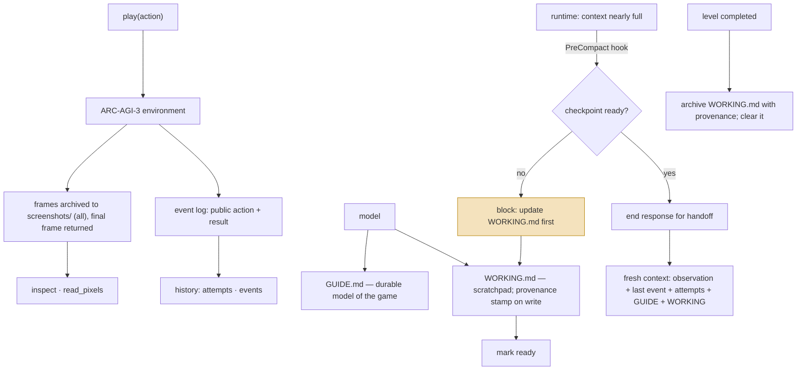
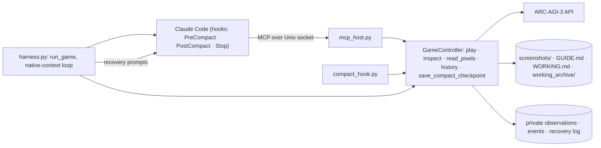

## 1. Executive Summary

VISTA — *A Visual Harness for Reasoning in an Interactive World*, MIT, one
commit dated 2026-09-05 from a group at MIT — plays the ARC-AGI-3
interactive games through a coding-agent runtime, Claude Code or Codex
CLI, and its README reports a 100% win rate over the 25 public games with
Claude Opus 5.0 and scorecards linked from the ARC Prize site. It is in
this atlas because the harness's whole contribution is **memory
engineering for a long horizon**: what a model may look at again, what it
must write down, and when it is allowed to forget.

Three mechanisms. **Frames as memory.** Every environment frame — the
animation frames and the final frame of each turn — is rendered to disk
(`render_observation_frames`, `claude/controller.py:1630`), and three
read-only tools let the model go back to it: `inspect` returns chosen
turns, frames and cropped regions as images enlarged without smoothing;
`read_pixels` samples exact colours; `history` returns the attempt list or a
turn range of public actions and results (`controller.py:1066-1234,1327`).
The README's phrase is *"revisit original evidence"*: the model's memory of
a frame is the frame, not its earlier description.

**A checkpoint before compaction.** The Claude Code runtime is started with
hooks on `PreCompact`, `PostCompact` and `Stop` (`claude/runner.py:877-893`).
On `PreCompact` the hook (`claude/compact_hook.py`) touches a request
marker and answers `block` with the instruction to review and update
`WORKING.md` so it holds the complete continuation state; a `Stop` while
the request is pending is blocked the same way; only once the controller
has marked the checkpoint ready does the hook let the response end for
handoff. The controller refuses to play while a checkpoint is pending
(`controller.py:676-683`) and refuses to mark it ready if `GUIDE.md` or
`WORKING.md` is empty (`controller.py:486-520`).

**Recovery from files plus the exact last event.** After compaction, a
credential rate limit, a runtime restart or a fresh-session `RESET`, the
harness builds a new prompt from the current observation, the last action
result, the attempt history, `GUIDE.md` and `WORKING.md` with its
provenance (`claude/recovery.py`, `controller.py:522-588`), and the tests
assert the recovery includes the exact last event
(`tests/test_claude_controller.py:1666`) and fails closed when the files are
missing or empty (`:1831,1873`).

The memory is one game deep. `GUIDE.md` starts every game as *"No reliable
model yet."* (`claude/harness.py:58,235`), nothing is carried between games
in a batch, and the harness never reads what the model wrote into the
guide. Every capability mark is withheld: there is no state on a memory,
no scope beyond the directory, no adjudication, and the archive is a log
of frames rather than a record of mutations.

## 2. Mental Model

A game is a directory. The model's memory has three layers with different
owners:

The highlighted transition is the one worth taking away. The runtime's
compaction is a summariser the harness does not trust with the game
state, so the harness refuses to let it run until the model has written,
in its own words and in a file the harness can hand back, everything a
successor needs. The summary that survives compaction is therefore
authored by the model on purpose rather than produced by the runtime on
overflow — the opposite of [SiYuan](../siyuan/)'s approach, where the
summary is generated and then labelled untrusted.

Nothing here is a belief with a state. A frame is evidence; a guide is
whatever the model wrote; a working note has a provenance stamp saying
which turn and state it was saved at, so a stale note can be recognised
by turn, not by content.

## 3. Architecture

Python 3.12, 11,973 lines under `src/vista_arc3/`, 224 tests in twelve
files, one commit. Two parallel runtimes share a controller design:

- `claude/` — `controller.py` (1,722 lines: the game controller, tools,
  archive, recovery), `runner.py` (Claude Code invocation with hooks,
  permission mode, credential relay), `harness.py` (per-game setup and
  the native-context loop), `mcp_host.py` (an authenticated Unix-socket
  MCP host serving the game tools), `mcp_bridge.py`, `compact_hook.py`,
  `recovery.py` (the prompts), `quota.py` (rate-limit signals), `tools.py`
  (the tool schemas).
- `codex/` — the same shape for Codex CLI.
- `batch.py` — every available game on one shared scorecard.
- `shared/` — rendering, palette, HTTP.

### Deployment and ergonomics

- **What has to run:** Linux x86_64, Docker, Python 3.12, and Claude Code
  2.1.220 or Codex CLI 0.145.0 per the README; an ARC-AGI-3 API key for
  online runs.
- **Fully local and offline:** no; the games and the models are remote.
- **Hand-repairable:** yes, unusually. The memory is three files and a
  folder of images a person can open.
- **Install:** a Python package plus a container per player.

## 4. Essential Implementation Paths

**Play.** `GameController.handle` (`controller.py:632`): refuses while a
retry, compact recovery or checkpoint is pending; validates the action
against the environment's available actions and the display size; sends
it; stores the observation privately (`_store_observation`, line 1541);
renders every frame to `screenshots/`; appends a public event; returns the
final frame. `test_valid_action_archives_all_frames_but_returns_last`
(`test_claude_controller.py:257`) is the contract.

**Inspect.** `_inspect` (line 1199) takes a question, up to a bounded number
of views each naming a turn, an optional frame and an optional region in
the game's own coordinates, and returns the crops in request order;
`_inspection_view` (1234) enlarges without smoothing. Unavailable before
the first visual observation (test at 486).

**History.** `_history` (1066): `attempts` — each attempt's start, outcome,
action count and turn span — or `events` between two turns with a limit;
events carry the public action and result only, with environment
coordinates and the raw grid stripped
(`test_history_exposes_only_public_actions_and_environment_results`, 923).

**Checkpoint.** `request_compact_checkpoint` (457) touches the marker and
logs the reason; `complete_compact_checkpoint_from_working` (486) requires
the marker, non-empty `GUIDE.md` and `WORKING.md`, and the provenance
file, then touches *ready*. In the Claude runtime the checkpoint is
committed by the model's own write to `WORKING.md`
(`test_claude_checkpoint_is_committed_by_write_working`, 1538); in Codex by
a `save_compact_checkpoint` tool (`_save_compact_checkpoint`, 816).

**Recovery.** `begin_compact_recovery` (522) snapshots the guide, sets a
restore marker, and returns guide, working memory, current observation,
last action result, attempt history and the current images;
`compact_recovery_prompt` (`recovery.py`) renders them; `complete_compact_recovery`
(589) clears the markers. `begin_retry_recovery` (380) does the same for a
fresh-session `RESET`, with the staged retry state committed to
`WORKING.md` (`_stage_retry_state`, `_commit_retry_state`, 966-997);
`begin_runtime_recovery` (313) for a restart that did not change the game.

**Level boundary.** `_archive_level_working` (914) writes `WORKING.md` and
a JSON of its provenance and the progress before and after into
`working_archive/turn_NNNNNN.*`, then clears it; the test at 1355 says
this does not block play.

**Hooks.** `runner.py:859-893` writes a settings block with the hook command
and its environment; `compact_hook.py` is mounted read-only into the
container (`runner.py:995`); `test_mcp_and_hook_commands_remove_parent_credentials`
(`test_claude_runner.py:352`) checks that neither the MCP host nor the hook
inherits the parent's credentials.

## 5. Memory Data Model

**Frames.** Images per turn and frame under `screenshots/`, addressed by
`(turn, frame)`; the archive is complete and never pruned during a game.

**GUIDE.md.** Free text the model owns. Seeded with *"No reliable model
yet."*; the prompt (`claude/prompt.md`) asks for *"concise, durable,
revisable game understanding"*. The harness reads it only to check it is
non-empty at a checkpoint and to hand it back.

**WORKING.md.** Free text the model owns, plus a provenance JSON the
harness writes on every change: turn, state, progress and the turn the
level started (`_record_working_provenance`, 1003). A retry state written
at `RESET` carries `source: reset_handoff` and the attempt number.

**Events.** Public `{turn, action, result}` records the `history` tool
reads; private observations with the raw grid live beside them and are
not exposed.

**Temporal:** every artefact is stamped with a turn; the provenance file
says when a note was written; the archive says when a level ended. No
validity interval, and `bitemporal` is withheld — a note is stale by turn
count, not by a declared end.

**Trust:** none on content. `trust_state` withheld.

**Scoping:** one game, one directory; `scope_enforced` withheld.

## 6. Retrieval Mechanics

The model retrieves by asking. The three tools are read-only and
annotated as such in their schemas (`tools.py:226-293`), and each is
bounded: a maximum number of views per `inspect`, a limit of 128 events
per `history`, a size cap on labels and questions. There is no search over
the guide or the notes — they are files the model reads whole — and no
ranking anywhere.

**Failure modes:** the model must know which turn to look at; a long game
makes the archive large; and the `history` view is a projection that hides
the raw grid, so a model that needs it must `inspect` the frame instead.

## 7. Write Mechanics

**The model writes files.** `GUIDE.md` and `WORKING.md` are ordinary files
the runtime's own tools edit. What the harness adds:

- **Provenance on WORKING.md.** Each write is stamped with the turn and
  state, so a recovery prompt can say when the note was saved
  (`retry_recovery_prompt` wraps it as `{saved_at, content}`).
- **Archiving at level boundaries,** so the scratchpad of a finished level
  is kept with its progress record and the next level starts clean.
- **Atomic writes** (`atomic_write_text`, 1717) with mode 0600 on every
  harness-written file.
- **A checkpoint that cannot be marked ready empty,** and a failure that
  never marks it ready (`test_compact_checkpoint_failure_never_marks_ready`,
  1831).

**Conflicts:** none; one writer per game.

**Malicious input:** the environment returns grids; the model writes the
notes; nothing else enters.

### Operational cost

- A turn is one environment call plus frame rendering; an `inspect` is
  file reads and crops.
- The archive grows by every frame of every turn.
- Recovery costs one fresh context: the files, the last event, the current
  frame.
- Compaction is deferred, not avoided; when it runs, the runtime's own
  summary is discarded in favour of the files.

## 8. Agent Integration

The runtime is the agent. For Claude Code the harness sets the permission
mode, an `--allowedTools` list and the hooks (`runner.py:1030-1032,
890-893`), serves the four tools over an authenticated Unix-socket MCP host,
relays credentials on a rate-limit boundary (`quota.py`,
`harness.py:483-515`) and asserts the runtime used the expected permission
mode (`runner.py:1189`). For Codex the same controller sits behind a
`save_compact_checkpoint` tool instead of a hook. The player instructions
are eight lines (`claude/prompt.md`): state expectations before each
`play`, report visible changes after, keep the guide and the scratchpad.

## 9. Reliability, Safety, and Trust

**What holds.** Compaction is gated on a checkpoint the harness can verify
is non-empty; every recovery path fails closed on missing files and is
tested; the play path refuses while any recovery is pending; the archive
is complete; the hook and the MCP host run without the parent's
credentials.

**What is withheld, and why.** `audit_log`: the recovery log and the event
JSONL are logs of the environment and the harness, not records of memory
mutations. `human_review`: nothing waits for a person. `negative_eval`: the
`history` test asserts that private coordinates and the raw grid are
absent from a populated result, which is a projection of an internal
record rather than a retrieval that must leave out a memory; it is the
nearest thing here and is not the mark. `tombstone`: nothing is rejected.

**What the harness cannot know.** Whether `GUIDE.md` is right. The
checkpoint check is emptiness; a confident wrong guide survives
compaction as faithfully as a correct one.

## 10. Tests, Evals, and Benchmarks

224 tests in twelve files. `tests/test_claude_controller.py` carries the
memory contract: frames archived and last returned (257), inspect
without state change (374), independent views in request order (416),
history exposing only public data (923), compact recovery into a fresh
thread (1477), checkpoint committed by a write to `WORKING.md` (1538),
recovery including the exact last event (1666), checkpoint atomically
updating guide and working memory (1723), failure never marking ready
(1831), recovery failing closed (1873), and level boundaries archiving and
clearing the scratchpad (1355-1455). The Codex files mirror them.

The benchmark claims are the README's: scorecards on the ARC Prize site
for Codex with GPT-5.6 and Claude Code with Opus 5.0. Nothing in the
repository reproduces them and no results are committed; the atlas does
not run benchmarks.

## 11. For Your Own Build

### Steal

- **Gate compaction on a checkpoint the model writes.** A `PreCompact`
  hook that answers *block* until a continuation file exists turns the
  runtime's summariser into a fallback the model authors on purpose.
- **Keep original evidence retrievable as evidence.** An archive of frames
  with a bounded `inspect` costs disk and saves the model from trusting its
  own earlier description.
- **Stamp working memory with when it was written.** A provenance record
  of turn and state lets a recovery prompt say how old the note is.
- **Make every recovery path a test that fails closed.** Compaction, rate
  limit, restart, reset — each has a test that the files must exist and be
  non-empty.

### Avoid

- **Assuming the checkpoint is good because it is non-empty.** The gate is
  syntactic.
- **Carrying nothing between episodes** when the task rewards it; VISTA's
  choice is right for a benchmark and wrong for an assistant.

### Fit

VISTA fits anyone running a coding-agent runtime on a long interactive
task who has watched compaction destroy the state. The hook, the
checkpoint files and the recovery prompt transfer to any task with a
"current state plus notes" shape. It is not a memory system for an
assistant and does not claim to be.

## 12. Open Questions

- **What does the model actually write in `GUIDE.md`**, and how often is
  it wrong at a checkpoint? The repository commits no transcripts.
- **How much of the result is the frame archive** versus the checkpoint
  discipline? The README ablates neither.
- **Does the Codex path lose anything** by using a tool rather than a hook
  for the checkpoint? The tests are parallel; the behaviour under a
  runtime-initiated compaction was not traced.

## Appendix: File Index

- `src/vista_arc3/claude/controller.py` — `CompactRecovery`, `RetryRecovery`,
  `RuntimeRecovery` (58-90), `GameController` (206), `begin_runtime_recovery`
  (313), `begin_retry_recovery` (380), `request_compact_checkpoint` (457),
  `complete_compact_checkpoint_from_working` (486), `begin_compact_recovery`
  (522), `complete_compact_recovery` (589), `handle` (632),
  `_save_compact_checkpoint` (816), `_archive_level_working` (914),
  `_stage_retry_state` (966), `_record_working_provenance` (1003),
  `_history` (1066), `_inspect` (1199), `_read_pixels` (1327),
  `_store_observation` (1541), `render_observation_frames` (1630),
  `atomic_write_text` (1717)
- `src/vista_arc3/claude/compact_hook.py` — the PreCompact and Stop
  decisions
- `src/vista_arc3/claude/harness.py` — `EMPTY_GUIDE_MODEL` (58), file
  names (60-64), `write_guide` (103), `run_game` (186),
  `run_task_with_native_context` (441)
- `src/vista_arc3/claude/runner.py` — hooks (859-893), the mounted hook
  (995), tool and permission flags (1030-1032), permission-mode assertion
  (1189)
- `src/vista_arc3/claude/recovery.py` — the recovery prompts
- `src/vista_arc3/claude/tools.py` — `build_play_tool` (66),
  `build_inspect_tool` (226), `build_read_pixels_tool` (294)
- `src/vista_arc3/claude/mcp_host.py`, `mcp_bridge.py`, `quota.py`
- `src/vista_arc3/claude/prompt.md` — the player instructions
- `src/vista_arc3/codex/` — the Codex counterparts
- `tests/test_claude_controller.py` (121-1873), `tests/test_claude_runner.py`
  (308-352), ten more test files

**Searches recorded for the negative claims**

- `rg -n 'GUIDE' src/vista_arc3/batch.py` — two hits (lines 173, 360),
  both runtime preflight probes writing a fresh guide into a temporary
  directory; nothing carries a guide between games.
- `rg -n 'read_text' src/vista_arc3/claude/controller.py` — the guide is
  read only in the checkpoint and recovery paths, never parsed.
- `rg -n -i 'embedding|vector|search' src/vista_arc3` — one hit, the
  Codex runner disabling web search; no retrieval beyond the three tools.

## History

**2026-09-07** — [`900aa3380e4f1120436d83b2ce1115a38ac29bf9`](https://github.com/joshhhhhan/VISTA/commit/900aa3380e4f1120436d83b2ce1115a38ac29bf9) — first reading.
