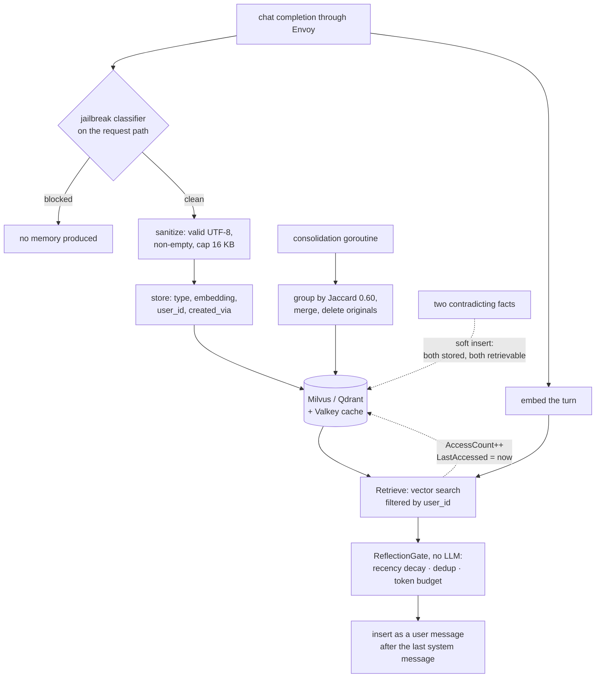

## 1. Executive Summary

The list entry that brought this repository here describes a router: *"sends
routine queries to cheap or local models and hard ones to stronger backends."*
That is accurate and it is about a tenth of what the tree contains.

`src/semantic-router/pkg/memory/` is 10,777 lines of Go implementing a complete
agentic memory system — typed memories, four storage backends behind one
interface, embedding retrieval, an injection gate, a consolidation pass, a
deletion API, and an end-to-end test suite of its own. It runs at the
infrastructure layer: an Envoy external-processing filter sees every chat
completion passing through, stores what it should, and injects what it retrieves,
without the application knowing memory exists.

Four things make it worth reading.

**Memory has a type, and the types are the standard three.** `MemoryType` is
`semantic`, `procedural` or `episodic`, each with an example in the doc comment
— *"User's budget for Hawaii is $10,000"*, *"To deploy payment-service: run npm
build, then docker push"*, *"On Dec 29 2024, user planned Hawaii vacation"*. Most
systems in this atlas that use this vocabulary use it in a README; here it is a
column.

**The deletion surface is in the contract.** The `Store` interface declares
`Forget(ctx, id)` and `ForgetByScope(ctx, MemoryScope)` alongside `Store`,
`Retrieve`, `Get`, `Update` and `List`. Targeted deletion in an interface is rare
enough that the [pluggable memory provider](../../patterns/pluggable-memory-provider/)
page counts the contracts that have it.

**The injection gate spends no tokens.** `ReflectionGate` filters retrieved
memories with recency decay on a configurable half-life, redundancy dedup against
a similarity threshold, and a hard token budget defaulting to 2,048 — *"No LLM
calls — sub-millisecond overhead"*, because it sits in a proxy where latency is
the product.

**And the most unusual artifact in the tree is a test that documents a missing
feature.** `MemoryContradictionTest` in `e2e/testing/memory_tests/test_pipeline.py`
stores two contradicting facts and asserts *both* are present, above a docstring
that says why: *"The router currently does soft-insert (no contradiction
detection) … This test documents that behavior so we have a baseline when
contradiction detection is added"*, with three papers cited for why it matters.
This atlas spends a great deal of its length on systems whose absent correction
mechanism nobody has written down. Here it is written down, in an assertion.

Where it is weakest is the same place. Nothing supersedes, nothing is marked
wrong, and `Importance` is a float rather than a state. The injected block is
also placed in a way that costs more prompt cache than it needs to — see §7.

## 2. Mental Model

A memory is **a self-contained statement about a user**, and the code says so in
the field comment: content *"should be self-contained with context (e.g.,
'budget for Hawaii is $10K' not just '$10K')"*. That constraint is what makes a
memory safe to retrieve into a session it did not come from.

The lifecycle:

- **Produced.** Either by per-turn chunking on the request path — the pipeline
  test notes *"storage happens on every turn (direct per-turn chunk, no LLM
  call)"* — or by LLM extraction. Which one produced it is recorded:
  `CreatedVia` is `llm_extraction`, `api` or `import`.
- **Admitted.** A memory only exists if the request that produced it got past the
  router's jailbreak classifier. `sanitize.go` states the division: adversarial
  content blocking *"is handled by SR's jailbreak classifier on the request
  path"*, and this function only validates UTF-8, trims, and caps at 16 KB.
- **Reinforced.** Every retrieval increments `AccessCount` and updates
  `LastAccessed`, feeding a retention score the type comment writes as
  `S = S0 + AccessCount` — the [decay and reinforcement](../../patterns/decay-and-reinforcement/)
  shape, with retrieval as the reinforcement signal.
- **Merged.** A background consolidation groups a user's memories by word-level
  Jaccard similarity at 0.60, concatenates each group into one summary memory, and
  **deletes the originals**.
- **Forgotten.** By id, or by scope across user, project and type.

What the state machine does *not* contain is any way for a memory to become
false. Two contradicting statements coexist; the newer one does not supersede the
older one, and retrieval will happily return both. The project knows this and has
written a test asserting the current behaviour so that changing it is a visible
diff.

Control is the operator's and the model's, not the user's. There is no end-user
surface; memories are produced automatically from traffic and removed through an
admin API.

## 3. Architecture

The router is an **Envoy external-processing (ext_proc) filter** written in Go,
sitting in the data path of every request. Memory is one of several filters:
`pkg/extproc/req_filter_memory_context.go` handles injection,
`req_filter_cache.go` is the semantic response cache beside it.

The memory package is layered cleanly:

| Concern | Files |
| --- | --- |
| Contract and types | `store.go`, `types.go` |
| Backends | `milvus_store*.go` (nine files), `qdrant_store.go`, `valkey_store*.go`, `inmemory_store.go`, `redis_cache.go`, `caching_store.go` |
| Write-side policy | `extractor.go`, `sanitize.go` |
| Read-side policy | `reflection.go`, `filter_registry.go`, `embedding.go`, `embedding_deterministic.go` |
| Maintenance | `consolidation.go` |
| Operations | `metrics.go`, `pkg/apiserver/route_memory.go` |

`filter_registry.go` and the `MemoryFilterFactory` indirection mean the injection
gate is selectable by config — `heuristic` is the registered implementation, with
a per-decision override on top of a global default, so a route can tighten its own
budget.

### Deployment and ergonomics

This is the heavy end of the atlas. Running it means Envoy, the router binary,
classifier models, an embedding path, and a vector database — Milvus or Qdrant —
plus Valkey or Redis if the caching store is on. `inmemory_store.go` exists for
tests, not for production.

Nothing here is local-first and nothing degrades gracefully to a file on disk.
The store is not human-readable and not repairable by hand; the `/v1/memory` REST
surface is how an operator sees inside it. That is a reasonable trade for
something whose job is to sit in front of a fleet, and it is the wrong shape
entirely for a single developer.

## 4. Essential Implementation Paths

**Capture.** The ext_proc request filter chunks the turn, or the extractor
produces memories with a model. `sanitizeMemoryContent` validates and caps.
`Store.Store` writes, with `CreatedByUserID`, `ConversationID` and `CreatedVia`
carried onto the row.

**Retrieval.** `Store.Retrieve(ctx, RetrieveOptions)` runs an embedding search in
the configured backend. `milvus_filter.go` builds the scope predicate; the
`List` contract states plainly that *"UserID is required"*.

**The gate.** `NewMemoryFilter()` resolves the algorithm from config and
delegates; `NewReflectionGate` merges the global config with a per-decision
override and returns `nil` when reflection is disabled. Defaults: 2,048 inject
tokens, a 30-day recency half-life, and an empty block-pattern list —
`defaultBlockPatterns` is deliberately empty, with the comment pointing at the
jailbreak classifier as the real defence and the regex list as an operator
extension. The design note names its source: *"Inspired by RMM (ACL 2025)
retrospective reflection, adapted for infrastructure-layer operation where
latency must be minimal."*

**Injection.** `injectMemoryMessages` in
`pkg/extproc/req_filter_memory_context.go` parses the request body, builds a
`user` message ending *"Use this context to personalize your response when
relevant. Do not repeat it verbatim unless asked."*, walks the message list to
find the last `system` or `developer` message, and inserts immediately after it.
The comment attributes the shape: *"following the openai-agents-python pattern
where context is injected as conversation items rather than appended to the
system prompt."*

**Consolidation.** `ConsolidateUser(ctx, store, userID)` lists up to 100
memories, groups them with `groupBySimilarity` at a 0.60 word-level Jaccard
threshold, concatenates each group's contents into one summary and deletes the
originals. It takes the `Store` interface, so it runs against any backend, and
the doc says it is *"designed to be called from a background goroutine on a
schedule."*

**Deletion.** `route_memory.go` exposes `GET /v1/memory`, `GET /v1/memory/{id}`,
`DELETE /v1/memory/{id}` and `DELETE /v1/memory?type=…`, the last mapping onto
`ForgetByScope`.

## 5. Memory Data Model

`Memory` is the schema and it is unusually complete for a system nobody thinks of
as a memory system:

| Group | Fields |
| --- | --- |
| Identity and content | `ID`, `Type`, `Content`, `Embedding` |
| Scope | `UserID`, `ProjectID` |
| Time | `CreatedAt`, `UpdatedAt`, `LastAccessed` |
| Salience | `AccessCount`, `Importance` |
| Provenance | `Source`, `CreatedByUserID`, `ConversationID`, `CreatedVia` |

Two of those are worth pausing on. `CreatedByUserID` is separate from `UserID`,
which lets a memory be *owned* by one principal and *sourced* from another
conversation — the distinction most systems collapse. And `CreatedVia`
distinguishing `llm_extraction` from `api` from `import` means an operator
deleting bad memories can tell which pipeline produced them, which is the first
thing anyone wants during an incident.

What is absent: no validity interval (three timestamps, all record time, so not
bi-temporal), no supersession pointer, no version chain, no discrete trust state,
and no tombstone. `Importance` is a float in `0.0..1.0` and nothing in the read
path treats a low value as *withheld* rather than *lower-ranked*.

## 6. Retrieval Mechanics

Retrieval is **vector-only**, with no lexical arm and no graph. The embedding path
has a deterministic variant (`embedding_deterministic.go`) used to make tests
reproducible.

The interesting half is what happens after the search. `ReflectionGate` applies,
in order:

- **Recency decay** on a half-life measured in days, defaulting to 30, so an old
  memory has to score higher on similarity to survive.
- **Redundancy dedup** against a configurable threshold, so two near-identical
  memories do not both occupy the budget.
- **A token budget**, default 2,048, enforced as a hard cap on what gets injected.
- **Block patterns**, empty by default, as an operator escape hatch.

Doing all of that with regexes and arithmetic rather than a model is the correct
call for a proxy, and the comment says so. The cost is that every judgement is
made on surface form: dedup is similarity, not equivalence, and nothing detects
that two surviving memories say opposite things.

The failure mode the project itself names is the one to take seriously. Its
contradiction test cites RoseRAG for the finding that *small models degrade more
from wrong context than no context*, and Hindsight and RMM for requiring explicit
validation before injection. A router that serves cheap models is precisely the
deployment where injecting a stale fact is most costly, and the gate does not
check.

## 7. Write Mechanics

Writes happen **on the request path**, which is the defining constraint. The
pipeline test states the default: per-turn chunking with no model call, so the
common case adds no inference to a request the proxy is already handling. LLM
extraction exists as the other route and is recorded per memory.

Deduplication is not done at write; it is done at read (the gate) and in the
background (consolidation). Consolidation is the destructive one: it merges a
group and deletes the originals, so the pre-merge text is gone and the merged
summary carries no pointer to what it replaced.

Conflict handling is, by the project's own test, absent. Both facts are stored.

Filtering of malicious input is delegated upward, and the delegation is explicit
in two places rather than implied: the jailbreak classifier gates the request, so
*"only clean requests produce memories"*. That is a genuinely good arrangement —
the memory layer inherits a defence the router already had — and it has the
property that anyone deploying the memory feature with classification disabled
loses it silently.

### Operational cost

The write path is **synchronous but usually free**: per-turn chunking costs a
string operation and an embedding call, not a completion. When LLM extraction is
enabled it costs a model call on the request path, which for a latency-sensitive
proxy is the reason the default is the other one.

Lag before a memory is retrievable is a vector-store write, so effectively
immediate.

Consolidation reads up to 100 memories per user per run and writes one summary per
group; its bill scales with users rather than with traffic, and nothing in the
tree schedules it — that is left to the operator.

On the read path, injection is bounded at 2,048 tokens by default, which is a real
answer to a question most systems here leave open.

The **placement** is the part worth criticising, and it is close to right.
Inserting the memory block as a message rather than into the system prompt keeps
the system prompt byte-identical, which is the first half of
[cache-preserving injection](../../patterns/cache-preserving-injection/). But the
insertion index is *immediately after the last system or developer message* —
the front of the conversation — so when the retrieved set changes between turns,
every message after it differs too, and the provider's prefix cache misses on the
whole conversation. Appending the block to the current user turn instead would
keep the entire history cached and cost nothing in what the model sees. The
distance between the code and the better arrangement is the choice of
`insertIdx`.

## 8. Agent Integration

There is no SDK and no MCP server, and that is the design: the integration is
**the network**. Any OpenAI-compatible client behind this Envoy filter gets memory
without a line of application code, which is the strongest form of the
infrastructure-layer bet and the reason the memory has no idea what agent it is
serving.

The consequences run both ways. Nothing has to be adopted, and equally nothing can
be steered: the model cannot decide to remember something, cannot address a
memory, cannot ask what it knows, and cannot correct anything. `user_id` has to
arrive from somewhere in the request, which is the integration's real coupling
point.

The `/v1/memory` API is the operator's surface — list, get, delete by id, delete
by scope. There is no memory page in the dashboard front-end, so this is a REST
API rather than a review UI, and nothing holds a memory pending anyone's approval.
That is the near-miss on human review here: the deletion mechanism a reviewer
would need exists, and the place a person would use it does not.

## 9. Reliability, Safety, and Trust

**User isolation is treated as a security property**, and the test file says so in
its first line: *"User memory isolation (security) tests. Verifies that memories
stored by one user are never visible to another, both at the Milvus storage level
and via the router's retrieval path."* Two users, a secret each — a PIN and a
password — stored with a follow-up turn, then cross-checked. Testing the boundary
at both the storage layer and through the live retrieval path is the thorough
version; most systems in this atlas that scope correctly test neither.

**Prompt-injection defence is upstream and stated.** The memory layer does not
try to detect adversarial content; the router's jailbreak classifier does, on the
request, before a memory can be produced. `sanitize.go` and `reflection.go` both
document this rather than leaving a reader to assume the regexes are the defence.

What is open:

- **Contradiction.** Named, tested, unimplemented. A stale fact and its
  replacement both live in the store and both can be retrieved into the same
  prompt.
- **Consolidation is lossy and unrecorded.** A merge deletes its inputs. If the
  Jaccard grouping puts two unrelated memories in one group — 0.60 word overlap is
  not a semantic guarantee — the merged summary is the only survivor and nothing
  says what it came from.
- **`Importance` does nothing epistemic.** It ranks; it cannot withhold.
- **Deletion is not proven to propagate.** `ForgetByScope` exists in the
  interface; whether a deleted memory is also evicted from the Valkey/Redis
  caching store was not traced in this reading, and a caching layer over a
  deletable store is exactly where a forgotten memory comes back.

## 10. Tests, Evals, and Benchmarks

Unit coverage across the memory package is broad — a `_test.go` beside almost
every source file, including two integration test files for the Valkey backend
and a dedicated `milvus_filter_test.go` for the scope predicate.

The end-to-end suite is the part to read. `e2e/testing/memory_tests/` holds five
files with distinct jobs: `test_pipeline.py` (store-then-inject, verified through
an echo backend in a *new* session so a hit can only have come from the store),
`test_isolation.py` (the security case), `test_storage.py`, `test_per_decision.py`
(the per-route config override), and `test_chat_completions.py`.

Two design decisions in that suite are worth copying. Retrieval assertions are
made in a **new session with no `previous_response_id`**, so a pass cannot be
explained by conversation history — the control most memory tests omit. And the
contradiction test is a **characterisation test for an absence**, with the
research basis in the docstring and an explicit statement that it exists to be a
baseline. A test that will fail when the feature is added, on purpose, is a
better record of a known gap than a TODO.

No benchmark of memory quality is committed — no LoCoMo, no LongMemEval, no
recall figures. `metrics.go` exports operational counters, not quality ones.

I ran nothing. Every claim here comes from reading the tree at
`6ae15901163cb9790d1b7c9d72b5caefad21ee78`.

## 11. For Your Own Build

### Steal

- **Write a characterisation test for the mechanism you have not built.** Store
  two contradicting facts, assert both survive, and put the citation for why that
  is bad in the docstring. It costs one test, it makes the gap legible to every
  future reader, and it turns adding the feature into a visible diff instead of a
  silent behaviour change.
- **Assert retrieval in a fresh session.** A memory test that runs inside the
  conversation that stored the fact proves nothing. Dropping the continuation id
  and checking through an echo backend is the control that makes the result mean
  what it says.
- **Separate the owner of a memory from its source.** `UserID` versus
  `CreatedByUserID` plus `ConversationID` plus `CreatedVia` is four fields, and
  together they answer "whose is this, where did it come from, and which pipeline
  made it" — the three questions an operator asks when memories go wrong.
- **Put deletion in the interface, at two granularities.** `Forget(id)` and
  `ForgetByScope(user, project, types)` is the pair that makes a deletion request
  answerable, and almost no host contract in this atlas has either.
- **Gate injection without a model.** Recency decay, dedup and a hard token budget
  are arithmetic. If your injection sits on a latency-sensitive path, that is the
  whole gate you can afford, and it is worth more than nothing.

### Avoid

- **Do not put the memory block at the front of the conversation.** Keeping it out
  of the system prompt is the right instinct and only half the work: anything
  inserted before the history invalidates the cached prefix for every message
  after it. Attach it to the current turn.
- **Do not let consolidation delete its inputs without recording them.** A merge
  driven by word overlap will eventually merge two things that were not the same,
  and if the originals are gone the mistake is unrecoverable and invisible.
- **Do not ship a salience float and call it trust.** A score changes ranking; it
  cannot stop a memory being used. If some memories must not be treated as true,
  that needs a state.

### Fit

This suits an operator running a fleet behind a gateway who wants memory to be a
platform capability rather than an application feature. The infrastructure-layer
bet pays exactly there: no client changes, one place to configure, one place to
audit, and per-route policy overrides.

It is the wrong shape for anyone who wants the *agent* to participate in its own
memory. There is no tool, no addressing, no correction, and by design the model
does not know memory exists. And it is the wrong shape for a small deployment —
Envoy, classifier models and a vector database is a lot of moving parts to carry
before the first memory is stored.

## 12. Open Questions

- Does `ForgetByScope` invalidate the Valkey/Redis caching layer? The store
  interface is implemented by `caching_store.go` as a decorator; whether deletion
  passes through was not traced.
- What actually produces `user_id` in a deployment? Isolation is enforced against
  it, so where it comes from on the wire is the security boundary, and that lives
  in the router configuration rather than in the memory package.
- Is consolidation scheduled anywhere by default, or purely operator-driven? The
  function documents a background goroutine; this reading found no scheduler.
- How is `Importance` set? It is stored and ranked on; which write path assigns a
  value other than zero was not established.

## Appendix: File Index

**Contract and schema**
`src/semantic-router/pkg/memory/store.go` · `types.go`

**Backends**
`milvus_store.go` and its eight siblings · `qdrant_store.go` ·
`valkey_store.go` · `inmemory_store.go` · `caching_store.go` · `redis_cache.go`

**Write-side policy**
`extractor.go` · `sanitize.go`

**Read-side policy**
`reflection.go` · `filter_registry.go` · `embedding.go` ·
`embedding_deterministic.go` · `milvus_filter.go`

**Injection**
`src/semantic-router/pkg/extproc/req_filter_memory_context.go`

**Maintenance and operations**
`consolidation.go` · `metrics.go` ·
`src/semantic-router/pkg/apiserver/route_memory.go`

**Tests**
`e2e/testing/memory_tests/test_isolation.py` ·
`e2e/testing/memory_tests/test_pipeline.py` ·
`e2e/testing/memory_tests/test_per_decision.py` ·
`e2e/testing/memory_tests/test_storage.py` ·
`src/semantic-router/pkg/memory/*_test.go`

## History

**2026-08-09** — [`6ae15901163cb9790d1b7c9d72b5caefad21ee78`](https://github.com/vllm-project/semantic-router/commit/6ae15901163cb9790d1b7c9d72b5caefad21ee78) —
first reading, from the
[awesome-ai-tokenomics triage](https://github.com/QuesmaOrg/awesome-ai-tokenomics),
where the entry describes only cost-aware model routing. Screened before reading:
1 auto-run surface (`.github/copilot-instructions.md`) and an `AGENTS.md` treated
as data. Nothing was executed and nothing was installed.
