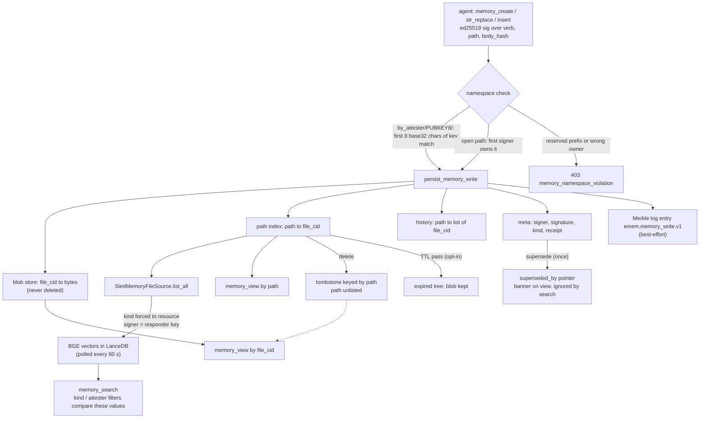

## 1. Executive Summary

emem is a Rust server, exposed over MCP and REST, that Vortx AI runs at
`emem.dev` and publishes for self-hosting. It holds two kinds of memory. The
first is a fact plane: signed values about a geographic cell, band and time
slot, materialised from open Earth-observation sources and cited by a token
that resolves to byte-identical signed bytes. The second is a note plane:
Markdown files an agent writes with the verbs of Anthropic's memory tool,
each signed by an ed25519 key and addressed by the hash of its content.

What is notable is the provenance engineering. Every receipt verifies
offline, every attestation and every note create or edit lands in a Merkle
log with inclusion and consistency proofs, and facts carry separate observation and
record times. What is weak is the note plane's retrieval: the search index
attributes every note to the server's own key and every note to kind
`resource`, so the per-author filter that the code offers as tenant
isolation matches no agent's key.

This is not [eMEM](../emem/), the robot spatio-temporal memory from
automatika-robotics that shares the name. The licence is Apache-2.0;
`TERMS.md` governs only the hosted instance.

The fact plane is closed to strangers. An address is written by the
server's own materialiser, a device enrolled through its OS-trace gate, or a
key the operator lists; any other key contributes a *derivation* that cites
its parents, is attributed to its signer, and is absent from every default
read (`crates/emem-storage/src/lib.rs:262-320`, `:1005-1039`). That rule is
the design's answer to memory poisoning, and the tree records why it was
needed: `emem-purge-fnkey` exists because model-guessed elevations signed
under `claude_knowledge@1` had occupied real addresses and overridden the
materialiser (`crates/emem-cli/src/bin/emem-purge-fnkey.rs:1-18`).

The note plane is the part agents write. Reads are public by design —
*"a shared, world-readable commons"* in the code's words
(`crates/emem-api-rest/src/lib.rs:42124-42126`) — and writes are gated by
signature and namespace.

Three marks: `bitemporal` on the fact plane, `audit_log` on the Merkle log,
and `negative_eval` on a committed scope-boundary test. Section 9 names the
four withheld and the near miss behind each.

## 2. Mental Model

**A note becomes a belief when its signed write is accepted, and it never
stops existing.** `create` validates the signature over
`blake3("emem.memory_write|" + verb + "|" + path + "|" + body_hash)`, checks
the namespace, and stores the bytes under their content hash
(`crates/emem-api-rest/src/lib.rs:43987-44080`, `:42846-43119`). An edit
points the path at a new `file_cid` and appends to the path's history. The
old bytes stay.

A note leaves circulation in four ways, none of which removes the bytes:

- **Supersede** stamps `superseded_by` on the note's meta, once. A second
  supersession with a different target is refused as *"re-aiming this pointer
  would rewrite history"*, and the target must already resolve
  (`:44352-44531`). Readers see a banner; search does not consult it.
- **Delete** drops the path from the index and writes a tombstone keyed by
  path (`:44533-44566`, `:44576-44766`). The blob stays, and `memory_view` by
  `file_cid` still serves it: the code calls that *"what makes a citation
  outlive its author's retraction"* (`:43319-43420`).
- **Expiry**, when `EMEM_MEMORY_TTL_ENABLED=1`, moves a path to an expired
  tree after its kind's TTL — 30 days for episodic, 90 for resource
  (`:45326-45470`).
- **Consolidation**, when enabled, concatenates more than 50 week-old
  episodic notes in one namespace directory into a responder-signed semantic
  note and marks each source superseded (`:45479`).

**A fact is an observation at an address.** Its valid time is the `tslot`
it describes and its record time is `signed_at`; a read may bound either
(`crates/emem-storage/src/lib.rs:191-257`). The canonical index at an
address stays with the signer that first holds it; a second signer's fact
is stored and reachable by its own id and in the multi-attester index, and
does not take the slot (`crates/emem-cache/src/sled_hot.rs:976-1011`).
When two signers disagree, the opt-in refinement loop draws a
`disagrees_with` edge and marks the lower-confidence fact contested
(`crates/emem-api-rest/src/lib.rs:45700-45860`). A contested fact is still
returned, with the marker attached as advisory metadata
(`crates/emem-primitives/src/recall.rs:513-534`).

Nothing in either plane has a state that stops a memory from being treated
as true. Signatures establish who said a thing and when, and the design says
so: a derivation's receipt attests *"that this attester submitted this
derivation … NOT that the value is true"*
(`crates/emem-api-rest/src/lib.rs:33002`).

## 3. Architecture

**One binary, `emem-server`, runs everything.** It builds
`MaterializingStorage::rooted` over a data directory: a sled database
(`cache.sled`) holding the note trees, attester registry, indexes and trace
gate; a redb file (`facts.redb`) holding facts after a completed migration;
and a `log/` directory of Merkle segments
(`crates/emem-cli/src/bin/emem-server.rs:103-106`,
`crates/emem-storage/src/lib.rs:820-855`). The HTTP router in
`crates/emem-api-rest/src/lib.rs` serves REST, `/mcp` JSON-RPC, SSE and
static documentation, with `/v1/memory/search`, `/memories/*path` and the
attest, log and derive routes among about four hundred `.route(`
registrations (`:1100-1520`).

The crates divide the rest: `emem-fact` (fact, attestation, receipt and
scope types), `emem-cache` (sled and redb), `emem-fetch` (open-data
connectors), `emem-primitives` (recall, search, contradictions, memory ACL),
`emem-mcp` (tool descriptors), `emem-guard` (an action-verdict service
unrelated to memory), and `emem-sleep-agent`, a separate daemon that drives
a running server over its public API
(`docs/sleep-agent.md`).

### Deployment and ergonomics

- **What runs:** one process and a data directory. Dense note search needs
  the BGE-base-en-v1.5 weights under `$EMEM_DATA/models/`; without them
  dense search returns a typed 503 and lexical search still works
  (`crates/emem-primitives/src/memory_search/mod.rs:447-470`).
- **Local and offline:** reads of stored facts and notes need no network;
  materialising a new fact fetches from upstream HTTPS sources.
- **Keys:** no API key to read. Writing a note on a release build requires a
  locally generated ed25519 key, because the default policy refuses unsigned
  writes (`crates/emem-api-rest/src/lib.rs:41574-41603`).
- **Install:** a Docker image or a Cargo build; the CI comments record a
  14 GB compile for the API crate's test harness (`.github/workflows/ci.yml`).
- **Repairable by hand:** not easily. The note store is sled trees of CBOR,
  and the operator tools that exist (`emem-sled-slim`, `emem-purge-fnkey`)
  require the server to be stopped.

## 4. Essential Implementation Paths

- **Note write.** MCP `emem_memory_create` or REST reaches
  `memory_create_inner` (`crates/emem-api-rest/src/lib.rs:43987`), which runs
  `validate_attester_binding`, `enforce_open_namespace_owner` (`:42129-42230`)
  and the rate limit, then `persist_memory_write` (`:42846-43119`): blob,
  path index, by-kind index, history, Merkle log append (`:43030-43036`),
  meta, one awaited fsync, SSE event.
- **Namespace rule.** `namespace_ownership_ok` compares the path segment
  after `/memories/by_attester/` with the first eight characters of the
  signer's base32 key (`crates/emem-primitives/src/memory_acl.rs:69`,
  `:93-96`, `:210-215`). For such a path `enforce_open_namespace_owner`
  returns before reading the stored note's signer
  (`crates/emem-api-rest/src/lib.rs:42161-42163`).
- **Retraction.** `memory_supersede_inner` (`:44352-44531`),
  `memory_delete_inner` with `write_tombstone` (`:44533-44766`),
  `run_memory_ttl_pass` (`:45326-45470`),
  `run_memory_consolidation_pass` (`:45479`).
- **Note read.** `memory_view_inner` by path or by `file_cid`
  (`:43319-43660`); a missing path with a tombstone answers "deleted", one
  without answers "never written" (`:43629-43655`).
- **Note search.** `memory_search` (`crates/emem-primitives/src/memory_search/mod.rs:447-575`)
  tries the Lance table, then a brute-force embed of every note, or runs
  BM25 in `lexical` mode (`:295-330`). Both paths filter on the summaries
  `SledMemoryFileSource::list_all` builds (`crates/emem-api-rest/src/lib.rs:45882-45960`).
- **Fact write.** `put_attestation` (`crates/emem-storage/src/lib.rs:1005-1102`):
  signature check, fact-plane admission, `put_many` into the cache, Merkle
  log append, then best-effort proof, multi-attester and scope-index rows.
- **Fact read.** `recall` (`crates/emem-primitives/src/recall.rs:275-560`)
  selects the global index or `scan_cell_in_scope`, applies the as-of
  bound, attaches contested markers, and signs a receipt.
- **Tests.** Inline `mod tests` in `lib.rs` from line 80,894; integration
  tests in `crates/emem-primitives/tests/`.

## 5. Memory Data Model

**Notes** are spread over sled trees named in
`crates/emem-storage/src/lib.rs:43-120`: `memory_files` (path to
`file_cid`), `memory_file_blobs` (`file_cid` to bytes), `memory_file_history`
(path to a CBOR list of cids), `memory_file_meta` (`file_cid` to
`MemoryFileMeta`), `memory_files_by_kind`, `memory_files_expired`,
`memory_tombstones` and `memory_vault`. `MemoryFileMeta` records path,
`signed_at`, size, verb, kind, the attester key, its signature and signed
body hash, the Merkle entry hash and `superseded_by`
(`crates/emem-api-rest/src/lib.rs:42861-42879`).

Meta is keyed by content, so two paths holding identical bytes share one
meta row, and the later write's signer and path overwrite the earlier.

**Facts** are CBOR `Primary`, `Absence` or `Derivative` records in redb,
indexed by `cell\0band\0tslot` (`crates/emem-cache/src/sled_hot.rs:967-1037`).
The multi-attester index keeps every signer's cid at an address, and the
scope index keys a fact under
`user \0 agent \0 run \0 org \0 cell \0 band \0 tslot` when its attestation
carries a scope (`crates/emem-storage/src/lib.rs:143-160`, `:1740-1768`).

**Edges** are `EdgeFact` rows with `valid_from`, `valid_to`, confidence and
signer, indexed subject-first and object-first (`:115-140`).

**Kinds** follow the CoALA split: `episodic` (30-day TTL), `semantic` and
`procedural` (no TTL), `resource` (90 days) and `vault`, which is sealed and
kept out of the plaintext trees (`docs/memory.md`).

**Scope** differs by plane. Notes have no read scope at all; facts have an
opt-in four-part scope with exact-tuple matching.

## 6. Retrieval Mechanics

**Note search scores every row.** The Lance table carries no vector index,
so each dense query is an exhaustive cosine scan, measured in the docs at
2.2 s over 18,269 rows (`docs/memory.md`). Lexical mode ranks by BM25 over
the text read through the same source, and the MCP tool description says
dense retrieval recovered numeric entries 0–16.7% of the time against 100%
for BM25 (`crates/emem-mcp/src/lib.rs:1947`).

**The search filters compare against values the index source invents.**
`SledMemoryFileSource::list_all` builds each row's `attester_pubkey_b32`
from `m.receipt.responder` — the server's key — and sets `kind` to the
literal `"resource"` under a comment saying the taxonomy has not landed
(`crates/emem-api-rest/src/lib.rs:45927-45945`). The taxonomy has landed:
writes store the real kind and `memory_list_by_kind` reads it. So a search
with `attester_pubkey_b32` set to any agent's key returns nothing, a search
with `kind: "semantic"` returns nothing, and every hit reports the
responder as its author.

The consequence reaches past ranking. The search primitive's own comment
names `path_prefix` and `attester_pubkey_b32` as how *"Per-tenant
memory-file isolation is expressed"*
(`crates/emem-primitives/src/memory_search/mod.rs:52-63`), the MCP tool
tells agents to filter by them, and the README says search returns a note's
*"author's public key"* (`README.md:98`, `:111`). Of the three filters, only
`path_prefix` works.

**Superseded notes rank as if current.** Nothing under
`crates/emem-primitives/src/memory_search/` reads `superseded_by`. A reader
who follows a hit to `memory_view` sees the banner; the hit list does not.

**Fact recall is by address, not relevance.** It reads the canonical index
or the scope index for a cell, optionally narrowed by band and `tslot`,
bounded by `as_of_tslot` and `as_of_signed_at`, and filtered by provenance
class when asked (`crates/emem-primitives/src/recall.rs:275-445`).

## 7. Write Mechanics

Writes are explicit tool calls; nothing extracts memories from
conversation. The docs state the boundary: *"emem doesn't extract entities
from free-form messages"* (`docs/memory.md`).

A note write is synchronous: the handler awaits one sled fsync before
returning, and refuses to report success if the flush fails
(`crates/emem-api-rest/src/lib.rs:43040-43083`). The comment beside it
records the failure that led there — fsyncs on async workers wedging the
runtime, with 465 watchdog snapshots.

Signing covers the whole body after an edit, and `rename` signs the
destination with the source as body, so a captured signature cannot move a
different file (`docs/memory.md`). Rename writes no history entry and no
log record (`crates/emem-api-rest/src/lib.rs:44768-44990`).

Deduplication is by content: identical bytes share a blob and a meta row.
There is no paraphrase merging except in the separate LLM sleep-time daemon,
which writes its merged note back through the public `memory_create`
(`docs/sleep-agent.md`).

Fact writes need admission. `FactPlanePolicy::admits` accepts the
responder key, operator-listed keys, or `EMEM_FACT_PLANE_OPEN=1`; enrolled
devices pass the trace gate first (`crates/emem-storage/src/lib.rs:262-320`,
`:1005-1039`). Its doc comment records that until it existed the plane *"was
open to any key that could produce a valid ed25519 signature"*.

### Operational cost

- **Blocking:** yes for writes, on one fsync plus the Merkle append.
- **Lag:** a new note is found by lexical search at once, and by dense
  search after the next poll (60 s by default). The comment promising the
  brute-force fallback covers the gap holds only when the Lance scan returns
  nothing, since the fallback runs on an empty result
  (`crates/emem-primitives/src/memory_search/mod.rs:495-520`).
- **Whole-store passes:** the indexer's `list_all` walks every path and meta
  row each poll; TTL walks every path hourly; consolidation daily. No model
  call runs in the server.
- **Injection:** none. The server answers calls; what enters a prompt is the
  caller's choice.

## 8. Agent Integration

The MCP surface carries `emem_memory_create`, `_str_replace`, `_insert`,
`_view`, `_rename`, `_delete`, `_supersede`, `_list_by_kind`, `_search`,
`_token`, `_bundle` and `_contradictions`, beside the geospatial read tools
(`crates/emem-mcp/src/lib.rs`). The verbs match Anthropic's memory tool, so
a client built for that tool can point at emem, with the signature added.

The agent has full control of its own namespace and no reach into another's
beyond the 8-character prefix rule. Tokens are the integration idea: an
`emem:fact:` or `file_cid` passed between agents resolves to the same signed
bytes on any replica, so a handoff carries a reference rather than a
paraphrase.

A Claude Code plugin manifest, a `server.json` registry entry, Python and
TypeScript SDKs, and LangMem and LlamaIndex adapters sit under `plugins/`
and `sdks/`. There is no session hook: the agent decides when to read and
write.

## 9. Reliability, Safety, and Trust

**Namespace ownership is a 40-bit match.** A `by_attester` path is owned by
any key whose base32 encoding starts with the same eight characters
(`crates/emem-primitives/src/memory_acl.rs:69`, `:210-215`), and
`enforce_open_namespace_owner` returns before comparing the stored note's
full signer key (`crates/emem-api-rest/src/lib.rs:42161-42163`). A key
ground to collide on the prefix can edit, supersede or delete another
agent's notes.

**Delete is unlisting.** The tombstone's stored note says *"The bytes were
removed"* (`:44557`), while `memory_view` by `file_cid` serves them, and the
Merkle log keeps the path and signer. That is the stated design for
citations; it is not erasure.

**A read can unlist a note without a tombstone.** When a path points at a
missing blob, `read_memory_file` removes the path entry and returns
nothing (`:42291-42296`), so the next view reports *"never written"*.

**Tests exercise a different write policy.** Under `cfg(test)` the default
policy is `Open`, while release builds refuse unsigned writes
(`:41589-41600`), so in-crate note fixtures run unsigned.

**Withheld marks, and the near miss behind each:**

- **`tombstone` — withheld.** `memory_tombstones` records a deletion keyed
  by path, read only to tell "deleted" from "never written"
  (`:43629-43645`). `memory_create` does not consult it, so the same path
  or the same bytes can be written again at once.
- **`trust_state` — withheld.** The contested marker is a severity float and
  a boolean attached after the fact set is fixed, *"deliberately NOT
  threaded"* into the receipt (`crates/emem-primitives/src/recall.rs:513-534`).
  `superseded_by` is a banner. The `provenance` recall filter keys on a
  band's fixed class, a write-time genre, and applies only when asked.
  Derivatives stay out of default reads by fact type, not by status.
- **`scope_enforced` — withheld.** The scope index is a key on the row and
  `scan_scope_index` is a prefix predicate on recall, trajectory,
  `find_similar` and `query_region` (`crates/emem-storage/src/lib.rs:1774-1812`).
  But the scope is chosen by the reader: an unscoped recall reads the
  global index, which a scoped fact enters, and `scope_round_trip` asserts
  exactly that (`recall.rs:1080-1094`). Notes, the plane agents write, have
  no read scope.
- **`human_review` — withheld.** No note or fact waits in a state for a
  person. `/v1/reviews` stores agent feedback about outcomes; the "flag for
  human review" severity of 1.0 for unknown bands is a score.

## 10. Tests, Evals, and Benchmarks

The tree carries 1,574 Rust test functions, most inline in
`crates/emem-api-rest/src/lib.rs` from line 80,894, and CI runs
`cargo test --workspace --release` on Linux and macOS
(`.github/workflows/ci.yml:88`, `:227`). I did not run them.

**The negative case.** `scope_round_trip` writes a fact under
`{user_id: u1}` into a storage whose plane is set open, then asserts the
unscoped recall returns one fact, a `u2` recall returns none, and a `u1`
recall returns one (`crates/emem-primitives/src/recall.rs:1070-1134`). The
positive controls sit in the same test, so an empty-returning recall fails
it. `legacy_no_scope_unchanged` and `scope_partial_tuple_misses` assert the
exact-tuple rule both ways.

**The bi-temporal suite** runs against a hand-written storage double and
asserts exact `tslot` lists under each bound
(`crates/emem-primitives/tests/bi_temporal.rs:253-436`).

**Where the note-search defect hides.** `filters_narrow_results` asserts the
kind and attester filters narrow correctly, over an `InMemSource` that
carries the fixture's real kind and signer
(`crates/emem-primitives/tests/memory_search.rs:142-157`, `:381-458`). The
production source is never exercised by it, and the test returns early
without the BGE model, which no workflow installs.
`vault_excluded_from_search` asserts
`listed.iter().all(|f| f.path != path)` over a store holding only the vault
entry, so it also passes on an empty listing
(`crates/emem-api-rest/src/lib.rs:89072-89105`).

**Benchmarks.** `emem-scorecard` grades a live server on a
LongMemEval-style fixture; the committed dataset is a roughly fifteen-item
sample the docs label illustrative only (`docs/benchmarks.md`). Its conflict
axis falls back to checking both values were stored, because the
contradiction scan reads facts and not notes.

**Paper.** The README and `CITATION.cff` cite a preprint on Zenodo,
[doi.org/10.5281/zenodo.20706893](https://doi.org/10.5281/zenodo.20706893),
marked not peer-reviewed; several whitepaper versions are in `docs/`. I did
not read the preprint.

## 11. For Your Own Build

### Steal

- **Separate "who may add a claim" from "who may occupy an address".**
  Outside keys register derivations that cite parents and are reachable by
  token, and default reads see only admitted writers. Poisoning becomes an
  attributed side channel.
- **Keep the address with its first holder.** A second signer's value is
  stored and counted as a disagreement instead of silently replacing what
  every reader recalls.
- **Put note writes in the same append-only log as fact writes,** with the
  content hash rather than the bytes, so inclusion proves existence by a
  time without republishing the text.
- **Resolve transaction-time bounds over history,** not over the current
  index entry, which always post-dates the bound.
- **Make supersession point somewhere that resolves, and refuse to re-aim
  it.**

### Avoid

- **A search index whose rows are built by a different function from the
  one that writes the notes.** Here the indexer invented kind and author,
  and the filter test ran against a double that carried the real values.
- **A namespace keyed on a truncated identifier** without comparing the
  full key recorded on the object.
- **Calling a path drop a deletion** in a record that says the bytes were
  removed.
- **A test build that runs a looser write policy than release.**

### Fit

This suits a team that wants agents to hand each other verifiable
references — signed notes, signed observations of places — across models
and vendors, and that values provenance over privacy. The note plane is a
public commons with signed authorship, not a private memory, and the code
says so. A reader who needs per-user isolation, erasure, or a store a
person can repair should walk away. The single 96,829-line source file and
about four hundred route registrations make the memory surface a small, hard-to-find
part of a large geospatial service.

## 12. Open Questions

- Has any hosted note been written into a colliding `by_attester` prefix?
- Does `emem.dev` run with TTL, consolidation or refinement enabled?
- How many notes on the hosted instance share a `file_cid`, and so a meta
  row, across different paths or signers?
- Does the preprint describe note search as attester-filterable, and was it
  measured against the production index source?

## Appendix: File Index

- **Storage and schema:** `crates/emem-storage/src/lib.rs` (tree constants,
  `AsOfBound`, `FactPlanePolicy`, `put_attestation`, scope index),
  `crates/emem-storage/src/merkle_log.rs`, `crates/emem-cache/src/sled_hot.rs`,
  `crates/emem-fact/src/scope.rs`.
- **Note write, retraction and read:** `crates/emem-api-rest/src/lib.rs`
  (`memory_write_policy`, `enforce_open_namespace_owner`,
  `persist_memory_write`, `memory_view_inner`, `memory_supersede_inner`,
  `write_tombstone`, `memory_delete_inner`, `run_memory_ttl_pass`,
  `run_memory_consolidation_pass`), `crates/emem-primitives/src/memory_acl.rs`.
- **Search:** `crates/emem-primitives/src/memory_search/mod.rs`,
  `crates/emem-primitives/src/memory_search/indexer.rs`,
  `SledMemoryFileSource` in `crates/emem-api-rest/src/lib.rs`.
- **Fact read and refinement:** `crates/emem-primitives/src/recall.rs`,
  `crates/emem-primitives/src/memory_contradictions.rs`, the refinement pass
  in `crates/emem-api-rest/src/lib.rs`.
- **MCP:** `crates/emem-mcp/src/lib.rs`.
- **Operator tools:** `crates/emem-cli/src/bin/emem-purge-fnkey.rs`,
  `crates/emem-cli/src/bin/emem-sled-slim.rs`.
- **Tests:** `crates/emem-primitives/src/recall.rs` (scope tests),
  `crates/emem-primitives/tests/bi_temporal.rs`,
  `crates/emem-primitives/tests/memory_search.rs`, inline tests in
  `crates/emem-api-rest/src/lib.rs`.
- **Docs:** `docs/memory.md`, `docs/sleep-agent.md`, `docs/benchmarks.md`.

### Recorded searches

Checked against the checkout at the pinned revision.

- `git grep -n -E 'TREE_MEMORY_TOMBSTONES|tombstone_for\(' -- '*.rs'` — five lines: the constant, `write_tombstone`, `tombstone_for` and its one caller in `memory_view_inner`; no write path reads it.
- `git grep -n -E 'get_fact_contested\(|TREE_FACT_CONTESTED' -- '*.rs'` — one production read, `recall.rs:523`, which attaches the marker; the rest are the store and a test.
- `git grep -n -E 'superseded_by' -- crates/emem-primitives/src/memory_search/` — no match.
- `git grep -n -E 'remove_file|set_len|truncate|remove_dir' -- crates/emem-storage/src/merkle_log.rs` — one match, a doc comment saying `entries` truncates nothing.
- `git grep -n -E 'append_cbor\(' -- 'crates/*.rs'` — one production caller, `persist_memory_write`.
- `git grep -n -E 'MemoryFileSource for' -- '*.rs'` — `SledMemoryFileSource` in the API crate and `InMemSource` in the search test.
- `git grep -n -i -E 'bge|install-topic-model' -- .github/workflows/` — no match.
- `git grep -n -i -E 'approve|human_review|needs_review|review_queue' -- 'crates/*.rs'` — five matches: OAuth auto-approval, an MCP annotation note, a guard comment; none gates memory.
- `git grep -n -i -E 'arxiv|bibtex|@article|@misc|doi\.org' -- README.md CITATION.cff` — the Zenodo DOI and two BibTeX blocks.

## History

**2026-09-28** — [`4b26f9ef321c69b95b4123aa07edb92ce3449477`](https://github.com/Vortx-AI/emem/commit/4b26f9ef321c69b95b4123aa07edb92ce3449477) — first reading, at the head of `main`, a commit dated 28 September 2026. Three marks: `bitemporal`, `audit_log`, `negative_eval`. Screened before reading: 3 auto-run surfaces (`.claude-plugin/`, `.gitmodules` naming four reference-list submodules left uninitialised, `server.json`), 3 build-time execution points, 27 dependency files inside the cooldown — every file in a depth-1 clone dates to the tip — and 6 unpinned surfaces; `AGENTS.md` was treated as data. Read with `git grep` and `sed`; nothing installed, built or run.
