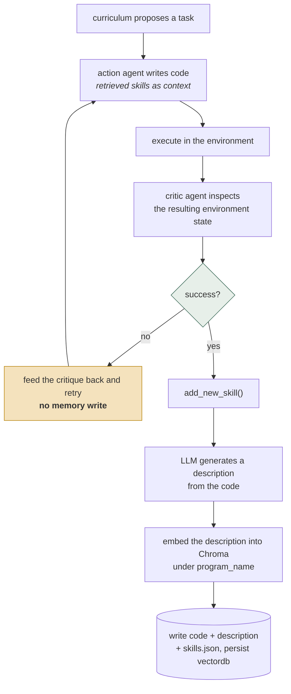
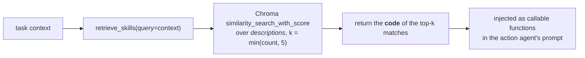
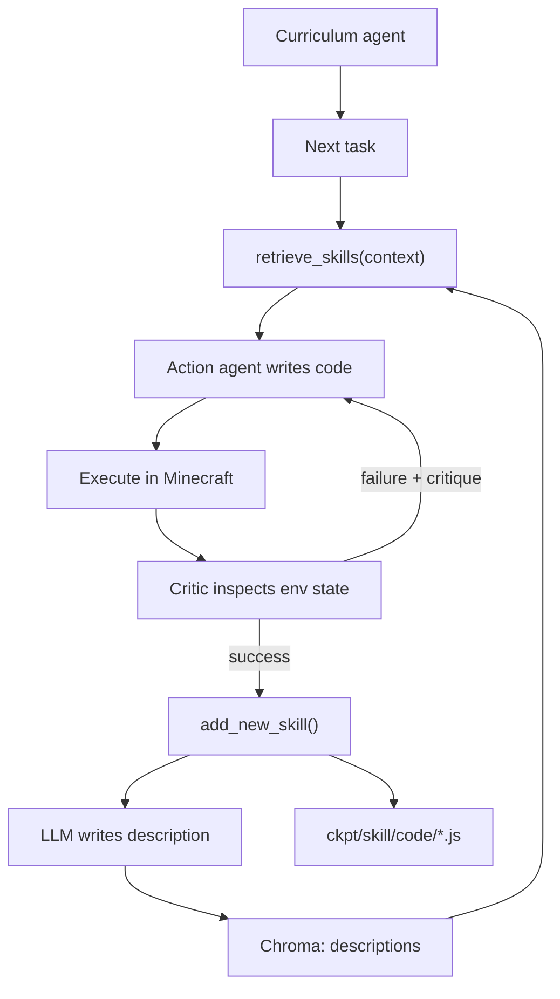

## 1. Executive Summary

Voyager (NVIDIA / Caltech, 2023) is an embodied LLM agent that plays Minecraft. Its last commit is from **July 2023**, so this is a historical review of a frozen research artifact, not an assessment of a maintained system — read it for the architecture, not for adoption.

It earns a place in this atlas because it is the clearest implementation of a memory kind the rest of the atlas treats as a footnote: **procedural memory whose unit is executable code.**

Every other system here remembers propositions — facts, claims, observations, summaries, notes. Voyager's `SkillManager` remembers *programs*. When the agent solves a novel task, the JavaScript function it wrote is stored, indexed, and later retrieved into the prompt so it can be called or adapted. Skills compose: earlier skills become primitives available to later ones, so the library grows in capability rather than just in size.

The single most transferable idea is the write gate, and it is stronger than anything else in the atlas:

```python
if info["success"]:
    self.skill_manager.add_new_skill(info)
```

`info["success"]` comes from a critic agent that inspects the **environment state** after execution. A skill enters memory only when the world confirms it worked. [RainBox](../rainbox/) gates writes on actor authority and [Verel](../verel/) on corroboration; both are judgments about a claim. Voyager's gate is empirical — the memory is a procedure, so "is this true?" collapses into "did it run and produce the intended state?", which is checkable.

The second idea worth stealing is the **split between retrieval key and payload**: an LLM writes a natural-language description of the code, the description is embedded and searched, and the *code* is what gets returned. Programs make poor embedding targets; their descriptions make good ones.

The limits are those of a 127-line research component: no scope, no provenance, no decay, a versioning scheme whose disk layout points at the wrong file, unbounded growth in the payload sent to the environment, and one hardcoded task exclusion standing in for any real "is this worth remembering?" policy.

**Re-reading it at the same commit adds a mark and corrects two claims.** `human_review` is earned on the write gate: `CriticAgent` takes a `mode` of `auto` or `manual`, and under `manual` the question that decides whether a skill is remembered is put to a person — `Success? (y/n)`, then a critique, then a confirmation loop — with `add_new_skill` called only inside `if info["success"]`. The default is `auto`, where a model answers the same question, and the two modes are the same seam. What the person adjudicates is the evidence rather than the skill's text, which is the honest limit to state beside the mark.

## 2. Mental Model

The memory unit is a named program plus its generated description:

```python
skills[program_name] = {
    "code":        program_code,     # executable JavaScript (Mineflayer bot API)
    "description": skill_description # LLM-generated summary, used as the retrieval key
}
```

Persisted across three stores that must agree:

| Path | Role |
| --- | --- |
| `ckpt/skill/code/<name>.js` | the executable |
| `ckpt/skill/description/<name>.txt` | the retrieval key |
| `ckpt/skill/skills.json` | the authoritative map |
| `ckpt/skill/vectordb/` | Chroma index over descriptions |

Write lifecycle — note where the gate sits:



The gate is the whole design. **Nothing is written until the environment agrees**
— the critic inspects world state rather than judging the text, and a failure
retries without leaving anything behind. Voyager is the atlas's clearest instance
of memory validated by execution rather than by adjudication.

Read lifecycle:



Search runs over descriptions and returns code. The description is a retrieval key
written by a model *about* the artifact, which keeps the thing being matched in
natural language and the thing being used executable.

## 3. Architecture

Voyager is small — about 1,459 lines across five agent modules — and the memory piece is smaller still:

- `voyager/agents/skill.py` (127 lines) — `SkillManager`: the entire memory subsystem.
- `voyager/agents/curriculum.py` (498) — proposes the next task; the exploration driver.
- `voyager/agents/action.py` (280) — writes code, given retrieved skills.
- `voyager/agents/critic.py` (138) — environment-grounded success verification.
- `voyager/voyager.py` (411) — the rollout loop that wires them together.
- `voyager/control_primitives/` — hand-written base functions always available.



## 4. Essential Implementation Paths

### The verified write gate (`voyager.py`)

The rollout loop retries on failure by feeding the critic's critique back to the action agent, and only calls `add_new_skill` when `info["success"]` is true. Failures produce *reasoning* input, not memory. This is a cleaner separation than most atlas systems manage: the transient learning signal and the durable artifact are different things.

The asymmetry is worth noting, because it is also a limitation — Voyager remembers only what worked. [Verel](../verel/) clusters failures into candidate rules and [RainBox](../rainbox/) keeps rejected values as tombstones; Voyager discards the failed attempts entirely, so it cannot learn "this approach does not work" and may rediscover the same dead end repeatedly.

### Description as retrieval key (`generate_skill_description`)

An LLM is given the program code and asked to summarize it; the result is wrapped as a comment inside a function signature and stored as the searchable text. Retrieval then runs `similarity_search_with_score` over descriptions and returns `self.skills[name]["code"]`.

This indirection is the right instinct. Embedding source code directly conflates identifier names with behaviour and retrieves poorly for "how do I smelt iron?"; embedding an intent description does not.

### Composition through the `programs` property

```python
@property
def programs(self):
    for skill_name, entry in self.skills.items():
        programs += f"{entry['code']}\n\n"
    for primitives in self.control_primitives:
        programs += f"{primitives}\n\n"
```

Every stored skill plus every hand-written primitive is concatenated, and this is what makes skills compose — a new program can call an old one. It is unbounded: the string grows with every skill learned, with no budget, no relevance filter and no eviction.

**Where it goes is not the prompt.** `skill_manager.programs` is passed to `self.env.step(code, programs=...)` (`voyager.py:217`, `:241`) — it is the JavaScript preamble the generated code is evaluated against inside the Mineflayer bridge, sent on every step. The action agent's *prompt* is assembled separately in `action.py:91` from six to eight named base primitives plus the retrieved list, and that list is `retrieve_skills`, capped at `k = min(count, 5)`. So the model's context is bounded and the environment payload is not: the cost of a large library lands on every environment step rather than on the context window.

### Versioning that keeps history but loses access

On a name collision the manager deletes the Chroma entry, finds the next free `{name}V{i}.js`, writes **the new code** there, and overwrites `skills[program_name]` in place — so the file named after the skill keeps the *oldest* version and the newest code lives under a `V{i}` suffix, while `skills.json` and the vector index hold the newest:

```python
if program_name in self.skills:
    self.vectordb._collection.delete(ids=[program_name])
    i = 2
    while f"{program_name}V{i}.js" in os.listdir(...): i += 1
    dumped_program_name = f"{program_name}V{i}"
```

So prior versions survive on disk as `mineIronV2.js`, `mineIronV3.js`, but `skills.json` and the vector index hold only the newest. There is no lineage field, no way to retrieve a superseded version, and no record of *why* it was replaced. The atlas's [append-only memory audit](../../patterns/append-only-memory-audit/) pattern describes what is missing: files accumulate without being an audit trail.

### Store-consistency assertion

```python
assert self.vectordb._collection.count() == len(self.skills), (
    "Skill Manager's vectordb is not synced with skills.json..."
)
```

Checked at construction and again after every write, with an error message that names the likely cause and the fix. It is crude — an assertion, not a repair path — but it makes a dual-store divergence loud instead of silent, which is more than several production systems in this atlas manage.

### The hardcoded exclusion

```python
if info["task"].startswith("Deposit useless items into the chest at"):
    return
```

One task is excluded from memory by string prefix. This is honest about what is absent: there is no principled policy for whether a successful skill is *worth* remembering, so a single degenerate case is special-cased. Any system storing procedures needs a real answer — utility, generality, reuse frequency — or the library fills with one-off variations.

## 5. Memory Data Model

Three stores (JSON map, flat files, Chroma) with `skills.json` as authoritative and the vector index as a projection — the [treat semantic indexes as projections](../../systems/claude-mem/) discipline, arrived at implicitly.

Absent:

- **No scope.** One agent, one checkpoint directory, no user/session/world boundary.
- **No provenance.** A skill records neither the task that produced it, the code iterations it took, nor the critique history.
- **No usage or utility tracking.** Nothing counts retrievals or successful reuse, so ranking cannot improve with experience and dead skills are never identified.
- **No decay, expiry, or deletion.** `add_new_skill` is the only mutation; nothing is ever removed.
- **No failure memory.** Only successes are retained.

## 6. Retrieval Mechanics

Pure vector similarity over descriptions, `k = min(count, 5)`, no lexical arm, no metadata filter, no reranking, and scores are retrieved (`similarity_search_with_score`) but discarded — there is no relevance threshold, so the top-5 are injected regardless of how poor the match is.

For a skill library this matters more than for a fact store: an irrelevant fact in context is noise, while an irrelevant *program* is an invitation for the model to call something inappropriate.

## 7. Write Mechanics

One path, one gate: environment-verified success. There is no manual curation surface, no human review, and no way to correct a skill except by producing a same-named replacement — which silently supersedes without lineage.

A subtle risk follows from the gate being *environment* verification rather than *generality* verification: a skill can succeed in the specific state it was written for and be stored as a general capability. Nothing tests it a second time in a different context before it becomes durable memory.

## 8. Agent Integration

None, in the modern sense — no MCP, no tools, no service. Voyager is a research rollout loop, and `SkillManager` is a Python class inside it. Its interface to the agent is prompt injection: retrieved code goes into the action agent's context.

Its relevance to this atlas is architectural. [Hermes Agent](../hermes-agent/) stores skills as Markdown written by `skill_manage`, [MemOS](../memos/) mounts skill memory as a cube type, and [agentmemory](../agentmemory/) keeps procedural records — all three treat procedure as one memory kind among several. Voyager is the case where procedure is the *whole* memory, which is why its gate design is so clean.

## 9. Reliability, Safety, and Trust

Strengths:

- **Empirical write gate** — the strongest verification signal in the atlas, because the artifact is executable.
- **A human mode on that gate.** `critic_agent_mode="manual"` routes the success question to a person, who answers, writes a critique and confirms in a loop before anything is remembered. It is the same seam the model answers under the default, which is the cheapest way to build a review surface: make the automatic judge and the human judge return the same tuple.
- **Retrieval key separated from payload.**
- **Authoritative store with a checked projection**, and a loud consistency assertion.
- **Failures feed reasoning, not memory.**
- **Composability**, so the library grows in capability.

Gaps:

- **Unbounded `programs` concatenation** sent to the environment on every step; the model prompt is capped at five retrieved skills.
- **No relevance threshold** on retrieved skills.
- **Supersession without lineage**, and the disk layout inverts what a reader expects: the new code is written under `{name}V{i}.js` while `{name}.js` keeps the oldest version, so the file named after the skill is the one no longer in use. The retrievable copy — `skills.json` and the vector row — is always the newest.
- **No failure memory**, so dead ends can be rediscovered.
- **No utility signal**, so the library cannot self-prune.
- **Single-context verification** — success once is treated as general capability.
- **Stored code is executed**, which in any non-sandboxed setting is a serious trust boundary the research context does not have to confront.

## 10. Tests, Evals, and Benchmarks

There is no test suite in this checkout at all — not for `SkillManager` and not for anything else; `find . -iname "*test*"` over the tree returns no Python test file. The project's evaluation is the paper's Minecraft benchmark — tech-tree milestones, distance travelled, items unlocked — which is a task-completion measure, not a memory-quality measure. Nothing evaluates retrieval precision over the skill library, or how often a retrieved skill is actually reused versus ignored.

The one assertion the write path does carry is worth naming because it is the kind most repositories skip: `assert self.vectordb._collection.count() == len(self.skills), "vectordb is not synced with skills.json"` runs on every successful write, so a divergence between the authoritative JSON and its vector projection is loud rather than silent. It is a bare `assert`, which `python -O` removes, and it is the only invariant in the component that is checked at all.

The repository has been unchanged since July 2023 — the pin is still the tip of `main`, whose last commit is 27 July 2023 — so this report describes an artifact, not a maintained project.

## 11. For Your Own Build

### Steal

- **Verify against the world before writing.** Where a memory is a procedure, correctness is testable — run it and check the resulting state. This is the strongest write gate available, and it generalizes to any agent whose actions have observable effects.
- **Separate the retrieval key from the payload.** Embed a generated description; return the artifact.
- **Let failures inform reasoning without entering memory.** Retry with critique; store only outcomes.
- **Compose memory into capability.** Retrieved skills become primitives for new ones.
- **Assert cross-store consistency** with an error message that states the fix.
- **Give the automatic judge and the human judge one signature.** `check_task_success` returns `(success, critique)` whether a model or a person produced it, so switching to human adjudication is a constructor argument rather than a second code path.

### Avoid

- **Unbounded growth in the environment payload** from concatenating the entire library on every step, and a disk layout where the file named after a skill holds its oldest version.
- **Top-k with no score threshold** for artifacts that will be executed.
- **Version files without lineage**, and a naming scheme where the un-suffixed file is the stale one.
- **Discarding failures entirely.**
- **A hardcoded exclusion** in place of a memory-worthiness policy.
- **Generalizing from a single verified execution.**

### Fit

Borrow:

- The environment-verified write gate — the central idea, and applicable well beyond embodied agents.
- Description-indexed, code-retrieved storage.
- The critique-retry loop that keeps failure out of durable memory.

Do not copy:

- The retrieval path; add a score threshold, metadata filters, and a token budget before injecting executable artifacts.
- The versioning scheme; add explicit supersession with lineage, and do not let the plainest filename hold the oldest content.
- The unbounded `programs` property — and note that its cost is paid on every environment step rather than in the context window, which is the harder kind of cost to notice.
- Anything at all without a sandbox, if stored code will be executed in a setting where inputs are not trusted.

## 12. Open Questions

- Should failed attempts be stored as negative procedural memory, so dead ends are not rediscovered?
- How should a skill's *generality* be verified, given that success once is not evidence it transfers?
- What is the right utility signal for pruning a skill library — retrieval count, reuse success rate, or composition depth?
- Would lexical search over identifiers complement description-vector search for code retrieval?
- Does the pattern hold outside a game environment, where "success" is rarely as cleanly observable?

## Appendix: File Index

- Skill memory: `voyager/agents/skill.py` — `SkillManager.add_new_skill()`, `retrieve_skills()`, `generate_skill_description()`, `programs`.
- Write gate: `voyager/voyager.py` (`if info["success"]: self.skill_manager.add_new_skill(info)`).
- Environment verification: `voyager/agents/critic.py` — `check_task_success()`.
- Code generation: `voyager/agents/action.py`.
- Task proposal: `voyager/agents/curriculum.py`.
- Base functions: `voyager/control_primitives/`, `voyager/control_primitives_context/`.
- Prompts: `voyager/prompts/`.

## History

**2026-09-19** — re-read at the same pin [`55e45a880755d0c8c66ca7fb5fe7962ac8974f89`](https://github.com/MineDojo/Voyager/commit/55e45a880755d0c8c66ca7fb5fe7962ac8974f89), still the tip. **The mark holds, with its default stated at the front of the record instead of implied.** The first reading was made on 2026-09-17, a day before the `human_review` wording narrowed. Re-tested: under `manual` the gate is real and synchronous — `human_check_task_success` loops on `Success? (y/n)`, a free-text critique and `Confirm? (y/n)` until the person confirms, and its return is the `info['success']` that `add_new_skill` is guarded by, so a skill enters the library only on a person's yes. What the record now says first is that `critic_agent_mode` defaults to `"auto"` (`voyager/voyager.py:43`), where an LLM critic judges the run that produced the skill. This atlas holds an opt-in gate and states the default — the same treatment given to Hermes, whose staging gate is off unless configured — and the contrast worth reading is klypix-mcp, which removed exactly this loop and wrote down why. Screened again first; nothing installed or run.

**2026-09-17** — [`55e45a880755d0c8c66ca7fb5fe7962ac8974f89`](https://github.com/MineDojo/Voyager/commit/55e45a880755d0c8c66ca7fb5fe7962ac8974f89) — re-read at the same commit, which is still the tip of `main`; the last commit upstream is 27 July 2023. Nothing could have changed, so this reading audited the first one against the code. Screened again: no auto-run surface, one build-time execution path (`setup.py`), four unpinned manifests, nothing inside the seven-day cooldown; nothing was installed and nothing was run. MIT, and `find . -iname "*test*"` returns no test file anywhere in the tree.

**`human_review` is earned, and the report previously carried no marks.** `CriticAgent`'s `mode` is asserted to be `auto` or `manual`; under `manual`, `check_task_success` calls `human_check_task_success`, which asks a person `Success? (y/n)`, takes a free-text critique and loops until they confirm. That return value is `info["success"]`, and `add_new_skill` runs only inside `if info["success"]` — so in that mode a person decides whether a skill enters the library, before it does. The default is `auto`, where a model answers the same question through the same seam, which is the design worth copying: one signature for the automatic judge and the human one. The limit stated beside the mark is that the person is asked about task success rather than shown the skill, so what is adjudicated is the evidence for the memory rather than its text.

**Two published claims are corrected.** The unbounded `programs` concatenation does not go into a prompt: it is passed to `env.step(code, programs=...)` as the JavaScript preamble the generated code is evaluated against, on every step. The action agent's prompt is assembled separately from six to eight named base primitives plus `retrieve_skills`, capped at `k = min(count, 5)` — so the context window is bounded and the environment payload is not. And the versioning is not "old versions on disk but unreachable": on a name collision the *new* code is written under `{name}V{i}.js` while `{name}.js` keeps the oldest version, so the plainest filename holds the stalest content while `skills.json` and the vector row hold the newest.

Everything else held: the write gate, the description-indexed retrieval that returns code, the discarded similarity scores, the hardcoded `Deposit useless items into the chest at` exclusion, and the one invariant the component checks — a bare `assert` that the Chroma count matches `len(self.skills)` on every write, with the fix in its message. `stack_source` moves from `seeded` to `reviewed`.

**2026-07-27** — [`55e45a880755d0c8c66ca7fb5fe7962ac8974f89`](https://github.com/MineDojo/Voyager/commit/55e45a880755d0c8c66ca7fb5fe7962ac8974f89) — first reading. Screened before reading; nothing was installed or run.
