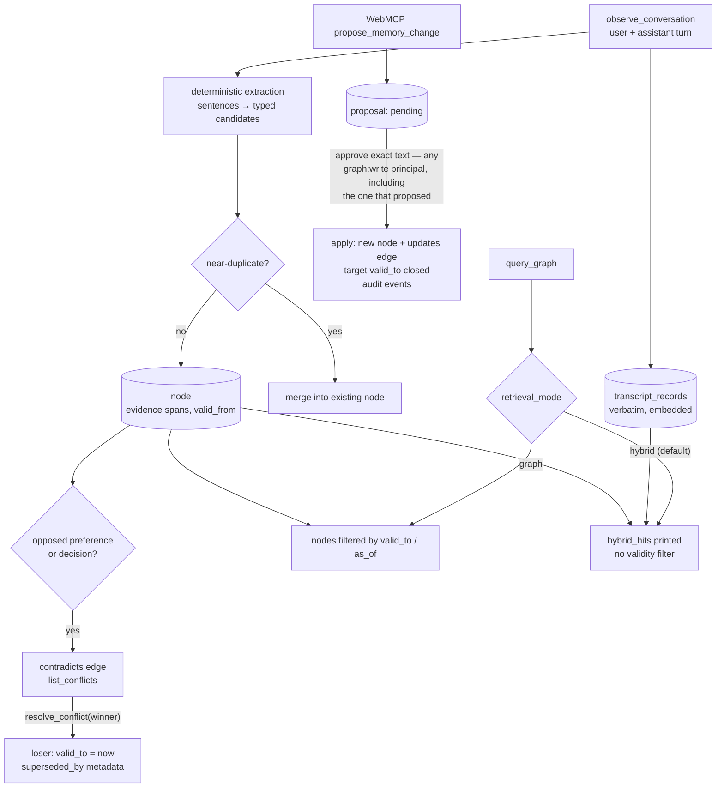

## 1. Executive Summary

Waggle is project memory for coding agents, published as `waggle-mcp` version
0.1.25. It is Apache-2.0 with 945 commits since 12 April 2026, about 39,800
lines of Python in `src/waggle`, 8,900 more in a vendored copy of the RLM
(recursive language model) library, and 1,030 test functions in 70 files. It
installs with `pipx` and writes configuration for Claude Code, Codex, Claude
Desktop, VS Code and Cursor.

It records what a project decided and why as a typed graph. Each completed turn
is persisted verbatim before anything is extracted. Extraction is deterministic
sentence classification with no model call, and every extracted node keeps
evidence records pointing back at the transcript span it came from. Nodes carry validity
windows, near-duplicates merge, and opposed preferences or decisions get a
`contradicts` edge an agent or person can resolve.

Two surfaces are built with unusual care:

- **The browser workspace's correction flow.** An agent proposes a replacement
  and a person approves the exact text. Apply writes only that text, supersedes
  the old node and refuses a target that changed in the meantime.
- **The audit table,** with actor, API key, IP address and request metadata for
  most mutations.

The defaults do not carry that care. `query_graph`, the tool agents are told
to call before answering, defaults to `hybrid` retrieval. In that mode the
validity filter runs on a node list the serializer never prints, so expired and
superseded content reaches the agent unless it asks for `graph` mode. On a
remote deployment the MCP route requires an API key. The REST routes Graph
Studio uses do not: without a key they take the tenant from the query string and
read, edit or delete that tenant's memory.

Three marks: `bitemporal`, `scope_enforced`, `negative_eval`. `human_review` is
withheld on the scope table rather than on the queue: `/api/webmcp/proposals`
(POST), `/api/webmcp/proposals/{id}/review` and `/api/webmcp/proposals/{id}/apply`
all call `_require_http_scope(request, "graph:write")`
(`server/routes.py:492`, `:531`, `:553`), so any principal that can propose can
also review and apply its own proposal. Nothing compares the proposer to the
reviewer, and `proposed_by_type` is a parameter with the default `"agent"`
(`webmcp/workspace.py:372-373`) — the caller says who proposed. The queue, the
version check and the exact-text apply are all real; what is missing is an actor
the producer cannot be.

## 2. Mental Model

Three layers sit in one store:

- **Transcripts.** Every observed turn pair, verbatim, with an embedding and a
  content hash.
- **Nodes and edges.** Typed knowledge extracted from turns or stored directly,
  each with evidence records naming session, turn index, speaker and character
  span.
- **Context windows.** A session within a repo, with its own embedding and
  typed edges to other windows (`continuation`, `supersedes`,
  `entity_overlap`), used by the tiered graph query to pick windows before
  nodes.

Change is expressed three ways, and they are not equivalent:

- **Validity.** `valid_to` closes a node's window; graph reads hide it unless
  asked.
- **Supersession.** Conflict resolution and approved proposals write
  `superseded_by` metadata or an `updates` edge. Only the browser workflow's
  authority projection reads either.
- **Deletion.** `delete_node`, canonicalisation, scope clears and retention
  remove rows.

## 3. Architecture

| Area | Modules |
| --- | --- |
| Store | `graph/__init__.py` (SQLite schema, migrations, imports and exports, retention, audit), `graph/mutation.py` (writes, dedup, conflicts, canonicalisation), `graph/traversal.py` (queries, tiered windows, topics, history), `graph/transcript.py` (observation) |
| Neo4j | `neo4j_graph.py`, the same interface for the HTTP deployment |
| Retrieval | `retrieval/hybrid.py` (BM25, vectors, graph expansion, RRF, reranker), `embeddings.py` (MiniLM, with a deterministic fallback) |
| Extraction | `intelligence.py` — sentence splitting, type inference, conflict and dedup heuristics |
| Surfaces | `tools/dispatcher.py` (the MCP tool catalogue), `protocol/mcp/` (stdio and HTTP), `server/routes.py` (REST, Graph Studio, WebMCP), `server/cli.py`, `hooks/claude_code` |
| Governance | `webmcp/workspace.py` and `webmcp/proposals.py`, `auth.py`, `rate_limit.py` |
| Portability | `abhi.py` (a zipped, optionally signed and encrypted graph format), `markdown_vault.py`, `drive_sync.py`, `context_bundle.py` |
| Front ends | `apps/mcp/graph-ui` (React Graph Studio and workspace), `apps/vscode-extension`, `apps/mcp/claude-desktop-extension` |

### Deployment and ergonomics

- **Local:** `pipx install waggle-mcp`, `waggle-mcp setup --yes`, stdio MCP over
  SQLite; no account, key or model needed. Embeddings download MiniLM, with a
  deterministic hash fallback.
- **Remote:** HTTP transport requires the Neo4j backend (`config.py:213`), with
  API keys, scopes, rate limits and a Caddy or Nginx proxy in the production
  guide.
- **Hosted demo:** a SQLite WebMCP workspace on Render with per-browser session
  admission, capped at 128 sessions.
- **Hand-repairable:** partly. SQLite is inspectable, Graph Studio edits nodes,
  and the vault and `.abhi` exports round-trip.

The screen of this checkout found three auto-run surfaces (`.mcp.json`,
`server.json`, `smithery.yaml`), one build-time execution point
(`tests/conftest.py`), five unpinned surfaces and nothing inside the cooldown,
and read `AGENTS.md` as data. Nothing was installed, built or run.

## 4. Essential Implementation Paths

- **Observation** — `graph/transcript.py:263`: persist the turn under a process
  lock, then extract (`intelligence.py:872`) and store candidates through
  `_store_extracted_candidates` with `valid_from=observed_at` (`:128`).
- **Node write** — `graph/mutation.py:71-252`: find a duplicate within the same
  tenant, project and session or agent (`:1017`), merge or insert, register
  conflicts (`:1519`), emit `graph.node.created` or `graph.node.updated`.
- **Query** — `graph/traversal.py:227-330`: `hybrid` and `verbatim` go to
  `HybridRetriever.retrieve_debug`, and `_filter_valid_nodes` is applied to
  `result.nodes`; `graph` goes to `tiered_query` when a project is given,
  otherwise `_query_graph_only`.
- **Conflict resolution** — `graph/mutation.py:387-488`: mark the edge resolved,
  close the loser's `valid_to`, write `superseded_by` metadata.
- **Proposal apply** — `webmcp/workspace.py:600-735`: approved status, a
  freshness check against the target version, a new node with governance
  metadata and a hash of the approved content, an `updates` edge, audit events.
- **Auth** — `protocol/mcp/http.py:126-151` for MCP; `server/routes.py:244-294`
  for REST.

## 5. Memory Data Model

`nodes` (`graph/__init__.py:185-210`): `id`, `tenant_id`, `agent_id`,
`project`, `session_id`, `context_window_id`, `label`, `content`, `node_type`
constrained to seven values, `tags`, `metadata`, `embedding` with model id and
dimension, `source_prompt`, `source_turn_pair_id`, `evidence_records` (JSON),
`valid_from`, `valid_to`, `created_at`, `updated_at`, `access_count`. `edges`
carry a free-text relationship normalised to lower case, a weight in [0, 1] and
metadata; the enum names `relates_to`, `contradicts`, `depends_on`, `part_of`,
`updates`, `derived_from` and `similar_to`.

**Evidence records** name the session, turn index, speaker role, source text,
character span and observation time, so a node can be traced to the words it
came from.

**Authority.** The browser workflow projects each node to `authoritative`,
`superseded`, `expired`, `future`, `historical` or `rejected`
(`webmcp/workspace.py:52-82`). `superseded` follows from `superseded_by` metadata
or an incoming `updates` edge, both written by live paths. `historical` and
`rejected` read `knowledge_status` and `head_rejected_reason` from metadata, and
nothing in `src/` writes either; only tests seed them. The projection is
computed on read and used by the WebMCP recall and brief. The MCP query tools do
not use it, so `trust_state` is withheld.

**Proposals** (`webmcp/proposals.py:16-39`) hold the target's content and
version, the proposed and approved content, reason, evidence ids, proposer,
reviewer and a status of pending, approved, rejected, stale or applied. A
unique index blocks duplicate *pending* proposals. A rejected proposal is not
consulted when the same change is proposed again, so `tombstone` is withheld.
The proposer and reviewer columns are recorded and never compared, and the three
routes that write them share one scope, which is why `human_review` is withheld
too.

## 6. Retrieval Mechanics

**Hybrid** (`retrieval/hybrid.py`) ranks transcript turn pairs by embedding,
nodes by embedding (through sqlite-vec when loaded), and both by BM25 over a
cached lexical index. It expands graph neighbours of the top nodes, fuses the
lists with reciprocal rank fusion (k = 60) and optionally reranks the top 20 with
a model, off by default. Recency decay applies to the scores.

**Graph** mode uses tiered retrieval when a project is given: rank context
windows by embedding, then nodes inside the chosen windows, then traverse edges.
Without a project it scores nodes directly and expands along edges.

**Validity is enforced on one of the two result shapes.** `query` applies
`_filter_valid_nodes` to `result.nodes` in every mode (`traversal.py:262-266`).
In hybrid mode the result also carries `hybrid_hits` — node content and
transcript text with scores — built before the filter and never filtered, and
`serialize_subgraph` prints `hybrid_hits` whenever the mode is hybrid and there
are any (`serializer.py:63-79`), ignoring `result.nodes`. `query_graph`'s schema
defaults `retrieval_mode` to `hybrid` (`dispatcher.py:382-386`), and the MCP
resource that teaches agents the memory policy says to use `retrieval_mode
hybrid`. The consequence:

- a node closed by conflict resolution or by an approved proposal is still
  printed to an agent that follows the documented workflow;
- `as_of` and `include_invalidated` do not change what that agent reads;
- the verbatim turn a superseded preference came from is never invalidated.

Every validity test runs with `retrieval_mode="graph"`. The WebMCP recall calls
`graph` mode and applies the authority projection, so the browser workflow is
not affected (`webmcp/workspace.py:271-301`). Neither is `build_context`, whose
request defaults to `graph` (`orchestrator.py:71`).

**Scope inside a tenant** is optional. Project, session and agent filters are
added only when non-empty; with none, a query spans the tenant.

## 7. Write Mechanics

**Verbatim first.** `observe_conversation` fails if the turn cannot be stored
and treats extraction errors as non-fatal, so the source survives a bad
extractor.

**Extraction** is heuristic and language-bound: an English stopword list,
sentence splitting into atomic items, pattern-based type inference, file paths
as entities. Both the user's and the assistant's sentences become candidates,
tagged with the speaker. An assistant's assertion is stored as a node like the
user's, with `speaker:assistant` in its tags.

**Dedup** looks for a near-duplicate within the same tenant, project and
session or agent using type-aware thresholds, lexical overlap and a guard that
keeps rejected-option statements from merging with chosen ones
(`mutation.py:1017-1235`).

**Conflicts** are detected only between preferences or decisions of the same
type: different choices in a shared category, opposite negation over the same
focus tokens, or a small overlapping context (`intelligence.py:952-986`). A
detected conflict adds a `contradicts` edge and leaves both nodes current until
someone resolves it.

**Audit.** `emit_audit_event` writes to `audit_events` for node and edge
create, update and delete, scope clears, imports and exports, retention runs,
API key use on HTTP MCP, REST reads and proposal transitions.
`resolve_conflict` closes a node's validity and rewrites its metadata, and
`canonicalize_node` deletes the merged nodes and repoints their edges
(`mutation.py:1326-1446`); neither emits an event, and on stdio no
request-level event records the call either. The demo reset deletes its
tenant's audit rows (`webmcp/demo.py:367`). `audit_log` is withheld because two
live mutation paths are missing from the record.

## 8. Agent Integration

- **MCP tools** — 41, from `prime_context`, `query_graph`,
  `observe_conversation` and `build_context` to `resolve_conflict`,
  `canonicalize_node`, `delete_node`, `clear_all`, `.abhi` import and merge, and
  Drive `push` and `pull`.
- **Claude Code hooks** call `build_context` before answers and
  `on_assistant_turn` after; `post_response.py` skips turns containing likely
  secrets.
- **Setup** writes a managed block into `AGENTS.md` and client configs telling
  the agent to use memory without being asked.
- **WebMCP** registers five site tools in the browser workspace:
  `get_project_brief`, `recall_memory`, `propose_memory_change`,
  `apply_approved_memory_change`, `load_abhi_for_session`.
- **`.abhi`** is a zip of chunked nodes and edges with optional Ed25519
  signatures and encryption; saved queries run over it with the vendored RLM.

## 9. Reliability, Safety, and Trust

**REST routes select a tenant from the request.** `_graph_from_request`
authenticates an `X-API-Key` if one is sent. Otherwise it serves the tenant
named by `?tenant_id=` or the configured default (`routes.py:251-258`), and
`_require_http_scope` checks scopes only when a key was presented (`:288-294`).
`docs/reference.md:451` documents this for the admin routes; it holds for every
`/api/graph` route too, including snapshot, export, node and edge PATCH and
DELETE, import and restore. The MCP route on the same server refuses a request
without a key (`protocol/mcp/http.py:126-128`). The production guide's Caddy
example proxies every path to the app (`examples/Caddyfile`), so a deployment
that follows it serves each tenant's graph to anyone who can name the tenant.
`tests/test_platform.py:640-668` exercises the keyless admin routes with a
`tenant_id` parameter.

**Read-scoped keys can write.** On HTTP MCP, the scope required is
`graph:write` only for tools in `WRITE_HEAVY_TOOLS` (`server/utils.py:30-47`,
`http.py:150`). `update_node`, `delete_node`, `canonicalize_node`,
`resolve_conflict` and `close_context_window` are not in the set, so a `graph:read` key can
edit, merge and delete nodes.

**Approval governs one workflow.** The README says so plainly: proposals and
approvals apply to WebMCP corrections, and direct graph editing and local MCP
operations do not require approval. The review endpoint takes the reviewer from
the API key or records `local-human`; on a keyless request nothing
distinguishes a person from an agent posting to the same route.

**Secrets** are scanned in hooks before ingestion and in CLI exports.

**Injection.** Assistant sentences are extracted into nodes, so text an agent
read in a tool result and repeated can become a stored decision or preference.

## 10. Tests, Evals, and Benchmarks

1,030 test functions in 70 files cover the validity filter, conflicts and
dedup, hybrid retrieval and its lexical cache, the connection pool and
concurrency, `.abhi` round-trips and signatures, auth primitives, rate limits,
WebMCP proposals including stale targets and cross-project refusals, hooks and
the MCP adapters. None was run for this report.

**Negative retrieval.** `tests/test_valid_to.py:83` asserts that an expired node
is absent from a default query, with `:126`, `:174` and `:440` returning it or
its siblings under `include_invalidated`, `as_of` and an open window. That earns
`negative_eval`. All of these run in `graph` mode, which is why the hybrid path
in section 6 is uncovered.

**Benchmarks.** `benchmarks/token_reduction` measures context size against
pasting transcripts, with scenarios and a runner; `docs/how-waggle-saves-tokens.md`
describes it. No retrieval-quality benchmark results are committed.

## 11. For Your Own Build

### Steal

- **Persist the verbatim turn before extracting,** and fail the write only if
  that step fails.
- **Evidence spans on every extracted node** — session, turn, speaker and
  character offsets.
- **Apply only the approved text.** Store the approved content with the
  proposal, forbid the applier from supplying content, hash it into the new
  node's metadata, and mark the proposal stale if the target moved.
- **Keep rejected-option statements from merging with chosen ones** in dedup.

### Avoid

- **A validity filter on a result the caller does not read.** Filter at the
  ranker, or on everything the serializer prints.
- **Authentication that depends on whether the client sent a key.**
- **A write-scope list maintained by hand beside the tool catalogue.** Derive it
  from the tool definitions, or default unknown tools to write.
- **Supersession paths that skip the audit table.**

### Fit

Waggle suits one developer, or a small team with its own server, who wants
project decisions and preferences to follow them across coding clients, with a
graph they can open and edit. Its governed correction flow is a good model to
copy. As a multi-tenant remote service at this commit, or anywhere an agent
must not read superseded decisions, it needs the retrieval default and the REST
authentication changed first.

## 12. Open Questions

- **Should `hybrid_hits` be rebuilt from the filtered nodes,** or should the
  ranker apply `valid_to` and `as_of` in SQL?
- **Is the keyless REST tenant parameter meant for local Graph Studio only,**
  and should it be refused when API keys exist?
- **Will the MCP query tools adopt the authority projection** the browser
  workflow already uses?

## Appendix: File Index

- `src/waggle/graph/__init__.py`, `graph/mutation.py`, `graph/traversal.py`, `graph/transcript.py`, `graph/base.py`
- `src/waggle/retrieval/hybrid.py`, `embeddings.py`, `intelligence.py`, `serializer.py`
- `src/waggle/tools/dispatcher.py`, `protocol/mcp/http.py`, `server/routes.py`, `server/utils.py`, `config.py`
- `src/waggle/webmcp/workspace.py`, `webmcp/proposals.py`, `apps/mcp/graph-ui/src/Workspace.jsx`
- `tests/test_valid_to.py`, `tests/test_webmcp_project_brief.py`, `tests/test_platform.py`
- `docs/reference.md`, `docs/deployment/production.md`, `examples/Caddyfile`

**Searches behind the absence claims**

- `grep -n "valid" src/waggle/retrieval/hybrid.py` — validity columns selected, never filtered
- `grep -n "retrieval_mode" tests/test_valid_to.py` — every call passes `graph`
- `sed -n 1326,1446p src/waggle/graph/mutation.py | grep emit_audit` — nothing; likewise `:387-488`
- `grep -rn "knowledge_status\|head_rejected_reason" src` — read in `webmcp/workspace.py` only
- `grep -rn "require_scope\|WRITE_HEAVY_TOOLS" src` — the MCP scope check reads only the hand-kept set
- `grep -rn "prune_retention" src` — called from `server/cli.py` and `server/routes.py:1359`; no loop

## History

**2026-09-19** — re-pinned to [`4d49f2f66dd80b62b434241b380c52213a858f9a`](https://github.com/Abhigyan-Shekhar/Waggle-mcp/commit/4d49f2f66dd80b62b434241b380c52213a858f9a), 2 commits on and the only changed file a test. `human_review` is **withdrawn** on a check the previous reading did not make: the three proposal routes were compared for the scope each demands, and propose, review and apply all call `_require_http_scope(request, "graph:write")`. A browser agent holding a token that lets it propose therefore holds one that lets it review and apply, nothing in the apply path compares `proposed_by_id` to the reviewer, and `proposed_by_type` is a parameter defaulting to `"agent"` — the caller states who proposed. The queue itself, the version check and the exact-text apply are not in question and keep their credit in sections 4 and 5. The other three marks stand untouched at this pin. Screened again first; nothing was installed and no suite was run.

**2026-09-15** — [`27e9dea866ef1988f8c3b79a7c1c65ad89a8fa92`](https://github.com/Abhigyan-Shekhar/Waggle-mcp/commit/27e9dea866ef1988f8c3b79a7c1c65ad89a8fa92) — first reading, at a commit dated 31 August 2026. Screened before opening: three auto-run surfaces (MCP manifests), one build-time execution point, five unpinned surfaces, nothing inside the cooldown, and `AGENTS.md` read as data. Nothing was installed, built or run.
