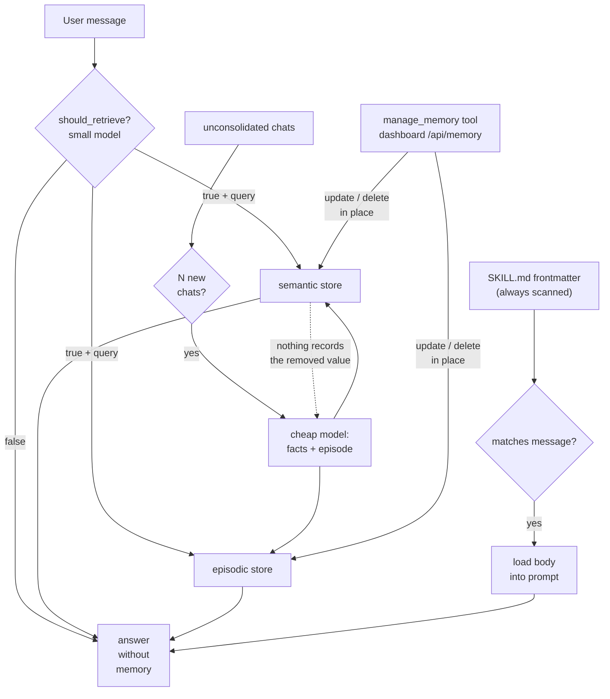

## 1. Executive Summary

Waku is a small MIT-licensed personal agent — about 800 lines of core memory code — organized around three pillars borrowed from cognitive science: `semantic/` (facts), `episodic/` (what happened), and `procedural/` (how to act). Each has a SQLite default and an optional external backend: facts can also live in Supabase, mem0, Zep or LangMem — all held to one `FactStore` contract by a conformance suite, so a hosted service stands in for local SQLite without anything upstream noticing — and episodes in Notion. The SQLite fact store is keyword search over FTS5.

That structure is conventional. What makes Waku worth reading is that its design question is not *how do we remember more* but **when should we not do the expensive thing** — and it answers that in three different places.

**Don't retrieve unless the turn needs it.** `retrieval_gate.py` sends the user's message to a cheap model, which returns `{"retrieve": bool, "query": str, "reason": str}`. The docstring states the case plainly:

> "Default-on retrieval is (a) slow — an extra search before every reply — and (b) worse: irrelevant memories bias the answer ('over-interpretation'). So before touching any store, a cheap fast model answers one question: does THIS message need the user's memory?"

**Nothing else in the atlas abstains from retrieval.** Everything else searches every turn, or gates on a crude heuristic. The failure Waku names — irrelevant recall bending the answer — is one the atlas circles under context budgets and [source diversity](../../patterns/source-diverse-context/) but never solves by simply not looking.

**Don't consolidate after every message.** `consolidation.py` batches: "only consolidate after N new chats. Running a summarizer after every message is wasteful and noisy; batching N exchanges gives the summarizer enough context to extract facts worth keeping." The second clause is the better argument — batching is not only cheaper, it produces better summaries.

**Don't load a skill body until it matches.** `procedural/loader.py` implements progressive disclosure over the Anthropic Agent Skills format: every skill's frontmatter is scanned (cheap), a body enters the prompt only on match, and files a skill references are read only if the model asks.

The gate's failure direction is also right, and stated: it **fails open**. If the gate errors, Waku retrieves anyway, because "a stale memory beats a lost one."

**Correction is not where the memory package is.** `waku/memory/` has no update or delete surface at all — the mutation path lives one directory over, in `waku/tools/memory_admin.py`, which registers three tools that let the agent manage its own memory: `manage_memory` (search, update, delete over facts and episodes), `update_soul` (append a behaviour rule to `SOUL.md`, deliberately append-only so "the agent can't delete its own honesty rules") and `create_skill` (write a new `SKILL.md`). All three are registered whenever a memory store is present (`waku/tools/__init__.py`, under `if memory is not None:`), and `waku/ops/dashboard.py:798` gives a person the same CRUD over the same SQLite file. A reader who takes the directory named `memory` as the boundary of the memory system will conclude this project cannot correct anything, and be wrong.

The real limits are one layer up: nothing is keyed on a *rejected* value, so a fact the user just corrected can be re-extracted by the next consolidation pass with nothing to consult; there is no supersession chain, no trust state, and no scope beyond a single user.

## 2. Mental Model

```text
semantic/    facts        "Alex prefers morning meetings"      SQLite | Supabase
episodic/    episodes     "2026-07-10: planned the Acme demo"  SQLite | Notion
procedural/  SKILL.md     how to act                           filesystem
```

Read path — the distinctive one:

```text
user message
  → should_retrieve(small_model, message)
      {"retrieve": false} → answer with no memory at all
      {"retrieve": true, "query": ...} → search semantic + episodic with that query
  → procedural: scan all frontmatter, load only matching skill bodies
  → answer
```

Write path — two doors, and only one of them is automatic:

```text
chats accumulate unconsolidated
  → after N new chats, a cheap model reads the log and emits
        facts    → semantic store
        episode  → episodic store

manage_memory(action=search|update|delete)   agent, mid-conversation
POST /api/memory                              person, from the dashboard
  → both mutate the same rows in place
```

A memory therefore holds exactly two states: present and absent. An update overwrites the row, a delete removes it, and neither leaves a record that the old value was ever held or judged wrong — so the consolidation door has nothing to check when the same claim comes back through it.

## 3. Architecture

`waku/memory/` (825 lines):

- `retrieval_gate.py` (55) — `should_retrieve()`.
- `__init__.py` (186) — the `Memory` facade, "the three pillars behind one small interface".
- `consolidation.py` (82) — batched distillation into facts and episodes.
- `semantic/store.py` (78), `semantic/supabase_store.py` (58).
- `episodic/store.py` (57), `episodic/notion_store.py` (164).
- `procedural/loader.py` (91), `procedural/installer.py` (54).

Two files outside that package carry memory mechanism and are the reason the
line count above understates the system:

- `waku/tools/memory_admin.py` (144) — the three self-management tools.
- `waku/ops/dashboard.py` (1,044) — a local web dashboard whose `memory_action`
  handler is human CRUD over the same store.



The dotted edge is the gap. Correction reaches the store, and the store has
nothing to hand back to the pass that will re-read the same conversation
log.

## 4. Essential Implementation Paths

### The retrieval gate

```python
def should_retrieve(client, small_model, message) -> tuple[bool, str, str]:
    """Returns (retrieve?, search_query, reason). Fails open: if the gate
    itself errors, we retrieve — a stale memory beats a lost one."""
```

Three details make this more than a prompt.

**It returns a query, not just a verdict.** The same call that decides *whether* also produces *what to search for*, so the gate doubles as a query rewriter and its cost is amortized across two jobs. Compare [Atomic Agent](../atomic-agent/), which has a separate heuristic-gated query rewriter as its own phase.

**It fails open, deliberately.** A gate that skips work must fail toward doing the work: failing closed would silently drop memory on every gate error, which is invisible and unrecoverable. Waku returns `(True, message, "gate failed open (...)")` on any exception, and the reason string records why.

**It survives reasoning models.** A comment records a real incident: `max_tokens` was raised from 100 to 600 because "reasoning models (Kimi K3, ...) spend a thinking block BEFORE the JSON — 100 tokens was truncating the answer away." A separate branch treats a reply containing no `{` as a truncated or reasoning-only response and also fails open.

The `reason` field is a small but good affordance: every gate decision carries a five-word justification, so the log shows not just that memory was skipped but why.

### Batched consolidation

The stated rationale is worth separating into its two halves. Cost is the obvious one. The subtler one is quality: a summarizer invoked after every message sees one exchange and produces noise, while batching N exchanges "gives the summarizer enough context to extract facts worth keeping."

This is the same instinct as [CowAgent](../cowagent/)'s daily buckets and [nanobot](../nanobot/)'s cursor over an append-only archive — give consolidation a unit large enough to be meaningful. Waku's unit is a chat count rather than a calendar day or a token threshold.

### Correcting a memory

`waku/tools/memory_admin.py` is where the belief store becomes editable, and
its docstring states the intent: tools "that let the agent manage its OWN
memory — so it feels like a personal assistant that learns, not a black box."

`manage_memory` takes `action` in `search | update | delete` over `kind` in
`fact | episode`, and its tool description instructs the model to search first
for an id and then act on that id — an addressed lifecycle, which is the
contract [GoodAI LTM](../goodai-ltm/) declares and several larger frameworks in
this atlas cannot express. Episodes are delete-only: `"Only facts can be
updated (episodes are historical)"`, which is the right asymmetry — an episode
is a claim about what happened, and editing it is falsifying a record rather
than correcting a belief.

Two smaller decisions in the same file are worth lifting. `update_soul` is
append-only *by construction*, with the reason in the module docstring: "the
agent can't delete its own honesty rules"; a human does full rewrites in the
dashboard. And `create_skill` refuses to overwrite an existing skill by name
rather than silently replacing it. Both are cases of giving the model a write
verb and withholding the destructive half of it.

The human door is `memory_action` in `waku/ops/dashboard.py:798` — `update_fact`,
`delete_fact`, `delete_episode`, `save_soul`, `save_skill`, writing "the same
sqlite file the agent uses (busy_timeout covers contention); changes are live
for the next agent turn." `save_skill` resolves the destination and rejects any
path not inside the two skills folders, and validates the frontmatter before
writing.

What neither door does is leave a trace. `facts.update` overwrites the row and
`facts.delete` removes it; there is no audit row, no `superseded_by`, and no
record of the value that was there. Consolidation re-reads the chat log on its
own schedule, so a fact a user corrected on Monday is a fact the summarizer can
re-derive on Tuesday from the same conversation — the laundering shape the
[rejected-value tombstone](../../patterns/rejected-value-tombstone/) page
exists to name. The distance from here to closing it is small: the correction
verb already exists and already knows the value being removed.

### Procedural memory as progressive disclosure

`procedural/loader.py` follows the Anthropic Agent Skills format — YAML frontmatter with `name` and `description`, where the description doubles as the trigger. A comment notes the project previously used a custom `triggers:` field and dropped it once the spec settled, which is a small mark of tracking a standard rather than inventing one.

The three-stage disclosure — frontmatter always, body on match, referenced files on demand — is the same shape [GenericAgent](../genericagent/) reaches through its "existence encoding" ROI rule and [Hermes Agent](../hermes-agent/) through name-and-description-only skill indexing. Waku gets it from the format itself.

## 5. Memory Data Model

Facts and episodes in SQLite, with optional Supabase and Notion backends; skills as files. Rows carry a `source` — `consolidation` for the automatic path — and no status, confidence, supersession pointer or tombstone, and no scope beyond a single user.

That is a reasonable position for an 800-line personal agent, and it puts the system in a specific place: Waku answers "what should we retrieve?" carefully, answers "is this still true?" *operationally* — a person or the agent can fix the row — and does not answer "has this already been judged wrong?" at all. A fact consolidated from a chat where the user changed their mind sits alongside the correction with nothing distinguishing them, and the correction can be undone by a scheduled job rather than by a person.

The Notion episodic backend is the most operationally interesting choice: episodes land somewhere the user already reads and edits, which makes correction a manual but real possibility — the [Basic Memory](../basic-memory/) property of human-owned canonical state, arrived at by picking a familiar tool as the store.

## 6. Retrieval Mechanics

Whatever the underlying stores provide, downstream of the gate. The gate is the mechanism worth studying; the search itself is unremarkable — with one correctness caveat worth a footnote, because it reinforces the report's own thesis. The SQLite fact store searches FTS5, and `_fts_query` (`waku/memory/semantic/store.py`) previously tokenized ASCII-only, so a non-Latin or accented query was silently mangled (`"Müller" → "ller"`, `"Сергей" → ""`) and an empty result made the episodic store hand back *unrelated* memories under a "Relevant memory" heading — the over-interpretation the retrieval gate exists to prevent, arriving through the back door. It now tokenizes on Unicode word characters, pinned by `test_memory_search.py`.

The cost model deserves stating honestly: the gate **adds** a small-model call to every turn in order to **remove** a search from some of them. Whether that trades well depends on the ratio of memory-needing turns to the rest, and on the relative latency of the gate model versus the store. Waku asserts the trade is favourable; nothing in the repository measures it.

## 7. Write Mechanics

Consolidation is the only *automatic* path into durable memory: there is no explicit "remember this" surface, and no actor model — whatever the summarizer extracts becomes a fact or an episode, tagged `source="consolidation"`. Writes are synchronous with the turn that triggers them, and a memory is retrievable as soon as the batch commits.

The other two paths are corrective rather than additive — `manage_memory` from the agent and `memory_action` from the dashboard — and both mutate in place.

The consolidation call carries a `max_tokens` of 4096, with a comment recording why the number is not the gate's: reasoning models emit a thinking block before the JSON, and this prompt "carries the whole unconsolidated log (not one short message like the retrieval gate) — 600 was measured truncating kimi-k2.6 to a thinking-only reply (stop_reason=max_tokens, zero text blocks) on a 40-row backlog." Beneath it, `if "{" not in text: return 0` recognises a reasoning-only reply instead of letting `text.index("{")` raise into the broad `except`.

That guard fixes the budget and not the silence. Both branches return `0`, the caller's `notify()` only fires when `new_facts > 0`, and nothing writes a log line or a counter — so a summarizer that fails every turn and a quiet week produce the same observable, which is none. `evals/deterministic/test_consolidation.py` scripts a thinking-only response with `stop_reason=max_tokens` and pins that the log stays unconsolidated and no facts are written; what it pins is that the failure is safe, not that it is visible.

## 8. Agent Integration

A CLI agent plus a local dashboard, with sixty deterministic eval files under `evals/deterministic/`. Skills follow the published Agent Skills format, so procedural memory is portable to other runtimes that read it.

The model's agency over memory is wider than the memory package suggests: it can search, correct and delete its own facts and episodes, append a standing behaviour rule to its persona, and author a new skill — the last two gated so that the destructive halves stay with the human. `waku/ops/dashboard.py:546` groups the three under `_SELFMGMT`, which is the project's own name for the boundary.

The dashboard's memory tab is a review surface in the sense this atlas means: a person reads the stored facts and episodes and can rewrite or remove any of them, against the same SQLite file the agent reads on its next turn. It is not an approval queue — nothing waits for a human before entering memory — so it adjudicates after the fact rather than gating.

## 9. Reliability, Safety, and Trust

Strengths:

- **A gate that decides whether to work at all**, at three levels.
- **Failing open**, with the reasoning stated in the code.
- **A recorded reason** on every gate decision.
- **Robustness to reasoning-model output**, driven by a real incident.
- **Batched consolidation** justified on quality as well as cost.
- **Progressive disclosure** for skills, following a published format.
- **Deterministic evals** for memory behaviour.
- **Pluggable backends** per memory kind, defaulting to SQLite.
- **A correction path with two doors** — the agent's `manage_memory` and the dashboard's `memory_action` — over the same rows, with episodes deliberately delete-only.
- **A persona file the agent may append to and not prune**, so it cannot edit away its own standing instructions.

Gaps:

- **Nothing is keyed on a rejected value.** Correction reaches the row and stops there: `facts.update` overwrites, `facts.delete` removes, and the next consolidation pass re-reads the same chat log with nothing to consult. A user's correction is a statement about the present that a scheduled job is free to undo.
- **No supersession chain and no audit row**, so a corrected fact cannot be traced to what it replaced or to who replaced it — the agent and the dashboard write identically.
- **No trust state**, and provenance is one `source` string.
- **Single-user scope.**
- **The gate's own accuracy is unmeasured** — a false negative silently answers without memory that would have helped, and nothing detects it. Tracked upstream as [issue #77](https://github.com/ShenSeanChen/waku-agent/issues/77), which states the asymmetry the measurement has to preserve: a false "no" loses a fact the user supplied, a false "yes" costs one search, and a single accuracy number would hide the difference.
- **The gate adds a call per turn**, and the net cost is asserted rather than measured.
- **A consolidation that fails and a week with nothing to say are indistinguishable from outside.** Both return `0` and neither logs.

## 10. Tests, Evals, and Benchmarks

Sixty deterministic eval files, model-free rather than model-judged, which is the right shape for behavioural checks. `test_retrieval_gate.py` carries eleven cases and every one is about plumbing: JSON extracted from prose, survival of a thinking block, failing open on an API error, exactly one model call. `test_episodic_store_switch.py` and `test_skill_encoding.py` exercise the self-management tools; `test_consolidation.py` pins the thinking-only truncation; `test_fact_store_conformance.py` holds every fact backend to the same contract, and `test_memory_search.py` pins the Unicode FTS fix. Nothing was run for this review — a dependency surface was inside the seven-day cooldown.

The largest committed addition since the previous pin is a **memory benchmark**. `waku/ops/memory_arena.py` (896 lines) is a harness that holds the model and the probes constant and varies only `WAKU_SEMANTIC_STORE`, so "a difference in the scoreboard can only have come from where the facts live" — racing Waku's own SQLite against Supabase, mem0, Zep, LangMem and a no-memory control. It seeds a *conversation* rather than a pre-extracted fact list, so each backend's own extraction runs, then scores each probe on four outcomes: `PASS`, `MISS` (an honest failure), `STALE` (returns a superseded answer), and `INVENTED` (answers a probe that should have been refused) — the last being, in the code's words, "the number the whole exercise exists to produce." An LLM adjudicator settles only the verdicts a substring heuristic marks uncertain, and returns `None` rather than silently converting when unreachable. The **negative control** — a contestant "told nothing, then asked everything" — is the sharpest idea: any probe it passes was scoring the model's training data, not the store, and running it found 3 of 7 dinner-track probes doing exactly that. No results are committed; the harness writes to a gitignored directory, and only a deliberately dull example fixture (`evals/memory_arena.json`), a cleanup script and a methodology doc (`docs/memory-backends-playbook.md`) are in the tree. It measures other systems, so it changes none of Waku's own marks, but it is one of the more carefully-reasoned memory evals in the corpus. See the [benchmarks page](../../benchmarks/).

The measurement the design most needs and does not have is **gate accuracy**: how often does `should_retrieve` return false on a turn that would have benefited from memory? Eleven tests establish that the gate parses, not that it decides correctly, so the project's whole thesis rests on an unscored judgement call.

`negative_eval` is withheld by a narrow margin worth naming. `test_triage_workflow.py:89` asserts `"gate" not in kinds` — that a quick turn never touches memory retrieval — which is a committed assertion that a *path* is not taken, not that particular material must not be retrieved. It is the right instinct one step away from the mark.

## 11. For Your Own Build

### Steal

- **Gate the expensive path.** Decide whether to retrieve before retrieving, and fail open so a broken gate degrades to the old behaviour rather than to silence. See [gate the expensive path](../../patterns/gate-the-expensive-path/).
- **Make the gate produce the query.** One call answers "should we?" and "with what?", halving the cost of gating.
- **Record the reason.** A five-word justification per decision turns a skipped search from a mystery into a log line.
- **Batch consolidation for quality, not just cost.** A summarizer needs enough material to find something worth keeping.
- **Progressive disclosure by default** — index always, body on match, references on demand.
- **Budget for reasoning-model preambles** when parsing structured output from a small model — and size the budget per *prompt*, not per project. Waku's gate and its summarizer both wanted 600; one sees a single message and the other carries the whole unconsolidated log, and copying the constant is what broke the second.
- **Give the model the constructive verb and keep the destructive one.** `update_soul` appends and cannot prune, because the rules it would prune are the honesty rules; a person does full rewrites in the dashboard.

### Avoid

- **An unmeasured gate.** The whole design rests on the gate being right, and nothing checks it.
- **A correction that only reaches the row.** Update-in-place and delete are the easy half; a background pass that re-reads the source material will undo both unless something records the value as rejected.
- **A failure path that returns the same value as a quiet success.** `return 0` for "nothing worth keeping" and `return 0` for "the model returned no text" cannot be told apart by any operator, and the second one repeats every turn.
- **No provenance**, so a wrong fact cannot be traced to the chat that produced it.
- **Asserted cost savings.**

### Fit

Borrow:

- `should_retrieve()` almost verbatim, including the fail-open branch and the reason string.
- The batching rationale for consolidation.
- The three-stage skill disclosure.

Do not copy:

- The data model as a belief store. The correction verbs are here; what is missing is anything that makes a correction survive the next automatic write, and that is the part that matters once memory is more than a week old.
- A gate without an accuracy measurement, if a missed retrieval is costly.

## 12. Open Questions

- How often does the gate wrongly decline? Nothing labels or measures it, and [issue #77](https://github.com/ShenSeanChen/waku-agent/issues/77) is open against exactly that.
- Does the gate call cost less than the searches it avoids, in latency and tokens?
- Should a declined retrieval be revisited if the model's answer turns out to need memory?
- What happens when consolidation extracts a fact contradicting an existing one? Nothing in the summarizer prompt or the store compares against what is already held.
- How often does a user delete a fact that consolidation then re-derives? Answering it needs a running instance and a real log, not the source.
- Could the gate's `reason` strings be mined to improve the prompt over time?

## Appendix: File Index

- Retrieval gate: `waku/memory/retrieval_gate.py` (`should_retrieve`, `GATE_PROMPT`).
- Facade: `waku/memory/__init__.py` (`Memory`).
- Consolidation: `waku/memory/consolidation.py`.
- Semantic: `waku/memory/semantic/store.py` (SQLite FTS5, `_fts_query`), and the `FactStore` contract `base.py` with backends `supabase_store.py`, `mem0_store.py`, `zep_store.py`, `langmem_store.py`.
- Episodic: `waku/memory/episodic/store.py`, `notion_store.py`.
- Procedural: `waku/memory/procedural/loader.py`, `installer.py`.
- Self-management tools: `waku/tools/memory_admin.py` (`make_manage_memory_tool`, `make_update_soul_tool`, `make_create_skill_tool`), registered in `waku/tools/__init__.py` under `if memory is not None:`.
- Human review: `waku/ops/dashboard.py` (`memory_action`, `_SELFMGMT`).
- Memory benchmark: `waku/ops/memory_arena.py`, `evals/memory_arena.json`, `scripts/arena_clean.py`, `docs/memory-backends-playbook.md`, and the diagram builders `waku/ops/whiteboard/build_memory_anatomy.py`, `build_memory_in_harness.py`.
- Evals: `evals/deterministic/test_working_memory.py`, `test_cli_memory.py`, `test_retrieval_gate.py`, `test_consolidation.py`, `test_episodic_store_switch.py`, `test_skill_encoding.py`, `test_fact_store_conformance.py`, `test_memory_arena.py`, `test_memory_search.py`.

## History

**2026-08-15** — [`4e59ab575827081b0986ed61afde5d6f21be64f8`](https://github.com/ShenSeanChen/waku-agent/commit/4e59ab575827081b0986ed61afde5d6f21be64f8) — re-pinned at HEAD. Screened again before reading: `pyproject.toml`, `uv.lock` and an example manifest inside the seven-day cooldown, two build-time execution points (`Makefile`, `evals/conftest.py`); nothing was installed or run. None of the seven capability marks changed — `human_review` still holds on the dashboard's memory tab, and nothing was added or removed. The additions are context. Facts became a swappable backend: a `FactStore` protocol (`waku/memory/semantic/base.py`) with a conformance suite now lets Supabase, mem0, Zep or LangMem stand in for the default SQLite store via `WAKU_SEMANTIC_STORE`. [`c1ee6476dcc9374638f29ba248fd41e38dbfdddc`](https://github.com/ShenSeanChen/waku-agent/commit/c1ee6476dcc9374638f29ba248fd41e38dbfdddc) added a "memory arena" (`waku/ops/memory_arena.py`) that races those backends through one harness on four-outcome scoring with a no-memory negative control — a committed benchmark, though results are gitignored and only the harness ships. [`25b456c0d8fa2586508d97279b4373cfb510e534`](https://github.com/ShenSeanChen/waku-agent/commit/25b456c0d8fa2586508d97279b4373cfb510e534) fixed an ASCII-only FTS tokenizer that silently dropped non-Latin queries. The stack row is promoted from `seeded` to `reviewed` and corrected: the SQLite fact store runs an FTS5 **lexical** arm (the seed recorded no retrieval arm), and the delegated backends are named. Deterministic eval files went from 50 to 60.

**2026-08-06** — [`51228f07a4c8bad13987cdfb9668edd3ea9ba060`](https://github.com/ShenSeanChen/waku-agent/commit/51228f07a4c8bad13987cdfb9668edd3ea9ba060) — 32 commits on. One published claim was wrong, and wrong at the previous pin rather than overtaken by it: the report asserted no correction or deletion path existed. `waku/tools/memory_admin.py` was present at `5f638cfb`, registered unconditionally at `waku/tools/__init__.py:35`, with committed tests, and `waku/ops/dashboard.py` carried human CRUD over the same store at the same commit. Both were missed because the reading scoped itself to `waku/memory/` and took the directory name as the boundary of the mechanism. `human_review` is earned on the dashboard's memory tab and is added; the correction criticism narrows to its accurate form, which is that nothing is keyed on a rejected value. Reported by the maintainer on [issue #45](https://github.com/ShenSeanChen/waku-agent/issues/45), and verified here at the previous pin as well as at this one.

The gate's accuracy is still unmeasured and is now tracked upstream as [issue #77](https://github.com/ShenSeanChen/waku-agent/issues/77). `3bce69c` raised consolidation's `max_tokens` from 600 to 4096 and added a no-JSON guard, after a contributor measured a reasoning model spending the whole budget on a thinking block and returning zero text blocks against a 40-row backlog — the same constant the gate uses, in a prompt that carries the entire unconsolidated log. Both failure branches still return `0` without a log line.

**2026-07-27** — [`5f638cfb5de957c14f056027833d8a9df5bbe558`](https://github.com/ShenSeanChen/waku-agent/commit/5f638cfb5de957c14f056027833d8a9df5bbe558) — first reading.
