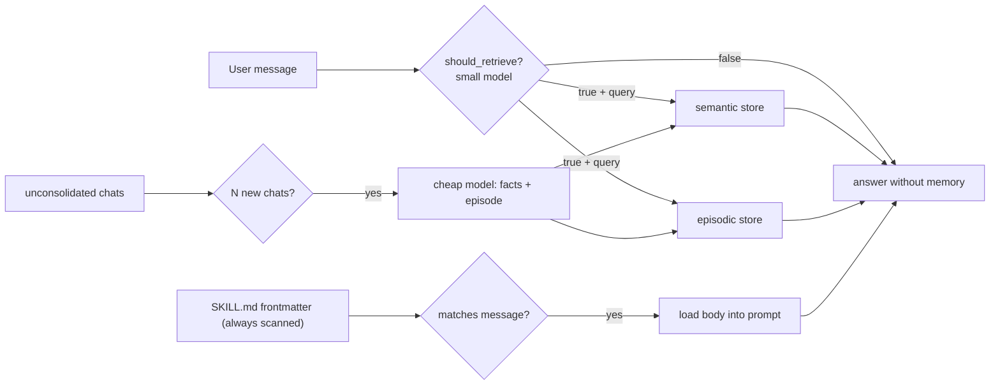

## 1. Executive Summary

Waku is a small MIT-licensed personal agent — about 800 lines of memory code — organized around three pillars borrowed from cognitive science: `semantic/` (facts), `episodic/` (what happened), and `procedural/` (how to act). Each has a SQLite default and an optional external backend: Supabase for facts, Notion for episodes.

That structure is conventional. What makes Waku worth reading is that its design question is not *how do we remember more* but **when should we not do the expensive thing** — and it answers that in three different places.

**Don't retrieve unless the turn needs it.** `retrieval_gate.py` sends the user's message to a cheap model, which returns `{"retrieve": bool, "query": str, "reason": str}`. The docstring states the case plainly:

> "Default-on retrieval is (a) slow — an extra search before every reply — and (b) worse: irrelevant memories bias the answer ('over-interpretation'). So before touching any store, a cheap fast model answers one question: does THIS message need the user's memory?"

**Nothing else in the atlas abstains from retrieval.** Everything else searches every turn, or gates on a crude heuristic. The failure Waku names — irrelevant recall bending the answer — is one the atlas circles under context budgets and [source diversity](../../patterns/source-diverse-context/) but never solves by simply not looking.

**Don't consolidate after every message.** `consolidation.py` batches: "only consolidate after N new chats. Running a summarizer after every message is wasteful and noisy; batching N exchanges gives the summarizer enough context to extract facts worth keeping." The second clause is the better argument — batching is not only cheaper, it produces better summaries.

**Don't load a skill body until it matches.** `procedural/loader.py` implements progressive disclosure over the Anthropic Agent Skills format: every skill's frontmatter is scanned (cheap), a body enters the prompt only on match, and files a skill references are read only if the model asks.

The gate's failure direction is also right, and stated: it **fails open**. If the gate errors, Waku retrieves anyway, because "a stale memory beats a lost one."

The limits are what you would expect at this size: no correction, no supersession, no tombstone, no trust state, and single-user scope.

## 2. Mental Model

```text
semantic/    facts        "Alex prefers morning meetings"      SQLite | Supabase
episodic/    episodes     "2026-07-10: planned the Acme demo"  SQLite | Notion
procedural/  SKILL.md     how to act                           filesystem
```

Read path — the distinctive one:

```text
user message
  → should_retrieve(small_model, message)
      {"retrieve": false} → answer with no memory at all
      {"retrieve": true, "query": ...} → search semantic + episodic with that query
  → procedural: scan all frontmatter, load only matching skill bodies
  → answer
```

Write path:

```text
chats accumulate unconsolidated
  → after N new chats, a cheap model reads the log and emits
        facts    → semantic store
        episode  → episodic store
```

## 3. Architecture

`waku/memory/` (801 lines):

- `retrieval_gate.py` (55) — `should_retrieve()`.
- `__init__.py` (169) — the `Memory` facade, "the three pillars behind one small interface".
- `consolidation.py` (75) — batched distillation into facts and episodes.
- `semantic/store.py` (78), `semantic/supabase_store.py` (58).
- `episodic/store.py` (57), `episodic/notion_store.py` (164).
- `procedural/loader.py` (91), `procedural/installer.py` (54).



## 4. Essential Implementation Paths

### The retrieval gate

```python
def should_retrieve(client, small_model, message) -> tuple[bool, str, str]:
    """Returns (retrieve?, search_query, reason). Fails open: if the gate
    itself errors, we retrieve — a stale memory beats a lost one."""
```

Three details make this more than a prompt.

**It returns a query, not just a verdict.** The same call that decides *whether* also produces *what to search for*, so the gate doubles as a query rewriter and its cost is amortized across two jobs. Compare [Atomic Agent](../atomic-agent/), which has a separate heuristic-gated query rewriter as its own phase.

**It fails open, deliberately.** A gate that skips work must fail toward doing the work: failing closed would silently drop memory on every gate error, which is invisible and unrecoverable. Waku returns `(True, message, "gate failed open (...)")` on any exception, and the reason string records why.

**It survives reasoning models.** A comment records a real incident: `max_tokens` was raised from 100 to 600 because "reasoning models (Kimi K3, ...) spend a thinking block BEFORE the JSON — 100 tokens was truncating the answer away." A separate branch treats a reply containing no `{` as a truncated or reasoning-only response and also fails open.

The `reason` field is a small but good affordance: every gate decision carries a five-word justification, so the log shows not just that memory was skipped but why.

### Batched consolidation

The stated rationale is worth separating into its two halves. Cost is the obvious one. The subtler one is quality: a summarizer invoked after every message sees one exchange and produces noise, while batching N exchanges "gives the summarizer enough context to extract facts worth keeping."

This is the same instinct as [CowAgent](../cowagent/)'s daily buckets and [nanobot](../nanobot/)'s cursor over an append-only archive — give consolidation a unit large enough to be meaningful. Waku's unit is a chat count rather than a calendar day or a token threshold.

### Procedural memory as progressive disclosure

`procedural/loader.py` follows the Anthropic Agent Skills format — YAML frontmatter with `name` and `description`, where the description doubles as the trigger. A comment notes the project previously used a custom `triggers:` field and dropped it once the spec settled, which is a small mark of tracking a standard rather than inventing one.

The three-stage disclosure — frontmatter always, body on match, referenced files on demand — is the same shape [GenericAgent](../genericagent/) reaches through its "existence encoding" ROI rule and [Hermes Agent](../hermes-agent/) through name-and-description-only skill indexing. Waku gets it from the format itself.

## 5. Memory Data Model

Facts and episodes in SQLite, with optional Supabase and Notion backends; skills as files. There is no status, confidence, provenance, supersession, or tombstone on any of them, and no scope beyond a single user.

That is a reasonable position for an 800-line personal agent, and it means Waku answers "what should we retrieve?" carefully while leaving "is this still true?" entirely unanswered. A fact consolidated from a chat where the user changed their mind will sit alongside the correction with nothing distinguishing them.

The Notion episodic backend is the most operationally interesting choice: episodes land somewhere the user already reads and edits, which makes correction a manual but real possibility — the [Basic Memory](../basic-memory/) property of human-owned canonical state, arrived at by picking a familiar tool as the store.

## 6. Retrieval Mechanics

Whatever the underlying stores provide, downstream of the gate. The gate is the mechanism worth studying; the search itself is unremarkable.

The cost model deserves stating honestly: the gate **adds** a small-model call to every turn in order to **remove** a search from some of them. Whether that trades well depends on the ratio of memory-needing turns to the rest, and on the relative latency of the gate model versus the store. Waku asserts the trade is favourable; nothing in the repository measures it.

## 7. Write Mechanics

Consolidation is the only path into durable memory. There is no explicit "remember this" surface in the memory package, and no actor model — whatever the summarizer extracts becomes a fact or an episode.

## 8. Agent Integration

A CLI agent with deterministic evals under `evals/deterministic/`, including `test_working_memory.py` and `test_cli_memory.py`. Skills follow the published Agent Skills format, so procedural memory is portable to other runtimes that read it.

## 9. Reliability, Safety, and Trust

Strengths:

- **A gate that decides whether to work at all**, at three levels.
- **Failing open**, with the reasoning stated in the code.
- **A recorded reason** on every gate decision.
- **Robustness to reasoning-model output**, driven by a real incident.
- **Batched consolidation** justified on quality as well as cost.
- **Progressive disclosure** for skills, following a published format.
- **Deterministic evals** for memory behaviour.
- **Pluggable backends** per memory kind, defaulting to SQLite.

Gaps:

- **No correction, supersession, or tombstone.** A superseded fact and its replacement coexist.
- **No trust state or provenance** on facts and episodes.
- **Single-user scope.**
- **The gate's own accuracy is unmeasured** — a false negative silently answers without memory that would have helped, and nothing detects it.
- **The gate adds a call per turn**, and the net cost is asserted rather than measured.

## 10. Tests, Evals, and Benchmarks

`evals/deterministic/test_working_memory.py` and `test_cli_memory.py` — deterministic rather than model-judged, which is the right shape for behavioural checks. Nothing was run for this review.

The measurement the design most needs and does not have is **gate accuracy**: how often does `should_retrieve` return false on a turn that would have benefited from memory? False positives merely cost a search; false negatives produce a confidently unmemoried answer, and are invisible without a labelled set.

## 11. Patterns Worth Stealing

- **Gate the expensive path.** Decide whether to retrieve before retrieving, and fail open so a broken gate degrades to the old behaviour rather than to silence. See [gate the expensive path](../../patterns/gate-the-expensive-path/).
- **Make the gate produce the query.** One call answers "should we?" and "with what?", halving the cost of gating.
- **Record the reason.** A five-word justification per decision turns a skipped search from a mystery into a log line.
- **Batch consolidation for quality, not just cost.** A summarizer needs enough material to find something worth keeping.
- **Progressive disclosure by default** — index always, body on match, references on demand.
- **Budget for reasoning-model preambles** when parsing structured output from a small model.

## 12. Antipatterns / Risks

- **An unmeasured gate.** The whole design rests on the gate being right, and nothing checks it.
- **Consolidation without correction** — facts accumulate, contradictions coexist.
- **No provenance**, so a wrong fact cannot be traced to the chat that produced it.
- **Asserted cost savings.**

## 13. Build-vs-Borrow Takeaways

Borrow:

- `should_retrieve()` almost verbatim, including the fail-open branch and the reason string.
- The batching rationale for consolidation.
- The three-stage skill disclosure.

Do not copy:

- The data model as a belief store; add correction before it matters.
- A gate without an accuracy measurement, if a missed retrieval is costly.

## 14. Open Questions

- How often does the gate wrongly decline? Nothing labels or measures it.
- Does the gate call cost less than the searches it avoids, in latency and tokens?
- Should a declined retrieval be revisited if the model's answer turns out to need memory?
- What happens when consolidation extracts a fact contradicting an existing one?
- Could the gate's `reason` strings be mined to improve the prompt over time?

## Appendix: File Index

- Retrieval gate: `waku/memory/retrieval_gate.py` (`should_retrieve`, `GATE_PROMPT`).
- Facade: `waku/memory/__init__.py` (`Memory`).
- Consolidation: `waku/memory/consolidation.py`.
- Semantic: `waku/memory/semantic/store.py`, `supabase_store.py`.
- Episodic: `waku/memory/episodic/store.py`, `notion_store.py`.
- Procedural: `waku/memory/procedural/loader.py`, `installer.py`.
- Evals: `evals/deterministic/test_working_memory.py`, `test_cli_memory.py`.
