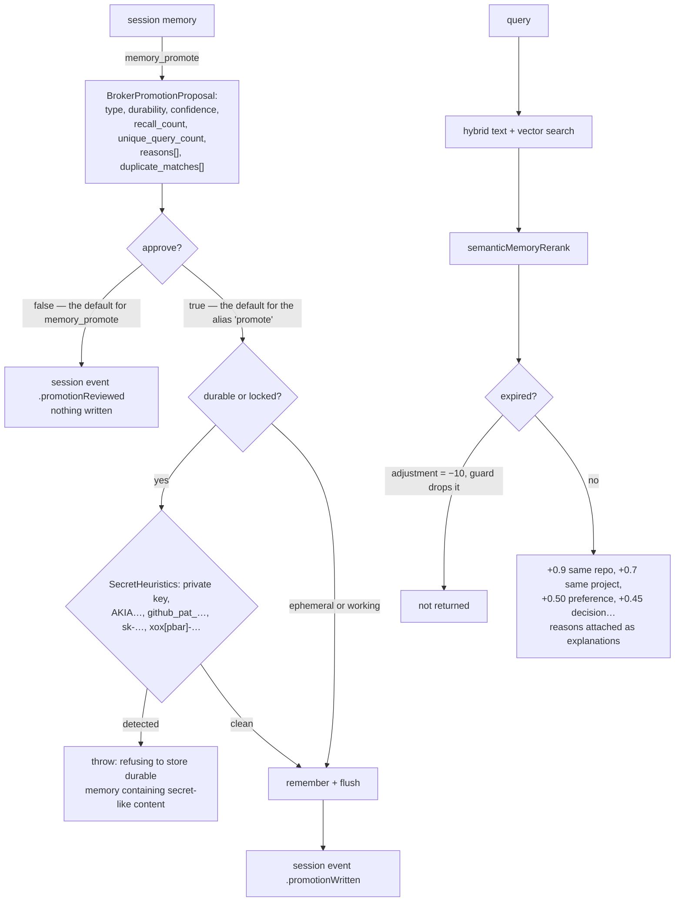

## 1. Executive Summary

Wax is a Swift-native memory engine — 97,000 lines, Apache 2.0, iOS and macOS —
that keeps documents, embeddings and structured knowledge in a **single `.wax`
file**: "No servers. No API keys. No Docker. Just one file you can AirDrop, sync,
or back up like any other document."

**The mechanism worth the report is `Sources/WaxCrashHarness/main.swift`.**

It is a real crash-injection test. The parent seeds a store with one frame,
forks itself as a child with `WAX_CRASH_INJECT_CHECKPOINT` set to a named point
inside the commit sequence, and waits. Three scenarios:

| scenario | checkpoint | frames expected after recovery |
|---|---|---|
| `toc` | `after_toc_write_before_footer` | 1 |
| `footer` | `after_footer_fsync_before_header` | 2 |
| `header` | `after_header_write_before_final_fsync` | 2 |

The child is expected to die by `SIGKILL`. If it does not, that is a failure —
`HarnessError.childDidNotCrash(status:reason:)` — and the child's own fall-through
path writes "child path returned without injected crash" and exits 33. **The test
fails closed at both ends.**

Then the parent reopens the file and asserts three things: the frame count is
exactly what that checkpoint should have committed, the seed frame's bytes are
still `"seed"`, and where two frames are expected, the second frame's bytes are
`"payload-<scenario>"`.

Not "the file opens". Not "no error was thrown". The exact durability boundary of
each fsync, asserted by content.

Almost every system in this atlas claims durability by using SQLite and moving
on. This one wrote its own single-file format — double-buffered header pages, a
TOC, a footer, a WAL ring — and then wrote the thing that proves the format's
commit protocol survives a kill at each step.

**The second mechanism is promotion as a proposal.** `memory_promote` computes a
`BrokerPromotionProposal` — suggested type, suggested durability, confidence,
`recall_count`, `unique_query_count`, `last_retrieved_at_ms`,
`average_relevance_score`, `should_write`, a list of `reasons`, and
`duplicate_matches` with similarity scores — and returns it **without writing**,
because `approve` defaults to `false`. A session event records
`.promotionReviewed`. Only when a caller passes `approve: true` and the proposal
itself says `shouldWrite` does the memory get written, and the event becomes
`.promotionWritten`.

**And the hazard is fifteen lines away.** `promote` — the shorter alias on the
same command surface — sets `approve` to `true` when the caller omits it, and
delegates to `memory_promote`. The same operation, two names, opposite defaults.

## 2. Mental Model

Session memory is the scratch tier. Long-term memory is the durable tier. Moving
between them is `promote`, and promotion is where the review lives.

Every memory carries a `MemoryType` (note, task_state, user_preference, decision,
lesson, handoff, constraint, fact) and a `MemoryDurability` (ephemeral, working,
durable, locked). Retrieval reranks on those, and on whether the memory belongs
to the repo or project you are currently in.



## 3. Architecture

Thirteen Swift targets. `WaxCore` holds the file format and the `Wax` actor —
"the file descriptor, lock, header, TOC, and in-memory index state. All mutable
state is isolated within this actor for thread safety." `Wax` is the memory layer
above it (Broker, Orchestrator, UnifiedSearch, Temporal, Maintenance, PhotoRAG,
VideoRAG). `WaxTextSearch` and `WaxVectorSearch` are the two retrieval halves,
with `WaxVectorSearchArctic` and `WaxVectorSearchMiniLM` shipping CoreML models
and `WaxBertTokenizer` beside them. `WaxCLI`, `WaxRepo`, `WaxMCPServer`, and
`WaxCrashHarness` are the executables.

The `Wax` actor's stored properties are worth skimming for what they say about
the format: `header` and `selectedHeaderPageIndex` (double-buffered headers),
`toc`, `wal: WALRingWriter`, `pendingMutations`, `generation`, `dataEnd`,
staged lexical and vector indexes each with their own stamp, and three
`walProactiveCommit*` thresholds. This is a storage engine, not a wrapper.

## 4. Essential Implementation Paths

**Crash** — `Sources/WaxCrashHarness/main.swift` (`CrashScenario`,
`runScenario`, `seedStore`, `runChildProcess`);
`Sources/WaxCore/Wax.swift` `CrashInjectionCheckpoint`.

**Promote** — `Sources/Wax/Broker/AgentBrokerService.swift` `memoryPromote`
(`:555`, `:621-651`) and `promote` (`:657-663`);
`Sources/Wax/Broker/BrokerMemoryInsights.swift` for the proposal.

**Refuse** — `AgentBrokerService.validateDurableWriteContent` (`:2504`);
`MemorySemantics.SecretHeuristics.detectSecretLikeContent`.

**Rank** — `Sources/Wax/MemorySemantics.swift` `rankingReasons` (`:236`);
`Sources/Wax/UnifiedSearch/UnifiedSearch.swift` `semanticMemoryRerank` (`:600`).

## 5. Memory Data Model

Metadata is string keys under a `wax.` prefix, enumerated in
`MemoryMetadataKeys`: `memory_type`, `durability`, `project`, `repo`,
`created_at_ms`, `expires_at_ms`, `confidence`, `reviewed`,
`promoted_from_session`, `promoted_from_frame`, `duplicate_of_frame`, and six
`source_*` keys including `source_hash` and `source_managed`.

`promoted_from_frame` and `duplicate_of_frame` are the two provenance links that
matter: a durable memory can say which session frame it came from, and which
existing frame it duplicates.

`MemoryDurability` — ephemeral, working, durable, locked — is a **retention**
tier, not an epistemic one, and this report treats it as such. `confidence` is a
`Float`. `reviewed` is a `Bool` that the write surface accepts and
`rankingReasons` never reads: a memory marked reviewed ranks identically to one
that is not.

## 6. Retrieval Mechanics

Hybrid text and vector search, then `semanticMemoryRerank` over a capped window.

**A second retrieval path answers from a structured fact tier, and its
bi-temporal query is unusually complete.** Beside the frame
store, `WaxTextSearch` holds structured subject/predicate/object statements in an
FTS5 index, and every read composes four `WHERE` clauses from a
`StructuredMemoryAsOf` carrying two separate instants
(`FTS5SearchEngine.swift:413-420`):

```swift
whereClauses.append("s.system_from_ms <= ?");              args.append(asOf.systemTimeMs)
whereClauses.append("(s.system_to_ms IS NULL OR s.system_to_ms > ?)"); args.append(asOf.systemTimeMs)
whereClauses.append("s.valid_from_ms <= ?");               args.append(asOf.validTimeMs)
whereClauses.append("(s.valid_to_ms IS NULL OR s.valid_to_ms > ?)");   args.append(asOf.validTimeMs)
```

Two half-open intervals, one per clock, each closed against its own
caller-supplied instant, with `NULL` read as open-ended on both. The broker
exposes it as `facts_query` with a `valid_as_of` argument that falls back to the
system `as_of` when omitted (`AgentBrokerService.swift:2324`), so asking *what did
we believe last March about what was true last January* is two arguments rather
than a reconstruction. `fact_assert` validates the interval at write —
*"valid_to_ms must be greater than valid_from_ms"*. The same four clauses appear
at `:590-593` and `:705-706`, which is the usual copy-paste exposure, and here
every copy carries both clocks.

**Expiry is a read-path exclusion, implemented as a sentinel.**
`rankingReasons` returns `(-10, ["expired memory"])` for an expired memory, and
the rerank drops anything whose adjustment fails `> -9.5`. It works, and there
is a committed test proving it (section 10). It is still a filter smuggled
through the scoring channel, where a future contributor adding a large boost has
no signal that −10 is load-bearing.

**Scope is a boost, not a filter.** `+0.9` for the same repo, `+0.7` for the same
project, with `"same repo"` and `"same project"` appended to the result's
`explanations`. Nothing removes an out-of-scope memory. That is a legitimate
design for a single-user local file — there is no other tenant to leak to — and
it means the `scope_enforced` mark is not earned here: the key changes ordering,
not visibility.

The `explanations` array is a small pleasure: every result carries the reasons it
ranked where it did, in the same terms the code uses.

## 7. Write Mechanics

`put` then `commit` through the actor, with the WAL ring and a proactive-commit
policy driven by three byte thresholds.

**`validateDurableWriteContent` is the guard worth copying.** It parses the
semantics, returns immediately unless the durability is `durable` or `locked`,
and then refuses the write if `SecretHeuristics` finds a private-key header, an
`AKIA…` AWS key, a `github_pat_…` token, an `sk-…` OpenAI-style key or an
`xox[pbar]-…` Slack token — naming the kind in the thrown message.

The graded application is the interesting part: the check runs on the tier that
persists, not on scratch memory. The consequence is also worth stating plainly —
an ephemeral or working memory containing an API key is written without
complaint, and heuristics of this shape miss anything not on the list.

Correction is by TTL and by the maintenance live-set rewrite. There is no
supersession pointer, no tombstone, and no record of a rejected value: a secret
refused at write time leaves nothing behind, so the same content re-offered as
`working` durability is stored.

## 8. Agent Integration

An MCP server with a broker command surface — `memory_append`/`remember`,
`memory_promote`/`promote`, `knowledge_capture`, `session_start`, handoff and
checkpoint — plus a CLI and a Swift package API. Sessions are explicit objects
with a manifest, an agent ID, a run ID and an event log.

## 9. Reliability, Safety, and Trust

**Audit log — awarded, on the session event log and not on the WAL.** The record
is `BrokerSessionEvent`, a JSONL line appended by
`BrokerSessionPersistence.appendEvent` — encode, newline, `seekToEnd`, write —
carrying session ID, agent ID, run ID and a millisecond timestamp. Eleven kinds
cover mutations (`remembered`, `promotionWritten`, `handoff`, `checkpoint`,
`markdownExported`) as well as retrieval (`retrievalHit`), and
`promotionReviewed` is a distinct kind from `promotionWritten`, so a
reviewed-but-unwritten promotion stays legible afterwards. Nothing in the module
truncates or removes the file.

Worth stating because the distinction is easy to lose in a project that has
both: the `.wax` file's WAL is *not* this. `WALRingWriter` is a fixed-size ring
with a `wrapCount`, reclaimed behind a checkpoint — it exists so an interrupted
write can be replayed, and it overwrites its own oldest frames by design. A ring
that wraps cannot answer *what changed last month*, which is the question an
audit record is for. Durability evidence and audit evidence look alike from a
distance and are not interchangeable.

**Human review — withheld, and this reverses an earlier reading.** The previous
reading awarded it on the grounds that `memory_promote` defaults `approve` to
`false`, returns a proposal with its reasons and duplicate matches, and logs the
decision either way — noting the `promote` alias as a flaw but keeping the mark
because *"the reviewed path exists and works"*. That is true and it is not the
test. The mark asks who is permitted to approve, and nothing here asks. `approve`
is a plain boolean argument on the broker command surface
(`Sources/Wax/Broker/BrokerCommandCatalog.swift:280-283`), the MCP tool schemas
are generated straight from that catalog
(`Sources/WaxMCPServer/ToolSchemas.swift:37-52`), and its description is handed
to the model verbatim: *"When true, write the reviewed proposal into durable
long-term memory."* So an agent holding `memory_promote` can propose and approve
in one call, and there is no caller-identity check anywhere in the broker — no
context that must lack an agent id, no loopback or credential gate, no
interactive confirmation on the CLI path, which forwards to the same verb. The
proposal is rendered for whoever called, and on this surface that is the agent.
The `promote` alias, documented as *"OpenClaw-compatible alias for durable
promotion; writes approved durable memory by default,"* makes the gap wider but
is not what decides it: even the asking verb hands the model the flag that skips
the asking. Both verbs appear only under the opt-in `full` MCP profile — the
default `daily` profile is `remember`, `recall`, `stats` and exposes no promotion
at all — so the exposure is a deployment choice, which is worth knowing and is
not a producer test either.

The promotion proposal remains the most reusable thing here, and section 11 still
recommends it. What it is not is a human-review gate.

**Negative eval — awarded**, section 10.

**Scope — withheld**, per section 6: a ranking boost, never an exclusion.

**Trust state — withheld.** Durability is retention, `confidence` is a float, and
`reviewed` is written but not read at retrieval.

**Bitemporal — awarded, on the structured fact tier only.** An earlier draft of
this section said no, on the grounds that `created_at_ms`, `expires_at_ms` and a
`source_date` are one clock; that is still true of the *frame* tier, and the
`Temporal` module's natural-language date resolution is still query parsing
rather than a validity model. The structured fact tier beside them is a different
thing: a fact carries `system_from_ms`/`system_to_ms` and
`valid_from_ms`/`valid_to_ms` as two independent half-open intervals, and the
read closes each against its own instant from a `StructuredMemoryAsOf` that
carries a separate `systemTimeMs` and `validTimeMs`. `valid_from` is a caller
argument defaulted to now; the system axis is stamped by the writer and never
taken from the caller, which is the direction that has to hold for the record
axis to mean anything.

**Tombstone — no.**

## 10. Tests, Evals, and Benchmarks

**No paper.** 173 Swift test files across six suites (`WaxCoreTests`,
`WaxTests`, `WaxIntegrationTests`, `WaxCLITests`, `WaxMCPServerTests`,
`WaxArcticTests`), plus the crash harness as its own executable target.

`Tests/WaxIntegrationTests/UnifiedSearchTests.swift` contains
`expiredMemoriesAreExcludedFromUnifiedSearch`, which writes two frames — one with
`wax.expires_at_ms` one second in the past, one current — indexes both, searches,
and asserts the active frame is present **and the expired frame is not**. A
committed case asserting that particular material must not be retrieved: the
`negative_eval` mark, in its plainest form.

The crash harness is the more unusual artifact and does not fit that mark
(durability, not retrieval), but it is the better piece of engineering.

**One gap.** `CrashInjectionCheckpoint` declares four checkpoints —
`afterTocWriteBeforeFooter`, `afterFooterWriteBeforeFsync`,
`afterFooterFsyncBeforeHeader`, `afterHeaderWriteBeforeFinalFsync` — and
`CrashScenario` exercises three. `after_footer_write_before_fsync` is defined and
never killed at.

No retrieval benchmark and no committed latency numbers were found; the README's
speed claims are prose.

**I ran nothing.** This is macOS Swift and the tree was read, not built.

## 11. For Your Own Build

### Steal

- **Kill the writer at named points in your commit sequence.** Not "does it
  reopen" — fork a child, SIGKILL it after the TOC write, after the footer fsync,
  after the header write, then assert the exact number of committed records
  *and their bytes*. If you wrote your own storage format, this is the test that
  earns it.
- **Fail when the crash does not happen.** `childDidNotCrash` as an error, and an
  exit code on the child's fall-through path. A crash test that silently passes
  when injection breaks is worse than no crash test.
- **Make promotion a proposal.** Return suggested type, suggested durability,
  confidence, recall count, unique query count, the reasons, and the duplicate
  matches with similarity scores — and write nothing until someone says yes.
- **Log the review as well as the write.** `.promotionReviewed` versus
  `.promotionWritten`, with `approved` and `written` as separate booleans, means
  the log distinguishes "a person looked and declined" from "nothing happened".
- **Grade the secret check by durability tier.** Refusing private keys, AWS keys,
  GitHub PATs, OpenAI-style keys and Slack tokens on the durable path, and naming
  which one was detected in the error, is a cheap guard at exactly the boundary
  that matters.
- **Attach the ranking reasons to the result.** `"same repo"`, `"decision
  memory"`, `"recent task state"`, `"expired memory"` — the explanation is the
  same string the scoring code used, so it cannot drift from the behaviour.

### Avoid

- **Do not ship two names for one call with opposite approval defaults.**
  `memory_promote` asks; `promote` acts. Whichever you keep, make the safe
  default the only default.
- **Do not express a hard exclusion as a magic score.** `-10` against a `> -9.5`
  guard is a filter wearing a ranking's clothes. Filter first, then rank.
- **Do not accept a `reviewed` flag you never read.** If a human's approval does
  not change retrieval, the flag is documentation.
- **Do not let the scratch tier be the hole in your secret check.** Ephemeral and
  working memories skip `validateDurableWriteContent` entirely, and session
  memory is still on disk.

### Fit

The right choice if you are shipping an Apple-platform agent and want memory that
is a document — one file, no daemon, CoreML embeddings on device. The single-file
format with a proven commit protocol is a real asset for a mobile app where the
process can be killed by the OS at any moment, which is precisely the scenario
the harness models.

Wrong choice if you need multi-tenant isolation: scope here changes ranking, not
visibility, and the design assumes one person's file.

## 12. Open Questions

- **Why is `after_footer_write_before_fsync` not exercised?** It is the one
  checkpoint declared and unused, and it is the one where a lost fsync is most
  interesting.
- **Does anything read `wax.reviewed`?** No consumer was found in ranking or
  retrieval.
- **What does the maintenance live-set rewrite do to expired frames?**
  `LiveSetRewriteOptions` and `LiveSetRewriteReport` exist; whether compaction
  removes expired content or only reclaims space was not traced.
- **Is the promotion proposal's `shouldWrite` overridable?** The write requires
  `approve && proposal.shouldWrite`; whether a caller can force past a
  `shouldWrite: false` was not established.

## Appendix: File Index

**Crash harness** — `Sources/WaxCrashHarness/main.swift` (`HarnessError` `:4-23`,
`CrashScenario` with checkpoints and expected frame counts `:25-47`,
`runScenario` `:95-129`, `seedStore` `:131-141`, `runChildProcess` `:143`),
`Sources/WaxCore/Wax.swift` (`CrashInjectionCheckpoint` `:151-158`, the actor's
stored state `:160-190`)

**Promotion and review** — `Sources/Wax/Broker/AgentBrokerService.swift`
(`memoryPromote` approve parsing `:555`, the write gate `:621-631`, the session
event `:633-646`, the response `:648-654`, the `promote` alias `:657-663`,
`renderPromotionProposal` `:2512`, `validateDurableWriteContent` `:2504-2511`,
`appendSessionEvent` `:1489-1508`),
`Sources/Wax/Broker/BrokerMemoryInsights.swift` (duplicates and reasons
`:100-135`), `Sources/Wax/Broker/AgentBrokerCommandSurface.swift`,
`Sources/Wax/Broker/BrokerSessionPersistence.swift` (`BrokerSessionEvent.Kind`
`:70-79`, `appendEvent` `:173-183`)

**Semantics and ranking** — `Sources/Wax/MemorySemantics.swift`
(`MemoryType` `:3-12`, `MemoryDurability` `:14-19`, `MemoryScopeContext` `:21-38`,
`MemoryMetadataKeys` `:82-104`, `SecretHeuristics` `:106+`, `rankingReasons`
`:236-290`), `Sources/Wax/UnifiedSearch/UnifiedSearch.swift`
(`semanticMemoryRerank` `:600-653`, `baseExplanations` `:655`)

**Temporal** — `Sources/Wax/Temporal/TemporalResolution.swift`,
`TemporalNormalizer.swift`

**Tests** — `Tests/WaxIntegrationTests/UnifiedSearchTests.swift`
(`expiredMemoriesAreExcludedFromUnifiedSearch` `:1157-1190`)

## Appendix: Recorded Searches

Run from the root of the checkout at the pinned commit.

| Claim | Command | Result at this pin |
| --- | --- | --- |
| Two clocks are filtered independently | read `Sources/WaxTextSearch/FTS5SearchEngine.swift:413-420` | Four clauses: `system_from_ms`/`system_to_ms` against `asOf.systemTimeMs`, `valid_from_ms`/`valid_to_ms` against `asOf.validTimeMs` |
| Both clocks are caller-supplied | `grep -rn "validAsOfMs" --include="*.swift" Sources` | `BrokerCommand.swift:771` takes `valid_as_of`; `AgentBrokerService.swift:2324` falls back to the system `as_of` |
| The two promote verbs disagree on approval | `grep -n "defaultApprove" Sources/Wax/Broker/BrokerCommand.swift` | `:339` `memory_promote` with `false`, `:341` `promote` with `true` — adjacent lines |
| `reviewed` does not affect ranking | `grep -rn "reviewed" --include="*.swift" Sources \| grep -i rank` | Nothing |
| The pinned commit is orphaned | `git merge-base --is-ancestor <old-pin> HEAD` | Fails; `c023b7c4` carries the same timestamp and subject with 224 lines removed across three files |
| Tree and suite size | `find Sources -name "*.swift" \| xargs wc -l \| tail -1`; `find Tests -name "*.swift" \| wc -l` | 70,668 lines; 272 test files |

## History

**2026-09-16** — [`9f79b1a6a8d2b7dfb732af7412b2381df8fa5033`](https://github.com/christopherkarani/Wax/commit/9f79b1a6a8d2b7dfb732af7412b2381df8fa5033) — re-read after 52 commits and roughly 17,000 added lines. **One mark is withdrawn: `human_review`.** The previous reading saw the `promote` alias default `approve` to `true` and kept the mark anyway, on the grounds that the reviewed path exists and works. Re-reading the producer rather than the states settles it the other way: `approve` is an ordinary boolean argument in `BrokerCommandCatalog`, the MCP tool schemas are generated from that catalog, and the model is given its description verbatim — so an agent can propose and approve in one call, and no caller-identity check exists anywhere in the broker, on the MCP path or on the CLI path that forwards to the same verb. The mark asks who may approve; nothing here asks. This was true at the previous pin too, so it is a correction rather than a change. The promotion-proposal machinery keeps its place in section 11 as a thing to copy, with the approver check it lacks.

Three evidence records were also wrong or too thin to check, and are rewritten. `audit_log` cited *"the WAL ring | the single .wax file"*; the WAL is a fixed-size ring that wraps behind a checkpoint and cannot answer what changed last month. The real basis is the one section 9 always described — the append-only `BrokerSessionEvent` JSONL, now anchored. `bitemporal` was awarded in the frontmatter while section 9 said *"Bitemporal — no"*; the structured fact tier does carry two independent intervals filtered against separate instants, `valid_from` is a caller argument and the system axis is writer-stamped, so the mark stands and section 9 is corrected. `negative_eval` named no file; it is `UnifiedSearchTests.swift:1175-1210`, where an expired frame is asserted absent from the same populated result that must contain the active one.

Of the two anchored files, `FTS5SearchEngine.swift` is byte-identical at both commits and `BrokerCommand.swift` moved. Counts refreshed: 70,668 lines of Swift across twelve targets, 272 test files. Re-screened at this commit: one agent-directed file read as data, five floating versions, two manifests inside the cooldown. Read on macOS, never built.

**2026-09-11** — [`77778962d25a163bdb32a6319d10b52c323d3036`](https://github.com/christopherkarani/Wax/commit/77778962d25a163bdb32a6319d10b52c323d3036) — re-read. **The previous pin is no longer reachable from the branch**: the history was rewritten, and the commit carrying the same timestamp and subject, [`c023b7c4d09557e550c441b1ec70facc74b60eb2`](https://github.com/christopherkarani/Wax/commit/c023b7c4d09557e550c441b1ec70facc74b60eb2), differs from the orphaned `93cbf51f` by 224 deletions across three files — an internal deploy skill, a `.pi` extension manifest and a todo list. This report cites none of them, so the rewrite costs it nothing; the orphaned commit remains fetchable by full sha and the atlas archive preserves it.

**`bitemporal` is added, and it is a first-reading miss rather than an upstream change** — the columns and the four `WHERE` clauses are present at both pins, in identical number. The previous edition described only the `.wax` frame store and never reached `WaxTextSearch`, where structured subject/predicate/object statements are queried through two independent half-open intervals: `system_from_ms`/`system_to_ms` against `asOf.systemTimeMs` and `valid_from_ms`/`valid_to_ms` against `asOf.validTimeMs`, each `NULL` read as open-ended. The broker surfaces it as `facts_query` with a `valid_as_of` that defaults to the system `as_of`, and `fact_assert` refuses an interval whose end does not exceed its start. The previous edition had this tier as a store of frames with TTLs.

**The approve-default inconsistency holds**, and is now easier to see than when first reported: `BrokerCommand.swift:339` decodes `memory_promote` with `defaultApprove: false` and `:341` decodes `promote` with `defaultApprove: true`, two adjacent lines dispatching the same `MemoryPromote`. `reviewed` is still a `Bool` no ranking path reads. Screened before reading: thirteen findings; nothing was built or run.

**2026-08-09** — [`93cbf51f76f7db4f837c744f84d26554f7fc9f66`](https://github.com/christopherkarani/Wax/commit/93cbf51f76f7db4f837c744f84d26554f7fc9f66) — first reading. Screened before reading; the tree was read, never built, and no test was run.
