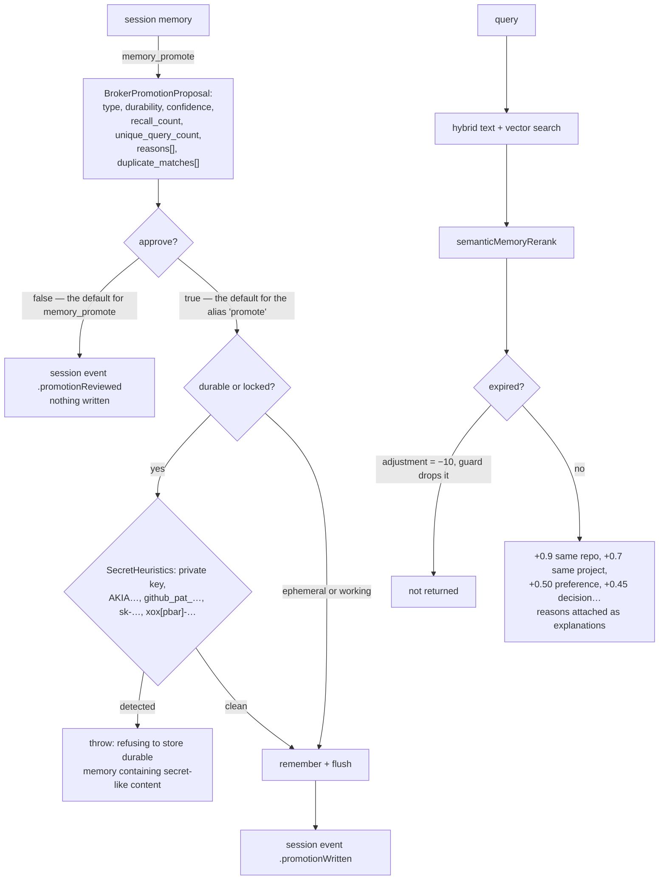

## 1. Executive Summary

Wax is a Swift-native memory engine — 97,000 lines, Apache 2.0, iOS and macOS —
that keeps documents, embeddings and structured knowledge in a **single `.wax`
file**: "No servers. No API keys. No Docker. Just one file you can AirDrop, sync,
or back up like any other document."

**The mechanism worth the report is `Sources/WaxCrashHarness/main.swift`.**

It is a real crash-injection test. The parent seeds a store with one frame,
forks itself as a child with `WAX_CRASH_INJECT_CHECKPOINT` set to a named point
inside the commit sequence, and waits. Three scenarios:

| scenario | checkpoint | frames expected after recovery |
|---|---|---|
| `toc` | `after_toc_write_before_footer` | 1 |
| `footer` | `after_footer_fsync_before_header` | 2 |
| `header` | `after_header_write_before_final_fsync` | 2 |

The child is expected to die by `SIGKILL`. If it does not, that is a failure —
`HarnessError.childDidNotCrash(status:reason:)` — and the child's own fall-through
path writes "child path returned without injected crash" and exits 33. **The test
fails closed at both ends.**

Then the parent reopens the file and asserts three things: the frame count is
exactly what that checkpoint should have committed, the seed frame's bytes are
still `"seed"`, and where two frames are expected, the second frame's bytes are
`"payload-<scenario>"`.

Not "the file opens". Not "no error was thrown". The exact durability boundary of
each fsync, asserted by content.

Almost every system in this atlas claims durability by using SQLite and moving
on. This one wrote its own single-file format — double-buffered header pages, a
TOC, a footer, a WAL ring — and then wrote the thing that proves the format's
commit protocol survives a kill at each step.

**The second mechanism is promotion as a proposal.** `memory_promote` computes a
`BrokerPromotionProposal` — suggested type, suggested durability, confidence,
`recall_count`, `unique_query_count`, `last_retrieved_at_ms`,
`average_relevance_score`, `should_write`, a list of `reasons`, and
`duplicate_matches` with similarity scores — and returns it **without writing**,
because `approve` defaults to `false`. A session event records
`.promotionReviewed`. Only when a caller passes `approve: true` and the proposal
itself says `shouldWrite` does the memory get written, and the event becomes
`.promotionWritten`.

**And the hazard is fifteen lines away.** `promote` — the shorter alias on the
same command surface — sets `approve` to `true` when the caller omits it, and
delegates to `memory_promote`. The same operation, two names, opposite defaults.

## 2. Mental Model

Session memory is the scratch tier. Long-term memory is the durable tier. Moving
between them is `promote`, and promotion is where the review lives.

Every memory carries a `MemoryType` (note, task_state, user_preference, decision,
lesson, handoff, constraint, fact) and a `MemoryDurability` (ephemeral, working,
durable, locked). Retrieval reranks on those, and on whether the memory belongs
to the repo or project you are currently in.

## 3. Architecture

Thirteen Swift targets. `WaxCore` holds the file format and the `Wax` actor —
"the file descriptor, lock, header, TOC, and in-memory index state. All mutable
state is isolated within this actor for thread safety." `Wax` is the memory layer
above it (Broker, Orchestrator, UnifiedSearch, Temporal, Maintenance, PhotoRAG,
VideoRAG). `WaxTextSearch` and `WaxVectorSearch` are the two retrieval halves,
with `WaxVectorSearchArctic` and `WaxVectorSearchMiniLM` shipping CoreML models
and `WaxBertTokenizer` beside them. `WaxCLI`, `WaxRepo`, `WaxMCPServer`, and
`WaxCrashHarness` are the executables.

The `Wax` actor's stored properties are worth skimming for what they say about
the format: `header` and `selectedHeaderPageIndex` (double-buffered headers),
`toc`, `wal: WALRingWriter`, `pendingMutations`, `generation`, `dataEnd`,
staged lexical and vector indexes each with their own stamp, and three
`walProactiveCommit*` thresholds. This is a storage engine, not a wrapper.

## 4. Essential Implementation Paths

**Crash** — `Sources/WaxCrashHarness/main.swift` (`CrashScenario`,
`runScenario`, `seedStore`, `runChildProcess`);
`Sources/WaxCore/Wax.swift` `CrashInjectionCheckpoint`.

**Promote** — `Sources/Wax/Broker/AgentBrokerService.swift` `memoryPromote`
(`:555`, `:621-651`) and `promote` (`:657-663`);
`Sources/Wax/Broker/BrokerMemoryInsights.swift` for the proposal.

**Refuse** — `AgentBrokerService.validateDurableWriteContent` (`:2504`);
`MemorySemantics.SecretHeuristics.detectSecretLikeContent`.

**Rank** — `Sources/Wax/MemorySemantics.swift` `rankingReasons` (`:236`);
`Sources/Wax/UnifiedSearch/UnifiedSearch.swift` `semanticMemoryRerank` (`:600`).

## 5. Memory Data Model

Metadata is string keys under a `wax.` prefix, enumerated in
`MemoryMetadataKeys`: `memory_type`, `durability`, `project`, `repo`,
`created_at_ms`, `expires_at_ms`, `confidence`, `reviewed`,
`promoted_from_session`, `promoted_from_frame`, `duplicate_of_frame`, and six
`source_*` keys including `source_hash` and `source_managed`.

`promoted_from_frame` and `duplicate_of_frame` are the two provenance links that
matter: a durable memory can say which session frame it came from, and which
existing frame it duplicates.

`MemoryDurability` — ephemeral, working, durable, locked — is a **retention**
tier, not an epistemic one, and this report treats it as such. `confidence` is a
`Float`. `reviewed` is a `Bool` that the write surface accepts and
`rankingReasons` never reads: a memory marked reviewed ranks identically to one
that is not.

## 6. Retrieval Mechanics

Hybrid text and vector search, then `semanticMemoryRerank` over a capped window.

**Expiry is a read-path exclusion, implemented as a sentinel.**
`rankingReasons` returns `(-10, ["expired memory"])` for an expired memory, and
the rerank drops anything whose adjustment fails `> -9.5`. It works, and there
is a committed test proving it (section 10). It is still a filter smuggled
through the scoring channel, where a future contributor adding a large boost has
no signal that −10 is load-bearing.

**Scope is a boost, not a filter.** `+0.9` for the same repo, `+0.7` for the same
project, with `"same repo"` and `"same project"` appended to the result's
`explanations`. Nothing removes an out-of-scope memory. That is a legitimate
design for a single-user local file — there is no other tenant to leak to — and
it means the `scope_enforced` mark is not earned here: the key changes ordering,
not visibility.

The `explanations` array is a small pleasure: every result carries the reasons it
ranked where it did, in the same terms the code uses.

## 7. Write Mechanics

`put` then `commit` through the actor, with the WAL ring and a proactive-commit
policy driven by three byte thresholds.

**`validateDurableWriteContent` is the guard worth copying.** It parses the
semantics, returns immediately unless the durability is `durable` or `locked`,
and then refuses the write if `SecretHeuristics` finds a private-key header, an
`AKIA…` AWS key, a `github_pat_…` token, an `sk-…` OpenAI-style key or an
`xox[pbar]-…` Slack token — naming the kind in the thrown message.

The graded application is the interesting part: the check runs on the tier that
persists, not on scratch memory. The consequence is also worth stating plainly —
an ephemeral or working memory containing an API key is written without
complaint, and heuristics of this shape miss anything not on the list.

Correction is by TTL and by the maintenance live-set rewrite. There is no
supersession pointer, no tombstone, and no record of a rejected value: a secret
refused at write time leaves nothing behind, so the same content re-offered as
`working` durability is stored.

## 8. Agent Integration

An MCP server with a broker command surface — `memory_append`/`remember`,
`memory_promote`/`promote`, `knowledge_capture`, `session_start`, handoff and
checkpoint — plus a CLI and a Swift package API. Sessions are explicit objects
with a manifest, an agent ID, a run ID and an event log.

## 9. Reliability, Safety, and Trust

**Audit log — awarded.** `BrokerSessionEvent` is a JSONL record appended by
`BrokerSessionPersistence.appendEvent` — encode, newline, `seekToEnd`, write —
carrying session ID, agent ID, run ID and a millisecond timestamp. Its kinds
cover mutations (`remembered`, `promotionWritten`, `handoff`, `checkpoint`) as
well as retrieval (`retrievalHit`), and the promotion events record `approved`
and `written` as separate booleans, so a reviewed-but-not-written promotion is
distinguishable from an approved one.

**Human review — awarded.** `approve` defaults to `false` on `memory_promote`,
the proposal is rendered for a person with its reasons and duplicate matches, and
the decision is logged either way. This is a real adjudication surface, and it is
the *right* place for one: at promotion from scratch to durable.

**And the alias undoes it by default.** `promote` sets `approve` to `true` when
absent. An agent reading the command list sees both names with the same
parameters; one asks and one acts. The mark stands because the reviewed path
exists and works, but a reader adopting this should change that default.

**Negative eval — awarded**, section 10.

**Scope — withheld**, per section 6: a ranking boost, never an exclusion.

**Trust state — withheld.** Durability is retention, `confidence` is a float, and
`reviewed` is written but not read at retrieval.

**Bitemporal — no.** `created_at_ms`, `expires_at_ms` and a `source_date`, but no
separation of when a fact was true from when Wax recorded it. The `Temporal`
module resolves natural-language dates into a `SearchTimeRange`, which is query
parsing rather than a validity model.

**Tombstone — no.**

## 10. Tests, Evals, and Benchmarks

**No paper.** 173 Swift test files across six suites (`WaxCoreTests`,
`WaxTests`, `WaxIntegrationTests`, `WaxCLITests`, `WaxMCPServerTests`,
`WaxArcticTests`), plus the crash harness as its own executable target.

`Tests/WaxIntegrationTests/UnifiedSearchTests.swift` contains
`expiredMemoriesAreExcludedFromUnifiedSearch`, which writes two frames — one with
`wax.expires_at_ms` one second in the past, one current — indexes both, searches,
and asserts the active frame is present **and the expired frame is not**. A
committed case asserting that particular material must not be retrieved: the
`negative_eval` mark, in its plainest form.

The crash harness is the more unusual artifact and does not fit that mark
(durability, not retrieval), but it is the better piece of engineering.

**One gap.** `CrashInjectionCheckpoint` declares four checkpoints —
`afterTocWriteBeforeFooter`, `afterFooterWriteBeforeFsync`,
`afterFooterFsyncBeforeHeader`, `afterHeaderWriteBeforeFinalFsync` — and
`CrashScenario` exercises three. `after_footer_write_before_fsync` is defined and
never killed at.

No retrieval benchmark and no committed latency numbers were found; the README's
speed claims are prose.

**I ran nothing.** This is macOS Swift and the tree was read, not built.

## 11. For Your Own Build

### Steal

- **Kill the writer at named points in your commit sequence.** Not "does it
  reopen" — fork a child, SIGKILL it after the TOC write, after the footer fsync,
  after the header write, then assert the exact number of committed records
  *and their bytes*. If you wrote your own storage format, this is the test that
  earns it.
- **Fail when the crash does not happen.** `childDidNotCrash` as an error, and an
  exit code on the child's fall-through path. A crash test that silently passes
  when injection breaks is worse than no crash test.
- **Make promotion a proposal.** Return suggested type, suggested durability,
  confidence, recall count, unique query count, the reasons, and the duplicate
  matches with similarity scores — and write nothing until someone says yes.
- **Log the review as well as the write.** `.promotionReviewed` versus
  `.promotionWritten`, with `approved` and `written` as separate booleans, means
  the log distinguishes "a person looked and declined" from "nothing happened".
- **Grade the secret check by durability tier.** Refusing private keys, AWS keys,
  GitHub PATs, OpenAI-style keys and Slack tokens on the durable path, and naming
  which one was detected in the error, is a cheap guard at exactly the boundary
  that matters.
- **Attach the ranking reasons to the result.** `"same repo"`, `"decision
  memory"`, `"recent task state"`, `"expired memory"` — the explanation is the
  same string the scoring code used, so it cannot drift from the behaviour.

### Avoid

- **Do not ship two names for one call with opposite approval defaults.**
  `memory_promote` asks; `promote` acts. Whichever you keep, make the safe
  default the only default.
- **Do not express a hard exclusion as a magic score.** `-10` against a `> -9.5`
  guard is a filter wearing a ranking's clothes. Filter first, then rank.
- **Do not accept a `reviewed` flag you never read.** If a human's approval does
  not change retrieval, the flag is documentation.
- **Do not let the scratch tier be the hole in your secret check.** Ephemeral and
  working memories skip `validateDurableWriteContent` entirely, and session
  memory is still on disk.

### Fit

The right choice if you are shipping an Apple-platform agent and want memory that
is a document — one file, no daemon, CoreML embeddings on device. The single-file
format with a proven commit protocol is a real asset for a mobile app where the
process can be killed by the OS at any moment, which is precisely the scenario
the harness models.

Wrong choice if you need multi-tenant isolation: scope here changes ranking, not
visibility, and the design assumes one person's file.

## 12. Open Questions

- **Why is `after_footer_write_before_fsync` not exercised?** It is the one
  checkpoint declared and unused, and it is the one where a lost fsync is most
  interesting.
- **Does anything read `wax.reviewed`?** No consumer was found in ranking or
  retrieval.
- **What does the maintenance live-set rewrite do to expired frames?**
  `LiveSetRewriteOptions` and `LiveSetRewriteReport` exist; whether compaction
  removes expired content or only reclaims space was not traced.
- **Is the promotion proposal's `shouldWrite` overridable?** The write requires
  `approve && proposal.shouldWrite`; whether a caller can force past a
  `shouldWrite: false` was not established.

## Appendix: File Index

**Crash harness** — `Sources/WaxCrashHarness/main.swift` (`HarnessError` `:4-23`,
`CrashScenario` with checkpoints and expected frame counts `:25-47`,
`runScenario` `:95-129`, `seedStore` `:131-141`, `runChildProcess` `:143`),
`Sources/WaxCore/Wax.swift` (`CrashInjectionCheckpoint` `:151-158`, the actor's
stored state `:160-190`)

**Promotion and review** — `Sources/Wax/Broker/AgentBrokerService.swift`
(`memoryPromote` approve parsing `:555`, the write gate `:621-631`, the session
event `:633-646`, the response `:648-654`, the `promote` alias `:657-663`,
`renderPromotionProposal` `:2512`, `validateDurableWriteContent` `:2504-2511`,
`appendSessionEvent` `:1489-1508`),
`Sources/Wax/Broker/BrokerMemoryInsights.swift` (duplicates and reasons
`:100-135`), `Sources/Wax/Broker/AgentBrokerCommandSurface.swift`,
`Sources/Wax/Broker/BrokerSessionPersistence.swift` (`BrokerSessionEvent.Kind`
`:70-79`, `appendEvent` `:173-183`)

**Semantics and ranking** — `Sources/Wax/MemorySemantics.swift`
(`MemoryType` `:3-12`, `MemoryDurability` `:14-19`, `MemoryScopeContext` `:21-38`,
`MemoryMetadataKeys` `:82-104`, `SecretHeuristics` `:106+`, `rankingReasons`
`:236-290`), `Sources/Wax/UnifiedSearch/UnifiedSearch.swift`
(`semanticMemoryRerank` `:600-653`, `baseExplanations` `:655`)

**Temporal** — `Sources/Wax/Temporal/TemporalResolution.swift`,
`TemporalNormalizer.swift`

**Tests** — `Tests/WaxIntegrationTests/UnifiedSearchTests.swift`
(`expiredMemoriesAreExcludedFromUnifiedSearch` `:1157-1190`)

## History

**2026-08-09** — [`93cbf51f76f7db4f837c744f84d26554f7fc9f66`](https://github.com/christopherkarani/Wax/commit/93cbf51f76f7db4f837c744f84d26554f7fc9f66) — first reading. Screened before reading; the tree was read, never built, and no test was run.
