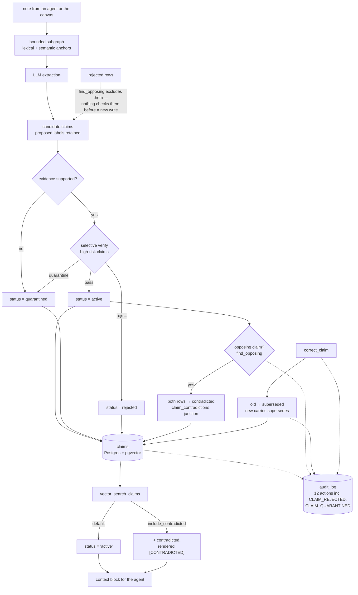

## 1. Executive Summary

Weave is a knowledge-graph application in Rust — 13,800 lines across 53 files,
47 commits since 11 August 2026 — with two faces. The web side turns plain notes
into a live graph on a React Flow canvas. The side this report is about is
`mcp/`: 5,500 lines described in the README as *"a server-owned memory service
for any MCP agent (Hermes, Claude Desktop, Codex)."* The two are separate
workspaces sharing a schema lineage.

**There is no LICENSE file in the tree**, and no licence badge claiming one, so
what a reader may do with this is not established by the repository.

Two marks, and both rest on the same design decision: memory here is a **claim**,
not a chunk. Nine migrations build up to `claims` — subject, predicate and object
as resolved entity ids, with the LLM's *proposed* labels kept alongside them
*"for auditability"*, an evidence span and character offset into the source note,
an extraction version, a source (`user`, `file`, `agent`, `import`), a
`confidence` float, a four-value `modality`, and a five-value `status`.

**Recall is default-deny on status.** `vector_search_claims` filters
`AND c.status = 'active'`, and widens to `IN ('active','contradicted')` only when
the caller explicitly asks — at which point the assembled context block renders
the claim with a `[CONTRADICTED]` marker. Rejected, quarantined and superseded
claims stay on the row for audit and never reach an agent by default. Most
systems in this corpus rank a doubted memory lower; this one declines to return
it and makes the exception opt-in and labelled.

**The audit log records refusals.** Twelve actions, and `CLAIM_REJECTED` and
`CLAIM_QUARANTINED` sit beside `CLAIM_CREATED`. This atlas has recorded the
opposite pattern repeatedly — a governance layer that logs the memory it
surfaced and never the one it declined — and here both halves are the same row
shape in the same table.

**Weakest, and it is one query away:** nothing consults the rejected set before
admitting a new claim. `find_opposing` excludes `status <> 'rejected'` when
looking for contradictions, which is the *opposite* of a tombstone check — it
means a claim the verifier rejected is invisible to the comparison that would
notice it coming back, so the same statement can be re-ingested and land
`active`. The vocabulary contains the word "rejected" and the write path does
not read it.

## 2. Mental Model

```text
note ──► bounded subgraph selection (lexical + semantic anchors,
         capped at 64 nodes / 256 edges / a token budget)
             │
             ▼
        LLM extraction ──► candidate claims
             │              (proposed labels kept)
             ▼
        validate ──► supported?  ── no ──► status = quarantined ──┐
             │           yes                                       │
             ▼                                                     │
        optional verify (high-risk only) ──► reject / quarantine ──┤
             │                                                     │
             ▼                                                     │
        contradiction check ──► both rows marked contradicted      │
             │                                                     │
             ▼                                                     ▼
        claims table  ◄──────────────────── audit_log (actor, action,
             │                               before/after — including
             │                               the rejections)
             ▼
   recall: status = 'active'          ← default
           status IN ('active','contradicted') + [CONTRADICTED] marker
                                       ← only when asked
```

The unit is an assertion with its evidence attached, and the status is the
answer to *may this be acted on*. Everything else — confidence, modality,
extraction version — describes the claim rather than gating it.

## 3. Architecture



**Runtime.** A Rust workspace: `backend/` (the web API), `crates/weave-core`,
and `mcp/` (the memory service), with a React frontend and Docker compose files
for the app and its infrastructure. Postgres with pgvector underneath; embeddings
are local ONNX, computed on the fly.

**Nine migrations, read in order, are the design document**: notes, entities,
relations, documents, provenance, embeddings, claims, embeddings metadata, and a
V5 hardening pass. Each carries a header explaining what it is for.

**Bounded extraction context is a stated cost property.** Only the subgraph
relevant to a note reaches the LLM — lexical plus optional semantic anchors,
expanded two hops and capped at 64 nodes, 256 edges and an estimated token
budget — *"so ingest cost doesn't scale with graph size."* Naming the scaling
property the cap exists to protect is better than naming the cap.

## 4. Essential Implementation Paths

**Status assignment, at three points.** `ingest.rs:257` sets `active` or
`quarantined` from whether the candidate's evidence was supported.
`ingest.rs:323-324` maps a verification verdict onto `reject` or `quarantine`.
`ingest.rs:481-482` marks **both** members of a contradicting pair, and the
migration explains why: *"Both rows are preserved and marked `contradicted`;
this junction keeps the pair explicitly addressable."* Preserving both and
recording the pair is the right handling — the disagreement is a fact about the
store, not a tie to break at write time.

**Recall, quoted in section 1**, is the only consumer of status and it defaults
to the narrowest set.

**Correction.** `correct_claim` inserts the corrected claim with
`metadata: {"corrected": true, "supersedes": old.id}`, calls `supersede_claim`
on the original, and audits both. `forget_entity` deletes and audits. So a
correction leaves a lineage in two places — the metadata pointer and the audit
row's before/after.

**Idempotency, with the compromise written down.** V5 adds a `content_hash`
over the trimmed note text and an index that is *deliberately non-unique*:
*"historical data may contain exact duplicates, and removing them would be a
destructive migration. Idempotency is enforced in the application
(find-then-insert); the index accelerates that lookup."* A constraint the schema
declines to enforce, with the migration hazard that caused the decision, is
better documentation than a unique index with no comment.

**The admin pipeline tracer** shows, per ingest, every stage end to end —
*"the exact prompt sent to the LLM, the raw response, and the subgraph (lexical
+ semantic anchors) that was selected."* For a system whose memory is produced by
a model reading a selected context, showing the selection beside the output is
the observability that makes a wrong claim diagnosable rather than mysterious.

## 5. Memory Data Model

`claims` is the durable unit and `relations` is described as *"the canonical
projection"* — graph edges are projections of claims, joined through
`claim_relations`. That ordering is the interesting choice: the graph the user
sees is derived, and the evidence-backed statement is what is stored.

**Modality makes a negation a value.** `asserted | negated | suggested |
conditional`, CHECK-constrained. A negated claim is a row, so "X is not Y" is
something the store holds rather than something it lacks — the same property
[RCK](../rck/) gets from its `NOT_R` predicate, reached by a different route.

**Provenance is to the span.** `evidence_span` and `evidence_offset` point into
the note, `note_id` links the claim to what created it, `source` records which
of four kinds of origin it had, and `extraction_version` records which extractor
produced it — so a later extractor change is separable from a content change.

**One clock.** `created_at` and `updated_at` are both record-axis; nothing
records when a claim was true as distinct from when it was written, so
`bitemporal` is absent rather than partial.

**No scope key anywhere.** A grep of all nine migrations for `user_id`,
`workspace`, `agent_id` or `tenant` returns nothing. The web application has
Google OAuth, roles, server-side sessions and role-based authorisation on every
route; the memory service is a separate workspace and every agent that connects
to it shares one store. For a personal deployment that is coherent, and it is
why `scope_enforced` is withheld rather than partially awarded.

## 6. Retrieval Mechanics

Hybrid lexical and embedding search over notes, entities and claims, plus a
graph neighbourhood, assembled into a compact context block. Embeddings are
local ONNX computed for the request graph on the fly, and the web search box
surfaces *"explainable similarity"* rankings.

**The status filter is the mechanism worth copying**, and its shape matters as
much as its existence: the narrow set is the default and the wide set requires an
argument, so a caller gets the conservative behaviour by forgetting rather than
by remembering. When the wide set is requested the claim is still marked
`[CONTRADICTED]` in the rendered block, so the model is told what it is looking
at rather than handed a disputed claim silently — the same choice
[Silica](../silica/) makes, arrived at independently, and here it sits on top of
a default that withholds.

## 7. Write Mechanics

An LLM extracts against a bounded subgraph; a deterministic validator rejects
malformed candidates before any status is assigned; an optional verifier runs
*selectively* on high-risk claims rather than on everything, which is the right
place to spend a second model call.

**And the gap is here.** `find_opposing` — the lookup that finds a claim
disagreeing with the incoming one — carries `AND status <> 'rejected'`. That is
correct for its own purpose: a rejected claim should not be treated as a live
counterparty. Its consequence is that the rejected set is invisible to the only
part of ingest that looks at existing claims, and nothing else consults it. So a
statement the verifier rejected can be re-proposed by the next note and land
`active`, with no record connecting the two beyond two audit rows nobody joins.

The material for the check is already there — `rejected` rows keyed on
`(subject_id, predicate, object_id, modality)`, the same tuple `find_opposing`
already binds. `tombstone` is withheld on that one missing query.

## 8. Agent Integration

An MCP server exposing the memory service to any agent, with tools for ingest,
recall, `correct_claim`, `forget_entity` and `memory_stats`, plus an HTTP API
and the web canvas. Writes return a receipt carrying the claim ids, which is the
detail that lets an agent refer to what it just stored.

## 9. Reliability, Safety, and Trust

**The audit log is the strongest thing here.** One recorder, a closed
twelve-action vocabulary, before-and-after JSONB, indexed three ways, and
rejections logged beside creations. It is best-effort by design — *"errors are
logged, never returned"* — so a mutation can succeed unlogged, which is the
standard trade and worth knowing before relying on the log for completeness.

**Verification is selective, not universal**, and the fallback is conservative:
with no LLM available the verifier is skipped and unsupported claims are still
quarantined deterministically. A safety property that survives the model being
unavailable is the one worth having.

**No human review surface in the memory service.** The web application has an
admin dashboard over users, roles, policies, usage, analytics and the audit log;
the claim lifecycle is decided by the validator, the verifier and the
contradiction check, with no place a person approves or rejects a claim before
it takes effect.

## 10. Tests, Evals, and Benchmarks

`mcp/tests/memory_test.rs` is 739 lines across six `#[tokio::test]` functions,
plus a small HTTP test. They are integration tests against a real Postgres,
serialised behind a lock so they *"cannot corrupt each other's"* state — the
right design for a store whose behaviour is in its SQL.

**They skip silently when no database is reachable.** Each begins:

```rust
let Some(pool) = pool().await else {
    eprintln!("skipping: no reachable database");
    return;
};
```

So a run without Postgres reports success having asserted nothing. That is a
defensible developer convenience and it means a green result is not by itself
evidence the memory service works — the distinction this atlas draws between a
suite that ran and a suite that passed.

**And the quarantine case asserts its own comment away.**
`verifier_falls_back_without_llm_v4` asserts `claims_verified == 0` when no LLM
is available, then ingests a second note under the comment
*"Unsupported claim is still quarantined deterministically"* — and checks
nothing about it before deleting both notes. The behaviour the test is named
for is stated and not asserted. It is the third instance of this shape the atlas
has recorded in a week, after a `.every()` over a guaranteed-empty array and a
gate distribution computed into two unused locals.

`memory_test.rs:685` does carry the audit assertion the mark rests on — the
claim audit rows are non-empty after an ingest.

No benchmark, no retrieval-quality measurement, and no committed run output.

## 11. For Your Own Build

### Steal

- **Make the narrow status set the default and the wide one an argument.**
  `status = 'active'` unless a caller passes `include_contradicted` means a
  forgetful caller gets the conservative behaviour. Most systems here do it the
  other way and rely on the caller to filter.
- **Label the exception you admit.** When a contradicted claim is included it is
  rendered `[CONTRADICTED]` in the context block, so the model sees the dispute
  with the claim.
- **Put rejections in the same audit table as creations.**
  `CLAIM_REJECTED` and `CLAIM_QUARANTINED` beside `CLAIM_CREATED`, same row
  shape, one recorder. This atlas repeatedly finds stores that log what they
  admitted and nothing about what they refused.
- **Keep the model's proposed labels beside the resolved ids.** A claim that
  records both what the extractor said and what it resolved to is diagnosable
  when the resolution was wrong.
- **Mark both sides of a contradiction and keep a junction row.** Preserving the
  pair and making it addressable is more useful than picking a winner at write
  time.
- **Write the migration comment that explains what you declined to enforce.**
  A deliberately non-unique index, with the destructive-migration hazard that
  caused it and the application-level rule that replaces it.
- **Show the prompt and the selected subgraph.** For memory produced by a model
  reading a chosen context, the tracer is what turns a bad claim into a
  diagnosable one.

### Avoid

- **Do not exclude rejected rows from the only query that reads existing
  claims.** `find_opposing` is right to skip them for contradiction purposes and
  wrong to be the only reader, because the effect is that a refusal cannot
  survive a re-assertion.
- **Do not let an integration suite return early when its dependency is
  absent.** A green run that skipped everything is indistinguishable from a green
  run that passed.
- **Do not state a behaviour in a test comment and then delete the fixture.**

### Fit

Take the claim model: an evidence-backed statement with modality, status,
confidence, span-level provenance and an extraction version is a better memory
unit than a chunk, and the five-status lifecycle with a default-deny read is the
cleanest instance of that shape in this corpus. Take the audit vocabulary.

Look elsewhere if you need multi-tenant separation — the memory service has no
scope key — or if a refusal has to hold against the same claim arriving again.
And note the missing licence before building on it.

## 12. Open Questions

- **What would it cost to check the rejected set on write?** The tuple is
  already bound by `find_opposing`; one query with the opposite status predicate
  would turn `rejected` from a label into a refusal that holds.
- **Does anything ever clear `quarantined`?** Claims are quarantined when their
  evidence is unsupported and when a verifier says so; no path traced here
  promotes one back to `active` after better evidence arrives.
- **Should the memory service carry the web side's scope model?** OAuth, roles
  and per-route authorisation exist twenty lines away in the same repository, and
  the memory service every agent shares has none of it.
- **What is the licence?** No `LICENSE` file and no badge; the two workspaces
  are otherwise carefully documented.
- **How often does the selective verifier fire?** Verification runs on
  high-risk claims only, which is the right economy; nothing records what
  fraction that is or what it caught.

## Appendix: File Index

- **Schema:** `mcp/migrations/` — `007_claims.sql` (the claim, its modality and
  status CHECKs, `claim_relations`, `claim_contradictions`),
  `009_v5_memory_service.sql` (content-hash idempotency, the audit log, chunking)
- **Claims:** `mcp/src/claims.rs` (`insert_claim`, `find_opposing` with its
  `status <> 'rejected'`, `supersede_claim`, `set_claim_status`)
- **Ingest and status:** `mcp/src/ingest.rs` (support check at `:257`, verdict
  mapping at `:323-324`, contradiction pairing at `:481-482`),
  `mcp/src/validate.rs`, `mcp/src/verify.rs`
- **Retrieval:** `mcp/src/store.rs` (`vector_search_claims` and its status
  filter at `:752`), `mcp/src/recall.rs` (the context block and the
  `[CONTRADICTED]` marker), `mcp/src/retrieval.rs`, `mcp/src/embed.rs`
- **Audit:** `mcp/src/audit.rs` (`record`, the twelve-action vocabulary)
- **Surfaces:** `mcp/src/server.rs` (`correct_claim`, `forget_entity`,
  `memory_stats`), `backend/src`, `frontend/`
- **Tests:** `mcp/tests/memory_test.rs`, `mcp/tests/http_test.rs`

## History

**2026-08-24** — [`ff8a6afa107947dd00f15c67db6a0aa7f90ca456`](https://github.com/Sidharth-Singh10/weave/commit/ff8a6afa107947dd00f15c67db6a0aa7f90ca456) — first reading, 13,800 lines of Rust across 53 files, 47 commits since 11 August 2026. Screened before anything was read: no auto-run surface, no build-time execution, one unpinned surface and three files inside the seven-day cooldown; nothing was installed, no container was started and no test was run, so every claim here is from reading the tree and its migrations. Two marks. `tombstone` is withheld on one missing query — `rejected` is a real status with a real writer, and `find_opposing` is the only part of ingest that reads existing claims and excludes rejected rows by design, so a refusal does not survive a re-assertion. `scope_enforced` is absent: a grep of all nine migrations finds no user, agent, workspace or tenant column, while the web application beside it has OAuth, roles and per-route authorisation. `bitemporal` is absent — `created_at` and `updated_at` are both record-axis. `negative_eval` is withheld because no committed case asserts particular material is absent from a result set, and the test named for the quarantine path states the behaviour in a comment and asserts nothing about it. There is no `LICENSE` file in the tree.
