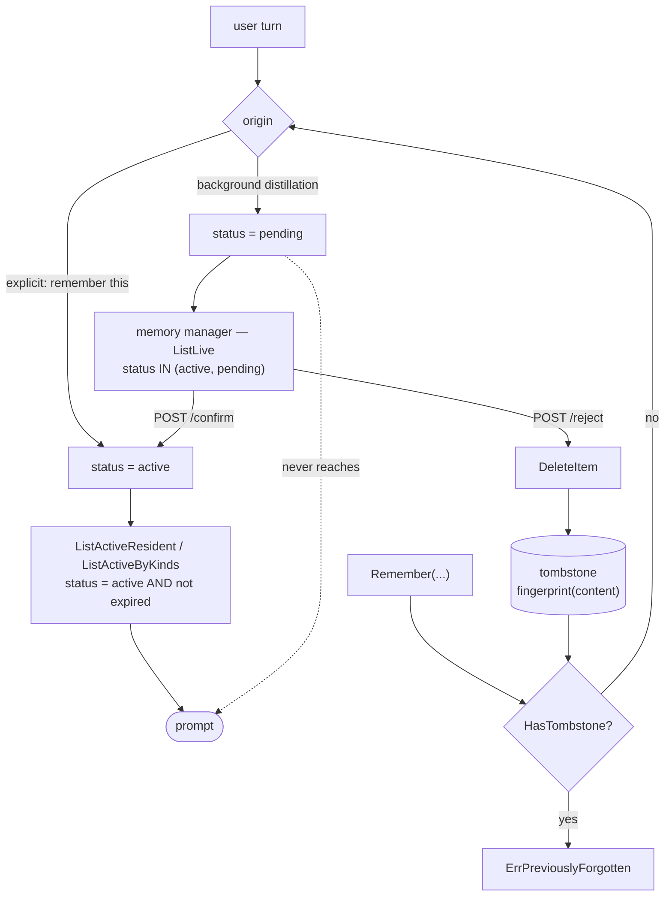

## 1. Executive Summary

WeKnora is Tencent's open-source enterprise knowledge framework — MIT, version 0.8.0, 3,017 commits since 5 August 2025, 578,241 lines of Go across 2,248 files, plus a frontend, a docreader service, an MCP server, a CLI and a Helm chart. Most of it is retrieval-augmented generation over uploaded documents: twenty-odd LLM providers, a dozen vector stores, connectors for Feishu, GitLab, Notion, Yuque and more, a ReAct agent with sandboxed skills, and a Wiki mode that distils documents into an interlinked markdown knowledge base.

**One subsystem is agent memory and that is what this report covers.** `internal/**/memory*` is 16,050 lines of Go across a types package, a repository, a service, a handler, an agent tool and 33 test files. It arrived at v0.8.0 as *"cross-session long-term memory"*; a previous, unrelated Neo4j conversation-memory dependency was removed at v0.7.1. The rest of WeKnora is described here only as the surround.

The design answers a question most of this corpus does not ask: **what should happen to a memory the system inferred but was never told?** Its answer is a status.

> *"`MemoryStatusPending` is a memory the system inferred rather than was told. It is visible in the memory manager and waits for the user to confirm it; it is never injected into a prompt. Guessing someone's role from the questions they ask is valuable and often right, but asserting a wrong guess silently is how a memory feature loses trust for good."*

That comment is the design, and the code keeps it. The two queries that assemble a prompt filter `status = active`; the query behind the manager selects `status IN (active, pending)` so a person can see what is waiting. `POST /memory/items/:id/confirm` is what moves an item between those two worlds. This is the rarer form of `human_review`: not editing memories already in use, but an admission gate the memory has to pass first.

**The second thing it gets right is what happens when the answer is no.** Rejection routes to `DeleteItem`, which records a tombstone keyed on a fingerprint of the content before dropping the row, and every subsequent write consults it. The comment states the failure it exists to prevent, in the vocabulary this atlas has been reaching for:

> *"Deleting a memory that distillation is about to re-derive from the same message is how a user ends up deleting the same thing twice and stops trusting the feature."*

**Two things are declared and unused.** `invalid_at` is written at five supersession sites, asserted by a test — *"a superseded item must record when it stopped being true"* — and read by no query in the repository; `valid_from` appears only in `ORDER BY`. The validity interval is recorded faithfully and never asked a question. And the per-workspace audit log the rest of the product maintains does not cover memory: a confirm, an edit, a rejection or a clear leaves no audit row.

## 2. Mental Model

A memory is a short statement with a kind, and the kind decides how it reaches the model.

| Kind | How it is used |
| --- | --- |
| `profile`, `preference` | stable traits; rendered into a **resident block** injected on every turn |
| `fact`, `task` | situational; pulled in only when the current query matches |
| `interest` | what the person keeps asking about, derived from recurrence; conditions retrieval rather than being quoted back |

The `interest` kind carries the clearest statement of intent in the file: knowing someone works on medical imaging *"is what turns 'how do I tune the segmentation' into a query that finds the right documents."* It is a retrieval prior, not a fact about the user to be recited.

Budgets are in runes rather than tokens, and the file says why — the block is short single-line items and *"an exact token count would need a tokenizer on the read path"*. The resident block gets 900, situational recall 600 across at most five items, and the on-demand `search_memory` tool 2,000 across twenty, because *"recall rides in every turn's system prompt whether or not it is needed, while a search happens only when the model asked for it."*



## 3. Architecture

The memory subsystem is a conventional Go layering — `internal/types/memory.go` for the model, `internal/application/repository/memory*.go` for persistence, `internal/application/service/memory/` for behaviour, `internal/handler/memory.go` and `internal/router/routes_memory.go` for the API, `internal/agent/tools/search_memory.go` for the model-facing tool.

Storage is Postgres. Items live in one table; embeddings live in `MemoryItemEmbedding` beside them, so a content edit deletes the embedding row and forces re-embedding; tombstones live in a third table whose unique index is `(tenant_id, subject_id, fingerprint)`.

### Deployment and ergonomics

Not separable. The memory is a subsystem of a framework that expects Postgres, a vector store, an object store, a document-reader service and an LLM provider, deployed by Docker Compose or Helm. Adopting the memory design means reading it, not importing it.

## 4. Essential Implementation Paths

### Scope, applied once

```go
// scoped starts every query already filtered by workspace and subject. All
// reads and writes go through it so a missing scope predicate is impossible.
func (r *memoryRepository) scoped(ctx context.Context, scope interfaces.MemoryScope) *gorm.DB {
	return r.db.WithContext(ctx).
		Where("tenant_id = ? AND subject_id = ?", scope.TenantID, scope.SubjectID)
}
```

Forty-six call sites in the repository, including the vector search and the tombstone lookup. This atlas usually has to trace a scope key through several read paths and report which one forgot it; here there is one place to check and the comment names the invariant.

### The two injection queries

`ListActiveResident` builds the resident block and `ListActiveByKinds` pulls situational items. Both filter `status = active` and both apply `notExpired`, which is `expires_at IS NULL OR expires_at > now()`. `ExpiresAt` exists for statements that are true for a while — the comment's example is *"finish the migration this week"* — and the reasoning is that without it *"an in-flight task stays in context forever and slowly turns the memory into a list of things the user finished months ago."*

### The tombstone, and the asymmetry inside it

`Remember` runs two checks before it will store anything:

```go
forgotten, err := s.repo.HasTombstone(ctx, scope, types.MemoryFingerprint(content))
// …
if !forgotten && item.SourceMessageID != "" && item.Origin == types.MemoryOriginExtracted {
    // Only the background path is gated this way. An explicit "remember
    // this" is the user asking again, and must always win.
    forgotten, err = s.repo.HasTombstoneForMessage(
        ctx, scope, item.SourceMessageID, rejectedMessageWindow,
    )
}
```

The first is exact and permanent: the same statement, hashed, is refused forever. The second exists because *"the re-derived statement is usually worded slightly differently and so does not hash the same"*, so it blocks anything distilled from a message that previously produced a rejected memory — and it expires after an hour, because that window closes the debounced-rerun case and *"past that, whatever the user said is treated fresh again."*

The asymmetry is the part worth copying. A tombstone that also blocked an explicit *"remember this"* would make a rejection permanent against the user's own later instruction, which is the failure mode of every over-eager suppression list. Gating the loose check to `MemoryOriginExtracted` keeps the user's voice above the machine's.

### The ledger is bounded, and the eviction is tested

`MaxMemoryTombstones = 500` per subject, because a rejection ledger that grows without limit is a different problem. Eviction is where it could go wrong quietly, and `service_test.go:455-472` is written against exactly that: it creates `MaxMemoryTombstones+10` newer dead rows, clears the memory, and asserts that re-deriving a statement whose memory had actually been *in use* still returns `ErrPreviouslyForgotten` — *"the memory that was in use must keep its tombstone, not be crowded out by dead rows."* A cap with a tested eviction preference is rarer here than a cap.

## 5. Memory Data Model

`MemoryItem` carries the fields the rest of this atlas usually has to look for separately: `Kind`, `Origin` (`explicit`, `extracted`, `manual`), `Status`, `Importance`, `NormalizedKey`, `SourceSessionID`, `SourceMessageID`, `ValidFrom`, `InvalidAt`, `ExpiresAt`, `ReplacesID`, `SupersededBy`, `LastUsedAt`, `UseCount`.

`NormalizedKey` is how contradictions resolve without a model on the read path: *"A new item with the same key as an active one supersedes it"* — the comment's example is `"I use MySQL"` then `"I moved to Postgres"`.

**`InvalidAt` is the field with no reader.** Five write sites set `invalid_at` alongside `status = superseded`, and a test asserts it happens. Grep the repository for a query that reads it and there is none; `valid_from` appears only in `ORDER BY importance DESC, valid_from DESC`. So the pair that would make this bitemporal is present, correct and inert: nothing takes an `asOf`, and no read path asks what the store believed at a past time. The mark is withheld on that basis, and the columns remain a good record for a person reading the manager.

## 6. Retrieval Mechanics

Two tiers plus a tool. The resident block is assembled per turn from active `profile` and `preference` items; situational `fact` and `task` items are matched against the query and capped at five items and 600 runes; `search_memory` is an agent tool with 20 items and 2,000 runes, on the reasoning that the model only calls it when the resident block was insufficient.

Vector search over `MemoryItemEmbedding` also filters `status = active` and applies the expiry, so the pending exclusion holds on the embedding path too rather than only on the SQL one — which is the kind of detail that usually leaks.

## 7. Write Mechanics

Two modes, named in the config vocabulary: `explicit_only` records only what the user asked to remember and makes no background model call; `auto` additionally distils memories in a background task. The distilled ones land `pending`.

Content is sanitised before storage, and `ErrSensitiveContent` is returned when redaction leaves nothing — *"the statement was almost entirely credentials or identity numbers, so redacting it left nothing worth remembering."*

## 8. Agent Integration

The memory space is derived from the caller's principal rather than from a path parameter, which `routes_memory.go` states as a deliberate choice: the space belongs to a person. `search_memory` is the model-facing surface; the manager is the human one; the MCP server and CLI reach the same API.

## 9. Reliability, Safety, and Trust

Strengths:

- **An inferred memory cannot reach a prompt before a person confirms it**, enforced by the same status filter on the SQL and vector read paths.
- **A rejection is keyed on the value** and consulted on every write, with a bounded, tested ledger.
- **The user's explicit instruction outranks the tombstone**, so a suppression cannot override a later request.
- **One scope chokepoint**, used 46 times, with the invariant written down.
- **A contradiction supersedes rather than deletes**, keeping `replaces_id` and `superseded_by` so the manager can explain what changed.
- **Expiry exists for statements that are only temporarily true.**
- **Sensitive statements are refused rather than stored redacted to nothing.**

Gaps:

- **`invalid_at` and `valid_from` are written and never queried**, so the validity interval cannot be asked a question.
- **No memory mutation is audited.** WeKnora keeps a per-workspace audit log, and `internal/router/router.go:205-210` scopes it to RBAC reject paths and the admin audit endpoint; `datasource_service`, `system_setting` and `wiki_ingest` write to it. The memory service does not. A confirm, an edit, a rejection or a `DELETE /memory/items` leaves no record of who did it.
- **The tombstone ledger is capped at 500 per subject**, so a user who rejects a great many guesses will eventually have the oldest rejections forgotten — bounded by design, and the bound is a real limit on the guarantee.
- **The hour-long message window is a heuristic**, and a re-derivation worded differently enough to miss the fingerprint, arriving more than an hour later, is stored again.

## 10. Tests, Evals, and Benchmarks

**I ran nothing.** Four dependency surfaces changed inside the seven-day cooldown, so the tree was not built and no test was executed. Every finding here is static.

Thirty-three test files touch memory. The three that matter for this report all assert `ErrPreviouslyForgotten`, and the one in `retrieval_test.go` has the shape this atlas argues for: store an inferred guess and assert it stored, reject it, re-derive the identical statement, assert the refusal. The positive control is the first assertion in the same test, so a store that silently accepted nothing could not pass.

`memory_consistency_test.go` covers the handler, and `engine_memory_test.go`, `memory_recall_test.go` and `memory_retrieval_test.go` cover assembly and recall.

**No paper, arXiv reference or citation file exists for the memory subsystem**; the repository's citations are product documentation.

## 11. For Your Own Build

### Steal

- **Give an inferred memory a status that no prompt can see.** `pending` plus two read paths that filter `status = active` is the whole mechanism, and it converts "the system guessed wrong about me" from a silent error into a queue item.
- **Record a fingerprint of the value when a memory is deleted, and check it before every write.** This is the rejected-value tombstone in its simplest durable form.
- **Let an explicit instruction beat the tombstone.** Gate the loose, heuristic half of the suppression to the background path only.
- **Apply scope in one helper and say so in a comment.** Forty-six call sites, one place to audit.
- **Bound the rejection ledger, then test which rejections eviction keeps.** The cap is the easy half; the eviction preference is the half that fails quietly.
- **Budget in the unit you can measure.** Runes, with the reason for not using tokens written down.

### Avoid

- **Columns for a validity interval that no query reads.** `valid_from` and `invalid_at` are written, tested and inert; either add the as-of read or drop the pretence that the store is temporal.
- **An audit log that stops at the subsystem boundary.** The product has one, three services write to it, and the one holding personal statements about users does not.
- **A suppression window tuned to one failure.** An hour closes the debounced rerun; it does not close a re-derivation that arrives tomorrow worded differently.

### Fit

Read this for the memory subsystem, not as a memory system to adopt — it is sixteen thousand lines inside a half-million-line framework that expects a full deployment. What transfers is the pending/confirm gate and the fingerprint tombstone, both of which are small, and both of which answer questions most of this corpus leaves to the model's judgement.

If you are evaluating WeKnora as a product, note the scope of this reading: the RAG pipeline, the wiki generation, the sandboxes and the RBAC are outside it.

## 12. Open Questions

- Was `invalid_at` written for a temporal read that has not been built, or as a record for the manager UI? The column, its five writers and its test all exist; only a reader is missing.
- Should a memory mutation be audited, given the rest of the product audits and this subsystem holds personal statements?
- What happens to a user who rejects more than 500 guesses? Eviction keeps tombstones for memories that were used, but the policy past the cap is a real boundary on the guarantee.
- Does the `interest` kind measurably improve retrieval, and is that measured anywhere?
- How often does distillation re-derive a rejected statement in wording that misses both the fingerprint and the hour window?

## Appendix: File Index

- **Model:** `internal/types/memory.go` (kinds, origins, statuses, budgets, `MemoryItem`, `MemoryTombstone`, `MemoryFingerprint`, `MaxMemoryTombstones`), `internal/types/memory_extraction.go`.
- **Repository:** `internal/application/repository/memory.go` (`scoped`, `ListActiveResident`, `ListActiveByKinds`, `ListLive`, `SupersedeItem`, `AddTombstone`, `HasTombstone`), `memory_vector.go`, `memory_lifecycle.go`, `memory_extraction.go`.
- **Service:** `internal/application/service/memory/service.go` (`Remember`, `DeleteItem`, `RejectItem`, `ConfirmItem`, `rejectedMessageWindow`), `consolidate.go`, `topic_resolve.go`, `vector.go`, `scope.go`.
- **Surface:** `internal/handler/memory.go`, `internal/router/routes_memory.go`, `internal/agent/tools/search_memory.go`.
- **Audit, for the boundary:** `internal/router/router.go:205-210`, `internal/types/audit_log.go`.
- **Tests:** `internal/application/service/memory/retrieval_test.go`, `service_test.go`, `quality_test.go`, `internal/handler/memory_consistency_test.go`.

### Searches behind the absence claims

Run from the repository root; each returned only what is described beside it.

```sh
# invalid_at is written at five sites and read by none
grep -rn 'InvalidAt\|invalid_at' --include='*.go' internal/

# valid_from appears only in ORDER BY
grep -rn 'valid_from\|ValidFrom' --include='*.go' internal/application/

# no memory mutation writes to the audit log
grep -rniE 'audit' --include='*.go' internal/application/service/memory/ internal/handler/memory.go

# the pending status is excluded from both injection queries
grep -rn 'MemoryStatusPending\|MemoryStatusActive' --include='*.go' internal/
```

## History

**2026-09-14** — [`1ef38fdb8b19347b82d3a99f6f17d75ac09ad606`](https://github.com/Tencent/WeKnora/commit/1ef38fdb8b19347b82d3a99f6f17d75ac09ad606) — first reading, on the `main` default branch, 3,017 commits from a repository created 5 August 2025, at version 0.8.0. Screened before reading: no auto-executing surface, six build-time execution points, six unpinned dependency surfaces, two uninstalled git-hook payloads, and four dependency surfaces changed inside the seven-day cooldown — so nothing was installed, nothing was built and no test was run. Every finding is static. The report is scoped to `internal/**/memory*`, 16,050 lines and 33 test files, which is the agent-memory subsystem added at v0.8.0; the surrounding RAG, wiki, sandbox and RBAC machinery is described only as context. Five marks are earned and two withheld after a producer test on each: `bitemporal` fails because `invalid_at` has five writers and no reader and `valid_from` appears only in `ORDER BY`, and `audit_log` fails because the product's audit log is scoped to RBAC and three other services while no memory mutation reaches it. An early reading of `RejectItem` as a plain delete was wrong — it routes to `DeleteItem`, which records the tombstone first.
