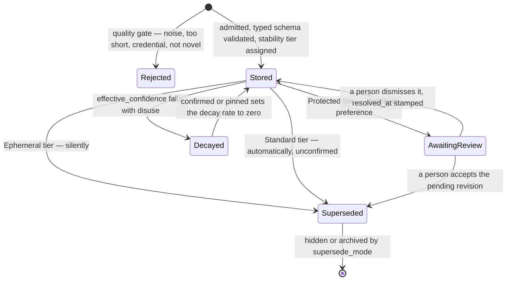

## 1. Executive Summary

Wenlan — the repository is `7xuanlu/origin`, and the product renamed — is a
local-first knowledge base that maintains Markdown wiki pages from captured
memory and external sources. Apache-2.0, roughly 485,000 lines of Rust across
five crates, with a desktop app, an MCP server, a CLI and an HTTP server over one
libSQL file. It is the largest system in this batch by an order of magnitude.

Two mechanisms make it worth the report, and they sit at opposite ends of the
correction problem.

**The tombstone is on the mind-map, and it is real.** A page map is a graph of
nodes referring to memories, entities, pages and sections. Each node carries a
`fingerprint` derived from `(ref_kind, ref_id, parent_ref)` — what it points at
and where it hangs — under `UNIQUE(page_id, fingerprint)`. Dismissing a node sets
`status = 'dismissed'` and **keeps the row**, so the fingerprint stays occupied.
Every insert is `ON CONFLICT(page_id, fingerprint) DO NOTHING`, and the code then
reads the conflicting row to distinguish a live `Duplicate` from a
`Tombstoned`. The type's own comment states the guarantee: "a fresh uuid cannot
bypass that tombstone — nothing is inserted".

The suggestion path is separate and explicitly insert-only, with the reason in
the docstring: the same conflict clause "makes re-proposing an existing OR
dismissed fingerprint a no-op … so a suggestion pass can never modify,
resurrect, or overwrite a pinned/active/dismissed row". In the
[strong-form taxonomy](../../patterns/rejected-value-tombstone/) this is the
*collided* kind made deliberate — nothing looks the rejection up first, the
unique key is the value and the write is a no-op — except that here the outcome
is a named variant the caller handles, which is what the two collided cases in
that taxonomy lack.

Be precise about what it protects. This is a rejected **placement**, not a
rejected **fact**: dismissing a node means "this memory does not belong on this
page under this parent", and nothing stops the underlying claim being re-stored.
The mechanism is exactly right and it is pointed at the graph layer.

**Correction of facts is graded by type, and the confirmation exists.**
`StabilityTier` maps a memory type to how a supersede may proceed — `Protected`
for identity and preference, where "supersede requires human confirmation";
`Standard` for fact, decision, lesson and gotcha, where it "auto-applies
unconfirmed"; `Ephemeral` for everything else, where it "auto-applies silently".
Unlike [YesMem](../yesmem/), which builds the same gate and leaves the
confirmation unimplemented, Wenlan ships the queue: `refinement_queue` rows move
through `awaiting_review`, there is a `curate` CLI command, and
`list_pending_revisions`, `accept_pending_revision` and
`dismiss_pending_revision` are MCP tools.

## 2. Mental Model

Wenlan holds three layers and only calls the middle one memory.

**Sources** are the outside world — files, Gmail, Notion — chunked into rows.
**Memories** are typed claims: `identity`, `preference`, `decision`, `fact`, each
with a schema declaring required and optional fields
(`crates/wenlan-core/src/memory_schema.rs`). A `decision` requires `decision` and
`context` and may carry `alternatives_considered`, `date` and `reversible`.
**Pages** are the Markdown wiki the user reads, assembled from memories with
citations, and a **page map** is a graph view over a page.

A claim becomes a belief by passing a gate and stops being one by being
superseded — with how easily depending on what kind of claim it is:

The page-map tombstone is a second, disjoint state machine over the same
material: a node is `suggested`, `active`, `pinned` or `dismissed`, and only the
last is permanent, because it holds the fingerprint against every future pass.

## 3. Architecture

Five crates. `wenlan-core` is 372,000 lines of the 485,000 and holds the
database, ingestion, retrieval, the knowledge graph, synthesis, evaluation and
the maintenance passes. `wenlan-types` is the shared vocabulary,
`wenlan-server` an HTTP service, `wenlan-mcp` the tool surface, `wenlan-cli` the
command line. A desktop app sits over the server.

Storage is one libSQL database with `F32_BLOB(768)` embeddings in the `memories`
table itself — no separate vector store — plus tables for the knowledge graph,
pages, page maps, the refinement queue and an access log.

The most distinctive engineering choice is not in the memory model at all.
`crates/wenlan-core/src/drift_guard.rs` is a set of test-only "teeth" that parse
the source with `syn` and fail CI when a class of drift appears — a second copy
of the sentence-splitting regex, a flag documented but not wired, a config key
without its counterpart. The header states the design: "Failure messages teach
the fix: each gate's assert states the invariant that broke, where to fix it, and
the escape hatch when the contract itself changed on purpose". `faithfulness.rs`
carries the matching comment on its own function — "This is the ONE definition of
the sentence boundary — a `drift_guard` tooth fails the build on a second copy,
because the boundary decides where one claim ends and the next begins".

Several findings in this atlas are exactly the failure those teeth are built to
prevent: a column with no reader, a flag documented and never wired, a mechanism
described in a migration comment and implemented nowhere. Wenlan is the only
system here that has automated the check.

## 4. Essential Implementation Paths

**Capture.** `ingest.rs` → `quality_gate.rs` (rule-based reject) → typed schema
validation (`memory_schema.rs`) → `stability_tier` assignment → embed → insert.

**Correction.** `contradiction.rs` runs a cheap structured-field pre-filter —
"no LLM, no embedding" — returning `Consistent`, `Contradicts` or `Supersedes`,
and only a candidate reaches the LLM check. Protected-tier candidates land in
`refinement_queue` with `status = 'awaiting_review'`.

**Review.** `wenlan-cli/src/commands/curate.rs` and the MCP tools list, accept
and dismiss. `accept_pending_revision` (`db.rs:39322`) runs in one transaction:
replace the page dependency, invalidate the entity projections for both source
ids, delete the affected summary nodes.

**Page maintenance.** `citations.rs` backfills citation markers and records the
outcome in the page changelog, including a "giveup" entry when it cannot resolve
one — a failure that writes itself into the record rather than leaving a silent
gap.

**Mind map.** `db/page_map.rs` holds the data layer; `page_map_improve.rs` is the
LLM pass that proposes nodes and edges and handles `Tombstoned` as a first-class
outcome.

## 5. Memory Data Model

`memories` carries 40 columns. The ones that carry the design rather than the
statistics:

| Column | Role |
| --- | --- |
| `memory_type`, `structured_fields`, `retrieval_cue` | The typed schema, its filled fields, and a generated question the memory answers |
| `stability` | The tier that decides how a supersede may proceed |
| `confirmed`, `pinned` | Both set the decay rate to exactly zero |
| `supersedes`, `supersede_mode` | The link and whether the loser is hidden or archived |
| `confidence`, `effective_confidence` | The stated value and the same value after recency and access decay |
| `quality` | `CHECK(quality IN ('low','medium','high'))` |
| `pending_revision`, `refinement_status` | Whether a proposed change is waiting on a person |
| `version`, `changelog` | A row version and a JSON array of what changed |

Two smaller things are worth naming. `retrieval_cue` is generated from a
per-type template — "What was decided about {decision} and why?" — so a stored
memory carries the question it is an answer to, which is a cheap way to close the
query/document vocabulary gap without a model at query time. And
`enrichment_origin` exists, in its own comment, for "the three store-time choices
that cannot be reconstructed from a memory row after the detached request closure
is gone": whether the memory type was explicit, whether the structured fields
were, and whether a Space was rejected. Recording *which decisions were the
system's own* is a form of provenance almost nothing here keeps.

## 6. Retrieval Mechanics

Hybrid retrieval with a reranker (`reranker.rs`), knowledge-graph community
routing (`community_routing.rs`, `community_partition.rs`), temporal query
handling (`temporal_query.rs`) and topic matching, over embeddings stored inline.

Decay is applied twice and the distinction is explicit in `decay.rs`:
`effective_score` multiplies the search-time base score by recency and access
boosts, while `effective_confidence` applies the same factors to the *stored*
confidence. `decay_rate_for` returns exactly `0.0` when a memory is `confirmed`
or `pinned` — so the two states that mean "a person vouched for this" are
immune to disuse, which is the correct relationship between decay and
confirmation and not the common one.

Scope is a three-value enum rather than an optional filter. `ReadScope` is
`Global`, `Space(id)` or `Uncategorized`, `matches` defines each against a
binding, and the resolver fails loudly on an unknown Space and on the ambiguous
case where "uncategorized" collides with a registered Space name. It compiles
into the SQL — `AND c.space=?3` — rather than being applied after the fact.

## 7. Write Mechanics

`quality_gate.rs` is a pre-store filter that runs before anything is embedded,
with a typed rejection reason: `NoisePattern`, `TooShort`, `NotNovel`,
`CredentialLeak`, `EmbeddingUnavailable`. Two of those are unusual. Refusing a
credential at the gate means the secret never becomes a row. And
`EmbeddingUnavailable` as a *rejection* means novelty could not be assessed and
the system declines rather than admitting by default — the same fail-closed
posture as [Memory Palace](../memory-palace/)'s write guard, reached
independently.

Contradiction handling is staged to keep the model out of the common path.
`fields_may_contradict` compares structured fields of two memories of the same
type and returns true only when key fields overlap and values differ; the header
calls this "a fast pre-filter before queuing the full LLM contradiction check",
and it returns false on parse failure, missing fields, or non-overlapping
contexts — three ways of declining to guess.

Whether the supersede then applies depends on the tier, and the tier is a
property of the *type*, not of the memory's history. That is the interesting
contrast with [YesMem](../yesmem/), which grades the same decision by earned
usage. Wenlan's version is cheaper to reason about — you know before you write a
preference that changing it will need a person — and blunter, because a
throwaway `fact` and a load-bearing one get the same treatment.

The page changelog is a bounded FIFO, and the bound is the caveat.
`append_changelog_entry` caps at 20 entries and trims from the front — but skips
entries marked `edited_by: fs_edit` or `manual_edit`, so machine entries are
dropped before human ones. Preserving the human record under pressure is the
right priority. It is still a capped array, which is why this report does not
carry `audit_log`: what looks like a mutation history is a recent-changes buffer.

## 8. Agent Integration

An MCP server exposing capture, recall, the curation tools and page operations; a
CLI with `brief`, `capture`, `recall`, `handoff`, `distill`, `lint` and `curate`;
a desktop app; and an HTTP server. All four read one libSQL file.

The product framing is that the artifact is a Markdown wiki page with inspectable
citations rather than a memory API — the agent's output is a page a person reads
and edits, and the memory is what keeps the page current. That is why the
citation and faithfulness machinery is as large as the retrieval machinery.

## 9. Reliability, Safety, and Trust

**Tombstone — awarded, and scoped.** The mechanism is described in section 1.
It is value-keyed (a derived fingerprint, not a row id), durable (the dismissed
row is retained), and enforced on the write path (a unique index plus `DO
NOTHING`). `validate_ref_component` rejects a `ref_kind` or `ref_id` containing
the fingerprint separator, because otherwise "a crafted ref [could] inject a fake
component boundary" — someone thought about forging the key. What it protects is
graph placement, not the truth of a claim.

**Scope enforced — awarded.** `ReadScope` reaches the SQL, and the resolver
refuses ambiguity rather than picking a default.

**Human review — awarded.** `refinement_queue` with an `awaiting_review` status,
a partial index over exactly `('pending', 'awaiting_review')`, a `resolved_at`
stamp, a CLI curate command and three MCP tools. The queue is reachable and the
transitions are mutations a person causes.

**Trust state — withheld.** `confirmed` is a boolean, `quality` is a
low/medium/high content grade, and `stability` is a tier derived from the memory
*type* rather than from anything believed about the individual memory. There is
no field on a memory row holding candidate-versus-verified-versus-rejected. The
epistemic state lives in the queue, on the proposed change, not on the claim.

**Audit log — withheld**, for the FIFO reason in section 7. `access_log` is a
real append-only table and records reads for recency scoring, not mutations.

**Bitemporal — no.** No validity axis; `last_modified` and `created_at` are
record time, and there is no as-of read.

**Negative eval — no.** The evaluation harness is large and entirely
positive-signal: recall, MRR, NDCG, faithfulness, rank overlap. No committed case
asserts that particular material must not be returned.

## 10. Tests, Evals, and Benchmarks

**No paper.** No arXiv reference, DOI, `CITATION.cff` or BibTeX block in the
tree.

The evaluation subsystem is one of the largest in this atlas — 30-plus modules
under `crates/wenlan-core/src/eval/` covering LoCoMo, LongMemEval, answer
quality, KG faithfulness with and without an LLM judge, entity dedup, latency,
cost, throughput, retrieval drift and rank overlap, with `goldens/` holding an
anchor and a current snapshot for ranking so a change in order is a diff rather
than a surprise.

The committed result is deliberately narrow, and the sentence framing it is the
part worth crediting: "This is a retrieval-only snapshot, not a claim about
end-to-end answer quality." The table reports LongMemEval Oracle over 500
questions at 93.6% Recall@5 / 0.857 MRR / 0.883 NDCG@10, and the deep `LME_S`
subset over 90 questions at 87.7% / 0.815 / 0.822. **I did not run any of it.**

**I ran no tests.** The screen flagged three auto-run surfaces —
`.claude/hooks/`, `.claude/settings.json` and `.githooks/` — and eleven manifests
changed within the seven-day cooldown, including `Cargo.lock`. A tree with active
git hooks and a lockfile a day old is one to read, not to build.

## 11. For Your Own Build

### Steal

- **Keep the dismissed row so its key stays occupied.** The whole tombstone here
  is a unique index on a derived fingerprint plus `ON CONFLICT DO NOTHING`. No
  lookup, no extra table, and a re-proposal cannot land. The cost is that the
  dismissed row can never be garbage-collected, which is the correct trade.
- **Make the suggestion path insert-only by construction.** A separate accessor
  that can only insert means an LLM improvement pass cannot resurrect or
  overwrite anything, and the docstring says so, so nobody parameterizes it back
  together later.
- **Validate the components of a derived key against separator injection.** If
  your key is `a<SEP>b<SEP>c`, a crafted `b` containing `<SEP>` is a forged key.
- **Grade correction by what kind of claim it is.** Identity and preference need
  a person; a `gotcha` does not. Deciding this from the type at write time is
  cheaper to reason about than deciding it from history at correction time.
- **Set the decay rate to zero for confirmed and pinned.** If a person vouched
  for a memory, disuse is not evidence against it.
- **Pre-filter contradictions on structured fields with no model.** Overlapping
  keys with different values is a cheap, honest candidate test that returns
  false on every uncertain case.
- **Store the question the memory answers.** A per-type `retrieval_cue` template
  costs one format string and gives the retriever a document-side paraphrase of
  the query.
- **Record which store-time choices were the system's own.** `enrichment_origin`
  keeps whether a type was explicit or inferred, which is provenance about the
  *pipeline* rather than about the source.
- **Automate the drift check.** `drift_guard.rs` parses the source and fails CI
  on a documented-but-unwired flag or a duplicated definition. Several reports in
  this atlas exist because nobody had that.

### Avoid

- **Do not read a capped changelog as an audit trail.** Twenty entries, FIFO,
  and the protection for human edits is what makes the machine history the part
  that disappears first — exactly the entries an audit would want.
- **Do not conclude the fact layer is protected because the graph layer is.**
  The tombstone here is on mind-map placement. A dismissed node says nothing
  about whether the claim it pointed at may be re-stored.
- **Do not assume a tier derived from type tracks importance.** Every `fact` gets
  the same auto-supersede whether it is a throwaway or the thing the whole page
  rests on.

### Fit

This is for a single person or a small team who want a maintained Markdown
knowledge base rather than a memory API, are prepared to run a desktop app and a
local libSQL database, and value being able to open a citation and see the source
behind a sentence. It is not a component to vendor: 485,000 lines of Rust with
its own drift-guard framework is a product you adopt.

The reason to read it even if you never run it is `db/page_map.rs`. It is about
900 lines, it contains the clearest small tombstone implementation in this
atlas, and the reason it works is a database constraint rather than a policy.

## 12. Open Questions

- **Does anything tombstone a fact?** The page-map mechanism is complete and the
  memory layer has supersession without it. Whether a dismissed *memory* can be
  re-extracted was not traced end to end, and the presence of the machinery one
  layer up makes it the first question a maintainer should answer.
- **How often does the Protected tier actually stop a write?** The queue exists
  and is reachable; nothing in the tree reports how many rows sit in
  `awaiting_review` in a real store, which is the number that says whether the
  gate is a workflow or a backlog.
- **What happens to a `Standard`-tier supersede that was wrong?** It applies
  unconfirmed and the loser is hidden or archived by `supersede_mode`; the
  changelog that would record it is capped at 20.
- **Is the 768-dimension embedding inline in `memories` a scaling limit?** One
  table holding content, 40 columns and a vector is simple and fast at desktop
  scale; the point where it stops being either was not established.

## Appendix: File Index

**The tombstone** — `crates/wenlan-core/src/db/page_map.rs`
(`CreateNodeOutcome` at `:105`, `fingerprint_for` `:270`,
`validate_ref_component` `:284`, `create_map_node` `:789`,
`create_suggested_map_node` `:889`), `crates/wenlan-core/src/page_map_improve.rs`

**Correction and review** — `crates/wenlan-core/src/contradiction.rs`,
`crates/wenlan-core/src/db.rs:39322` (`accept_pending_revision`), `:41577`
(`dismiss_contradiction_for_source`),
`crates/wenlan-core/src/db/migrations_v004_v009.rs:49` (`refinement_queue`),
`crates/wenlan-cli/src/commands/curate.rs`, `crates/wenlan-mcp/src/tools.rs`

**Stability tiers** — `crates/wenlan-types/src/sources.rs:103`
(`StabilityTier`, `stability_tier`), `crates/wenlan-core/src/sources/mod.rs`,
`crates/wenlan-core/src/decay.rs`

**Write gate** — `crates/wenlan-core/src/quality_gate.rs`,
`crates/wenlan-core/src/ingest.rs`, `crates/wenlan-core/src/memory_schema.rs`,
`crates/wenlan-core/src/extract.rs`

**Scope** — `crates/wenlan-core/src/read_scope.rs`,
`crates/wenlan-core/src/spaces.rs`, `crates/wenlan-core/src/space_context.rs`,
`crates/wenlan-core/src/db.rs:177` (`push_read_scope_filter_folded`)

**Schema** — `crates/wenlan-core/src/db.rs:3095` (`memories`,
`enrichment_origin`, `access_log`), `crates/wenlan-core/src/db/`,
`crates/wenlan-core/src/migrations/`

**Retrieval** — `crates/wenlan-core/src/retrieval/`,
`crates/wenlan-core/src/reranker.rs`,
`crates/wenlan-core/src/community_routing.rs`, `community_partition.rs`,
`crates/wenlan-core/src/temporal_query.rs`, `topic_match.rs`

**Pages and citations** — `crates/wenlan-core/src/citations.rs`,
`crates/wenlan-core/src/faithfulness.rs`,
`crates/wenlan-core/src/synthesis/`, `crates/wenlan-core/src/narrative.rs`,
`crates/wenlan-core/src/truth_contract.rs`, `truth_manifest.rs`,
`truth_adapter.rs`

**Drift guards** — `crates/wenlan-core/src/drift_guard.rs`,
`crates/wenlan-core/src/drift_guard/`, `crates/wenlan-core/src/lint/`

**Evaluation** — `crates/wenlan-core/src/eval/` (30-plus modules;
`locomo.rs`, `longmemeval.rs`, `kg_faithfulness.rs`, `retrieval_drift.rs`,
`rank_overlap.rs`, `goldens/`), `docs/eval/`

## History

**2026-08-09** — [`87ee2831a8b9445026c33139adfd8d87bf60ad45`](https://github.com/7xuanlu/origin/commit/87ee2831a8b9445026c33139adfd8d87bf60ad45) — first reading. Screened before reading: three auto-run surfaces (`.claude/hooks/`, `.claude/settings.json`, `.githooks/`), build-time execution in two `build.rs` files and an npm manifest, and eleven dependency manifests changed inside the seven-day cooldown including `Cargo.lock`. The tree was read, never built, and no test or eval was run.
