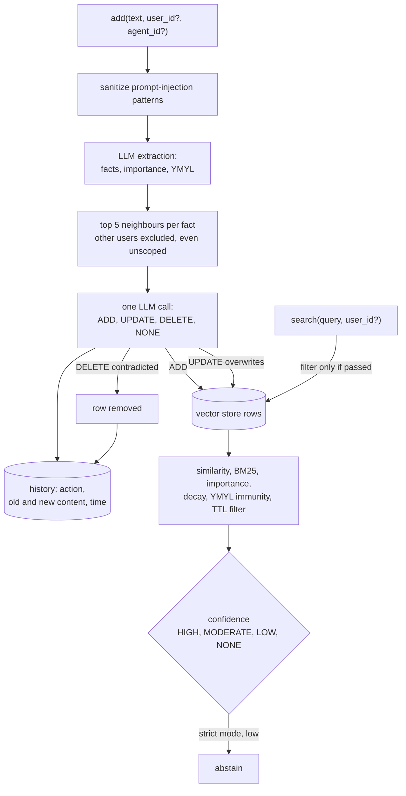

## 1. Executive Summary

widemem.ai is an Apache-2.0 Python memory library, version 1.6.0, 167 commits
since 8 March 2026, almost all by one author, about 6,900 lines in `widemem/`
with 47 test files holding 584 test functions. Its core is the shape Mem0
popularized: an LLM extracts facts from text, related existing memories are
fetched, and one batched LLM call decides for each fact whether to add it,
update an existing memory, delete a contradicted one, or do nothing.

On that base it adds judgements about what matters:

- **Importance from 0 to 10 with decay**, exponential, linear or step.
- **YMYL** — health, legal and financial content classified by regex and then by
  the LLM, given an importance floor of 8 and exempt from decay and from
  `purge_expired()` unless the caller says otherwise.
- **Retrieval confidence** — HIGH, MODERATE, LOW or NONE from similarity
  thresholds recalibrated for `text-embedding-3-small`, with `strict`, `helpful`
  and `creative` modes deciding whether to abstain, hedge or guess.
- **A facts, summaries and themes hierarchy** with query routing.

The engineering discipline is the more unusual part. `docs/HISTORY.md` is a
public corrections log: on 2 September 2026 it records that the claimed audit
trail had missed four write paths, including `delete()`, and on 6 July that
LoCoMo category labels had been transposed so a multi-hop claim was retracted.
The fix for the first is a test that parses the source and fails if any method
mutates the vector store without writing history. `tests/test_readme_claims.py`
checks README statements against code. The LoCoMo harness refuses a judge equal
to the answerer, keeps the adversarial category and scores it as abstention, and
builds a full-context baseline.

The weakness is the scope boundary, and it is asymmetric. The write pipeline
treats candidate filtering as a trust boundary: an unscoped write sees only
unscoped rows, and scope holds even if the vector store ignores filters. The
search path applies `user_id` and `agent_id` only when they are passed
(`widemem/core/memory.py:373-376`), so a search without a user id ranks every
user's memories — and the MCP server's tools accept `user_id` as an optional
argument from the model.

Two marks: `audit_log`, `negative_eval`.

## 2. Mental Model

A memory exists or it does not. Extraction produces candidate facts with an
importance and a YMYL category; the batch resolver sees the facts beside the
nearest five existing memories per fact and returns actions:

A contradiction is resolved by deletion: "I live in Boston" after "I live in San
Francisco" removes or overwrites the old fact, and only the history row keeps
it. Nothing records that a value was rejected, so a later extraction can write it
again; `tombstone` is withheld. There is no candidate or verified state;
`trust_state` is withheld.

Every memory has `created_at` and `updated_at` as record time and an optional
`event_time` parsed from a supplied timestamp or a leading date in the text.
`time_after` and `time_before` filter on `created_at`
(`widemem/retrieval/temporal.py:26-31`), and nothing holds a validity interval,
so `bitemporal` is withheld.

## 3. Architecture

| Package | Role |
| --- | --- |
| `core/memory.py` (973 lines) | `WideMemory`: add, search, streaming search, pin, delete, purge, import and export, history |
| `core/pipeline.py` (366) | Extraction, candidate retrieval, action execution |
| `conflict/batch_resolver.py` (411) | The batched ADD/UPDATE/DELETE/NONE decision |
| `retrieval/` | BM25, hybrid fusion, temporal scoring and parsing, uncertainty, active retrieval, explanation, entity boost |
| `scoring/` | Importance, decay, topics, YMYL |
| `hierarchy/` | Summaries and themes, query router |
| `storage/vector/` | FAISS, Qdrant, pgvector |
| `storage/history.py` | SQLite history |
| `security/sanitizer.py` | Prompt-injection stripping |
| `server.py`, `mcp_server.py`, `integrations/langchain/` | Service surfaces |

### Deployment and ergonomics

- **What has to run:** nothing beyond the process. `pip install widemem-ai[faiss]`
  gives FAISS plus SQLite under `~/.widemem/`; Qdrant and pgvector are optional.
- **Keys:** extraction and resolution need an LLM — OpenAI, Anthropic or local
  Ollama — and embeddings can be local through sentence-transformers.
- **Hand-repairable:** the history database is plain SQLite; the FAISS index and
  its metadata are not meant to be edited.
- A Dockerfile and a Railway configuration deploy the HTTP server.

The screen of this checkout found no auto-running configuration, one build-time
execution point (`tests/conftest.py`), one unpinned manifest, and a dependency
surface changed inside the seven-day cooldown. Nothing was installed or run.

## 4. Essential Implementation Paths

- **Add** — `WideMemory.add` (`core/memory.py:138`) parses `event_time` and calls
  `MemoryPipeline.process`.
- **Candidates** — `pipeline.py:140-185`: store filters only for concrete ids,
  then a per-row check that `metadata["user_id"] == user_id` and the agent id
  matches, so an unscoped call never receives a scoped row and a store that drops
  filters cannot widen scope.
- **Resolution and execution** — `conflict/batch_resolver.py`;
  `pipeline._execute_actions` applies UPDATE (`:240`) and DELETE (`:290`) with
  history.
- **Search** — `_search_ranked` (`core/memory.py:336`): optional filters, candidate
  collection, `score_and_rank` with TTL, YMYL and temporal handling, then
  confidence.
- **Confidence** — `retrieval/uncertainty.py`: thresholds 0.60, 0.50 and 0.30,
  environment-overridable, plus frustration phrases such as "I told you".
- **History** — `storage/history.py`; `WideMemory.get_history` (`:644`).
- **Retention** — `purge_expired` (`:570`): YMYL rows kept unless
  `include_ymyl`, every removal through `delete()`.

## 5. Memory Data Model

`Memory` (`core/types.py:64-78`): `id`, `content`, `user_id`, `agent_id`,
`run_id`, `tier`, `importance`, `content_hash`, `ymyl_category`, `metadata`,
`created_at`, `updated_at`, `event_time`, `entities`. The vector store holds the
embedding with that metadata.

`history` (`storage/history.py:27-35`): `id`, `memory_id`, `action`,
`old_content`, `new_content`, `timestamp`. There is no actor column, and the
README says so: the log answers what changed and when, not who.

**Scope** is two optional string ids. The write path enforces them in code
independent of the store; the read path passes them to the store when present
and otherwise applies no filter. The HTTP and MCP surfaces take `user_id` as a
request or tool argument. With the read boundary omittable and model-supplied,
`scope_enforced` is withheld.

## 6. Retrieval Mechanics

Candidates come from the vector store, fetched at a multiple of `top_k` that
depends on the retrieval mode (`fast`, `balanced`, `deep`) and on whether
`_adapt_scoring` judges the query similarity-first. Scoring combines similarity
with BM25 when enabled, importance, a recency decay that YMYL rows are immune to,
topic weights and entity boosts. `ttl_days` removes rows older than the window
from results, except YMYL. Temporal phrases in the query become a soft boost
window rather than a hard filter, so a misparse cannot empty the pool; explicit
`time_after` and `time_before` filter.

The hierarchy routes broad questions to summaries or themes and specific ones to
facts. Active retrieval surfaces contradictions and can ask clarifying questions.
Every result set carries a confidence level; in `strict` mode a low one yields an
abstention instead of an answer.

## 7. Write Mechanics

`add()` is synchronous: sanitization, one extraction call, embedding, candidate
search, one resolution call for all facts, then writes and history. The caller
waits on two LLM calls, and the memory is searchable when `add` returns. Bulk
paths write history in one transaction per batch.

The resolver's DELETE is final in the store. An UPDATE overwrites content and
keeps `created_at`, so TTL and recency still count from when the fact was first
learned. Deduplication is by content hash before resolution.

No background pass exists; hierarchy summaries are built when invoked.

## 8. Agent Integration

A Python API, a FastAPI HTTP server with an API-key policy, an MCP server with
`widemem_add`, `widemem_search`, `widemem_delete`, `widemem_count`,
`widemem_pin`, `widemem_export` and `widemem_health`, a LangChain `BaseRetriever`, a CLI
and a Claude Code skill. The MCP tools accept an optional `user_id` from the
model (`mcp_server.py:205-237`), which is where the read-path scope gap becomes a
model-reachable one.

## 9. Reliability, Safety, and Trust

**The write history is complete and guarded.** After the September correction,
every mutating method logs, and the source-walking test keeps it so. Content on
both sides of an update and the content of a delete are recorded, so a deleted
memory can be reconstructed from the log. There is no attribution.

**Content is sanitized before prompts.** Instruction overrides, fake system tags
and similar patterns are stripped at extraction, resolution, summarization and
answer time; the stripping is pattern-based and says so.

**Claims are tested and corrected in public.** `test_readme_claims.py` and the
corrections log are uncommon, and they are why the audit gap and the LoCoMo label
error are documented rather than latent.

**Scope is asymmetric.** The write path would not let another user's memory
become an UPDATE or DELETE target; the read path would return it to an unscoped
search.

**Deletion loses the value.** Contradiction handling keeps no superseded memory;
the history row is the only place the old fact survives.

## 10. Tests, Evals, and Benchmarks

**584 test functions in 47 files**, covering scoring and decay, YMYL, BM25 and
fusion, hierarchy, abstention, the sanitizer, providers, the three vector
backends, durability and concurrency, the server's auth policy, the MCP server,
README claims, and the audit coverage ratchet.

The retrieval exclusion case is `test_audit_regressions.py:368-374`: two memories
for the same user are both older than `ttl_days`; the search asserts the YMYL one
is present and the trivial one absent. The same file asserts another user's and
another agent's rows never reach the conflict resolver (`:521`, `:546`, `:583`),
the last with a store wrapper that ignores filters. That earns `negative_eval`.

**Benchmarks.** The README reports 55.15% on the full 1,540-question LoCoMo with
an independent GPT-4o judge (56.32% self-graded) at about 213 context tokens per
query. `benchmark/HONEST_LOCOMO.md` sets the controls: a judge distinct from the
answerer, the adversarial category included and scored as abstention, a
full-context baseline, and a held-out conversation split for publishable numbers.
The harness and split are committed; the result files behind 55.15% are not. The
one committed result, `benchmark/results/mini_locomo_baseline.json`, is a
50-question regression gate at an overall J of 40.0 with temporal at 7.69, last
touched by the 6 July label correction.

## 11. For Your Own Build

### Steal

- **Enforce write-path scope in code, not in the store's filter.** Check each
  candidate's ids after retrieval, and test it with a store that ignores filters.
- **Keep a history row for every mutation, and test for missing ones by walking
  the source.**
- **Exempt high-stakes facts from decay and retention by category**, and make the
  exemption something a caller must explicitly override.
- **Return a confidence level with retrieval** so the agent can abstain.
- **Publish corrections as a log** and gate README claims with tests.
- **Refuse self-graded benchmarks** and score unanswerable questions as
  abstention.

### Avoid

- **An optional read scope next to a strict write scope.** The unscoped search is
  the one call that should have been refused or limited to unscoped rows, as the
  write path already does.
- **Deleting the contradicted fact.** Supersede it, so the store — not only the
  log — can say what was believed before.
- **A headline benchmark number without its result files in the repository.**

### Fit

This suits a Python application with a known user id per call that wants a
batteries-included memory with sensible priorities — a personal assistant, a
support agent, anything where a medication must outlive a lunch order — and can
live with an LLM on every write. Put the user id on every search yourself, or add
the unscoped guard the write path already has; for MCP exposure, bind the user id
server-side rather than from tool arguments.

## 12. Open Questions

- **Will unscoped search be limited to unscoped rows** the way the write path is?
- **Where are the 55.15% LoCoMo result files?** The README points to the website.
- **Will `HistoryEntry` gain an actor?** The README claims test gates attribution
  until it does.

## Appendix: File Index

- `widemem/core/memory.py`, `core/pipeline.py`, `core/types.py`
- `widemem/conflict/batch_resolver.py`, `conflict/prompts.py`
- `widemem/retrieval/temporal.py`, `uncertainty.py`, `bm25.py`, `hybrid.py`, `active.py`
- `widemem/scoring/ymyl.py`, `widemem/hierarchy/manager.py`
- `widemem/storage/history.py`, `storage/vector/{faiss,qdrant,pgvector}_store.py`
- `widemem/security/sanitizer.py`, `widemem/mcp_server.py`, `widemem/server.py`
- `docs/HISTORY.md`, `benchmark/HONEST_LOCOMO.md`, `benchmark/honest_core.py`
- `tests/test_audit_log_coverage.py`, `tests/test_audit_regressions.py`, `tests/test_readme_claims.py`

**Searches behind the absence claims**

- `rg -n "UPDATE history|DELETE FROM history" widemem` — none
- `rg -n "valid_(from|until|to)" widemem` — none
- `git ls-files benchmark/results` — only `mini_locomo_baseline.json`

## History

**2026-09-15** — [`fdf736fcf3a1d21e0984324bf0b03b93a6844c18`](https://github.com/remete618/widemem-ai/commit/fdf736fcf3a1d21e0984324bf0b03b93a6844c18) — first reading, at a commit dated 14 September 2026. Screened before opening: no auto-running configuration, one build-time execution point, one unpinned manifest, one dependency surface inside the seven-day cooldown. Nothing was installed or run.
