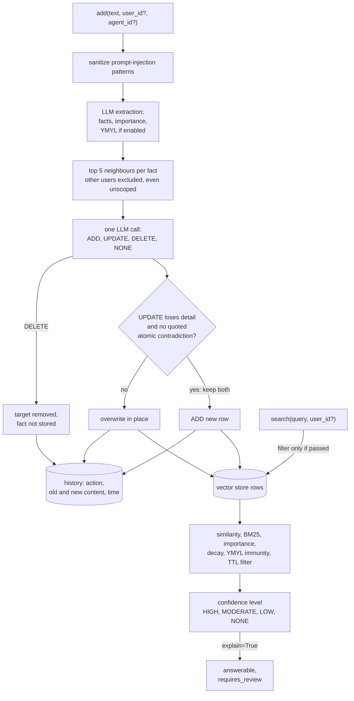

## 1. Executive Summary

widemem.ai is a Python memory library in the shape Mem0 popularized: an LLM
extracts facts, the nearest stored memories are fetched, and one batched LLM
call decides per fact whether to add, update, delete or skip. What it adds is
judgement about what matters, a write history with no update or delete path, and
a habit of testing its own README and logging its corrections in public. The
weakness is the read boundary. The write pipeline checks every candidate's owner
in code, while `search()` without a `user_id` ranks every user's memories.

On that base it adds:

- **Importance from 0 to 10 with decay**, exponential, linear or step.
- **YMYL** — eight categories from health and medical to tax and insurance,
  classified by regex and then by the extraction LLM, raised to an importance
  floor of 8, and exempt from decay, from the `ttl_days` search filter and from
  `purge_expired()`. It is opt-in: `YMYLConfig.enabled` defaults to `False`
  (`core/types.py:193`), and neither shipped server turns it on.
- **Retrieval confidence** — HIGH, MODERATE, LOW or NONE from the top raw
  similarity against thresholds recalibrated for `text-embedding-3-small`. The
  `strict`, `helpful` and `creative` modes the README sets through
  `MemoryConfig.uncertainty_mode` have no reader (`core/types.py:221`).
- **A facts, summaries and themes hierarchy** with query routing.

`docs/HISTORY.md` is a public corrections log. On 2 September 2026 it records
that the claimed audit trail had missed four write paths, including `delete()`;
on 6 July, that LoCoMo category labels had been transposed, so a multi-hop claim
was retracted. The fix for the first is a test that parses `core/memory.py` and
fails if a method there mutates the vector store without writing history.
`tests/test_readme_claims.py` holds thirteen tests of README and documentation
statements against code.

The evaluation controls are written and tested, and no runner imports them.
`benchmark/honest_core.py` refuses a judge equal to the answerer, scores the
adversarial category as abstention and builds a full-context baseline. The three
committed LoCoMo runners skip category 5 and default the judge to the answerer,
recording `self_graded` in their output.

Two marks: `audit_log`, `negative_eval`.

## 2. Mental Model

A memory exists or it does not. Extraction produces candidate facts with an
importance and, when YMYL is enabled, a category. The batch resolver sees the
facts beside the nearest five stored memories per fact and returns one action
per fact:

```mermaid
%% caption: text becomes facts, one LLM call decides each fact's fate under an overwrite guard, every write lands in history, and the read path scores without an owner unless one is passed
flowchart TB
    T["add(text, user_id?, agent_id?)"] --> SAN["sanitize prompt-injection patterns"]
    SAN --> EX["LLM extraction:<br/>facts, importance,<br/>YMYL if enabled"]
    EX --> CAND["top 5 neighbours per fact<br/>other users excluded, even unscoped"]
    CAND --> BATCH["one LLM call:<br/>ADD, UPDATE, DELETE, NONE"]
    BATCH --> GUARD{"UPDATE loses detail<br/>and no quoted<br/>atomic contradiction?"}
    GUARD -->|"yes: keep both"| ADD["ADD new row"]
    GUARD -->|"no"| UPD["overwrite in place"]
    BATCH -->|"DELETE"| GONE["target removed,<br/>fact not stored"]
    ADD --> VS[("vector store rows")]
    UPD --> VS
    ADD --> H[("history: action,<br/>old and new content, time")]
    UPD --> H
    GONE --> H
    Q["search(query, user_id?)"] -->|"filter only if passed"| VS
    VS --> SCORE["similarity, BM25, importance,<br/>decay, YMYL immunity, TTL filter"]
    SCORE --> CONF["confidence level<br/>HIGH, MODERATE, LOW, NONE"]
    CONF -->|"explain=True"| VERD["answerable,<br/>requires_review"]
```

The resolver is guarded against destroying detail. An UPDATE overwrites only
when the new fact restates every informative token of the old memory, or when
the model labels it a contradiction and quotes an old memory of at most six
informative tokens verbatim (`conflict/batch_resolver.py:359-378`). Anything
else becomes an ADD, so both facts stand and ranking decides between them. A
DELETE has no such guard: it removes its target, and the fact that prompted it
is not stored (`core/pipeline.py:290-302`).

Only the history row keeps a deleted or overwritten value. Nothing records that
a value was rejected, so a later extraction can write it again; `tombstone` is
withheld. There is no candidate or verified state. `search(explain=True)`
derives an `answerable` and `requires_review` verdict per query from the
confidence level and the YMYL categories present (`retrieval/explain.py:30-95`),
and nothing stores it; `trust_state` is withheld.

Every memory has `created_at` and `updated_at` as record time and an optional
`event_time`, parsed from a supplied timestamp or a leading date in the text.
`event_time` is stored and returned, and no filter or score reads it:
`time_after`, `time_before`, the parsed boost window and recency decay all read
`created_at` (`retrieval/temporal.py:26-31`, `:72-77`). An UPDATE replaces
`event_time` with the new call's when one is given. Nothing holds a validity
interval, so `bitemporal` is withheld.

No memory waits for a person. The one interactive hook is `on_clarification`, a
callback `add()` invokes when active retrieval finds a conflict. Returning `None`
abandons the whole add, and any other return value is ignored
(`core/pipeline.py:111-117`). Neither server passes one; `human_review` is
withheld.

## 3. Architecture

| Package | Role |
| --- | --- |
| `core/memory.py` (973 lines) | `WideMemory`: add, search, streaming search, pin, delete, purge, import and export, history |
| `core/pipeline.py` (366) | Extraction, candidate retrieval, action execution |
| `conflict/batch_resolver.py` (411) | The batched ADD/UPDATE/DELETE/NONE decision and the overwrite guard |
| `retrieval/` | BM25, hybrid fusion, temporal scoring and parsing, uncertainty, active retrieval, explanation, entity boost |
| `scoring/` | Importance, decay, topics, YMYL |
| `hierarchy/` | Summaries and themes, query router |
| `storage/vector/` | FAISS, Qdrant, pgvector |
| `storage/history.py` | SQLite history |
| `security/sanitizer.py` | Prompt-injection stripping |
| `server.py`, `mcp_server.py`, `integrations/langchain/` | Service surfaces |

### Deployment and ergonomics

- **What has to run:** nothing beyond the process. `WideMemory()` with the
  default config holds the FAISS index in process memory, because
  `VectorStoreConfig.path` defaults to `None` (`core/types.py:169`), while
  history is written to `~/.widemem/history.db`. Setting a path persists the
  index. The MCP and HTTP servers put both under `WIDEMEM_DATA_PATH`, default
  `~/.widemem/data`. Qdrant and pgvector are optional.
- **Keys:** extraction and resolution need an LLM — OpenAI, Anthropic or local
  Ollama — and the default `openai` provider falls back to Ollama when no key is
  set (`core/memory.py:932-948`). Embeddings can be local through
  sentence-transformers.
- **Hand-repairable:** the history database is plain SQLite; the FAISS index and
  its metadata are not meant to be edited.
- A Dockerfile and a Railway configuration deploy the HTTP server on `0.0.0.0`,
  which refuses to start without `WIDEMEM_API_KEY` (`server.py:63-92`).

The screen of this checkout found no auto-running configuration, one build-time
execution point (`tests/conftest.py`, which sets `KMP_DUPLICATE_LIB_OK`) and one
manifest with no lockfile. Nothing was installed or run.

## 4. Essential Implementation Paths

- **Add** — `WideMemory.add` (`core/memory.py:138`) parses `event_time` and calls
  `MemoryPipeline.process`; the extractor sanitizes the text first
  (`extraction/llm_extractor.py:34`).
- **Candidates** — `pipeline.py:140-185`: the store filters only for concrete
  ids, then a per-row check requires `metadata["user_id"] == user_id` and a
  matching agent id when one is given. An unscoped call never receives a scoped
  row, and a store that drops filters cannot widen scope.
- **Resolution** — `BatchConflictResolver._parse_actions` maps the model's
  integer ids back to stored ids, turns an unjustified NONE into ADD, and
  downgrades an UPDATE that fails `_may_overwrite` to ADD. If the model call
  fails, `_fallback_add_with_dedup` adds every fact whose hash no candidate
  carries.
- **Execution** — `pipeline._execute_actions` applies UPDATE (`:240`) and DELETE
  (`:290`) behind `_in_scope`, with history. An ADD is skipped when its hash
  matches a candidate's or an earlier fact's in the same call (`:121-124`,
  `:213-216`).
- **Search** — `_search_ranked` (`core/memory.py:336`): optional filters,
  candidate collection with the TTL cut, `score_and_rank` with YMYL and temporal
  handling, entity boost, hierarchy routing, then confidence.
- **Confidence** — `retrieval/uncertainty.py`: `assess_confidence` compares the
  top raw similarity against 0.60, 0.50 and 0.30, environment-overridable.
  `build_uncertainty_guidance` (`:70`) and `build_frustration_response` (`:150`)
  return advice for a mode and have no caller in the tree.
- **Explain** — `search(explain=True)` returns `build_explanation`
  (`retrieval/explain.py:30`).
- **History** — `storage/history.py`; `WideMemory.get_history` (`:644`).
- **Retention** — `purge_expired` (`:570`): YMYL rows kept unless
  `include_ymyl`, every removal through `delete()`.

## 5. Memory Data Model

`Memory` (`core/types.py:64-78`): `id`, `content`, `user_id`, `agent_id`,
`run_id`, `tier`, `importance`, `content_hash`, `ymyl_category`, `metadata`,
`created_at`, `updated_at`, `event_time`, `entities`. The vector store holds the
embedding with that metadata.

`history` (`storage/history.py:27-36`): `id`, `memory_id`, `action`,
`old_content`, `new_content`, `timestamp`. There is no actor column and no user
id, and the README says the first: the log answers what changed and when, not
who.

**Scope** is two optional string ids. The write pipeline enforces them in code,
independent of the store. Every other path passes them to the store only when
present: `search()` and `search_stream()` (`core/memory.py:372-378`,
`:255-261`), `count()`, `export_json()` and `summarize()`. An unscoped
`summarize()` groups every user's facts into summary rows with no owner
(`hierarchy/manager.py:110-119`). `get()` and `delete()` take an id and check no
owner.

The cross-user read is the stated contract rather than an oversight. The
LangChain retriever's docstring says that without a user id every user's
memories are in scope, and a test asserts it
(`integrations/langchain/retriever.py:55-56`,
`tests/test_langchain_retriever.py:122-130`). The HTTP and MCP surfaces take
`user_id` as a request or tool argument. With the read boundary omittable and
model-supplied, `scope_enforced` is withheld.

## 6. Retrieval Mechanics

Candidates come from the vector store, fetched at a multiple of `top_k` that
depends on the retrieval mode (`fast`, `balanced`, `deep`) and on whether
`_adapt_scoring` judges the query similarity-first. Scoring combines similarity
with BM25 when enabled, importance, a recency decay that YMYL rows are immune to,
topic weights and entity boosts. `ttl_days` removes rows older than the window
from results, except rows carrying a YMYL category. With
`parse_temporal_hints` on, temporal phrases in the query become a soft boost
window rather than a hard filter, so a misparse cannot empty the pool; explicit
`time_after` and `time_before` filter.

The hierarchy routes broad questions to summaries or themes and specific ones to
facts; routing is on under the default `balanced` preset, and summaries exist
only after `summarize()` runs. Active retrieval, off by default, surfaces
contradictions at write time and can ask clarifying questions.

Every result set carries a confidence level, and the LangChain retriever's
`min_confidence` drops the whole set below a threshold (`retriever.py:75-78`).
`explain=True` turns the level into a verdict. Review is required when
confidence is LOW or NONE, when a YMYL result lacks HIGH confidence, and
whenever a medical, safety or pharmaceutical result is present
(`explain.py:60-64`). Abstaining is left to the caller: nothing in `search()`
withholds results by mode.

## 7. Write Mechanics

`add()` is synchronous: sanitization, one extraction call, embedding, candidate
search, one resolution call for all facts, then writes and history. The caller
waits on two LLM calls, and the memory is searchable when `add` returns. Bulk
paths write history in one transaction per batch.

The resolver's DELETE is final in the store and consumes the fact that prompted
it. An UPDATE overwrites content and keeps `created_at`, so TTL and recency
count from when the fact was first learned. Deduplication follows resolution:
an ADD whose content hash matches a retrieved candidate, or an earlier fact in
the same call, is skipped.

No background pass exists; hierarchy summaries are built when `summarize()` is
called.

## 8. Agent Integration

A Python API; a FastAPI HTTP server with `/search`, `/add` and `/health` behind
an optional shared API key; an MCP server with `widemem_add`, `widemem_search`,
`widemem_delete`, `widemem_count`, `widemem_pin`, `widemem_export` and
`widemem_health`; and a LangChain `BaseRetriever`. The `widemem` console script
runs benchmark reports only (`cli.py:53-68`). The Claude Code skill the README
describes lives in a separate repository, `remete618/widemem-skill`, which this
report did not read.

The MCP tools accept an optional `user_id` from the model
(`mcp_server.py:77-80`, `:98-101`), and `widemem_delete` takes a bare memory id
(`:258-268`). That is where the read-path scope gap becomes a model-reachable
one.

## 9. Reliability, Safety, and Trust

**The write history is complete and append-only.** Every method that mutates the
vector store writes a history row, in `core/memory.py`, the pipeline and the
hierarchy manager, and `HistoryStore` issues only `INSERT` and `SELECT`. The
source-walking test holds the first file. The pipeline and hierarchy sites sit
outside it, and the hierarchy's two log calls have no test. The pipeline writes
the store before the history row, so a crash between them leaves an unlogged
mutation; `import_json` logs first. There is no attribution.

**Deleted content persists in history.** `delete()` and `purge_expired()` remove
the vector row and log its content, and nothing deletes a history row. A memory
removed at a user's request stays readable from `history.db` by id.

**Content is sanitized once, at extraction.** Instruction overrides, fake system
tags and similar patterns are stripped from the text given to `add()` or `pin()`
(`llm_extractor.py:34`). Search queries, `import_json()` content, and stored
facts fed back to the resolver and summarizer are not sanitized. The project's
own `AUDIT.md` lists the query and summarizer paths as WM-5 and WM-6.

**Claims are tested and corrected in public.** `test_readme_claims.py` and the
corrections log are uncommon, and they are why the audit gap and the LoCoMo
label error are documented rather than latent. The README's uncertainty-mode
section passed through that gate unchecked.

**Scope is asymmetric.** The write path would not let another user's memory
become an UPDATE or DELETE target; the read path would return it to an unscoped
search.

**Deletion loses the value.** Contradiction handling keeps no superseded memory;
the history row is the only place the old fact survives.

## 10. Tests, Evals, and Benchmarks

The suite covers scoring and decay, YMYL, BM25 and fusion, hierarchy,
abstention, the sanitizer, providers, the three vector backends, durability and
concurrency, the server's auth policy, the MCP server, README claims, and the
audit coverage ratchet.

The retrieval exclusion case is `test_audit_regressions.py:368-374`: two
memories for the same user are both older than `ttl_days`, and the search
asserts the YMYL one present and the trivial one absent. A tenant case seeds
alice and bob and asserts a retriever scoped to alice returns only alice's rows
(`test_langchain_retriever.py:111-119`). The audit file also asserts another
user's and another agent's rows never reach the conflict resolver (`:521`,
`:546`, `:583`), the last through a store wrapper that ignores filters. That
earns `negative_eval`.

**Benchmarks.** The README reports 55.15% on the full 1,540-question LoCoMo at
v1.5.0, with an independent GPT-4o judge (56.32% self-graded) at about 213
context tokens per query. The result files behind those numbers are not
committed. `benchmark/HONEST_LOCOMO.md` sets three controls, implemented in
`honest_core.py` with tests. No runner imports it, and the document calls the
scored runner a follow-up.

The runners that exist — `val.py`, `mini_locomo.py`, `run_ws1.py` — skip
category 5 (`val.py:288`, `mini_locomo.py:519`, `run_ws1.py:707`). Each takes the
judge from `WM_JUDGE_MODEL`, defaults it to the answerer, and records
`self_graded`; `test_judge_separation.py` asserts that default. The held-out
split is wired: `val.py --held-out` reads the committed `locomo_split.json`. The
one committed result, `benchmark/results/mini_locomo_baseline.json`, is a
50-question gate with no adversarial category, an overall J score at 40.0 and temporal
at 7.69, last touched by the 6 July label correction.

No paper is cited in the tree.

## 11. For Your Own Build

### Steal

- **Enforce write-path scope in code, not in the store's filter.** Check each
  candidate's ids after retrieval, and test it with a store that ignores filters.
- **Guard in-place overwrites.** Allow one only when the new fact restates the
  old, or when the model quotes the whole of a short memory it contradicts;
  otherwise keep both facts.
- **Keep a history row for every mutation, and test for missing ones by walking
  the source** — every file that holds a mutator, not one.
- **Exempt high-stakes facts from decay and retention by category**, and make the
  exemption something a caller must explicitly override.
- **Return a confidence level with retrieval** so the agent can abstain.
- **Publish corrections as a log** and gate README claims with tests.
- **Write evaluation controls as pure, tested functions** — a judge distinct from
  the answerer, unanswerable questions scored as abstention, a full-context
  ceiling — and record `self_graded` in every result file.

### Avoid

- **An optional read scope next to a strict write scope.** The unscoped search is
  the one call that should have been refused or limited to unscoped rows, as the
  write path does.
- **Deleting the contradicted fact.** Supersede it, so the store — not only the
  log — can say what was believed before.
- **Controls the runner does not import.** A tested methodology module beside
  runners that skip the adversarial category reads as a controlled benchmark and
  is not one.
- **A documented config key with no reader.** A README-claims test that checks
  config defaults can also check that each key is read somewhere.
- **A headline benchmark number without its result files in the repository.**

### Fit

This suits a Python application with a known user id per call that wants a
batteries-included memory with sensible priorities — a personal assistant, a
support agent, anything where a medication must outlive a lunch order — and can
live with an LLM on every write. Turn YMYL on, set a vector store path, and put
the user id on every search yourself or add the unscoped guard the write path
has. For MCP exposure, bind the user id server-side rather than from tool
arguments, and put `widemem_delete` behind an owner check.

## 12. Open Questions

- **Is a cross-user unscoped search intended for the HTTP and MCP servers**, or
  only for library callers who know they are reading every user?
- **Where are the 55.15% LoCoMo result files, and which runner produced them**,
  given that every committed runner skips category 5? The README points to the
  website.
- **Will `uncertainty_mode` be wired into `search()` or removed?**
- **Will `HistoryEntry` gain an actor?** The README-claims test gates attribution
  until it does.

## Appendix: File Index

- `widemem/core/memory.py`, `core/pipeline.py`, `core/types.py`
- `widemem/conflict/batch_resolver.py`, `conflict/prompts.py`
- `widemem/extraction/llm_extractor.py`, `extraction/collector.py`
- `widemem/retrieval/temporal.py`, `uncertainty.py`, `explain.py`, `bm25.py`, `hybrid.py`, `active.py`
- `widemem/scoring/ymyl.py`, `widemem/hierarchy/manager.py`, `hierarchy/summarizer.py`
- `widemem/storage/history.py`, `storage/vector/{faiss,qdrant,pgvector}_store.py`
- `widemem/security/sanitizer.py`, `widemem/mcp_server.py`, `widemem/server.py`, `widemem/cli.py`
- `widemem/integrations/langchain/retriever.py`
- `docs/HISTORY.md`, `AUDIT.md`, `benchmark/HONEST_LOCOMO.md`, `benchmark/honest_core.py`, `benchmark/val.py`, `benchmark/mini_locomo.py`, `benchmark/run_ws1.py`
- `tests/test_audit_log_coverage.py`, `tests/test_audit_regressions.py`, `tests/test_readme_claims.py`, `tests/test_langchain_retriever.py`, `tests/test_judge_separation.py`

**Searches behind the absence claims**

- `rg -n "UPDATE history|DELETE FROM history" .` — none
- `rg -n "valid_(from|until|to)" .` — none
- `rg -n -i "tombstone|suppress(ed|ion)?_|rejected_values|blocklist" widemem` — none
- `rg -n "event_time" widemem/retrieval widemem/scoring widemem/hierarchy` — none
- `rg -n "uncertainty_mode" widemem` — only the declaration, `core/types.py:221`
- `rg -n "build_uncertainty_guidance\(|build_frustration_response\(" widemem tests benchmark scripts examples` — the two definitions only
- `rg -n "sanitize\(" widemem` — one call, `extraction/llm_extractor.py:34`, beside the definition
- `rg -n "honest_core" benchmark widemem scripts` — only `HONEST_LOCOMO.md`
- `rg -n '"category"\] == 5' benchmark` — a skip in each of `val.py`, `mini_locomo.py`, `run_ws1.py`
- `rg -n 'get_history' tests` — no hit in `test_hierarchy.py`
- `rg -n -i 'arxiv|bibtex|@article|@misc|citation|doi\.org' --glob '!*.json' .` — none
- `git ls-files benchmark/results` — only `mini_locomo_baseline.json`

## History

**2026-09-30** — [`fdf736fcf3a1d21e0984324bf0b03b93a6844c18`](https://github.com/remete618/widemem-ai/commit/fdf736fcf3a1d21e0984324bf0b03b93a6844c18) — the same commit, which is upstream HEAD, so every correction is the atlas's own. Screened again: one build-time execution point, one unpinned manifest, nothing inside the cooldown; nothing installed, built or run. No mark moved; `negative_eval` gained a read-path tenant case, and both records were re-anchored. Seven published claims overstated the system: the LoCoMo controls are unimported and the runners skip the adversarial category and self-grade by default ([§10](#10-tests-evals-and-benchmarks)); `uncertainty_mode` has no reader; YMYL is off by default; sanitization runs at extraction only; the history test parses one file; deduplication follows resolution; the CLI and Claude Code skill are not memory surfaces here. Added: the overwrite guard, the DELETE that drops its fact, and the unscoped delete, export and summarize paths ([§5](#5-memory-data-model)).

**2026-09-15** — [`fdf736fcf3a1d21e0984324bf0b03b93a6844c18`](https://github.com/remete618/widemem-ai/commit/fdf736fcf3a1d21e0984324bf0b03b93a6844c18) — first reading, at a commit dated 14 September 2026. Screened before opening: no auto-running configuration, one build-time execution point, one unpinned manifest, one dependency surface inside the seven-day cooldown. Nothing was installed or run.
