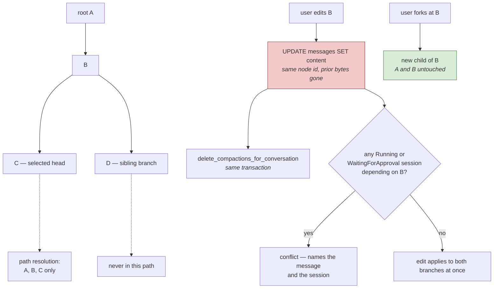

## 1. Executive Summary

Windie Sandbox is an MIT-licensed Rust desktop runtime — about 40,800 lines
across 134 files — for an AI assistant that runs on your own machine. Its README
tagline is the reason it is in this atlas: *"AI that lives on your computer: edit
what it sees and branch conversations without losing the original."*

That sentence describes a memory design, and the design is real. A conversation
is **one shared message tree** in SQLite. Every message is persisted once with a
`parent_message_id`; a branch is a second child of an existing node, not a copy
of the history above it. A request does not send the tree — it selects a head
message and resolves the root-to-head path, and that path is the model's context.
`docs/conversation-tree-and-paths.md` states the alternative it rejected —
materialising a linear path per branch — and why: duplicated ancestors that the
database would then have to keep synchronised.

This clears the atlas's scope bar without strain, and it is worth saying why,
because a "conversation history" store usually does not. Messages here survive
the session with a stable identity, sessions point at a head **without owning or
copying messages**, and edits, deletions and truncations are operations on named
tree nodes. That is durable memory with correctable units, not a chat buffer
deciding what stays in the window.

The design is careful in places this atlas rarely sees. `ensure_message_mutation_allowed`
refuses to modify any message that a `Running` or `WaitingForApproval` session
depends on, and names both the message and the session in the error. Every edit
and every delete calls `delete_compactions_for_conversation` in the same
transaction, so a summary derived from history through a message cannot outlive
the history it summarised. Removing a tool-call assistant message — or any
tool-result below it — deletes the whole group, "so model context cannot contain
dangling tool calls or dangling tool results."

And then the finding. The tagline joins two operations with *and*, and only one
of them keeps the original. `fork_conversation_at_message` creates a branch and
every ancestor stays exactly where it was. `replace_message` is
`UPDATE messages SET content = ?1 WHERE conversation_id = ?2 AND id = ?3`. There
is no version row, no supersession pointer, and no prior-content record anywhere
in the schema. **The tree preserves branches. It does not preserve versions of a
message.** Editing what the AI sees loses the original; branching away from it
does not.

## 2. Mental Model

A memory is **a message node**: an id, a parent, a role, content, optional
metadata, and ordered parts beneath it. Nothing is extracted, summarised or
inferred into a separate representation — what was said is what is stored, and
the structure is the only interpretation the system adds.

The state machine is about *position in a tree*, not about belief:

| State | How it is reached |
| --- | --- |
| in the tree, off the selected path | a sibling branch exists; the model never sees it |
| in the tree, on the selected path | the head resolves through it |
| content replaced | `replace_message` — same node, new bytes, old bytes gone |
| spliced out | `remove_message` — children reparent to the grandparent |
| cut | `truncate_after_message` — the subtree below a node is removed |

Two of those five transitions are lossless with respect to history and three are
not, which is the honest summary of the design. Branching is free and reversible;
editing and deleting are not.

Nothing here carries trust, confidence or provenance. `sessions.status` has a
`WaitingForApproval` value, but it gates whether a *tool call* proceeds, not
whether a memory may be believed. A message that the user rewrote and a message
the model produced are the same kind of row afterwards, and nothing records which
is which.



The two shaded boxes are the same promise resolved two ways. A fork is additive
and the original is intact. An edit is destructive, and because the edited node
is *shared by every branch below it*, it rewrites the history of branches the
user was not looking at — which is the sharp end of a design whose whole virtue
is that ancestors have one identity and one copy.

## 3. Architecture

A **local desktop application**, not a service: a Rust binary with a tray, a CLI,
a gateway, an MCP surface (`src/mcp.rs`, `src/mcp_http.rs`, `src/tool_provider/mcp/`)
and one SQLite file. `src/store/` is the persistence layer at 7,967 lines,
`src/session/` runs sessions, `src/operation/` is the operation layer the CLI and
API call into, and `src/llm/` handles providers and streaming.

The schema (`src/store/schema.rs`) is twelve tables: `conversations`, `messages`,
`message_parts`, `image_assets`, `sessions`, `session_events`, `session_inputs`,
`compactions`, `tool_schemas`, `installed_providers`, `chrome_devtools_settings`
and `provider_tool_catalogs`, with seven indexes named for the access paths they
serve — `messages_parent_idx` for the traversal, `messages_id_conversation_idx`
for the containment check.

Three submodules are declared in `.gitmodules`, all owned by the same account:
`vendor/bifrost` (tracking a `dev` branch), `vendor/windie-landing-2nd` and
`vendor/windie-inspector`. **They were left uninitialised for this reading**, so
nothing in them is described here, and `bifrost` in particular — pinned to a
moving development branch rather than a tag — is a dependency surface this report
did not inspect.

### Deployment and ergonomics

Nothing to stand up beyond the application: one SQLite file, no server, no key
required to store anything. The store is inspectable with any SQLite client and
repairable by hand, which matters more than usual here because there is no
history to recover an edit from.

`src/store/schema.rs` versions the database and the tests assert it **rejects a
newer schema, an older schema, and an existing unversioned database** — three
directions, where most projects check one. `open_memory()` exists for tests, so
the store runs entirely in memory.

## 4. Essential Implementation Paths

**Path resolution.** `load_path_to_message(conversation_id, head_message_id)`
follows parent links from the head to the root and returns root-to-head order.
The doc is explicit that the current SQLite implementation "performs the parent
traversal in one recursive query. It is not making one network request per
ancestor, but it still has to resolve the ancestry because only the immediate
parent is stored on each message." `load_message_tree` returns everything;
`root_to_leaf_paths` enumerates every branch.

**Fork.** `fork_conversation_at_message` (`src/operation/conversation.rs:84` →
`src/store/message.rs:877`) creates a branch at a chosen node. Ancestors are
shared, not copied — the property the whole storage model exists to provide.

**Edit.** `src/operation/message.rs:63` calls `store.replace_message`
(`src/store/message.rs:629`), which validates the conversation, validates
containment, calls the mutation guard, then runs a single `UPDATE`, replaces the
text parts, deletes the conversation's compactions and touches the conversation
timestamp — all in one transaction. The transaction is correct and complete. What
it does not do is keep the old content.

**The mutation guard.** `ensure_message_mutation_allowed`
(`src/store/session.rs:51`) walks the conversation's sessions, skips any not
`Running` or `WaitingForApproval`, and for the rest checks whether the message
being changed is in that session's protected set. If it is, the operation fails
with a conflict: *"cannot modify message {id}; it is part of active session
{id}"*. Correction that refuses to race in-flight work is rare in this atlas —
most stores here let the edit land and discover the inconsistency later.

**Splice delete.** `remove_message` reparents direct children onto the removed
node's parent and leaves deeper descendants alone. Its docstring defines the
tool-call group — "one assistant message with tool-call metadata plus the linear
`role: tool` result chain below it" — and deleting either end deletes the whole
group before splicing. This is a correctness property about *model context*
enforced in the *storage layer*, which is the right place for it: no caller can
forget it, and no branch can end up presenting a tool result with no call.

**Compaction invalidation.** `delete_compactions_for_conversation` runs inside
the edit transaction and inside the delete transaction. A `Compaction` is a
summary "through" a specific message, so mutating the history it covers makes it
wrong; dropping it is the conservative choice and it is taken atomically with the
change that caused it.

**Compaction writing.** `save_compaction` carries `#[allow(dead_code)]` and a
docstring: *"This is currently a stored primitive for future automatic
compaction; no CLI command writes compactions yet."* The table exists, the read
path exists, the invalidation exists, and the writer is declared absent in the
code rather than left for a reader to discover.

## 5. Memory Data Model

`messages` is `id`, `conversation_id`, `parent_message_id`, `role`, `content`,
`metadata`, `created_at`, with foreign keys to `conversations` and to itself.
`message_parts` holds ordered `(position, kind, text, image_asset_id)` rows with
`ON DELETE CASCADE`, and `image_assets` stores bytes with a `sha256` — so an
image is content-addressed and shared rather than duplicated per message, the
same instinct as the shared-ancestor tree applied one level down.

**Temporal fields are `created_at` only.** There is no `updated_at` on a message,
which is worth stating precisely: after `replace_message`, a message's stored
timestamp is when it was *first written*, and nothing records that it changed or
when. The conversation's `updated_at` moves; the message's does not.

**Scope is the conversation and the selected path.** `conversation_id` is
enforced on every read and write through `ensure_message_belongs_to_conversation`,
and `rejects_message_parent_from_another_conversation` is a committed test. There
is no user, tenant or agent key, and none is wanted — this is one person's
machine, and calling that a deficiency would be the category error the rubric
warns about. The mark is withheld because a conversation is a container rather
than a principal, and the boundary that does real work here is the selected-head
path, which is a view rather than an authorization.

**No trust state, no provenance, no supersession.** A message knows its parent
and nothing about where its content came from or whether anyone has since decided
it was wrong.

## 6. Retrieval Mechanics

There is no search. No keyword index, no embeddings, no ranking, no reranking and
no relevance model of any kind — `stack_retrieval` is empty, and that is a design
position rather than a gap.

Retrieval is **structural**: pick a head, resolve its ancestry, send the path.
What the model sees is exactly the branch the user is standing on, in order,
every time. `system_prompt_is_tree_wide_same_for_any_head` and
`tool_schemas_are_tree_wide_same_for_any_head` are committed tests confirming
that conversation-level inputs apply across branches while messages do not.

The consequences are worth being clear about, because they cut both ways. **There
is no over-recall and there are no irrelevant hits** — the path is the path, and
a sibling branch cannot leak into it. That is a real guarantee, and
`loads_path_to_message` asserts it directly. **Under-recall is total and by
design**: anything on another branch, or above a truncation, or in another
conversation, is unreachable from this request no matter how relevant it is. A
user who explored an idea on a fork and came back has no mechanism to bring that
finding across except copying it by hand.

Token budgeting is not addressed at this layer. The path grows monotonically with
the branch, `save_compaction` is the intended answer, and nothing writes
compactions yet — so the practical bound on context is the user forking, editing
or truncating.

## 7. Write Mechanics

Writes are **synchronous, user- or run-driven, and cheap**: an insert with a
parent link, plus part rows. There is no model call on the write path, no
extraction and no background pass. A message is retrievable the moment it is
committed.

`insert_message`, `insert_run_message`, `insert_tool_result_message`,
`insert_run_tool_result_message`, `insert_run_tool_result_message_with_parts` and
`insert_message_with_parts` are six insert variants, and
`batch_attached_tool_insert_is_atomic` is a test asserting the batched form is
all-or-nothing — the failure that otherwise leaves a tool call without its
results.

Deduplication does not apply; every message is a new node. Conflict handling is
the mutation guard, and it handles the conflict that matters: a person editing
history while a session is reading it.

**Correction is destructive and the loss is silent.** `replace_message` succeeds
and returns `Ok(())`; nothing tells the caller what the previous content was, and
nothing in the database retains it. A user who edits a message to test a
different phrasing, then wants the original back, has no path to it — while the
same user who *forked* instead of editing has both. The mechanism to preserve the
original exists, is well built, and is a different button.

The sharper version of the same point: because ancestors are shared, editing a
node rewrites the context of **every branch descending from it**. That is the
correct consequence of the storage model and it is the opposite of what "without
losing the original" leads a reader to expect.

### Operational cost

Nothing blocks on a model. A fork costs one row regardless of history depth,
which is the design's headline efficiency claim and it holds — `benches/` and
`src/perf/scenarios.rs` exercise both the edit and the fork paths.

Path resolution costs one recursive CTE per request, growing with branch depth
rather than tree size. No pass ever rewrites the store.

## 8. Agent Integration

Windie is the agent, not a memory library mounted into one. The memory operations
are user operations: `src/operation/message.rs`, `conversation.rs`, `session.rs`,
`session_cli.rs` and `session_approval.rs` expose editing, deleting, truncating
and forking to the person at the keyboard, and `src/cli/` and the MCP surface
carry them.

The model has **no agency over memory** at all. It cannot fork, edit, delete or
choose a head; it receives a resolved path and appends to it. Every structural
decision belongs to the user. That is an unusual and defensible split — the
failure modes of model-managed memory simply do not exist here — and it means the
system's memory quality is bounded by how much curation a person is willing to do.

`approve_session_tool` and `deny_session_tool` gate tool execution per call, with
`WaitingForApproval` as a session status. That is an approval surface over
*actions*, not over memory content.

## 9. Reliability, Safety, and Trust

**The mutation guard is the standout.** Refusing to modify a message an active
session depends on, and saying which session, is a concurrency property most
memory stores in this atlas do not attempt. It is also narrow by construction:
sessions that are not `Running` or `WaitingForApproval` are skipped, so the guard
protects live reads and not durability of anything else.

**Transactional discipline throughout.** Edit, delete and truncate each take a
transaction covering the message, its parts, the compactions they invalidate and
the conversation timestamp. Session repair after deletion happens inside the same
transaction.

**Tool-group integrity enforced in storage**, so a malformed context cannot be
constructed by any caller.

Against those:

**No mutation audit.** `session_events` is an append-only autoincrement log, and
it records *session run* events. `replace_message` writes no event to it — the
only reference to `session_events` in the message store is a `DELETE` during
cleanup. So the store can answer "what did this session do" and cannot answer
"who changed this message, when, and from what". The mark is withheld on that
basis, and it is the gap that makes the destructive edit worse than it needs to
be: with an event log, the prior content would at least be reconstructible.

**No trust state and no provenance.** After an edit, a message the user wrote is
indistinguishable from one the model produced.

**No user-facing recovery from an edit.** SQLite backups are the answer, and they
are the user's problem.

**A submodule tracking a branch.** `vendor/bifrost` is pinned to `dev` rather
than to a commit or a tag, which means what that dependency resolves to is not
fixed by this repository's own history. Nothing about it is claimed here; it was
not initialised.

## 10. Tests, Evals, and Benchmarks

**No paper**, and none implied — no `CITATION.cff`, no arXiv or DOI reference in
the README or `docs/`.

**414 test functions across `src/`**, with 105 in `src/store/tests.rs` alone —
3,319 lines of tests against 4,648 lines of store code, which is the ratio this
atlas sees in its better-engineered entries. **I did not run them.** `Cargo.toml`
and `Cargo.lock` both changed the day of this reading, inside the seven-day
cooldown, so nothing was built and nothing was installed.

The schema-version tests are a small model of the file's character:
`rejects_newer_database_schema_version`, `rejects_older_database_schema_version`
and `rejects_existing_unversioned_database_schema` — three refusals where one is
the norm.

**The negative retrieval assertion is `loads_path_to_message`.** It inserts a
root, then two assistant messages as *siblings* under it, resolves the path to
the first, and asserts the length, both expected ids, and then explicitly:

```rust
assert_ne!(path[1].id.as_deref(), Some(second_branch_id.as_str()));
```

That last line is the mark. It is not an exact-equality check that happens to
exclude the sibling — it is a written assertion that the other branch must not
appear in what retrieval returns, which is exactly the shape the rubric asks for
and which most systems here never write down.

What is **not** tested is the property the tagline claims. There is no case
asserting that anything survives `replace_message` other than metadata
(`replacing_message_text_preserves_metadata` asserts the metadata does), because
there is nothing for such a case to assert. The absence is consistent with the
code rather than a coverage gap.

Before trusting this: a test that edits a node with two descendant branches and
asserts what each branch's resolved path now contains, since that is the
consequence a user is least likely to predict.

## 11. For Your Own Build

### Steal

**Store the conversation as a tree of shared nodes, not as a path per branch.**
One row per message with a parent link means a fork costs one insert at any
depth, shared ancestors have one identity, and there are no duplicated paths to
keep synchronised. `docs/conversation-tree-and-paths.md` makes the argument
better than most design docs make any argument, including the counterfactual it
rejected.

**Refuse to mutate memory an active reader depends on, and name both in the
error.** *"cannot modify message X; it is part of active session Y"* tells the
user what to do next. Most stores in this atlas let the write land and let the
reader discover the inconsistency, which converts a recoverable conflict into a
confusing result.

**Delete a derived summary in the same transaction as the edit that invalidates
it.** A compaction "through" a message is wrong the moment that history changes.
Dropping it atomically means the system can be behind, but never confidently
wrong — and being behind is the failure you can detect.

**Enforce context well-formedness in the storage layer.** Deleting any member of
a tool-call group deletes the group, so no caller anywhere can assemble a context
with a dangling tool result. A rule that lives in the store cannot be forgotten
by the next call site.

**Mark an unbuilt primitive as unbuilt, in the code.** `save_compaction` is
`#[allow(dead_code)]` with a docstring saying nothing writes compactions yet. A
reader checking the schema would otherwise conclude compaction is implemented,
which is the mistake the same reader makes with several other systems here.

### Avoid

**Editing in place when your whole premise is that the original survives.** If a
design offers both a branching operation and an edit operation, users will read
the branching guarantee as covering both. Either make the edit fork — write the
new content as a sibling and move the head — or say plainly, at the point of the
edit, that the previous text is gone.

**Shipping a destructive correction with no event log behind it.** The two gaps
compound: an in-place overwrite is survivable when an append-only record of
mutations exists, because the prior value is reconstructible. With neither, the
only recovery is a database backup the user did not know to take.

**Leaving a message's `created_at` as its only timestamp after you have let it be
edited.** A row whose content changed and whose sole timestamp says when it was
first written cannot be reasoned about at all — not "is this current", not "what
did we believe last Tuesday".

**Pinning a submodule to a branch.** `vendor/bifrost` tracks `dev`, so what a
fresh recursive clone resolves to is decided by another repository's activity
rather than by this one's history. Whatever the trust relationship, that is a
reproducibility property given away for nothing.

### Fit

Right for a single person who wants a local assistant whose history they control
directly — where branching to try an approach, cutting a bad turn, and keeping
several lines of enquiry alive under one root is the actual workflow. The tree is
the correct structure for that, it is implemented properly, and the guard around
in-flight sessions shows someone thought about what happens when curation meets a
running agent.

Wrong wherever memory must be defensible. There is no provenance, no trust state,
no audit of changes and no recoverable history of an edit, so "why does it
believe this" and "what did it say before I changed it" are both unanswerable
from the store. Wrong too if you need recall rather than navigation: nothing
searches, and a finding on a branch you are not standing on is, from the model's
point of view, gone.

## 12. Open Questions

- Is the in-place edit intentional, given the tagline? A fork-on-edit would cost
  one insert and a head move in a model that already supports both.
- What does `vendor/bifrost` contribute, and is it on the memory path? It was
  left uninitialised, and it tracks a moving branch.
- Does anything in the UI warn that editing a shared ancestor rewrites every
  descendant branch's context? The storage consequence is unavoidable; the
  disclosure was not traced.
- What writes `session_events`, and is there any event type that names a message
  mutation? The table shape would support one.
- Is automatic compaction in progress? The read path, the invalidation and the
  table are all present and only the writer is missing.

## Appendix: File Index

**Schema and store**
- `src/store/schema.rs` — twelve tables, seven indexes, schema versioning
- `src/store/message.rs` — `load_path_to_message`, `load_message_tree`, `root_to_leaf_paths`, `replace_message`, `remove_message`, `truncate_after_message`, `fork_conversation_at_message`
- `src/store/session.rs` — `ensure_message_mutation_allowed`, session head resolution
- `src/store/compaction.rs` — `latest_compaction`, `save_compaction` (dead code), `delete_compactions_for_conversation`
- `src/store/conversation.rs`, `system_prompt.rs`, `tool_schema.rs`, `mod.rs`

**Operations**
- `src/operation/message.rs` — the edit entry point
- `src/operation/conversation.rs` — the fork entry point
- `src/operation/session.rs`, `session_approval.rs`, `session_cli.rs`

**Session runtime**
- `src/session/manager.rs`, `model.rs`, `event.rs` — `SessionStatus`, approval gating

**Docs**
- `docs/conversation-tree-and-paths.md` — the storage argument, including the rejected alternative

**Tests and benchmarks**
- `src/store/tests.rs` — 105 tests, including `loads_path_to_message`
- `src/perf/scenarios.rs`, `benches/`

## History

**2026-08-10** — [`90f949b88be84243a79691b0183a0693641df4d8`](https://github.com/buiilding/Windie-Sandbox/commit/90f949b88be84243a79691b0183a0693641df4d8)
— first reading. Screened before reading: 1 auto-run surface (`.gitmodules`,
declaring three submodules owned by the same account, one of them tracking a
`dev` branch), 0 build-time exec surfaces and no `build.rs` anywhere in the tree,
and `Cargo.toml` and `Cargo.lock` both changed the same day — inside the
seven-day cooldown, so nothing was built, installed or executed. The submodules
were left uninitialised and nothing in `vendor/` is described here. The screen
scanned four files: the manifest surface at the repository root is thin, and most
of what it would ordinarily examine lives in the submodules it did not enter.
