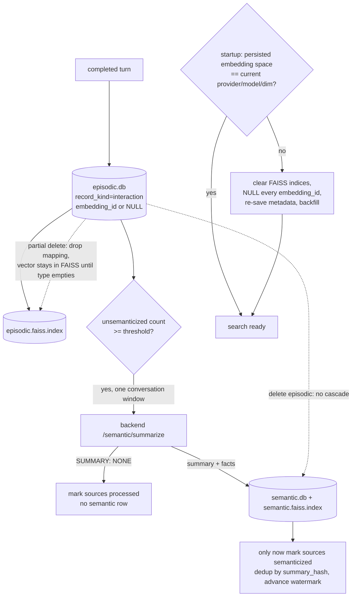

## 1. Executive Summary

WindieOS is a "hackable desktop runtime for personal AI agents" — an Electron
desktop app with a Python local runtime and a FastAPI backend, ~58,500 lines of
Python in the backend alone, MIT, by the author of the Rust
[Windie Sandbox](../windie-sandbox/) already in this atlas. The two are sibling
projects with genuinely different memory designs: the Sandbox's memory is a
SQLite message tree you branch and edit; WindieOS's is a **two-tier
episodic/semantic vector store** that lives on the user's machine. This report is
of WindieOS at its default-branch tip, which had not moved for six weeks at
reading while the author's active work was the Rust sibling — so read it as a
snapshot of a mature-but-paused predecessor, which is what the pin is for.

The memory is owned by the **local-runtime**, not the backend. Per user, on
disk: `episodic.db`, `semantic.db`, `episodic.faiss.index`,
`semantic.faiss.index`, and `watermark_state.json`. The backend does two
stateless jobs — compute an embedding (`/api/embeddings/`) and summarize a
conversation window into facts (`/api/semantic/summarize`) — and the local store
persists everything and does all retrieval. That split is the first good idea:
the thing that holds your memory runs on your machine, and the cloud is a
calculator it calls.

**The finding worth the report is the embedding-space guard.** A vector store
has a problem almost nobody in this atlas addresses: vectors are only comparable
within the embedding model that produced them, so the day you change the
embedding provider, model, or dimension, every stored vector becomes noise
against every new query — silently, because cosine similarity still returns a
number. WindieOS stamps each index with an `EmbeddingSpaceMetadata`
(`embedding_provider_id`, `embedding_model_id`, `embedding_dimension`,
`embedding_space_version`), checks it on startup, and when it has changed logs
*"SDK embedding space changed … Clearing local vector indices,"* resets the FAISS
indices, nulls every `embedding_id` in SQLite, and re-saves the metadata. The
rows survive; the vectors are rebuilt from them when embeddings are available
again. That is the correct answer to a failure mode most systems here would ship
straight into.

The weaknesses are two delete gaps the project documents honestly. Deleting an
episodic conversation does **not** cascade to the semantic summaries derived from
it — *"There is no cross-delete cascade between episodic and semantic memory"* —
so a fact-summary can outlive the interactions it summarized, which is the exact
opposite of the Rust sibling, where deleting a message deletes its compactions in
the same transaction. And a **partial** delete leaves the vector in the FAISS
file — *"stale vectors may remain"* — cleared only when a memory type reaches
zero rows. The mapping from that vector back to a memory id is dropped, so the
stale vector cannot surface deleted content, but it bloats the index and the
recall count until the type empties.

## 2. Mental Model

Two tiers, and the pipeline between them is the whole epistemic design.

An **episodic memory** is a completed interaction — `record_kind='interaction'`,
a turn's worth of durable fact/interaction content, distinct from the visible
chat log (which lives in `conversation_events`, not in the memory table). A
**semantic memory** is a fact-summary rolled up from a window of episodic rows by
the backend summarizer.

```text
completed turn      -> episodic.db row (record_kind='interaction'), embedding requested
                    -> FAISS episodic index (or NULL vector id if embeddings are down)
summarizer gate     -> unsemanticized interaction count crosses a threshold
                    -> fetch one conversation window (<=30 rows, oldest-first)
                    -> backend /semantic/summarize -> summary + facts, or SUMMARY: NONE
SUMMARY: NONE       -> source rows marked processed, no semantic row created
summary written     -> semantic.db row + FAISS semantic index
                    -> only THEN are the source episodic rows marked semanticized
```

The states a memory moves through are *unsemanticized → semanticized* on the
episodic side, and *present → deleted* on both. There is no verified, no
rejected, no confidence, and no supersession — a semantic memory does not point
back at a corrected earlier one; it is a fresh row. So there is no trust state to
describe, and the report withholds `trust_state`. What stands in for judgement is
a **filter at write time**: the summarizer rejects greetings, transient UI/app
state, and runtime/tool-error facts, and treats an explicit `SUMMARY: NONE` as a
valid "nothing durable here" outcome that still advances the watermark. Low
value is dropped, not recorded as low-value.

The ordering discipline is the careful part. Episodic rows are marked
semanticized **only after** a successful semantic write, and the summarizer
deduplicates by a `summary_hash` over the source memory ids and resumes from
`watermark_state.json`. So a crash between summarize and mark cannot lose a fact
or double-count one: the work is idempotent and the watermark is the only
progress authority.



## 3. Architecture

- **Local-runtime memory** (`frontend/src/main/python/memory/`, ~6,300 lines):
  `local_store.py` (1,894) is `LocalMemoryStore` — SQLite + FAISS, search/add/
  update/delete, embedding-space metadata; `chat_event_store.py` (1,967) is the
  visible chat replay, kept out of the memory table; `summarizer.py` (551) is the
  episodic→semantic roll-up; `sqlite_store.py` the schema; `faiss_index.py` the
  index read/write; `operations.py` the CRUD surface; `admin.py` bulk destructive
  resets; `conversation_*_runtime.py` the windowing and semanticization queries;
  `watermark_state.py` the progress ledger; `index_artifact_cleanup.py` the
  empty-index file removal.
- **Backend** (`backend/src/api/routes/memory/`): `embeddings/` (provider-routed:
  local SentenceTransformer, remote HTTP, vendor OpenAI, or disabled) and
  `semantic/` (LLM summarization + fact extraction, and title generation). Both
  stateless; the backend holds no memory.
- **Transport**: the desktop app talks to the local runtime over JSON-RPC, and
  the local runtime calls the backend over HTTP.

Two SQLite databases (episodic, semantic) and two FAISS `IndexFlatIP` indices,
one per tier, per user, in the OS app-data directory. `IndexFlatIP` is exact
inner-product search — no approximate-nearest-neighbour structure — so recall is
exhaustive and correct at whatever the local corpus size is, which for a personal
desktop memory is the right trade.

### Deployment and ergonomics

- **Fully local storage, cloud compute.** The store needs no service; embeddings
  and summaries need the backend, and every backend dependency degrades
  non-fatally (see §7).
- **An embedding provider is required for vector search**, but not for storage:
  with embeddings disabled, writes still persist to SQLite with NULL vector ids
  and search returns nothing rather than failing.
- **The store is on-disk SQLite plus FAISS files**, inspectable with ordinary
  tools, and the docs ship a one-command "nuke local memory" reset.
- **Per-OS paths** are documented (`~/.config/windieos/memory/` on Linux, the
  Application Support and APPDATA equivalents elsewhere).

The screen found one auto-run surface, one build-time execution point, eight
unpinned manifests, and lockfiles unchanged for 47–130 days (so no cooldown
exposure). A `CLAUDE.md`/`AGENTS.md` pair was read as data. Nothing was installed
or run.

## 4. Essential Implementation Paths

- **Write** — `LocalMemoryStore.add_*` in `local_store.py`: the SDK supplies the
  embedding, the row is written to `episodic.db`, and the vector is added to the
  episodic FAISS index; a missing embedding yields a NULL `embedding_id`.
- **Embedding-space check** — `local_store.py:405` onward: load persisted
  `EmbeddingSpaceMetadata`, compare `embedding_space_version` and
  `embedding_dimension`, and on mismatch call `_clear_all_vector_mappings`
  (`:428`), which `_reset_all_indices` to fresh `IndexFlatIP`, clears the
  in-memory id maps, `UPDATE memories SET embedding_id = NULL`, and re-saves the
  FAISS files.
- **Search** — `local_store.py:930` ("Apply user_id filter"): FAISS
  inner-product query per memory type, resolved through the vector-id→memory-id
  map, with `WHERE user_id = ?` on the SQLite fetch (`:1255`, `:1515`).
- **Summarize** — `summarizer.py`: the run gate on unsemanticized interaction
  count (`min_batch_size=6`, idle `min_batch_size_idle=1`), per-conversation
  window fetch (`max_batch_size=30`, oldest-first), `RemoteSemanticClient` call,
  `summary_hash` dedup, watermark advance, and the mark-semanticized-after-write
  ordering.
- **Delete** — `local_store.py:1617`/`:1661`: drop the row, drop its vector
  mapping "so stale vectors cannot be resolved back to memory IDs"; the
  whole-index cleanup at `:1694` runs only when a type empties, via
  `index_artifact_cleanup.py`.
- **Backfill/repair** — `_repair_index_mapping_mismatch("episodic"|"semantic")`
  at startup (`:297`), and re-embedding of NULL-vector rows once embeddings
  return.
- **Chat vs memory boundary** — `chat_event_store.py`: `conversation_events` for
  the visible timeline, never summarized, kept out of the memory table.

## 5. Memory Data Model

The `memories` table carries `user_id` (indexed), `conversation_id`, the content,
a `record_kind` (`interaction` for episodic memory rows), an `embedding_id`
(nullable), and timestamps; conversation rows are keyed `(user_id,
conversation_id)`. The semantic table holds the summary text, its facts, and a
`summary_hash`. `EmbeddingSpaceMetadata` is persisted beside the indices, not in
a row — it describes the whole index, which is correct, because the property it
guards (which model built these vectors) is a property of the index and not of
any single memory.

**Scoping is real and applied on the read path.** `user_id` is a column with its
own index, every SQLite read in the store carries `WHERE user_id = ?`, and the
conversation primary key is `(user_id, conversation_id)`. That earns
`scope_enforced`. The honest caveat: this is a personal desktop runtime, so the
scope key separates identities on one machine rather than enforcing a
multi-tenant boundary — but it is a stored key filtered on the read path, not a
tag, and the summarizer resolves the authenticated user id rather than trusting a
caller-supplied one.

Temporal fields are creation/update timestamps only — record time. Nothing
tracks when a fact was true of the world, so `bitemporal` does not apply.

The separation between `conversation_events` (visible chat) and the `memories`
table (durable facts) is the same discipline the Rust sibling applies between its
message tree and its compactions, and it is the right one: the transcript and the
memory are different kinds of thing with different lifecycles, and conflating them
is how a chat buffer gets mistaken for a memory.

## 6. Retrieval Mechanics

Vector-only, per tier, exact. A query is embedded by the backend, searched
against the episodic and/or semantic `IndexFlatIP` by inner product, resolved to
memory ids through the in-memory map, and fetched from SQLite under the user
filter. There is no lexical arm on the memory path (the separate
`search_conversations` helper does chat-log search, which is a different
surface), no reranker, and no fusion — this is straightforward semantic recall.

Three properties are worth drawing out.

**Retrieval fails safe.** When the embedding provider is disabled, unavailable,
or circuit-broken, memory search "returns no prompt memories" rather than
erroring, and the turn continues. A memory system that becomes a hard dependency
of the chat loop is a fragile one; this one is an enhancement that can be absent.

**The embedding-space guard is what makes recall trustworthy at all.** Without
it, the first time the embedding model changed, every query would score
historical vectors on an incompatible basis and return confident nonsense. With
it, the window after a model change is a period where search returns *less* (only
re-embedded rows) rather than *wrong* — the correct direction for that trade.

**Exact search caps the scale.** `IndexFlatIP` is O(n) per query. For a personal
memory that is fine and removes an entire class of ANN-recall bugs; for a store
that grew to millions of rows it would be the bottleneck, and nothing here shards
or switches to an approximate index. The design is scoped to one person's memory
and priced accordingly.

## 7. Write Mechanics

The write path is SDK-driven and degrades in layers. The SDK asks the backend
for an embedding, then hands the row and its vector to the local store. If the
embedding call fails, the row is still written to SQLite with a NULL
`embedding_id`; a startup backfill re-embeds NULL-vector rows once embeddings
return. So a memory is never lost to an embedding outage — it is stored
immediately and made searchable later, which is the same read-your-writes-lag
shape [Zep](../zep/) documents, handled here by storing first and indexing when
able rather than by polling.

Summarization is the background consolidation and it is gated conservatively:
a run fires when the unsemanticized interaction count crosses `min_batch_size`
(6) immediately, or `min_batch_size_idle` (1) after an idle/age check, and then a
per-conversation batch gate applies again. Batches are scoped to a single
`conversation_id` — one summary never mixes two conversations — and processed
oldest-first. The token cost therefore scales with new interactions, not with the
whole corpus: this is not a nightly map-reduce over everything, and the watermark
means a restart resumes rather than re-summarizes.

Deletion is where the design is weakest, and the project says so plainly in its
own FAQ. Two gaps:

- **No episodic→semantic cascade.** Deleting the episodic interactions does not
  delete the semantic summary derived from them. A fact-summary can therefore
  outlive its sources, and a user who deletes a conversation to remove its
  content may leave the extracted facts behind in semantic memory. The Rust
  sibling deletes compactions in the same transaction as the message they cover;
  WindieOS does not, and the divergence between the same author's two systems is
  the sharpest illustration in the atlas of how much that transaction matters.
- **Stale vectors on partial delete.** A single-row delete drops the
  vector→memory mapping but leaves the vector in the FAISS file; the file is only
  rebuilt when the memory type hits zero rows. The dropped mapping means the
  orphan cannot surface deleted content — a real safety property, tested — but
  the index keeps growing with dead vectors, and `ntotal` overreports the live
  memory count until the type empties. This is the [LangGraph](../langgraph/)
  orphaned-embedding shape again, here documented and mapping-guarded rather than
  silent.

## 8. Agent Integration

Memory is a local-runtime service the desktop app drives over JSON-RPC; it is not
a set of model-callable tools in the [MCP](../letta/) sense. The agent's memory
is written as a side effect of completed turns and read as retrieved context, and
the human drives deletion and management through the dashboard's memory section.
So the model does not curate its own memory through tool calls; the runtime
captures it and the person edits it.

That places WindieOS with the capture-and-curate designs rather than the
agent-controlled ones: the model's leverage over memory is what it says in a
turn (which becomes an episodic row) and what the summarizer distils from that,
not an explicit save/forget decision. For a desktop assistant meant to accumulate
a picture of the user over time, that is a defensible choice — the memory is a
consequence of use, not a thing the model has to remember to manage.

The backend boundary is clean enough to reuse: embeddings and summaries are HTTP
calls behind provider routing, so the same local store could run against a
different embedding or summarization service without touching the storage code.

## 9. Reliability, Safety, and Trust

**The embedding-space metadata is the reliability idea worth stealing**, and it
generalizes past this codebase: any durable vector store should record the model
that produced its vectors and refuse to compare across a change. WindieOS's
response — clear and rebuild — is the conservative one; a more ambitious system
could re-embed in place from retained source text, which is effectively what the
NULL-and-backfill path does over time. Either way, the invariant is the same:
never score two vectors from different spaces against each other.

**Failure handling is consistently non-fatal.** Embedding outages, disabled
providers, and circuit-broken services all degrade to "store without a vector,
search returns nothing, backfill later" rather than breaking the chat. Startup
runs `_repair_index_mapping_mismatch` for both tiers, so an index and its id map
that fall out of agreement are reconciled rather than trusted.

**Provenance and trust are thin.** A memory row has no author, no confidence, no
verification state, and no link from a semantic summary back to a corrected
earlier belief. The `summary_hash` ties a summary to its source ids for dedup,
which is a provenance thread, but it is not surfaced as lineage a reader can walk.
Low-value filtering happens at summarization and leaves no trace of what was
rejected. So the store records what it believes and not how sure it is or where a
claim came from — adequate for a personal assistant, short of what a
higher-stakes memory needs.

**The delete gaps are the safety findings.** The no-cascade behavior means
"delete this conversation" is not "forget what you learned from it," and a
privacy-motivated deletion can leave derived facts in semantic memory. A user who
expects deletion to be complete does not get that here without also clearing
semantic memory, and nothing in the UI couples the two. The stale-vector behavior
is the milder of the two because the mapping guard prevents retrieval of deleted
content; it is a hygiene and accuracy-of-counts problem rather than a disclosure
one.

Scope is enforced on the read path; concurrency is single-user-desktop scale;
there is no encryption of the local databases mentioned, so the memory is as
private as the user's disk.

## 10. Tests, Evals, and Benchmarks

The sidecar test suite is substantial — **676 tests** across
`frontend/tests/sidecar/`, including `test_local_store_delete_cleanup.py`,
`test_local_store_init.py`, `test_memory_summarizer.py`,
`test_conversation_window_runtime.py`, `test_chat_event_store.py`, and
`test_system_metrics_and_watermark_state.py`.

The delete-cleanup suite is the most memory-relevant and it is well-aimed: it
asserts that deleting the last row of a tier clears the in-memory maps, resets
`next_vector_id`, empties the FAISS index (`ntotal == 0`) and removes the index
file; that a partial delete with rows remaining *preserves* the index and the
surviving mappings (the stale-vector-by-design case, pinned so it cannot
regress); and that searching with no searchable indices short-circuits to an
empty result. Those are behaviour tests of the delete and cleanup contract.

What is not present is a negative-retrieval test in the atlas's strict sense —
delete a memory, search for its content, assert it does not come back. The
mapping-clear-on-delete makes that property hold, and the suite tests the mapping
clear, but not the end-to-end absence-from-search. So `negative_eval` is withheld
and the near-miss recorded: the mechanism that would make the test pass is tested;
the retrieval assertion itself is not written.

Also absent: any test or harness exercising the embedding-space change end to
end — a stored index, a changed `embedding_space_version`, and an assertion that
the vectors are cleared and the rows survive. That is the report's headline
mechanism and its correctness rests on reading `_clear_all_vector_mappings`, not
on a committed test. And there is no retrieval-quality evaluation of any kind; the
run-gate thresholds, the batch sizes, and the low-value filter are unmeasured.

## 11. For Your Own Build

### Steal

**Stamp every vector index with the embedding space that built it, and refuse to
compare across a change.** Provider, model, dimension, and a space version, saved
beside the index and checked on startup. This is the single most transferable
idea here, because the failure it prevents — scoring vectors from a new model
against vectors from an old one — is silent, produces confident wrong recall, and
arrives the first time anyone upgrades an embedding model. Clearing and
re-embedding from retained source text is the safe response.

**Store the row before you have the vector, and backfill.** A memory that is lost
to an embedding-service outage is a memory system that made the cloud a hard
dependency of remembering. Persist to SQLite with a NULL vector id, return
nothing from search until the backfill runs, and keep the chat working.

**Mark sources processed only after the derived write succeeds, and resume from a
watermark.** The episodic→semantic ordering here is crash-safe: a failure between
summarize and mark loses nothing and double-counts nothing, because the mark
follows the write and the watermark is the only progress authority.

**Keep the transcript out of the memory table.** `conversation_events` for what
was said, `memories` for what was learned. Two lifecycles, two tables — the same
discipline that keeps a chat buffer from being mistaken for memory.

**Filter low-value material at write and let the summarizer say "nothing."** A
`SUMMARY: NONE` outcome that advances the watermark without creating a row keeps
greetings and tool-error noise out of semantic memory without a downstream
cleanup pass.

### Avoid

**Do not delete one tier without deciding what happens to what was derived from
it.** No episodic→semantic cascade means deleting a conversation can leave its
extracted facts behind. If a summary is derived from sources, deleting the
sources should either delete or re-derive the summary — leaving it orphaned turns
"forget this" into "forget where this came from."

**Do not let partial deletes accumulate dead vectors indefinitely.** Dropping the
mapping keeps deleted content unreachable, which is the important safety half —
but rebuilding the index only when a tier empties means a long-lived store
carries dead vectors and an inflated count for its whole life. A periodic compact,
or delete-time vector removal, closes it.

**Do not ship your headline correctness mechanism without a test.** The
embedding-space rebuild is the best thing in this store and the one thing a
refactor could silently break, because nothing exercises the mismatch path.

### Fit

This suits a local, single-user desktop assistant that should accumulate a
picture of its user across sessions without sending that memory to a server. The
local-first storage, the fail-safe degradation, and the embedding-space guard are
exactly right for that shape, and the two-tier episodic/semantic split is a sound
default for turning raw interactions into durable facts.

Walk away if you need multi-tenant isolation beyond one machine, ranked or hybrid
retrieval, a trust model richer than present/absent, or deletion that is
guaranteed complete across derived tiers. And if your corpus will be large, the
exact `IndexFlatIP` search and the never-compacted-until-empty index are both
scale ceilings to plan around. For its intended scope — one person's memory on
their own computer — the design is coherent and unusually honest about its own
gaps.

## 12. Open Questions

- Does anything re-embed NULL-vector rows proactively, or only on the startup
  backfill? A long session after an embedding outage would otherwise keep new
  rows unsearchable until the next restart.
- Is the embedding-space rebuild ever triggered mid-session, or only at startup?
  A provider swap while running would leave stale vectors until the next launch.
- What advances `embedding_space_version` — is it derived from the model id, or a
  manually bumped constant? A model changed without a version bump would defeat
  the guard.
- Is there a supported path to clear semantic memory when its episodic sources
  are deleted, or must the user nuke both tiers?
- How large does a personal `IndexFlatIP` get before exact search is felt, and is
  there any intent to shard or switch to an approximate index?
- The default branch was six weeks stale at reading — is WindieOS superseded by
  the Rust [Windie Sandbox](../windie-sandbox/), or a parallel product?

## Appendix: File Index

**Store and schema**

- `frontend/src/main/python/memory/local_store.py` — `LocalMemoryStore`, `EmbeddingSpaceMetadata`, the space check and rebuild, search, delete.
- `frontend/src/main/python/memory/sqlite_store.py` — episodic/semantic schema, `user_id` index, vector mappings.
- `frontend/src/main/python/memory/faiss_index.py` — index read/write.
- `frontend/src/main/python/memory/record_kinds.py` — the `interaction` record kind.

**Consolidation**

- `frontend/src/main/python/memory/summarizer.py` — the episodic→semantic roll-up, run gate, `summary_hash` dedup.
- `frontend/src/main/python/memory/conversation_semanticization_runtime.py`, `conversation_window_runtime.py` — windowing and semanticization queries.
- `frontend/src/main/python/memory/watermark_state.py` — progress ledger.

**Chat boundary**

- `frontend/src/main/python/memory/chat_event_store.py` — `conversation_events`, kept out of the memory table.

**Delete / maintenance**

- `frontend/src/main/python/memory/operations.py`, `admin.py`, `index_artifact_cleanup.py`.

**Backend compute**

- `backend/src/api/routes/memory/embeddings/` — provider-routed embedding service.
- `backend/src/api/routes/memory/semantic/` — LLM summarization, fact extraction, title generation.

**Docs**

- `frontend/docs/architecture/memory_system.md` — the layout, components, and the summarization/deletion FAQ.

**Tests**

- `frontend/tests/sidecar/test_local_store_delete_cleanup.py`, `test_memory_summarizer.py`, `test_local_store_init.py`, `test_conversation_window_runtime.py`.

## History

**2026-08-14** — [`da2deadc9e5ebd5b45bb61e73b80417156b2b3a9`](https://github.com/buiilding/WindieOS/commit/da2deadc9e5ebd5b45bb61e73b80417156b2b3a9) — first reading, at a default-branch tip dated 1 July 2026 that had not advanced in the six weeks before the reading. This is a distinct repository from the same author's Rust [Windie Sandbox](../windie-sandbox/) (pinned separately at `90f949b8`); the two share no git history and implement different memory designs. Screened before opening: one auto-run surface, one build-time execution point, eight unpinned manifests, lockfiles unchanged for 47–130 days. Nothing was installed or run; the embedding-space rebuild and the delete gaps were established by reading `local_store.py` against the architecture doc and the delete-cleanup tests, not by executing the runtime.
