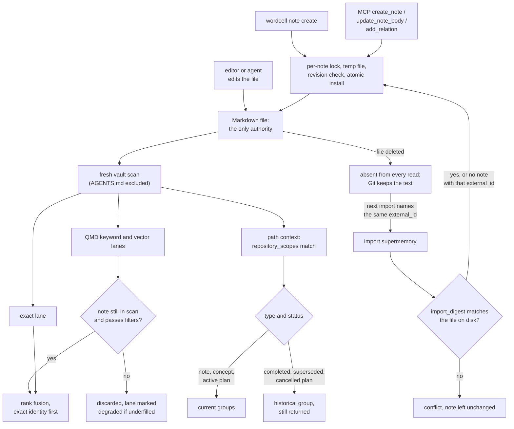

## 1. Executive Summary

Wordcell is a Markdown knowledge base used as durable memory for coding agents.
Notes, plans, captured sources and session notes are ordinary Markdown files
with YAML frontmatter, usually committed beside the code. A CLI, a TypeScript
SDK and a local stdio MCP server search them, follow their links, and return the
notes whose declared `repository_scopes` cover the file an agent is about to
change.

What is notable is how firmly the files stay the only authority. The QMD search
index, the Oh graph projection and the catalog are derived, and a semantic hit
whose note has left the live scan is dropped before ranking. Writes are atomic,
revision-checked and locked per note.

What is weak is correction. There is no delete verb, a re-import resurrects a
deleted imported note, and nothing on the read path withholds a superseded or
terminal-status record.

The system writes nothing on its own. The README says so in as many words —
*"Wordcell extracts no facts and writes no note on its own"* — and the code
agrees: every writer sits behind a CLI command, an MCP tool or the Supermemory
importer (section 7). Session memory is a convention the bundled Agent Skill
teaches the agent to follow, not a mechanism.

The product was named KB until release 0.20.0 (`docs/publishing.md:14`), and
the vault format still uses `kb` names.

One mark: `negative_eval`, on two filter cases in which a populated result set
loses particular notes after a positive control. Section 9 names the six
withheld.

## 2. Mental Model

A memory is a Markdown file. It becomes one when a person or an agent writes the
file: through `wordcell note create`, the MCP `create_note` tool, the importer,
or an editor. There is no candidate state, no extraction and no model call. It
stops being current in one of three ways, and only the first removes it from
retrieval.

**Deleting the file.** The next vault scan does not see it, and every derived
view follows. A QMD row for a deleted path is discarded at query time because
`notesByPath` no longer holds it (`src/sdk.ts:852-856`). Git retains the text.

**Rewriting the body.** `update_note_body` replaces everything after the
frontmatter at an exact revision. The old text survives only in Git.

**Marking it historical.** A `type: plan` note carries one of seven statuses.
`proposed`, `accepted`, `in-progress` and `blocked` put it in *Active plans*;
`completed`, `superseded` and `cancelled` put it in *Historical plans*
(`src/repository-memory.ts:23-39`, `:512-526`). Both groups are returned by path
context, and search ignores status unless the caller filters on it. A
`supersedes` relation between two notes is data a person can query; no reader
uses it to hide the older note.

The type field routes more than it classifies. `note` and `concept` are
*Maintained knowledge*, `market-research` with `status: snapshot` and an `as_of`
date is *Dated research*, and `report` needs a `generated` date. `session` and
`profile` notes are ignored by path context and found by listing
(`src/repository-memory.ts:512-564`).

**Rules and explanations are separated on purpose.** Inherited `AGENTS.md`
files hold rules that govern an edit, and the vault holds the rationale. The
scanner skips every `AGENTS.md` when it collects notes (`src/vault.ts:111`), and
`wordcell context` returns the guides and the notes side by side.
`docs/agent-memory.md` states the precedence: if a note and a guide disagree,
the guide controls the edit and the note needs repair.

## 3. Architecture

Wordcell is a Bun and TypeScript package with one CLI, `wordcell`, an SDK entry
point, and an MCP server started as `wordcell mcp --root kb` that speaks
JSON-RPC over stdio (`src/mcp-server.ts`). The vault is a directory of Markdown;
`index.md` is an optional front door and is not listed as a note.

Every read starts from a scan. `markdownFiles` walks the vault in sorted order,
skipping dot-directories, `node_modules`, `dist` and similar, and every
`AGENTS.md` (`src/vault.ts:56-64`, `:97-115`). A scan is capped at 10,000 notes,
16 MiB per note and 256 MiB per vault, and exceeding a cap is an error rather
than a truncation (`src/vault.ts:30-32`, `:307-312`). The MCP server caches one
scan and reopens it when a fingerprint over every file's inode, size and
nanosecond times changes (`src/mcp-tools.ts:413-475`).

Three derived stores sit outside the Markdown. QMD, a local search engine
pinned to a Hraness fork commit through a Git URL in `package.json`, keeps its
SQLite index at `~/.cache/hraness-kb/indexes/<sha256 of root>.sqlite`
(`src/semantic.ts:618-621`). Per-note lock files sit under
`~/.cache/hraness-kb/note-locks/` (`src/note-lock.ts:165-185`). Oh, the
embedded memory framework the same author publishes as a pinned release
tarball, backs `wordcell graph query`; only `wordcell graph rebuild` persists
its state, to `.wordcell/oh.sqlite` inside the vault, which Wordcell writes as
ignored and rebuildable (`src/graph-authority.ts:28`). Oh's own source was
not read for this report, because no note is stored in it.

Nothing runs in the background. Opening a semantic session runs QMD's update
over the vault, and embeds changed notes lazily on the first query that needs
vectors (`src/semantic.ts:2310-2400`).

### Deployment and ergonomics

Bun 1.3.14 and Git are required; the README's install path is a pinned GitHub
release tarball with `--ignore-scripts`. Exact search, listing, links and path
context need no model, no network and no API key. Hybrid and semantic modes
download a pinned EmbeddingGemma model on first use and then run locally. The
optional TypeSafe reranker sends query and snippets to a paid hosted provider.
The store is a folder of Markdown that opens in any editor or in Obsidian, and a
broken derived index is repaired by deleting it.

## 4. Essential Implementation Paths

**Create.** `createNoteProgram` (`src/authoring-program.ts:218-248`) takes the
per-note lock, recovers any interrupted earlier write, and returns an existing
compatible note unchanged; otherwise it renders frontmatter with a fresh
`document_id` and installs the file. The MCP `create_note` tool refuses an
existing ID outright and does not create directories (`src/mcp-tools.ts:903-962`).

**Update.** `updateNoteBodyProgram` (`src/authoring-program.ts:291-325`)
requires `expectedRevision`, a `sha256:` over the file's bytes, and fails on a
stale one even when the requested body already matches. Frontmatter bytes,
identity and relations are kept. Only the MCP tool and the SDK expose it;
`wordcell note` accepts `create` alone (`src/cli-program.ts:1909-1912`).

**Install.** `installBody` (`src/authoring-program.ts:40-179`) writes and fsyncs
a private temporary file, re-reads the target and fails with
`NoteRevisionConflictError` if it moved, renames the old file into a recovery
directory, re-checks the quarantined bytes, installs the new file without
clobbering, and removes the quarantine. `recoverInstall` restores the old file
if the install fails between those steps.

**Relations.** `editNoteRelationProgram` (`src/authoring-program.ts:250-284`)
adds or removes one typed outbound relation in the source note's frontmatter,
idempotently, and checks that a local target exists before adding.

**Search.** `KnowledgeBaseSession.search` in `src/sdk.ts` computes the allowed
set once through `queryVault` (`:803-807`), runs `searchExactVault`
(`src/search.ts:411-434`), runs QMD, discards each QMD hit whose path is not in
the scan or whose note is outside the allowed set (`src/sdk.ts:852-860`), and
fuses the lanes by weighted reciprocal rank with `k = 60`
(`src/search.ts:437-492`). Exact identity matches are then sorted ahead of
everything else (`src/sdk.ts:910-915`).

**Path context.** `buildRepositoryMemoryContext`
(`src/repository-memory.ts:825-951`) matches each record's deepest declared
scope against the target, inspects each matched scope on disk, drops a record
matched as an ancestor through a scope that is a file, reports invalid scopes and
records with missing required fields, and returns up to ten records per group.
A current record whose scope no longer exists raises an advisory; a terminal
plan does not.

**Import.** `importSupermemory` in `src/import-supermemory.ts` finds existing
imported notes by `imported_from: supermemory` and `external_id`
(`:1087-1095`), creates a note when none matches (`:1134-1157`), and compares a
stored `import_digest` with the file before updating (`:1165-1176`).

**MCP.** `createToolCatalog` (`src/mcp-tools.ts:1102-1124`) registers `search`,
`list_notes`, `get_note`, `backlinks` and `links`, adds `context` when the
server was started with `--repo`, and adds `create_note`, `update_note_body` and
`add_relation` unless `--read-only` removed them (`:1093-1100`).

## 5. Memory Data Model

| Field | Written by | Read by |
| --- | --- | --- |
| `document_id` | `createNote`, a generated stable identity | graph facts, portfolio identity |
| `title`, `type`, `tags` | `createNote`; hand edits | search scoring, filters, path-context grouping |
| `status` | hand edits; the importer copies a Supermemory document's status | path-context grouping for plans; caller filters |
| `repository_scopes` | hand edits only | path context; the `scope` filter on search and list |
| `as_of`, `generated`, `date` | hand edits | dated-research and report validation; sort |
| relations in frontmatter | `add_relation`, `relation add`, the importer | backlinks, links, graph queries |
| `imported_from`, `external_id`, `import_digest` | the importer | the importer's next run |

Frontmatter is open: any key is queryable through `where` and `has`, and no
schema is enforced beyond what path context needs. No CLI command or MCP tool
sets `repository_scopes` or `status`; the session-memory reference tells the
agent to edit the frontmatter by hand after `note create`
(`skills/wordcell/references/session-memory.md`).

**Scope is the vault.** A vault is one directory and every tool reads all of it.
`repository_scopes` names code paths, and a caller may pass them as an exact
filter to `search` and `list_notes` (`src/query.ts:600-609`) or let
`wordcell context` match ancestors. Portfolio federation opens several vaults
from a registry, each with its own index and history, and a command sees only
the vaults its selection names (`docs/portfolio.md`; `src/portfolio-registry.ts`).

**Time** is whatever the frontmatter says plus Git history. `wordcell history`
reads commits touching a note on request; nothing stores a validity interval.

## 6. Retrieval Mechanics

Exact search is substring scoring over normalised text. A title, alias, path or
ID equal to the whole query is an identity match scoring 900 to 1,000 points;
phrase matches add 100 to 400 by field and term matches 5 to 40. A note that
matches neither identity nor phrase needs at least half the terms, capped at
three (`src/search.ts:319-409`). Results are sorted identity first, then score.

Hybrid mode adds QMD's BM25 and vector lanes at equal weight. Each QMD candidate
is reconciled against the live scan and the metadata filters. When discards
leave fewer eligible results than requested, the lane is marked `degraded` and
the whole result `partial`, with a message naming the window size
(`src/sdk.ts:862-891`). That turns an underfilled filtered search into a visible
state rather than a short list. Results are capped at 100 and each QMD lane
requests at most 500 candidates (`src/sdk.ts:102-104`).

**Path context is the retrieval route the design argues for.** `wordcell context
packages/parser/src/index.ts --root kb --repo .` returns inherited `AGENTS.md`
guides, the `scopes/` hub notes for that path, and scoped records grouped as
maintained knowledge, active plans, dated research, reports and historical
plans. Ordering within a group is deepest scope, newest date, then plan-status
order (`src/repository-memory.ts:675-683`). It needs no index and no model.

Over-recall is the likely failure. Terminal plans and every imported version of
a Supermemory memory are ordinary notes to search, and the design relies on a
reader seeing `status` or a `supersedes` edge in the result. A note that exceeds
the 64 KiB tool-result budget is omitted from an MCP result and counted in
`omitted` (`src/mcp-tools.ts:48`).

## 7. Write Mechanics

Every write is explicit and synchronous. No model is called and nothing is
extracted, merged or summarised. A created or updated note is visible to the
next read at once: the MCP server invalidates its cached session after every
write (`src/mcp-tools.ts:895-901`), and other processes see the new fingerprint.
The QMD index catches up when the next semantic session opens.

**Concurrency is handled more carefully than anywhere else in the tree.** A lock
per note in the user cache, with a heartbeat and a five-minute stale reclaim
(`src/note-lock.ts:15-21`), serialises writers on one machine. The revision
check catches a writer that bypassed the lock, such as an editor, and the
quarantine step means an interrupted replace either completes or restores the
prior bytes. A hand edit, which the skill asks the agent to make for
frontmatter, takes no lock and is caught only by the next revision check.

**Delete is outside the tool surface.** No command or tool deletes a note or
sets a deleted state; the migration guide maps Supermemory's forget to
*"Delete the note (Git keeps its history) or mark it superseded"*
(`docs/migration-from-supermemory.md:53`).

**The importer protects edits and not deletions.** A note whose body or owned
fields changed since the last import is a `conflict` and left alone. A note that
was deleted is not in the existing set, so the next import of the same export
re-creates it as `created` (`src/import-supermemory.ts:1134-1157`). Forgotten
Supermemory entries are skipped at every import (`:1081-1082`), which is a
record keyed on Supermemory's flag, not on anything the vault holds. This was
read, not reproduced.

A removed `supersedes` relation stays removed on rerun for a narrower reason:
the importer plans a relation only when this run creates or updates one of its
notes (`src/import-supermemory.ts:1197-1201`). The committed case covers exactly
that (`src/import-supermemory.test.ts:1201-1227`). If the source memory changes
upstream, the relation is planned again.

### Operational cost

- Write: synchronous, one file install with two to four directory fsyncs, no
  model call.
- Background: none. QMD's update and lazy embedding run when a semantic session
  opens, over changed notes.
- Read: each MCP call walks and stats every Markdown file to compute the
  fingerprint, and rescans in full when anything changed. Results are bounded by
  count and by a 64 KiB envelope. Path context is bounded at ten records per
  group by default.

## 8. Agent Integration

The MCP server is the agent's direct surface. Read tools carry closed-world
read-only annotations; the three write tools are listed unless `--read-only` is
passed. The server instructions tell the model to search before `create_note`
and to pass `get_note`'s revision to `update_note_body`
(`src/mcp-tools.ts:1131-1141`).

The Agent Skill under `skills/wordcell/` is the rest of the integration. It is
instructions, not a service: it routes query, plan, save-URL, save-PDF,
percolate and session-memory requests to CLI commands. The session-memory
reference has the agent write one dated `type: session` note per working
session, link it to the notes it changed, and maintain one `type: profile` note
with Stable and Recent sections. Recall requests read the profile and the five
latest session notes first.

There is no automatic injection and no hook. An agent recovers context by
calling `context` or `search`, or because an `AGENTS.md` tells it to. Adapting
the MCP server to another host needs only a stdio MCP client.

## 9. Reliability, Safety, and Trust

**Provenance is the file and Git.** A note records no author or writer channel;
`wordcell history` reports the commits behind it when the vault is committed.
Captured sources keep a `capture.json` receipt, which is provenance for the
source, not for the note that cites it.

**The agent's writes are unreviewed.** An agent holding the MCP server can
create any note under any existing directory with any `type`, and add any typed
relation. It cannot set `status` or `repository_scopes` through a tool, but the
skill has it edit frontmatter directly.

**Untrusted-content framing is applied on one path.** `packUntrustedSearchContext`
wraps SDK search output in an envelope that tells the model not to follow
instructions inside it (`src/untrusted-content.ts:3-8`; `src/sdk.ts:1752`). The
MCP tools return note text as plain structured content through `toolSuccess`
(`src/mcp-tools.ts:87-89`), and a captured web page is a note like any other.

**Data loss is well guarded on the write path.** The revision check, the lock
and the quarantine-and-restore install make a lost update or a half-written
note unlikely. Deletion is by `rm`, reversible through Git when the vault is
committed and not otherwise.

**Uncertainty is representable only as prose or an unread field.**

Capability marks:

- `negative_eval` — awarded; evidence in section 10.
- `tombstone` — deletion is `rm`, and a re-import re-creates a deleted imported
  note. The importer's forgotten-entry skip is keyed on the export's
  `isForgotten` flag, and its kept-removed relation holds only while neither
  note changes.
- `trust_state` — plan status is a discrete field with terminal values, and it
  groups path context without excluding anything: *Historical plans* are
  returned beside current ones. Search reads status only when the caller
  filters on it.
- `bitemporal` — `as_of` and `generated` date a snapshot or report; no field
  separates when a claim held from when it was recorded.
- `scope_enforced` — the boundary is the vault directory, a physical partition.
  `repository_scopes` is a code-path association the caller may filter on, and
  omitting it returns every note.
- `audit_log` — no mutation record exists in the store; Git history is the
  only log, and only when the vault is committed.
- `human_review` — `percolate` proposes links and writes nothing, and the agent
  holds `add_relation` itself. No write waits on anyone.

## 10. Tests, Evals, and Benchmarks

Nothing was installed, built or run for this report; everything below is from
reading the tests and committed artifacts at the pin. CI runs `bun test ./src
./scripts` through `check:fast` on pull requests and pushes to `main` (`.github/workflows/ci.yml:54`;
`package.json:487`, `:492`).

**The negative cases.** `overfetches selective QMD searches and exposes an
exhausted candidate window` (`src/sdk.test.ts:1182-1366`) writes 101 notes, 100
of them `status: archived`, behind a fake QMD session that ranks every archived
note above the active one. With `status=active` the result is exactly
`notes/filter-100` (`:1268-1277`). The same test's `exhausted` and
`staleRawWindow` cases assert empty results with `partial: true`; on their own
they would pass against a retriever returning nothing, and the `recovered` case
is what makes them informative. `filters repository scopes exactly and
case-sensitively` (`src/query.test.ts:169-179`) returns `notes/alpha.md` for
`packages/kb` and an empty list for `packages/kb/src`.

**Writes.** `src/authoring-body.test.ts` asserts that a stale revision conflicts
even when the requested body matches (`:86`). `src/note-lock.test.ts` covers a
live owner, stale reclaim and release. `src/mcp-tools.test.ts:507` asserts that
`add_relation` with a stale revision leaves the source unchanged.

**Import.** Sixty-eight cases in `src/import-supermemory.test.ts` cover digests,
conflicts, races, symlinked parents and relation cycles. None deletes an
imported note and imports again.

**Retrieval quality.** `docs/evaluations/wordcell-passages-20260927/` commits
sixteen sealed cases, twelve positive and four `near-miss-negative` questions
with no answer in the vault, with the local results. The README reports 6 of 8
held-out answers contained in a selected passage against 1 of 8 for plain
snippets. `docs/agent-memory.md` reports an 18-question pilot on 2 August 2026
in which hybrid and exact search tied on `Recall@10` at 0.833333; both
retrievers answered the no-answer question rather than abstaining. The
LongMemEval figures on the README measure Oh's own retrieval, and the README
says so.

**Not covered.** No case asserts that a deleted, superseded or terminal-status
note stays out of a default search or context result. No paper exists; the
arXiv links in the tree are citations inside Oh's LongMemEval artifact.

## 11. For Your Own Build

### Steal

- **Keep one authority and reconcile every derived hit against it.** Dropping
  a vector hit whose file is gone, rather than trusting the index, makes a stale
  index a performance problem instead of a correctness one.
- **Report an underfilled filtered window as partial.** A filter applied after
  a bounded candidate window can silently return too little; say so in the
  result.
- **Route memory from the path being edited.** A record that declares the code
  paths it explains can be found without an embedding, and its group says
  whether it is current.
- **Make writes revision-checked and quarantine the old bytes.** An interrupted
  replace that restores itself is cheap in a file store and rare in the corpus.
- **Separate rules from rationale.** Mandatory rules in scoped `AGENTS.md`,
  explanations in notes, and a stated precedence when they disagree.

### Avoid

- **An importer that protects edits and not deletions.** A digest per imported
  note catches a local edit; a deleted note needs a record of the external ID
  it came from, or the next import undoes the user's decision.
- **A lifecycle field that only groups.** Returning terminal plans in their own
  group is honest; returning superseded imported versions to search at full rank
  is how a corrected fact comes back.
- **Framing untrusted content on one surface.** If the SDK needs an envelope for
  captured web text, so does the MCP result the agent actually reads.

### Fit

This suits a developer or a small team who already treat decisions and plans as
documents in the repository and want an agent to find them by path or by words
without running a service. The maintenance cost is the discipline of writing
and pruning notes by hand, because nothing curates them. Anyone who wants memory
captured from conversations, corrected by the system, or kept apart by user or
tenant should not adopt it; Wordcell treats all three as out of scope and says
so.

## 12. Open Questions

- Does Oh's graph query path read anything the Markdown does not hold, such as
  a stale `.wordcell/oh.sqlite` after a note is deleted? Oh was not read.
- How does QMD's lazy embedding behave on a large vault on first use? The
  2 August 2026 pilot records a 41-second semantic p95 that includes the first
  model load, over nine queries.
- Is a deletion-aware import planned, for example keyed on `external_id` in a
  vault-level ignore list?
- How often do agents following the skill actually set `repository_scopes` and
  `status` by hand, given that no tool writes them?

## Appendix: File Index

- **Storage and scan:** `src/vault.ts`, `src/note-lock.ts`,
  `src/authoring-model.ts`, `src/authoring-platform.ts`.
- **Write path:** `src/authoring.ts`, `src/authoring-program.ts`,
  `src/authoring-import.ts`, `src/import-supermemory.ts`.
- **Retrieval:** `src/search.ts`, `src/query.ts`, `src/sdk.ts`,
  `src/semantic.ts`, `src/semantic-runtime.ts`.
- **Context assembly:** `src/repository-memory.ts`, `src/agent-context.ts`,
  `src/cli-program.ts:3960-4040`.
- **Graph projection:** `src/graph-authority.ts`, `src/oh/`.
- **MCP and CLI:** `src/mcp-tools.ts`, `src/mcp-server.ts`,
  `src/cli-program.ts`, `skills/wordcell/`.
- **Safety:** `src/untrusted-content.ts`.
- **Tests and evals:** `src/sdk.test.ts`, `src/query.test.ts`,
  `src/mcp-tools.test.ts`, `src/authoring-body.test.ts`,
  `src/import-supermemory.test.ts`, `src/repository-memory.test.ts`,
  `docs/evaluations/`.

### Recorded searches

Checked against the checkout at the pinned revision.

- `rg -n '"delete"|"remove"|"rm"|deleteNote|removeNote\b' src -g '!*.test.ts'` — only relation removal and a SQLite journal mode; no note-delete verb.
- `rg -n 'createNote\(|addNoteRelation\(|updateNoteBody\(|removeNoteRelation\(|updateNoteBodyProgram\(|createNoteProgram\(' src -g '!*.test.ts'` — callers in `mcp-tools.ts`, `cli-program.ts`, `import-supermemory.ts` and the authoring wrappers; no background writer.
- `rg -n 'writeFile|rename\(|createNote|addNoteRelation|installNote|unlink|mkdir' src/percolate.ts src/graph-percolation.ts src/search.ts src/query.ts src/repository-memory.ts src/agent-context.ts` — no write in any read or suggestion path.
- `rg -n 'supersede|superseded|is_latest|isLatest' src -g '!*.test.ts'` — help text, the plan-status list and the importer; no read path filters on it.
- `rg -n -i 'supersed' src/search.ts src/query.ts src/sdk.ts src/mcp-tools.ts` — no match.
- `rg -n 'historicalPlans|terminalRecords|isTerminalPlanStatus' src -g '!*.test.ts'` — grouping and counts in `repository-memory.ts` and a label in `cli-program.ts`; no exclusion.
- `rg -n 'createUntrustedToolResult|UNTRUSTED_CONTENT_NOTICE|untrusted' src -g '!*.test.ts' -g '!untrusted-content.ts'` — `sdk.ts` and evaluation code only; not `mcp-tools.ts`.
- `rg -n 'appendFile|createWriteStream' src -g '!*.test.ts' -g '!src/clip/**'` — no match.
- `rg -n '\brm\(|unlink\(|rmSync|unlinkSync' src/import-supermemory.test.ts` — temporary-directory cleanup and one symlink swap; no deleted-note re-import case.
- `grep -rliE 'arxiv|bibtex|@article|@misc|doi\.org' . --exclude-dir=.git --exclude-dir=node_modules` — `STYLE.md`, Oh's LongMemEval artifact, a site claims file and metadata-tool tests; no paper of this project's own, and no `CITATION.cff`.

## History

**2026-09-30** — [`818e6abc7ac2415b7b3f670ae28b67114d03e046`](https://github.com/hraness/wordcell/commit/818e6abc7ac2415b7b3f670ae28b67114d03e046) — first reading, at the head of `main`, a commit dated 29 September 2026. One mark, `negative_eval`. Screened before reading: no auto-run surfaces and no build-time execution points; five dependency files inside the cooldown, every file in a depth-1 clone dating to the tip; four unpinned surfaces, of which the root `package.json` is listed as having no lockfile although `bun.lock` is committed beside it; `AGENTS.md` and `CLAUDE.md` recorded as data. Read with `rg` and `sed`; nothing installed, built or run. Oh and QMD, the pinned engines behind the graph and semantic lanes, were not read.
