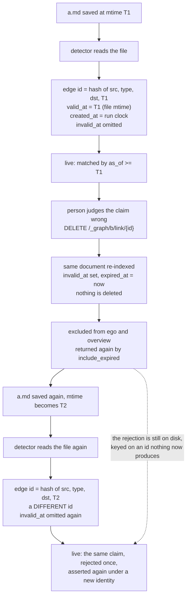

## 1. Executive Summary

XERJ is a local search engine in Rust, shipped as one static binary with an
Elasticsearch-compatible HTTP surface, and agent memory is one API on it:
`/_memory/{namespace}`, five endpoints over a reserved index per namespace. What
it buys is a real engine's recall with no refresh lag, and a tenant boundary
tested through every door that reaches the backing index. What it gets wrong is
in the graph layer above: an edge's identity hashes the source file's mtime, and
invalidation is keyed on that identity, so saving the file again re-teaches a
claim a person rejected.

The memory API is a 2,306-line adapter that does not re-implement search. A
namespace is a reserved index (`.xerj-memory-{ns}`), so store and recall reuse the
same BM25, `dense_vector` and metadata-filter paths the rest of the engine
serves. Recall has four modes — an explicit caller vector, server-side
`semantic` embedding, plain BM25, and `hybrid: true` fusing the last two by
reciprocal rank — and all four run offline, because the built-in embedder is
lexical feature hashing rather than a model. A write is visible immediately:
`IndexDocParams.refresh` is documented as "accepted without error; memtable is
always visible".

Edges between memories carry a bitemporal record — `valid_at`, `invalid_at` and
`created_at` as three separate fields, with the first two independently settable
by the caller. Edge identity is `xxh3_128(src, type, dst, valid_at)`, and
`valid_at` for a detector-taught edge is the source file's mtime. Invalidation
is `DELETE /_graph/{brain}/link/{edge_id}`. Save the file again and the mtime
changes, the hash changes, and the same `(src, type, dst)` claim is re-taught
under an id the invalidation never covered. The record of the rejection
survives; what it rejected comes back beside it.

Three marks. `bitemporal` is earned on two clocks filled from different sources
rather than from one `now`. `negative_eval` is earned on a suite that seeds a
second tenant's edge through the public API and walks every door to it, with a
separate positive control. `audit_log` is earned on a hash-chained log that
states its own coverage boundaries, and it records a memory write against the
`/_memory` endpoint rather than the namespace.

`scope_enforced` is withheld. The namespace is the index name, not a key on the
document, and the boundary is that partition plus an index-name authorizer —
real, tested, and the shape the mark excludes. `tombstone`, `trust_state` and
`human_review` are withheld as well; section 9 gives each reason.

## 2. Mental Model

A memory is a document in an index named after its namespace. There is no
extraction step, no consolidation pass, and no model in the write path: what the
agent sends is what is stored, plus a `stored_at` timestamp. The only write-time
judgement available is `dedup: true`, which probes for the single nearest
existing memory and skips the write when its cosine score meets a threshold
defaulting to 0.95 — returning `{created: false, deduplicated: true}` with the
existing id.

The epistemic machinery is not on the memories. It is on the *edges between
them*. An edge asserts that one node relates to another, from some instant
onward, as judged by some detector, with evidence attached. It can later be
judged to have stopped being true — soft-invalidated, never deleted, so a reader
can still ask what the graph believed last Tuesday.

Two clocks carry that. `valid_at` is when the fact became true; `created_at` is
when the system recorded it. For an edge a detector taught, those come from
different places: `valid_at` is the source file's mtime and `created_at` is the
indexing run's wall clock. The autoindex module says so where it builds the
document — `created_at_ms` is "the one non-deterministic field and never
participates in `edge_id`". Invalidation adds the mirror pair: `invalid_at` is
when the fact stopped being true, caller-settable; `expired_at` is always server
now.

The gap is that identity is derived from one of those clocks and invalidation is
keyed on identity. An edge is `xxh3_128(src, type, dst, valid_at)`. Unlinking
stamps `invalid_at` on that id. Re-detecting the same relationship from a file
whose mtime has moved computes a different id, and the new edge is written with
`invalid_at` omitted — which, by the module's own stated discipline, is the
signal for "still valid".



## 3. Architecture

One static binary, no JVM, no second datastore. `xerj --data-dir ./data` starts
a node; the memory API needs nothing else running. The seventeen crates split
the engine (`xerj-engine`, `xerj-storage`, `xerj-fts`, `xerj-vector`,
`xerj-query`) from the surfaces over it (`xerj-api`, `xerj-mcp`,
`xerj-console-api`, `xerj-server`), and agent memory lives in `xerj-api`:
`memory_api.rs`, `graph_api.rs`, `authz.rs` and `audit_mw.rs`.

What an operator stands up is therefore a search node, with a search node's
costs and operational surface. A namespace costs one index. The audit log is one
bounded file in the data directory. Embedding is in-process and offline by
default — the built-in embedder is lexical feature hashing, and the neural one
is opt-in and downloads roughly 90 MB — so recall has no external dependency and
no per-call cost to anything outside the box.

Authorization is two layers. `auth_middleware` resolves an API key to a
`Principal`; `authz_middleware` classifies the request path into a target and
checks the privilege. A `Principal::Scoped` carries role descriptors naming
index patterns. Because a namespace is an ordinary index with a leading `.`, the
memory data is reachable through the generic ES-compat surface and the native
router as well as through `/_memory`, and the authorization layer covers all of
them — which is what the test described in section 10 walks.

Open mode is the other posture. With `--insecure`, or with no admin key
configured, every caller resolves to a superuser and reaches every namespace; the
project's own table says so (`docs/SECOND_BRAIN.md:537`). The README states
that a fresh node binds `127.0.0.1` only and that a cleartext bind on another
interface refuses to start unless explicitly allowed.

The console is a separate application merged onto the engine routers *after*
their layers are applied, so `authz_middleware` never runs on
`/_xerj-console/*`. Its generic data-sources proxy refuses the reserved
namespace itself, returning the same `404` it gives `.xerj_*` system indices so
existence does not leak.

A second console path reads brains. `graph.rs` serves `ego`, `overview` and
brain-pinned edges and nodes searches to a session whose console role is `owner`
or `admin`, reading the engine in-process (`xerj-console-api/src/graph.rs:1-66`,
`:166-168`). The gate is the role, not an index grant. A brain's default nodes
index is `.xerj-memory-{brain}`, that namespace's memories (`:122-124`), so the
operator tier reads every brain's memories through it. `link` and `unlink` have
no console route.

Share links are the third caller type. `xerj share` hands one indexed corpus to
a guest, who claims a scoped, read-only, expiring key with a passcode. A guest
key passes a route allow-list before the index decision: `/_memory/*`, the
cluster surface, the native router and the brain's write half are refused
outright (`authz.rs:1441-1480`), and a share cannot name a reserved-namespace
index (`share.rs:588`).

## 4. Essential Implementation Paths

- **Store** — `memory_api::store` (`:338`): validate the namespace, authorize
  `WriteIndex`, reject an entry with neither `text` nor `vector`, create the
  backing index lazily with a `dense_vector` sized to the supplied embedding,
  run the dedup probe when asked, then `es_compat::index_doc` with
  `{text, stored_at, metadata?, vector?}`.
- **Recall** — `memory_api::recall` (`:530`): authorize `ReadIndex`; reject a
  body that is not exactly one of `vector` or `query`; resolve the fusion
  strategy; over-fetch when recency blending or graph blending is on; authorize
  the *edges* index separately when `graph` is present; fold a graph `restrict`
  expansion into the filter as an `ids` clause; then `es_compat::search`.
- **Namespace validation** — `validate_namespace` (`:109`): lowercase, digits,
  `_`, `-` and `.` only, no `..`, 200 characters, and a refusal of any namespace
  ending `-edges`, because brain `B` keeps its edges in `.xerj-memory-{B}-edges`
  and a namespace called `kb-edges` would write memories into another brain's
  edge index.
- **Edge assertion** — `graph_api::link` (`:442`): validate, authorize, reject
  self-edges, clamp `weight` and `confidence` to `[0, 1]`, parse `valid_at` and
  `created_at` independently, derive the id, write with `invalid_at`/`expired_at`
  omitted.
- **Edge invalidation** — `graph_api::unlink` (`:603`): authorize before the
  existence probe so an unauthorized caller cannot tell "not yours" from "not
  there", read the document, refuse a second invalidation by reporting
  `already_invalid_at`, re-index the same id with the pair added.
- **Node hydration** — `graph_api::authorize_nodes_index` (`:289`): a brain's
  `nodes_index` may be a comma-joined list of dataset indices, and each name is
  authorized on its own; one ungranted name refuses the request.
- **Audit** — `audit_mw::audit_middleware` (`:420`): classify the request,
  resolve the subject before the handler for a write and only on a 403 for a
  read, append op, subject, resource, outcome and note.

## 5. Memory Data Model

A memory document is small and flat:

```json
{ "text": "...", "stored_at": 1757790000000, "metadata": {...}, "vector": [...] }
```

`text` is mapped as `semantic_text`, so the engine auto-embeds it at ingest into
a companion vector and server-side `semantic` recall works without the caller
embedding anything. `metadata` is deliberately *not* explicitly mapped, so
arbitrary agent-supplied keys are accepted. There is one timestamp. There is no
namespace field on the document — the namespace is the index name — and no
status, source, or confidence field of any kind.

An edge document is where the modelling effort went:

```json
{ "edge_id": "...", "src": "...", "dst": "...", "type": "mentions",
  "weight": 1.0, "confidence": 0.95, "detector": "wikilink@1",
  "valid_at": 1753600000000, "created_at": 1757790000000,
  "schema_version": 1, "src_file": "alpha.md",
  "evidence": { "quote": "...", "source": "alpha.md", "offset": 0 } }
```

Three discipline decisions carry over to any edge store. `invalid_at`,
`expired_at` and `src_file` are *omitted* rather than set to null when unset,
because omission lands the row in the doc-values null bitmap, and that bitmap is
the "still valid" signal the hop reads. Scalars are plain strings and numbers
rather than nested objects, so the prefilter rides doc values. And
`schema_version` is on every row.

`confidence` is validated, clamped, stored, and copied into two ego responses —
the data plane's and the console's (`graph.rs:630`). No query filters on it, no
ranking consults it, and no threshold compares against it; the ranking uses
`weight`. It is a number the system records and never acts on.

## 6. Retrieval Mechanics

`_recall` rejects unknown keys with a 400 under `deny_unknown_fields`, and the
comment says why: a typo'd key used to be silently ignored, degrading the request
to a match-all that returned arbitrary memories at score 1.0. The same reasoning
produced the hard 400 on a body with both `vector` and `query`, or neither.
For a store an agent is meant to trust, turning a malformed recall into a
refusal rather than into plausible noise is the correct trade.

Four single modes, tried in order: an explicit `vector` runs kNN; `semantic:
true` embeds `query` server-side with the same embedder used at store time;
plain `query` runs BM25; and `hybrid: true` runs the BM25 and semantic legs over
the same `query` and fuses them through the engine's `hybrid` query type,
reciprocal rank by default or `fusion: "linear"` on request. `fusion:
"learned"` is a 400 rather than a silent substitution of RRF, "because
substituting RRF would misrepresent the ranking asked for".

`filter` is a standard ES clause applied as a `bool` filter, so it narrows
without scoring. `recency_weight` blends `(1 - w) * norm_score + w *
norm_recency` with both terms min-max normalised across the candidate set, and
over-fetches `max(k * 4, 50)` candidates first — because a re-rank can only
promote what was fetched.

Graph coupling has two modes. `restrict` expands the seeds first and folds the
reachable id set into the filter as an `ids` clause, capped at 10,000 so the
prefilter stays bounded; recall runs unchanged over a graph-bounded universe.
`blend` lets graph proximity pull related memories up, over the same widened
candidate pool.

Hops are capped at 1 or 2, and a 3-hop request returns a 400 carrying a fixed
sentence about not being a graph database. A missing edges index is not an
error — recall proceeds ungated and flags it in-band, so an agent can opt into
graph recall before its first link exists.

## 7. Write Mechanics

Writes are synchronous and singular. One `POST` stores one memory; there is no
batching endpoint on the memory API, no queue, and no background consolidation
pass that rewrites stored memories. The agent blocks for the duration of one
index call.

The lag before a memory is retrievable is zero, which is unusual for an
ES-compatible surface and is stated in the parameter's own documentation:
`refresh=true|wait_for` is "accepted without error; memtable is always visible".
A memory stored in one turn is recallable in the next with no refresh call.

`dedup` is opt-in and best-effort by construction. Any probe error — an empty
index, a schema mismatch — is treated as "no duplicate", so dedup never blocks a
legitimate write. It is off by default so existing callers keep storing every
entry.

The background writer is the autoindex daemon, and it writes edges rather than
memories. Nine deterministic detectors run with no model in the path; the ninth,
`emailthread`, reads an email's `In-Reply-To` and attachments off the parsed
record. Every one of them sets `valid_at` to the source file's mtime, so the
same corpus produces a byte-identical edge set on every run given unchanged
mtimes.

The reconcile pass soft-invalidates edges taught by files that left the corpus
and edges pointing at a superseded anchor, and a `#868` assertion pins that an
unchanged file's own edges are left alone. Before a changed file's edges are
rewritten, `invalidate_prior_edges` soft-invalidates the live ones it taught
(`detect/mod.rs:906`); `invalidate_edges_except` does the same for carried-over
email-thread edges whose parent moved (`:847`). `--watch` is refused on the
graph path and requires `--no-graph` (`cli.rs:1106-1121`).

## 8. Agent Integration

`xerj init` wires the node into Claude Code or Cursor in one command. The MCP
server exposes eleven tools, six of them memory-shaped: `xerj_memory_store`,
`xerj_memory_recall`, `xerj_brain_ego`, `xerj_brain_link`, `xerj_brain_unlink`
and `xerj_brain_overview`. Four are search tools, and `xerj_code_search` serves
the reference-coding loop.

The namespace is a model-supplied argument on both memory tools, so the
credential the MCP server holds decides what that argument can reach.
`resolve_auth` takes `--auth`, then `XERJ_AUTH`, and on a loopback URL with
neither set falls back to the node's own admin key
(`xerj-mcp/src/lib.rs:184-206`). `xerj init` writes only `XERJ_URL` into the
MCP entry (`xerj-autoindex/src/init.rs:108`), so the one-command setup runs the
MCP server as a superuser. A model that names another
agent's namespace then gets its memories.

Confinement needs `XERJ_AUTH` set by hand to a key minted with
`role_descriptors` naming `.xerj-memory-{ns}`. With that key a foreign namespace
is a 403, because the check is on the credential rather than in the arguments.

The second detail is `xerj_brain_link`'s schema, which exposes `valid_at` to the
model with the description "When the fact became true: epoch-ms number or
RFC3339 string (default now). Part of the deterministic edge_id." It does not
expose `created_at`; `build_brain_link` forwards exactly `evidence`, `weight`,
`confidence` and `valid_at`. Through MCP the agent chooses when a fact became
true and the server keeps when it was recorded — the division the bitemporal
mark asks for, achieved by leaving one field out of a tool schema.

## 9. Reliability, Safety, and Trust

**Scope — withheld: a partition with an authorizer, and no key on the row.** A
namespace is its own index and a memory document carries no namespace field, so
nothing on the row can be filtered. What the system has instead is a check on
which partitions a credential may open. All five `/_memory` handlers call
`authorize_memory_namespace`, which authorizes the credential against the index
name `.xerj-memory-{ns}` (`authz.rs:271-277`; `memory_api.rs:349`, `:541`,
`:1271`, `:1358`, `:1402`).

A wildcard read is expanded over the principal's visible indices rather than
refused (`authz.rs:366`), and the module records why refusal was rejected — it
"cost every legitimate `logs-*` grant". That is an authorizer choosing
partitions. It is a real boundary and it is tested through every door (section
10); it is not a scope key applied as a read predicate.

The authorizer reaches every namespace in four configurations. Open mode —
`--insecure`, or no admin key — makes every caller a superuser. The admin key
does, and it is what the default MCP setup holds (section 8). A scoped key
minted with `names: ["*"]` does, by design (`docs/SECOND_BRAIN.md:613-617`). And
a console session in the `owner` or `admin` role reads every brain, including
its default `.xerj-memory-{brain}` nodes index, through `graph.rs`.

**A stale module doc.** `memory_api.rs`'s "Authorization model" header says there
is "**no per-namespace authorization**" and points at "the deferred RBAC
enforcement". The five handlers authorize, and the security-boundary suite
asserts the denials with a minted non-admin key. The project's own
`docs/SECOND_BRAIN.md:619-623` calls the comment stale, citing
`memory_api.rs:318` and `:490`; the authorize calls sit at `:349` and `:541`.

**Audit — earned, with the ring stated.** Hash-chained, restart-surviving,
`GET /_audit/_search` and `/_audit/_verify`. Reading the audit log gets its own
op tag rather than the generic `search`: "a refused attempt to read the evidence
is the denied read an auditor most wants to find". The module doc states its
coverage: successful reads other than `_search` leave nothing, unauthenticated
attempts are not recorded, and nothing older than 4,096 entries survives.

The share and API-key routes write their own entries, and `audit_mw` records a
request on them only when `authz_middleware` stamped `RefusedBeforeHandler` on
the response (`audit_mw.rs:448-455`). A guest's attempt to mint a key or open a
share leaves an entry that way.

A memory write is recorded by endpoint, not by namespace. `classify` takes the
first `_`-prefixed segment as the op and `segs[0]` as the resource, so
`POST /_memory/{ns}` becomes `memory.post` on `_memory`, and a forget or a
namespace drop becomes `memory.delete` on `_memory` (`audit_mw.rs:164-253`).
`es_compat::index_doc` appends nothing, so no second entry names the index. An
auditor learns who changed memory and when, and not which namespace.

A recall goes the same way. `_recall` is absent from `is_read_shaped`
(`audit_mw.rs:119`), so it takes a `memory.post` entry on `_memory`; the entry
with the index name comes from `es_compat::search`, which appends
`op: "search"` against `.xerj-memory-{ns}`. The first entry spends a ring slot
recording a read as a write.

**Tombstone — withheld, and this is the report's main finding.** The mark asks
for a durable record of a rejected value, *keyed on the value*, so later
extraction cannot re-assert it. `unlink` is keyed on the edge id, and the edge id
is `xxh3_128(src, type, dst, valid_at)` where `valid_at` for a detector-taught
edge is the source file's mtime. Save the file and the id changes.

The invalidated row stays on disk, correct and queryable through `as_of`,
describing an identity nothing will compute again, while the same `(src, type,
dst)` claim is re-taught live beside it. A full re-detection has the same effect
by a second route: `detect::assemble` builds each document with `invalid_at`
omitted and writes it with a bulk `index` action, a full replace of whatever sat
under that id. No test in the tree covers a manually unlinked edge surviving a
re-index; the search is in the appendix.

The reconcile sweep is a separate mechanism and it is sound. Edges taught by a
departed file, and edges pointing at a superseded anchor, *are* invalidated on a
fresh run, with a test carrying an explicit fail-before note. The gap is
specifically between a human judgement about a claim and an identity derived
from a file's timestamp.

**Trust state — withheld.** `confidence` is a float, and a score is not a state;
it is read by nothing, so it does not even rank. A tree-wide search for a
discrete status returns a console user account's `Pending`, thread-pool
counters and test fixtures, and nothing on a memory or an edge.

**Human review — withheld.** There is no approval surface. A search for
`approve`, `adjudicat` and `curat` across the console source returns nothing.
The console reads brains through `graph.rs` and has no route that writes or
admits a memory or an edge.

**Risks, in one place.**

- **A rejected claim returns under a new identity.** Saving the source file
  re-teaches the edge with a new `edge_id`, and the `invalid_at` stamped on the
  old one does not apply to it.
- **A re-detection overwrites an invalidation outright.** `detect::assemble`
  emits a full document with `invalid_at` omitted, written with a bulk `index`
  action. The `must_not exists invalid_at` query in the autoindex is a counting
  query for the CLI summary, not a guard on the write path.
- **The default agent setup holds the admin key.** On a loopback node the MCP
  server falls back to it, and the namespace argument the model supplies is then
  the only scope.
- **The audit ring is shared and small.** 4,096 entries for the whole node, with
  every recall taking one, and a memory write's entry does not name its
  namespace.
- **No `fsync` per audit entry.** The log survives a process restart including
  `kill -9`, and a machine power loss can take the unflushed tail.
  `sync_to_disk` exists for callers that want the barrier, and the API-key
  operations use it.
- **Memory deletion is hard deletion.** `forget_one` deletes the document.
  Unlike the edges, there is no soft-delete and no `as_of` for memories — the
  bitemporal care stops at the graph layer.

## 10. Tests, Evals, and Benchmarks

`brain_is_a_security_boundary.rs` is 692 lines and is the artifact to read. Its
header explains that it is "the inverted descendant of
`brain_is_not_a_security_boundary.rs`, which pinned the measured fact that one
did *not* exist" — a committed test that asserted the system's own absence of a
boundary, later rewritten assertion by assertion into its opposite. The
predecessor is not in the tree at this commit.

Its reasoning about scope transfers: "the exposure was never about the four
`/_graph/*` handlers", because the edges live in an ordinary index that
`IndexName::validate` admits, reachable through the ES-compat surface and the
native router. "An access check on `/_graph/*` alone would have left all of that
open — a boundary that only looks like one. So this test walks every door, and a
fix that closes only some of them fails here." The doors include the
percent-encoded spelling `/%2Exerj-memory-bob-edges/_search`, "in case the check
compared raw path text".

It is not vacuous, and the guard is structural. `seed_two_brains` writes a real
edge into each of two brains through `POST /_graph/{brain}/link` and refreshes
bob's backing index, so the row is searchable before anything asserts it cannot
be seen. `a_scoped_caller_retains_full_use_of_its_own_brain` is a dedicated
positive control asserting alice's own edge comes back.
`cat_indices_keeps_the_rows_it_should`, in `scoped_keys_get_intact_responses.rs`,
asserts both halves at once: the caller's own index is present, *and* exactly
one row was returned.

One limit. The four wildcard assertions in section 2b are of the form
`!resp.to_string().contains("bob")` with the status asserted 200, and no
assertion in that loop that the expansion returned any of alice's own rows. An
expansion that returned nothing would satisfy them. The positive control for
that pruning path exists on `_cat/indices` rather than on `_search`.

The console has two suites. `console_cannot_read_a_brain.rs` seeds
`alice-private-fact-9f83c1` into `.xerj-memory-alice` and asserts, with an owner
session, that the data-sources proxy returns it in no response body.
`console_graph_read.rs` covers the graph reader: `owner_reads_the_graph` is the
positive control, and `refusal_is_no_existence_oracle` asserts a `viewer`
session gets byte-identical 404s for a real and a missing brain, with the secret
in neither.

`soft_invalidate_time_travel` is the bitemporal case and carries its own
controls: the belief *before* the invalidation instant is asserted at four edges
with `expired_excluded == 0`, the belief after at a specific three-id list with
`expired_excluded == 1`, and `include_expired: true` returns the fourth carrying
its pair. Fixture instants are pinned rather than `now` "so a link and the
`as_of` that reads it back can never land in the same millisecond".

The graph detectors carry a measurement rather than a benchmark score. Over 240
arXiv PDFs in 24 topic folders, the seven structural detectors produced 11,854
edges and `sharedterm` added 462. The project reports that a random pair of
those documents shares a top-level topic 17.0% of the time while `shared_term`
links do so 35.9% — "about twice chance". The same passage instructs against
overclaiming: "Describe it as shared vocabulary, never as semantic
understanding."

No paper describes XERJ. A search of the README and `docs/` for `arxiv`,
`bibtex`, `@article`, `citation` and `doi.org` returns only the arXiv corpus the
detectors were measured against, and there is no `CITATION.cff`. The suite was
not run here: 9 dependency manifests changed within the screening cooldown.

## 11. For Your Own Build

### Steal

- **Two clocks from two sources.** The bitemporal record here answers a question
  because `valid_at` comes from the file's mtime and `created_at` from the run's
  clock. A schema with both columns filled from one `now` looks identical and
  answers nothing.
- **Leave the record clock out of the agent's tool schema.** `xerj_brain_link`
  exposes `valid_at` and not `created_at`. The agent says when the fact became
  true; the server says when it heard. One omitted property enforces the
  division.
- **Walk every door, including the encoded spelling.** The security test's
  premise — that the interesting surface is the generic one underneath, not the
  feature-named handler — generalises to any system whose memory is stored in
  something addressable by another name.
- **Refuse the malformed recall.** `deny_unknown_fields` plus a hard 400 on an
  ambiguous body, adopted because the lenient version returned arbitrary
  memories at score 1.0.
- **Omit rather than null.** `invalid_at` absent puts the row in the null bitmap,
  which *is* the liveness signal, so the query needs no sentinel comparison.
- **Publish the signal's strength against chance.** 35.9% versus 17.0% says more
  about whether to trust a `shared_term` edge than any pass/fail gate would.

### Avoid

- **Deriving identity from a mutable input, then keying rejection on identity.**
  Everything about the invalidation design is right except what it is keyed to.
  Had `edge_id` excluded `valid_at`, or had invalidation been keyed on
  `(src, type, dst)`, the human judgement would have survived a file save.
- **Storing a confidence you never read.** Validated, clamped, persisted,
  returned, and consulted by nothing.
- **Handing the agent the admin key to make setup work.** A loopback fallback to
  the node's superuser credential turns every scope argument the model supplies
  into a request rather than a constraint.
- **Auditing a request by its endpoint.** An entry reading `memory.post` on
  `_memory` names who acted and not what changed; derive the resource from the
  route's parameters.
- **Letting a module's authorization comment rot.** Here it rotted in the safe
  direction — the doc is more pessimistic than the code — but a reader's
  deployment decisions come from that paragraph.

### Fit

Take this if a search node is already in your architecture. The memory API is a
thin, well-made adapter, it costs one index per namespace to operate, and the
argument for it is that you avoid running a vector database beside your search
stack. Adopting a 443,705-line Rust engine to get five memory endpoints is the
wrong trade, and nothing in the repository argues otherwise.

The fit is strongest for a single operator or a small team running one node over
their own corpus, wanting recall that works offline with no embedding service
and no refresh lag. It suits multi-agent setups on one trust boundary. Mutually
distrusting tenants need scoped keys minted per agent and handed to each MCP
server by hand, and they should expect every new surface — the console, share
links — to arrive with its own gate rather than inherit one.

Borrow the edge schema regardless of the rest: three date fields with the
omission discipline, a `schema_version`, evidence on the edge and a detector
tag, keyed so that identity and invalidation use the same thing. Borrow
`brain_is_a_security_boundary.rs` as a template for any memory stored in a
Postgres table, an S3 bucket or a shared vector collection. Walk away if
memories need status, review or a durable rejection; that machinery lives on the
edges here, keyed on an identity a text editor can change.

## 12. Open Questions

- Is the invalidation gap known? `edge_id` including `valid_at` is deliberate
  and documented — "a DIFFERENT `valid_at` creates a distinct edge (bi-temporal
  ...)" — so the behaviour follows from a decision made on purpose for a
  different reason. Whether the interaction with manual `unlink` was considered
  is not recorded in the tree.
- `docs/SECOND_BRAIN.md` calls the `memory_api.rs` authorization header stale.
  Is the header left in place on purpose?
- Is `confidence` intended for a future filter, or is it a field that outlived
  its purpose?
- Should `_recall` join `is_read_shaped`, and should a `/_memory` write's entry
  carry the namespace, given that `classify` already has it in the path?
- `graph.rs` names itself as where a per-user allow-list goes "when a tenant
  model lands". Until then, is an `admin` console role meant to read every
  brain's memories?

## 13. Appendix: File Index

**Memory API**

- `engine/crates/xerj-api/src/memory_api.rs` — five endpoints, 2,306 lines
  (`:29-39` the stale authorization header, `:109` namespace validation, `:338`
  store, `:530` recall, `:1257` list, `:1348` forget, `:1392` drop)
- `engine/crates/xerj-api/src/router.rs:902-908` — route mounting

**Graph and bitemporal record**

- `engine/crates/xerj-api/src/graph_api.rs` (`:178-195` edge id, `:214-216`
  mapping, `:289` name-by-name node authorization, `:442` link, `:603` unlink,
  `:1272` the `as_of` live slice)
- `engine/crates/xerj-engine/src/graph.rs` — hop expansion, `:69` the hop cap
  sentence
- `engine/crates/xerj-autoindex/src/detect/mod.rs` (`:47-60` edge id, `:322`
  the draft's `valid_at_ms`, `:597-622` assemble, `:847` carry-over
  invalidation, `:906` prior-edge invalidation)
- `engine/crates/xerj-autoindex/src/detect/emailthread.rs` — the ninth detector

**Authorization and audit**

- `engine/crates/xerj-api/src/authz.rs` (`:140-200` reserved namespace,
  `:262-281` the brain and namespace decisions, `:366` visibility, `:591`
  reserved privileges, `:1300` the middleware, `:1441-1480` the guest route
  allow-list)
- `engine/crates/xerj-api/src/audit_mw.rs` (`:119` read-shaped ops, `:164`
  classify, `:415-477` the middleware)
- `engine/crates/xerj-engine/src/audit.rs` (`:1-60` the coverage statement,
  `:89` the capacity)
- `engine/crates/xerj-api/src/share.rs` (`:588` reserved-namespace refusal)
- `engine/crates/xerj-console-api/src/graph.rs` (`:1-66` the console graph
  reader and its role gate)
- `engine/crates/xerj-mcp/src/lib.rs` (`:184-206` `resolve_auth`)

**Tests**

- `engine/crates/xerj-api/tests/brain_is_a_security_boundary.rs`
- `engine/crates/xerj-console-api/tests/console_cannot_read_a_brain.rs`,
  `console_graph_read.rs`
- `engine/crates/xerj-api/tests/snapshot_is_not_a_way_around_a_brain.rs`,
  `ml_datafeed_cannot_read_a_brain.rs`,
  `audit_records_writes_and_who.rs`,
  `scoped_keys_get_intact_responses.rs`
- `engine/crates/xerj-api/src/graph_api.rs:1759` — `soft_invalidate_time_travel`
- `engine/crates/xerj-autoindex/src/incremental_reconcile_http_tests.rs:4054`

**Docs**

- `docs/recipes/agentic-memory.md`, `docs/SECOND_BRAIN.md`,
  `docs/design/SECOND_BRAIN_SPEC.md`

### Commands behind the absence claims

Run from the repository root with `/usr/bin/grep`; every alternation uses `-E`.

```sh
grep -rn 'confidence' engine/crates --include='*.rs' \
  | grep -vE 'graph_api.rs|autoindex|/tests/|xerj-mcp|systemone_api|xccode|config.rs'
grep -rniE 'trust_state|"verified"|"approved"|"pending"|"rejected"|review_status' \
  engine/crates --include='*.rs' | grep -v '/tests/'
grep -rniE 'approve|adjudicat|curat' engine/crates/xerj-console-api/src --include='*.rs'
grep -rniE 'tombstone|do not re-add|never re-assert|deny.?list|blocklist' \
  engine/crates/xerj-api/src/memory_api.rs engine/crates/xerj-api/src/graph_api.rs \
  engine/crates/xerj-autoindex/src/detect/mod.rs
grep -rniE 'unlink.*re-?index|re-?index.*unlink|manual.*invalid|hand-invalidat' \
  engine/crates --include='*.rs'
grep -rn 'invalid_at\|expired_at' engine/crates/xerj-autoindex/src --include='*.rs'
grep -rniE 'arxiv|bibtex|@article|@misc|citation|doi\.org' README.md docs/*.md
ls CITATION.cff
find . -name 'brain_is_not_a_security_boundary*' -not -path './engine/target/*'
grep -n '"namespace"\|namespace:' engine/crates/xerj-api/src/memory_api.rs
grep -rn '_memory\|_graph' engine/crates/xerj-api/src/audit_mw.rs
grep -rlE 'memory\.post|"memory\.' engine/crates --include='*.rs'
grep -rn 'audit\.append(' engine/crates/xerj-api/src --include='*.rs'
grep -n 'graph' engine/crates/xerj-console-api/src/router.rs
```

## History

**2026-09-26** — [`2c31f9680ce1e313c056633f4ed4a870ab1d0c42`](https://github.com/xerj-org/xerj/commit/2c31f9680ce1e313c056633f4ed4a870ab1d0c42) — 195 commits on. The edge mechanism, the memory API and the security suites did not move. `scope_enforced` is withdrawn: it was awarded at the first pin on a reserved index per namespace plus an index-name authorizer, with no scope key on the document, which is a partition and not the mark ([section 9](#9-reliability-safety-and-trust)). New since the pin: share-link guest keys with a route allow-list, a console graph reader gated on the `owner`/`admin` role, and an MCP fallback to the local admin key. The first reading also said the MCP server had eleven tools; it had ten, and `xerj_code_search` is the eleventh. It missed that a memory write's audit entry names `_memory` rather than the namespace. Screened: 9 manifests inside the cooldown, two `build.rs` files; nothing installed, built or run.

**2026-09-13** — [`f54eead8097fc234d0815ce245613870dcf22ffd`](https://github.com/xerj-org/xerj/commit/f54eead8097fc234d0815ce245613870dcf22ffd) — first reading. Screened first: 21 dependency manifests inside the 7-day cooldown (the tree was committed the same day), two `build.rs` files cargo executes at build time, and two uninstalled git hooks. Nothing was installed and no suite was run. Four marks. `bitemporal` is earned on two clocks filled from different sources — `valid_at` from the source file's mtime, `created_at` from the indexing run — rather than from a single `now`, with `as_of` applied as a range filter on the read path and a test that asserts the belief both before and after an invalidation instant. `scope_enforced` is earned on the authorization predicate above the per-namespace index rather than on the partition itself: a wildcard read is expanded over the principal's visible set instead of refused. `negative_eval` is earned on four suites asserting one tenant's memory does not come back through any other door, with a separate positive control. `audit_log` is earned on a hash-chained `audit.jsonl` whose module states its own coverage boundaries. `tombstone` is withheld because invalidation is keyed on an `edge_id` derived from the source file's mtime, so saving the file re-teaches the same claim under an id the invalidation does not cover. `trust_state` is withheld because `confidence` is a float that no query reads. `human_review` is withheld because there is no approval surface and the console is required to refuse the memory namespace outright.
