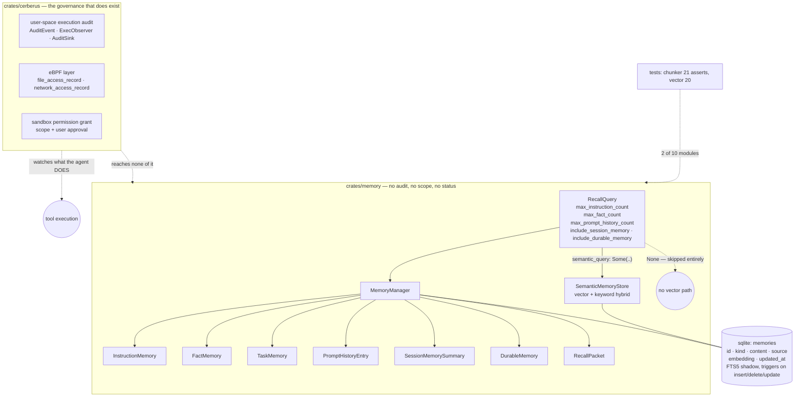

## 1. Executive Summary

xiaoO calls itself the intelligence hub of AgentOS — a Rust agent runtime with a
sandbox, a permission model, a skill system and a memory crate. Roughly 1,100
files. **MulanPSL-2.0**, which is worth stating first because GitHub's licence
detector does not report it: the grant lives in `License/LICENSE` rather than at
the root, and is declared in `Cargo.toml:36` and the README badge.

**No marks**, and the reason is a contrast rather than a shortfall.

The runtime's governance is serious. `crates/cerberus/cerberus-core/src/audit`
is *"an audit module for execution observability and security monitoring"* with
two subsystems — a user-space execution audit carrying an `AuditEvent`, an
`ExecObserver` trait and an `AuditSink`, and an eBPF layer with
`file_access_record.rs` and `network_access_record.rs`. Tool execution runs
under sandbox permission grants with a scope and a user approval.

**None of it reaches the memory.** `grep -rn "audit" crates/memory` returns
nothing. A memory row is `id`, `kind`, `content`, `source`, `embedding`,
`updated_at` — no status, no scope key, no creation time distinct from the
update, and no record that it changed. Everything the agent *does* is watched;
nothing it *keeps* is.

## 2. Mental Model

Memory is typed rather than flat. `RecallQuery` names the kinds it will
assemble — instructions, facts, prompt history, session summary, durable
memory — and caps each one separately. Semantic search is opt-in: leave
`semantic_query` as `None` and the vector path is skipped entirely.

So recall is a budget rather than a ranking. The caller says how many of each
kind it wants, and the manager fills the packet.

## 3. Architecture

## 4. Essential Implementation Paths

**The recall budget** — `crates/memory/src/recall.rs`. `RecallQuery` is 41
lines and is the whole retrieval contract: three per-kind count caps, two
booleans for session and durable memory, and an `Option<String>` semantic query
whose own comment states the default — *"Leave None to skip semantic recall."*
Opt-in vector search is the right default for a runtime where the embedding
path costs money and latency.

**The table and its index** —
`crates/memory/src/store/sqlite_store.rs:59-88`. A `memories` table with an
FTS5 shadow kept in step by three triggers covering insert, delete *and*
update, which is the full set and the one most projects leave at two.

**The audit that exists** — `crates/cerberus/cerberus-core/src/audit/mod.rs:1-14`.
Two complementary subsystems, named in the module header, with the user-space
one *"capturing high-level execution events like request received"* and the
eBPF one recording file and network access as typed records.

**The gap, stated as a search** — `grep -rn "audit" --include='*.rs'
crates/memory` returns nothing at this commit. The memory crate does not import
the audit crate, does not emit an `AuditEvent`, and has no log of its own.

## 5. Memory Data Model

Typed in Rust, flat in SQLite. The domain has `DurableMemory`, `FactMemory`,
`InstructionMemory`, `TaskMemory`, `SessionMemorySummary`, `PromptHistoryEntry`
and `TokenUsageBaseline`; the row has a `kind` string and a content blob.

What is absent from the row is the whole of this atlas's mark set. No status
field, so nothing can be recorded-but-not-believed. No scope column, so the
store is single-tenant however many agents run above it. One timestamp, and it
is the update — a memory's creation time is not recoverable. No supersession
pointer and no rejected-value record: `tombstone`, `supersede` and `confidence`
appear in no file of the memory crate.

## 6. Retrieval Mechanics

Per-kind caps assembled into a `RecallPacket`, with an optional hybrid
vector-plus-keyword search over the semantic store. FTS5 supplies the keyword
half.

## 7. Write Mechanics

A chunker, an embedding path with a content-hash cache (`embedding_cache` keyed
on `content_hash`, so re-embedding identical text is free), and a session
module of 1,036 lines that reaches an LLM client — session memory is
summarised by a model rather than assembled mechanically.

## 8. Agent Integration

A gateway with memory automation, a skill system with its own auditor, the
cerberus sandbox, and a serverside memory-management surface.

## 9. Reliability, Safety, and Trust

**No marks, and the categories fail at the row rather than at the edges.** The
memory row carries no epistemic state, no scope, no second clock and no
rejection record, and nothing audits its mutations or holds one for review.

**`audit_log` is the one worth naming**, because the machinery is present and
pointed elsewhere. A runtime that records file and network access through eBPF
has made a considered investment in knowing what happened; a memory store in
the same repository with no mutation record has simply not been included in it.
For a system whose memory feeds an agent's next decision, the asymmetry is the
finding.

**Test coverage is two modules of ten.** `chunker.rs` has 21 assertions and
`vector.rs` has 20, including the degenerate cosine cases — an empty vector
against a non-empty one returns `0.0` rather than dividing by zero.
`session.rs`, at 1,036 lines and the module that calls a model, has none.

**The licence is the practical thing to check first.** MulanPSL-2.0 is
permissive and OSI-approved, and GitHub's API reports this repository's licence
as null because the file sits in a `License/` directory. A reader relying on the
API would conclude there is no grant; `Cargo.toml:36` and the README both say
otherwise.

## 10. Tests, Evals, and Benchmarks

Unit tests inline in two memory modules; the gateway has a
`memory_automation_test.rs` beside its implementation. Nothing was installed
and nothing was run.

No case asserts that particular material must not be retrieved — the memory
tests cover chunk boundaries and vector arithmetic, not recall behaviour. That
is why `negative_eval` is absent rather than argued about.

No benchmark and no paper.

## 11. For Your Own Build

### Steal

- **Make semantic recall opt-in with `None` meaning skip.** An `Option<String>`
  that costs an embedding call when set and nothing when unset is a clearer
  contract than a boolean plus a threshold.
- **Cap recall per kind, not in total.** Instructions and prompt history
  compete for context; a single limit lets one starve the other.
- **Key the embedding cache on a content hash.** Re-embedding identical text is
  the easiest waste to remove.
- **Put all three FTS triggers in.** Insert, delete and update — the update
  trigger is the one usually missing, and without it the index answers from
  content that changed.

### Avoid

- **Auditing the sandbox and not the store.** If you have built an
  `AuditSink`, the memory writes are the cheapest possible second producer, and
  the questions they answer — when did this become a fact, and from what — are
  the ones a memory system gets asked after an incident.
- **One timestamp on a memory row.** `updated_at` alone makes a memory's age
  unknowable after the first edit.

### Fit

Take the recall budget and the embedding cache. Take the runtime whole only if
you want AgentOS, and read `License/LICENSE` yourself rather than trusting a
licence badge generated from the API.

## 12. Open Questions

- `cerberus` has an `AuditSink` trait and the memory crate has no audit. Was
  including memory writes considered, or is the audit scoped to execution on
  purpose?
- The row has `updated_at` and no creation time. Is a memory's age meant to be
  recoverable?
- `session.rs` is 1,036 lines, calls a model and has no tests. Is the
  summarisation covered anywhere?
- Sandbox permissions carry a scope; memories do not. Does a multi-agent
  deployment share one store?

## Appendix: File Index

| Path | What it holds |
| --- | --- |
| `crates/memory/src/recall.rs` | `RecallQuery` — the per-kind caps and the opt-in semantic query |
| `crates/memory/src/store/sqlite_store.rs` | the `memories` table, the FTS5 shadow and its three triggers |
| `crates/memory/src/manager.rs` | the typed memory kinds assembled into a `RecallPacket` |
| `crates/memory/src/session.rs` | 1,036 lines of model-assisted session memory, untested |
| `crates/memory/src/chunker.rs`, `vector.rs` | the two modules that carry tests |
| `crates/cerberus/cerberus-core/src/audit/` | the execution audit, user-space and eBPF |
| `License/LICENSE`, `Cargo.toml:36` | MulanPSL-2.0, where the API does not see it |

## Appendix: Recorded Searches

Run from the root of the checkout at the pinned commit.

| Claim | Command | Result at this pin |
| --- | --- | --- |
| Nothing audits memory | `grep -rn "audit" --include='*.rs' crates/memory` | Nothing |
| The memory row has no status, scope or creation time | read `crates/memory/src/store/sqlite_store.rs:59-66` | `id`, `kind`, `content`, `source`, `embedding`, `updated_at` |
| No epistemic vocabulary in the memory crate | `grep -rl "tombstone\|supersede\|confidence" --include='*.rs' crates/memory` | Nothing for any of the three |
| Two of ten memory modules carry tests | `grep -rc "assert" --include='*.rs' crates/memory/src/*.rs crates/memory/src/store/*.rs \| grep -v ':0'` | `chunker.rs:21`, `vector.rs:20` |
| The licence is MulanPSL-2.0, not absent | `find . -iname '*licen[cs]e*'`; `grep -n '^license' Cargo.toml`; README badge | `License/LICENSE`, `Cargo.toml:36` `license = "MulanPSL-2.0"`, and the README badge — while the GitHub API reports `license: null` |
| The audit that does exist is about execution | read `crates/cerberus/cerberus-core/src/audit/mod.rs:1-14` | *"execution observability and security monitoring"*, with eBPF file and network access records |

## History

**2026-09-20** — [`3acadbb33915d0df5793e80db4078d75dfb77e75`](https://github.com/FreshHillyer/xiaoO/commit/3acadbb33915d0df5793e80db4078d75dfb77e75) — first reading, at roughly 1,100 files. Taken from an unreported scout shortlist entry dated 2026-09-11 rather than a fresh triage selection, the day's allocation having been spent. Screened before reading: no auto-run surface, three build-time execution points, one unpinned surface and nothing inside the cooldown; nothing was installed, built or run. **MulanPSL-2.0** — the GitHub API reports this repository as unlicensed because the grant sits in a `License/` directory, and the manifest and README both name it; the licence was checked by `find`, by the `Cargo.toml` field and by the README badge rather than by the API. No marks: the memory row carries no status, no scope, no creation time and no mutation record, and no committed case asserts what must not be retrieved. The finding worth the page is the asymmetry — the runtime audits process, file and network access through eBPF, and the memory crate references the audit subsystem nowhere.
