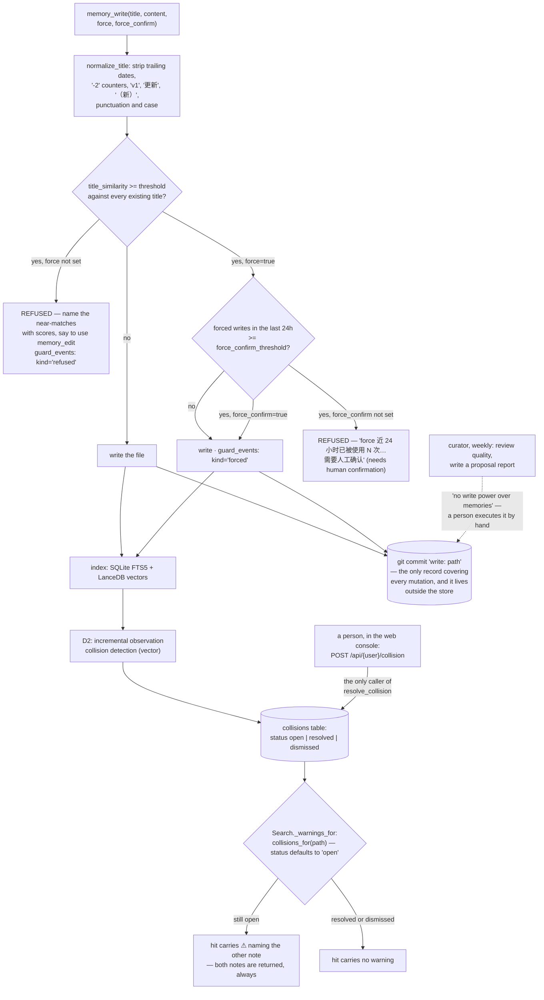

## 1. Executive Summary

yacmemo describes itself as a personal memory layer with API-level consistency
guards — "markdown 为本、全本地、agent 无关" (Markdown-native, fully local,
agent-agnostic). Version 0.2.0, MIT by metadata, 11,424 lines of Python across 58 files, with
139 test functions in the live suite and 148 more in the `legacy/v1_tests`
tree that the runner does not collect. Documentation and interface are in Chinese; the
code comments are in English.

The shape is one server process on the machine that holds the data, speaking
streamable HTTP, with a separate MCP mount and store root per user. Any client —
Claude Code, Codex, Cursor — joins by adding a URL, with nothing installed
locally. Markdown files in a git repository are the only truth; SQLite and
LanceDB are derived indexes under `.index/` that can be deleted and rebuilt.

Three things make it worth reading.

**The duplicate guard anticipates its own evasion.** `memory_write` refuses a
title that is a near-duplicate of an existing note — and the comparison runs on
`normalize_title`, which first strips trailing dates, `-2`-style counters, `v1`,
`更新` ("updated") and `（新）` ("new"). The rename an agent would reach for to
get a second copy in is precisely the transformation the normalizer collapses.
The refusal names the near-matches with their similarity scores and says what to
do instead: edit the existing note.

The override is the better half. `force=true` writes anyway and records a
`forced` event; but when forced writes in the last 24 hours reach a configured
threshold, a second flag `force_confirm=true` becomes mandatory, with the comment
naming the intent — "human-confirm semantics, deterministic and fully counted in
guard_events". A bypass that is possible, counted and self-limiting is a
materially different thing from a bypass that is free.

**Nothing is hidden.** There is no status, tier, score or expiry anywhere in the
search path that withholds a note. When two notes collide, both are returned and
the hit carries a warning naming the other:

> "⚠ 与 [[other]] 疑似重复（score …）— 建议读两篇后用 memory_edit 合并"
> *(suspected duplicate of [[other]] — read both, then merge with memory_edit)*

Most systems in this corpus resolve a contradiction by deciding which side wins
and dropping the other. This one presents both and hands the judgement to the
model reading the results — which is consistent with the other stated rule, that
the memory subsystem contains no generative LLM: one 0.6B embedding call, and
everything else deterministic string math.

**A person's dismissal changes what later reads say.** A collision carries a
status of `open`, `resolved` or `dismissed`, validated against that whitelist and
documented as a "human decision via WebUI/audit". Its only caller in the
repository is the web console's `POST /api/{user}/collision`; no detector,
scheduler or agent path sets it. And `Search._warnings_for` reads
`collisions_for(path)` with the default `status="open"`, so once a person has
judged a pair, the ⚠ stops appearing on every future hit for that note. That is
the mark: a human verdict, stored, consulted by the retrieval path.

Where it is thinner is the record. Every write, edit, move and delete makes a git
commit, so the memory repository is always clean and a mistaken deletion is
recoverable — good practice, but git history is not an audit record this atlas
credits, since it sits outside the store and can be rewritten by anyone holding
the directory. The two SQLite records each cover a slice: `guard_events` holds
refusals and forced bypasses only, and `call_log` is written by the MCP tool
wrapper, so a note saved or deleted in the web console produces no row in it. It
stores a summary of arguments rather than a before-image, and trims itself to
20,000 rows.

The curator is honest about its own limits in the first line of its module —
"periodic review -> proposal report. Never auto-applies" — and the system keeps
that promise completely: proposals are Markdown files in `curator/`, the WebUI
lists them, and a person does the work by hand. That is the right default, and it
also means the approval half of the loop lives outside the software.

## 2. Mental Model

A **note** is a Markdown file. Its **title** is its identity; its directory is
only filing.

A **guard** is a refusal at the API, not a warning in a report.

A **collision** is a question the system asks and a person answers.

**Git** is the undo.

## 3. Architecture

| Area | Role |
| --- | --- |
| `store.py` | CRUD, the write guards, the topic registry, git snapshots |
| `detectors.py` | Title normalisation, D1 duplicate scan, D3 dangling links — no LLM |
| `index_db.py` | SQLite: notes, FTS, collisions, guard events, embedding cache |
| `search.py` | FTS5 trigram and vector, fused by RRF, warnings attached |
| `vector.py`, `embedding.py` | LanceDB and the single 0.6B embedding call |
| `curator.py` | The weekly quality review that only proposes |
| `webui/app.py` | The console: notes, search, audit, usage, health, config |
| `usage.py` | Per-call log for the MCP transports |

## 4. Essential Implementation Paths

`detectors.py:14-43` — the suffix patterns and the similarity function. Read the
patterns first; they are the design.

`store.py:151-198` — refusal, the confirmation ladder, and what gets counted.

`search.py:107-119` and `index_db.py:231-261` — the warning, and the human
verdict that silences it.

## 5. Memory Data Model

A note is Markdown. The registry (`TOPICS.md`) names which topics are long-term,
with active and archived sections; `PROFILE.md` carries preferences injected
ahead of context. `journal/`, `archive/` and `curator/` are registration-free
areas, and journal notes are exempt from the title guard — a deliberate carve-out,
since a daily log is supposed to repeat its own titles.

Observations are parsed from `- [category] text` lines, with GFM task items
(`- [x]`) excluded so a checklist-heavy note does not manufacture collision
noise. That exclusion is a small thing, and it is the kind of small thing that
decides whether a detector is usable.

## 6. Retrieval Mechanics

FTS5 trigram — which matters for Chinese, where word boundaries are not spaces —
and vector search, fused by reciprocal rank. Then warnings are attached per hit.

The absence is the point: no filter, no tier, no decay, no status that withholds.
The README states it as a rule — the system never silently deletes or hides any
memory — and the search path matches the claim.

## 7. Write Mechanics

Covered above. `memory_edit` requires its anchor string to be unique in the file
and raises otherwise, so an edit cannot silently hit the wrong occurrence;
`memory_edit_section` addresses a heading instead. Move refuses an existing
target and re-indexes from the embedding cache rather than re-embedding.

## 8. Agent Integration

One URL per user, streamable HTTP, stateless sessions, nothing installed on the
client. For a person running several agents across several machines against one
memory, this is the least-friction shape available, and it is why the guards have
to live at the API: there is no client-side library to put them in.

The web console covers browsing and editing notes, search, a two-mode audit
(deterministic rules, and the curator's LLM review), the call log, health, and
editing `config.toml` in the browser.

## 9. Reliability, Safety, and Trust

Path traversal is refused on title-to-path conversion and on move. The store
takes an instance lock on every public method because the HTTP server runs sync
MCP tools in a threadpool. Git commits every mutation and the repository is
expected to stay clean, which is both the undo and a way to see what an agent did
without giving the agent filesystem access.

The gap to be aware of is the one named above: the complete record is git, and
the in-store records each cover a slice.

The README carries an AIGC labelling block in its front matter — a content
producer and propagation id, as Chinese regulation asks for on AI-generated
material.

## 10. Tests, Evals, and Benchmarks

139 test functions across thirteen files covering the store, guards, git
snapshots, detectors, topics, profile, search, the index, the curator, the server
and the WebUI, with a v1 suite kept under `legacy/`. `docs/06-evaluation.md`
exists; the evaluation it describes was not run here, and nothing is installed or
executed by this reading.

## 11. For Your Own Build

Normalise before you compare. A duplicate check that a trailing `-2` or a date
defeats is a check against typos, not against duplication — and the suffix list
in `detectors.py` is twenty lines that turn one into the other.

Make the bypass count itself. `force` with a 24-hour counter and a second flag
above a threshold gives you an escape hatch that stays an escape hatch. An
uncounted override becomes the default path within a week.

Consider not hiding. Presenting both sides of a contradiction with a marker, and
letting the reading model judge, is a real alternative to picking a winner at
write time — and it is only affordable because nothing here is lossy.

Let a person's dismissal stick. A warning that reappears after it has been judged
trains the reader to ignore warnings.

And if you are relying on git as your audit trail, say so plainly and keep the
in-store record honest about its scope. A table named for guards that holds only
guard events is fine; a call log that misses the console's own writes is a gap
worth closing.

## 12. Open Questions

Whether a proposal can ever be applied from inside the system. The curator will
not, by design, and no route or command was found that executes one.

What happens to a collision when the notes are merged. `remove_collisions_involving`
clears rows on delete and move, and `prune_stale_collisions` drops rows whose
notes are gone; whether an edit that resolves the overlap re-opens or clears the
row was not traced.

Whether the same fact under two unrelated titles is detected. The write guard is
title-keyed; D2 works on observation lines, and how much of a note's body it
covers was not established.

## Appendix: File Index

| Path | What to read it for |
| --- | --- |
| `yacmemo/detectors.py:14-43` | The suffix list, which is the whole idea |
| `yacmemo/store.py:151-198` | Refusal, the confirmation ladder, and what is counted |
| `yacmemo/search.py:107-119` | Both notes returned, one of them marked |
| `yacmemo/index_db.py:231-261` | The human verdict the search path reads |
| `yacmemo/curator.py:1-46` | A reviewer with no write power, and its review dimensions |
| `yacmemo/usage.py:1-34` | What the call log does and does not cover |

## Appendix: Recorded Searches

Checked against the repository tree at the pinned revision on 2026-09-20,
without a clone, during a corpus-wide audit of absence claims. The command is
the check that was actually run, not a local equivalent.

| Claim | Check | Result at this pin |
| --- | --- | --- |
| No licence file exists anywhere in the tree | `GET /repos/<owner>/<repo>/git/trees/<this revision>?recursive=1`, filtered for a path matching `licen[cs]e` or `COPYING` | Nothing, at 112 blobs. |

## Appendix: Recorded Searches

Checked at the pinned revision on 2026-09-20, without a clone, after two
figures in this report were reported as stale.

| Claim | Check | Result at this pin |
| --- | --- | --- |
| ~~`register_tools` declares twenty-one tools~~ — **corrected 2026-09-20** | `yacmemo/tools.py` fetched at this revision; `@mcp.tool` decorators counted, then every `def` | **17** decorated tools against **21** function definitions. The four extra are helpers — `_client_from_ctx`, `register_tools`, `_logged`, `_fmt_search` — so the original figure counted definitions rather than registrations. None of the seventeen is a resolve or dismiss verb, which is what the `human_review` record rests on. |
| ~~95 test functions~~ — **corrected 2026-09-20** | every `*.py` under a `tests?/` path fetched and `^\s*def test_` counted | **139** in the live suite across thirteen files, and **148** more under `legacy/v1_tests/`. The file count in the original sentence was right; only the function count had gone stale. |
| The tree is 11,424 lines of Python | all 58 `.py` blobs in the tree fetched and their lines counted | 11,424. The previous figure, 4,764, predates the commits this report was re-pinned onto. |

## History

**2026-09-20** — same pin, three figures corrected and none of them load-bearing for a mark. `register_tools` declares **seventeen** tools, not twenty-one: the original count included the four helpers in `tools.py` alongside the seventeen `@mcp.tool` closures. The suite is **139** test functions rather than 95, with a further 148 under `legacy/v1_tests/` that the runner does not collect — the "thirteen files" in the same sentence was correct, which is why the error survived a reading. And the Python figure, 4,764 lines, predated the commits this report was re-pinned onto; it is 11,424 across 58 files.

All three are the same failure as the licence corrections made elsewhere in the corpus today: a re-pin re-derives the capability evidence, because the record forces it, and carries the counts and prose forward untouched. The `human_review` record is unaffected in substance and now reads on a firmer basis — seventeen tools, none of them a resolve or dismiss verb. A Recorded Searches appendix was added carrying all three counts.

**2026-09-19** — re-pinned to [`9b68276dbee9df61a57e515bfca3b58f419a07f7`](https://github.com/yachen4ever/yacmemo/commit/9b68276dbee9df61a57e515bfca3b58f419a07f7), 30 commits and 59 files on. **The mark holds**, and the record is re-anchored because `resolve_collision` gained a second caller in the range. It is not a weakening: `Store.record_audit_action` (`yacmemo/store.py:1059-1098`) writes a human's disposition into the audit snapshot and then syncs the collision row, and its own only caller is the console route at `yacmemo/webui/app.py:318`. So both paths to a disposition still originate in the web console, and no scheduler, detector or agent path reaches either. Checked on the other side too, which the previous record did not: `register_tools` declares seventeen tools including `memory_audit`, which reports collisions, and no resolve or dismiss verb — the agent sees the queue and has nothing that empties it. The consumption end is unchanged: `Search._warnings_for` reads `collisions_for(path)` with `status` defaulting to `"open"`, so a disposition stops the warning appearing beside that note on every later search. One detail worth keeping from the range: a comment at the sync site records that the disposition table has no delete interface, measured on 2026-09-18, which is why the snapshot is written before the status is changed. Screened again first; nothing installed or run.

**2026-09-16** — [`2440aa563e1474d5a07b16d052373c28ed8a4a7c`](https://github.com/yachen4ever/yacmemo/commit/2440aa563e1474d5a07b16d052373c28ed8a4a7c) — first reading, at a commit dated 16 September 2026. Screened before opening, from a shallow clone: ten files scanned, no auto-run surfaces, two build-time execution points, two unpinned surfaces and five dependency files inside the seven-day cooldown. Nothing was installed, built or run.
