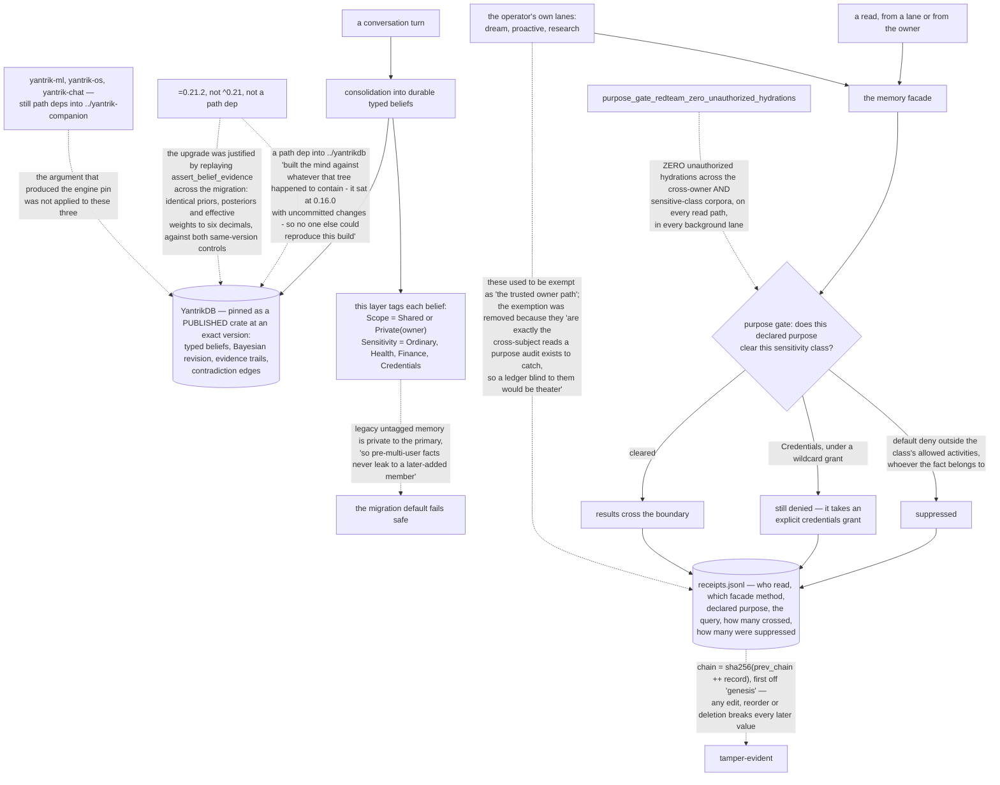

## 1. Executive Summary

yantrik-mind is "[a] ground-up Rust AI companion built on the YantrikDB
typed-memory moat" — no licence file, 203,205 lines of Rust across 226 files in
nineteen crates. Its claim is about the memory model rather than the assistant:
"[i]t stores *beliefs* — typed, revisable nodes with Bayesian confidence scores,
evidence trails, and contradiction edges — in YantrikDB's cognitive graph", and
when two beliefs conflict "the companion asks rather than asserting either
side."

That model belongs to the engine. This report is about what the companion adds
on top of it, and the addition is a **purpose gate**.

**Scope is stored on the belief and the migration default fails safe.** `Scope`
is `Shared` or `Private(person_id)`, and the type's comment states the rule
plainly — a fact "from one person must NEVER surface to another" — while the
default for pre-existing data goes the careful way: "[l]egacy/untagged memory is
private to them, so pre-multi-user facts never leak to a later-added member."
Most systems make unlabelled rows visible to everyone, which is the same
decision taken in the direction that is easier to ship.

**Sensitivity is default-deny.** Four classes carry purpose policies — "default
deny outside their allowed activities, whoever the fact belongs to" — and
`Credentials` is deliberately excluded from wildcard grants: "opening
credentials takes an explicit credentials grant."

**The audit has no exempt caller, and the reasoning for that is the best
sentence in the tree.** Operator reads were once outside the ledger, on the
"trusted owner path". The exemption was removed:

> "the operator's background lanes (dream/proactive/research/…) are exactly the
> cross-subject reads a purpose audit exists to catch, so a ledger blind to them
> would be theater. Every context is receipted now."

Each receipt records who read, through which facade method, for what declared
purpose, what they asked, how many results crossed the boundary, and how many
the gate suppressed — hash-chained so "[a]ny edit, reorder, or deletion of a
middle line breaks every later chain value." It is a record of reads rather than
of mutations, which is why it does not carry this atlas's audit mark, and it is
the half of that pattern most systems do worse.

**And a red-team test holds the whole arrangement.**
`purpose_gate_redteam_zero_unauthorized_hydrations` asserts "ZERO unauthorized
hydrations across the cross-owner and sensitive-class corpora — on every read
path, in every background lane."

**The other thing to read here is a dependency line.** `yantrikdb-core` carries
about thirty lines of comment explaining why it is an exact version pin on a
published crate rather than a path dependency — because a path dep into
`../yantrikdb` "built the mind against whatever that tree happened to contain -
it sat at 0.16.0 with uncommitted changes - so no one else could reproduce this
build and it moved under us whenever someone worked there." The upgrade to a
later engine is documented in the same block by re-checking the properties the
pin was chosen for against the published crates, including replaying
`assert_belief_evidence` across the migration for "identical priors, posteriors
and effective weights to six decimals."

The gap is that the argument stops at one line. `yantrik-ml`, `yantrik-os` and
`yantrik-chat` are still path dependencies into a sibling workspace — the exact
arrangement the comment above them rejects.

## 2. Mental Model

A **belief** lives in the engine; a **scope** and a **sensitivity** are what this
layer puts on it.

A **purpose** is declared by the reader and checked against the class.

A **suppression** is counted, not silent.

A **receipt** covers every read, including the owner's.

## 3. Architecture

| Area | Role |
| --- | --- |
| `Cargo.toml:28-56` | The engine pin, and thirty lines on why it is what it is |
| `crates/mind-types/src/memory.rs` | `Scope`, and the leak it exists to prevent |
| `crates/mind-types/src/purpose.rs` | Sensitivity classes and their default-deny policies |
| `crates/mind-memory/src/lib.rs` | The facade, the gate, and the red-team test |
| `crates/mind-memory/src/receipts.rs` | A hash-chained ledger with no exempt caller |
| `crates/mind-governance/`, `mind-evals/` | Egress and device policy, and the immune ledger the chain mirrors |

## 4. Essential Implementation Paths

`Cargo.toml:28-56` — why the engine is a published pin, and what the upgrade had
to prove.

`crates/mind-types/src/memory.rs:218-236` — a two-value scope and a safe legacy
default.

`crates/mind-types/src/purpose.rs:140-153` — four classes, default deny, and one
that wildcards cannot reach.

`crates/mind-memory/src/receipts.rs:1-14` — the exemption that was removed, and
why.

`crates/mind-memory/src/lib.rs:7947-7966` — zero unauthorized hydrations, on
every path, in every lane.

## 5. Memory Data Model

The belief itself — statement, polarity, weight, source event, provenance, and
the engine's confidence, evidence and contradiction structure — belongs to
YantrikDB and is described in [YantrikDB Engine](../yantrikdb-engine/). What
this repository contributes to the unit is the pair of handling attributes: a
scope naming whose fact it is, and a sensitivity class naming what may be done
with it.

## 6. Retrieval Mechanics

Semantic recall blended with a confidence prior, through a facade that applies
the scope filter and then the purpose gate, counting what it suppressed before
anything crosses the boundary.

## 7. Write Mechanics

Conversation turns are consolidated into durable typed beliefs asserted through
the engine's `assert_belief_evidence`. Contradiction detection belongs to the
engine; this layer's stated behaviour on a conflict is to ask rather than to
pick a side.

## 8. Agent Integration

Nineteen crates covering agents, conversation, cortex, governance, identity,
inference, instincts, perception, proactive lanes, recipes, tools and a world
model, with client and deploy directories beside them.

## 9. Reliability, Safety, and Trust

The strong parts are the default-deny sensitivity policies, the safe legacy
scope default, the unexempted read ledger and the red-team test. The weak parts
are three path dependencies that undo the reproducibility the engine pin buys,
an absent licence, and committed run artefacts including two smoke databases'
write-ahead files.

## 10. Tests, Evals, and Benchmarks

A `mind-evals` crate with an immune ledger whose chain discipline the receipts
module mirrors, plus in-tree adversarial tests — the purpose-gate red team over
cross-owner and sensitive-class corpora, and a surprise-gift case the `Scope`
type names directly.

## 11. For Your Own Build

Pin the engine you delegate to, exactly, on a published artifact — and write down
why. The comment on that one line is worth more than most changelogs: it records
the failure that produced the pin, the caret trap, the resolved checksum, and
what the later upgrade had to prove.

When you widen a data model to more than one owner, make the untagged rows
private rather than shared. The convenient default is the one that leaks.

Delete the audit exemption for the trusted caller. The lanes you trust are the
ones that read across subjects, and a ledger without them measures the wrong
half.

Count your suppressions. A gate whose refusals are invisible cannot be told from
a gate that never fired.

## 12. Open Questions

Whether the three remaining path dependencies are intended. The argument against
them is written directly above them, applied to a fourth, and a reader will
wonder whether the other three were judged different or simply not revisited.

Whether the read ledger will be joined by a mutation one. Everything about the
receipts design — the chain, the removed exemption, the counted suppressions —
would transfer to belief writes, and what changed a belief is currently the
engine's business rather than this layer's record.

## Appendix: File Index

| Path | What to read it for |
| --- | --- |
| `Cargo.toml:28-56` | Thirty lines on one dependency, and worth every one |
| `crates/mind-types/src/memory.rs:218-236` | A migration default chosen in the safe direction |
| `crates/mind-types/src/purpose.rs:140-153` | Default-deny classes, and one no wildcard covers |
| `crates/mind-memory/src/receipts.rs:1-14` | Why the trusted caller lost its exemption |
| `crates/mind-memory/src/lib.rs:7947-7966` | Zero unauthorized hydrations, stated as a test |

## History

**2026-09-16** — [`97935b1e247167ac7d4fe192ec8a9a1966b26c49`](https://github.com/yantrikos/yantrik-mind/commit/97935b1e247167ac7d4fe192ec8a9a1966b26c49) — first reading, at a commit dated 8 September 2026. Screened before opening, from a shallow clone: twenty-seven files scanned, no auto-run surfaces, two build-time execution points, no unpinned dependency surfaces and nothing inside the seven-day cooldown, with `Cargo.lock` tracked and unchanged for eight days. Reviewed **without a licence file**, so nothing here should be taken as a statement about reuse terms. The belief engine it delegates to is a published crate rather than a checkout and was not cloned for this reading; its model is covered separately. Nothing was installed, built or run.
