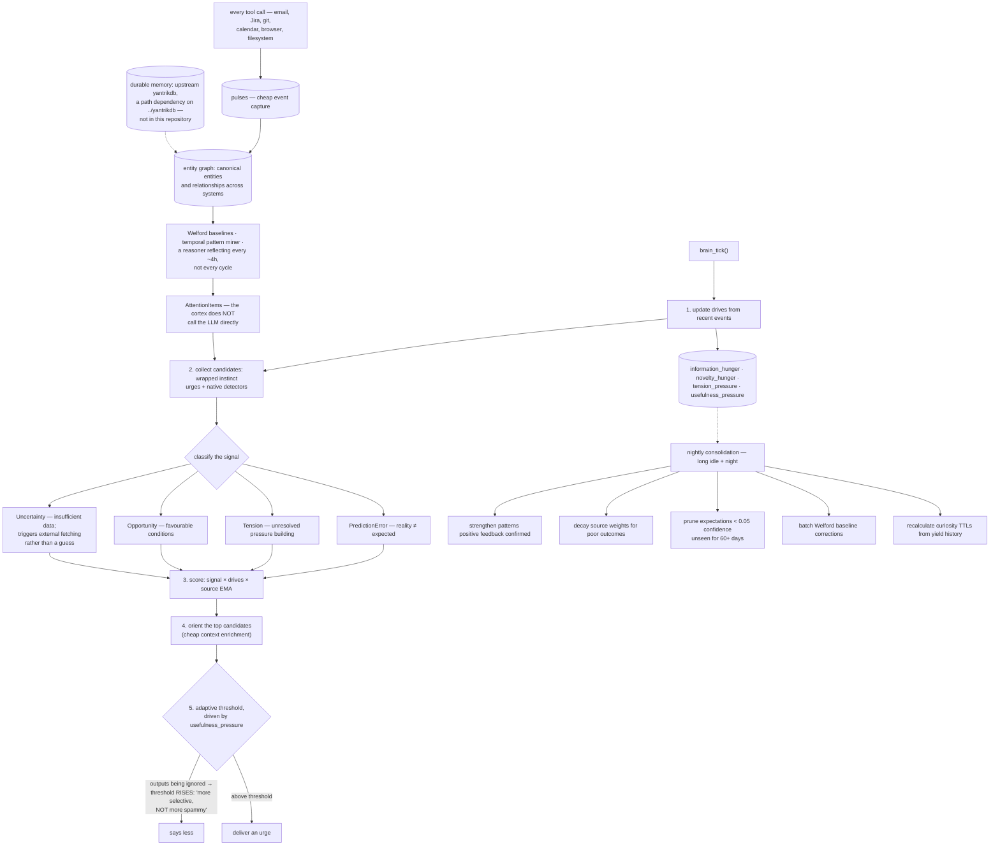

## 1. Executive Summary

Yantrik OS is "[a]n AI-native desktop operating system where the AI **is** the
shell" — GPL-3.0, Rust throughout with a Slint UI, 181,759 lines with 753 test
functions, sixteen application binaries, local quantized models, no Electron and
no Python runtime. Every app publishes its state and accepts actions over a unix
socket, so "[a]nything a person can do from the keyboard, an agent can do through
the same path": `yos describe shell`, `yos act shell open_app name=notes`.

Its durable memory is not here. `yantrikdb-core` is a path dependency on
`../yantrikdb/crates/yantrikdb-core` — a sibling checkout of the upstream
database, which this atlas reads in its own right as
[YantrikDB Engine](../yantrikdb-engine/). A reader cloning this repository alone
gets the shell and the cognition loop, and not the store underneath them. The
manifest is candid about why it is a dependency rather than a fork: "Upstream
yantrikdb, not a vendored fork … the `package =` rename keeps every existing
`use yantrikdb_core::…` call site compiling unchanged".

What this tree contributes is the layer above: an LLM-free loop that decides when
the machine should speak.

**Four signal types and four drives.** Every observation is classified as a
prediction error (reality differs from what was expected), a tension (unresolved
pressure building), an opportunity (favourable conditions), or an uncertainty —
and uncertainty is the one that triggers fetching external information rather
than guessing. Over them sit four homeostatic drives that "oscillate between
satiation and hunger, controlling the system's rhythm and preventing both spam
and stagnation": information hunger, novelty hunger, tension pressure, and one
more that carries the best decision in the repository:

> "`usefulness_pressure`: rises when outputs are ignored, raises threshold (more
> selective, NOT more spammy)"

A proactive assistant that becomes quieter the more it is ignored inverts the
incentive almost every notification system encodes, and the parenthesis exists
because the obvious implementation does the opposite.

The tick is arithmetic, not a model call: update drives from recent events,
collect candidates from wrapped instincts and native detectors, score them
against signal type, drives and a per-source moving average, enrich the top few
with cheap context, and apply a threshold the usefulness drive moves. The cortex
above it — pulses from every tool call, a canonical entity graph across email,
Jira, git, calendar, browser and filesystem, Welford baselines, a temporal
pattern miner, and a reasoner that reflects roughly every four hours rather than
every cycle — is explicit that it "does NOT call the LLM directly", emitting
attention items the instinct pipeline packages.

**Sleep is a real pass.** Nightly consolidation, gated on long idle plus
night-time, strengthens patterns that positive feedback confirmed, decays source
weights for consistently poor outcomes, prunes expectations below 0.05 confidence
unseen for sixty days, applies batch Welford corrections to baselines,
recalculates curiosity source TTLs from yield history, and drops zero-confidence
feedback entries. It reports what it did.

**The module history is worth the detour.** Those four brain modules used to live
inside a vendored copy of the database crate, and the header says why they were
moved:

> "which made them look like database code. They are not: they touch no YantrikDB
> type at all, only a plain `rusqlite::Connection`. Keeping them here lets Yantrik
> OS depend on the upstream yantrikdb release instead of maintaining a fork of
> it."

A dependency reduced by noticing that the code inside it never touched its types.

No marks, and the reason is structural rather than a criticism. Everything this
layer stores of its own is continuous — drives, confidences, baselines,
per-source moving averages. There is no stored discrete state that withholds a
record from a read, no supersession or retraction, no mutation record, and no
scope to enforce on a single-user desktop. Consolidation's answer to a stale
expectation is deletion, so the fact of having believed something does not
outlive the belief. The marks that could apply belong to the engine crate this
repository points at.

## 2. Mental Model

A **pulse** is something that happened. An **entity** is what it was about.

A **signal** is why it might matter, and there are four kinds.

A **drive** is how badly the system wants to say something, and being ignored
lowers it.

**Sleep** is when the confidences get corrected.

## 3. Architecture

| Crate | Role |
| --- | --- |
| `yantrik-brain` | The LLM-free loop: drives, detectors, curiosity, consolidation |
| `yantrik-companion-cortex` | Pulses, entity graph, baselines, patterns, reasoner |
| `yantrik-companion-instincts` | Dozens of named instincts, each proposing urges |
| `yantrik-companion-core` | Shared types, and the output sanitizer |
| `yantrik-shell-core`, `yantrik-ui-slint` | The shell and its UI |
| `yantrikdb-server`, `yantrik-mcp` | The database server wrapper and an MCP surface |
| `apps/` | Sixteen application binaries |

## 4. Essential Implementation Paths

`crates/yantrik-brain/src/brain.rs:1-50` — the signal taxonomy, the drives, and
the tick.

`crates/yantrik-brain/src/brain_consolidation.rs:1-37` — what sleep actually
does.

`crates/yantrik-brain/src/lib.rs:1-18` — why these modules moved out of the
database.

`crates/yantrik-companion-cortex/src/lib.rs:1-19` — four layers, and the boundary
the cortex keeps.

## 5. Memory Data Model

Pulses, entities and relationships, baselines with running variance,
expectations with confidences, curiosity sources with yields and TTLs, and a
brain state holding drives and feedback. All of it is state the loop maintains
for itself; the user's durable memories live in the engine crate.

## 6. Retrieval Mechanics

None of its own. The situation briefing is assembled from cortex state when
attention fires; recall over stored memory belongs to the engine.

## 7. Write Mechanics

Incremental: a pulse per tool call, an entity update, a baseline correction.
Consolidation is the only pass that removes anything, and it removes rather than
retires.

## 8. Agent Integration

The uniform control path is the interesting piece: every app publishes state and
accepts actions on the same unix socket, so an agent drives the desktop through
the documented surface a person uses rather than through synthesised input. For a
system whose thesis is that the AI is the shell, making the shell describable is
the load-bearing decision.

## 9. Reliability, Safety, and Trust

`sanitize.rs` scans model output for sensitive internal information and redacts
fragments before display, logging when it fires, with a table of patterns
including an SSH private key read attempt. That is output-side defence for a
system that reads the user's whole machine, and it is the right place for it.

What is absent at this layer is any epistemic record: nothing marks where a
belief came from, nothing supersedes a wrong expectation rather than deleting it,
and no log records what the loop concluded before it changed its mind.

## 10. Tests, Evals, and Benchmarks

753 test functions across the crates and apps. Nothing was built or run for this
reading, and no model was loaded.

## 11. For Your Own Build

Make being ignored raise the bar. One drive, one parenthesis — "more selective,
NOT more spammy" — and a proactive system stops training its user to dismiss it.

Separate "insufficient data" from "nothing to say". Uncertainty as its own signal
type, wired to fetching rather than to guessing, is the distinction most
assistants collapse.

Reflect on a slower clock than you tick on. Every four hours for the expensive
reasoner, every cycle for the arithmetic, is a ratio worth copying.

And check whether the code inside your vendored fork touches the types it was
vendored for. Here it did not, and noticing turned a fork back into a dependency.

## 12. Open Questions

Whether consolidation keeps any trace of what it pruned. The report counts
expectations and baselines removed; nothing found preserves what they said.

How the OS layer and the engine's own lifecycle states interact. The engine
carries consolidation status and tombstones; whether the companion reads them was
not traced.

What the sibling checkout implies for distribution. The path dependency is
explicit about tracking the upstream release, and how a packaged build resolves
it was not established.

## Appendix: File Index

| Path | What to read it for |
| --- | --- |
| `crates/yantrik-brain/src/brain.rs:1-50` | Four signals, four drives, and the one that inverts the usual incentive |
| `crates/yantrik-brain/src/brain_consolidation.rs:1-37` | A sleep cycle with a checklist |
| `crates/yantrik-brain/src/lib.rs:1-18` | Code that only looked like database code |
| `crates/yantrik-companion-cortex/src/lib.rs:1-19` | Four layers, and a boundary kept |
| `Cargo.toml:132-136` | Where the durable memory actually lives |

## History

**2026-09-16** — [`ec2e424f594b7f8e801526273a5e31506615b1ad`](https://github.com/yantrikos/yantrik-os/commit/ec2e424f594b7f8e801526273a5e31506615b1ad) — first reading, at a commit dated 16 September 2026. Screened before opening, from a shallow clone: seventy-two files scanned, no auto-run surfaces, twenty build-time execution points, no unpinned surfaces and fifty-one dependency files inside the seven-day cooldown. Nothing was installed, built or run.
