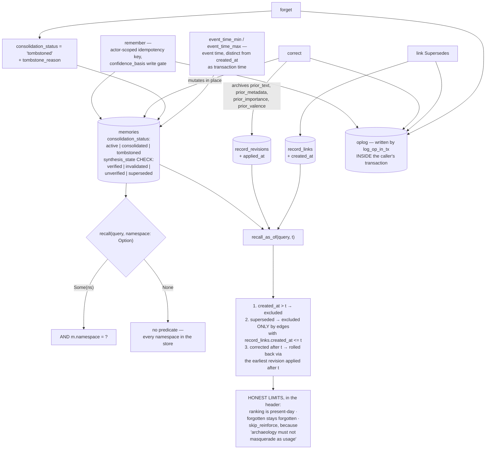

## 1. Executive Summary

This is the engine. The atlas has read it twice before through something else —
once as the crate that [yantrikdb-server](../yantrikdb/) wraps, once as the
in-process library the [Hermes plugin](../yantrikdb-hermes-plugin/) embeds —
and both times only as far as the wrapper's claims required. Read directly it
is 198,235 lines of Rust across five crates, Apache-2.0, at version 0.23.0,
with 2,274 test functions.

Its pitch is specific and correct about the problem: "Bolting a vector store
onto it doesn't fix that: nothing is ever forgotten, near-duplicate memories
pile up, and two contradictory facts come back ranked side by side with no
signal that they disagree."

What distinguishes it from every other large memory engine in this corpus is
not decay or consolidation — several have those. It is that the code states
what it cannot do, in the place where someone would otherwise assume it could.

`engine/bitemporal.rs` implements `recall_as_of(query, t)` — "what did this
database believe at time `t`?" — and then, under a heading reading **HONEST
LIMITS, documented rather than hidden**, lists three:

- "**Ranking is present-day.** Similarity is computed against today's vectors
  … `recall_as_of` reconstructs CONTENT and CURRENCY at `t`, not the exact
  ranking a query would have produced at `t`."
- "**Forgotten records stay forgotten.** A tombstoned record is physically out
  of the recall path … an as-of query cannot resurface something forgotten
  since `t`."
- "**Access stats are untouched.** The pool query runs with `skip_reinforce` —
  archaeology must not masquerade as usage."

That third one is a design decision most systems would not have noticed they
were making. Reading history should not look like using memory, because usage
feeds decay and decay decides what survives.

The same habit recurs. An index definition carries a note that the index does
**not** satisfy its query's `ORDER BY`, that the query's shape "defeats
index-served ordering anyway", and that "SQLite therefore MAY SORT THE FULL
ELIGIBLE SET" — attributed as a reviewer finding, with the resolution named.
The encryption migration warns that "THE SEAL IS NOT THE ERASURE" and vacuums
the freed pages.

The finding is about a boundary that is not the engine's to hold.

`recall` takes `namespace: Option<&str>`, and the `AND m.namespace = ?`
predicate appears only in the branches where a namespace was supplied. Pass
`None` and the query spans every namespace in the store. That is a defensible
library API — an embeddable engine should not force a tenancy model — but it
means the isolation the Hermes plugin is credited with is the plugin's
discipline, not a property of the store beneath it. Anything else embedding
this crate inherits the option, not the guarantee.

## 2. Mental Model

A **memory** is a row: text, embedding, and a set of stored decay parameters —
importance, half-life, last access, access count, valence — that are
"stored, not continuously updated", so decay is computed at read time rather
than swept.

A **correction** mutates in place and archives the prior text, metadata,
importance and valence into `record_revisions` with an `applied_at`.

A **supersession** is an edge in `record_links`, with its own `created_at`.

Those two ledgers are what make time travel possible without a second storage
model — the module says so explicitly: "Those two ledgers are enough to answer
an as-of query WITHOUT a new storage model."

An **op** is a row in the oplog, written inside the transaction that made the
change.

## 3. Architecture

| Area | Role |
| --- | --- |
| `crates/yantrikdb-core/src/base/schema.rs` | The whole schema as one SQL constant, heavily commented per version |
| `crates/yantrikdb-core/src/engine/bitemporal.rs` | `recall_as_of`, and its limits |
| `crates/yantrikdb-core/src/engine/recall.rs` | 6,768 lines of hybrid retrieval and the namespace branches |
| `crates/yantrikdb-core/src/engine/lifecycle.rs` | Decay, tombstoning, correction |
| `crates/yantrikdb-core/src/engine/stats.rs` | The oplog writers |
| `crates/yantrikdb-core/src/engine/thread.rs` | Conversation-thread reconstruction and its visibility test |
| `crates/yantrikdb-core/src/engine/audit.rs` | Synthesis-evidence integrity queries |
| `crates/yantrikdb-core/src/cognition/` | 156,204 lines: belief, contradiction, calibration, coherence, consolidation, counterfactual, metacognition |
| `crates/yantrikdb-python`, `-wasm`, `-tui`, `-ml` | The bindings the wrappers use |

## 4. Essential Implementation Paths

`engine/bitemporal.rs:1-36`. Read the header before the code; it is the best
thirty lines in the repository and it explains the design of everything under
it.

`base/schema.rs:31-170` for the memory row, which is a version-by-version
record of what the project learned — v25 replication determinism, v26 write
resolution, v27 and v28 reembed staging and generation stamps, v37 the
anti-laundering write gate, v42 synthesis lifecycle, v48 valid time, v50
source turn.

`engine/thread.rs:1605-1651` for the visibility test, which is the clearest
statement of what recall considers eligible.

## 5. Memory Data Model

The `memories` table is the accumulated design. Beyond the obvious columns it
carries `certainty`, `domain`, `source`, `emotional_state`, a `session_id`,
`due_at` and `temporal_kind` for prospective queries, `storage_tier`,
`consolidated_into`, and — as of v37 — `confidence_basis`, "the typed
justification tier (observation|asserted|confirmation|verification|inference|
assumption|learned(model-vX))" that "participates in the write-gate consistency
matrix", alongside an `idempotency_key` scoped by `origin_actor` so "two
writers can't collide".

Two columns encode time in the way the atlas asks for. `created_at` is named
in the comment as transaction time; `event_time_min` and `event_time_max` are
"valid time, first-class", mirrored from metadata by "every writer that
persists the metadata column (the `event_time_bounds` helper in
`base::datetext` is the single source)". Designating a single source for a
mirrored column is the detail that keeps a denormalised field honest, and it
is stated in the schema where a future writer will read it. Both are NULL on
encrypted stores, "so nothing is extractable at rest" — the limitation is
named rather than left as a surprise.

The CHECK constraints are uneven. `synthesis_granularity` and `synthesis_state`
are constrained to their vocabularies; `consolidation_status`, `type`,
`storage_tier` and `resolution_kind` are documented in comments and accept any
string. Given that `consolidation_status` is a read predicate in every audit
query, that asymmetry is worth noticing — the newer columns got the constraint
and the older load-bearing one did not.

## 6. Retrieval Mechanics

Hybrid retrieval with decay applied at read time from the stored half-life and
last access, graph expansion, and thread reconstruction.

The namespace predicate is the report's finding and deserves stating exactly.
`recall.rs` branches: where a namespace is supplied it appends
`AND m.namespace = ?N`; where one is not, the same query runs without it. The
column is `NOT NULL DEFAULT 'default'`, so every row has a namespace and no row
is invisible — but a caller passing `None` reads across all of them.

That is the right API for an embeddable engine and the wrong assumption for
anyone who reads the server's or the plugin's isolation guarantee and concludes
the store enforces it. It does not; those wrappers do, by never passing `None`.
The atlas's `scope_enforced` mark stays where the enforcement is.

`recall_as_of` over-fetches a candidate pool because as-of filtering removes
rows after ranking, and runs it with `skip_reinforce`. Results keep their
present-day `current_status`, so "a hit can honestly read 'this was current at
`t`; today it is superseded', which is exactly what an audit wants to see."

## 7. Write Mechanics

`remember` passes an actor-scoped idempotency claim whose `INSERT ... ON
CONFLICT` on the primary key "is the serialization point for same-key retries",
with a `pending -> committed` state so "a losing retry" cannot "observe a
not-yet-committed rid", and with `op_id`, `route` and `generation` kept as "the
recovery evidence used to complete-or-roll-back a crashed claim (never
row-existence)." That parenthesis is a real distinction: recovering from row
existence would make a partially applied write look complete.

`correct` mutates in place and archives; `link` records supersession as a dated
edge; `forget` tombstones with a caller-supplied reason and takes the row out
of the recall path and index.

The v26 columns are the honest gap. `prior_rid`, `resolution_kind` — `append`,
`update`, `merge`, `supersede`, `dismiss` — `dismissal_reason` and
`confidence_at_write` record which epistemic operation the write chose, and
the comment says why they are columns rather than JSON: "so conflict resolution
+ paper adoption analysis are first-class queries, not JSON-blob crawls."
They are written and, at this pin, not read back by any write path. A value
dismissed with a reason can be proposed again and appended, because nothing
consults the dismissal. The schema names them "[f]oundation for issue #30
WriteResolution API", which is an accurate description of their current state
and the reason `tombstone` is not awarded here.

## 8. Agent Integration

Rust crate, Python bindings on PyPI, WASM, and a TUI. The server and the Hermes
plugin are the two consumers the atlas has already read. `packs/` and
`pack_mounts` / `trusted_publishers` tables suggest a distribution mechanism
for pre-built memory sets with publisher trust, which is unusual and was not
followed here.

## 9. Reliability, Safety, and Trust

The oplog is the strongest piece. `log_op_in_tx` and `log_op_at_hlc_in_tx`
write the op inside the caller's transaction, so there is no window in which a
mutation is committed and its record is not. Twelve engine modules call it,
covering remember, correct, tombstone, link, conflict resolution, graph
mutations, procedural writes, reembedding and materialization. It is indexed by
timestamp, target rid, HLC and origin actor, and nothing deletes from it.

That is the inverse of the pattern this corpus usually shows, where an audit
table exists and each caller must remember to write to it. Here the transaction
is the enforcement.

Encryption at rest covers the oplog payload, and the migration that seals older
plaintext rows is careful about what sealing does not accomplish — it rewrites
the file afterwards because an `UPDATE` "writes the ciphertext to a new page
and frees the old", and a freed page is not an erased one.

The HLC (`base/hlc.rs`) gives the deterministic ordering that the synthesis
lifecycle uses "to select one verified logical synthesis", which is how a
distributed store picks a winner without a clock it can trust.

## 10. Tests, Evals, and Benchmarks

2,274 test functions, and the visibility test in `thread.rs` is the model: a
positive control, a forget, an exact assertion on the surviving rid list, then
a supersession and another exact assertion. Asserting the surviving set rather
than a count is what makes it an eval — a count of 2 would pass if the wrong
row had left.

`engine/tests/corrections.rs` drives the correction and oplog paths, and
`impressions.rs` carries a test named for exactly the right property:
`rollup_omissions_are_exact_positive_and_not_served_children`.

Benchmarks live in `benchmarks/`, and the README points at a measurement paper
whose reproducible scripts and raw CSVs sit in the *server* repository. The
[server report](../yantrikdb/) covers that material and the corrections file
that withdrew four earlier benchmark conclusions; it is not restated here.

## 11. For Your Own Build

Write the limits into the header. `bitemporal.rs` is a template: implement the
feature, then list what it does not do, in the file, above the code. A reader
who skims that header cannot form the wrong expectation, and a maintainer who
later makes one of the limits false has to delete a sentence to do it.

Take `skip_reinforce`. If retrieval feeds decay, then any read that is not a
use — an audit, a history query, a migration scan — must be excluded from the
statistics, or inspecting your memory keeps it alive. Almost nothing in this
corpus separates the two.

Take the supersession rule for as-of reads: a record is hidden from time `t`
only by an edge that already existed at `t`. The naive version — filter out
everything currently superseded — is the one most implementations write, and it
silently rewrites history with today's knowledge.

Put the audit write in the transaction. `log_op_in_tx` makes it impossible to
commit a change without its record; an audit helper called after the commit
makes it merely customary.

And decide whether your scope is a property of the store or of its callers. An
`Option` is a fine answer for a library — but say so, because a wrapper's
guarantee will be read as the engine's.

## 12. Open Questions

Whether the v26 write-resolution columns are intended to gate writes eventually
or to remain analytical. The comment says "[f]oundation for issue #30", which
suggests the former; at this pin nothing reads them.

Whether `consolidation_status` will gain the CHECK constraint its newer
siblings have. It is a read predicate in every audit query and currently
accepts any string.

How `CREATE TABLE IF NOT EXISTS` with "no migration constant" reaches existing
databases for columns added to the constant. The header states the convention —
"change is a new CREATE TABLE IF NOT EXISTS, and `SCHEMA_SQL` is executed" —
but an existing table is not recreated, so column additions must arrive by some
other path that was not traced here.

## Appendix: File Index

| Path | What to read it for |
| --- | --- |
| `crates/yantrikdb-core/src/engine/bitemporal.rs:1-36` | How to document what a feature cannot do |
| `crates/yantrikdb-core/src/base/schema.rs:31-184` | The memory row, versioned comment by comment |
| `crates/yantrikdb-core/src/engine/recall.rs:1855-1880` | The namespace predicate, and the branch without it |
| `crates/yantrikdb-core/src/engine/stats.rs:341-520` | The audit op written inside the caller's transaction |
| `crates/yantrikdb-core/src/engine/thread.rs:1605-1651` | A visibility test that asserts the surviving set |
| `crates/yantrikdb-core/src/engine/mod.rs:2495-2530` | Why sealing is not erasing |

## History

**2026-09-16** — [`b189e799bd854285471ec6149ff0f298cc594ec8`](https://github.com/yantrikos/yantrikdb/commit/b189e799bd854285471ec6149ff0f298cc594ec8) — first reading of the engine repository in its own right, at a commit dated 14 September 2026. The atlas had previously read these crates only as a pinned dependency of [yantrikdb-server](../yantrikdb/) at tag `v0.22.0`, and in process behind the [Hermes plugin](../yantrikdb-hermes-plugin/). Screened before opening, from a shallow clone; a dependency surface had changed inside the seven-day cooldown. Nothing was installed, built or run.
