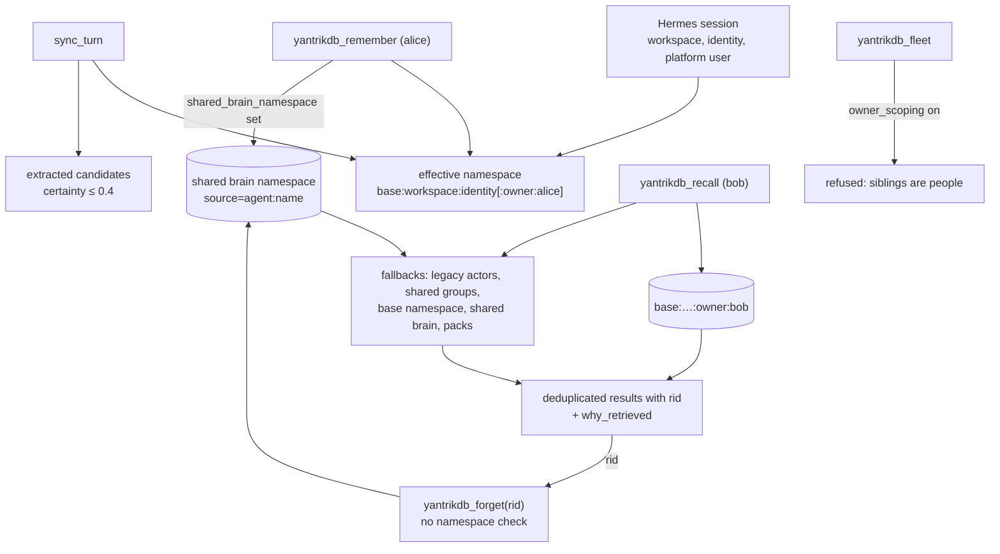

## 1. Executive Summary

yantrikdb-hermes-plugin is the memory provider that connects
[Hermes Agent](../hermes-agent/) to the [YantrikDB](../yantrikdb/) engine.
It is MIT, version 0.25.0, 124 commits since 15 April 2026, about 8,700 lines of
Python and 485 tests. Since version 0.2 the engine runs in process by default,
with no server. It is the canonical distribution: Hermes no longer merges memory
providers upstream.

The engine supplies recall with scoring reasons, consolidation, conflict
detection and entity relations. The plugin adds the Hermes side:

- a namespace per agent and, optionally, per person;
- automatic turn sync with a conservative extraction pass;
- prefetch and a pre-compression injection so constraints survive long sessions;
- skills with an outcome ledger, tasks, triggers, hygiene, knowledge gaps and
  mountable knowledge packs, all as tools.

Scope is taken from the host, not the model. The namespace is the configured base
plus the agent workspace and identity Hermes reports, and every engine call that
reads or maintains memory passes it. **Owner scoping** adds a shard per person
for shared gateways, group chats and family bots, resolving platform user ids
through an identity map. The plugin treats that boundary seriously: the
`yantrikdb_fleet` tool, which lists sibling namespaces, refuses to run under owner
scoping because "siblings are people there".

Two other paths cross the same boundary.

- **The shared brain.** `shared_brain_namespace` mirrors every explicit
  `remember` into one namespace that every session recalls. Nothing refuses
  it under owner scoping, so one person's remembered facts become every other
  person's recall.
- **Forget and conflict resolution.** `yantrikdb_forget` and
  `yantrikdb_resolve_conflict` act on an id alone. Ids arrive in recall results
  from the base namespace, shared groups and the shared brain, so one person's
  agent can delete memory that every person reads.

Two marks: `scope_enforced`, `negative_eval`.

## 2. Mental Model

Hermes calls a **memory provider** at session start, before each turn
(prefetch), after each turn (sync), before compression, and whenever the model
calls one of its tools.

The provider holds one **effective namespace** for the session and a list of
**fallback namespaces** it also reads:

- legacy per-actor namespaces, when an identity map merged actors into one owner;
- shared group spaces the owner belongs to;
- the base namespace, for memory written before owner scoping was switched on;
- the shared brain, when configured;
- the namespaces of mounted knowledge packs.

Writes go only to the effective namespace — except that explicit remembers are
also mirrored to the shared brain.

## 3. Architecture

| Module | Role |
| --- | --- |
| `yantrikdb/__init__.py` | The `YantrikDBMemoryProvider`: configuration schema, namespace and owner scope, prefetch and sync, tool schemas and handlers, packs, constitution, skills, recall feedback |
| `yantrikdb/client.py` | Configuration, the HTTP client, error types and circuit-breaker plumbing |
| `yantrikdb/embedded.py` | The in-process client over the engine's Python binding |
| `yantrikdb/extractor.py`, `embedders.py` | The cheap extraction pass and embedder selection |
| `yantrikdb/cli.py`, `ui.py` | The installer and a read-only local constellation page |
| `benchmarks/`, `tests/comparison/` | Recall, determinism, encryption and idle-CPU checks and a comparison gate |

### Deployment and ergonomics

- **Install:** `pip install yantrikdb-hermes-plugin`, `yantrikdb-hermes install`,
  then select the provider in `hermes memory setup`.
- **Backends:** embedded (default, a local database file) or a YantrikDB HTTP
  server for high-availability clusters.
- **Hand-repairable:** through the engine's own tools and the plugin's hygiene
  report; the database is not plain text.

The screen of this checkout found no auto-run surface, two build-time execution
points (test `conftest.py` files), one unpinned surface and `pyproject.toml`
inside the seven-day cooldown. Nothing was installed, built or run.

## 4. Essential Implementation Paths

- **Namespace** — `__init__.py:1202-1216` `_derive_namespace`, `:1750-1766`
  owner shard and shared group namespaces.
- **Owner resolution** — `:1057-1200`: actor id, conversation id, identity map,
  group map, `_derive_owner_scope`.
- **Recall** — `:2627-2740` `_do_recall`, through `_recall_with_base_fallback`
  (`:1987-2015`) and `_fallback_recall_namespaces` (`:1950-1971`).
- **Remember and mirror** — `:2548-2602`: write to the effective namespace, then
  to the shared brain when set (`:2580-2598`).
- **Forget and resolve** — `:2741-2747` and `:2772-2796`, calling
  `client.forget(rid)` and `client.resolve_conflict(conflict_id, …)`, which the
  embedded client forwards to the engine by id (`embedded.py:691-698`, `:793`).
- **Fleet refusal** — `:3272-3281`.
- **Turn sync** — `:2220-2320`: verbatim user message, extraction with
  `source=extracted` and low certainty, the confirmation carve-out.

## 5. Memory Data Model

The unit is the engine's memory. The plugin sets `importance` (estimated from
the text when not given), `domain`, `source`, `certainty` for extracted facts,
and metadata carrying the session id and, under owner scoping, the owner,
actor, channel and conversation. Relations, conflicts, tasks and triggers are
engine records. Skills are memories with a definition and outcomes recorded
against them. A local JSON ledger counts how often each memory was surfaced and
reinforced, and turns that into a recall boost.

`source=extracted` and certainty are provenance and a weight. Extracted facts
are filtered from default recall because of their source, not a belief status,
so `trust_state` is withheld. The plugin keeps no rejected-value record, no
validity axis and no mutation log, so `tombstone`, `bitemporal` and
`audit_log` are withheld. The engine's own properties are described in the
YantrikDB report.

## 6. Retrieval Mechanics

**Scoped recall.** The provider recalls from its effective namespace, then from
each fallback namespace with the same query, deduplicates and re-ranks, adds a
reinforcement boost from the feedback ledger, and returns each result with its
`rid` and `why_retrieved` reasons. Extracted low-certainty candidates are left
out unless the call asks for them.

**Prefetch and pre-compression.** Before a turn the provider recalls in the
background for the upcoming query. Before Hermes compresses the conversation it
injects the highest-salience memories so constraints stated early survive.

**What crosses owners.**

- The **base namespace** is recalled by default when owner scoping is on
  (`include_base_namespace_recall`, `client.py:245`). That is by design, for
  memory written before scoping, but it means scoping does not isolate that
  memory until the option is turned off.
- The **shared brain** receives a copy of every explicit remember from every
  session (`__init__.py:2580-2598`) and is recalled by every session
  (`:1961-1964`). The fleet tool's comment states the failure this creates:
  handing one user a view of everyone else's memory is "the
  identity-contamination failure that scoping exists to prevent".
  `initialize` does not clear the shared brain when owner scoping is on, and
  `_shared_brain_namespace` does not check it.

## 7. Write Mechanics

**Turn sync** stores the user message verbatim when enabled and extracts small
fact candidates from it. It extracts from the assistant's prior turn only when
the user replied with a bare confirmation, so the agent's own prose becomes a
candidate only with the user's assent.

**Explicit remember** writes with scope metadata and mirrors to the shared brain,
tagging the copy with the contributing agent and origin namespace.

**Forget and resolve act by id.** `_do_forget` passes the rid straight to the
client, and the embedded client calls the engine's `forget(rid)` with no
namespace. Conflict resolution passes a conflict id and an optional winner the
same way. Any rid a session has seen — including ones recalled from the base
namespace, a shared group or the shared brain — can be forgotten from that
session. Under owner scoping, one person's agent can delete memory that is part
of every person's recall. Remember, relate, think, conflicts and knowledge gaps
all pass the namespace; these two do not.

**Hygiene** lists low-usefulness and stale candidates and recommends actions,
without deleting.

## 8. Agent Integration

- **23 tools:** remember, recall, forget, think, conflicts, resolve_conflict,
  relate, stats, the four trigger tools, skill search, define and outcome,
  observability, extraction stats, hygiene, knowledge gaps, recent turns, fleet,
  packs and tasks.
- **System prompt block** with the constitution file, mounted pack rules and
  recent skills.
- **Packs** are sealed bundles of rules and knowledge mounted read-only into
  recall.
- **Local UI** at `127.0.0.1:8767`, a single-page view of the substrate that
  only serves GET requests.

## 9. Reliability, Safety, and Trust

**A circuit breaker** stops memory calls from blocking turns after repeated
backend failures, and background work runs on threads.

**The contract gate** runs the public client against the real engine and treats
each case as all or nothing, gating engine-dependent cases on feature probes
rather than version strings.

**Owner isolation is partial,** as sections 6 and 7 describe. The two exits sit
beside a tool that is refused for the same reason.

**Injection.** User messages are stored verbatim, and pack rules enter the
system prompt; the constitution and packs are author-controlled files.

## 10. Tests, Evals, and Benchmarks

485 tests cover the provider, owner scoping and its fallbacks, the embedded and
HTTP clients, packs, fleet, delegation, extraction, the adaptive budget and
version-specific features, with integration and comparison suites. None was run
for this report.

**Negative retrieval.** `tests/test_semantic_contract.py:81` asserts, on the
real engine, that one tenant's secret never appears in another's recall beside
its own, and `:92` does the same for knowledge gaps. That earns `negative_eval`.
`tests/test_fleet.py:57` asserts the fleet tool refuses under owner scoping. No
test combines owner scoping with a shared brain, or forgets across owners.

**Benchmarks.** `benchmarks/run_recall_bench.py` runs a committed
`dataset.json`; `VERIFICATION.md` records two live end-to-end runs against Hermes
with transcripts.

## 11. For Your Own Build

### Steal

- **Derive the namespace from the host session,** never from a tool argument.
- **Carry legacy namespaces forward** when an identity map merges actors, so
  turning scoping on does not orphan old memory.
- **Extract from the agent's prose only on user assent.**
- **Refuse a cross-scope view outright** and say why, as the fleet tool does.
- **A semantic contract suite on the real engine,** all or nothing per case.

### Avoid

- **Shared namespaces that are not re-checked against a stricter scope** turned
  on later.
- **Id-only deletion** in a store that serves several scopes.

### Fit

This suits a Hermes Agent user who wants self-maintaining memory with conflicts,
explanations and skills, in process with no server, for one person or several
agents. For a gateway serving several people, owner scoping works as long as the
shared brain stays unset, base recall is disabled once old memory is migrated,
and forget is not relied on to respect owners.

## 12. Open Questions

- **Should owner scoping disable or shard the shared brain,** as it refuses the
  fleet view?
- **Should forget and resolve check that the rid belongs to the session's
  readable namespaces?**
- **Should base-namespace recall default off** once scoping is enabled on a
  fresh store?

## Appendix: File Index

- `yantrikdb/__init__.py`, `yantrikdb/client.py`, `yantrikdb/embedded.py`, `yantrikdb/extractor.py`, `yantrikdb/ui.py`
- `tests/test_semantic_contract.py`, `tests/test_provider.py`, `tests/test_fleet.py`
- `VERIFICATION.md`, `benchmarks/`

**Searches behind the absence claims**

- `grep -n "owner_scoping" yantrikdb/__init__.py` — checked in initialise, fallback helpers and fleet; not in `_shared_brain_namespace` or `_do_remember`
- `sed -n 2741,2747p yantrikdb/__init__.py` — `forget(rid)` with no namespace
- `grep -n "def do_POST\|def do_DELETE" yantrikdb/ui.py` — no match; the UI is read-only

## History

**2026-09-16** — [`c301188e624561b36b25f1b30b0698cfa5b754b1`](https://github.com/yantrikos/yantrikdb-hermes-plugin/commit/c301188e624561b36b25f1b30b0698cfa5b754b1) — first reading, at a commit dated 14 September 2026. Screened before opening: no auto-run surface, two build-time execution points, one unpinned surface, and one dependency file inside the cooldown. Nothing was installed, built or run.
