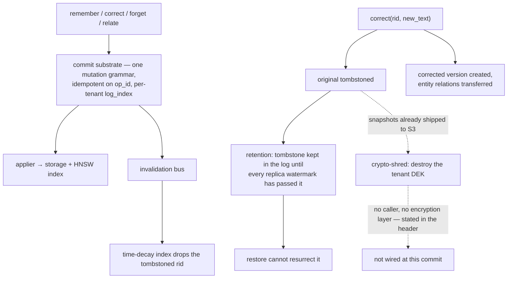

## 1. Executive Summary

YantrikDB is a memory database in Rust — about 63,000 lines across six crates,
AGPL-3.0 — that positions itself against vector databases on lifecycle rather
than retrieval: "Vector databases store memories. They don't manage them." It
ships as an embeddable crate, a server, an MCP endpoint, a Python client and a
WASM build.

**The first thing to read is `CORRECTIONS.md`, and it is why this report
exists.**

On 2026-04-19 the project withdrew four published conclusions from its own
Phase 3 benchmarks. The reason, stated in the file: the condition labelled
`C_structured` / "structured memory" had been implemented by a "~120-line Python
module that stored memories as a list of `(key, value, session)` tuples with Dice
word-overlap retrieval". The file then enumerates what that simulator lacked —
no embeddings, no `think()` loop, no multi-signal scoring, no knowledge graph, no
conflict detection, no temporal validity — and concludes that the benchmarks
measured "'stripped-down key/value dict vs markdown' — not 'yantrikdb vs
markdown'".

Four named conclusions are listed as withdrawn, including "40% stale-rate shows
structured memory can't handle supersession" and "Null result on RFC 006
temporal substrate". The section on how it was caught quotes the maintainer's own
words from a consultation — *"the core functionality did not run at all"* —
followed by four words: **"Correct observation. No defense."**

The rerun is committed as `docs/phase3e/` with raw harness logs, and the
preliminary numbers move substantially in the project's favour. That is the part
worth noticing: the correction was published *before* the favourable rerun was
complete, and the withdrawn conclusions were ones that made the project look
worse. The file's own justification is the sentence this atlas would write:
"Preserved publicly because the audit trail matters more than a clean-looking
repo."

**The second thing is the deletion design.** `commit/retention.rs` implements
what RFC 011 calls **restore-no-resurrect**: "a memory that was tombstoned and
whose tombstone has propagated to all replicas must not [come back]", enforced by
keeping tombstone entries in the log "at least until every [replica has seen
them]" and gating watermark advancement on it. Beside it, `forget/crypto_shred.rs`
destroys a tenant's data-encryption key so that "every encrypted blob (live +
backup) becomes ciphertext nobody can decrypt".

And that module's header says, under a heading of its own, exactly what is not
built: wiring the shredder into the tenant-delete path, the encryption layer that
would produce the blobs needing that key, and the admin `DELETE` endpoint that
would call it. "RFC 011 PR-4 substrate is just the destruction orchestrator."

## 2. Mental Model

A memory carries text, `certainty`, `importance`, `valence`, `domain`, `source`
and an `emotional_state`. It lives in a namespace inside a tenant.

The lifecycle verb set is unusually explicit: `remember`, `recall`, `forget`,
`relate`, `correct`, and `think`. The last is the distinguishing one — an
operator-invoked consolidation and conflict-scan pass rather than a background
daemon, so a caller decides when the database thinks about what it holds.

`correct` is the interesting mutation. It does not edit in place: the original is
tombstoned, a new version is created, "entity relationships are transferred to
the new memory", and an optional `correction_note` records why.

The dotted path is the one the module documents as incomplete, drawn where its
own header puts it.

## 3. Architecture

Six crates: `yantrikdb-server` (59,700 lines) holds everything, with
`yantrikdb-protocol`, `yql` (a query language), `yantrikdb-witness`,
`yantrikdb-wasm` and `yantrikdb-ml` around it.

The server is organised by concern in a way that reads like a database rather
than a memory library: `admission` (with a circuit breaker), `auth`, `backup`,
`cluster`, `commit`, `forget`, `index`, `jobs`, `key_provider`, `migrations`,
`pack_store`, `restore`, `retrieval`, `security`, `tenant_pool`, `yrp` (the
consensus/replication path) and `socratic` (the conflict layer).

`commit/mod.rs` is the spine and its design contract is worth quoting because it
is the discipline most memory systems in this atlas lack: every write "flows
through this module instead of mutating storage directly", producing "a single
canonical mutation grammar, a single durable log shape, and a single trait that
the API handlers call". Commits are idempotent on `op_id` so clients can retry,
and `log_index` is monotonic **per tenant** — multi-tenant servers "do NOT share
log indices (avoids cross-tenant leakage…)".

`LocalSqliteCommitter` is the single-node implementation and an openraft-backed
`RaftCommitter` is named as the cluster one, both behind the same trait, so "the
API handlers don't change between modes".

## 4. Essential Implementation Paths

**Write** — API handler → `MutationCommitter::commit` → `memory_commit_log` →
`applier` → storage, HNSW index, and the invalidation bus.

**Correct** — `memory_correct` (`src/yantrikdb/mcp/tools.py:264`) → `db.correct`
→ tombstone plus new version plus relation transfer.

**Forget** — `memory_forget` → `db.forget` → a tombstone mutation, an
`InvalidationEvent::Tombstoned { tenant_id, rid }` on the bus, and the time-decay
index dropping the row (`retrieval/time_decay.rs:332`).

**Retention** — `commit/retention.rs` reconciles four watermarks (source log,
backup manifest, tombstone, replica) before archiving or truncating.

**Think** — `/v1/think` runs consolidation and the conflict scan; `socratic/`
holds the evidence and operator layer behind it.

## 5. Memory Data Model

The memory row is small and the interesting fields are affective and epistemic
rather than structural: `certainty` (a float), `importance`, `valence` (−1 to
1), `emotional_state`, `domain`, `source`.

Around it sit the database's own structures — the commit log with `op_id` and
per-tenant `log_index`, the pack store, the HNSW index, and the time-decay index
which "materializes that sort" per `(tenant_id, namespace)` so the
most-decayed-first query does not scan.

There is no status field, no validity interval and no supersession pointer on the
row. Correction is expressed as a *pair of mutations in the log* — tombstone the
old, insert the new — rather than as state on the record. That is a database's
answer rather than a memory system's, and it has a real consequence: the history
lives in the log and the row shows only the present.

## 6. Retrieval Mechanics

Multi-signal scoring over an HNSW vector index, blending similarity, temporal
decay, importance and graph structure, with namespace-scoped recall.

The time-decay index is the piece worth naming. Rather than computing decay at
query time across the corpus, it materialises the decayed ordering per
`(tenant_id, namespace)` and keeps it in sync with commit-log mutations by
subscribing to the invalidation bus. A tombstone published on the bus removes the
row from the index; the comment notes the coarse-grained approach is acceptable
because "tombstones are rare and per-tenant scoping [bounds the cost]".

Scope is `tenant_id` plus `namespace` throughout, reinforced by the per-tenant
log and the tenant pool. The rerun harness in `docs/phase3e/` uses
"namespace-scoped recall for per-experiment isolation", which is the same
mechanism used as an experimental control.

## 7. Write Mechanics

The single-committer design is the strongest architectural choice here. Because
every mutation — including tenant config changes — goes through one grammar and
one log, the questions this atlas usually has to answer by tracing several
subsystems ("does forget also update the index?", "can a background pass undo a
correction?") reduce to "what does the applier do with this mutation".

Idempotency on `op_id` means a retried write returns the original receipt rather
than duplicating, which is the correctness property most memory systems here
leave to chance.

**No rejected-value record exists.** The tombstone is keyed on `rid`. Its
guarantees are about durability and replication — that a delete survives a
restore, that it propagates before the log truncates — not about refusing a
re-assertion of the same content. `correct` produces a new memory whose text is
whatever the caller supplied; nothing compares it against previously tombstoned
values.

## 8. Agent Integration

An MCP server with `memory_remember`, `memory_recall`, `memory_forget`,
`memory_correct`, `memory_relate`, `memory_think` and a stats tool reporting
"counts of active, consolidated, tombstoned, and archived memories" — exposing
the lifecycle state distribution to the agent, which is a small good idea.

Also an HTTP API (`/v1/remember`, `/v1/recall`, `/v1/think`), a Python client, an
embeddable crate and a WASM build. Client-side embeddings are supported and used
in the rerun harness.

## 9. Reliability, Safety, and Trust

**Scope — awarded.** `tenant_id` and `namespace` reach the storage layer, the
time-decay index, the invalidation bus and the commit log, and the log's design
contract names cross-tenant leakage as the thing per-tenant indices prevent.

**Audit log — awarded.** `memory_commit_log` is the durable record of every
mutation, append-only, idempotent on `op_id`, with retention gated on watermarks
rather than time alone. It is a database write-ahead log doing double duty as the
memory audit trail, which is a legitimate and unusually rigorous way to get one.

**Tombstone — withheld**, for the reason in section 7. What YantrikDB has
instead is the best *deletion durability* story in this atlas, and it is a
different axis: restore-no-resurrect, tombstone propagation watermarks, and a
crypto-shred design for backups.

**Trust state — no.** `certainty` is a float; conflict detection is a scan.

**Bitemporal, human review, negative eval — no.** `ShredPlan` is the nearest
thing to a review surface — it is "returned by `prepare()` before any destructive
op runs, so operators (or the admin API) can preview + confirm" — and it belongs
to an unwired path.

**The candour is the safety property.** Two modules in this tree state their own
incompleteness in their headers: crypto-shred lists three missing pieces under
"What's NOT here (deferred)", and the commit module names which implementation
lands in which PR. A reader can tell what runs from what is planned without
reading the code, which is the opposite of the situation in several other
reports here.

## 10. Tests, Evals, and Benchmarks

**No paper**, and an unusual amount of committed methodology: `DESIGN.md`,
`CONCURRENCY.md`, `ROADMAP.md`, `MCP_REDESIGN.md`, numbered RFCs referenced
throughout the code, and `docs/phase3*/` holding the benchmark work.

**I did not run anything.** The screen flagged ten dependency manifests inside
the seven-day cooldown including `Cargo.lock` and `uv.lock`; the tree was read.

The benchmark story is the report. Phases 3A–3D are published, then withdrawn in
part; Phase 3E is the rerun against the real engine over HTTP with client-side
MiniLM-L6-v2 embeddings, `/v1/think` after each session, and namespace isolation
per experiment. Raw harness logs are committed
(`harness_3c_full_pipeline_log.txt`, `harness_3c_rerun_freshdb_log.txt`).

The preliminary rerun at n=2 moves overall score 0.584 → 0.850, supersession
accuracy 0.500 → 0.800 and stale-error rate 0.400 → 0.200. **n=2 is two runs**,
the file says "preliminary", and this report repeats neither the old numbers nor
the new ones as findings. What is checkable is the process: the withdrawal names
its own errors, the rerun is committed with logs, and the README carries the
correction notice at the top rather than in a changelog.

## 11. For Your Own Build

### Steal

- **Publish the correction, and publish it before the favourable rerun.**
  `CORRECTIONS.md` names four withdrawn conclusions, the file that produced them,
  and what that file lacked. "Preserved publicly because the audit trail matters
  more than a clean-looking repo" is the whole argument.
- **Route every mutation through one committer.** One grammar, one log, one
  trait, idempotent on `op_id`, and suddenly "does forget update the index" has a
  single answer instead of six.
- **Give each tenant its own log index.** Sharing a monotonic counter across
  tenants leaks ordering information and couples their retention; separating them
  costs nothing.
- **Keep a tombstone in the log until every replica has seen it.**
  Restore-no-resurrect is the property every backup story needs and almost none
  states, and it is a watermark comparison.
- **Reconcile watermarks before truncating.** Source log, backup manifest,
  tombstone and follower position — truncate on the minimum, not on age.
- **Materialise the decayed ordering per scope and maintain it from the
  mutation bus.** Computing decay at query time over the whole corpus is the
  common design and it does not survive scale.
- **Say what is not wired, in the header, with a list.** Two modules here do it;
  it turns a gap from a defect a reader discovers into a decision the author
  recorded.
- **Return a plan before a destructive operation.** `ShredPlan` previews what is
  about to be destroyed so an operator can confirm, and `ShredOutcome` records
  what actually happened including the idempotent already-gone case.

### Avoid

- **Do not benchmark your own condition with a proxy.** A 120-line dict with
  Dice overlap standing in for the engine invalidated four conclusions across
  four experiment phases. If the condition is your product, run your product.
- **Do not read the crypto-shred as shipped erasure.** The orchestrator exists;
  the encryption layer, the caller and the endpoint do not, and the header says
  so.
- **Do not expect a correction to prevent re-assertion.** `correct` tombstones
  the original and inserts whatever text the caller supplies; the log records
  both and refuses neither.
- **Do not read n=2 preliminary numbers as a result.** The project labels them;
  a reader skimming the table is the risk.

### Fit

This suits a team that wants agent memory with database properties — a commit
log, tenancy, replication, retention, backup and restore — and is willing to run
a Rust server and accept AGPL-3.0. It is the most operationally serious system in
this batch and the least opinionated about cognition: `certainty` and `valence`
are fields, not mechanisms.

Anyone building a memory *store* rather than a memory *layer* should read
`commit/mod.rs` and `commit/retention.rs`. They are the clearest statement in
this atlas of what deletion has to mean once replicas and backups exist.

## 12. Open Questions

- **Is the Phase 3E rerun finished?** The README promised "full corrected
  findings post coming 2026-04-20"; what is committed is preliminary at n=2.
- **Has crypto-shred been wired since?** Three pieces are listed as deferred; a
  later commit may have landed them, and at this one the erasure claim rests on
  logical tombstones only.
- **What does the `think` loop do with a detected conflict?** `socratic/` holds
  evidence and an operator; whether a conflict resolves automatically, surfaces,
  or waits was not traced.
- **Is `RaftCommitter` implemented?** The header names it as landing in PR-4;
  which committer a real deployment runs decides whether restore-no-resurrect is
  exercised at all.

## Appendix: File Index

**The correction** — `CORRECTIONS.md` (what was wrong `:9`, where it was cited
`:35`, how it was caught `:45`, the rerun `:53`), the README notice `:3-9`,
`docs/phase3e/` (`FINDINGS_POST_DRAFT.md`, the raw harness logs)

**Commit substrate** — `crates/yantrikdb-server/src/commit/mod.rs` (the design
contract `:16-25`), `local.rs`, `applier.rs`, `mutation.rs`, `submitter.rs`,
`trait_def.rs`, `tenant_pool.rs`

**Deletion** — `crates/yantrikdb-server/src/commit/retention.rs`
(restore-no-resurrect `:45-50`), `crates/yantrikdb-server/src/forget/crypto_shred.rs`
(the rationale `:16-23`, the deferred list `:25-33`),
`crates/yantrikdb-server/src/restore/`, `backup/`

**Correction and forget** — `src/yantrikdb/mcp/tools.py:248` (`memory_forget`),
`:264` (`memory_correct`), `src/yantrikdb/cli.py:59`

**Retrieval** — `crates/yantrikdb-server/src/retrieval/time_decay.rs` (the
materialised index `:13`, the invalidation subscriber `:314-340`),
`crates/yantrikdb-server/src/index/`, `crates/yql/`

**Conflict** — `crates/yantrikdb-server/src/socratic/` (`evidence.rs`,
`operator.rs`)

**Operations** — `crates/yantrikdb-server/src/admission/circuit_breaker.rs`,
`jobs/`, `yrp/` (consensus, with fail-stop on persistence uncertainty),
`key_provider/`, `security/`, `pack_store.rs`, `pack_reconciler.rs`

**Documentation** — `DESIGN.md`, `CONCURRENCY.md`, `ROADMAP.md`,
`MCP_REDESIGN.md`, `SERVER_README.md`

## History

**2026-08-09** — [`f8378f98bb0d25128f473ab4e7c5cac829c22773`](https://github.com/yantrikos/yantrikdb-server/commit/f8378f98bb0d25128f473ab4e7c5cac829c22773) — first reading. Screened before reading: no auto-run surface, no build-time execution, ten dependency manifests inside the seven-day cooldown including `Cargo.lock` and `uv.lock`. The tree was read, never built, and no test or benchmark was run.
