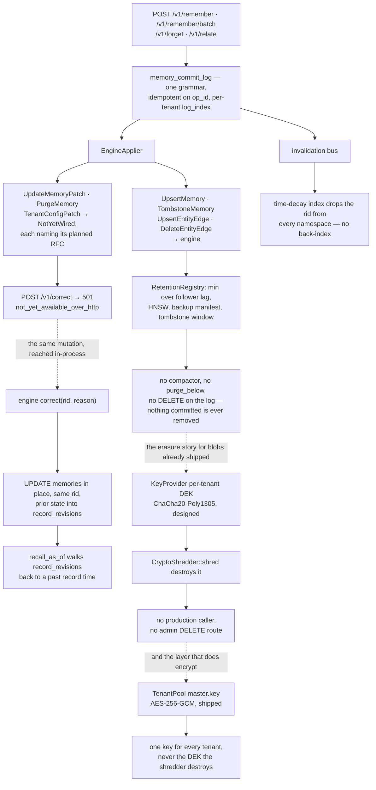

## 1. Executive Summary

YantrikDB is a memory database in Rust — 64,508 lines across six crates,
Apache-2.0 — that positions itself against vector databases on lifecycle rather
than retrieval: "Vector databases store memories. They don't manage them." It
ships as an embeddable crate, a server, an MCP endpoint, a Python client and a
WASM build.

**Those six crates are the smaller half.** The memory row, recall, decay,
extraction, `correct`, the claim lane and the as-of query all live in
`yantrikos/yantrikdb`, a different repository pinned by tag in
`crates/yantrikdb-server/Cargo.toml:35` — 195,589 lines of Rust against this
repository's 64,508. This report's subject is the server; where a claim needs the
engine it names the engine's file at tag `v0.22.0`. The memory data model in
section 5 cannot be read from this repository alone, and neither can what
`correct` does.

**The project relicensed.** Every crate manifest carries `Apache-2.0` and a
`NOTICE` names the copyright holder; `crates/yql` is MIT and was MIT under the
old licence too. The old licence was AGPL-3.0-only, and `CHANGELOG.md` — which
does record four engine releases, a pack-mount fix and a SQLite-safety refusal
over the same span — does not mention the change.

**The first thing to read is `CORRECTIONS.md`, and it is why this report
exists.**

On 2026-04-19 the project withdrew four published conclusions from its own
Phase 3 benchmarks. The reason, stated in the file: the condition labelled
`C_structured` / "structured memory" had been implemented by a "~120-line Python
module that stored memories as a list of `(key, value, session)` tuples with Dice
word-overlap retrieval". The file then enumerates what that simulator lacked —
no embeddings, no `think()` loop, no multi-signal scoring, no knowledge graph, no
conflict detection, no temporal validity — and concludes that the benchmarks
measured "'stripped-down key/value dict vs markdown' — not 'yantrikdb vs
markdown'".

Four named conclusions are listed as withdrawn, including "40% stale-rate shows
structured memory can't handle supersession" and "Null result on RFC 006
temporal substrate". The section on how it was caught quotes the maintainer's own
words from a consultation — *"the core functionality did not run at all"* —
followed by four words: **"Correct observation. No defense."**

The rerun is committed as `docs/phase3e/` with raw harness logs, and the
preliminary numbers move substantially in the project's favour. That is the part
worth noticing: the correction was published *before* the favourable rerun was
complete, and the withdrawn conclusions were ones that made the project look
worse. The file's own justification is the sentence this atlas would write:
"Preserved publicly because the audit trail matters more than a clean-looking
repo."

**The second thing is the deletion design, and it is a design.**
`commit/retention.rs` implements what RFC 011 calls **restore-no-resurrect**: "a
memory that was tombstoned and whose tombstone has propagated to all replicas
must not [come back]", computed as the minimum across four contributors —
follower lag, HNSW source-log watermark, backup manifest, tombstone window.
Nothing outside the module constructs the registry that collects them. The
compactor that would consume the watermark, in the module's own words, "lives in
a future PR"; `purge_below` appears exactly once in the repository and that
occurrence is inside the sentence deferring it; and no `DELETE` or `UPDATE`
against `memory_commit_log` exists anywhere in the tree. Nothing that was
committed has ever been removed, so the invariant holds — by the absence of a
compactor, not by the watermark arithmetic.

Beside it, `forget/crypto_shred.rs` destroys a tenant's data-encryption key so
that "every encrypted blob (live + backup) becomes ciphertext nobody can
decrypt". Its header lists three missing pieces, and one of the three is no
longer missing in the form stated. **There is an at-rest encryption layer.**
`TenantPool::get_engine` opens every engine through `YantrikDB::new_encrypted`
when a `master.key` is present (`tenant_pool.rs:73-77`), and `/v1/health/deep`
reports it as AES-256-GCM (`http_gateway.rs:605-610`). What does not exist is an
encryption layer keyed on the per-tenant DEK the shredder destroys: one
server-wide key encrypts every tenant, `KeyProvider::get_key` is called from
nothing but the shredder's own test module, and destroying a tenant's DEK
therefore renders nothing unreadable. The other two — the tenant-delete caller
and the admin `DELETE` endpoint — are absent; `CryptoShredder::new` and
`LocalKeyProvider::new` have no production caller either.

## 2. Mental Model

A memory carries text, `certainty`, `importance`, `valence`, `domain`, `source`
and an `emotional_state`. It lives in a namespace inside a tenant.

The lifecycle verb set is unusually explicit: `remember`, `recall`, `forget`,
`relate`, `correct`, and `think`. The last is the distinguishing one — an
operator-invoked consolidation and conflict-scan pass rather than a background
daemon, so a caller decides when the database thinks about what it holds.

`correct` is the interesting mutation, and it edits in place. The engine
keeps the `rid`, keeps `created_at`, `UPDATE`s the row, and appends the prior
text, metadata, importance and valence to `record_revisions` in the same
transaction — "preserving `rid` (no new memory minted)", so inbound graph edges
and replication entries keep resolving without any transfer step
(`engine/lifecycle.rs:840-869` at `v0.22.0`). A non-empty `reason` is required:
"the audit trail is load-bearing: it is what gives `correct()` its semantic value
over a bare UPDATE". Changing the embedding is explicitly not supported, because
HNSW cannot update a vector in place, and callers who need that are told to use
`forget()` then `record()` — which the doc comment names as "the v0.7.19-and-
earlier behaviour" of `correct` itself.

The three dotted edges are the seams. `correct` does not enter the commit log at
all: the route that would put it there returns 501, and the mutation happens
in-process instead, so the in-place update and the log are separate stories.
Crypto-shred hangs off a retention path that never runs. And the layer that
actually encrypts is a fourth thing again — one server-wide key, reached from a
different module, with no edge to the key the shredder destroys.

## 3. Architecture

Six crates: `yantrikdb-server` (61,066 lines) holds the server, with
`yantrikdb-protocol`, `yql` (a query language), `yantrikdb-witness`,
`yantrikdb-wasm` and `yantrikdb-ml` around it. The engine they wrap is the
`yantrikdb` crate from `yantrikos/yantrikdb`, pinned by git tag — `v0.13.1` at
`v0.22.0`, with a schema that migrates from v42 to v54 on first open.
`http_gateway.rs` alone is 9,858 lines.

The server is organised by concern in a way that reads like a database rather
than a memory library: `admission` (with a circuit breaker), `auth`, `backup`,
`cluster`, `commit`, `forget`, `index`, `jobs`, `key_provider`, `migrations`,
`pack_store`, `restore`, `retrieval`, `security`, `tenant_pool`, `yrp` (the
consensus/replication path) and `socratic` (the conflict layer).

`commit/mod.rs` is the spine and its design contract is worth quoting because it
is the discipline most memory systems in this atlas lack: every write "flows
through this module instead of mutating storage directly", producing "a single
canonical mutation grammar, a single durable log shape, and a single trait that
the API handlers call". Commits are idempotent on `op_id` so clients can retry,
and `log_index` is monotonic **per tenant** — multi-tenant servers "do NOT share
log indices (avoids cross-tenant leakage…)".

`LocalSqliteCommitter` is the single-node implementation. **The cluster one is
not called what the code says it is.** Thirteen doc comments across seven files
name `RaftCommitter` as the cluster implementation arriving in "RFC 010 PR-4";
no type by that name exists, openraft is gone — `Cargo.toml:123` records it
"removed in Phase D (saga 239)" and `config/mod.rs:518-536` refuses a
`raft_mode = "openraft"` config at load with a migration message — and the third
`impl MutationCommitter` is `YrpCommitter` at `yrp/runtime.rs:1142`, over RFC
028's own replication protocol. The trait boundary the comments claim is real;
the name on the far side of it is a ghost. This is the first of three places
where a header outlived the code it describes, and it is why section 9's reading
of the project's candour has changed.

## 4. Essential Implementation Paths

**Write** — API handler → `MutationCommitter::commit` → `memory_commit_log` →
`applier` → storage, HNSW index, and the invalidation bus.

**Correct** — `memory_correct` (`src/yantrikdb/mcp/tools.py:264`) → `db.correct`
→ an in-place `UPDATE` under the same `rid` plus a `record_revisions` row, in one
transaction. The Python FastAPI app exposes the same call at
`POST /memories/{rid}/correct` (`src/yantrikdb/api.py:228`) and its docstring
still says "tombstones original, creates corrected version", which the engine
stopped doing at v0.7.20. The Rust gateway's `POST /v1/correct` returns 501.

**Forget** — `memory_forget` → `db.forget` → a tombstone mutation, an
`InvalidationEvent::Tombstoned { tenant_id, rid }` on the bus, and the time-decay
index dropping the row (`retrieval/time_decay.rs:332`).

**Retention** — `commit/retention.rs` reconciles four watermarks (source log,
backup manifest, tombstone, replica) into a `SafePurgeWatermark`. Nothing reads
it. `RetentionRegistry`, `SafePurgeWatermark` and all four contributors are
re-exported from `commit/mod.rs:72-74` and constructed nowhere else in the tree,
and `MutationCommitter` has no purge or compact method to call
(`commit/trait_def.rs:275-326`).

**Think** — `/v1/think` runs consolidation and the conflict scan; `socratic/`
holds the evidence and operator layer behind it.

## 5. Memory Data Model

The memory row is defined in the engine, not here.
`crates/yantrikdb-core/src/base/schema.rs:31` at tag `v0.22.0` is the
`CREATE TABLE memories`. Beside the affective and epistemic fields — `certainty`,
`importance`, `valence` (−1 to 1), `emotional_state`, `domain`, `source` — it
carries a `consolidation_status` of `active | consolidated | tombstoned`, and two
migrations added `event_time_min` and `event_time_max` (`schema.rs:3196-3197`)
with an index over them.

Around it sit the database's own structures — the commit log with `op_id` and
per-tenant `log_index`, the pack store, the HNSW index, and the time-decay index
which "materializes that sort" per `(tenant_id, namespace)` so the
most-decayed-first query does not scan.

So the row carries a status field and a validity interval, and supersession is a
`supersedes` edge in `record_links` that `recall` can be asked to include.
Correction is not a pair of mutations: it is an in-place `UPDATE` plus a
`record_revisions` row carrying the prior text, metadata, importance and valence
with an `applied_at`.

The history, then, does not live in the commit log — `correct` never reaches the
log — it lives in `record_revisions`, per record, and `recall_as_of` reconstructs
a past state by walking it. Three of those structures reach a caller: the status
as the active/consolidated/tombstoned/archived counts reported by the MCP stats
tool and the CLI (`cli.py:59`), supersession through the wire protocol's
`include_superseded` flag (`command.rs:42`, forwarded at `handler.rs:172`), and
the revisions through `POST /v1/temporal/as_of`. The fourth reaches nobody.
`event_time_min` and `event_time_max` are the engine's **valid-time** axis, and
both of the server's `db.recall` call sites pass `None` for `event_after` and
`event_before` (`handler.rs:173-174`, `:193-194`) under a comment calling the
forwarding "a separate change". See section 9 for what that costs.

## 6. Retrieval Mechanics

Multi-signal scoring over an HNSW vector index, blending similarity, temporal
decay, importance and graph structure, with namespace-scoped recall.

The time-decay index is the piece worth naming. Rather than computing decay at
query time across the corpus, it materialises the decayed ordering per
`(tenant_id, namespace)` and keeps it in sync with commit-log mutations by
subscribing to the invalidation bus. A tombstone published on the bus removes the
row from the index; the comment notes the coarse-grained approach is acceptable
because "tombstones are rare and per-tenant scoping [bounds the cost]".

Scope has two tiers and only one of them is a filter. A tenant is a database
record whose engine `TenantPool::get_engine` opens at its own
`<tenant>/yantrik.db` — a separate file, which is a partition. A namespace is a
column: both `db.recall` call sites in `handler.rs` forward it, and the engine's
recall SQL appends `AND m.namespace = ?N` at sixteen points in `recall.rs`,
and a namespace predicate appears ninety-three times across the engine core. The
read-path predicate is the namespace, and that is where the scope mark sits.

One path does not carry it. The time-decay index's invalidation subscriber
removes a tombstoned rid "across all namespaces (we don't know which namespace it
was in without a back-index, so we walk all)" (`time_decay.rs:313-317`). The rid
is a UUIDv7 primary key so the effect is benign, but the maintenance path is
namespace-blind by its own admission.

The rerun harness in `docs/phase3e/` uses "namespace-scoped recall for
per-experiment isolation", which is the same mechanism used as an experimental
control.

## 7. Write Mechanics

The single-committer design is the strongest architectural choice here, and its
reach is narrower than the design contract sounds. One grammar and one log do
mean that "does forget also update the index?" reduces to "what does the applier
do with this mutation" — but the answer, for three of the grammar's seven
variants, is that it refuses. `EngineApplier` applies `UpsertMemory`,
`TombstoneMemory`, `UpsertEntityEdge` and `DeleteEntityEdge`;
`UpdateMemoryPatch`, `PurgeMemory` and
`TenantConfigPatch` each return `ApplyError::NotYetWired` naming the RFC that
would land them — "RFC 011-A correct semantics", "RFC 011 PR-3", "RFC 021 PR-2"
(`commit/applier.rs:459-469`). None of the three has a production constructor:
every `MemoryMutation::UpdateMemoryPatch`, `::PurgeMemory` and
`::TenantConfigPatch` in the tree is a match arm, a wire-format round-trip test,
or a unit-test fixture. So tenant config changes do not go through the log;
nothing puts them there.

What the log does carry, it carries well. `INSERT INTO memory_commit_log` at
`commit/local.rs:315` is the only statement that writes the table, no `UPDATE` or
`DELETE` against it exists anywhere, and four production routes reach it —
`remember`, `remember/batch`, `forget`, `relate`. Idempotency on `op_id` means a
retried write returns the original receipt rather than duplicating, which is the
correctness property most memory systems here leave to chance.

**No rejected-value record governs a memory write.** The tombstone is keyed on
`rid`. Its guarantees are about durability and replication — that a delete
survives a restore, that it propagates — not about refusing a re-assertion of the
same content. `correct` writes whatever text the caller supplied into the
existing row; nothing compares it against previously tombstoned values.

Two structures come close to closing that gap and neither does.

`extraction_refusals` (`schema.rs:1239`) durably records every relation the
extractor declined to bind — the trigger, the reason, the flanking tokens, the
extractor version. It is read in exactly one place: a
`SELECT rel_type, reason, COUNT(*)` for a diagnostic summary
(`engine/reextract.rs:407`), beside a per-record `DELETE`. A refusal ledger
nothing consults.

`record_links.selection_state` is the closer one. Losing `supersedes` candidates
are kept as `rejected_conflict` rather than dropped, so the selected projection
is recomputed deterministically from the whole candidate set on every arrival —
which is what makes the result independent of arrival order across replicas
(`engine/links.rs:674-700`). That is a durable rejection consulted on a later
write, which is most of the definition. But a rejected candidate can win the next
fold, and a rejection that un-rejects itself is a projection state, not a
tombstone.

## 8. Agent Integration

An MCP server with `memory_remember`, `memory_recall`, `memory_forget`,
`memory_correct`, `memory_relate`, `memory_think` and a stats tool reporting
"counts of active, consolidated, tombstoned, and archived memories" — exposing
the lifecycle state distribution to the agent, which is a small good idea.

Also an HTTP API (`/v1/remember`, `/v1/recall`, `/v1/think`), a Python client, an
embeddable crate and a WASM build. Client-side embeddings are supported and used
in the rerun harness.

**The best thing in this repository is a refusal.** RFC 032
(`docs/rfcs/rfc_032_http_tool_parity.md`) starts from a gap: six MCP tool
families — `category`, `conversation`, `procedure`, `task`,
`temporal`, `trigger` — had engine functions and no HTTP route, so a client
assuming parity got a bare 404. The obvious fix is to wire them. The RFC's
reconnaissance found the reason not to: only `MemoryMutation` replicates through
YRP, and "replication happens because a write went through `execute_cmd`/propose
— **not** because of which table it touched". A `task` or `category` write wired
as a direct engine call "makes it land only on the node that served the request
and silently not replicate".

So the writes that cannot replicate ship as `501 not_yet_available_over_http`
with a body that says why — "This is a cluster-global write with no replication
path yet; exposing it as a direct engine call would silently diverge across the
cluster. Available in embedded (single-node) mode" — from eight handlers: two
each for `category` and `procedure`, three for `task`, one for `correct`
(the helper at `http_gateway.rs:6206-6219`, the handlers at `:6440-6546` and
`:6704`). Reads ship everywhere, because "reads never diverge". Writes that are
legitimately per-node — the conversation ring buffer, trigger lifecycle state —
ship with `"node_local": true` in the response body.
`docs/operations/http-embedded-parity.md` is the resulting parity table, one row
per family, with the semantic spelled out.

The seventh deferral is the one that stings: `POST /v1/correct` is 501 because
`correct` maps to `UpdateMemoryPatch`, and the applier does not wire it. The
system's signature mutation is reachable in-process and refused over the
gateway's own protocol, and the RFC says so in its own decision section rather
than leaving it to a reader.

## 9. Reliability, Safety, and Trust

**Scope — awarded, on the namespace, not the tenant.** The distinction matters
because the two boundaries are different kinds of thing. A tenant gets its own
`yantrik.db` file from `TenantPool::get_engine`, which is a partition: no query
crosses it because no query can see it. A namespace is a stored column that both
`db.recall` call sites forward and the engine's recall SQL turns into
`AND m.namespace = ?N`. The read-path predicate is the namespace, and that is
what the mark names. Section 6 records the one maintenance path that walks every
namespace on purpose.

**Audit log — awarded, over the memory path and no wider.**
`memory_commit_log` is append-only in the strong sense: one `INSERT` statement
writes it, no `UPDATE` or `DELETE` against it exists in the tree, and the
compactor that would trim it has not been built. It records four routes'
mutations — remember, batch remember, forget, relate. It is not a record of
*every* mutation: `correct` never reaches it, `TenantConfigPatch` has no writer,
and the six tool families in section 8 write to tables with no `Command` variant
at all. A memory audit trail, then, not a system one.

**Tombstone — withheld**, for the reason in section 7. The two structures that
come closest are a refusal ledger nothing consults and a rejected-edge set that
can un-reject.

**Trust state — withheld, and this is the closest call in the report.** The
engine stores `claims.grounding`, a three-value epistemic status — 0 the binding
was never validated, 1 the writer stated it cooperatively, 2 the extractor bound
both arguments occurrence-locally — and `engine/claims_lane.rs` has a gate that
filters the claim chain on it. The gate has three modes and every install is
seeded `shadow` (`engine/mod.rs:1180`), which "admits exactly what `off` admits"
and only counts what `enforce` would refuse; a test asserts "shadow changes no
admission". `ChainGateMode::Enforce` is passed to `set_claim_chain_gate_mode`
in two places and both are that test file. The Python binding exposes the setter
(`py_engine/mod.rs:801`), so an embedder can turn it on; the server has no route,
no config key and no call. A discrete status with a filter that ships dark is a
design for the mark, not the mark.

**Bitemporal — withheld, and the reason is a missing argument rather than a
missing structure.** Two clocks exist. `recall_as_of`
(`engine/bitemporal.rs:55`) is a genuine as-of query, and its module header is
unusually candid about what it cannot do — it
excludes records whose `created_at` is after `t`, excludes only supersessions
whose *edge* predates `t` so "a later supersession does not rewrite what was
believed then", rolls corrected records back through `record_revisions`, and then
states its limits: ranking is present-day, forgotten records stay forgotten,
access stats are untouched because "archaeology must not masquerade as usage".
But every clock it filters on is a **record** time. The **valid** time — the
engine's `event_time_min`/`event_time_max`, and `claims.valid_from`/`valid_to`
compared against an as-of in `claims_lane.rs:277-281` — is the second axis, and
the server never binds it: `event_after` and `event_before` are `None` at both
`db.recall` call sites, and `recall_as_of` passes no event bounds either. The two
axes exist in the same database and no query in this repository uses both.

**Human review, negative eval — no.** `ShredPlan` is the nearest thing to a
review surface — "returned by `prepare()` before any destructive op runs, so
operators (or the admin API) can preview + confirm" — and it belongs to a path
with no caller.

**The candour is real and the headers have gone stale.** Modules here do state
their own incompleteness, and RFC 032 turns that habit into a runtime behaviour:
a 501 whose body names the missing replication path is a header comment a client
can read. But three of those statements no longer describe the code they sit on.
Crypto-shred says there is no encryption layer; there is one, just not the one it
needs. The commit module says the cluster implementation is an openraft
`RaftCommitter`; openraft was removed and the implementation is `YrpCommitter`.
`temporal_as_of`'s doc comment says "we pin 0.13.1"; the manifest two files away
pins 0.22.0. A project that documents its gaps has to revisit the documentation
when it closes them, and this one has not — a milder failure than not documenting
them, and a more misleading one, because the reader who trusts the header stops
checking.

## 10. Tests, Evals, and Benchmarks

**No paper**, and an unusual amount of committed methodology: `DESIGN.md`,
`CONCURRENCY.md`, `ROADMAP.md`, `MCP_REDESIGN.md`, numbered RFCs referenced
throughout the code, and `docs/phase3*/` holding the benchmark work.

**I did not run anything.** The screen flagged ten dependency manifests inside
the seven-day cooldown including `Cargo.lock` and `uv.lock`, the freshest three
days old. The tree was read. The release commit's own message reports "930
server tests pass" on Windows with one pre-existing `yrp::chaos_test` failure it
attributes to the platform and defers to Linux CI; that is the maintainer's
measurement, not this report's.

The benchmark story is the report. Phases 3A–3D are published, then withdrawn in
part; Phase 3E is the rerun against the real engine over HTTP with client-side
MiniLM-L6-v2 embeddings, `/v1/think` after each session, and namespace isolation
per experiment. Raw harness logs are committed
(`harness_3c_full_pipeline_log.txt`, `harness_3c_rerun_freshdb_log.txt`).

The preliminary rerun at n=2 moves overall score 0.584 → 0.850, supersession
accuracy 0.500 → 0.800 and stale-error rate 0.400 → 0.200. **n=2 is two runs**,
the file says "preliminary", and this report repeats neither the old numbers nor
the new ones as findings. What is checkable is the process: the withdrawal names
its own errors, the rerun is committed with logs, and the README carries the
correction notice at the top rather than in a changelog.

## 11. For Your Own Build

### Steal

- **Publish the correction, and publish it before the favourable rerun.**
  `CORRECTIONS.md` names four withdrawn conclusions, the file that produced them,
  and what that file lacked. "Preserved publicly because the audit trail matters
  more than a clean-looking repo" is the whole argument.
- **Route every mutation through one committer — and finish the applier before
  you claim you did.** One grammar, one log, one trait, idempotent on `op_id`,
  and "does forget update the index" has a single answer instead of six. The
  contract is only worth what the applier implements: here it covers four of
  seven variants and refuses three by name.
- **Give each tenant its own log index.** Sharing a monotonic counter across
  tenants leaks ordering information and couples their retention; separating them
  costs nothing.
- **Reconcile watermarks before truncating, and write the reconciler first.**
  Source log, backup manifest, tombstone and follower position — truncate on the
  minimum, not on age. `commit/retention.rs` states that contract more carefully
  than anything else in this atlas, and the compactor that would obey it does not
  exist yet, so take the contract and supply your own caller.
- **Refuse the write you cannot replicate, in the response body.** A `501` with
  `{"error": "not_yet_available_over_http", "reason": "…would silently diverge
  across the cluster", "deferred": true}` is strictly better than a 404, better
  than a direct engine call that lands on one node, and better than a header
  comment, because a client can branch on it. Eight handlers do this.
- **Mark node-local writes node-local in the payload.** `"node_local": true` on
  a response is one key, and it is the difference between a per-node ring buffer
  being a documented semantic and being a bug someone finds in production.
- **Materialise the decayed ordering per scope and maintain it from the
  mutation bus.** Computing decay at query time over the whole corpus is the
  common design and it does not survive scale.
- **Say what is not wired, in the header, with a list — then re-read the list
  when you wire something.** Several modules here do the first half, and it turns
  a gap from a defect a reader discovers into a decision the author recorded. The
  second half is where this repository slipped: three headers still describe
  absences that have been filled, or names that have been deleted.
- **Reject an error variant by name, with the RFC that will land it.**
  `ApplyError::NotYetWired { variant: "TenantConfigPatch", planned_pr: "RFC 021
  PR-2" }` tells a caller what failed, that it is not their fault, and where to
  watch — from inside the type system rather than a comment.
- **Return a plan before a destructive operation.** `ShredPlan` previews what is
  about to be destroyed so an operator can confirm, and `ShredOutcome` records
  what actually happened including the idempotent already-gone case.

### Avoid

- **Do not benchmark your own condition with a proxy.** A 120-line dict with
  Dice overlap standing in for the engine invalidated four conclusions across
  four experiment phases. If the condition is your product, run your product.
- **Do not read the crypto-shred as shipped erasure.** The orchestrator exists
  and so does an at-rest encryption layer, but they are not connected: one
  server-wide `master.key` encrypts every tenant under AES-256-GCM, while the
  key the shredder destroys is a per-tenant DEK that `get_key` hands to nobody
  outside a test. The caller and the admin endpoint are missing too.
- **Do not trust a "what's missing" header without grepping for the thing it
  says is missing.** It is the most useful kind of comment in this repository
  and the most likely to be stale, because the person who fills the gap is
  rarely the person who wrote the list.
- **Do not expect a correction to mint a new record.** `correct` updates the row
  under the same `rid` and files the prior state in `record_revisions`; the text
  is whatever the caller supplied and nothing compares it against anything.
- **Do not read n=2 preliminary numbers as a result.** The project labels them;
  a reader skimming the table is the risk.

### Fit

This suits a team that wants agent memory with database properties — a commit
log, tenancy, replication, backup and restore — and is willing to run a Rust
server. Apache-2.0 across the crates, with `yql` at MIT, is a posture a
copyleft-averse shop can adopt. It is operationally serious and the least
opinionated about cognition of the database-shaped systems here: `certainty` and
`valence` are fields, not mechanisms.

Budget for the seam. The server is one repository and the engine is another,
pinned by tag, and three times as large; the memory semantics you care about —
what `correct` does to a row, whether a namespace filters, what an as-of query
reconstructs — are answered there, not here. A reader who stops at this
repository will get the data model wrong.

Anyone building a memory *store* rather than a memory *layer* should read
`commit/mod.rs`, `commit/retention.rs` and RFC 032. The first two are the
clearest statement in this atlas of what deletion has to mean once replicas and
backups exist; the third is the clearest statement of what to do about a write
you cannot yet replicate.

## 12. Open Questions

Three things a reader might expect to be open are settled, and the answer to each
is no. `RaftCommitter` was never implemented; openraft was removed in Phase D and
`YrpCommitter` is the cluster committer. Crypto-shred is not wired, and the
encryption layer its header asks for does not exist in the form it needs, though
a different one does. Phase 3E is a draft:
`docs/phase3e/FINDINGS_POST_DRAFT.md` opens "DRAFT — NOT PUBLISHED YET … Do not
publish before one sleep + morning review", dated 2026-04-19, against a README
that promised the corrected findings for 2026-04-20.

What is open:

- **What does the `think` loop do with a detected conflict?** Not traced here.
  `socratic/` holds evidence and an operator; whether a conflict resolves
  automatically, surfaces, or waits was not followed into the engine.
- **Will the claim gate ever leave shadow?** Every install seeds `shadow`, the
  Python binding can set `enforce`, and the server exposes no way to. A gate
  whose enforcing mode has only ever run in tests is one release from being a
  trust filter and one abandonment from being dead schema.
- **Who calls the compactor when it exists?** The watermark contract names four
  contributors and the registry is constructed nowhere; whichever PR adds the
  loop also has to add the wiring, and RFC 010-C shipped the contract without
  it.
- **Does the valid-time axis reach a client?** `event_after`/`event_before` are
  `None` at every server call site with a comment calling the forwarding "a
  separate change". If that change lands, the bitemporal question in section 9
  reopens.
- **How much of YantrikDB is in the other repository?** The engine is three times
  the size of the server and moves faster: this commit's own message crosses four
  engine releases in one bump. A pin on the server is a pin on the smaller,
  slower half.

## Appendix: File Index

Two repositories. Paths without a prefix are `yantrikos/yantrikdb-server` at
`45d052ec1dc47ca16c2a42aa938be9e6d176b711`; paths marked **engine** are
`yantrikos/yantrikdb` at tag `v0.22.0`, the version this commit pins.

**The correction** — `CORRECTIONS.md` (what was wrong `:11`, where it was cited
`:33`, how it was caught `:44`, what the correction looks like `:52`, what's
pending `:82`, the lesson `:116`), the README notice `:3-9`, `docs/phase3e/`
(`FINDINGS_POST_DRAFT.md`, still headed "DRAFT — NOT PUBLISHED YET", the raw
harness logs)

**The licence** — `LICENSE` (Apache-2.0; the file carried the AGPL-3.0 text
before the relicence), `NOTICE`, `crates/yantrikdb-server/Cargo.toml:6`,
`crates/yql/Cargo.toml:6` (MIT), `pyproject.toml:10`

**HTTP parity** — `docs/rfcs/rfc_032_http_tool_parity.md`,
`docs/operations/http-embedded-parity.md`,
`crates/yantrikdb-server/src/http_gateway.rs` (`deferred_over_http` `:6206-6219`,
`correct_deferred` `:6704`, `temporal_as_of` `:6326`, the router `:6747-6785`)

**Commit substrate** — `crates/yantrikdb-server/src/commit/mod.rs` (the design
contract `:16-25`, the re-exports `:65-74`), `local.rs` (the only log `INSERT`
`:315`), `applier.rs` (`EngineApplier` `:228`, the three unwired variants
`:459-469`), `mutation.rs` (the `MemoryMutation` grammar `:94`), `submitter.rs`,
`trait_def.rs` (`MutationCommitter` `:275-326`, no purge method),
`tenant_pool.rs` (`is_encrypted` `:56`, `new_encrypted` `:73-77`),
`yrp/runtime.rs` (`impl MutationCommitter for YrpCommitter` `:1142`)

**Deletion** — `crates/yantrikdb-server/src/commit/retention.rs` (what the
module does not own, including the compactor `:30-37`, restore-no-resurrect
`:45-50`), `crates/yantrikdb-server/src/forget/crypto_shred.rs` (the rationale
`:15-22`, the deferred list `:24-33`, `CryptoShredder::new` `:131`, `prepare`
`:136`, `shred` `:167`), `crates/yantrikdb-server/src/key_provider/mod.rs` (`KeyPurpose`
`:55-62`, `destroy` `:220-226`), `local.rs` (the impl `:167`, the contract test
`:286`), `crates/yantrikdb-server/src/restore/`, `backup/`

**Correction and forget** — `src/yantrikdb/mcp/tools.py:249` (`memory_forget`),
`:264` (`memory_correct`), `src/yantrikdb/api.py:228` (the FastAPI route whose
docstring still describes the pre-v0.7.20 behaviour), `src/yantrikdb/cli.py:59`,
**engine** `crates/yantrikdb-core/src/engine/lifecycle.rs:840-869` (`correct`,
in place, `record_revisions`, reason required)

**The engine's memory model** — **engine** `crates/yantrikdb-core/src/base/schema.rs`
(`memories` `:31`, `record_links` `:923`, `extraction_refusals` `:1239`,
`event_time_min`/`event_time_max` `:3196-3197`),
`crates/yantrikdb-core/src/engine/bitemporal.rs` (the honest-limits header
`:1-36`, `recall_as_of` `:55`), `engine/claims_lane.rs` (the three gate modes
`:129-137`, the valid-time comparison `:277-281`), `engine/mod.rs:1180` (the
`shadow` seed), `engine/links.rs:674-700` (the supersedes refold),
`engine/reextract.rs:407` (the only read of the refusal ledger)

**Retrieval** — `crates/yantrikdb-server/src/retrieval/time_decay.rs` (the
materialised index `:13`, the namespace-blind invalidation subscriber
`:313-340`), `crates/yantrikdb-server/src/handler.rs:158-196` (both `db.recall`
call sites, `event_after`/`event_before` `None`),
`crates/yantrikdb-server/src/index/`, `crates/yql/`, **engine**
`crates/yantrikdb-core/src/engine/recall.rs`

**Conflict** — `crates/yantrikdb-server/src/socratic/` (`evidence.rs`,
`operator.rs`)

**Operations** — `crates/yantrikdb-server/src/admission/circuit_breaker.rs`,
`jobs/`, `yrp/` (consensus, with fail-stop on persistence uncertainty),
`key_provider/`, `security/`, `pack_store.rs`, `pack_reconciler.rs`

**Documentation** — `DESIGN.md`, `CONCURRENCY.md`, `ROADMAP.md`,
`MCP_REDESIGN.md`, `SERVER_README.md`, `CHANGELOG.md` (the 0.18.0 entry, which
records four engine releases and no relicence)

## Appendix: Searches

Run from a checkout of `yantrikos/yantrikdb-server` at
`45d052ec1dc47ca16c2a42aa938be9e6d176b711` unless marked **engine**, which is
`yantrikos/yantrikdb` at tag `v0.22.0`. Each one backs a statement above that
says something is absent.

- **The shredder has no caller.** `grep -rn "CryptoShredder::new\|LocalKeyProvider"
  --include="*.rs" crates | grep -v "forget/crypto_shred.rs\|key_provider/"` —
  nothing. The only mention outside those two modules is the re-export line
  `forget/mod.rs:51`, which names the type and constructs none.
- **Nothing encrypts with the DEK.** `grep -rn "get_key" --include="*.rs" crates |
  grep -v "src/key_provider/"` — every hit is inside `crypto_shred.rs`, and every
  hit inside it is in its `#[cfg(test)]` module.
- **An at-rest layer does exist.** `grep -rn "new_encrypted\|is_encrypted\|master.key"
  --include="*.rs" crates` — `tenant_pool.rs:56,74`, `main.rs:578-586,680-689`,
  `http_gateway.rs:605`, `config/mod.rs:76-171`.
- **No type called `RaftCommitter`.** `grep -rn "struct RaftCommitter" --include="*.rs"
  crates` — nothing. `grep -rn "RaftCommitter" --include="*.rs" crates` — thirteen
  comments in seven files. `grep -rn "impl MutationCommitter for" --include="*.rs"
  crates` — `LocalSqliteCommitter`, `LocalSqliteSubmitter`, `YrpCommitter`.
- **Nothing consumes the retention watermark.** `grep -rn "RetentionRegistry\|SafePurgeWatermark\|purge_below"
  --include="*.rs" crates` — every hit is `commit/retention.rs` or the re-export
  at `commit/mod.rs:72-74`, and every `RetentionRegistry::new()` is past the
  `#[cfg(test)]` at `retention.rs:545`. `grep -rn "purge_below" . | grep -v "^./.git/"`
  returns one line for the whole checkout: the doc comment at `retention.rs:34`
  deferring the compactor to a future PR.
- **The commit log is never mutated or trimmed.**
  `grep -rn "DELETE FROM memory_commit_log\|UPDATE memory_commit_log" . | grep -v "^./.git/"`
  — nothing, across the whole checkout, not only the Rust sources. `grep -rn "INSERT INTO memory_commit_log" --include="*.rs" crates/yantrikdb-server/src`
  — three hits, of which `migrations/m001_memory_commit_log.rs:150` and
  `forget/tombstone.rs:429` are past their files' `#[cfg(test)]`, leaving
  `commit/local.rs:315`.
- **Three mutation variants have no producer.**
  `for v in TenantConfigPatch UpdateMemoryPatch PurgeMemory; do grep -rn "MemoryMutation::$v"
  --include="*.rs" crates; done` — match arms in `mutation.rs` and `applier.rs`,
  `tests/wire_format_v1_0.rs`, and `#[cfg(test)]` fixtures in `commit/local.rs`
  and `forget/tombstone.rs`. No handler, no route.
- **The server never binds the valid-time filter.**
  `grep -rn "event_after\|event_before" --include="*.rs" --include="*.py" crates src`
  — `handler.rs:173,193` and two test files, every one of them `None`.
- **The claim gate never leaves shadow outside tests.** **engine**
  `grep -rn "ChainGateMode::Enforce\|set_claim_chain_gate_mode" --include="*.rs" crates`
  — the setter in `engine/mod.rs:2108`, the Python binding at
  `yantrikdb-python/src/py_engine/mod.rs:801`, and `Enforce` only in
  `engine/tests/claim_chain_gate.rs`.
- **The refusal ledger is never consulted.** **engine**
  `grep -rn "extraction_refusals" --include="*.rs" crates` — the DDL, one
  `SELECT … COUNT(*)` in `engine/reextract.rs:407`, one per-record `DELETE` in
  `engine/stats.rs:1539`.
- **The relicence is not in the changelog.** `grep -n -i "licen\|apache\|agpl"
  CHANGELOG.md` — one hit, an sdist path fix from an earlier release.

## History

**2026-09-11** — [`45d052ec1dc47ca16c2a42aa938be9e6d176b711`](https://github.com/yantrikos/yantrikdb-server/commit/45d052ec1dc47ca16c2a42aa938be9e6d176b711) — re-read. Screened again: no auto-run surface, no build-time execution, ten dependency manifests three days old inside the seven-day cooldown including `Cargo.lock` and `uv.lock`. The tree was read, never built, and no test or benchmark was run. Twenty-nine files changed since the previous pin: the licence moved from AGPL-3.0-only to Apache-2.0 with a `NOTICE` added, the engine dependency moved from tag `v0.13.1` to `v0.22.0`, and RFC 032 added HTTP routes for six MCP tool families with eight cluster-global write operations returning a 501 that names the missing replication path. Marks unchanged at `scope_enforced` and `audit_log`; `capability_evidence` records added for both, and the scope record now names the namespace predicate rather than the per-tenant file. Four corrections to the first reading, all of them things the first reading could have checked: `correct` updates the row in place under the same `rid` and files the prior state in `record_revisions` rather than tombstoning and minting a new memory; the memory row has a status field, a valid-time interval and a supersedes edge, none of which the first reading found because it never opened the engine crate the server depends on; `RaftCommitter` is a name in thirteen comments and no type, openraft having been removed before either pin; and the crypto-shred's "no encryption layer" is wrong — there is an AES-256-GCM at-rest layer on one server-wide master key, which is not the per-tenant DEK the shredder destroys. The retention watermark and its four contributors are constructed nowhere outside their own tests and the compactor that would read them does not exist, so restore-no-resurrect holds because nothing trims the log. Section 9 records the two withheld marks that came closest: a claim-grounding gate seeded `shadow` on every install, and a valid-time axis the server passes `None` for at both recall call sites.

**2026-08-09** — [`f8378f98bb0d25128f473ab4e7c5cac829c22773`](https://github.com/yantrikos/yantrikdb-server/commit/f8378f98bb0d25128f473ab4e7c5cac829c22773) — first reading. Screened before reading: no auto-run surface, no build-time execution, ten dependency manifests inside the seven-day cooldown including `Cargo.lock` and `uv.lock`. The tree was read, never built, and no test or benchmark was run.
