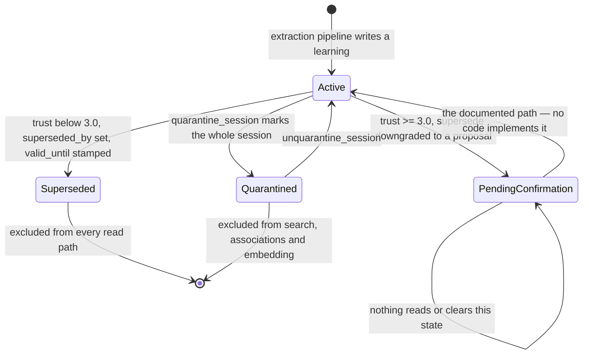

## 1. Executive Summary

YesMem is a Go continuity layer for coding agents — Claude Code, OpenCode,
Codex — that turns session transcripts into categorized *learnings* and puts
them back at the start of the next session. Apache 2.0, about 188,000 lines of
Go, a local SQLite store, a daemon, an MCP server, hooks, an HTTP API and a
substantial CLI. The pitch is explicit that this is not chat memory: the
questions it wants to answer are "why did we choose this architecture", "which
approach failed", "what was still open".

**The mechanism worth the report is trust-graded supersession.** Most systems in
this atlas treat correction as a fixed rule — newer wins, or the extractor's
verdict wins. YesMem computes a trust score per learning from how often it has
been used, where it came from, and how important it was marked, and lets that
score decide *how hard the memory is to overwrite*:

```
trust = (0.5 + log1p(use_count + 2*save_count)) × source_multiplier × (importance / 3)
```

with `source_multiplier` running 2.0 for `user_stated`, 1.8 for `agreed_upon`,
1.0 for `claude_suggested`, 0.8 for `llm_extracted`, and a 1.5× kicker if the
learning was retrieved in the last seven days. Below 1.0 the new record wins
immediately. Between 1.0 and 3.0 it wins with a logged warning. At or above 3.0
the supersede is downgraded to a proposal: `supersede_status` is set to
`pending_confirmation`, and — in the documentation's words — "old learning stays
active until user confirms".

That is the right shape. Something a user stated and the agent has used forty
times should not be silently overwritten by one LLM extraction.

**And the confirmation does not exist.** `pending_confirmation` is written at
exactly two sites (`internal/extraction/evolution.go:130` and
`internal/daemon/handler_learnings.go:193`). Searching every `.go`, `.md`,
`.json` and `.yaml` file in the tree for `supersede_status` or `SupersedeStatus`
returns those two writes, the column in a dozen `SELECT` lists, the struct
field, one setter, and one test. **No query filters on it, no CLI command lists
it, no MCP tool surfaces it, and nothing ever clears it.** So the highest-trust
learnings are the only ones whose corrections are dropped — the new record does
not supersede, the old record keeps ranking, and the "proposal" is a string in a
column no reader consults.

Two other mechanisms are wired in one direction only. `SetStalenessScore` and
`GetStaleLearnings` — the v0.64 feature that scores a learning against the code
it describes, with a `code_fingerprint` and a `staleness_type` vocabulary of
`code_contradicts | code_removed | code_renamed | code_changed_insight_holds` —
are called from nothing but their own test file. Meanwhile
`GetStalenessScores` **is** consumed by the hybrid ranking handler
(`internal/daemon/handler_hybrid.go:681`), so the read path applies a demotion
signal that nothing in production ever writes.

## 2. Mental Model

A learning is a statement with a category, a project, a source, an importance
and a confidence, extracted from a session by an LLM after the fact. It is not
written by the agent in the moment; it is derived by a background pipeline from
what the session contained.

Once written, a learning is subject to four independent forces, and only two of
them work end to end:

- **Supersession** — a later learning replaces it, setting `superseded_by`,
  `supersede_reason` and `valid_until`. Live and heavily used.
- **Quarantine** — an entire session's learnings can be marked
  `quarantined_at`, which removes them from vector search, BM25, associations
  and the embedding refresh in one statement. Live, and reversible.
- **Trust resistance** — a high-trust learning downgrades the supersede to a
  proposal. Half-live: the downgrade happens, the resolution does not.
- **Staleness** — a learning whose underlying code changed gets a score and a
  reason. Read-side only: ranking consults it, nothing writes it.



The self-loop is the finding. A learning that reaches `pending_confirmation`
stays active and stays uncorrected, and the only trace of the attempted
correction is a line in the daemon log.

## 3. Architecture

A local SQLite database, a long-running daemon, and a set of thin clients. The
daemon (`internal/daemon/`) owns extraction, embedding, clustering, briefing
generation, index maintenance and log rotation; the MCP server
(`internal/mcp/`) is a proxy that forwards tool calls to it over a socket. A
separate `cap_store` database holds capability tables created at runtime with
validated DDL.

Vector search is Go-native — an IVF index (`internal/ivf/`) and a bloom filter
layer (`internal/bloom/`) rather than an embedded vector extension, with the
embedding model and tokenizer vendored into `internal/embedding/assets/`. That
choice is what makes the single-binary install honest: there is no Python, no
sidecar, and no C extension to compile.

The MCP layer does one thing worth noting for operators. Every tool call has
`_cwd` injected before it reaches the daemon (`internal/mcp/server.go:117`),
resolved from the *parent* process working directory — with a
platform-specific implementation and a documented exception for OpenCode, whose
TUI keeps a stale PID after a directory rename. So project scope follows the
user's `cd` in real time without the agent having to pass it.

## 4. Essential Implementation Paths

**Session → learnings.** `internal/ingest/` reads transcripts; `internal/parser/`
segments them; `internal/extraction/` calls an LLM per candidate span and writes
`learnings` rows. `internal/extraction/evolution.go` is where a new learning is
compared against existing ones and supersession is decided.

**Query → context.** MCP tool → `internal/daemon/handler_hybrid.go` → FTS5 and
IVF candidates → fusion → association expansion (`internal/storage/associations.go`)
→ staleness demotion → response.

**Session start → briefing.** `internal/briefing/` and
`internal/storage/briefing_queries.go` assemble the project's living state:
active decisions, open work, contradictions between two live learnings, and
stale candidates (older than 90 days, `use_count = 0`, not superseded).

**Maintenance.** `cmd_maintenance.go`, `cmd_gap_review.go`, `cmd_trait_cleanup.go`
and the daemon's tick handle junk cleanup, knowledge-gap triage and archival.

## 5. Memory Data Model

`learnings` has **55 columns** (`internal/storage/schema.go:568`). That number is
the most important architectural fact about this system, and the columns fall
into groups that tell the project's history:

| Group | Columns |
| --- | --- |
| Identity | `id`, `session_id`, `category`, `content`, `project`, `canonical_project` |
| Correction | `superseded_by`, `supersedes`, `supersede_reason`, `supersede_status`, `valid_until`, `quarantined_at` |
| Ranking counters | `hit_count`, `match_count`, `inject_count`, `use_count`, `save_count`, `fail_count`, `noise_count`, `impact_score`, `impact_count`, `stability` |
| Provenance | `source`, `model_used`, `source_file`, `source_hash`, `source_msg_from`, `source_msg_to`, `origin_tool`, `source_agent`, `target_agent`, `attribution`, `dialog_id` |
| Embedding | `embedding_text`, `embedding_vector`, `embedding_status`, `embedding_content_hash`, `embedded_at` |
| Staleness (v0.64) | `staleness_score`, `staleness_reason`, `staleness_checked_at`, `staleness_type`, `code_fingerprint` |

The provenance group is genuinely good: a learning knows which tool produced it,
which agent, which message range of which session, and the hash of the source
file. Very few systems here can answer "which turn did this come from" with a
range rather than a pointer.

The correction group is where the accretion shows. Six columns describe how a
learning stops being true, written by at least four different subsystems, and
one of them has no reader.

## 6. Retrieval Mechanics

FTS5 over `learnings_fts` and dense retrieval over the IVF index, fused, then
expanded through `associations` (a typed edge table keyed on
`(source_type, source_id, target_type, target_id)`), then demoted by staleness,
then cut to a token budget.

Three predicates recur across every read query and they are the system's real
correction surface: `l.superseded_by IS NULL`, `COALESCE(l.quarantined_at, '') = ''`,
and the project clause. They are applied in the SQL rather than as a post-filter,
so the limit is satisfied with eligible rows.

The project clause is where scope is enforced and where it leaks. The strict
form appears in the filtered search path — `l.canonical_project = ?` — but the
FTS paths use `AND (l.canonical_project = ? OR l.canonical_project = '')`
(`internal/storage/learnings_search.go:175`, `:435`). Since `canonical_project`
is `NOT NULL DEFAULT ''`, **every learning written without a resolved project is
visible from every project**. The boundary is real and the default value walks
through it.

`resolveCanonicalProject` is a nice touch on the other side: it maps a path or
alias to a canonical name, and if the static rules do not resolve it, it asks the
database what canonical name previous rows for this project used. Renaming a
directory does not fork a project's memory.

## 7. Write Mechanics

**Writes never block the agent.** Extraction runs in the daemon after a session,
from the transcript. The consequence is that a decision made now is not
retrievable now — it is retrievable after the extraction pass. For a
continuity-across-sessions product that is the right trade, and it means the
"live state" a briefing shows is always the state as of the last extraction.

The evolution pass is where the interesting judgement lives. A new learning is
compared against candidates; if they conflict, the loser is superseded — unless
the loser's trust score says otherwise, in which case
`SetSupersedeStatus(loser.ID, "pending_confirmation")` fires and the code logs
`supersede blocked (trust %.1f, high)`.

`SupersedeLearningBatch` is careful in a way worth copying: before writing, it
rejects self-supersession and walks the chain to reject cycles, with a logged
warning for each, then does mark-and-backlink for the whole batch in one
transaction. A supersession graph that can contain a cycle breaks every
chain-walking read, and this one cannot.

Bulk retraction has two forms. `quarantine_session` marks every learning from a
session and removes it from all four read surfaces — the described use case is
"noisy sessions (testing, debugging, accidental data) that would contaminate the
knowledge base" — and it is reversible. Junk cleanup takes the other route:
`UPDATE learnings SET superseded_by = -1, supersede_reason = 'junk cleanup',
valid_until = datetime('now')`, using `-1` as a sentinel successor. A magic
value in a foreign-key-shaped column is the kind of thing that survives until
someone joins on it.

## 8. Agent Integration

An MCP server, Claude Code hooks (`internal/hooks/`), an OpenCode plugin
(`internal/opencode/`, plus `plugins/`), an HTTP API (`internal/httpapi/`), a
proxy (`internal/proxy/`) and roughly forty CLI subcommands. A `skills/`
directory and a `caps/` capability system extend what the agent can ask for.

The briefing is the primary integration: at session start the agent gets the
project's living state rather than a search result. That is the product, and
everything else is in service of it.

## 9. Reliability, Safety, and Trust

**Scope — awarded, with the leak stated.** `canonical_project` is a stored key
applied as a read-path predicate on every learning query, derived automatically
from the caller's working directory. The `OR l.canonical_project = ''` escape in
the FTS paths means unscoped rows are globally visible, which is a real hole in
a multi-project store and a deliberate-looking compatibility choice for rows
written before canonicalization existed.

**Audit log — no.** There is no mutation log table. `supersede_reason`,
`valid_until` and the daemon's stdout carry the history, and log rotation
(`internal/logrotate/`) means the stdout half is not durable.

**Trust state — no, and this is the near-miss that defines the system.**
`supersede_status` is a text column that takes one value in practice and is read
by nothing. `TrustLevel` is computed at decision time from counters and never
persisted. So there is a trust *model* and no trust *state*: nothing on the row
says what the system currently believes about it.

**Human review — no.** The gate the trust model builds hands off to a human who
has no surface to act on. `cmd_gap_review.go` is a review command, but it
reviews *knowledge gaps* — open questions the assistant could not answer —
using an LLM to rate each as `resolved`, `noise` or `keep`, not a person
adjudicating memory content.

**Tombstone — no.** The word does not appear in the tree. Supersession is
record-keyed with a `superseded_by` pointer; nothing keys on the value, so a
re-extracted claim lands fresh.

**Bitemporal — no.** `valid_until` is set when a learning is retired and is used
as a currency predicate (`valid_until IS NULL`), not as a validity bound in an
as-of query. There is no read path that reconstructs what was believed at an
earlier time.

**Negative eval — no.** 355 test files, none asserting that particular material
must not be retrieved.

## 10. Tests, Evals, and Benchmarks

**No paper.** No arXiv link, DOI, BibTeX or `CITATION.cff` in the tree.

355 Go test files, including targeted suites for the trust model
(`internal/storage/trust_test.go`), supersession chains, staleness CRUD, journal
size limits and SQL injection in the query builder. **I did not run them** —
the screen flagged a `Makefile` whose default target should be checked before a
bare `make`, so the tree was read and nothing was executed.

The LoCoMo benchmark (`docs/BENCHMARK.md`) is careful in ways worth crediting.
It runs against **LoCoMo-10 Corrected**, a version fixing 99 gold-answer errors
found by an independent community audit at a 6.4% error rate, with the
corrections committed to `testdata/locomo/locomo10_corrected.json` — so the
claim can be checked against the same data. It reports agentic mode (0.87
overall with Claude Opus, 0.86 with gpt-5.4) *and* static single-pass mode
(0.67), making explicit that a fifth of the headline comes from letting the model
search iteratively rather than from the memory layer. It names its weakest
category, temporal at 0.60, and argues rather than hides why it is weak.

The one caveat a reader should apply: the Opus number is a 150-question 10%
sample, stated as such, and validated by convergence with the full gpt-5.4 run
rather than by a full run of its own.

## 11. For Your Own Build

### Steal

- **Grade correction resistance by what a memory has earned.** A trust score
  from use count, stated source and importance, with thresholds that change the
  *behaviour* rather than just the ranking, is a better answer than "newest
  wins" and costs one function.
- **Weight the source explicitly.** `user_stated` at 2.0 against `llm_extracted`
  at 0.8 encodes the thing every memory system knows and few write down: an
  extraction is a guess and a statement is not.
- **Reject supersession cycles before writing.** Self-loops and cycles in a
  `superseded_by` chain break every chain-walking read, and the check is a
  dozen lines in the batch path.
- **Make quarantine a session-level operation.** The failure this addresses —
  one debugging session poisoning the knowledge base — is real, and marking the
  whole session in one statement is far more usable than deleting rows
  individually. Reversibility makes it safe to use aggressively.
- **Resolve project identity through the database.** Asking what canonical name
  previous rows used means a renamed directory does not fork a project's memory.
- **Benchmark against a corrected dataset and say so.** Running LoCoMo against a
  community-audited fix set, with the corrections committed, is a better
  practice than the headline number it produces.
- **Publish the static-mode score beside the agentic one.** It separates what
  the memory layer did from what iterative search did.

### Avoid

- **Do not ship a gate whose release valve is unimplemented.** This is the
  lesson of the whole report. `pending_confirmation` makes the *most trusted*
  memories the only ones whose corrections are silently discarded — the
  mechanism is not merely incomplete, it inverts on the population it was built
  to protect.
- **Do not consume a signal nothing writes.** The ranking path applies a
  staleness demotion that is always zero. It will look like it works until the
  day someone wires the writer and every score shifts.
- **Do not let 55 columns accrete on the memory row.** Six of them describe
  correction, written by four subsystems, and one has no reader. The count is
  how the unwired mechanisms stayed invisible.
- **Do not use a magic id as a supersession sentinel.** `superseded_by = -1`
  for junk cleanup means any join on that column has a special case waiting.
- **Do not let the empty string be a scope.** `OR canonical_project = ''` makes
  every unclassified row global.

### Fit

This suits a developer running long-lived projects through Claude Code or
OpenCode who wants session-start continuity and is happy with a single Go binary
and a local database. The install is genuinely simple and the briefing is the
feature.

It is not for anyone who needs a memory that is correct on demand. Extraction is
asynchronous, so what was decided this session is not visible until the pipeline
runs, and the correction path has a documented hole in exactly the place a
careful reader would check first. At 188,000 lines with a daemon, a proxy, a
capability system and forty CLI subcommands, borrowing a subsystem is not
realistic — read `internal/storage/trust.go`, which is sixty lines and contains
the idea.

## 12. Open Questions

- **Was `pending_confirmation` ever resolvable?** The changelog lists the column
  as shipped in four separate entries and the documentation describes the user
  confirming. Whether the surface was removed or never built is not answerable
  from this commit.
- **What happens as `pending_confirmation` rows accumulate?** Nothing clears
  them, so a long-lived store collects high-trust learnings carrying a stale
  proposal, each of which has already had at least one correction discarded.
- **Is the staleness writer external?** `code_fingerprint` implies a scanner
  comparing stored hashes against current code, and `internal/codescan/` exists;
  no path from it to `SetStalenessScore` was found.
- **How much of the LoCoMo 0.87 is the memory layer?** The static-mode figure of
  0.67 answers part of it; a comparison against the same agentic loop with no
  memory would answer the rest, and is not committed.

## Appendix: File Index

**The trust model** — `internal/storage/trust.go` (`ClassifyTrust`,
`TrustScore`), `internal/storage/trust_test.go`,
`docs/features/memory.md` §2.7

**Supersession** — `internal/extraction/evolution.go:130`,
`internal/daemon/handler_learnings.go:193`,
`internal/storage/learnings.go:1026-1100` (`SupersedeLearningBatch`, cycle
detection), `:1531` (`SetSupersedeStatus`), `internal/storage/learnings_chain_test.go`

**The unwired staleness path** — `internal/storage/learnings.go:857`
(`SetStalenessScore`), `:871` (`GetStalenessScores`), `:901`
(`GetStaleLearnings`), `internal/daemon/handler_hybrid.go:681` (the only
production consumer), `internal/storage/learnings_staleness_test.go`

**Quarantine** — `internal/storage/query_clusters.go:218`,
`internal/storage/learnings_search.go:95`, `internal/storage/associations.go`,
`internal/storage/learnings_embedding.go:116`

**Schema** — `internal/storage/schema.go` (`tableLearnings` at `:568`,
migrations from `:12`), `internal/models/models.go`

**Retrieval** — `internal/storage/learnings_search.go`,
`internal/daemon/handler_hybrid.go`, `internal/ivf/`, `internal/bloom/`,
`internal/embedding/`, `internal/storage/associations.go`

**Scope** — `internal/storage/learnings.go:18` (`resolveCanonicalProject`),
`internal/mcp/server.go:117`, `internal/mcp/parent_cwd*.go`

**Extraction and briefing** — `internal/extraction/`, `internal/ingest/`,
`internal/parser/`, `internal/briefing/`,
`internal/storage/briefing_queries.go`

**Integration** — `internal/mcp/`, `internal/hooks/`, `internal/opencode/`,
`internal/httpapi/`, `internal/proxy/`, `plugins/`, `skills/`

**Benchmark** — `docs/BENCHMARK.md`, `testdata/locomo/`, `cmd_locomo.go`,
`internal/benchmark/`

## History

**2026-08-09** — [`b1ad72ef9fd508180afaef1ca46c87a17a3c675c`](https://github.com/carsteneu/yesmem/commit/b1ad72ef9fd508180afaef1ca46c87a17a3c675c) — first reading. Screened before reading: no auto-run surface, build-time execution via the `Makefile` default target, one unpinned dependency surface in the OpenCode plugin, `go.sum` unchanged for 17 days. The tree was read, never built, and no test or benchmark was run.
