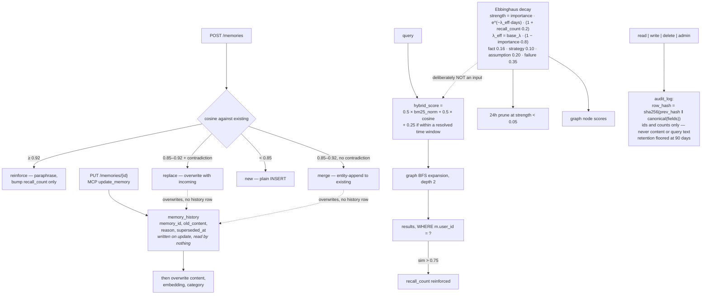

## 1. Executive Summary

YourMemory is a persistent memory service — FastAPI over Postgres, SQLite or
DuckDB, an MCP server, hook templates, a Cloudflare worker, and an
Ebbinghaus-derived decay model.

**Two decisions in it are better than most of this atlas manages.**

**First, decay is deliberately excluded from ranking**, and `BENCHMARKS.md` says
why:

> "Decay is intentionally excluded from the ranking formula — multiplying cosine
> by strength would penalise old-but-valid memories below newer irrelevant ones.
> Instead, decay governs the 24h pruning job (threshold 0.05) and graph node
> scores."

The code backs the claim. `_score_candidates` computes `strength` per candidate
for display and pruning and never multiplies it into the score:

```python
hybrid_score = W_BM25 * bm25_norm + W_VECTOR * m["similarity"]
hybrid_score += temporal_score_boost(m.get("created_at"), temporal_range)
```

— `src/services/retrieve.py:410-411`, with `W_BM25 = 0.5` and `W_VECTOR = 0.5` at
`:21-22` and `TEMPORAL_BOOST = 0.25` at `src/services/temporal.py:14`. Decay
decides what gets *deleted* and how the graph weighs a node, not what wins a
query. This atlas has repeatedly found systems where an exponential decay term in
the score turns age into a veto; here the failure is named and the term is simply
not there.

**The published formula is not the shipped one, though.** `BENCHMARKS.md:239-241`
prints `hybrid_score = 0.4 × bm25_norm + 0.6 × cosine_similarity` and omits the
temporal term the service adds unconditionally. The divergence runs deeper than a
stale document — section 10 has it — but the exclusion of decay, which is the
interesting decision, is the part the code and the document agree on.

The decay itself is type-dependent —
`base_λ: fact=0.16, strategy=0.10, assumption=0.20, failure=0.35` — so an
assumption fades faster than a fact and a recorded failure fastest of all, with
`λ_eff = base_λ × (1 − importance × 0.8)` letting importance slow it and
`(1 + recall_count × 0.2)` letting use strengthen it.

**Second, the audit log does not become a copy of the data it audits.**
`src/services/audit.py` is a hash-chained append-only record of every read, write,
delete and admin action, and its design notes carry the constraint most audit
implementations miss:

> "Privacy: we log memory *ids* and lightweight metadata (counts, query length) —
> never raw memory content or query text — so the audit log itself isn't a
> data-leak vector."

Plus a retention floor — "prune_expired() deletes rows older than the retention
window, which is floored at 90 days (a smaller value is silently raised to 90)" —
so the audit cannot be configured away.

**And the benchmark reporting is in the top tier of this corpus** — with one
caveat about which ranker produced the figures, in section 10.

## 2. Mental Model

A memory is a typed statement with an importance and a recall count. Writing one
compares it against what exists and takes one of four actions by similarity band.
Retrieval is lexical plus semantic, then a graph walk. A nightly job prunes what
has decayed below threshold.



## 3. Architecture

`src/services/` is the engine — `retrieve`, `resolve` (and a fallback),
`extract` (and a fallback), `embed`, `decay`, `compaction`, `temporal`,
`session`, `hook_sync`, `agent_registry`, `api_keys`, `auth`, `audit`. `src/db/`
carries one connection layer with three schemas — `schema.sql`,
`sqlite_schema.sql`, `duckdb_schema.sql` — and a migrator.

Around it: an MCP server (`memory_mcp.py`), hook templates, a Cloudflare worker,
Docker, a Railway config, a PyInstaller spec, a marketing site and an
`llms.txt`.

The `_fallback` pairs — `resolve_fallback.py` beside `resolve.py`,
`extract_fallback.py` beside `extract.py` — are worth noting: the LLM-dependent
paths have non-LLM counterparts, so the system degrades rather than stopping when
a model is unavailable.

## 4. Essential Implementation Paths

**Resolve a write** — `src/services/resolve.py` (the four-band policy `:1-9`),
`resolve_fallback.py`.

**Rank** — `src/services/retrieve.py` (the user filter `:32-40`, `:89`, the
weights `:21-22`, `_score_candidates` `:382-424` and the score itself `:410-411`),
`src/services/temporal.py` (`TEMPORAL_BOOST` `:14`, `score_boost` `:80-96`).

**Supersede** — `src/routes/memories.py:237-268` and `memory_mcp.py:787-816`
write `memory_history` before the overwrite; `src/routes/memories.py:98-116` and
`memory_mcp.py:570-597` do not.

**Decay and prune** — `src/services/decay.py`, `src/services/compaction.py`
(`user_id`-scoped scans `:85-92`, `:161`, `:232`).

**Audit** — `src/services/audit.py` (the design docstring `:1-21`, `GENESIS`
`:29`, `verify_chain`, `prune_expired`).

## 5. Memory Data Model

A memory carries content, an embedding, a type, an `importance`, a
`recall_count`, and timestamps. The `memories` row has no status column and no
`superseded_by` pointer. Three backends share one schema shape.

**Superseded content is kept, in a second table.** All three schemas define it
under the same comment — *"Feature: supersession audit log"* — at
`src/db/schema.sql:77-85`, `sqlite_schema.sql:70-78` and `duckdb_schema.sql:28-35`:

```sql
CREATE TABLE IF NOT EXISTS memory_history (
    id            SERIAL PRIMARY KEY,
    memory_id     INTEGER NOT NULL,
    old_content   TEXT NOT NULL,
    reason        TEXT NOT NULL DEFAULT 'update',
    superseded_at TIMESTAMP DEFAULT NOW()
);
```

It is written, not decorative. The HTTP update route
(`src/routes/memories.py:237-268`, under *"Supersession: log old content before
overwriting"*) reads the prior row, checks ownership, and inserts the old content
before the `UPDATE`; the MCP `update_memory` tool does the same at
`memory_mcp.py:787-816`. `tests/test_features.py:260-300` asserts the row lands
with `reason='update'`.

**The dedup path is the one that skips it.** `resolve.py`'s `replace` and `merge`
outcomes are applied by the write endpoint itself, and that branch —
`src/routes/memories.py:98-116` on HTTP, `memory_mcp.py:570-597` on MCP — issues
`UPDATE memories SET content = …` with no `memory_history` insert above it. So
the correction path that runs *without a person naming a memory id* is exactly
the one that discards what it replaced. The contradiction was detected — the
system *knows* the two statements conflict, which is more than most here manage —
and on that branch the outcome is an overwrite.

Two smaller things about the log. Nothing reads it back: `FROM memory_history`
appears in `tests/test_features.py` and nowhere under `src/`, in `memory_mcp.py`
or in `main.py`, so there is no endpoint or tool that returns a memory's prior
values. And the table carries no `user_id`, so scoping a read of it would mean
joining back through `memories` — the `WHERE user_id = ?` discipline that earns
`scope_enforced` on every other read path has no counterpart here, because there
is no read path.

## 6. Retrieval Mechanics

`hybrid_score = 0.5 × bm25_norm + 0.5 × cosine_similarity`, plus a flat `+0.25`
for any memory whose `created_at` falls inside a time window parsed out of the
query by `detect_temporal_range`, then graph BFS to depth 2, with
`multi-qa-mpnet-base-dot-v1` as the embedder — chosen, per
`BENCHMARKS.md`, because it is "retrieval-tuned, question→passage" rather than
symmetric, and the switch is credited with most of the gain over
`all-mpnet-base-v2`.

`WHERE m.user_id = ?` on the retrieval query, on the compaction scans and on the
audit read earns `scope_enforced`.

Memories above similarity `0.75` have their `recall_count` reinforced on
retrieval — so use feeds back into the decay strength, which feeds the pruning
job, which is a closed loop that never touches ranking.

## 7. Write Mechanics

`resolve.py` is a clean four-way collision policy:

- **≥ 0.92** — reinforce: it is a paraphrase, bump `recall_count` only.
- **0.85–0.92 with a contradiction** — replace.
- **0.85–0.92 without one** — merge by entity-append.
- **< 0.85** — new.

Splitting the middle band by *whether the two statements contradict each other*
is the right question to ask there, and the atlas has seen very few systems ask
it: most treat 0.85–0.92 as "close enough to merge" regardless of whether the
overlap is agreement or conflict.

## 8. Agent Integration

An MCP server, Claude Code hook templates with a `hook_sync` service, a
`sample_CLAUDE.md`, `MEMORY_RULES.md`, a FastAPI HTTP surface with API keys and
an agent registry, a Cloudflare worker, Docker and Railway configs, and a
single-binary build.

## 9. Reliability, Safety, and Trust

**Two marks: scope enforced and audit log.**

**The audit implementation is among the best in this atlas**, and for reasons
beyond the hash chain:

- `row_hash = sha256(prev_hash ‖ canonical(fields))` from a `GENESIS` of zeros,
  with `verify_chain()` — "Any later edit or deletion inside the retained window
  breaks the chain and is detected."
- It covers **reads** as well as writes and deletes, with an action class and a
  source surface (`http` | `mcp`).
- **It refuses to store the content it audits.** Ids, counts and query *length* —
  not query text. An audit log that mirrors the memory store doubles the blast
  radius of a breach, and almost nothing else in this corpus addresses that.
- **Retention has a floor**, silently raised to 90 days, so shortening it is not
  a way to erase the trail.
- **It fails open, and names the compensating control**: "logging never raises
  into the caller; a logging failure must not break a memory operation. Integrity
  gaps are themselves detectable via `verify_chain()`." Failing open on an audit
  is a real trade-off; failing open *and* being able to detect the gap
  afterwards is a considered one.

**`SOC2_READINESS_REPORT.md` is labelled honestly.** "Report type: Internal
readiness self-assessment (NOT a SOC 2 attestation)… Prepared by: Automated
codebase assessment (Claude Code)… This is **not** a SOC 2 report — only a
licensed CPA firm can issue [one]." A compliance-shaped document in a repository
is a thing buyers misread; naming it as machine-generated and non-attesting on
line 2 is the right handling.

**Trust state, tombstone, bitemporal, human review, negative eval — no.**

`memory_history` is the one that deserves an explicit ruling, because it is close
enough to two marks to be mistaken for either. It is not a **tombstone**: the
rubric wants a durable record of a *rejected value*, keyed on the value, and this
is keyed on `memory_id` and holds the string that was replaced. Nothing on the
write path hashes incoming content and asks whether it has been thrown out
before, so re-extraction of a superseded claim produces a fresh row and walks
straight past the log. It is not **bitemporal** either — `superseded_at` is when
the record changed, not when the fact stopped holding, and there is no valid-time
column anywhere in the three schemas. What it does is reinforce the `audit_log`
mark `src/services/audit.py` earns on its own, by putting the *value* somewhere
the hash-chained log deliberately refuses to keep it.

The sharpest absence is section 5's: the branch that corrects a memory
automatically is the branch that writes no history row.

## 10. Tests, Evals, and Benchmarks

**Three external datasets, dated runs, committed scripts, and reporting that
belongs beside [Fidelis](../fidelis/) and [TeleMem](../telemem/).**

`BENCHMARKS.md` covers LongMemEval-S, LoCoMo-10 and HotpotQA, plus two internal
efficiency measurements, with full citations to all three dataset papers.

**It leads with the strict metric.** The LongMemEval headline is
**`recall_all@5` = 84.8%** — "all gold sessions must appear in top-5" — with
`recall_any@5` of 95.8% reported *beside* it rather than instead of it. Choosing
the harder number as the headline when the easier one is eleven points better is
rare.

**It publishes the ablation that attributes the gain.** "Graph BFS expansion adds
~+0.8pp on recall-all@5. The switch to `multi-qa-mpnet-base-dot-v1`… accounts for
the improvement over the symmetric `all-mpnet-base-v2` baseline." The graph — the
architecturally interesting part — is credited with 0.8 points, and the embedding
swap with the rest. Most projects would let the reader assume the architecture
did it.

**The LoCoMo table carries 95% confidence intervals, sample completion counts,
and a disclosure that hurts its own margin:**

> "\* Supermemory exhausted its free-tier quota (10,000 queries) at sample 5.
> Mem0 exhausted its quota (1,000 ops) at sample 7. Hits computed over all 1,534
> pairs using 0 for unfinished samples — **figures would likely improve on a full
> run**."

Then a per-sample breakdown restricted to "YourMemory vs Zep — both completed all
10 samples", so the headline comparison is like-for-like, and an explanation of
the gap that is a hypothesis rather than a boast: "Zep's LLM-based extraction
condenses sessions into abstract facts, losing the specific dates, names, and
events that LoCoMo QA pairs target."

That last sentence is also the caveat the document does not draw: it is a
statement that YourMemory's representation happens to suit *this benchmark's
question style*, which is the workload-transfer point Fidelis makes explicitly
about its own paths. A reader should take the 59%-versus-28% as a result about
LoCoMo-style questions, which is what it is.

**The harnesses do not run the service's weights.**
`benchmarks/longmemeval_fullstack.py:50` heads its constant block
*"Production constants (mirror retrieve.py)"* and then sets `W_BM25 = 0.4`,
`W_VECTOR = 0.6` at `:54-55`; `benchmarks/locomo_qa_model.py:36-37` carries the
same pair. `src/services/retrieve.py:21-22` has `0.5` and `0.5`, and adds
`temporal_score_boost` at `:411` that neither harness applies on its direct-match
path (`longmemeval_fullstack.py:227`, `locomo_qa_model.py:106`). The rest of each
script is a careful reimplementation — the same thresholds, the same
`REINFORCE_THRESHOLD`, the same graph depth, and a docstring at `:15-19` listing
which production fixes it reproduces — which is what makes the two constants
worth naming rather than shrugging at: the numbers in section 10 were produced by
a ranker that is one edit away from the shipped one and is not it. The
84.8% is a result about `0.4/0.6` without a temporal term.

That also explains the `BENCHMARKS.md:241` formula, which matches the harnesses
rather than the service. Which set is intended is a question for the maintainer;
what is checkable is that they differ.

Five test files under `tests/`, which is thin against the benchmark
infrastructure. `tests/test_features.py:260-300` is the one that covers
supersession.

**I ran nothing.** Every figure above is read from the repository's own
`BENCHMARKS.md`.

## 11. For Your Own Build

### Steal

- **Keep decay out of the ranking formula.** "Multiplying cosine by strength
  would penalise old-but-valid memories below newer irrelevant ones." Let decay
  drive pruning and graph weights; let relevance drive rank.
- **Make the decay rate depend on the claim type.** A recorded failure (0.35)
  should fade faster than a strategy (0.10), and importance should slow the
  constant rather than being a separate multiplier.
- **Split the ambiguous similarity band by contradiction.** Between 0.85 and
  0.92, "does this conflict with what we have" is the question that decides
  between merge and replace — and most systems never ask it.
- **Do not log memory content in your audit trail.** Ids, counts and query
  *length*. An audit log that mirrors the store doubles what a breach exposes.
- **Floor your audit retention.** Silently raising a shorter window to 90 days
  means the trail cannot be configured away.
- **If your audit fails open, say so and name the detector.** `verify_chain()`
  makes the gap findable, which is what turns failing open from a shortcut into a
  trade-off.
- **Audit reads, not just writes.** With an action class and the source surface
  (`http` | `mcp`) on every row.
- **Ship non-LLM fallbacks beside the LLM paths.** `resolve_fallback.py` and
  `extract_fallback.py` mean a missing model degrades the system instead of
  stopping it.
- **Lead with the strict metric.** `recall_all@5` at 84.8% with `recall_any@5` at
  95.8% printed next to it.
- **Attribute the gain to the component that produced it**, even when it is the
  boring one — the embedding swap, not the graph.
- **Disclose when a competitor's number is depressed by your measurement
  constraints**, and say their figures "would likely improve on a full run".
- **Restrict the headline comparison to the systems that completed the run.**
- **Label a compliance document as not being an attestation, on line 2.**

### Avoid

- **Put the supersession write inside the function that overwrites, not beside
  the caller.** One table, two writers that log to it and two that do not, is
  what happens when the history insert lives in the route handler rather than in
  the update itself. The branch that skipped it is the automatic one.
- **Do not let the benchmark harness carry its own copy of the production
  constants.** A comment saying *"mirror retrieve.py"* over a literal `0.4` is
  the failure mode; importing the module's own `W_BM25` would have made the
  drift impossible.
- **Do not let a representation advantage read as a general one.** "Zep's
  extraction loses the dates and names LoCoMo targets" is a statement about the
  benchmark's question style as much as about Zep.
- **Do not let five test files carry three benchmark suites.** The benchmark work
  is careful; the unit-test coverage is not proportionate to it.

### Fit

A good fit for a self-hosted single-user or small-team memory service where you
want an audit trail that would survive a compliance conversation and a decay
model that prunes rather than distorts ranking.

Read `BENCHMARKS.md` and `src/services/audit.py` regardless. The first is a model
for reporting; the second is the only audit implementation in this atlas that
treats the log itself as a privacy surface.

## 12. Open Questions

- **Is the `memory_history` gap on the `replace` branch intended?** The two
  explicit update paths log the old content and the two dedup-driven ones do not;
  whether that is a deliberate scoping of the feature to human-named ids or an
  omission is not answerable from the tree.
- **Which ranking weights are the intended ones — `0.5/0.5` or `0.4/0.6`?**
  `retrieve.py` and the benchmark harnesses disagree, and `BENCHMARKS.md` sides
  with the harnesses.
- **What reads `memory_history`?** Nothing in the repository does. Whether a
  console or an operator query is meant to is not visible here.
- **How is contradiction detected in the 0.85–0.92 band?** `resolve.py` names it;
  the detector was not traced.
- **Are the decay constants tuned?** `fact=0.16` through `failure=0.35` are
  plausible and no ablation appears.
- **Does `verify_chain()` run anywhere automatically?** It exists; a scheduled
  caller was not found.

## Appendix: File Index

**Audit** — `src/services/audit.py` (the design docstring: chain, retention
floor, privacy constraint and fail-open rationale `:1-21`, `GENESIS` `:29`, the
`actor_user_id` filter `:120`)

**Write resolution** — `src/services/resolve.py` (the four-band policy `:1-9`),
`src/services/resolve_fallback.py`, `src/services/extract.py`,
`src/services/extract_fallback.py`

**Retrieval and decay** — `src/services/retrieve.py` (`user_id` predicates
`:32-40`, `:89`, the hybrid weights `:21-22`, `_score_candidates` `:382-424` with
the score at `:410-411`), `src/services/decay.py`, `src/services/compaction.py`
(`:85-92`, `:161`, `:232`), `src/services/temporal.py` (`TEMPORAL_BOOST` `:14`,
`score_boost` `:80-96`)

**Supersession** — `src/routes/memories.py` (the logged update `:237-268`, the
unlogged dedup replace/merge `:98-116`), `memory_mcp.py` (the logged update
`:787-816`, the unlogged dedup replace/merge `:570-597`),
`tests/test_features.py` (`:260-300`)

**Storage** — `src/db/connection.py`, `schema.sql` (`memory_history` `:77-85`),
`sqlite_schema.sql` (`:70-78`), `duckdb_schema.sql` (`:28-35`), `migrate.py`

**Benchmarks** — `BENCHMARKS.md` (LongMemEval-S with the strict metric and the
ablation `:7-42`, the temporal-boost ablation `:43-68`, LoCoMo-10 with CIs and
the quota disclosure `:69-115`, the per-sample like-for-like table `:98-114`,
HotpotQA `:149-186`, token and LLM-call savings `:187-221`, decay-based pruning
`:222-236`, the scoring formula and the decay-excluded-from-ranking rationale
`:237-255`, dataset citations `:256-271`),
`benchmarks/longmemeval_fullstack.py` (the "mirror retrieve.py" constant block
`:50-58`, the direct-match score `:227`),
`benchmarks/locomo_qa_model.py` (`:36-37`, `:106`)

**Compliance** — `SOC2_READINESS_REPORT.md` (the not-an-attestation framing
`:1-12`), `SECURITY.md`, `MEMORY_RULES.md`

## History

**2026-08-31** — [`0bda3e0331e67b357832735f6beec3d3f7fb022e`](https://github.com/sachitrafa/yourmemory/commit/0bda3e0331e67b357832735f6beec3d3f7fb022e) — same pin, two corrections, both in the direction of the report being harsher and looser than the code. Section 5 asserted "no supersession pointer and no tombstone… the prior content is gone from the store", and an open question said no supersession record was found. All three schemas define `memory_history` under the comment "Feature: supersession audit log" (`src/db/schema.sql:77-85`) and both explicit update paths write it before overwriting (`src/routes/memories.py:237-268`, `memory_mcp.py:787-816`). The criticism survives narrowed to the dedup-driven `replace`/`merge` branch (`src/routes/memories.py:98-116`, `memory_mcp.py:570-597`), which overwrites with no history insert, and to the fact that nothing in the repository reads the table back. `tombstone` was re-checked against the rubric and stays withheld: the log is keyed on `memory_id`, not on the rejected value. No mark moved. Second, the ranking formula was taken from `BENCHMARKS.md:241` rather than from code: `src/services/retrieve.py:21-22` sets `W_BM25 = W_VECTOR = 0.5`, not `0.4/0.6`, and `:411` adds an unconditional `temporal_score_boost` the document's formula omits. The two committed benchmark harnesses carry the document's constants under a comment reading "Production constants (mirror retrieve.py)", so the published figures describe a ranker the service does not run.

**2026-08-09** — [`0bda3e0331e67b357832735f6beec3d3f7fb022e`](https://github.com/sachitrafa/yourmemory/commit/0bda3e0331e67b357832735f6beec3d3f7fb022e) — first reading. Screened before reading; the tree was read, never installed, and no benchmark was run. The figures in section 10 are read from the repository's own `BENCHMARKS.md`.
